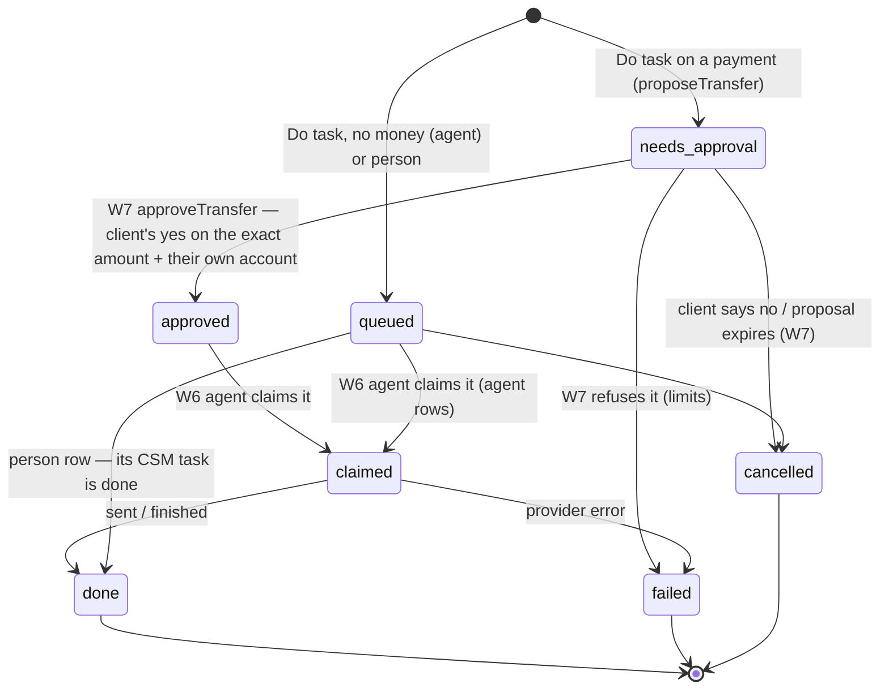

# FinanceOS money agent tasks — the contract (W5 → W6, W7)

FinanceOS wave 5, unit W5 (`ops/workflows/finance-os-wave5-2026-10-06.md`).
Owner (2026-10-06): "AI tells you exactly what to do; press 'Do task' to assign
actions to AI agents." Money moves only with the client's approval of that exact
transfer, inside set limits.

This file is the contract between three units:

- **W5** (built): the "What to do next" list, the **Do task** press, the queue
  table, and the transfer **proposal** seam.
- **W6** (money agent on `src/agents/`): reads the queue and works it.
- **W7** (Plaid sandbox Transfer): approves and sends proposals.

## 1. Where tasks come from

`GET /api/money/tasks` (`api/money/tasks.mjs` → `src/finance/money-tasks.mjs`)
lists a client's next steps. Every step is a row that already exists:

| Step | Read from | Task id |
|---|---|---|
| A payment owed to Fundhub (Clarity / BNPL) — the plan's **oldest unpaid** payment, late or due within 14 days | `listClarityPayments` (`src/finance/clarity-payments.mjs`) | `clarity:<installment id>` |
| A card payment due within 14 days (statement minimum) | `moneyOverview().debt.cards` (`src/finance/money-overview.mjs`) | `due:<bank_account id>:<date>` |
| A late card payment (no payment on file since the statement) | `cardLateItem` (`src/finance/money-agent.mjs`) | `due:<bank_account id>:<date>` |
| A loan payment due within 14 days | `moneyOverview().debt.loans` | `due:<bank_account id>:<date>` |
| An open checklist step the client owns (not no-new-credit) | `client_waypoints` | `waypoint:<id>` |
| The UnderwriteIQ tip, verbatim | `moneyOverview().tip` | `uwiq:<sha1 12>` |
| A plan pin from any other source (bank strategy, funding rounds, payoff) | W1 `allPins`, see §7 | the pin's id |

Each task: `{ id, title, why, due_on, kind, can_do, late_days, amount_cents,
moves_money, transfer: { to_kind, to_account_id, amount_cents } | null, source,
from, link, assignment }`. `kind` is a plan-pin kind: `due | pay_down | deposit |
open_account | apply | checkpoint | other`.

### Who can do it — `can_do`

| When | can_do | Why |
|---|---|---|
| A payment with a known amount and a known place to send it (card / loan on file, a plan with Fundhub, or an account a plan pin names in `to_account_id`) | `agent` | The money agent can set it up. It is a **proposal**: nothing moves until the client approves that exact amount and the account it comes from. |
| A payment whose amount is not on file | `self` | Nothing exact to propose. The client pays it in their bank or card app. |
| Checklist step `personal_loan` ("Talk to your advisor…") | `person` | The step is a talk with a person. |
| A plan pin of kind `apply` | `person` | Funding applications go through a person (the Blueprint's closer path). |
| Any other step, pin, or the tip | `self` | Only the client can file an LLC, open an account, or pay a card down. |

The same table is `CAN_DO_RULES` in `src/finance/money-tasks.mjs`. **Today every
`agent` task moves money.** A non-money agent task is supported by the queue
(`queued` below) but no reader produces one yet; W6 adds a row to `CAN_DO_RULES`
and a reader when it has a tool for one.

## 2. The press — `POST /api/money/tasks { action: "do_task", task_id }`

`doTask` (`src/finance/money-tasks.mjs`) **rebuilds the client's own list from the
database** and finds the task by id. Nothing the browser sends — a title, an
amount, an account — is used, so a forged amount cannot become a proposal.

| can_do | What the press does |
|---|---|
| `agent` + moves money | `proposeTransfer(...)` → one `money_agent_tasks` row, status `needs_approval` |
| `agent`, no money | one row, status `queued`, for the agent to claim |
| `person` | one row (assignee `person`, status `queued`) + one CSM task (`createTask`, role `csm`, source_workflow `money-task`, eventId `money-task:<row id>`), linked by `staff_task_id` |
| `self` | refused: `409 self_task` |

One open row per task per client (`money_agent_tasks_one_open`). A second press
while one is open writes nothing and answers with it. The press writes one
`money_agent_log` row: action `task_assigned`, item_kind `money_task`, key
`money-task:<row id>:assigned`.

The CSM task's source is `money-task`, **not** the helper's `money-agent`: an open
`money-agent` task pauses the helper's texts (`clientFacts.handedToPerson`), and
"help me with my advisor call" must not stop payment reminders.

## 3. The queue — `money_agent_tasks` (migration 464)



| Column | Meaning |
|---|---|
| `task_key` | the task id from §1 |
| `assignee` | `agent` or `person` |
| `status` | `queued`, `needs_approval`, `approved`, `claimed`, `done`, `failed`, `cancelled` |
| `moves_money`, `amount_cents`, `to_kind`, `to_account_id` | the proposal — integer cents, `to_kind` ∈ `bank_account`, `card`, `loan`, `fundhub` (no account) |
| `from_account_id`, `approved_at`, `approved_by_account_id` | set by W7's approval — the client's own account, picked when they approve |
| `staff_task_id` | the CSM task for a person row |
| `requested_by_kind`, `requested_by_staff_id` | the client pressed it, or staff (FINANCE) on their behalf |
| `claimed_by`, `claimed_at`, `done_at`, `result` | the agent side (W6) |
| `detail` | the facts the task was built from, frozen at the press |

**The database refuses** (so no screen, agent or engine can skip it):

- a money row with no amount or no destination (`money_agent_tasks_money_shape_ck`);
- a money row that is `queued` — handed straight to the agent (`..._money_never_queued_ck`);
- a money row that is `approved`, `claimed` or `done` without `approved_at` **and**
  `from_account_id` (`..._money_needs_ok_ck`);
- an approval on a row that moves no money (`..._approval_is_money_ck`);
- a money row handed to a person (`..._person_no_money_ck`);
- `to_kind = 'fundhub'` with an account, or any other `to_kind` without one (`..._destination_ck`).

## 4. What the money agent (W6) consumes

1. **Claim** one row at a time, oldest first:

   ```sql
   UPDATE money_agent_tasks SET status = 'claimed', claimed_by = $brain, claimed_at = now()
    WHERE id = (SELECT id FROM money_agent_tasks
                 WHERE assignee = 'agent' AND status IN ('queued', 'approved')
                 ORDER BY created_at
                 FOR UPDATE SKIP LOCKED LIMIT 1)
    RETURNING *;
   ```

   Index: `money_agent_tasks_queue_idx`. There is no event yet — the table is the
   queue (canonical events are the owner's call; see `src/finance/PROPOSED-EVENTS.md`).
   A cron sweeper is enough.
2. **Approved money rows**: call W7's engine with the row as approved (amount,
   `from_account_id`, `to_kind`, `to_account_id`). Never change the amount or the
   accounts. Never act on a `needs_approval` row except to remind the client
   (texts follow the helper's caps: claim first in `money_agent_log`, one client
   text a day, `sendTemplated` only queues).
3. **Finish**: `status = 'done'` with `done_at = now()` (the CHECK needs it), or
   `'failed'`. Put `{ client_message: "<plain words, ≤ 200 chars>" }` in `result`
   for a failure — the page shows it as is. Staff detail goes in other keys.
4. **Log** one `money_agent_log` row per finish: action `task_done`, `task_failed`
   or `task_cancelled`, item_kind `money_task`, item_id = the row id, actor
   `agent` with `brain` set, key `money-task:<row id>:<action>`.
5. **Person rows** are not the agent's. They close when their CSM task is done
   (`doTask` closes the row the next time the step is pressed).

## 5. The transfer seam for W7 — `proposeTransfer`

`src/finance/money-transfer-seam.mjs` (type-checked: `// @ts-check`).

```js
/** @typedef {"bank_account" | "card" | "loan" | "fundhub"} TransferDestination */
/**
 * @typedef {Object} TransferProposal
 * @property {string} orgId
 * @property {string} clientId
 * @property {string} taskKey             the task id (§1)
 * @property {string} kind
 * @property {string} title               what the client reads
 * @property {string | null} why
 * @property {string | null} dueOn        'YYYY-MM-DD'
 * @property {string} source
 * @property {number} amountCents         exact, whole cents, above 0
 * @property {TransferDestination} toKind
 * @property {string | null} toAccountId  the client's own open bank_accounts.id; null only for 'fundhub'
 * @property {"client" | "staff"} requestedByKind
 * @property {string | null} requestedByStaffId
 * @property {Record<string, unknown> | null} [detail]
 */
/**
 * @typedef {Object} ProposalResult
 * @property {boolean} ok
 * @property {boolean} [created]
 * @property {string} [proposalId]        money_agent_tasks.id — the row the client approves
 * @property {string} [status]            'needs_approval' for a new proposal
 * @property {string} [reason]            bad_amount | bad_destination | destination_not_found | missing_ids
 */
export async function proposeTransfer(db, proposal) // → Promise<ProposalResult>
```

What it promises: it **never moves money**. It checks the destination is the
client's own open account (or Fundhub), writes one row at `needs_approval`, and
returns its id. A second call for an open task returns the open row.

What W7 builds against it:

- `approveTransfer(db, { orgId, clientId, proposalId, amountCents, fromAccountId, approvedByAccountId })`
  — the client's press on **that exact transfer**. It must refuse unless
  `amountCents` equals the row's `amount_cents` and `fromAccountId` is the
  client's own open depository account. Then: `status = 'approved'`,
  `approved_at = now()`, `from_account_id`, `approved_by_account_id`.
- the engine that sends an `approved` row inside the set limits and records
  `done` / `failed` (W6 may claim the row and call it, or W7 runs it directly —
  either way the transitions in §3 hold).
- the approve button on the page (`public/app/money-next.js` shows "You can say
  yes here once money moving is turned on" until it exists).

W7 may change what happens inside `proposeTransfer` (e.g. also open its own
transfer intent) but not its signature or its promise.

## 6. `money_agent_log` words (migration 464)

Added actions: `task_assigned`, `task_done`, `task_failed`, `task_cancelled`,
`ready_to_fund`. Added item kind: `money_task`. **Any later migration that rebuilds
`money_agent_log_action_check` or `money_agent_log_item_kind_check` must start
from 464's lists**, or it drops these words and every insert using them fails.

## 7. Plan pins — W1's registry

`api/money/tasks.mjs` passes `PINS_PROVIDER` to the read: `allPins`
(`src/finance/plan-sources/index.mjs`) over `PIN_SOURCES` — every registered
source except `clarity`, `dues` and `waypoints`, which this list reads itself with
the same ids. Today that is `bank-strategy`, `funding-rounds` and `payoff`.
`pinTasks` skips those three built-in sources too, so nothing is counted twice. A
pin becomes an `agent` task only when it is a `deposit` / `pay_down` with
`amount_cents` **and** `to_account_id` (the client's own account) — a source adds
that field to a pin when it knows the account. An `apply` pin goes to a person;
everything else is the client's own step. A new plan source shows up here with
no change to this code.

## 8. "Ready to get funded" — the shared Blueprint step

`POST /api/money/ready-to-fund` (`src/finance/ready-to-fund.mjs`) calls
`createBlueprintCsmPrepCallTask` (`src/blueprint/closer-ready.mjs:105`) — the
same "Blueprint closing prep call" the hourly Blueprint gate opens
(`src/workflows/blueprint-closer-ready-sweeper.mjs` → `evaluateBlueprintCloserReady`):
same title, source `blueprint-csm-prep`, role `csm`, the client's assigned CSM,
dedupe key `blueprint-csm-prep-call` (round 1; `:r2`, `:r3` after a CSM marks a
round done). Status: `none` / `requested` / `csm_assigned` / `done`. One
`money_agent_log` row per round (`ready_to_fund`, key `ready-to-fund:<client>:r<n>`).
For a Blueprint buyer the sweeper reads that same row, so after the CSM's call it
alerts the closer exactly as before. A FinanceOS-only client stops at the CSM.

## 9. What W6 built against §4 (wave 5, unit W6)

The consumer is `src/finance/money-agent-tasks.mjs`; the money agent is `agents` FOS-01
(migration 465, shadow — it never texts). Flow: `docs/journeys/money-helper-flow.md`.

- **Claim** — `claimAgentTask(db, { includeApproved })` is §4.1's statement, `claimed_by =
  'money-helper'`. The Mac runner (`npm run money:run-queue`) works one row per look
  (`sweepAgentTasks`, max 1) between chat turns. There is no cron: the Mac is where the AI runs
  today (no API credit).
- **No-money agent rows** (`queued`) — `runAgentTask` opens a `task` turn on the helper thread
  (`money_helper_turns.task_id`), so the client sees what the helper did and which brain did
  it. The helper may: set a reminder or a plan step (plan source `agent`), open a CSM task,
  propose a transfer through `proposeTransfer` (task key `helper:<turn id>`, source
  `money-helper`, the account it would come from kept in `detail` as a suggestion only), or
  mark the row in progress. Finish: `done` (+ `task_done`), `failed` with
  `result.client_message` in plain words (+ `task_failed`), or **left `claimed`** with
  `result.in_progress: true` when the helper did its part and a step is still the client's —
  "in progress" in §3's words is `claimed`; there is no other state for it.
- **Approved money rows** — only W7's engine sends them, unchanged. `runAgentTask(db, row, {
  engine })` takes it as a function; with no engine wired in (today), `claimAgentTask` does not
  take approved rows at all, so W7 can run them itself. W6 never moves money.
- **`needs_approval` rows** — never touched.
- **Gap to know about**: a proposal the helper makes from the chat uses task key
  `helper:<turn>`, which matches none of §1's task ids, so W5's "What to do next" list does not
  show it. W7's approve control must also list these rows (or the chat gets its own) before a
  client can say yes to one.
