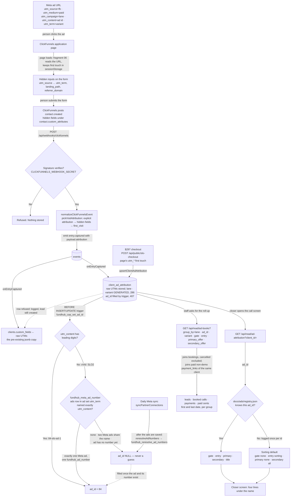
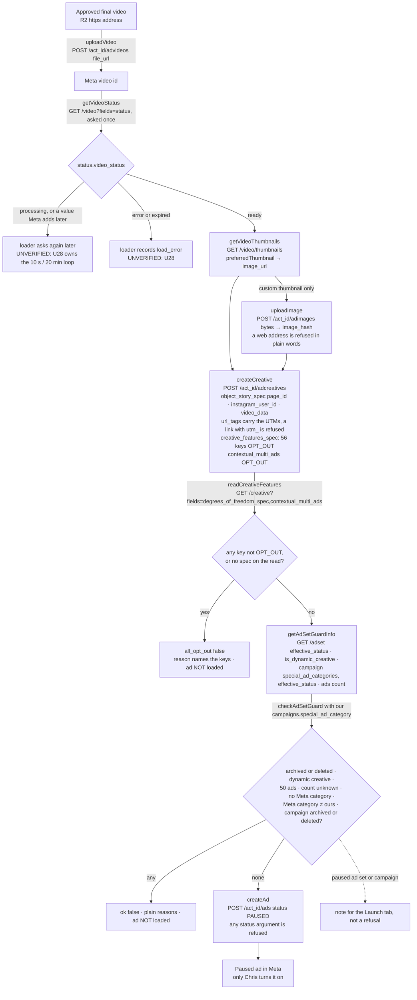
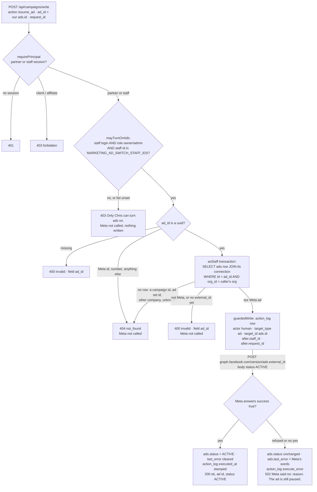
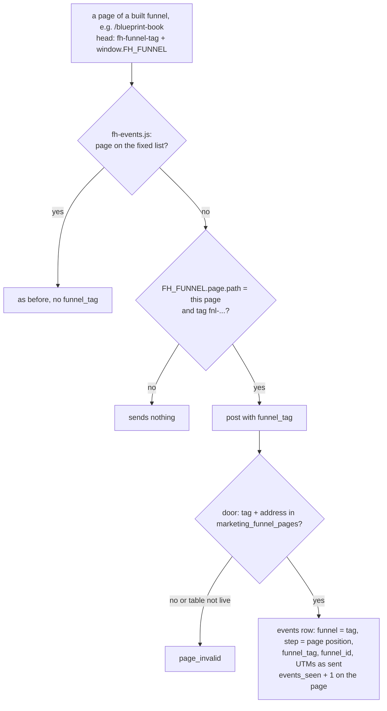

# ad-attribution-flow — actual

How a Meta ad's five UTMs become the four lines a closer reads on the call screen.
Generated from the code on 2026-09-03, by hand, from the files named beside each
step. Every arrow names the event that fires it. Nothing here is drawn from a spec.

## In one picture

## The states, and the event that moves each one

| State | Where it lives | What fires the move to the next state |
|---|---|---|
| UTMs on the ad URL | the person's browser | Page load. `clickfunnels-fragments/06-utm-hidden-fields.html` reads `location.search`. |
| UTMs in sessionStorage | the person's browser | Form render. The fragment stamps hidden inputs on every form, first touch wins. |
| Hidden inputs filled | the ClickFunnels form | Form submit. ClickFunnels posts `contact.created` with the inputs under `custom_attributes`. |
| Webhook received | `api/webhooks/[provider].mjs` → `src/http/router.mjs` | Signature check passes. A bad signature ends the flow with nothing stored. |
| Normalized event | `src/adapters/clickfunnels.mjs` `pickVisitAttribution` | `entry.captured` is emitted with `payload.attribution`. Order of trust, per field: an explicit `attribution` object, then hidden fields, then CF's own `visits.first_visit`. |
| Raw UTMs in jsonb | `clients.custom_fields` via `mergeCustomFields` | Same handler, same call. Unchanged from before this work. |
| Typed row | `client_ad_attribution` via `src/ads/store.mjs` `upsertClientAdAttribution` | Written in `onEntryCaptured` right after the jsonb merge, and by the $297 checkout (`api/public/slo-checkout.mjs`) with the page's tags. The database derives `lane` (enum; `slo` for a campaign name with the word SLO, like `oPur: TOF-SLO: $297` — 406/407; `unknown` when unrecognised) and `variant` (lowercased, squeezed) as GENERATED columns. A second capture fills blanks only. A refused row is logged and the lead is still created. |
| Ad number | `client_ad_attribution.ad_id`, filled by trigger `client_ad_attribution_ad_id_trg` → `fundhub_caa_set_ad_id()` (`db/migrations/407_ad_number_from_meta.sql:206-234`) | Every insert and update. First the leading digits of `utm_content` (286 rule). Else `fundhub_meta_ad_number(org, utm_term, utm_content)` (407:153): our `ads` row in the Meta ad set `utm_term` whose name is exactly `utm_content`, answered only when exactly one Meta ad matches and it carries one `fundhub_ad_number`. Else, on an update that keeps the tags, the number the row already had. Otherwise NULL. The app never writes it. JS mirror: `src/ads/ad-number.mjs`. |
| Late ad number | the same column | The daily Meta sync, after it saves the ads: `reresolveAdNumbers()` (`src/ads/store.mjs:132`) → `fundhub_reresolve_ad_numbers(org)` (407:250), called at `api/campaigns/sync.mjs:921`. Fills only rows whose `ad_id` is NULL. A failure is reported in the sync's `ad_numbers` and never fails the sync. |
| Resolved tags | `src/ads/registry.mjs` `resolveAd` | The closer screen calls `GET /api/read/ad-attribution`. Known id → the registry entry. Unknown → sorting default, warned once per id. |
| Four lines on screen | `public/app/closer-dashboard.html` `#ccp-ad`, painted by `paintAd()` in `public/app/closer-call.js` | Fires after the cockpit paints. Hidden until the read answers; stays hidden if it cannot. |
| Roll-up | `GET /api/read/ad-books` via `adAttributionRollup` (`src/ads/store.mjs:79`) | On request. Groups by a database column or a registry tag. Cancelled bookings are not booked calls. Unknown ids are listed under `unknown_ad_ids`. The roll-up rows also carry `payments` (paid, non-demo `payment_links` rows of the same client), `paid_cents` (what the payment webhook reported; NULL when none reported), `payments_amount_unknown`, and first/last paid dates. Bookings and payments are counted per client before grouping, so they never multiply. |

## What the closer sees, in words

- **Gate** — `600+`, `720+`, `780+`, or `No FICO gate`.
- **Entry** — `Direct · sell what they were promised`, or `Sorting · every road is open`. When the ad is not in the registry the line says so in brackets.
- **Primary** — the offer the ad led with. On a sorting ad with a primary it adds `lead with it`.
- **Secondary** — `All` on a sorting ad, the listed offers on a direct ad, `None` when there are none.

## Gaps and things not drawn

- `UNVERIFIED` in production: which ClickFunnels payload key the live workspace uses for hidden inputs (`custom_attributes` vs `custom_fields`). The adapter reads both, in that order. The test proves `custom_attributes`.
- The registry was seeded from the owner's brief of 2026-09-03, not from `docs/ads/scripts/2026-09-02-ad-scripts.md`, which is not in the repository. Ids not named in the brief resolve to the sorting default until they are added.
- No intended journey exists for this flow. This file is the first record of it and it describes the code, not a spec.
- `UNVERIFIED` against a database: the 407 trigger, resolver and backfill, and the payments in the roll-up. `src/http/ad-number.pg.test.mjs` covers them and skips without `DATABASE_URL`; it has not run (2026-10-05). The JS mirror tests (`src/ads/ad-number.test.mjs`) run and pass.
- `GET /api/read/ad-books` folds the roll-up rows but does not yet add up `payments` or `paid_cents` into its groups or totals, so the screen does not show them. The store returns them; the endpoint is not changed here.
- A new Meta ad gets a visitor number only after someone gives that ad its `fundhub_ad_number` (the Campaign Manager link box, `api/campaigns/link-asset.mjs`). The four SLO ads that ran were numbered by 407 (84, 90, 89, 86). The three August book-a-call ads have no Fundhub number and stay NULL.
- `vsl_watch_sessions.ad_number` (379) is still the leading-digits rule only. It is not part of this flow.

## U13 Meta upload, creative, thumbnails, guards, backoff, Page/Instagram id script

Generated from the code on 2026-10-05 (branch `mm-u13-meta-upload`). These are
the Meta calls the M4 loader (U28, `src/marketing/meta-load.mjs`, not built
yet) strings together. This unit adds the calls only. Nothing here runs on its
own, writes our database, or turns an ad on.

| Step | Code | What fires it | What it never does |
|---|---|---|---|
| Upload | `uploadVideo` (`src/adplatforms/meta.mjs`) | the loader, with the R2 final's https address | send bytes through us |
| Ready check | `getVideoStatus` | the loader, once per job run | poll inside the function |
| Thumbnail | `getVideoThumbnails`, `preferredThumbnail`, `uploadImage` | the loader | fetch an image address itself (Meta's `/adimages` takes only `bytes` or `copy_from`) |
| Creative | `createCreative` | the loader, after guardedWrite's screen (U28) | send OPT_IN, put UTMs in the link, use `instagram_actor_id` |
| Read-back | `readCreativeFeatures` → `creativeFeaturesVerdict` | the loader, right after the creative | pass a creative with any key not OPT_OUT, or with no spec to read |
| Ad set guard | `getAdSetGuardInfo` → `checkAdSetGuard` (`src/adplatforms/meta-guards.mjs`) | the loader, before createAd | refuse a paused ad set (it is a note) |
| Paused ad | `createAd` | the loader | take a status; send ACTIVE |
| Backing off | `callPlatform` (`src/adplatforms/_api.mjs`) | every Meta call | repeat a POST that hit a 5xx; hold a function open longer than 10 s per pause |
| Page and Instagram ids | `scripts/meta-page-ids.mjs` | run by hand once, from a checkout with `.env` | write anything; POST; hold an account id in its source |

**Backing off, in words.** When Meta answers with code 4, 17, 32, 613 or 80004,
or 429, the same call is asked again after 2 s, then 4 s, then it gives up as
`retryable`. A GET that hits a 5xx is asked again the same way; a POST is not,
because it may already have made the object. When the
`x-business-use-case-usage` header shows more than 75% used, the next call to
that connection waits first (2 s at 75%, up to 10 s at 100%). When Meta names a
regain time longer than 10 s, nothing more is sent and the error carries
`retryAfterMs` so the loader's job comes back later. A usage percent alone never
makes a call repeat: a real rejection (code 100) that arrives while the header
reads 100% is not asked again; only the next call waits.

### Gaps and things not drawn (U13)

- `UNVERIFIED` against the live ad account: every call here. Proven with a fake
  Meta only (`src/adplatforms/meta-load.test.mjs`). The first real load is the
  confirmation; `meta.mjs` keeps its "CONFIRM BEFORE THIS RUNS LIVE" header.
- Spec §10.2 says `creative_features_spec` "plus contextual_multi_ads". Meta's
  v26 Ad Creative reference makes `contextual_multi_ads` its own field on the
  creative, not a `creative_features_spec` key, so it is sent there.
- The opt-out list (`src/adplatforms/meta-creative-features.mjs`) holds the 56
  keys a Meta documentation page names. 27 more names exist only in Meta's SDK
  type and are not sent; the read-back still stops a load if any comes back
  OPT_IN. `standard_enhancements` is not sent (v22.0: no longer supported).
- The ad count asks `ads.limit(0).summary(total_count)`. An ad set with no `ads` key
  in Meta's answer counts as 0.
- Spec §10.2 wants every write through `guardedWrite` with the copy as
  `screenSubject`. That wrapping, the database rows and the 10 s / 20 min wait
  loop belong to the loader (U28), not drawn here.
## U14 One ad number on many Meta ads, the url_tags builder, and mapAdNumber

Traced from the code on 2026-10-05 (branch `mm-u14-ad-number-source`). Spec
`docs/specs/marketing-machine-2026-10-04.md` §10.3, §10.4 (migration), §10.5
(sync mapping, pure part only).

```mermaid
flowchart TD
    subgraph WRITE ["Where an ads row's number comes from — ads.fundhub_ad_number_source, 416"]
      P[A person types it<br/>POST /api/campaigns/link-asset] -->|number set| MAN[source = manual]
      P -->|number cleared: null or blank| NONE[number NULL, source NULL]
      OLD[Numbers already on ads before 416<br/>84 · 86 · 89 · 90 from 407] -->|416 backfill| MAN
      LOAD[Machine loads the ad into Meta<br/>spec §10.4 — NOT BUILT, U28] -.->|UNVERIFIED| LDR[source = loader]
      SYNC[Daily Meta sync reads creative url_tags + ad name<br/>spec §10.5 — wiring NOT BUILT, U27] -.->|UNVERIFIED: calls mapAdNumber| MAP{mapAdNumber<br/>src/ads/ad-number.mjs}
      MAP -->|leading digits of utm_content, adIdOf = fundhub_ad_id rule| UTM[source = utm]
      MAP -->|else 'Ad N' as a word in the ad name| NAME[source = name]
      MAP -->|else, or bad input: never throws| NULLMAP[null — nothing stored]
      MAN -.->|spec §10.5: the sync never overwrites manual| SYNC
    end
    subgraph TAGS ["What a loaded ad sends — src/marketing/url-tags.mjs"]
      B["buildUrlTags lane, adNumber, variant?"] -->|lane not one fundhub_ad_lane knows| REF[throws — no ad is built]
      B -->|ok| T["utm_source=fb · utm_medium=paid · utm_campaign=lane · utm_content=N<br/>utm_term=variant only with a variant"]
      T -->|goes in the creative's url_tags, never in the link — U28| CLICK[person taps the ad]
      CLICK --> ROW[(client_ad_attribution<br/>ad_id = N by the 407 trigger<br/>lane by fundhub_ad_lane)]
    end
```

| State | Where it lives | What moves it |
|---|---|---|
| One number, many ads rows | `ads.fundhub_ad_number`, plain index `ads_fundhub_number_idx` (`db/migrations/416_ads_number_index_and_source.sql`). The unique index `ads_fundhub_number_uq` (377:575) is gone. | Any writer may now put the same number on a second ad (another ad set, or a v2). The number's shape CHECK (377:569) is unchanged. |
| `manual` | `ads.fundhub_ad_number_source` | `api/campaigns/link-asset.mjs` sets it with every typed number and clears it with the number. 416 marks every number already stored as `manual`. Its old `409 ad_number_taken` answer is removed; it could only come from the dropped index. |
| `loader` | same column | Only the CHECK exists. Nothing writes it yet (U28). `UNVERIFIED`. |
| `utm` / `name` | same column | `mapAdNumber({urlTags, name})` returns `{number, source}` or null. Nothing calls it yet (U27 wires it into `api/campaigns/sync.mjs`). `UNVERIFIED` end to end. |
| UTMs on a loaded ad | the Meta creative's `url_tags` | `buildUrlTags` builds them. Nothing calls it yet (U28). The database reads them back with `fundhub_ad_id`, `fundhub_ad_lane` and `fundhub_ad_variant`, proved in `src/http/ad-number-source.pg.test.mjs`. |

Gaps (findings, not reconciled):

- **Counting per number (for M5, spec §11).** One number may now sit on several `ads` rows. A report per number must count leads per number (`client_ad_attribution.ad_id`), never per `ads` row, or one lead counts once per row. `api/read/ad-spine.mjs` already uses `count(DISTINCT a.client_id)` per label group; its comment at about line 209 still names `ads_fundhub_number_uq`.
- **Roadmap lane: `uwiq` or `slo`.** New roadmap ads take `utm_campaign` from the funnel's lane, which the spec's seed calls `uwiq`, while live roadmap leads read `slo` (406/407). `buildUrlTags` accepts both. Chris's yes/no is open on the board.
- **"SLO Ad 7" names.** `marketing/ads/NAMING.md` numbers takes per offer ("SLO Ad 7"), and 407 says SLO Ad 7 is Fundhub ad 90. The spec's name rule (`Ad (\d{1,9})`) reads a Meta ad named "SLO Ad 7 — …" as 7, not 90. No live Meta ad is named that way today (the live names are "oVid: SLO1"–"oVid: SLO4", which map to null). U27 or Chris should decide before the sync stores `name` numbers.
- The name rule is case-sensitive ("Ad", as the spec writes it), needs "Ad" to start a word, and refuses a run of more than nine digits rather than cutting it short.
## U15 Turn on: resume_ad action (one ad, by our ads.id, Chris only)

Generated from `api/campaigns/write.mjs` (`resumeAd`, `mayTurnOnAds`) on 2026-10-05.
Spec §10.5 "Turn on", §2 item 6, §4 trap 11. Not live until ship. The Launch tab
button that sends it is a separate unit (U39); nothing in the app sends it yet.

| Step | Where | What fires it |
|---|---|---|
| Door | `requirePrincipal(["partner","staff"])` | Every POST, same as the campaign actions. |
| The switch gate | `mayTurnOnAds()` | `action` is `resume_ad` (any case). Staff kind, `ROLE_SETS.MARKETING`, and the staff id on `MARKETING_AD_SWITCH_STAFF_IDS` (comma list, read per request, junk ignored, unset = nobody). One 403 body for every refusal. |
| Which ad | `isUuid` then the `ads` row in the caller's org | Only our `ads.id`. The Meta id comes from that row, never from the request. |
| Log, then Meta | `guardedWrite` (`src/adplatforms/index.mjs`) → `meta.resume` | Log row first, then one POST to the ad's own Meta id. |
| Mirror | `UPDATE ads` | Only on `{success: true}` from Meta. Never a campaign or ad set row. |

Gaps and things not drawn:
- The staff id lives in `action_log.after.staff_id`, not `action_log.user_id`: `user_id` references `accounts` (046:480), and a staff id is not an accounts row.
- `request_id` is kept on the log row only. No saved-answer table exists yet, so a repeat calls Meta again (it re-sends ACTIVE, which changes nothing at Meta).
- The transaction stays open across the Meta call (spec §4 trap 3), same as the campaign path; `guardedWrite` was not changed here.
- The campaign-level `pause`, `resume`, `update_budget` gate is unchanged: any staff login with a partner_id, or a partner login, can still start a whole campaign (a Chris yes/no on the board).
- `UNVERIFIED` live: the call has never reached real Meta. The fake Meta in `src/http/campaigns-write-resume-ad.pg.test.mjs` answers like the Graph API docs.

## X4 The funnel tag on events from a dashboard-built funnel

Drawn from `public/funnel/fh-events.js` (`builtFunnel`), `src/funnel/track.mjs`
(`cleanFunnelTag`, `findFunnelPage`, `recordTrack`) and migration 425. Full drawing:
`docs/journeys/marketing-dashboard-flow.md`, section "X4 Funnel builder".

- The ad's url_tags are unchanged (`utm_campaign` = the funnel's lane, `utm_content` = the ad
  number, migration 286). A lead or booking from such a funnel carries its `landing_path`
  (the funnel's first page), which belongs to one funnel only.
- `UNVERIFIED` live: no built funnel is live yet; the browser side is proved in the
  `src/ads/fh-events-harness.mjs` fake page, the door with a stand-in lookup and in CI's database.
## U27 Sync mapping: the Meta sync asks for creative{url_tags} and stores each ad's number

Generated from `api/campaigns/sync.mjs` (`AD_LIST_FIELDS`, `upsertAd`,
`syncAdNumber`, `syncPartnerConnections`) on 2026-10-06, branch
`mm-u27-ad-number-sync`. Spec §10.5 "Sync mapping", M4 Done #3. This wires the
`SYNC` arrow the U14 section above drew as NOT BUILT. Not live until ship.

```mermaid
flowchart TD
    CLOCK[Sync button · 07:00 UTC nightly pass · hourly 3-day pass] --> LIST["GET {ad set}/ads<br/>fields = id,name,status,adset_id,creative{url_tags}<br/>(v26.0; field checked in Meta's v26.0.2 SDK)"]
    LIST --> TX[One transaction per campaign]
    TX --> SAVE[upsertAd: insert or update name + status<br/>RETURNING the row's number and source]
    SAVE --> MAP{mapAdNumber<br/>url_tags, name}
    MAP -->|no number: utm_content=&#123;&#123;ad.name&#125;&#125;,<br/>'oVid: SLO1', no creative| NONE[nothing written · tally none<br/>a number is never cleared]
    MAP -->|number N, source utm or name| MAN{row's source = manual?}
    MAN -->|yes| KEEP[nothing written · tally kept_manual]
    MAN -->|no| SAME{row already holds N?}
    SAME -->|yes| SAMEW[nothing written · tally same<br/>source kept, e.g. loader]
    SAME -->|no, or no number yet| SP[SAVEPOINT fundhub_ad_number_map<br/>UPDATE ads SET number = N, source<br/>WHERE number IS NULL OR source is not manual]
    SP -->|ok| SET[tally set]
    SP -->|database refuses| RB[ROLLBACK TO SAVEPOINT<br/>ad stays saved without the number<br/>tally failed + first 5 named]
    SET --> DAYS[storeInsights for this ad]
    KEEP --> DAYS
    SAMEW --> DAYS
    NONE --> DAYS
    RB --> DAYS
    DAYS --> COMMIT[campaign COMMIT<br/>tally added to stats.ad_number_map only now]
    COMMIT --> RER[after every connection:<br/>reresolveAdNumbers → fundhub_reresolve_ad_numbers 407<br/>visitors with no number re-matched by ad set id + ad name]
    RER --> VIS[(client_ad_attribution.ad_id = the number just written)]
```

| Step | Where | What fires it |
|---|---|---|
| Ask for the UTMs | `AD_LIST_FIELDS` in `api/campaigns/sync.mjs`, used by the ads list | Every pass (button, nightly, hourly). `Ad.creative` (an `AdCreative`) and `AdCreative.url_tags` (a string) are declared in Meta's v26.0 SDK, facebook-business 26.0.2 (`apiconfig.py` API_VERSION v26.0). One undeclared field would fail the whole list. |
| Read the number | `mapAdNumber` (`src/ads/ad-number.mjs`, U14) | Leading digits of `utm_content` in `url_tags` → `utm`; else `Ad N` as a word in the name → `name`; else null. |
| Write the number | `syncAdNumber` | Only when the row has no number, or a different number whose source is not `manual`. Same number → no write. No number found → no write. The UPDATE's WHERE repeats the manual rule. |
| A refused write | `SAVEPOINT` / `ROLLBACK TO SAVEPOINT` | Any database error on that UPDATE. It is caught, rolled back to the savepoint, counted, and never thrown, so the campaign's other ads and days still commit. |
| Counting | `stats.ad_number_map` = `{set, kept_manual, same, none, failed, failures}` | Per campaign, added only after that campaign commits (same rule as every other count). |
| Visitors | `reresolveAdNumbers` (`src/ads/store.mjs`) | Unchanged: once per run, after all campaigns. It now also finds visitors whose ad got its number from this sync. |

Proof: `src/http/campaigns-sync-paging.test.mjs` (fake Meta and fake
transaction, runs on every push) and `src/http/ad-number-sync.pg.test.mjs`
(real Postgres in CI: 91 utm, 92 name, live ads nothing, a refused write
counted while the campaign commits, manual kept, loader kept on the same number,
a visitor gets 91 after the sync).

Gaps and things not drawn (findings, not reconciled):
- **Default picked: the same number keeps its source.** The contract allows a
  rewrite of any non-manual row; this writes nothing when the number already
  matches, so a loaded ad stays `loader` instead of turning `utm` on its next
  sync. A different number from Meta still overwrites `loader`, `utm` and `name`.
- **Default picked: the sync never clears a number.** If Meta's record stops
  naming a number, the stored one stays.
- **"SLO Ad 7" names (from U14) are now live in the sync.** A Meta ad named
  "SLO Ad 7 — …" with no number in its `url_tags` would be stored as 7 (source
  `name`), though `marketing/ads/NAMING.md`'s SLO Ad 7 is Fundhub ad 90. No live
  Meta ad is named that way today. A number a person types (link-asset, `manual`)
  always wins.
- **The counts are not on any screen.** `stats.ad_number_map`, like
  `stats.ad_numbers`, is in what `syncPartnerConnections` returns, but not in the
  Sync button's answer (`buildSyncResponse`) or the sweeper's run tally
  (`src/workflows/meta-campaign-sync-sweeper.mjs`).
- **Live ads map to nothing here, on purpose** (owner decision 2026-10-05: keep
  `utm_content={{ad.name}}` and `utm_term={{adset.id}}`). Their visitors are
  matched by 407 once a person numbers the ad.
- `UNVERIFIED` live: the field was checked against Meta's SDK, not a live call.
  The first real sync after ship is the confirmation.
