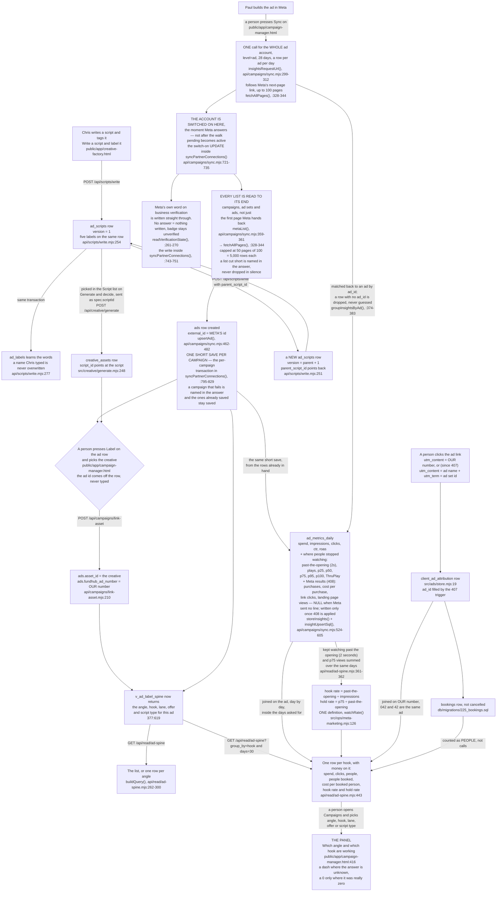

# Ad label spine flow — how a script's labels reach an ad

Required by `CLAUDE.md` §3a step 4 and §4. Written 2026-09-08, traced from the code, not
from the plan.

This page is the back end for `db/migrations/377_marketing_label_spine.sql`. It answers one
question: **when Chris writes a script and tags it with an angle and a hook, what has to
happen before those tags show up next to that ad's spend?**

---

## The short version

A script carries five labels. The labels never get copied onto anything. They are read back
through one view, `v_ad_label_spine`, which walks **ad → creative → script** and picks the
labels up off the script at the far end.

So the whole thing is a chain of three links. **All three can be made today** — the
middle one only since 2026-09-08. None of it has been run against a database yet.

| # | The link | Can it be made today? |
|---|---|---|
| 1 | script → its labels | **Yes.** `POST /api/scripts/write` |
| 2 | script → creative | **Yes.** `POST /api/creative/generate` with `script_id` |
| 3 | creative → ad, and our ad number | **Yes.** `POST /api/campaigns/link-asset` |

**Link 2 was the break, and it is closed.** `creative_assets.script_id` was added by 377
(`db/migrations/377_marketing_label_spine.sql:395-396`) and for a few hours nothing wrote
it — the only writers were three test files, so the chain reached the creative and
stopped.

It now has a real writer. `api/creative/generate.mjs` accepts a `script_id` and folds it
into the job's spec, and `src/creative/generate.mjs:248` writes it onto every asset that
job produces. No new column was needed: `generation_jobs` already carries a jsonb `spec`
(`db/migrations/045_creative_factory.sql:295`) and this code already tucks `assetKind`
into it the same way.

**It is optional and stays NULL when nobody names a script.** An asset with no script is
a real thing, not a zero. The trigger from 377 refuses a creative and a script owned by
different partners, so a wrong id fails loudly at the moment of writing rather than
quietly mislabelling an ad weeks later.

**UNPROVEN.** This has never run against a database — there is no Postgres on the machine
it was written on. See the note at the foot of this page.

---

## The flow

Every solid line is a step something in the code really performs. None of it has
been run against a database — see the note at the foot of this page.

---

## Every move, and what fires it

| From | To | What fires it | Where it happens | Works today? |
|---|---|---|---|---|
| nothing | an `ad_scripts` row, `version = 1`, labels on it | somebody posts the words and the tags | `api/scripts/write.mjs:254` | **yes** |
| a script | a creative carrying that script id | generating with `script_id` | `src/creative/generate.mjs:248` | **yes** |
| a label key | a row in `ad_labels` | the same write, in the same transaction | `api/scripts/write.mjs:277` | **yes** |
| a connected account sitting on "waiting" | the account switched on | Meta answers the first read of the Sync press | the switch-on `UPDATE` in `syncPartnerConnections()`, `api/campaigns/sync.mjs:721-735` | **yes** |
| a connected account | Meta's own business-verification word written down | the same Sync press, one read later | `readVerificationState()`, `api/campaigns/sync.mjs:261-270` | **yes** |
| an ad in Meta | an `ads` row with Meta's id | a person presses Sync on the Campaign Manager screen | `upsertAd()`, `api/campaigns/sync.mjs:462-482` | **yes** |
| an `ads` row | `asset_id` set, `fundhub_ad_number` set | a person picks the creative and types our number | `api/campaigns/link-asset.mjs:210` | **yes** |
| an `ads` row | a day of spend, clicks, and how far into the video people got | the same Sync press | `storeInsights()`, `api/campaigns/sync.mjs:595-605` | **yes** |
| an `ads` row | a day of Meta purchases, cost per purchase, link clicks and landing page views (408) | the same Sync press, once `hasMetaResultColumns()` finds the 408 columns | `insightUpsertSql()` / `insightUpsertParams()`, `api/campaigns/sync.mjs:524-575`, parsed by `metaResultMetrics()`, `src/ads/meta-results.mjs:116` | **UNVERIFIED** — written, unit-tested; not run against a database or live Meta |
| a visitor row with no ad number | its ad number | the end of the same Sync press | `reresolveAdNumbers()`, `api/campaigns/sync.mjs:921` → 407 | **UNVERIFIED** — not run against a database |
| one campaign's rows | saved on their own, the moment that campaign is done | the same Sync press | the per-campaign save in `syncPartnerConnections()`, `api/campaigns/sync.mjs:795-829` | **yes** |
| all of the above | labels readable next to the ad | the view joins them; nothing is copied | `377:619-652` | **yes, once the row above is set** |
| a script | a rewrite of it | posting again with `parent_script_id` | `api/scripts/write.mjs:251` | **yes** |
| labels + spend + people | what each label cost and what it brought | asking for a group and a number of days | `api/read/ad-spine.mjs:443` | **yes** |
| a day of video views | hook rate and hold rate for a label | the same call, same days | `watchRate()`, `src/ops/meta-marketing.mjs:126` | **yes** |

---

## Five things that are easy to get wrong

**1. The ad exists before the creative is attached, not after.**
The only `INSERT INTO ads` in the whole tree outside tests is the Meta pull
(the `INSERT INTO ads` inside `upsertAd()`, `api/campaigns/sync.mjs:476`). So an ad row always starts life with no creative and no
number on it, and a person fills both in afterwards. Anything drawn the other way round —
"our creative becomes an ad" — is not what the code does.

**2. Linking the creative to the ad is a person, on purpose.**
`api/campaigns/link-asset.mjs:11-32` sets out why: the Meta pull never even asks for a
creative (the ad list in `syncPartnerConnections()`, `api/campaigns/sync.mjs:778`, requests `id,name,status,adset_id`), our
`creative_assets.provider_asset_id` is the generation vendor's id and Meta has never seen
one, and nothing has ever pushed one of our creatives to Meta. The two sides share no
identifier at all. A guess here makes every label answer silently wrong.

**3. Our ad number is typed by a human and nothing can check it.**
`ads.fundhub_ad_number` is ours; `ads.external_id` is Meta's. They are separate columns
(377:557, 046:293). Nothing computes ours — Meta does not know it. The database stops two
ads claiming the **same** number; nothing stops one ad claiming the **wrong** one.

One thing it no longer gets wrong: **a link that says `042` and a box that says `42`.** The
link keeps the leading zero and the typed number usually does not, so a plain text
comparison would find nothing and report no leads with no error at all. `/api/read/ad-spine`
compares the two as numbers instead, in exactly one place
(`AD_NUMBER_MATCH`, `api/read/ad-spine.mjs:209`), so the two are the same ad. The flip side,
said out loud: two ads could be numbered `042` and `42` and would now be treated as one.

**4. Leaving a field out and sending it blank are different instructions.**
On `link-asset`, an absent key means "leave it alone" and a present key that is blank or
null means "clear it" (`api/campaigns/link-asset.mjs:36-55`). Clearing `asset_id` turns that
ad's labels back off with no error anywhere. A screen with an empty box must send nothing,
not `""`.

**5. Labels are never copied down. They are looked up.**
Nothing writes `angle_key` onto a creative or onto an ad. The view is the only place the
inheritance happens (377:603-606). Correct a script's angle and every ad made from it reads
the corrected one immediately.

---

## What works today, plainly

**Works:**

- Writing a script with its five labels, and the dictionary learning the new words.
- Writing a rewrite that points back at what it replaced, without touching the original.
- Pulling ads and daily spend in from Meta — and, since 2026-09-09, how far into each
  video ad people got before they left. `insightsRequestUrl()`,
  `api/campaigns/sync.mjs:299-312`, asks Meta for eight extra fields (the list itself
  lives once, at `VIDEO_INSIGHT_FIELDS`, `src/adplatforms/meta.mjs:175-184`) and
  `storeInsights()`, `api/campaigns/sync.mjs:595-605`, writes them
  into eight new columns on `ad_metrics_daily`
  (`db/migrations/378_ad_video_metrics.sql`). It costs nothing extra: eight more words
  on a request the app already sends every Sync.
- **Since 2026-09-09, the pull asks Meta ONCE for the whole ad account instead of once per
  ad.** `level=ad` makes one answer carry a line for every ad on every day
  (`insightsRequestUrl()`, `api/campaigns/sync.mjs:299-312`), and the walker
  `fetchAllPages()` (`:328-344`, still exported under its old name `fetchInsightPages`
  at `:348`) follows Meta's own next-page link up to 100 pages so a big account does
  not quietly lose days. A line with no `ad_id` is dropped rather than guessed at
  (`groupInsightsByAd()`, `:374-383`). Hundreds of calls in a row used to run the page out
  of time before it finished.
- **Since 2026-09-09, every list Meta answers is read to its end, not just its first
  page.** Meta hands back a page of rows plus a link to the next page. The campaign, ad set
  and ad reads asked for a page and never followed that link, so an ad account with more
  than a hundred campaigns — or an ad set with more than a hundred ads — lost everything
  past the first hundred, and no screen and no message ever said so. All four lists now go
  through the same walker (`metaList()`, `api/campaigns/sync.mjs:359-361`, calling
  `fetchAllPages()`, `:328-344`), which follows the link, stops at 50 pages of 100 rows so one runaway account cannot spin
  forever, and puts a line in the answer's `errors` when it stops early
  (`listTruncationMessage()`, `:365-368`). A list that was cut short says it was cut short.
- **The account is switched on the moment Meta answers, not at the end.** A connected
  account starts on "waiting" and only Sync moves it. The line that moves it now runs
  before the walk through campaigns, ad sets and ads
  (the switch-on `UPDATE` in `syncPartnerConnections()`,
  `api/campaigns/sync.mjs:721-735`), because that walk can run out of time on a busy
  account and the switch was never reached. Only "waiting" is changed; an account somebody
  marked expired or revoked is left alone.
- **Meta's own word on business verification is written down.** The sync reads it and
  stores it (`readVerificationState()`, `api/campaigns/sync.mjs:261-270`; the write in
  `syncPartnerConnections()` at `:743-751`). Only Meta saying verified earns it. If
  Meta does not answer — a token without that permission, for instance — nothing is written, the run still says ok, and
  the screen keeps saying unverified, which is true. Nothing in the tree ever set this
  before, so a campaign could never go live.
- **Each campaign is saved on its own, the moment it is done**
  (the per-campaign save in `syncPartnerConnections()`,
  `api/campaigns/sync.mjs:795-829`). Nothing is held open across a call to Meta. If the
  run dies partway, what was already saved stays saved. And the answer cannot claim work it
  did not do: a run that lost a campaign comes back `ok:false` with `partial:true`, the
  campaign named, and only the counts that really landed
  (`buildSyncResponse()`, `api/campaigns/sync.mjs:559-603`).
- Saying which creative runs on an ad, and what our number for it is.
- Reading the whole chain back, either as a list or grouped by angle, hook, lane, offer or
  script type.
- **Asking which hook books a call for the least money.** Grouped mode on
  `/api/read/ad-spine` now carries what each label cost and what it brought:
  `?group_by=hook&days=30` returns spend, impressions, clicks, how many people arrived from
  those ads, how many of them booked, and the cost of one booked person.

  Five things about it are worth knowing before anybody reads a number off it:

  - **Blank spend and zero spend are different answers.** A label with no reported day at
    all comes back blank, because "nobody told us" is not "we spent nothing".
    `ad_days_reported` says how many days the total was built from.
  - **The ad count and the money cover different stretches of time.** `ads` is every ad
    that label ever had, for all time. The money is only the days you asked for. So
    `ads_reported_in_window` sits beside them and says how many of those ads actually
    reported anything inside the window. "50 ads, 3 of them reported, spend 3000" cannot
    be misread the way "50 ads, spend 3000" can.
  - **A zero for people can be checked instead of trusted.** People are counted the
    opposite way round from money: a row is written when somebody arrives, so no row is
    meant to mean nobody arrived. But that writer can fail quietly
    (`src/handlers/client-lifecycle.mjs:273` only warns), and then "0 people booked" would
    really mean "we stopped recording". So the answer also carries
    `people_rows_in_window`: how many people arrived company-wide in those days, ad or no
    ad. If that is 0 while the phone was ringing, every people number below it is
    meaningless.
  - **It refuses to divide on a tiny sample.** Under ten booked people there is no cost
    per booked person — just a line saying how many are needed and how many there are.
    That threshold is `MIN_N_RATE` in `src/ops/discoveries.mjs:9` and the refusal is
    `costPerBooked()` in `src/ops/meta-marketing.mjs:37`, both already used elsewhere. It
    is one rule in one place, not a second opinion.
  - **A booked person is not a booked call.** Someone who books, cancels and rebooks is one
    person. The field is called `people_booked` for that reason. The older rollup at
    `src/ads/store.mjs:64` counts calls, which is why a rate built on that one can read
    over 100%.

- **Asking which ad idea stops people, and which one keeps them.** The same grouped call
  also carries the two numbers everybody who buys ads reads:

  - **hook rate** — of the people the ad was put in front of, how many kept watching past
    the opening. Past-the-opening views divided by impressions. Meta counts one of these
    when somebody watches two seconds without stopping; it does not publish a
    3-second number at all.
  - **hold rate** — of the people who got past the opening, how many got three quarters of
    the way in. p75 views divided by past-the-opening views.

  Both are worked out in one function and one function only, `watchRate()` at
  `watchRate()`, `src/ops/meta-marketing.mjs:126`. Three things about them:

  - **A photo ad has no hook rate, and it is blank, not zero.** There is no video, so there
    is no such number and there never will be. Printing 0 there would make a perfectly good
    photo ad look like the worst one in the account, with no error anywhere saying so. The
    eight columns behind this are nullable with no default for exactly that reason
    (`db/migrations/378_ad_video_metrics.sql`).
  - **It refuses the same tiny samples the cost does.** Under ten impressions there is no
    hook rate; under ten past-the-opening views there is no hold rate. That is `MIN_N_RATE` in
    `src/ops/discoveries.mjs:9` — the same one number that governs cost per booked person.
    There is no second threshold anywhere in this system.
  - **A rate above 100% is not a bug.** Meta estimates and later restates these counts, so
    on one day p75 can land above the past-the-opening count. It is passed through as it arrives
    rather than squashed, because hiding a Meta restatement behind a tidy number is worse
    than showing an odd one.

**Closed on 2026-09-08, and worth recording because the page said otherwise for a few
hours:** a script can now become a creative. `api/creative/generate.mjs` takes a
`script_id` and `src/creative/generate.mjs:248` writes it onto every asset the job makes.

It stays NULL when nobody names a script, which is right — an asset with no script is a
real thing, not a zero. What follows from that: an ad whose creative carries no script
still reads with blank labels, and blank looks exactly like "no data yet" rather than
like a fault. That is the failure worth watching for on any screen built on this.

**Does not exist yet:**
- **~~Two of the three endpoints still have no screen.~~ CLOSED 2026-09-09.** All three are now
  reachable by a person, from two pages that already existed. No new page, tab or menu row.

  - **`scripts/write`** — *Write a script and label it*, a card on
    `public/app/creative-factory.html` above Generate and decide. The words, plus the five
    labels. The four free-text labels are `<input list=…>` with a datalist, so a suggestion is
    offered and a brand-new one is never refused (owner rule, `CLAUDE.md` §3c). Lane is the one
    picker with a fixed list, because it is the `ad_lane` enum and not a naming rule. Staff
    only, matching `ROLE_SETS.STAFF` on the endpoint; the card is hidden from a partner login
    rather than shown as a button that can only refuse. What it saves goes straight into the
    Script list on the Generate form below it.
  - **`creative/generate` with a script** — the Generate form now has a **Script** picker,
    holding the scripts saved for that partner. The id rides in `spec.scriptId`, which is the
    only place the endpoint reads it from — and nobody is ever asked to find or type an id.

    **The picker was half-built until 2026-09-17, and this is what that cost.** Only the save
    filled it, from its own reply, in that one browser tab. Reload the page and it fell back to
    its single built-in "— none —", so a script written yesterday could never be tied to
    anything. The live walk that morning saw both halves of it: *"Saved as version 1"*, then
    *"— none —"* after a reload. `GET /api/scripts/list` (`api/scripts/list.mjs`, routed in
    `netlify/functions/api.mjs`) is the read half, and `renderScriptPicker()` on the screen
    rebuilds the picker from it on every load. `/api/read/ad-spine` could not have stood in:
    `v_ad_label_spine` starts `FROM ads` (377:650), so a script with no creative and no ad
    yields no row there at all.
  - **`campaigns/link-asset`** — a **Label** button on every row of *Creative fatigue by ad* on
    `public/app/campaign-manager.html`, which opens a small form below the table: pick the
    creative, type our ad number. The ad's own internal id travels on the button, taken from
    the row the table already drew, because `ads.id` appears on no screen and no person could
    ever supply it. A field left empty is left OUT of the request, never sent blank — on this
    endpoint a blank key means *clear*, and clearing `asset_id` turns an ad's labels back off
    with no error anywhere. There is no unlink control for the same reason.

  **UNPROVEN, and this is the honest limit of it.** No browser has opened either screen and no
  database exists on the machine this was written on, so no request from either control has
  ever been sent. `src/ui/label-chain-reachable.test.mjs` (19 tests, all passing, no database
  needed) proves the wiring is present and correctly shaped — the endpoint each control posts
  to, the id coming off the row, a blank field being omitted rather than sent empty, and every
  control answering back on refusal and on success. It cannot prove a row has ever landed.

  **`read/ad-spine` already had one.** `public/app/campaign-manager.html:416` is a panel on the
  Campaigns screen called *Which angle and which hook are working*. It is a panel on a page
  that already existed — no new page, tab or menu row. It calls
  `GET /api/read/ad-spine?group_by=…&days=…&limit=200`, org-wide and staff-only like the two
  panels above it, and it draws one row per label with the ads, the spend, the people who
  arrived, the people who booked, the cost of one booked person, and the two watch rates.

  Three things about it are the point of it:

  - **A dash is not a zero, and they do not look alike.** A grey dash means the read said
    "unknown"; a black `0` means it counted and the answer really was zero. Hovering the dash
    prints the endpoint's own sentence saying which kind of unknown it was — no spend day
    reported, no ad number to match anybody to, or no video to measure.
  - **The refusal is printed, not hidden.** When the sample is too small to divide, the cell
    shows the words `costPerBooked()` returned — how many are needed and how many there are —
    instead of a blank or an invented number.
  - **The empty state says why it is empty.** Today it will read *"No ads on file yet, so
    there is nothing to group"* and then say what makes ads and labels appear. Two more lines
    appear only when they are true: that no spend was reported for the window, and that nobody
    was recorded arriving from any ad — the sanity check that says whether a zero in the people
    columns can be believed at all.

  **Never run against a live answer.** The panel was checked in a browser by handing
  `renderAdSpine()` a made-up response shaped exactly like the endpoint's, to prove the dash
  and the zero paint differently and that all four states draw. No real row has ever reached
  it, because no Meta account is connected and no ad has been labelled.
- **No real Meta numbers have ever arrived.** `ad_platform_connections` has no row, so
  nothing has ever been pulled. Every spend, impression and video number described above is
  a column waiting to be filled. The moment Chris connects a Meta account and somebody
  presses Sync, they fill.
- **The Meta pull is not on a clock.** Nothing in `src/workflows/index.mjs` registers it. It
  runs when a person presses Sync on `public/app/campaign-manager.html`.

**UNVERIFIED — never executed:** every `.pg.test.mjs` covering this chain skips with no
`DATABASE_URL`, and there is no Postgres on the machine this was traced on. The paths above
are read from the code, not observed running.

**Two parts are checked on every push, though.** Neither file has `.pg.` in its name, so
both run whether or not a database exists. Measured 2026-09-09 on this machine:

- `src/http/ad-spine.test.mjs` — **32 tests, all passing.** They cover the part that decides
  what a blank means: that an unknown spend stays blank, that a reported spend of zero stays
  zero, that a group nobody could be matched to says "cannot tell" instead of "nobody came",
  that a photo ad gets no hook rate rather than a hook rate of zero, and that the date window
  sits on the join rather than the filter, which is the mistake that would silently hide
  every ad that spent nothing.
- `src/ops/meta-marketing.test.mjs` — **15 tests, all passing.** The arithmetic of the two
  rates, including that a real zero survives, that a tiny sample is refused, and that a
  missing number never becomes one.

There is also a test that fails if the two rates are ever worked out anywhere but
`watchRate()`. That is the drift this whole shape exists to prevent.
