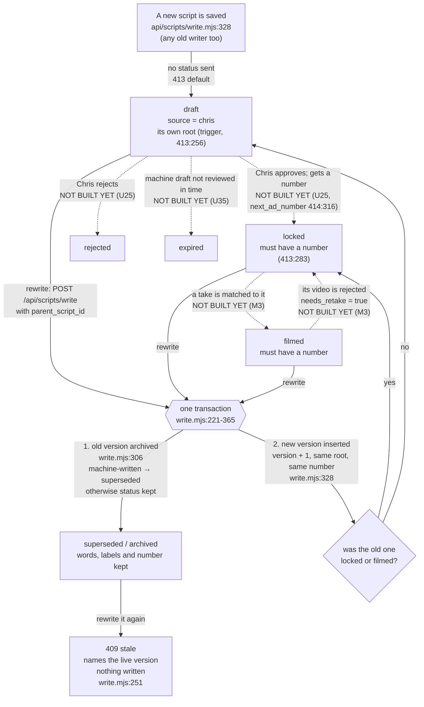
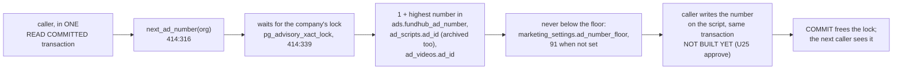
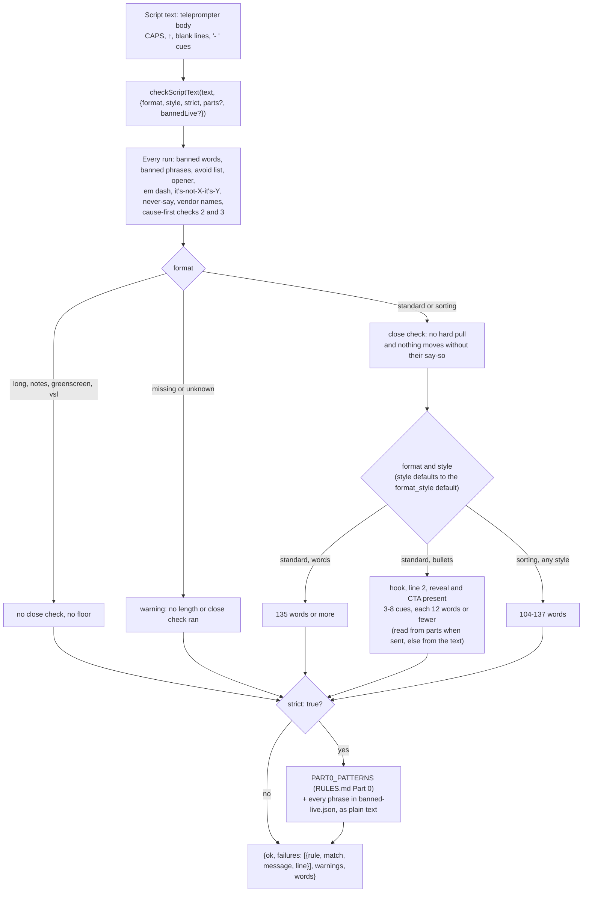
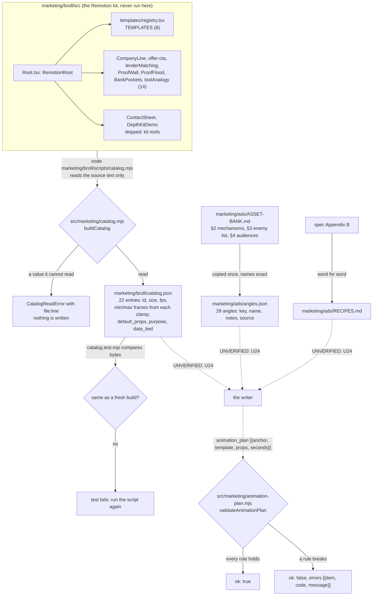
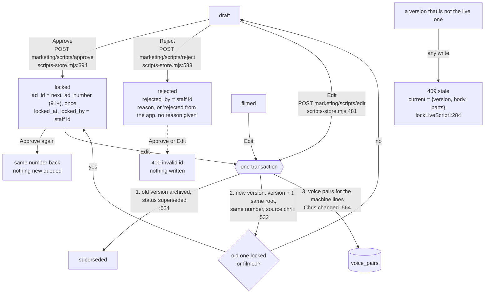
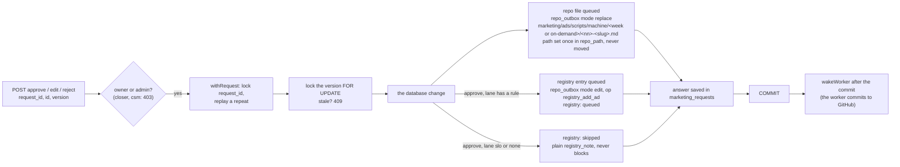
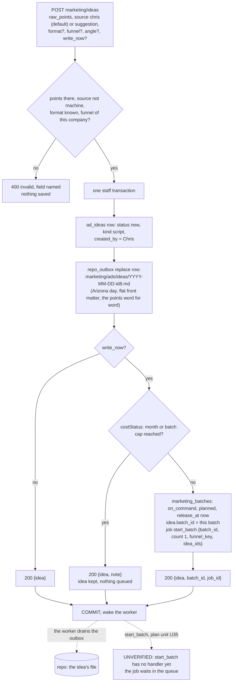
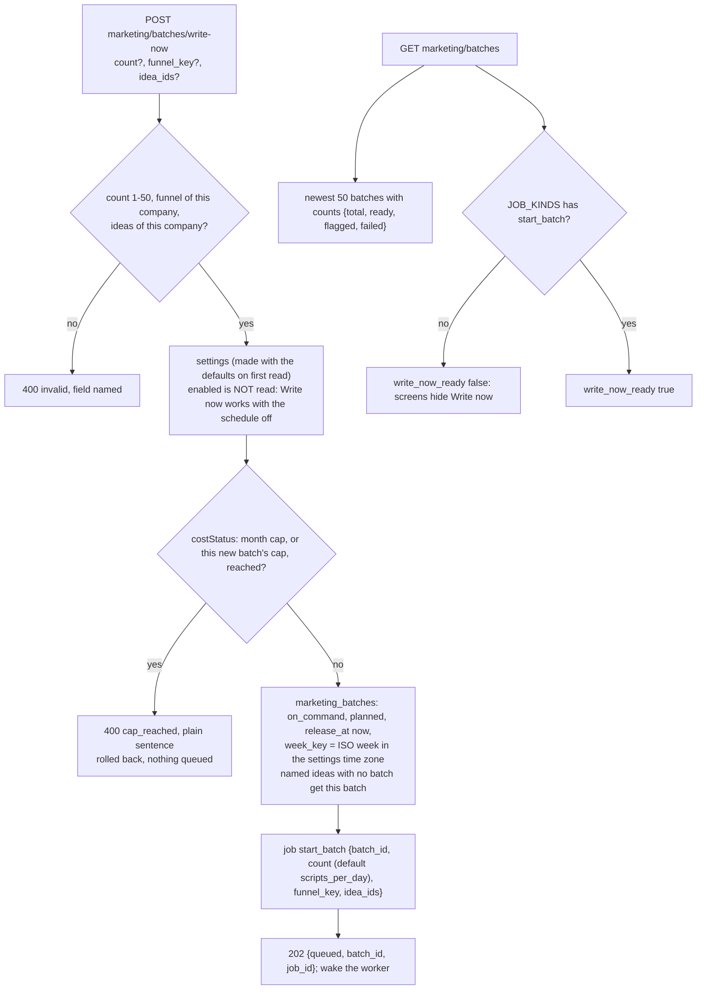
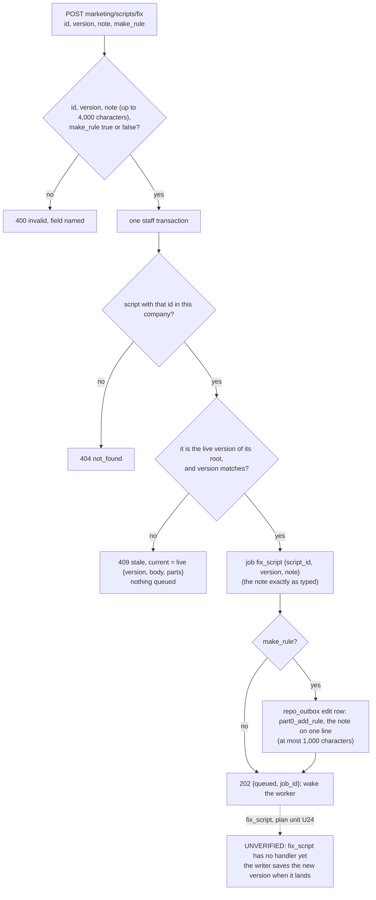
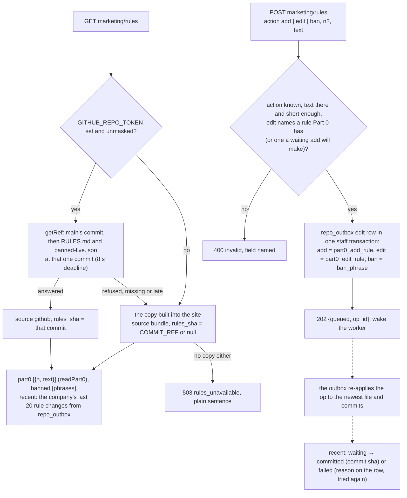

# Ad script flow — the states a script moves through

Generated from code on 2026-10-05 (plan unit U11, migrations 413 and 414, `api/scripts/write.mjs`).
Yardstick: the approved marketing machine spec, `docs/specs/marketing-machine-2026-10-04.md`
§1 (flow) and §7.4 (data). The intended journey file for the machine is not on main yet, so
this page is checked against the spec, not against an `-intended.md`.

**What changed from the page that was here.** The 2026-09-06 page drew a script as a
`creative_assets` row with `kind = 'copy'`. That is not how the code keeps scripts. A script is
an **`ad_scripts` row** (migration 377), one row per version. Creative Factory copy assets
(`creative_assets`, `api/creative/generate.mjs`) still exist; they are pieces of ad copy, not the
script Chris films, and they are drawn in `ad-label-spine-flow.md` and
`marketing-dashboard-flow.md`.

Plain words used below:
- **Live** = not archived (`archived_at` is empty). Only one version of a script is live.
- **Root** = version 1 of a script. Every version of one script points at it (`root_script_id`).
- **Number** = our ad number (`ad_id`), the one that goes in `utm_content`.

---

## U11 M1 7.4 data: script states, versions, numbers

### The states

Solid arrows are what the code does today. Dashed arrows are moves the spec names
(§7.4 "How status moves") that **no code makes yet**. The database allows each of those
statuses; nothing in the database checks the order of the moves.

### Every transition, and what fires it

| From | To | What fires it | Where | Works today? |
|---|---|---|---|---|
| nothing | `draft`, source `chris`, its own root | any insert that does not name status, source or root (Creative Factory "Write a script and label it" card, `public/app/creative-factory.html:448` → `POST /api/scripts/write`) | defaults in `413`, root trigger `set_root_script_id` (`413:256`) | **UNVERIFIED** — proved in CI only after this branch's run; not live until ship |
| a live version | archived (`superseded` if the machine wrote it) + a new live version at version + 1, same root, same number | `POST /api/scripts/write` with `parent_script_id` | `api/scripts/write.mjs:221-365`, one `asStaff()` transaction | **UNVERIFIED** — same |
| an archived version | **409 stale** with the live version (`current: {id, version, body, parts}`); nothing written | rewriting a version somebody already replaced | `write.mjs:251` (read with `FOR UPDATE`), `write.mjs:312`, `write.mjs:394` | **UNVERIFIED** — same |
| a rewrite of a `locked` or `filmed` version | the new version is `locked` (keeps the number) | same | `write.mjs:319` | **UNVERIFIED** — same |
| `draft` | `locked` + a number | Chris approves | not built (U25 `POST marketing/scripts/approve`) | no |
| `draft` | `rejected` | Chris rejects | not built (U25) | no |
| `draft` | `expired` | a machine draft is not reviewed in `draft_expiry_days` | not built (U35) | no |
| `locked` | `filmed` | M3 matches a take | not built (M3) | no |
| `filmed` | `locked`, `needs_retake = true` | its video is rejected | not built (M3) | no |

### The rows that were already there (backfill, 413:175-214)

| Row before 413 | After | On production (measured 2026-10-05, read-only) |
|---|---|---|
| archived | `superseded` | 0 rows |
| live, has a number | `locked` | 7 rows: ads 84-90 |
| live, no number | `draft` | 1 row: `MKT-WALK 2026-09-17` |

Every one of them gets source `import` and root = version 1 of its chain (today each is its
own root). `updated_at` is not moved. Imported rows stay out of the Inbox, expiry and the
nightly check (spec §7.4).

### The rules the database holds

| Rule | Where |
|---|---|
| status is one of draft, locked, rejected, filmed, superseded, expired | `ad_scripts_status_ck` (413) |
| source is one of machine, chris, agent, import | `ad_scripts_source_ck` (413) |
| a locked or filmed script has a number | `ad_scripts_number_when_locked_ck` (413:283) |
| one live version per script | `ad_scripts_one_live_per_root_uq` (413:275) |
| a version number is used once per script | `ad_scripts_root_version_uq` (413:269) |
| every row has a root | `root_script_id NOT NULL` (413:265) + trigger (413:256) |
| one live script per number per company | `ad_scripts_live_ad_id_uq` (393, unchanged) |

### Where a number comes from

Today (production, 2026-10-05) the answer would be **91**: the highest number anywhere is 90.
No code calls `next_ad_number` yet.

### The tables the machine writes next (414, no code writes them yet)

| Table | What one row is | Rule in the database |
|---|---|---|
| `marketing_batches` | one batch of scripts (weekly or Write now) | one weekly batch per company per ISO week (`marketing_batches_one_weekly_uq`); a weekly batch must say its week; a failed batch must say why |
| `ad_ideas` | one idea in the inbox (Chris's points, a planner idea, an accepted suggestion, or new first lines for a dying ad) | a new-first-lines idea must name its script |
| `voice_pairs` | one edit Chris made to a machine line: before and after | before and after must differ |

### Gaps against the spec (findings, not fixed here)

**Nothing else changes.** No new table, no new state value, no new enum. Both columns are
nullable, so every row that exists today stays valid.

---

## Teleprompter and editing apps — checked, and the answer is no integration

Chris asked whether this should talk to BigVu, CapCut, or another teleprompter app.

**Nothing in this repo mentions any of them**, and none is needed. CapCut has no public
developer interface to build against. Whether BigVu offers one was not verified and should
not be assumed.

**A teleprompter takes pasted text, so the integration is the format.** Look at
`docs/ads/CONTROLS.md` — Ad 1 is plain paragraphs, spoken as written, with no camera
directions mixed into the words. That already pastes into any teleprompter as-is.

**So the rule for the generator is a formatting rule, not a build:** the words Chris reads
to camera stay clean and unbroken, and everything that is not spoken — the runtime band,
the outfit and location note, the origin_angle tag — sits in its own block, clearly
separated, never inside the script body. That costs nothing and it is the whole of what an
integration would have bought.

## What this page does NOT cover

- **Images and video.** A `copy` asset needs no file. A `static` or `video` asset does, and
  nothing uploads one today. Out of scope, separate batch.
- **Cost per script.** Meta's ad id and Chris's ad number never meet, so cost cannot be
  attributed per ad. Named in `docs/ops/2026-09-06-self-analysis.md`, separate batch.
- **The 83 chat scripts.** They are not in the repo and are deliberately not the seed.
  `docs/ads/VOICE.md` is seeded from the five filmed and running ads only.

## U09 M1 7.1: Rules rebuilt and the checker's strict mode

Generated from code on 2026-10-05 (`scripts/ads/check-script.mjs`, `marketing/ads/rules-data.mjs`,
`marketing/ads/banned-live.json`). Spec section 7.1. This is the check step only; the states above
are unchanged.

- `checkOneScript` and `npm run ads:check` keep the old lists. The one change: "optimize" is no
  longer banned (RULES.md Part 0 rule 1). Output on `marketing/ads/CONTROLS.md` is byte for byte the
  same as before.
- Judge rules ("round two", "carry", "man" and Part 0 rules 13-34) are not patterns. Spec 7.6 gives
  them to the writer's judge model.
- `banned-live.json` is read from beside the module, then from the working directory. If neither
  copy can be read, strict mode still runs and returns a warning that names the file.
- **UNVERIFIED: no caller yet.** Nothing in `src/`, `api/` or `netlify/` calls `checkScriptText`
  today. The writer (spec 7.6) and script edits (spec 7.8) are the planned callers.
- **Gap:** `npm run ads:check` has no strict flag, so a chat writer running it does not get Part 0's
  patterns. The spec names no CLI flag, so none was added.
---

## U10 M1 7.3: RECIPES.md, angles.json, Remotion animation catalog builder, animation-plan validator

Generated from the code on 2026-10-05 (branch `mm-u10-recipes-catalog`). These are the three
files the machine writer (spec §7.6, unit U24) reads, and the check its animation plan must pass.
Nothing calls any of it yet: the writer is not built. Every arrow into "the writer" is
**UNVERIFIED** until U24 lands.

### What `validateAnimationPlan` refuses

| Code | When |
|---|---|
| `unknown_template` | the template is not in catalog.json |
| `seconds_out_of_range` / `bad_seconds` | seconds is outside min_frames / fps to max_frames / fps, or not a number |
| `unknown_props` | a props key that is not in the template's default_props |
| `data_tied_props` | any props key on QualifyToday, ProofWall, ProofFlood, ProofFloodWide, or a future LettersWritten* / ApprovalCarousel* / ProofFlood* |
| `anchor_not_in_body` / `bad_anchor` | words style: `{phrase}` is not the exact phrase in the body (capitals count, line breaks count as spaces, whole words) |
| `no_such_cue` / `keyword_not_in_cue` / `bad_anchor` | bullets style: `{cue, keyword}`, cue counts the `cue` parts from 1, the keyword must be whole words in that cue |
| `too_few` | standard under 2, sorting under 1, any other format under 1 |
| `unknown_format` / `unknown_style` / `not_a_list` / `not_an_object` / `bad_props` / `no_catalog` | the plan or its inputs have the wrong shape |

### Gaps between the spec and the code (findings, not fixed here)

- Spec §3 says the registry has 16 templates that run 2 to 3 s. The registry has 8. The other
  14 register from their own modules with their own clamps: 75-105, 75-120, 90-120 (ProofWall),
  105-135 (LenderMatchScroll) and 120-180 (ProofFlood) frames. The catalog reads each clamp.
- Spec §7.3 says the builder "transpiles registry.tsx with TypeScript". It reads the source text
  instead, because TypeScript and the kit's packages are not dependencies here.
- Spec §7.3 names LettersWritten and "the ApprovalCarousel family". Neither exists in the kit or
  in git history. They are tied by name prefix the day they are added.
- angles.json gets later additions through the repo outbox (spec §6 step 2, §7.3). That path is
  not built yet.
1. **Status moves are not guarded in the database.** Spec §7.4 lists how status moves; 413
   checks only the allowed words and "locked or filmed needs a number". Nothing stops, for
   example, `rejected` → `filmed`. The routes that make the moves (U25, U35, M3) must keep the
   order.
2. **The dashed moves have no code yet** (approve, reject, expire, filmed, retake).
3. **`scripts/ad-scripts-load-locked.mjs`** inserts numbered scripts without a status, so a
   re-run would land them as `draft`, not `locked`. All seven are already loaded, and it skips
   loaded numbers, so this only bites if it is ever pointed at an empty database.
4. **`api/scripts/list.mjs`** does not return status, root or number, so the Creative Factory
   picker cannot show them yet.
## U12 VOICE.md layout

- `marketing/ads/VOICE.md` now has a header, then `# Real pairs` (every real pair: an AI line next to Chris's own rewrite of it, from a chat or the app), then `# Seed pairs — model side written by hand` (the 9 hand-written seed pairs, unchanged, numbers 1-9).
- `# Real pairs` holds 0 pairs on this branch. The chat search for real pairs was blocked by the permission check, so the real count is not measured.
- U05's weekly append adds app-edit pairs at the end of `# Real pairs`, numbered from one more than the highest pair. UNVERIFIED here: that code is not on this branch.

## U25 M1 7.8 core script actions + 7.9 repo files + voice pairs on edit

Drawn from code on branch `mm-u25-script-actions`: `api/marketing/scripts.mjs`, `api/marketing/script.mjs`,
`api/marketing/scripts/{approve,edit,reject,order}.mjs`, `src/marketing/scripts-store.mjs`,
`src/marketing/script-file.mjs`, `src/marketing/voice.mjs`. Yardstick: spec §7.8, §7.9, §7.2, §7.4
"How status moves", §7.7 visibility, §4 traps 9, 17, 21. Shapes: `docs/specs/marketing-machine-api.md` §6.2.
Every arrow below is **UNVERIFIED on production**: proved in GitHub CI only, not live until a ship.

### Who sees a script

| Script | Listed (`GET marketing/scripts`) | Read or acted on by id |
|---|---|---|
| source `import` (the rows from before the machine, 413 backfill) | no | no, 404 |
| from a batch that is not released, or released with `release_at` still ahead | no | no, 404 |
| from a released batch whose `release_at` has passed | yes | yes |
| with no batch | yes | yes |
| another company's | no | no, 404 |

Rule: `VISIBLE_SQL`, `scripts-store.mjs:86`. The list shows live versions; `?status=superseded` shows the replaced ones.

### The moves this unit adds

### What one save writes, in ONE staff transaction (withRequest)

A save that fails anywhere rolls back whole: no change, no outbox row, no saved answer
(proved in `src/http/marketing-scripts.pg.test.mjs`). `POST marketing/scripts/order` sets
`film_order` (first = 1) on the live version of each listed script in the same kind of
transaction; it writes no repo file and wakes nothing.

### The repo file (§7.9)

Front matter, flat values only: `ad, version, status, offer, funnel, format, style, angle, batch,
updated_by, updated_at`. Then the body, byte for byte as the database holds it. Then a marker
line and a fenced JSON block with `parts`, `animation_plan` and `meta_copy`
(`src/marketing/script-file.mjs`). `nn` is the script's place in its batch (version 1 rows, by
when they were made); a path another script already holds gets the first 8 characters of the
script's id added.

### Gaps against the spec and the design (findings, not fixed here)

1. **`flagged` has no column.** It is read from `check_results` (an explicit `flagged: true`, or
   any check with `passed: false`), and only for machine-written versions. A person's edit is never
   machine-flagged; its checker result is saved in `check_results.strict` and its warnings come
   back on the save. U24 owns the inner keys of `check_results`.
2. **`repo_commit` stays empty.** The outbox drain (U05) stamps `repo_outbox.committed_sha` but
   nothing copies it to `ad_scripts.repo_commit` yet.
3. **Editing a rejected or expired script is refused** (400 on `id`). The spec names no move out
   of those states. The contract's edit error table does not list this answer.
4. **Editing a filmed script** makes a locked new version (its new words must be filmed again),
   the same rule `api/scripts/write.mjs` already uses. The spec only names "editing a locked
   script keeps its number".
5. **Words changed with no parts sent:** the new version's parts are cleared (null = unknown) with
   a warning, rather than keeping parts that no longer match the words.
6. **The film order** changes only the listed scripts; scripts left out keep their old number.
7. **The design** (`command-center-design-2026-10-05.md`) asks for `slot_reason`, `cost_usd`, a
   `batch` object, `outbox_id` and `voice_pairs_saved`. The contract's fixed shape 3 wins; edit
   also answers `voice_pairs` (a count) as an allowed extra key.

## U26 Ideas, rules, Fix and Write now

Generated from the code on 2026-10-06 (branch `mm-u26-ideas-rules-retry`): `api/marketing/ideas.mjs`,
`api/marketing/rules.mjs`, `api/marketing/scripts/fix.mjs`, `api/marketing/batches.mjs`,
`api/marketing/batches/write-now.mjs`, `src/marketing/ideas-store.mjs`, `src/marketing/rules-store.mjs`.
Spec §7.8 (fix, ideas, batches, write-now, rules rows), §7.5 step 7, §8.1 tabs 4 and 5, §2 item 1.
Every route: owner and admin only (requireAuth, then requireRole `ROLE_SETS.MARKETING`), the company
from the session, every write in one `withRequest` staff transaction (a repeated request_id answers
the first save and writes nothing), the worker woken after COMMIT.

### An idea, from the box to a batch

- Accepting a planner suggestion (spec §7.5 step 7) is the same POST with `source: 'suggestion'`
  and the suggestion's `angle_key`.
- `GET marketing/ideas?status=` lists the company's ideas, newest first (at most 200); `status`
  filters to new, writing, written, failed or dropped.

### Write now

### Fix a script

### Rules (Part 0 and banned phrases)

- `recent` state: `waiting` = not committed yet; `committed` = on main; `failed` = the last try was
  refused (the reason is on the outbox row and shows on the health card); the outbox keeps trying.
- A bundled copy can be older than main: outbox commits carry `[skip ci]` and do not rebuild the
  site. The answer says `source: 'bundle'` so the screen can say so.

### Gaps between the spec and this code (findings, not reconciled)

- **No intended journey on main.** `docs/journeys/marketing-machine-intended.md` is not on any
  branch; this section follows spec §1 and §7.8 as the yardstick (plan note).
- **The contract's example `angle_key: "two-files"`** has a dash. The database (414
  `ad_ideas_angle_ck`) and `angles.json` keys use underscores only, so the route refuses a dash.
- **Ideas held by a batch.** Write now stamps `ad_ideas.batch_id` on the ideas it names (only those
  with no batch yet), so the weekly planner does not write the same idea twice. The spec names the
  column, not this use.
- **`partner_id` on ad_ideas stays null.** The spec lists the column; nothing says which partner
  an idea from Chris belongs to.
- **UNVERIFIED in a real database on this Mac** (no Postgres here): proved by
  `src/http/marketing-ideas.pg.test.mjs`, `marketing-batches.pg.test.mjs` and
  `marketing-rules.pg.test.mjs` in GitHub CI.
