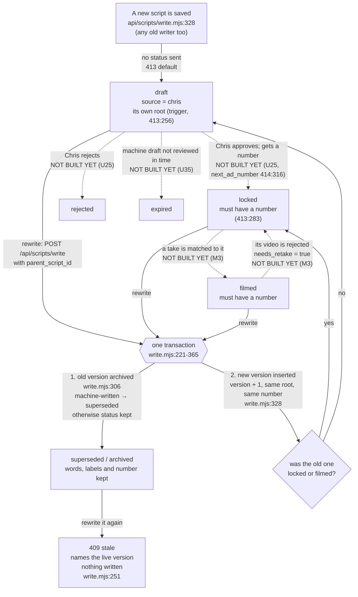
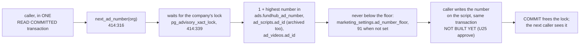
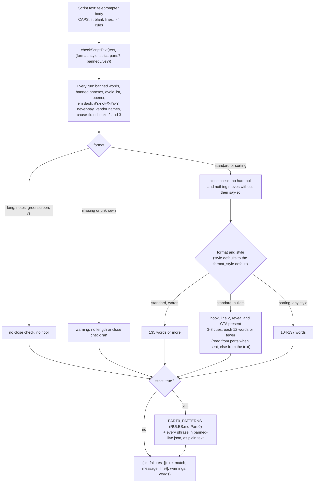
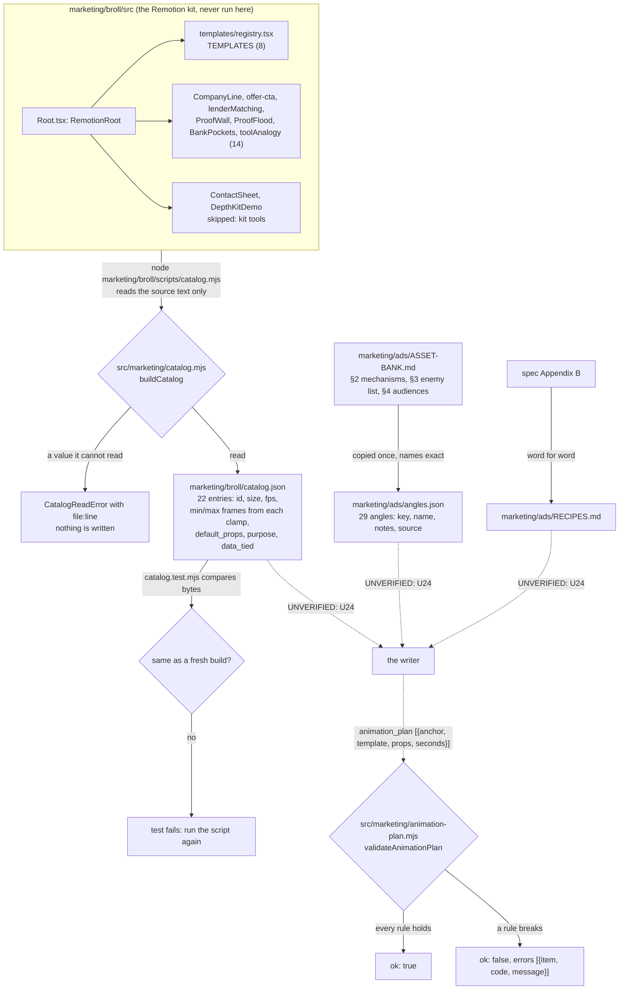
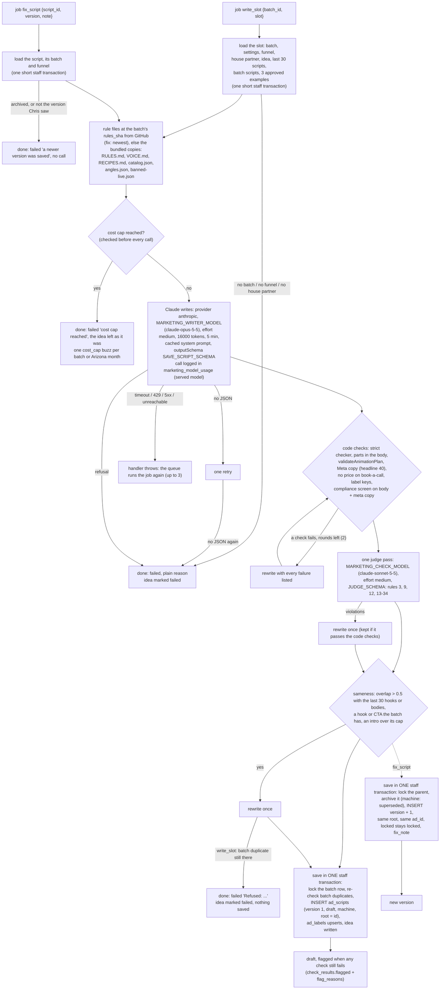

# Ad script flow — the states a script moves through

Generated from code on 2026-10-05 (plan unit U11, migrations 413 and 414, `api/scripts/write.mjs`).
Yardstick: the approved marketing machine spec, `docs/specs/marketing-machine-2026-10-04.md`
§1 (flow) and §7.4 (data). The intended journey file for the machine is not on main yet, so
this page is checked against the spec, not against an `-intended.md`.

**What changed from the page that was here.** The 2026-09-06 page drew a script as a
`creative_assets` row with `kind = 'copy'`. That is not how the code keeps scripts. A script is
an **`ad_scripts` row** (migration 377), one row per version. Creative Factory copy assets
(`creative_assets`, `api/creative/generate.mjs`) still exist; they are pieces of ad copy, not the
script Chris films, and they are drawn in `ad-label-spine-flow.md` and
`marketing-dashboard-flow.md`.

Plain words used below:
- **Live** = not archived (`archived_at` is empty). Only one version of a script is live.
- **Root** = version 1 of a script. Every version of one script points at it (`root_script_id`).
- **Number** = our ad number (`ad_id`), the one that goes in `utm_content`.

---

## U11 M1 7.4 data: script states, versions, numbers

### The states

Solid arrows are what the code does today. Dashed arrows are moves the spec names
(§7.4 "How status moves") that **no code makes yet**. The database allows each of those
statuses; nothing in the database checks the order of the moves.

### Every transition, and what fires it

| From | To | What fires it | Where | Works today? |
|---|---|---|---|---|
| nothing | `draft`, source `chris`, its own root | any insert that does not name status, source or root (Creative Factory "Write a script and label it" card, `public/app/creative-factory.html:448` → `POST /api/scripts/write`) | defaults in `413`, root trigger `set_root_script_id` (`413:256`) | **UNVERIFIED** — proved in CI only after this branch's run; not live until ship |
| a live version | archived (`superseded` if the machine wrote it) + a new live version at version + 1, same root, same number | `POST /api/scripts/write` with `parent_script_id` | `api/scripts/write.mjs:221-365`, one `asStaff()` transaction | **UNVERIFIED** — same |
| an archived version | **409 stale** with the live version (`current: {id, version, body, parts}`); nothing written | rewriting a version somebody already replaced | `write.mjs:251` (read with `FOR UPDATE`), `write.mjs:312`, `write.mjs:394` | **UNVERIFIED** — same |
| a rewrite of a `locked` or `filmed` version | the new version is `locked` (keeps the number) | same | `write.mjs:319` | **UNVERIFIED** — same |
| `draft` | `locked` + a number | Chris approves | not built (U25 `POST marketing/scripts/approve`) | no |
| `draft` | `rejected` | Chris rejects | not built (U25) | no |
| `draft` | `expired` | a machine draft is not reviewed in `draft_expiry_days` | not built (U35) | no |
| `locked` | `filmed` | M3 matches a take | not built (M3) | no |
| `filmed` | `locked`, `needs_retake = true` | its video is rejected | not built (M3) | no |

### The rows that were already there (backfill, 413:175-214)

| Row before 413 | After | On production (measured 2026-10-05, read-only) |
|---|---|---|
| archived | `superseded` | 0 rows |
| live, has a number | `locked` | 7 rows: ads 84-90 |
| live, no number | `draft` | 1 row: `MKT-WALK 2026-09-17` |

Every one of them gets source `import` and root = version 1 of its chain (today each is its
own root). `updated_at` is not moved. Imported rows stay out of the Inbox, expiry and the
nightly check (spec §7.4).

### The rules the database holds

| Rule | Where |
|---|---|
| status is one of draft, locked, rejected, filmed, superseded, expired | `ad_scripts_status_ck` (413) |
| source is one of machine, chris, agent, import | `ad_scripts_source_ck` (413) |
| a locked or filmed script has a number | `ad_scripts_number_when_locked_ck` (413:283) |
| one live version per script | `ad_scripts_one_live_per_root_uq` (413:275) |
| a version number is used once per script | `ad_scripts_root_version_uq` (413:269) |
| every row has a root | `root_script_id NOT NULL` (413:265) + trigger (413:256) |
| one live script per number per company | `ad_scripts_live_ad_id_uq` (393, unchanged) |

### Where a number comes from

Today (production, 2026-10-05) the answer would be **91**: the highest number anywhere is 90.
No code calls `next_ad_number` yet.

### The tables the machine writes next (414, no code writes them yet)

| Table | What one row is | Rule in the database |
|---|---|---|
| `marketing_batches` | one batch of scripts (weekly or Write now) | one weekly batch per company per ISO week (`marketing_batches_one_weekly_uq`); a weekly batch must say its week; a failed batch must say why |
| `ad_ideas` | one idea in the inbox (Chris's points, a planner idea, an accepted suggestion, or new first lines for a dying ad) | a new-first-lines idea must name its script |
| `voice_pairs` | one edit Chris made to a machine line: before and after | before and after must differ |

### Gaps against the spec (findings, not fixed here)

**Nothing else changes.** No new table, no new state value, no new enum. Both columns are
nullable, so every row that exists today stays valid.

---

## Teleprompter and editing apps — checked, and the answer is no integration

Chris asked whether this should talk to BigVu, CapCut, or another teleprompter app.

**Nothing in this repo mentions any of them**, and none is needed. CapCut has no public
developer interface to build against. Whether BigVu offers one was not verified and should
not be assumed.

**A teleprompter takes pasted text, so the integration is the format.** Look at
`docs/ads/CONTROLS.md` — Ad 1 is plain paragraphs, spoken as written, with no camera
directions mixed into the words. That already pastes into any teleprompter as-is.

**So the rule for the generator is a formatting rule, not a build:** the words Chris reads
to camera stay clean and unbroken, and everything that is not spoken — the runtime band,
the outfit and location note, the origin_angle tag — sits in its own block, clearly
separated, never inside the script body. That costs nothing and it is the whole of what an
integration would have bought.

## What this page does NOT cover

- **Images and video.** A `copy` asset needs no file. A `static` or `video` asset does, and
  nothing uploads one today. Out of scope, separate batch.
- **Cost per script.** Meta's ad id and Chris's ad number never meet, so cost cannot be
  attributed per ad. Named in `docs/ops/2026-09-06-self-analysis.md`, separate batch.
- **The 83 chat scripts.** They are not in the repo and are deliberately not the seed.
  `docs/ads/VOICE.md` is seeded from the five filmed and running ads only.

## U09 M1 7.1: Rules rebuilt and the checker's strict mode

Generated from code on 2026-10-05 (`scripts/ads/check-script.mjs`, `marketing/ads/rules-data.mjs`,
`marketing/ads/banned-live.json`). Spec section 7.1. This is the check step only; the states above
are unchanged.

- `checkOneScript` and `npm run ads:check` keep the old lists. The one change: "optimize" is no
  longer banned (RULES.md Part 0 rule 1). Output on `marketing/ads/CONTROLS.md` is byte for byte the
  same as before.
- Judge rules ("round two", "carry", "man" and Part 0 rules 13-34) are not patterns. Spec 7.6 gives
  them to the writer's judge model.
- `banned-live.json` is read from beside the module, then from the working directory. If neither
  copy can be read, strict mode still runs and returns a warning that names the file.
- **UNVERIFIED: no caller yet.** Nothing in `src/`, `api/` or `netlify/` calls `checkScriptText`
  today. The writer (spec 7.6) and script edits (spec 7.8) are the planned callers.
- **Gap:** `npm run ads:check` has no strict flag, so a chat writer running it does not get Part 0's
  patterns. The spec names no CLI flag, so none was added.
---

## U10 M1 7.3: RECIPES.md, angles.json, Remotion animation catalog builder, animation-plan validator

Generated from the code on 2026-10-05 (branch `mm-u10-recipes-catalog`). These are the three
files the machine writer (spec §7.6, unit U24) reads, and the check its animation plan must pass.
Nothing calls any of it yet: the writer is not built. Every arrow into "the writer" is
**UNVERIFIED** until U24 lands.

### What `validateAnimationPlan` refuses

| Code | When |
|---|---|
| `unknown_template` | the template is not in catalog.json |
| `seconds_out_of_range` / `bad_seconds` | seconds is outside min_frames / fps to max_frames / fps, or not a number |
| `unknown_props` | a props key that is not in the template's default_props |
| `data_tied_props` | any props key on QualifyToday, ProofWall, ProofFlood, ProofFloodWide, or a future LettersWritten* / ApprovalCarousel* / ProofFlood* |
| `anchor_not_in_body` / `bad_anchor` | words style: `{phrase}` is not the exact phrase in the body (capitals count, line breaks count as spaces, whole words) |
| `no_such_cue` / `keyword_not_in_cue` / `bad_anchor` | bullets style: `{cue, keyword}`, cue counts the `cue` parts from 1, the keyword must be whole words in that cue |
| `too_few` | standard under 2, sorting under 1, any other format under 1 |
| `unknown_format` / `unknown_style` / `not_a_list` / `not_an_object` / `bad_props` / `no_catalog` | the plan or its inputs have the wrong shape |

### Gaps between the spec and the code (findings, not fixed here)

- Spec §3 says the registry has 16 templates that run 2 to 3 s. The registry has 8. The other
  14 register from their own modules with their own clamps: 75-105, 75-120, 90-120 (ProofWall),
  105-135 (LenderMatchScroll) and 120-180 (ProofFlood) frames. The catalog reads each clamp.
- Spec §7.3 says the builder "transpiles registry.tsx with TypeScript". It reads the source text
  instead, because TypeScript and the kit's packages are not dependencies here.
- Spec §7.3 names LettersWritten and "the ApprovalCarousel family". Neither exists in the kit or
  in git history. They are tied by name prefix the day they are added.
- angles.json gets later additions through the repo outbox (spec §6 step 2, §7.3). That path is
  not built yet.
1. **Status moves are not guarded in the database.** Spec §7.4 lists how status moves; 413
   checks only the allowed words and "locked or filmed needs a number". Nothing stops, for
   example, `rejected` → `filmed`. The routes that make the moves (U25, U35, M3) must keep the
   order.
2. **The dashed moves have no code yet** (approve, reject, expire, filmed, retake).
3. **`scripts/ad-scripts-load-locked.mjs`** inserts numbered scripts without a status, so a
   re-run would land them as `draft`, not `locked`. All seven are already loaded, and it skips
   loaded numbers, so this only bites if it is ever pointed at an empty database.
4. **`api/scripts/list.mjs`** does not return status, root or number, so the Creative Factory
   picker cannot show them yet.
## U12 VOICE.md layout

- `marketing/ads/VOICE.md` now has a header, then `# Real pairs` (every real pair: an AI line next to Chris's own rewrite of it, from a chat or the app), then `# Seed pairs — model side written by hand` (the 9 hand-written seed pairs, unchanged, numbers 1-9).
- `# Real pairs` holds 0 pairs on this branch. The chat search for real pairs was blocked by the permission check, so the real count is not measured.
- U05's weekly append adds app-edit pairs at the end of `# Real pairs`, numbered from one more than the highest pair. UNVERIFIED here: that code is not on this branch.

## U24 M1 7.6 writer: one Claude call writes a draft, the checks send it back, the draft is saved

Generated from code on 2026-10-06: `src/marketing/writer.mjs`, `src/marketing/writer-prompt.mjs`,
`src/marketing/sameness.mjs`, two new lines in `src/marketing/job-kinds.mjs`. Yardstick: spec §7.6,
Appendix A, Appendix B, §4 traps 3 and 8. Nothing queues `write_slot` yet (U35's `start_batch` will);
`fix_script` is queued by `POST marketing/scripts/fix` (U26). The background worker (U22) is what runs both.

What the save writes: `ad_scripts` (title, body, hook_text, script_type `cold` or `vsl`, lane and
offer_key from the funnel, angle_key, hook_key, script_format, style, funnel_key, batch_id, idea_id,
parts, check_results, animation_plan, meta_copy), `ad_labels` (script_type, angle, hook, offer; a
blank name is filled, a typed one is never overwritten), and `ad_ideas` (status written, script_id).
No `repo_outbox` row: draft files are committed at release (U35, spec §7.7). No transaction is open
while Claude is called.

`check_results` keys: `version`, `flagged`, `flag_reasons`, `strict {passed, rounds, failures,
warnings, words}`, `parts`, `animation`, `meta_copy`, `offer`, `labels`, `judge {passed, ran, model,
notes, sent_back, taken, error}`, `compliance {state, reasons, copy_blocked}`, `sameness
{hook_overlap, body_overlap, duplicate_hook, duplicate_cta, intro, rewritten, refused}`, `rules
{sha, from, missing}`, `time_ran_out`, `rewrite_errors`, `models`, `calls`.

### Gaps between the spec and the code (findings, not fixed here)

1. **Forced tool → structured output.** Spec §7.6 says "a forced save_script tool". Forced
   `tool_choice` is HTTP 400 on claude-opus-5-5 and claude-sonnet-5-5 (claude-api skill), so the
   same schema goes out as `output_config.format` (callModel `outputSchema`). Source: the plan's
   intended-journey note, item (2). Structured outputs take no `maxLength`, so the 40-character
   headline is checked in code, and animation `props` travel as JSON text and are parsed.
2. **Spec numbers changed by the plan:** maxTokens 16000 (spec 8000) and timeoutMs 5 minutes
   (spec 3 minutes). Opus 5.5 always thinks and thinking counts toward max_tokens.
3. **A new angle the writer proposes is not added to `angles.json`.** Spec §7.3 says it is added
   through the outbox; the unit contract says the writer never enqueues repo writes. The new key
   lands on the script and in `ad_labels` only.
4. **The judge runs once.** A rewrite made after it (its own fix, or the sameness rewrite) is
   re-checked by code, not judged again.
5. **The compliance screen runs inside every code-check round**, not only after the judge, so a
   blocked line goes back to Claude. Two reasons are not counted as copy problems: the approval
   gate and an unset Meta special ad category (`special_ad_category_unset`).
6. **Intro caps for small batches:** floor(N/5) long and floor(2N/5) short, never under 1 each. A
   3-script Write now may have 1 long and 1 short intro. Picked by this unit; not an owner number.
7. **A time budget:** with no `deadlineAt` from the worker, a script gets 10 minutes; a rewrite
   round only starts when a whole 5-minute call still fits. UNVERIFIED: the worker (U22) does not
   pass `deadlineAt` yet.
8. **Who reads the job result:** a slot that cannot be written finishes its job with
   `{failed:true, reason}`; a retryable failure throws. UNVERIFIED: U35's batch counts must read
   that result.
9. **`fix_script` on a script with no format** treats it as `standard`.
10. **Lane comes from the funnel row as-is** (`roadmap_147` is `uwiq`, not `slo`): the uwiq-vs-slo
    gap U14 recorded is unchanged.
