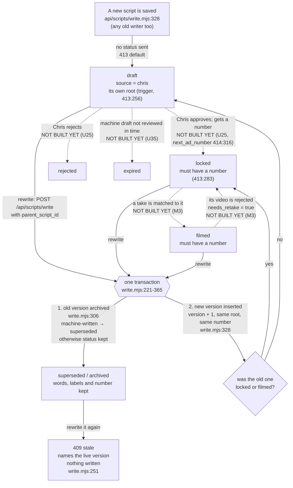
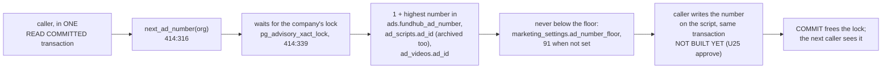

# Ad script flow — the states a script moves through

Generated from code on 2026-10-05 (plan unit U11, migrations 413 and 414, `api/scripts/write.mjs`).
Yardstick: the approved marketing machine spec, `docs/specs/marketing-machine-2026-10-04.md`
§1 (flow) and §7.4 (data). The intended journey file for the machine is not on main yet, so
this page is checked against the spec, not against an `-intended.md`.

**What changed from the page that was here.** The 2026-09-06 page drew a script as a
`creative_assets` row with `kind = 'copy'`. That is not how the code keeps scripts. A script is
an **`ad_scripts` row** (migration 377), one row per version. Creative Factory copy assets
(`creative_assets`, `api/creative/generate.mjs`) still exist; they are pieces of ad copy, not the
script Chris films, and they are drawn in `ad-label-spine-flow.md` and
`marketing-dashboard-flow.md`.

Plain words used below:
- **Live** = not archived (`archived_at` is empty). Only one version of a script is live.
- **Root** = version 1 of a script. Every version of one script points at it (`root_script_id`).
- **Number** = our ad number (`ad_id`), the one that goes in `utm_content`.

---

## U11 M1 7.4 data: script states, versions, numbers

### The states

Solid arrows are what the code does today. Dashed arrows are moves the spec names
(§7.4 "How status moves") that **no code makes yet**. The database allows each of those
statuses; nothing in the database checks the order of the moves.

### Every transition, and what fires it

| From | To | What fires it | Where | Works today? |
|---|---|---|---|---|
| nothing | `draft`, source `chris`, its own root | any insert that does not name status, source or root (Creative Factory "Write a script and label it" card, `public/app/creative-factory.html:448` → `POST /api/scripts/write`) | defaults in `413`, root trigger `set_root_script_id` (`413:256`) | **UNVERIFIED** — proved in CI only after this branch's run; not live until ship |
| a live version | archived (`superseded` if the machine wrote it) + a new live version at version + 1, same root, same number | `POST /api/scripts/write` with `parent_script_id` | `api/scripts/write.mjs:221-365`, one `asStaff()` transaction | **UNVERIFIED** — same |
| an archived version | **409 stale** with the live version (`current: {id, version, body, parts}`); nothing written | rewriting a version somebody already replaced | `write.mjs:251` (read with `FOR UPDATE`), `write.mjs:312`, `write.mjs:394` | **UNVERIFIED** — same |
| a rewrite of a `locked` or `filmed` version | the new version is `locked` (keeps the number) | same | `write.mjs:319` | **UNVERIFIED** — same |
| `draft` | `locked` + a number | Chris approves | not built (U25 `POST marketing/scripts/approve`) | no |
| `draft` | `rejected` | Chris rejects | not built (U25) | no |
| `draft` | `expired` | a machine draft is not reviewed in `draft_expiry_days` | not built (U35) | no |
| `locked` | `filmed` | M3 matches a take | not built (M3) | no |
| `filmed` | `locked`, `needs_retake = true` | its video is rejected | not built (M3) | no |

### The rows that were already there (backfill, 413:175-214)

| Row before 413 | After | On production (measured 2026-10-05, read-only) |
|---|---|---|
| archived | `superseded` | 0 rows |
| live, has a number | `locked` | 7 rows: ads 84-90 |
| live, no number | `draft` | 1 row: `MKT-WALK 2026-09-17` |

Every one of them gets source `import` and root = version 1 of its chain (today each is its
own root). `updated_at` is not moved. Imported rows stay out of the Inbox, expiry and the
nightly check (spec §7.4).

### The rules the database holds

| Rule | Where |
|---|---|
| status is one of draft, locked, rejected, filmed, superseded, expired | `ad_scripts_status_ck` (413) |
| source is one of machine, chris, agent, import | `ad_scripts_source_ck` (413) |
| a locked or filmed script has a number | `ad_scripts_number_when_locked_ck` (413:283) |
| one live version per script | `ad_scripts_one_live_per_root_uq` (413:275) |
| a version number is used once per script | `ad_scripts_root_version_uq` (413:269) |
| every row has a root | `root_script_id NOT NULL` (413:265) + trigger (413:256) |
| one live script per number per company | `ad_scripts_live_ad_id_uq` (393, unchanged) |

### Where a number comes from

Today (production, 2026-10-05) the answer would be **91**: the highest number anywhere is 90.
No code calls `next_ad_number` yet.

### The tables the machine writes next (414, no code writes them yet)

| Table | What one row is | Rule in the database |
|---|---|---|
| `marketing_batches` | one batch of scripts (weekly or Write now) | one weekly batch per company per ISO week (`marketing_batches_one_weekly_uq`); a weekly batch must say its week; a failed batch must say why |
| `ad_ideas` | one idea in the inbox (Chris's points, a planner idea, an accepted suggestion, or new first lines for a dying ad) | a new-first-lines idea must name its script |
| `voice_pairs` | one edit Chris made to a machine line: before and after | before and after must differ |

### Gaps against the spec (findings, not fixed here)

1. **Status moves are not guarded in the database.** Spec §7.4 lists how status moves; 413
   checks only the allowed words and "locked or filmed needs a number". Nothing stops, for
   example, `rejected` → `filmed`. The routes that make the moves (U25, U35, M3) must keep the
   order.
2. **The dashed moves have no code yet** (approve, reject, expire, filmed, retake).
3. **`scripts/ad-scripts-load-locked.mjs`** inserts numbered scripts without a status, so a
   re-run would land them as `draft`, not `locked`. All seven are already loaded, and it skips
   loaded numbers, so this only bites if it is ever pointed at an empty database.
4. **`api/scripts/list.mjs`** does not return status, root or number, so the Creative Factory
   picker cannot show them yet.
