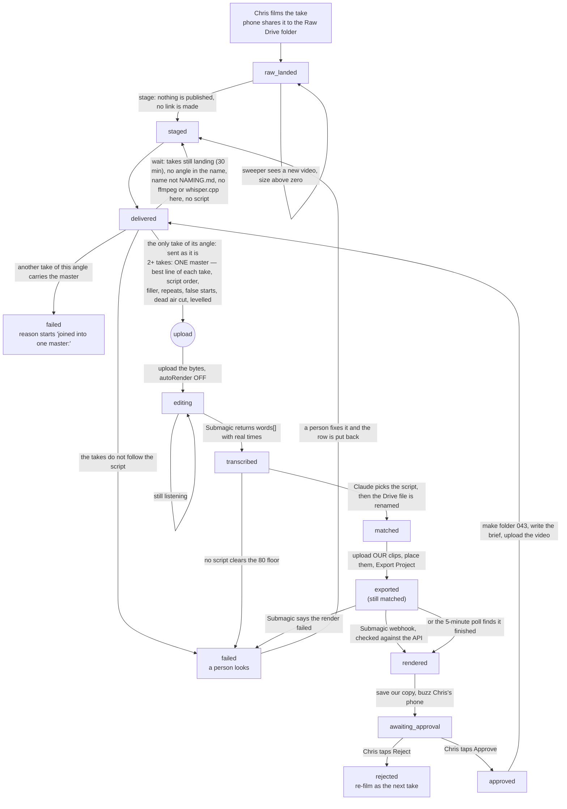
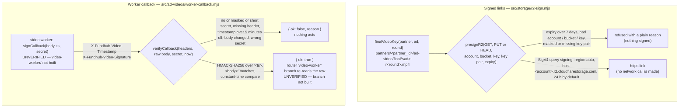

# Ad video — from a filmed take to Paul's folder

Generated from the code on 2026-09-22, updated the same day when staging and the
binary transfer landed. The join step at `staged` was added on 2026-10-05 from
`src/ad-videos/merge-takes.mjs`, `merge-takes-media.mjs` and `merge-takes-step.mjs`. Written against `src/ad-videos/pipeline.mjs`,
`src/ad-videos/staging.mjs`, `src/workflows/ad-video-sweeper.mjs`,
`src/messaging/providers/submagic.mjs`,
`src/messaging/providers/google-drive-write.mjs`, `src/messaging/providers/ntfy.mjs`,
`src/lib/outbound-fetch.mjs` and the `submagic` branch in `src/http/router.mjs`.

The plan is `docs/video-pipeline-plan.md`. The vendor facts are
`docs/specs/video-pipeline-unknowns-settled-2026-09-22.md`, which corrects the
earlier `docs/specs/video-pipeline-api-verification-2026-09-22.md` on three
points: the Drive link works, Submagic takes the file directly, and creates are
30 an hour rather than 500. The 4K rule is `.claude/rules/video-4k-unless-ad.md`.

**Chris films, and Chris approves. That is the whole job.**

---

## The picture

---

## Who does each move

| From | What runs | To | Where it lives |
|---|---|---|---|
| — | Drive `files.list` on the Raw folder every 5 minutes | `raw_landed` | `ad-video-sweeper.mjs` `detect()` |
| `raw_landed` | get the take ready. Nothing is published | `staged` | `pipeline.mjs` `stage()` + `staging.mjs` |
| `staged` | **join step, before any upload.** Groups takes by their NAMING.md name. One take of its angle: sent as it is. 2+ takes: the lowest waiting take builds ONE master and carries it; the others are closed first. Otherwise waits with the reason on the row | `staged` (waits), `failed` (joined into another take's master, or the takes do not follow the script), or on to the upload | `ad-video-sweeper.mjs` `walk()` → `merge-takes-step.mjs` `joinBeforeSubmagic()`; planner `merge-takes.mjs`; ffmpeg + whisper.cpp `merge-takes-media.mjs` |
| `staged` | upload the bytes to Submagic (the master's bytes for a joined angle), `autoRender:false` | `editing` | `pipeline.mjs` `submagicCreate()` — unchanged |
| `editing` | Submagic Get Project → `words[]` | `transcribed` | `pipeline.mjs` `readTranscript()` |
| `transcribed` | Claude matches the words to a script, then Drive rename | `matched` | `pipeline.mjs` `matchAndRename()` |
| `matched` | upload our clips, place them, Export Project | stays `matched`, `exported_at` set | `pipeline.mjs` `placeBrollAndExport()` |
| `matched` + exported | Submagic webhook **or** the 5-minute poll | `rendered` | `router.mjs` / `pipeline.mjs` `pollFinished()` |
| `rendered` | save our copy, buzz the phone | `awaiting_approval` | `pipeline.mjs` `saveFinishedAndNotify()`; the copy is `ad-video-sweeper.mjs` `saveFinishedToDrive()`, handed in by `netlify/functions/ad-video-worker-background.mjs` |
| `awaiting_approval` | **Chris taps Approve or Reject** | `approved` / `rejected` | a person. Nothing else moves it. |
| `approved` | folder `043`, the brief, the video | `delivered` | `pipeline.mjs` `deliverToPaul()` |

---

## Two places the code does not match the plan

Both are recorded rather than reconciled (CLAUDE.md §4).

**1. Two states swapped places.** The plan puts `transcribed` before Submagic,
because it was written against Deepgram. The owner's decision of 2026-09-22
replaced Deepgram with Submagic's own word-level transcript, and that transcript
does not exist until the project has been created. So:

* plan: `staged → transcribed → matched → editing`
* code: `staged → editing → transcribed → matched`

No state is added, removed or renamed. The database's status list is untouched.

**2. The brief is plain text, not a PDF.** The plan names `043_brief.pdf`.
`uploadTextFile()` writes text, and making a PDF would need a new dependency.
The brief holds the same five things either way: ad number, hook, headline,
primary text and the landing link.

---

## Joining every take of one angle (built 2026-10-05)

The law is `.claude/rules/ad-video-best-of-clips.md`: one finished video per ad,
made from the best of every take, in script order, with the bad bits cut,
before Submagic sees it. `marketing/MACHINE-GAPS.md` item 7 measured that no
code did this. Traced from `src/ad-videos/merge-takes.mjs` (the planner),
`src/ad-videos/merge-takes-media.mjs` (ffmpeg and whisper.cpp),
`src/ad-videos/merge-takes-step.mjs` (the one call in the sweeper) and
`scripts/ad-video-join-takes.mjs` (the runner).

**Which takes join.** Only takes whose names follow `marketing/ads/NAMING.md`
(`{Offer} Ad {n} — {angle} Take {n}.mp4`) and share the offer, the ad number
AND the angle words. A different angle is a different video, even under the
same ad number. A take is read from `ad_videos.drive_raw_name`; every row with
a Drive file counts, whatever its state — so a take that already went to
Submagic alone before this existed still joins the next master.

**What the step decides, for one take at `staged`:**

| The take | What happens |
|---|---|
| no file name on the row | sent the old way, alone, with a note |
| its angle had a new take less than 30 minutes ago | waits, with the minutes left on the row |
| the only take of its angle | sent as it is, with a note ("one take — sent as it is") |
| another waiting take of the angle has a lower take number | closed: `failed`, reason starts `joined into one master:`. Never sent |
| the same take number twice | the later file is closed the same way |
| a name with no angle (`SLO Ad 7 Take 1.mp4`) while another file shares the ad number | waits, the row says to rename it |
| a name that is not NAMING.md at all (`IMG_4471.mov`) | waits, the row says to rename it |
| 2+ takes, no ffmpeg or whisper.cpp on this machine | waits, the row names the runner below |
| 2+ takes, no script with that title in the repo | waits |
| 2+ takes, the takes do not follow the script (under 70% of its lines said cleanly anywhere) | `failed` for a person |
| 2+ takes, the join works | the other waiting takes are closed FIRST, then the master's bytes go to the unchanged Submagic upload |

**How the master is made.** whisper.cpp on the machine hears each take word by
word (aligned times, moved 0.08 s earlier because they run late). ffmpeg finds
each take's silence, black frames and loudness. Each script line is matched to
every attempt at it in every take; only complete attempts compete, and the one
with the fewest defects wins (filler, repeated words, stumbles, missing words,
long pauses). Cuts keep each line once, in script order; filler and repeated
words inside a line are cut out, pauses are cut down to about a third of a
second, there is no air before the first word or after the last, black frames
are trimmed off a cut's edges, every take is brought to one level and the
master is levelled to -16 LUFS. The master keeps the takes' own picture size;
a bigger take is scaled down to a smaller one, never up, and takes of different
shapes are refused.

**Where it can run.** The Netlify worker has no ffmpeg and no whisper.cpp, so
there a multi-take angle WAITS at `staged` with the reason on the row. It never
falls back to sending one take. The join runs on the Mac:

* `node scripts/ad-video-join-takes.mjs --dir <folder> [--out <folder>]` — offline:
  a folder of takes in, one master and one edit report per angle out. No
  database, Drive, Submagic or paid API.
* `node scripts/ad-video-join-takes.mjs --live` — one real sweeper pass from the
  Mac, the same `sweep()` the worker runs. This one uploads the master and
  spends Submagic credit.

**Gaps (found, not reconciled):**

1. **No `joined` state.** A take closed into another take's master is recorded
   as `failed` with the reason `joined into one master: …`. The table has no
   other ending a worker may write. A real state needs a migration.
2. **One take alone is not trimmed.** The only take of an angle goes the old
   way: no cut of dead air, filler or false starts. The law asks for those cuts
   on every finished ad.
3. **The join does not run where the pipeline runs.** Until a machine with
   ffmpeg and whisper.cpp runs `--live`, every multi-take angle waits.
4. **Loud breaths** are cut only when they sit in a pause that is cut. A breath
   inside a kept stretch is not detected.
5. **A rebuilt master after a failed upload is built again from scratch** (all
   takes downloaded, heard and cut again). It costs time, not money.
6. **Not proved on a real filmed take.** Proved on synthetic ffmpeg clips (unit
   tests) and on two spoken test takes made with the Mac's own voice: re-heard,
   the master had all 20 lines of SLO Ad 7 in script order, no filler, no
   doubled word, no false start, no air at either end, longest pause 0.4 s,
   -16.1 LUFS. The SQL read (`listAngleTakes`) has not run against Postgres.

---

## The three gaps that used to be here are CLOSED (2026-09-22)

This section used to list three things that were not built. All three were
built on 2026-09-22, and two of them were only ever gaps because of a fact that
turned out to be wrong. The measurements are in
`docs/specs/video-pipeline-unknowns-settled-2026-09-22.md`.

**1. Staging the take — built, and it needs no new vendor.** The old note said
a Google Drive link cannot work, so a take would have to be copied to
Cloudflare R2 or Amazon S3 first. Both halves were measured false. Submagic has
a whole-project upload route (`POST /v1/projects/upload`, multipart, up to
2 GB), so no link is needed by anybody; and a Drive link does work anyway — a
344.6 MB file answered real MP4 bytes to a client with no credentials at all,
over `drive.usercontent.google.com/download?id=…&export=download&confirm=t`. The
threshold is around 100 MB rather than 25, and `confirm=t` defeats it.

`src/ad-videos/staging.mjs` holds the one route there is, and **it publishes
nothing**: no link, no permission, no call. The take's bytes travel Drive →
worker → Submagic, inside the fence, once.

**The `link` fallback was deleted on 2026-09-22.** It shared one file as "anyone
with the link, reader" and handed Submagic the URL — and nothing ever took that
share back off. A take handed over for one edit stayed readable by anyone
holding its id for the life of the file, and Google grants no expiry on an
`anyone` permission, so there was no small fix that bounded it. The provider
call it used, `shareAnyoneWithLink()`, is gone too, so nothing in this repo can
publish a Drive file any more. If Submagic's upload route is ever refused on our
plan, that is a new decision to make out loud — not a dormant switch.

Netlify Blobs and Supabase Storage were both measured and both fail: a blob can
be 5 GB but the only way out is a function response capped at 20 MB, and our
Supabase plan caps a file at exactly 50 MiB. Neither is worth rebuilding.

**2. Moving the video bytes — built, inside the fence.** `transmitBinary()` and
`postBinaryTo()` in `src/lib/outbound-fetch.mjs` are the missing half of the
chokepoint: a caller still names a fence, the dry-run flags still hold it, and
there is a size cap and a two-minute clock. The cap is checked against
`content-length` first and then chunk by chunk, so a vendor that lies about the
length still cannot fill the worker's memory. Used for three things: reading a
take out of Drive, uploading it to Submagic, and pulling the finished render
back down. `uploadVideo()` no longer refuses — it opens a resumable session and
PUTs the bytes into Paul's folder.

**3. Writing to Drive — measured working.** The live token grants the full
`https://www.googleapis.com/auth/drive` scope, and a real create/trash/delete
round trip returned 200/200/204 with no 403. A 200 MB upload session was
granted and cancelled with zero bytes sent. The read-only guard stays in place
for the day a narrower token is ever put in its place: it names the missing
scope rather than reading as a mystery 403, and no stored key is ever changed.

---

## What has to be true before a single byte leaves

Three separate switches, and all three default to off:

| | |
|---|---|
| `ADAPTERS_DRY_RUN` | must be `0`/`false`/`no`/`off`, or Submagic and Drive are both held |
| `MESSAGING_DRY_RUN` | must be the same, or the phone stays quiet |
| `SUBMAGIC_API_KEY`, the Google credentials, `DRIVE_RAW_FOLDER_ID` | must be set, or every step reports "not configured" |

With none of those set the sweeper walks an empty folder and does nothing.

---

## Env names this flow reads

Read by NAME only; no value is ever printed or logged.

`SUBMAGIC_API_KEY`, `SUBMAGIC_API_BASE`, `SUBMAGIC_API_AUTH_HEADER`,
`SUBMAGIC_EXPORT_PATH`, `SUBMAGIC_WEBHOOK_URL`, `ANTHROPIC_API_KEY`,
`GOOGLE_DRIVE_SERVICE_ACCOUNT_JSON`, `GOOGLE_DRIVE_DELEGATE_EMAIL`,
`GOOGLE_DRIVE_OAUTH_TOKEN_JSON`, `DRIVE_RAW_FOLDER_ID`, `DRIVE_PAUL_FOLDER_ID`,
`NTFY_TOPIC`, `NTFY_SERVER`, `NTFY_TOKEN`, `PUBLIC_SITE_URL`,
`ADAPTERS_DRY_RUN`, `MESSAGING_DRY_RUN`, `DRIVE_FINISHED_FOLDER_ID`.
The join step reads `FFMPEG_BIN`, `WHISPER_CPP_BIN` and `WHISPER_CPP_MODEL`
(all optional — local program paths, not secrets; unset means the PATH, the
`ffmpeg-static` devDependency and the repo's own whisper.cpp lookup).

**Our copy of the finished cut (wired 2026-10-05).** At `rendered`, before the
buzz, the worker pulls the render down and puts it in `DRIVE_FINISHED_FOLDER_ID`
under the same name Paul's folder uses (`084_t01_final_v1.mp4`); the row gets
`storage_final_key = drive:<file id>`. It is refused, and nothing moves, when
that folder is the Raw folder (the sweeper would read the cut as a new take and
pay Submagic again) or the B-roll folder. Unset, refused or failed, the reason
goes on the row as `save_note` and the buzz still goes. Delivery to Paul still
reads `finished_url`, as before.

`AD_VIDEO_STAGING_MODE` is **gone**. It used to choose between publishing the
take and not publishing it; there is now only the route that publishes nothing,
so there is no switch to get wrong.

Set on Netlify 2026-09-22 (production, deploy-preview, branch-deploy):
`DRIVE_RAW_FOLDER_ID` (the new "Raw" folder inside SLO Ads — takes land there),
`DRIVE_PAUL_FOLDER_ID` (the existing `paul-submagic` folder, reused so finished
work has one home and not two), `SUBMAGIC_WEBHOOK_URL`
(`https://fundhub.ai/api/webhooks/submagic`) and `NTFY_TOPIC`, stored
`--secret`. A topic name is the whole address of a notification, so it is long
and random, like a password.

---

## The money guard

Creating a project is capped at **30 an hour** (measured 2026-09-22; an earlier
note said 500, which was wrong by a factor of sixteen), and export at 50, with
every update costing another export. So:

* a pass moves at most 10 rows and picks up at most 20 new files
* `exported_at` on the row stops a second export of the same take
* `submagic_project_id` stops a second project, which is a second paid minute
* **the mark goes down BEFORE the money goes out.** Both of those marks used to
  be written only after the vendor had already answered, which left the whole
  length of a two-hundred-megabyte upload with nothing on the row. A function
  killed in that window came back to a row that said nothing had happened and
  spent again. `submagic_claimed_at` and `export_claimed_at`
  (`db/migrations/391_ad_video_spend_claims.sql`) are written first and cleared
  when the vendor answers. A standing create claim REFUSES a second create —
  Submagic has no list endpoint, so nothing can find out whether the first one
  landed and a person has to look. A standing export claim POLLS instead, which
  costs nothing and settles the question outright.
* **a retry clears last run's marks.** `retryFailed()` puts the row back at
  `staged`, and every step after staging skips when its own mark is already
  set — so a retried take used to skip every step, write an empty patch, and sit
  at `staged` for ever without saying so. It now clears the project id, the
  transcript, the rename, the b-roll, the export, the render, the notification
  and both claims. The inputs — the Drive file, the ad number, the take number,
  the matched script — survive.
* AI B-roll is never asked for — 3 credits a clip against 15 credits a month is
  five clips for a hundred ads. `buildItems()` refuses the type outright.

---

## The 4K law

`.claude/rules/video-4k-unless-ad.md`: everything that is not a paid ad must be
4K. The real width and height are read off the Drive file
(`videoMediaMetadata`), never off a form. A take that is not an ad and came back
under 2160 lines tall is flagged on the row and in the notification. It is never
upscaled and never quietly shipped.

---

## What the merge review changed (2026-09-22)

Three agents built this in three worktrees at the same time. All three finished
green. The pipeline still could not have moved a single video, because every
defect lived in the gap **between** two files that were never loaded into the
same process — so no test in any of the three could see it.

**The workers wrote fourteen columns the table did not have.** The pipeline was
written to the plan's §2 step 4 (what has already happened to a take) and the
table to the plan's §3 (what we know about a take). Those are different lists.
`exported_at` was one of the missing ones — the mark that stops a take being
re-exported on every five-minute pass, at Submagic's per-minute rate. The guard
was written and had nothing to stand on. `db/migrations/390_ad_video_worker_marks.sql`
adds them. Three more were named differently on each side and now use the
table's name: `raw_public_url` → `source_url`, `submagic_download_url` →
`finished_url`, `drive_final_folder_id` → `paul_folder_id`.

**The table could not hold a take that had just landed.** 389 made `ad_id` and
`take_no` NOT NULL, but a take does not know its ad number when it lands —
Chris's phone calls the file IMG_4471.mov and the transcript match is what gives
it a number (plan §1 step 8). A worker had to refuse the row or invent a number,
and an invented number is worse: it is indistinguishable from a real one to
everybody downstream, including Paul. 390 makes both columns nullable and adds
`ad_videos_identified_ck`, which is stricter where it counts — a take cannot
reach `matched` or anything after it without both numbers.

**The sweeper and the store spoke different languages.** The sweeper probed for
`lastRawSeenAt`, `recordRawTake`, `listPending`, `patch` and `candidateScripts`;
the store offered none of them. It did not crash — it reported "the store does
not offer listPending/patch" and returned, on every pass, silently. Those five
are now built, plus `mintApprovalLink`, and each opens its own staff transaction
because `ad_videos` carries FORCEd row-level security and an unscoped connection
matches zero rows without erroring.

**The Submagic webhook dropped every render.** It called
`findBySubmagicProjectId(db, projectId)` — a pool where a staff transaction
belongs and a bare string where an options object belongs. Between the two, it
always found nothing and answered "no take is waiting on this project".
`findByProject(db, projectId)` is the correctly-shaped twin.

**Chris's notification had no buttons in it.** `approveUrl` and `rejectUrl` were
both `null`, because the worker half had no token minter. `approvalLinks()` in
the sweeper now mints one per row, a moment before that row's buzz goes out, and
only while the row is still `rendered` — so a second mint cannot kill the link
in the notification he is looking at right now.

**Three approval doors became one.** Two of the three builders each built a way
to approve a take. Both were sound; two doors for one decision is not. The door
is `api/public/ad-video-approve.mjs`, whose token lives on the `ad_videos` row
and whose row-level security policies are written on that token. The screen from
the door that was dropped was kept — `src/ad-videos/decision-page.mjs` — because
a phone notification is opened by a **browser**, and the surviving door answered
a tap with raw JSON that has no Approve button in it. A GET that asks for a page
now gets the page; only a POST decides, so a link preview or a URL scanner
following the link out of a notification still cannot approve anything.

`src/ad-videos/seam.test.mjs` is what stops all of this coming back. It reads
the migrations as text and the modules as modules, so it needs no database —
which is the only kind of proof available on a machine with no Postgres.

**Still not proved:** every `.pg.test.mjs` in this feature is unrun. There is no
local Postgres on this Mac. Nothing about migration 389, migration 390, the
constraints, the row-level security policies, or any SQL statement in
`store.mjs` or `token.mjs` has been executed even once.

---

## U19 R2 signed links and the worker callback signature (pure parts, not wired)

Generated 2026-10-06 from `src/storage/r2-sign.mjs` and
`src/ad-videos/worker-callback.mjs`. Spec §9.5 (signed links, the callback
signature), §9.1 step 11 (the final key), §12.1 (the same signer puts the funnel
videos in the media bucket).

**Nothing calls either file yet.** No state, step, route, table or screen
changed. The arrows below are what the files do when a later step calls them.
The router branch and the worker do not exist (§16.4: Render and R2), so those
boxes are UNVERIFIED.

| Piece | What it does | Refuses |
|---|---|---|
| `presignR2` | A signed link to one R2 object. GET, PUT or HEAD. 24 hours unless asked. | DELETE, expiry over 604,800 seconds (7 days), an account id that is not 32 hex characters, a bad bucket name, a key with `.`/`..` folders, a leading slash, control characters or over 1,024 bytes, a missing or masked key pair |
| `presignV4` | The same signer for any S3 host. The test runs AWS's worked example through it and gets AWS's signature `aeeed9bb…f604d404` and URL exactly. | Same checks |
| `finalVideoKey` | `partners/<partner_id>/ad-video/final/<ad>-r<round>.mp4`. Partner id lowercased (matches `partner_id::text` in migration 045's storage_key check). Ad number without leading zeros. | A partner id that is not a uuid, an ad number under 1, a round that is not a whole number 0 or more |
| `signCallback` | Hex HMAC-SHA256 of `<ts>.<raw body>` with `VIDEO_WORKER_CALLBACK_SECRET`. | An object body (sign the bytes you send), a millisecond clock, a missing, masked or short (under 32 characters) secret |
| `verifyCallback` | `{ ok, reason }`. Five-minute window either side of now, inclusive. | Every failure names its reason in words |

**Env names these will read once wired** (none is set yet; none is read by these
files, which take values as arguments): `CLOUDFLARE_ACCOUNT_ID`,
`R2_ACCESS_KEY_ID`, `R2_SECRET_ACCESS_KEY`, `R2_BUCKET_AD_VIDEO`,
`R2_BUCKET_MEDIA`, `VIDEO_WORKER_CALLBACK_SECRET`.

**Gaps between the spec and the code (findings, not fixed here):**
- `storage_final_key` today holds `drive:<file id>` (`saveFinishedToDrive` in
  `src/workflows/ad-video-sweeper.mjs`). Spec §9.1 step 11 puts an R2 key there.
  Whoever switches the three `finished_url` readers to a signed link must skip
  `drive:` values instead of signing them.
- The spec does not name the callback headers, the signature encoding or where
  the round count starts. This unit picked: `X-Fundhub-Video-Timestamp` (whole
  seconds), `X-Fundhub-Video-Signature` (64 hex), round any whole number 0 or more.
- AWS's page at the address the test cites now redirects to the API index; the
  example was read from the Internet Archive copy of 2025-01-04 and is cited in
  `src/storage/r2-sign.test.mjs`.
