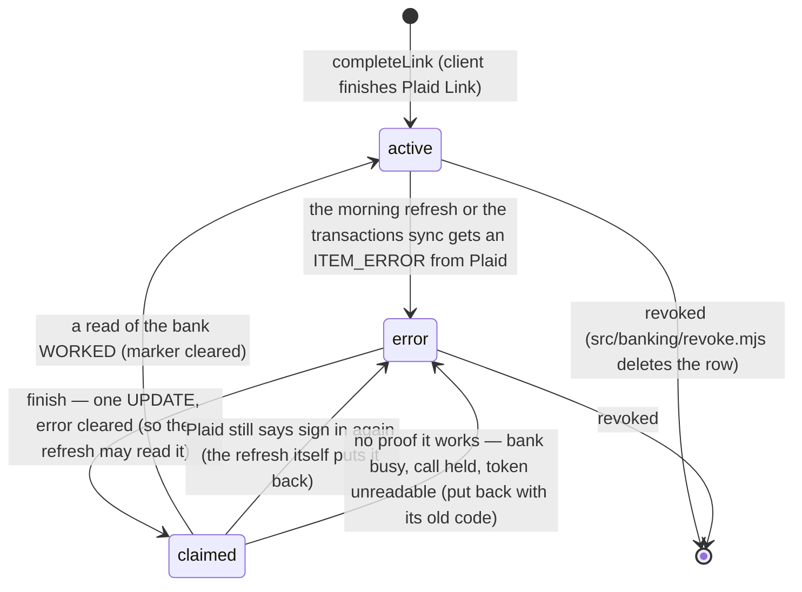
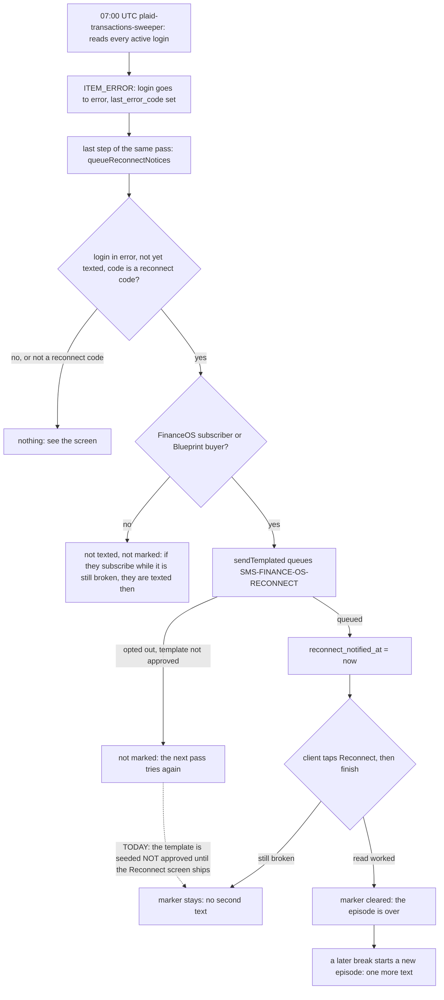

# Bank relink — flow

FinanceOS F2. A bank login breaks; the client fixes it from FinanceOS; we check the fix by reading the
bank again. Before this, a login that Plaid said needed the client (`ITEM_LOGIN_REQUIRED` and its
relatives) went to `link_state = 'error'` and was never read again, and nothing let the client put it right.

Code: `src/banking/plaid-relink.mjs` (status, start, finish), `src/banking/plaid-item-errors.mjs` (plain words and
the button for each Plaid code), `api/banking/relink.mjs` (the door), `src/finance/bank-reconnect-notice.mjs` (the one
text), `src/workflows/plaid-transactions-sweeper.mjs` (queues it daily), `src/banking/providers/plaid-http.mjs`
(`createLinkToken` in update mode, `sandboxResetLogin`). Migration 474: one nullable column and one SMS template.
Contract for the screen: `docs/finance/bank-relink.md`. The refresh this builds on: `docs/journeys/plaid-refresh-flow.md`.

The screen itself is not built yet, so the browser steps below are marked **UNVERIFIED**: no code in this repo
opens Plaid Link in update mode. Everything else was run (see the proof at the bottom).

## The states of one login



`claimed` is not a stored state. It is `active` for the few moments between the claim and the read, which is
why a failed read always puts the login back: **a login is active only after a read proved it.**

## Fixing it (one client, one login)

```mermaid
sequenceDiagram
    participant S as FinanceOS screen
    participant A as /api/banking/relink
    participant P as Plaid
    S->>A: GET (client's own file)
    A-->>S: logins; one is needs_reconnect, error.fix = reconnect
    S->>A: POST start { item_id }
    A->>A: login looked up by org AND client; refused unless active or error, consented, with a saved token
    A->>P: /link/token/create { access_token, no products } (token decrypted in memory, AAD = Plaid item id)
    P-->>A: link_token
    A-->>S: link_token (never the access token)
    S->>P: open Link in update mode — UNVERIFIED, no screen yet
    P-->>S: onSuccess (its public_token is NOT used; nothing to exchange)
    S->>A: POST finish { item_id }
    A->>A: claim error to active
    A->>P: /accounts/get (the daily refresh's own code)
    alt the read worked
        A->>A: accounts upserted, marker cleared
        A-->>S: ok, accounts, login = active
    else Plaid still says sign in again
        A->>A: login back to error, new code and time
        A-->>S: 409 still_needs_reconnect, fix = reconnect
    else the bank or Plaid is busy, or the call is held
        A->>A: login back to error, code kept
        A-->>S: 502, fix = check_again
    end
```

**Check again** is the same `finish` call with no Link in front of it. It is also the way back for a login
Plaid repaired on its own, because no Plaid webhook route exists (so `LOGIN_REPAIRED` is not received).

`start` and `finish` are refused before anything is sent to Plaid when the login is not the caller's (404,
the same answer as an id that does not exist), is revoked, unlinked, pending or a practice login (409
`not_reconnectable`), or its saved token will not decrypt (409 `token_unreadable`).

## The text: one per error episode



* THE TEXT IS HELD UNTIL THE RECONNECT SCREEN SHIPS. It says "tap Reconnect" and that button is not built, so
  migration 474 seeds the template not approved and `sendTemplated` refuses it. The screen's change turns it on
  with a new migration (`compliance_passed = true` for this one key). Until then the lane
  `bank-relink-error-login-not-told` goes red when a paying client's login has been broken for 2 days and
  nobody told them.
* The job's candidate query leaves out clients who opted out of SMS and clients who do not pay, so they cannot
  fill the daily batch of 200 and starve a paying client.
* The text is queued AFTER the loop over clients, not inside it: a login that broke drops out of the list the loop
  walks (`clientsWithPlaid` lists active logins), so a client whose only login went bad would never be seen by a
  per-client step on the next pass. The step reads every `plaid_items` row in `error` with no marker.
* SEND, THEN RECORD. A pass that dies between the two is picked up by the next one and lands on the same message row:
  the eventId is the login id plus the instant its error was recorded, and an errored login is not read again, so
  neither moves. A login that breaks again later has a new error time, hence a new eventId.
* `sendTemplated` only writes a `messages` row at `status = 'queued'`. The dispatcher sends it behind the dry-run
  switch, quiet hours and the opt-out read.

## What this never does

* It never returns, logs or stores an access token in the clear. The credential column is read by one statement
  (`relink:token`), after the login has been judged repairable, and only `start` runs it.
* It never exchanges a public token (Plaid: the access token does not change in update mode).
* It never deletes a login or an account, closes an account, sets `entity_kind`, or turns an unknown balance into 0.
* It never asks Plaid for anything on an `active` login: `finish` on one is a no-op, so the call is not a way to ask
  Plaid for balances on demand.

## Proof (2026-10-06, Plaid sandbox, throwaway Items, in-memory rows, no database)

`node --env-file=.env scripts/plaid-relink-sandbox-proof.mjs` — an Item was made and read (14 accounts), forced into
`ITEM_LOGIN_REQUIRED` with `/sandbox/item/reset_login`, read again by the real refresh (marked `error`, `relinkNeeded`),
given an update-mode Link token by `startRelink` (Plaid accepted it, with and without account selection), and put through
`finishRelink`: still broken stays in `error`; a healthy Item whose row said `error` came back active with its accounts.
What was not run: the Link update-mode screen itself, which needs a browser.
