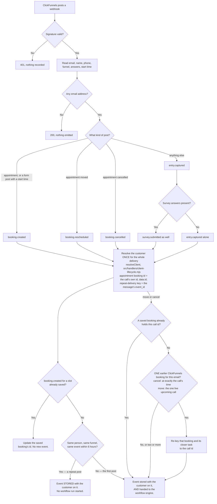
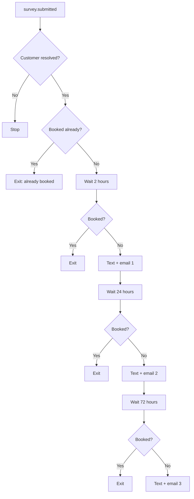
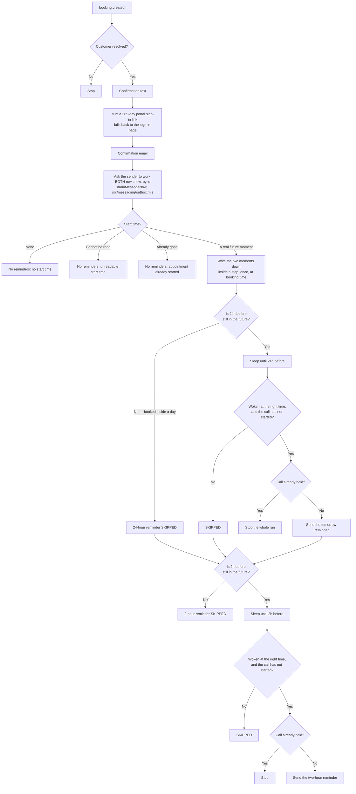
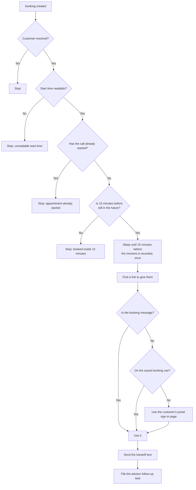

# Booking notifications — what fires, when, and what stops it

Generated by reading the code on 2026-09-04, after the ROUND 2 notification
repair. Every box below names the file it comes from. Nothing here is a plan;
it is what the files do.

This page exists because on 2026-09-03 one phone received 69 texts in two and a
half hours, 46 of them the same message, to customers who had already booked.
Three separate faults stacked up, and no single document showed how the pieces
connected, so nobody could see it coming.

## 1. From the funnel to an event

`src/adapters/clickfunnels.mjs` → `src/events/bus.mjs`



**The two things that changed here.**

* Every event is now written **with the customer on it**. Before 2026-09-03 the
  adapter passed none, so all 82 survey rows, all 95 lead rows and all 6 booking
  rows in production carried nothing. Any part of the system that looked up a
  customer's history was blind to the entire funnel.
* ClickFunnels posts **once per survey screen, plus retries** — 82 posts for 5
  real surveys. Each post has its own ClickFunnels id, so the ordinary duplicate
  check never collapsed them and each one started its own text cadence. A repeat
  post inside six hours is still stored (the later screens carry answers the
  first post does not have, and the "Survey Complete" stage depends on the last
  one) but it no longer starts a second run.

`booking.created` is deliberately **not** repeat-suppressed: it already has
slot-level dedupe, and a second booking is a real second appointment.

**One call, one booking id (2026-10-05).** A real ClickFunnels appointment
message has no top-level `id`. It carries `event_id` (new on every message) and
the call itself in `data`, whose `id` is the call's own id (it equals
`subject_id` on all 5 appointment messages ClickFunnels still lists for this
account). The adapter used to save the booking under `event_id`, so a move made
a second booking and a second closer task, and a cancel closed nothing. Now the
booking id is `data.id` (then `subject_id`), so create, move and cancel of one
call land on one booking row. `event_id` is still the repeat-delivery key, so
two moves of one call are both handled and a re-sent message is not.

Calls booked before this change are saved under a message id. When their move or
cancel arrives, the adapter re-keys that one earlier booking (and its closer task)
to the call id first — a cancel only when one live ClickFunnels booking for that
email sits at exactly the call's time, a move only when that email has exactly
one live upcoming ClickFunnels booking. Anything less certain is left alone.
`src/adapters/clickfunnels.mjs` (`adoptEarlierBooking`).

## 2. What each event starts

| Event | Workflows woken | File |
|---|---|---|
| `entry.captured` | welcome text, new-lead intake, incomplete-survey nudge, first-touch capture, referral ownership | `s-00-welcome`, `s-01`, `s-02`, `at-01`, `af-02` |
| `survey.submitted` | the never-booked chase, and nothing else | `s-nobook-chase` |
| `booking.created` | confirm + reminders, the AI setter, the 15-minute handoff, staff alert, pre-call launcher, call-outcome enforcement, portal invite, no-show recovery | `s-04b`, `ai-set-01`, `ai-set-04`, `s-04c`, `bs-01`, `dpc-02`, `s-portal-invite`, `s-05a` |

## 3. The never-booked chase

`src/workflows/s-nobook-chase.mjs`



**"Booked?" is the question that could only ever answer no.** It asked for
booking events belonging to the customer, and no booking event belonged to
anybody. It now answers yes when **any** of these is true, within the
customer's own company only:

1. the booking event names this customer, or
2. the email address inside the booking event matches theirs, ignoring case, or
3. the last ten digits of the phone number inside the booking event match theirs.

Two and three are what stop the runs that are already asleep in production,
because every booking event they will wake against was written before the
customer was ever attached.

## 4. Confirmation and reminders

`src/workflows/s-04b-booking-reminders.mjs`



**A reminder whose moment has passed is not sent late. It is not sent.** The
subtraction was always right; nothing ever checked that the result was still in
the future. An unreadable start time makes a sleep that ends immediately, and a
call booked twenty hours out has a "24 hours before" that is already four hours
gone — both used to fire at once, and both said "tomorrow". The tolerance either
side of the intended moment is five minutes.

**The two moments are decided once and written down.** The workflow engine does
not run a long job from top to bottom. It runs it from the top, does the next
piece of work it has not done yet, records that piece's answer, and starts the
job again from the top — so anything worked out OUTSIDE a recorded piece of work
is worked out again, against the clock as it is on that later pass. The first
version of this repair worked the plan out in the open, which meant that at the
exact moment each reminder came due the plan was recomputed, decided the moment
had just gone, and sent nothing. Both reminders would have stopped for every
customer. The plan, and the check made on waking, are now each a recorded piece
of work, so the moments chosen when the booking arrived are the moments used.

**The confirmation no longer waits for a clock tick.** The sender sweeps every
five minutes, which is most of the three-minute delay the owner measured. The
two confirmation rows — and only those two — now ask to be worked immediately,
by id, through the same sender. The company pause switch, the daily cap, quiet
hours, opt-out and the compliance screen all still run; the sweep is unchanged
and remains the backstop for these two rows and for everything else.

## 5. The fifteen-minute handoff

`src/workflows/ai-set-04-3way-handoff.mjs`



The text used to end "link: ." — it asked for a meeting location and was given
no context at all, so the tag rendered as nothing. ClickFunnels supplies no
meeting link on any booking it takes, so a fallback that always answers is not
an edge case, it is the ordinary path.

**Known and not fixed here.** The fallback is the customer's portal sign-in
page. It is a real, working address, but the wording live in the database today
introduces it as though it were the link to join the call. The corrected wording
sits in `docs/ads/sms-copy-2026-09.md` and in the held copy commit, waiting for
the owner to read it; nothing in code makes that sentence honest, so it is named
here rather than papered over.

**Three ways this text used to be a lie about the clock, all now refused**: a
start time nothing can read, a call that has already started, and a booking
taken inside the last fifteen minutes. The first was refused before this repair
pass; the other two were not, so a booking carrying yesterday's start time sent
"Your call starts in 15 minutes" the instant it arrived.

## 6. Where a message actually goes out

Nothing above sends anything. `sendTemplated` writes one queued row.

```
workflow → sendTemplated (src/workflows/messaging.mjs)
             opt-out check → template lookup → draft guard → compliance flag
             writes ONE messages row, status 'queued'
          → src/messaging/dispatch.mjs — the only thing that hands a row to a provider
             driven by the sweep every 5 minutes (message-dispatch-sweeper)
             or, for the two booking confirmations only, immediately by id
          → src/messaging/providers/* — the only place anything leaves the building
```

## 7. Known gaps, not fixed here

* **The workflow engine's fan-out is fire-and-forget and its failure is
  swallowed** (`src/events/bus.mjs`). If the hand-off fails, nothing anywhere
  records it. Named as W10's first suspect for a different defect; untouched by
  this repair.
* **The six-hour repeat window is a judgement, not a measurement.** A person who
  genuinely re-applies on the same funnel within six hours gets one run, not
  two. Their record is still updated in full; only the second text cadence is
  suppressed.
* **The wording** of these messages is drafted in `docs/ads/sms-copy-2026-09.md`
  and seeded by a commit held for the owner to read first. Every behaviour on
  this page is correct against the wording that is live today.
