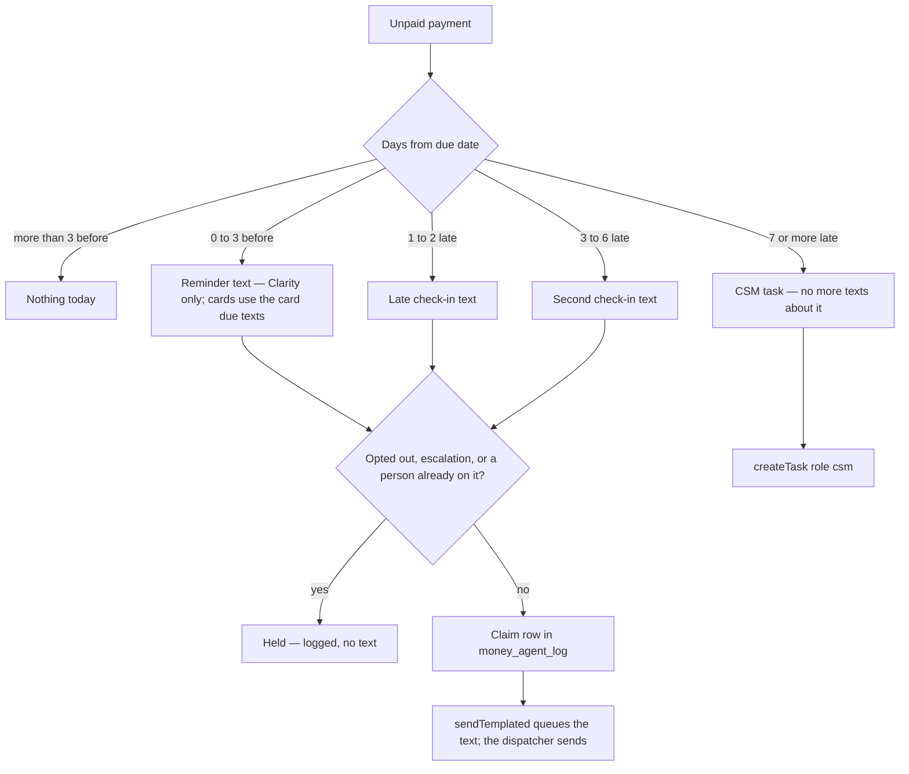
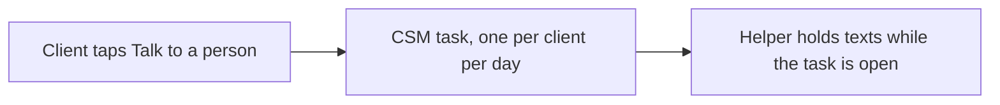

# Clarity Payments + the money helper — flow

Owner-set 2026-10-06: a Clarity Payment is any debt a client owes Fundhub LLC or
a subsidiary, including buy now, pay later (BNPL) plans. When a payment is late,
the money helper checks in first, then a person (the CSM) takes over.

Code: `db/migrations/443_clarity_payments.sql`, `src/finance/clarity-payments.mjs`,
`src/finance/money-agent.mjs`, `src/workflows/finance-os-money-agent.mjs`,
`api/money/payments.mjs`, `public/app/money-payments.html`.

## A plan

```mermaid
stateDiagram-v2
    [*] --> open: staff add_plan (plan + schedule in one statement; schedule must add up)
    open --> open: staff record_payment (oldest unpaid payment first)
    open --> settled: record_payment pays the last cent
    open --> settled: staff mark_settled
    settled --> [*]
```

## One unpaid payment (the helper runs daily at 16:30 UTC)

Every step is a row in `money_agent_log`. Caps live in the database: each rung
of each payment once ever; one helper text per client per day.

A plan linked to an invoice (`invoice_id`) is left to the AR ladder
(`src/workflows/ar-collections.mjs`) — the helper does nothing on it.

## Talk to a person

