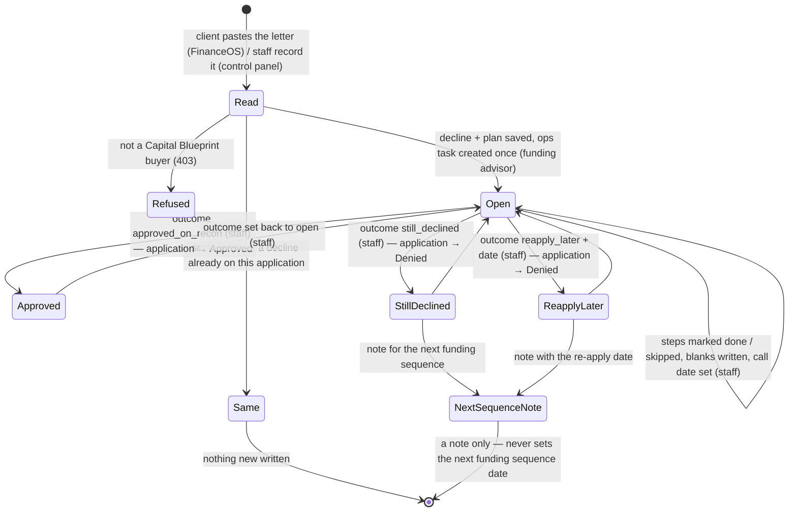
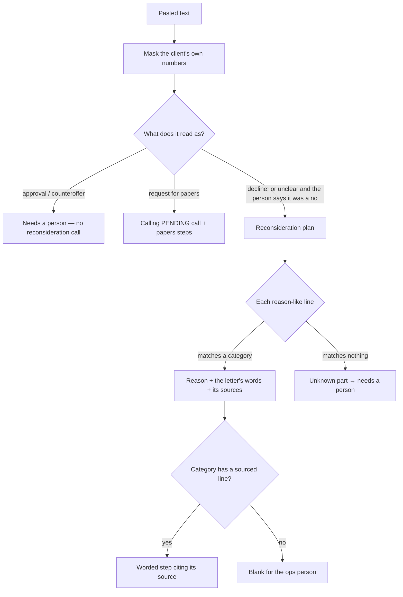

# Decline defense — flow

Capital Blueprint launch unit B1. How it works and the tool contract: `docs/finance/decline-defense.md`. Tables: `db/migrations/470_blueprint_decline_defense.sql`.

## A decline

## Reading a letter

## Events and writes

| Event | Who | Writes |
|---|---|---|
| `paste` | client or staff | `blueprint_declines` + `blueprint_decline_steps`; `tasks` (once) |
| `record` | staff | the same; linked application → Denied (`application_decisions` row) |
| `link_letter` | client or staff | `letter_document_id`; the send-the-letter step closes |
| `step` | staff | one step's status / written words |
| `schedule` | staff | `recon_on`; the open task's `due_at` |
| `outcome` | staff | outcome columns; linked application → Approved / Denied |
