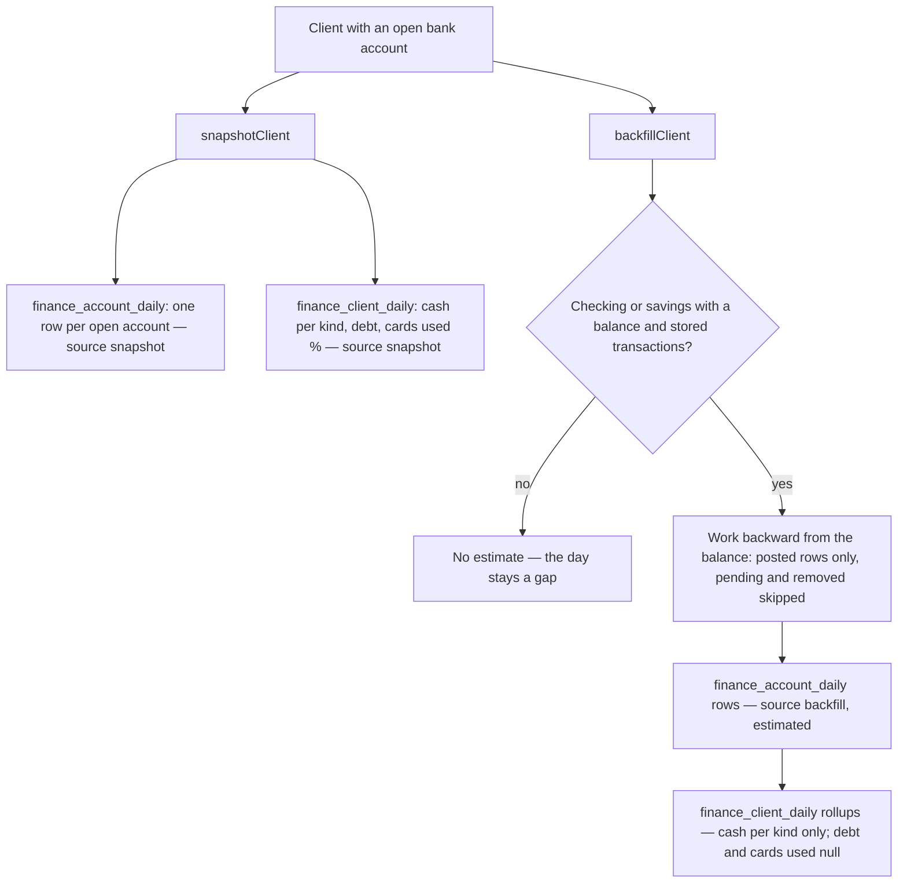
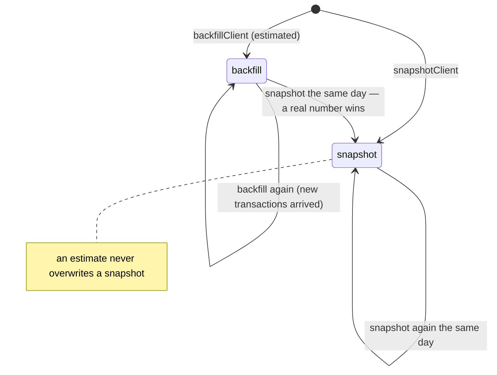
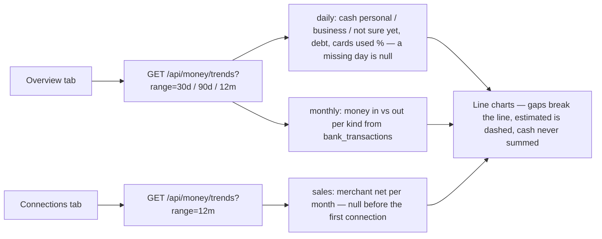

# FinanceOS trends — flow

Owner (2026-10-06): "the whole Finance OS with line graphs … Finance OS tracking."
FinanceOS keeps one row per account per day and one rollup per client per day,
and the Overview draws them as lines.

Code: `db/migrations/458_finance_trend_snapshots.sql`, `src/finance/money-trends.mjs`,
`src/workflows/finance-os-trend-snapshots.mjs`, `api/money/trends.mjs`,
`public/app/money-trends.js` (drawn inside `public/app/financeos.html`),
`scripts/finance-os-backfill-trends.mjs` (one-off, dry run unless `--apply`).

## One day of history (the job runs daily at 07:30 UTC, after the 07:00 Plaid pull)

## Who may overwrite a row

One row per (account, day) and per (client, day) — unique keys in 458.

## The read and the page

Same gate as `/api/money/overview`: a client session reads its own file only;
staff need owner / admin / sales_manager and `?client_id=` in their org.
