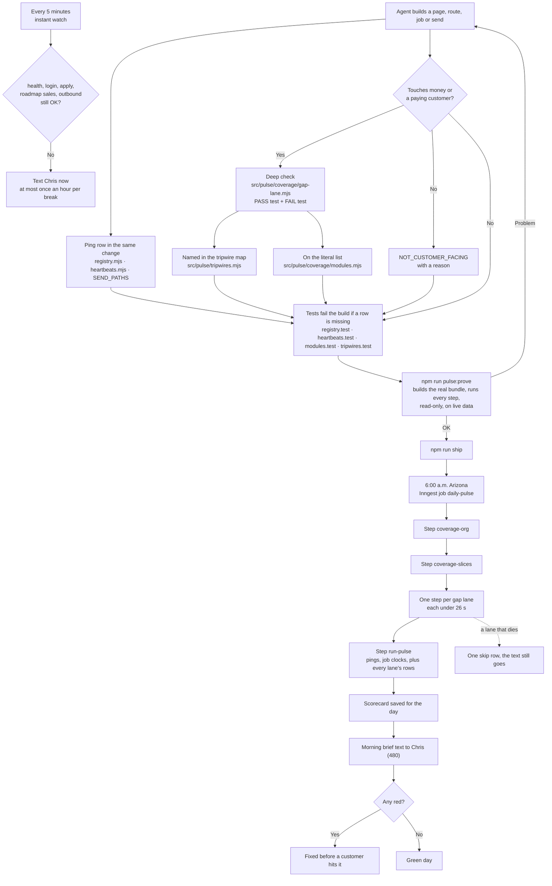
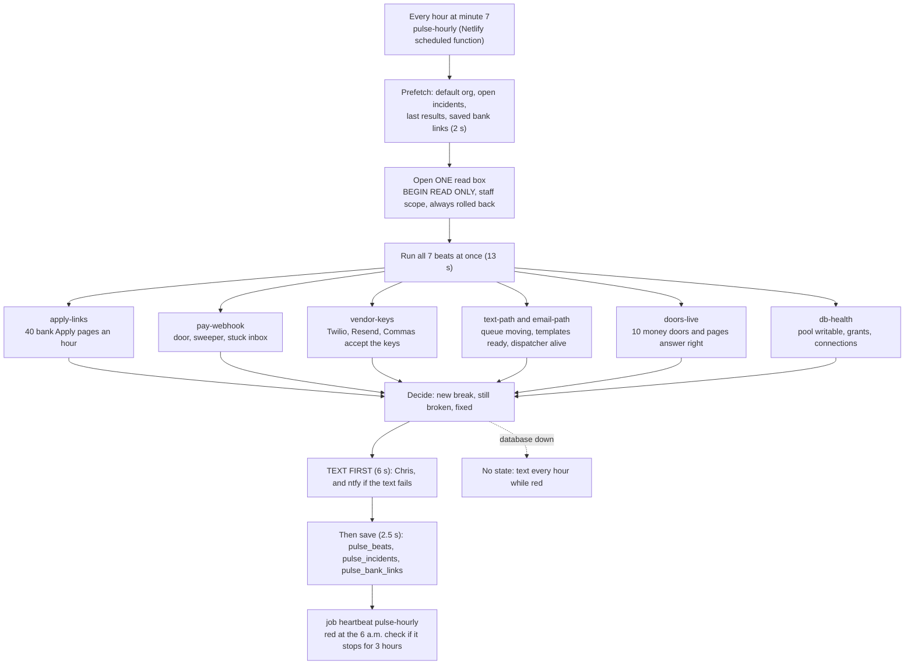
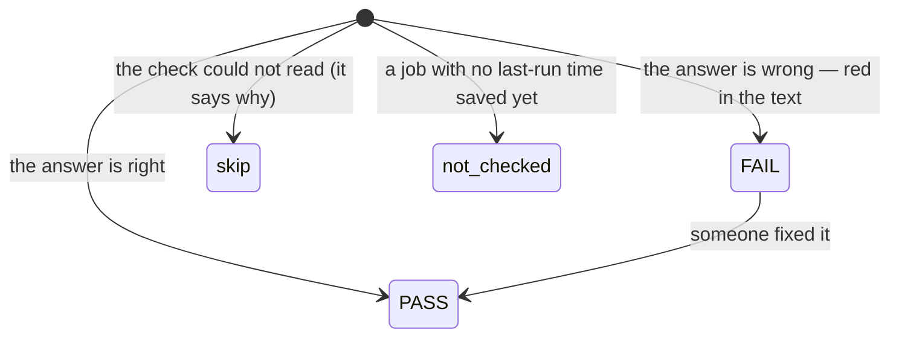

# Heartbeat — how a tripwire gets from code to Chris's phone

Traced from code on 2026-10-09: `src/workflows/daily-pulse.mjs`, `src/pulse/daily-pulse.mjs`, `src/pulse/coverage/run-slices.mjs`, `src/pulse/coverage/modules.mjs`, `src/pulse/instant-watch.mjs`, `src/ops/morning-brief.mjs`. The law is `.claude/rules/heartbeat-on-every-build.md`.

## In plain words

- A **check** asks one yes-or-no question about the company. "Does the login page answer?" "Did every paid client get the portal?"
- A **tripwire** is a check that goes red before a customer hits the break.
- Every morning at **6:00 a.m. Arizona**, one job runs about 970 checks. Every red one goes in the text to Chris.
- Every **5 minutes**, a small watch runs 5 checks (health, login, apply page, roadmap sales page, outbound sends). If one breaks, Chris gets a text right away. At most one text an hour for the same break.
- Most checks only run at 6 a.m. A break at noon shows up in the next morning's text, unless it is one of the 5.
- The pulse **only reports**. It never fixes anything. Chris, or an agent he asks, fixes reds.

## Two kinds of check

| Kind | What it proves | Where it lives | Example |
|---|---|---|---|
| Ping | The door answers. Blind to wrong data. | `src/pulse/registry.mjs`, `src/pulse/heartbeats.mjs` | `reg:portal-login.html` answers 200 |
| Deep (the tripwire) | The customer's result is right. | `src/pulse/coverage/gap-*.mjs` | `payments:paid-no-entitlement`: a paid client has no portal access |

Anything that touches money or a paying customer needs a deep check. A ping alone is not enough.

The tripwire map (`src/pulse/tripwires.mjs`) is where every page, route, job and send is sorted: money or customer names its deep check, the rest says why it is not customer-facing. A new one fails the tests until it is sorted. That is what sews the tripwires into every build.

## The picture

## The hourly pulse (added 2026-10-09)

Every hour at minute 7 a small Netlify scheduled function (`netlify/functions/pulse-hourly.mjs`, outside Inngest, so it runs even if Inngest is down) tests the company on purpose. Tonight's pulse is the **read-only half**: each beat reads data through a box where Postgres itself refuses writes, and reads the web with GET and HEAD only. A beat cannot save, send or call a vendor with a write.

- A beat with `damp 2` (vendor keys, doors, bank links) must be red twice in a row before it texts, so one vendor blip does not wake Chris.
- A break texts at once, texts again every hour ("still broken, hour N") and texts once when fixed.
- When the fix is done, the four learning fields on the incident and an entry in `docs/lessons/pulse-lessons.md` record what broke and what now guards it.
- **Not built yet (on purpose):** the write-through half, where a signed test signal travels through the doors that save data inside a rolled-back box. It needs locks inside the Node process that have never run on a real Postgres. It waits until proven on a scratch database and watched once. Also not built: GitHub issues and the Claude "pulse fixer" session (they wait on an owner decision about a private repo).

## The states of one check

`skip` is never a pass. A check that can only pass, or only skip, is not a tripwire.

## Traps already paid for (2026-10-08)

1. **A folder scan ships empty.** The live bundle carried 0 of 70 check files, and nothing said so. Now every file is a literal import in `modules.mjs`, and a test checks the list.
2. **26 seconds per step.** All the checks in one step took about 61 s. Netlify cuts at 26 s, so no text would have gone out. Now each lane is its own step.
3. **No repo files at run time.** Checks that read source files passed on a laptop and went red on the server. `npm run pulse:prove` runs from the real bundle to catch this.
