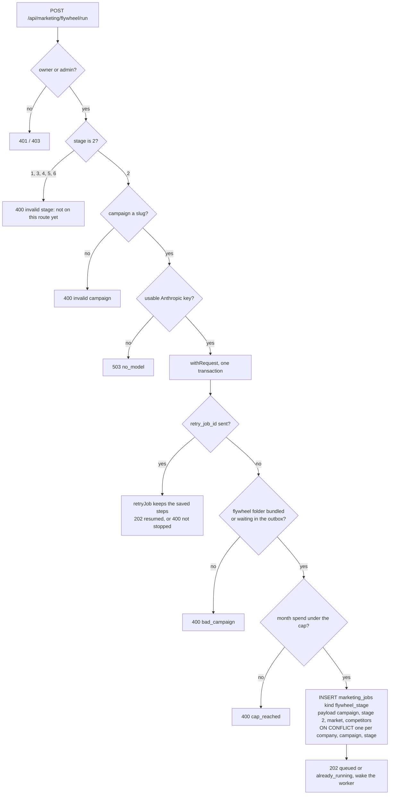
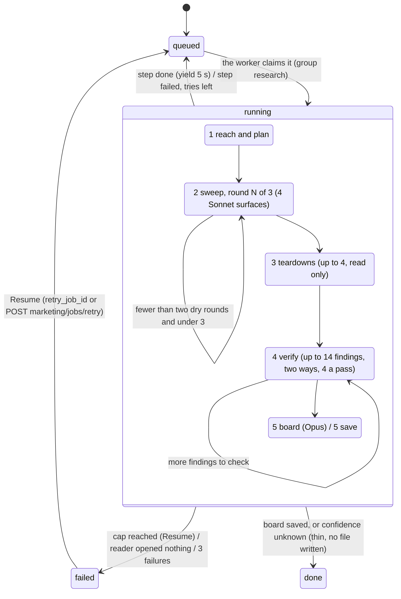

# Research the market (flywheel step 2, J2) — what the back end does today

Required by `CLAUDE.md` §3a step 4. Written 2026-10-06 from the code on branch
`mm-x2-market-deep-research` (unit X2, design `docs/specs/command-center-design-2026-10-05.md`
§6 "Slice 10", back end only; the row on the Ideas card is lane E's unit X8). The route
shape is in `docs/specs/marketing-machine-api.md` §6.10. Ported from
`.claude/workflows/ad-research.js` (same phases, surfaces, schemas and confidence formula).

Drawn from code, not from the design. **NOT BUILT** marks what the code does not do yet.
The yardstick is the design's slice 10 and §5 safety rules 13, 14, 17 and 18 (there is no
`marketing-machine-intended.md` on any branch).

## Starting — `POST /api/marketing/flywheel/run {campaign, stage: 2}`

## The run — 5 saved steps

`src/marketing/flywheel/ad-research.mjs`, sent there by `src/marketing/flywheel/stage-job.mjs`
(the `flywheel_stage` handler, by `payload.stage`), run by `src/marketing/research/runner.mjs`.

Step by step, from the code:

1. **Reach and plan.** Reads `00-OWNER-NOTES.md`, `01-avatar.md` and the old
   `02-ad-research.md` from GitHub at one pinned commit (bundle copy when GitHub cannot be
   read, pending outbox saves laid on top). A Sonnet call opens the 7 probe sites with
   web fetch; reachable is decided in code from the fetch results. None opened: the run
   fails with "Anthropic's reader could not open any page. Nothing was researched."
   Then an Opus plan (structured output): competitors and phrasings.
2. **Sweep.** 4 surfaces in parallel (competitor funnels, adjacent productized offers,
   organic angles, complaints and burnout), each `web_search` (7) and `web_fetch` (5),
   each saved the moment it lands. Up to 3 rounds; two dry rounds stop it; a failed
   surface never counts as dry. A page that failed with an HTTP error is offered to the
   next round through Jina Reader; a robots.txt or domain refusal never is.
3. **Teardowns.** Up to 4 funnels with a price, a guarantee or tier C evidence; reads only
   (the prompt forbids forms, bookings and logins). A teardown counts only when the call
   actually opened a page; its prices stay only when a page it read states them.
4. **Verify.** Up to 14 findings with a price or tier C: a provenance check (it must open
   that page) and a staleness check; a finding holds only when both hold.
5. **Board.** Confidence in code (measured / indirect / inferred / unknown, the chat
   workflow's formula). Unknown: no board and no file ("Thin: not enough could be reached.
   N findings, M checked."). Otherwise one Opus board call; every link must be a kept
   source. **Save**: `marketing/flywheel/<campaign>/02-ad-research.md` through the repo
   outbox (one replace), stamped `stage: 2`, `version` one more than the old file,
   `status: draft`, `inputs: 01-avatar.md: <body hash from the same read>`, the counts;
   then a "How this was checked" block and a Sources list; one buzz "The market research
   for Partner offer is ready to read."

Checks in code (design §5 rule 14): a finding's URL must be in that call's own result
blocks or citations (else thrown out, counted); a headline is verbatim only when the page
or Anthropic's cited text holds those words (else marked paraphrase); a price stays only
when a page that call read states it.

Caps (design §5 rule 13): $40 a run (`max_batch_cost_usd`, or `run_caps.ad_research` once
Settings has it) and the $300 month cap. Before every batch: spent plus the batch's worst
case, with the board's reserve held back. The batch shrinks first ("Round 3 read 2 of 4
surfaces to stay under $40."), then the run fails with "Stopped at the $40 run cap after
step N. What it found so far is saved." and Resume carries on from the saved steps. At most
106 searches (138 with retries), summed across continuations.

## Gaps (findings, not fixes)

1. **Shared route.** `POST marketing/flywheel/run` starts step 2 only. Steps 1, 4 and 5
   (units X1 and X3) add their branches; `GET marketing/flywheel` and
   `GET marketing/flywheel/job` (the row and the poll) are theirs. **NOT BUILT here.**
2. **Approve, Tweak, Redo for step 2** go through `POST marketing/flywheel/approve|tweak`
   (X1/X3) and this route. Approve's `set_front_matter_key` outbox op is not built on this
   branch.
3. **The offer writer reads step 2 through the repo reader now.** `POST
   /api/marketing/offer/generate` fills its default inputs from
   `src/marketing/research/repo-read.mjs repoFlywheelDefaults` (GitHub at one commit, the
   outbox's waiting saves on top, the bundle on any trouble), so a new board reaches it
   without a ship once `GITHUB_REPO_TOKEN` is set; with no token it reads the bundle plus
   the waiting saves. `src/marketing/offer-inputs.mjs` itself is unchanged.
4. **409 vs 400.** The design writes `409 cap_hit`; the contract keeps 409 for `stale`, so
   this answers `400 cap_reached` (API doc §8 gap 9).
