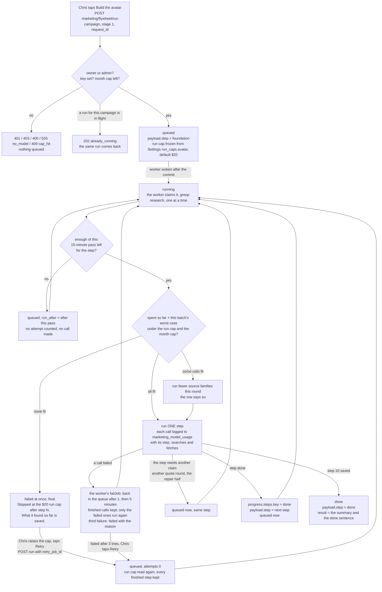
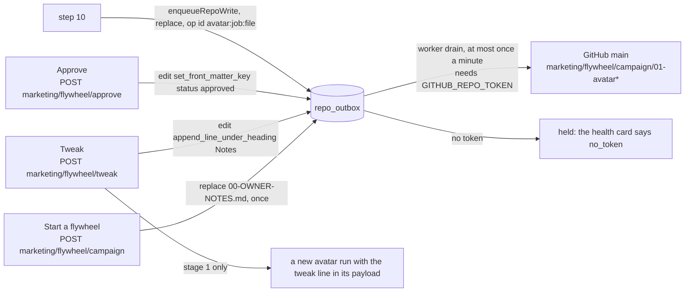

# Build the avatar on the server — the flow, from the code (unit X1)

Flywheel step 1, "Who we sell to", as it runs from a dashboard tap. Generated from the
code in this commit, not from the design: `api/marketing/flywheel/run.mjs`,
`src/marketing/avatar/run.mjs`, `src/marketing/avatar/store.mjs`,
`src/marketing/avatar/sources.mjs`, `src/marketing/avatar/word-bank.mjs`,
`src/marketing/avatar/document.mjs`, the worker (`src/marketing/worker.mjs`) and the
outbox (`src/repo/outbox.mjs`). The yardstick is the design
(`docs/specs/command-center-design-2026-10-05.md` §2 J1, §3.2 row 1, §5 rules 13, 14,
17, 18, §6 slice 5a); there is no `marketing-machine-intended.md` yet (design §7
question 7). Anything not traced to code is marked UNVERIFIED.

## The record and the states it moves through

One `marketing_jobs` row, `kind = 'avatar'`. `payload.campaign` and `payload.step` are
required by a CHECK (migration 418); one row per company and campaign may be queued or
running (partial unique index). Every saved step lives in `payload.progress`, so no
queue function ever wipes it.

## The ten steps (one per claim)

| # | Key | What it does | Model calls | Saved in `payload.progress` |
|---|---|---|---|---|
| 1 | foundation | Reads the owner notes (stage 1 and "all" lines), the price list (`src/config/offers.mjs`), the live testimonials and the last foundation file; writes Service_Business_Foundation.md (Prompt 1) | 1 Opus 5.5 | `owner_notes`, `testimonial_quotes`, `docs.foundation` |
| 2 | overview | Service_Overview.md (Prompt 3) | 1 Opus 5.5 | `docs.overview` |
| 3 | quotes | One round per claim: 5 source families in parallel, each a Sonnet 5.5 call with `web_search_20260318` (direct, at most 8 searches); each family saved as it answers; the checker keeps only quotes whose link was in that call's own results; up to 4 rounds, stops after 2 rounds with nothing new; a failed family never counts as dry and runs again alone (gives up after 2 tries) | 5 per round | `quotes.kept`, `quotes.rounds`, `quotes.dry`, `searches_used` |
| 4 | sort | Desire_Market_Research.md from the CHECKED notes (section 4 is written by code from the kept quotes, with links) and New_Mechanisms.md (Prompt 5), in parallel | 2 Opus 5.5 | `docs.desire`, `docs.mechanism` |
| 5 | word_bank | Merges the kept quotes into Market_Language_Bank.md in code: every old line stays, new ones go under one dated heading, a quote already there is not added twice | none | `docs.bank`, `bank.kept/added/entries` |
| 6 | new_info | 3 source families in parallel, Sonnet 5.5 with web search and `web_fetch_20260318` (at most 3 page reads each); a finding is kept only when its link was in that call's results | 3 | `info.families`, `fetches_used` |
| 7 | facts | New_Information.md from the checked findings; with none, a "Thin" file and no call | 0 or 1 Opus 5.5 | `docs.info` |
| 8 | avatar | Core_Avatar_Profile.md (Prompt 7) | 1 Opus 5.5 | `docs.avatar` |
| 9 | check | Claim 1: the fabrication and specificity checkers (Sonnet 5.5, structured verdicts). Claim 2: one repair (Opus 5.5) when they found anything, then every quoted line is re-checked against the kept quotes, the old word bank and the testimonials; an unproven one is marked [UNCHECKED] and counted | 2 + 0 or 1 | `check.verdicts`, `check.issues`, `check.unchecked`, `docs.final` |
| 10 | save | Eight files in one outbox transaction (01-avatar.md with the stamp, the six supporting documents, Sources.md), version = last version + 1, status draft; one buzz "The avatar for Partner offer is ready to read." | none | `saved` |

The search ceiling is 184 a run (4 x 5 x 8 + 3 x 8), enforced across continuations
(callModel lowers `max_uses` by the searches already made when a turn pauses).

## Where the files go

## The reads

- `GET marketing/flywheel?campaign=` — six rows in words; step 1 carries the newest run
  (`Running: step 3 of 10, searching the web for buyer quotes, round 2. … $1.90 spent so
  far, 23 searches.`, `Stopped at the $20 run cap after step 6. …`, `Could not finish: …`,
  `Done. N new quotes, M kept. Version V, built on the server. Not reviewed.`) and
  "Saved. Reaching the repo…" while a save waits. File states come from the flywheel
  status script on the bundled copy with waiting saves laid on top.
- `GET marketing/flywheel/job?id=` — the run, every step with its status and attempts,
  and spend and searches from the ledger.
- `GET marketing/costs` — `kinds.avatar` is null ("unknown, not measured yet") until a
  finished run has ledger rows, then its cost, minutes, searches and fetches;
  `avatar_line` is the sentence under the button.

## Gaps between the design and this code (findings, not fixed)

1. The screen is not built in this unit: no Build the avatar button on Today's stage-1
   row yet, no cost sheet, no Read it / Approve / Tweak / Redo / Retry controls (lane E,
   unit X8 builds the Ideas card; Today's stage-1 row is not wired to these routes).
2. `GET marketing/flywheel` reads the bundled copy plus waiting saves, not GitHub at a
   pinned commit; the GitHub reader exists (`src/marketing/flywheel/repo-read.mjs`) and
   the run uses it, but the GET does not call GitHub on every poll (no ETag cache yet).
3. The worker's generic Retry (`jobs.mjs retryJob`, used by U26's `POST
   marketing/jobs/retry`) clears `result`; the avatar keeps its checkpoints in
   `payload.progress` so that Retry still resumes, but it would also clear the done
   summary of a finished run (it only retries failed rows, so this does not happen).
4. The COMPLIANCE checker lens of the chat SOP is not run (owner note 2026-08-31 "all |
   no compliance checking in this pipeline"; CLAUDE.md §7).
5. Stages 2, 4, 5 and 6 cannot be run from `POST marketing/flywheel/run` (400 in words);
   their units are slice 10 (X2) and slice 5 (X3).
6. Whether citations attach to the JSON a research call ends with is UNVERIFIED until a
   real run: if they do not, every kept quote is a [PARAPHRASE] (its link still proven)
   and the stage reads "Thin" on word-for-word quotes.
7. Settings cannot edit `run_caps` yet (the column exists with {"avatar": 20}; the
   settings route does not expose it).
