# Marketing Command Center — what the back end does today

Required by `CLAUDE.md` §3a step 4. Written 2026-10-05 from the code on branch
`m10-dashboard-backend` (slice 1, back end only). The plan is
`docs/specs/marketing-dashboard-plan-2026-10-05.md`; the JSON shape is
`docs/specs/marketing-today-contract.md`.

Drawn from code, not from the plan. Anything the code does not do yet is marked
**NOT BUILT** rather than drawn as if it ran.

Updated 2026-10-05 on branch `cc-slice0-today-truth` for slice 0 of
`docs/specs/command-center-design-2026-10-05.md` ("Today tells the truth"): whole-day
spend windows, `prior_30_days`, the ClickFunnels time, measured costs, the stage counts
and review cards, the page that reads them, and `max_jobs: 1` on Write ad copy.

## The Today read — `GET /api/marketing/today`

Read only. Each part reads in its own short transaction (`asStaff()`), so one part
that cannot be read does not take the others with it.

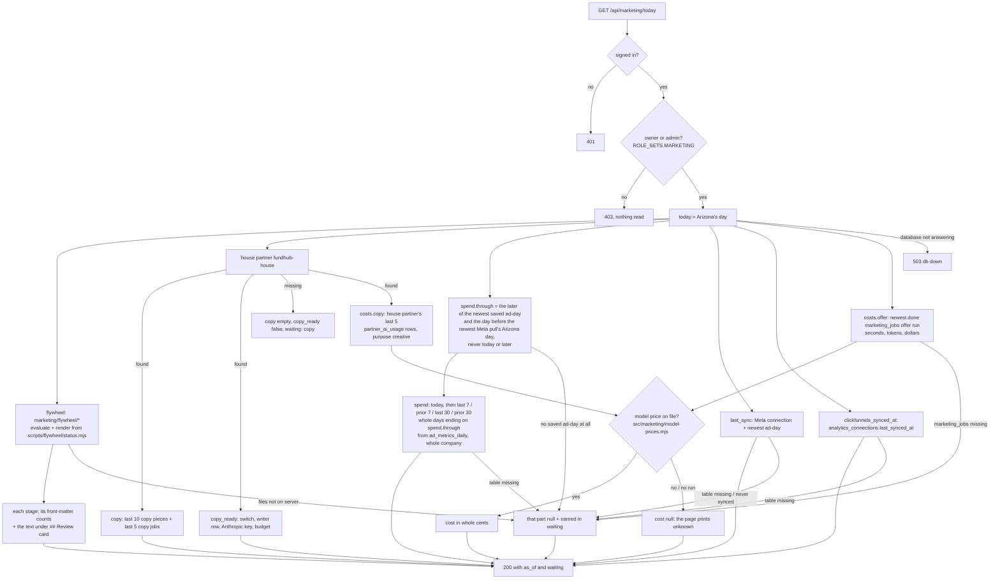
```mermaid
flowchart TD
  A[GET /api/marketing/today] --> B{signed in?}
  B -->|no| B1[401]
  B -->|yes| C{owner or admin?<br/>ROLE_SETS.MARKETING}
  C -->|no| C1[403, nothing read]
  C -->|yes| D[today = Arizona's day]
  D --> F[flywheel: marketing/flywheel/*<br/>evaluate + render from scripts/flywheel/status.mjs]
  D --> H[house partner fundhub-house]
  H -->|found| H1[copy: last 10 copy pieces + last 5 copy jobs]
  H -->|found| H2[copy_ready: switch, writer row, Anthropic key, budget]
  H -->|missing| H3[copy empty, copy_ready false, waiting: copy]
  F --> F2[each stage: its front-matter counts<br/>+ the text under ## Review card]
  D --> S0[spend.through = the later of the newest saved ad-day<br/>and the day before the newest Meta pull's Arizona day,<br/>never today or later]
  S0 --> S[spend: today, then last 7 / prior 7 / last 30 / prior 30<br/>whole days ending on spend.through<br/>from ad_metrics_daily, whole company]
  D --> L[last_sync: Meta connection + newest ad-day]
  D --> CF[clickfunnels_synced_at:<br/>analytics_connections.last_synced_at]
  D --> CO[costs.offer: newest done marketing_jobs offer run<br/>seconds, tokens, dollars]
  H -->|found| CC[costs.copy: house partner's last 5<br/>partner_ai_usage rows, purpose creative]
  CO & CC --> PR{model price on file?<br/>src/marketing/model-prices.mjs}
  PR -->|yes| PR1[cost in whole cents]
  PR -->|no / no run| PR2[cost null: the page prints unknown]
  F2 & H1 & H2 & S & L & CF & PR1 & PR2 --> Z[200 with as_of and waiting]
  F -->|files not on server| W[that part null + named in waiting]
  S0 -->|no saved ad-day at all| W
  S -->|table missing| W
  L -->|table missing / never synced| W
  CF -->|table missing| W
  CO -->|marketing_jobs missing| W
  W --> Z
  D -->|database not answering| E[503 db down]
```

- A window with no saved ad-days is `null`, never `0`.
- The 7 and 30 day windows end on `spend.through`, never on today, so both sides of
  every comparison are whole days. Only `today` is today. `spend.through` is the later
  of the newest saved ad-day and the last whole day the newest Meta pull covered, so
  the windows keep moving after ads stop (Meta sends no row for a day with no ads).
  A covered window with no rows stays `null`; the page says "No ad spend saved for
  Oct 5 to Oct 11."
- A cost is `null` when no run was measured, or when a run's model has no price with a
  source in `src/marketing/model-prices.mjs` (today only `claude-opus-5-5` has one).
- A table or column that is not in the database yet (Postgres 42P01 / 42703 / 42883)
  makes that part `waiting`. Any other database error is a 503 (connection) or a 500.

## Write ad copy — the job states (existing Creative Factory path)

Nothing new in the states. What changed in slice 1: the writer's backup to Anthropic,
the copy writer row, and the house partner's switch (`db/seed/296`).

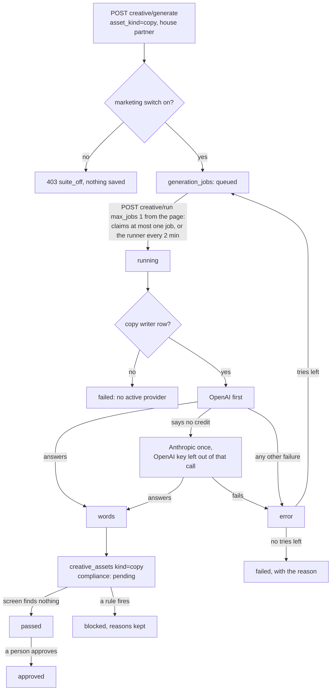
```mermaid
flowchart TD
  C0[POST creative/generate<br/>asset_kind=copy, house partner] --> G{marketing switch on?}
  G -->|no| G1[403 suite_off, nothing saved]
  G -->|yes| C1[generation_jobs: queued]
  C1 -->|POST creative/run max_jobs 1 from the page:<br/>claims at most one job, or the runner every 2 min| C2[running]
  C2 --> R{copy writer row?}
  R -->|no| C9[failed: no active provider]
  R -->|yes| M[OpenAI first]
  M -->|answers| T[words]
  M -->|says no credit| A[Anthropic once,<br/>OpenAI key left out of that call]
  M -->|any other failure| X[error]
  A -->|answers| T
  A -->|fails| X
  X -->|tries left| C1
  X -->|no tries left| C9b[failed, with the reason]
  T --> C3[creative_assets kind=copy<br/>compliance: pending]
  C3 -->|screen finds nothing| C4[passed]
  C3 -->|a rule fires| C5[blocked, reasons kept]
  C4 -->|a person approves| C6[approved]
```

## The page — `public/app/marketing-command-center.*` (Today view)

What the page reads, and when. Drawn from `public/app/marketing-command-center.js`.

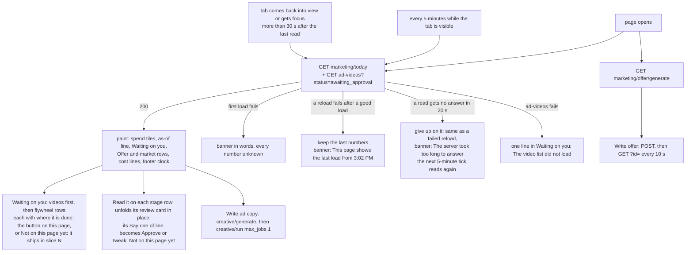
```mermaid
flowchart TD
  P0[page opens] --> P1[GET marketing/today<br/>+ GET ad-videos?status=awaiting_approval]
  P0 --> P2[GET marketing/offer/generate]
  P1 -->|200| P3[paint: spend tiles, as-of line, Waiting on you,<br/>Offer and market rows, cost lines, footer clock]
  P1 -->|first load fails| P4[banner in words, every number unknown]
  T1[every 5 minutes while the tab is visible] --> P1
  T2[tab comes back into view or gets focus<br/>more than 30 s after the last read] --> P1
  P1 -->|a reload fails after a good load| P5[keep the last numbers<br/>banner: This page shows the last load from 3:02 PM]
  P1 -->|a read gets no answer in 20 s| P7[give up on it: same as a failed reload,<br/>banner: The server took too long to answer<br/>the next 5-minute tick reads again]
  P1 -->|ad-videos fails| P6[one line in Waiting on you: The video list did not load]
  P3 --> W1[Waiting on you: videos first, then flywheel rows<br/>each with where it is done: the button on this page,<br/>or Not on this page yet: it ships in slice N]
  P3 --> R1[Read it on each stage row: unfolds its review card in place;<br/>its Say one of line becomes Approve or tweak: Not on this page yet]
  P3 --> X1[Write ad copy: creative/generate, then creative/run max_jobs 1]
  P2 --> X2[Write offer: POST, then GET ?id= every 10 s]
```

- Nothing on the page approves a video or a flywheel step. The videos row says
  approving is not on the page yet, and when the text message's links ran out
  (`approval_expires_at`).
- Nothing on the page sends Chris to chat or Claude Code (owner law 2026-10-05,
  design §3.9). A row whose button is not built says "Not on this page yet: it ships
  in slice N" (design safety rule 9) and shows no button: approve the avatar 5a, approve
  any other step 5; run the avatar 5a ("Cost not measured."), market research 10
  ("Cost not measured."), steps 4 to 6 5; saving the offer file 1. No chat command is
  copied, and no row says "runs in chat".
- No inner scroll box: long ad copy and the offer fold behind Show more.
- The topbar wraps rather than pushing the page sideways: one row on a wide screen,
  Search and the account chip on a second row when they do not fit beside the name.

## NOT BUILT (on this branch)

- Running a flywheel stage from the page, approving one, tweaking one (design slice 5).
  The flywheel rows are read only.
- Approving or rejecting a video from the page (design slice 2). Only the count, the
  ads and the dates are shown.
- `GET marketing/costs` and the cost ledger (design slice 1). Until then the cost lines
  come from `GET marketing/today` `costs`, as above.

## U20 M5 11.1: metric definitions (`src/marketing/metrics.mjs`)

Written 2026-10-06 from the code on branch `mm-u20-metric-definitions`. Read only:
nothing here writes a row, calls Meta or calls a model. No endpoint yet (U31/U32
call these readers). The words for each number are in `docs/marketing/metrics.md`.

How one lead becomes numbers on its ad:

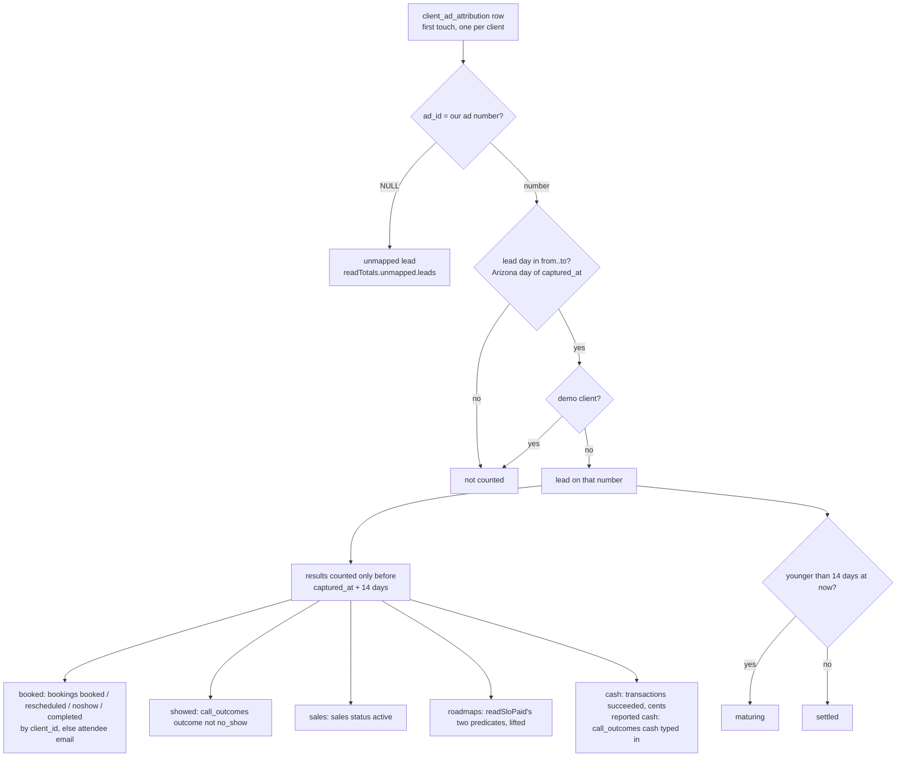
```mermaid
flowchart TD
  T[client_ad_attribution row<br/>first touch, one per client] --> N{ad_id = our ad number?}
  N -->|NULL| U[unmapped lead<br/>readTotals.unmapped.leads]
  N -->|number| D{lead day in from..to?<br/>Arizona day of captured_at}
  D -->|no| X[not counted]
  D -->|yes| C{demo client?}
  C -->|yes| X
  C -->|no| L[lead on that number]
  L --> W[results counted only before<br/>captured_at + 14 days]
  W --> B[booked: bookings booked / rescheduled / noshow / completed<br/>by client_id, else attendee email]
  W --> S[showed: call_outcomes outcome not no_show]
  W --> SA[sales: sales status active]
  W --> R[roadmaps: readSloPaid's two predicates, lifted]
  W --> M[cash: transactions succeeded, cents<br/>reported cash: call_outcomes cash typed in]
  L --> MA{younger than 14 days at now?}
  MA -->|yes| MT[maturing]
  MA -->|no| ST[settled]
```

How spend reaches a number, and how the two meet:

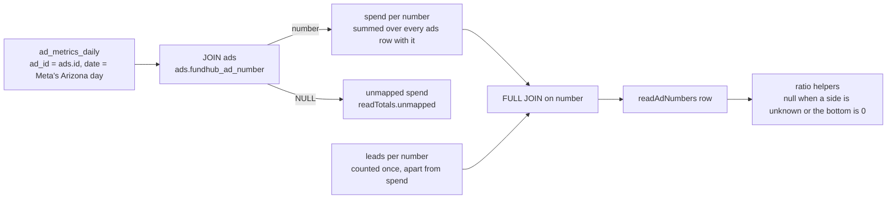
```mermaid
flowchart LR
  AM[ad_metrics_daily<br/>ad_id = ads.id, date = Meta's Arizona day] --> J[JOIN ads<br/>ads.fundhub_ad_number]
  J -->|number| SP[spend per number<br/>summed over every ads row with it]
  J -->|NULL| UM[unmapped spend<br/>readTotals.unmapped]
  SP --> F[FULL JOIN on number]
  LD[leads per number<br/>counted once, apart from spend] --> F
  F --> ROW[readAdNumbers row]
  ROW --> RT[ratio helpers<br/>null when a side is unknown or the bottom is 0]
```

Page events (`readFunnelEvents`): `events` named `funnel.*`, actor `person`, not
demo, by the event's Arizona day → ad number from the visit's own tags (leading
digits of `utm_content`, else the 407 Meta match) → funnel and step from
`src/funnel/pages.mjs`.

Gaps between the spec and the live data (recorded, not fixed) are listed in
`docs/marketing/metrics.md` under "Measured gaps": bookings has 0 rows while 74
`booking.created` events carry no client; call_outcomes has 0 rows; cash here is
transactions while `adAttributionRollup` counts payment links; "25% hold" is not
ad-spine's `hold_rate`; 2-second plays are stored on 0 of 69 ad-days.

## U01 API contract for every marketing/* route

Added 2026-10-05 by plan unit U01. This adds no step, state, route or screen. It writes down the
request and answer shape of every `marketing/*` route in spec v3 (M1 to M8), plus
`POST marketing/jobs/retry` and the `resume_ad` action on `campaigns/write`, so the back-end units
and the screens build to one shape.

- Doc: `docs/specs/marketing-machine-api.md` (46 routes).
- Twin: `src/marketing/api-contract.mjs` (`CONTRACT`, `assertMatchesContract`, `exampleResponse`).
- Test: `src/marketing/api-contract.test.mjs` fails when the doc and the module drift apart.

What is in the code today, traced through `ROUTES` in `netlify/functions/api.mjs`:

| Routes | Owner | In ROUTES today |
|---|---|---|
| `GET marketing/today` | existing; U32 adds keys | yes (existing keys only; the M5 keys are UNVERIFIED until U32 lands) |
| `POST campaigns/write` | existing; U15 adds `resume_ad` | yes (pause, resume, update_budget only; `resume_ad` is UNVERIFIED until U15 lands) |
| settings, funnels | U03 | no |
| scripts, script, approve, edit, reject, order | U25 | no |
| scripts/fix, ideas, batches, write-now, rules, jobs/retry | U26 | no |
| batches/next | U23 | no |
| health | U22 | no |
| angles, funnels/stats | U32 | no |
| ads, ad | U31 | no |
| meta/load, meta/load-status | U28 | no |
| shoot, shoot/mark, videos/*, video, map, pages/* | deferred | no |

Every route marked "no" is a shape only. Each owner unit adds its own flow section here when its
route lands. Gaps between the spec, the design doc and the fixed shapes are listed in the
contract's section 8.
## U03 Settings, funnels, and one save per press

Drawn from code on branch `mm-u03-settings-funnels`: `api/marketing/settings.mjs`,
`api/marketing/funnels.mjs`, `src/marketing/http.mjs`, `src/marketing/settings-store.mjs`,
`src/marketing/offer-facts.mjs`, migration `410_marketing_settings_funnels.sql`, seed
`297_marketing_funnels.sql`. Spec §6 Step 3, §7.8, §17. Owner and admin only on both
routes (requireAuth, then requireRole `ROLE_SETS.MARKETING`).

### Settings — `GET/POST /api/marketing/settings`

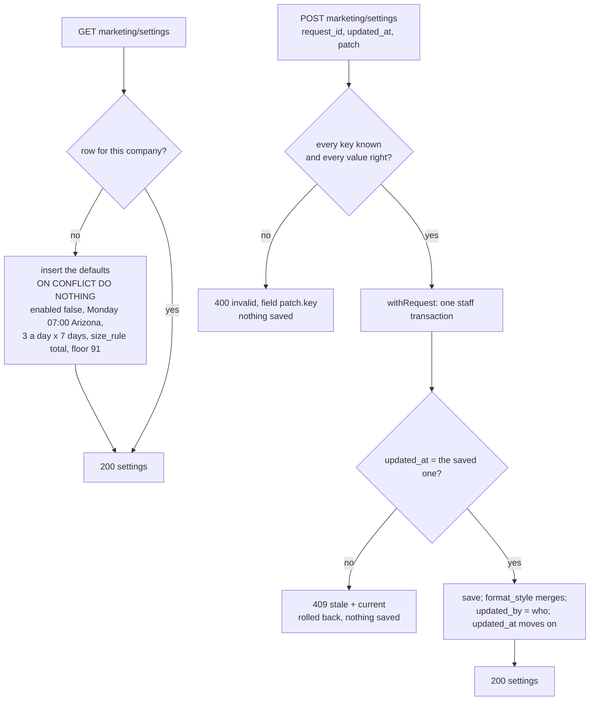
```mermaid
flowchart TD
  G[GET marketing/settings] --> G1{row for this company?}
  G1 -->|no| G2[insert the defaults<br/>ON CONFLICT DO NOTHING<br/>enabled false, Monday 07:00 Arizona,<br/>3 a day x 7 days, size_rule total, floor 91]
  G1 -->|yes| G3[200 settings]
  G2 --> G3
  P[POST marketing/settings<br/>request_id, updated_at, patch] --> V{every key known<br/>and every value right?}
  V -->|no| V1[400 invalid, field patch.key<br/>nothing saved]
  V -->|yes| W[withRequest: one staff transaction]
  W --> S{updated_at = the saved one?}
  S -->|no| S1[409 stale + current<br/>rolled back, nothing saved]
  S -->|yes| S2[save; format_style merges;<br/>updated_by = who; updated_at moves on]
  S2 --> R[200 settings]
```

- `enabled` goes true only when the patch says so — Chris's tap in Settings. No seed
  or migration sets it.
- Times are `HH:MM`. Money caps are whole dollars (model bills only).

### Funnels — `GET/POST /api/marketing/funnels`

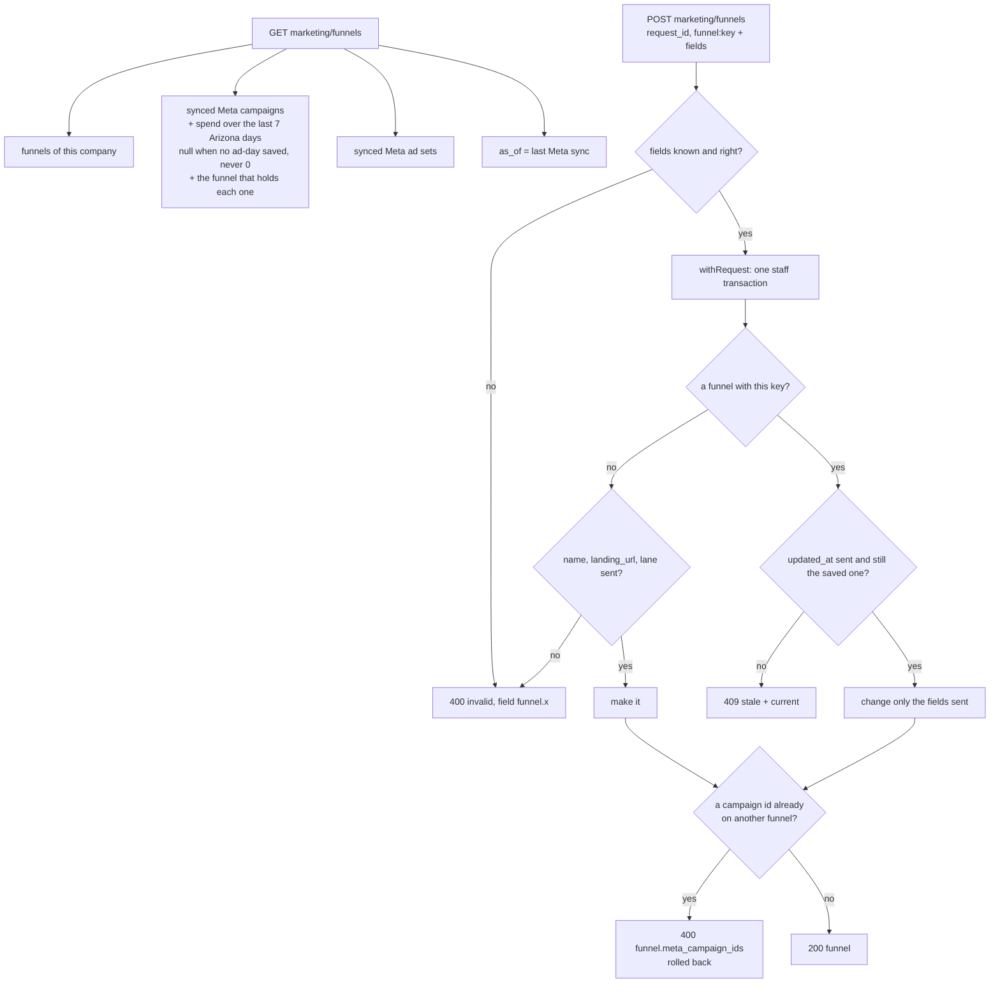
```mermaid
flowchart TD
  G[GET marketing/funnels] --> F[funnels of this company]
  G --> C[synced Meta campaigns<br/>+ spend over the last 7 Arizona days<br/>null when no ad-day saved, never 0<br/>+ the funnel that holds each one]
  G --> A[synced Meta ad sets]
  G --> T[as_of = last Meta sync]
  P[POST marketing/funnels<br/>request_id, funnel:key + fields] --> V{fields known and right?}
  V -->|no| V1[400 invalid, field funnel.x]
  V -->|yes| W[withRequest: one staff transaction]
  W --> K{a funnel with this key?}
  K -->|no| N{name, landing_url, lane sent?}
  N -->|no| V1
  N -->|yes| M[make it]
  K -->|yes| U{updated_at sent and still the saved one?}
  U -->|no| S1[409 stale + current]
  U -->|yes| X[change only the fields sent]
  M --> D{a campaign id already<br/>on another funnel?}
  X --> D
  D -->|yes| V2[400 funnel.meta_campaign_ids<br/>rolled back]
  D -->|no| R[200 funnel]
```

- Seed 297 makes `book_call` (https://apply.fundhub.ai/watch, lane sorting, book a call,
  offer `funding_dfy`, mix standard 2 : sorting 1) and `roadmap_147`
  (https://apply.fundhub.ai/roadmap, lane uwiq, offer `slo_roadmap`, mix standard 1) in the
  default company, once. `meta_campaign_ids` stay empty until Chris maps them.
- `offerFacts(offer_key)` reads each price from `src/slo/offer.mjs` or
  `src/config/offers.mjs`. No price is typed in `src/marketing/`.

### One save per press — `withRequest` (every marketing write)

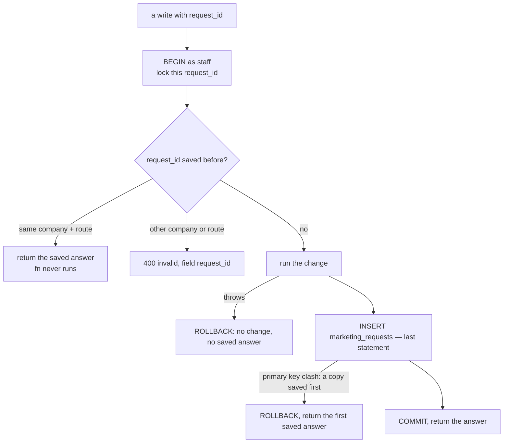
```mermaid
flowchart TD
  Q[a write with request_id] --> L[BEGIN as staff<br/>lock this request_id]
  L --> F{request_id saved before?}
  F -->|same company + route| A[return the saved answer<br/>fn never runs]
  F -->|other company or route| B[400 invalid, field request_id]
  F -->|no| R[run the change]
  R -->|throws| X[ROLLBACK: no change, no saved answer]
  R --> I[INSERT marketing_requests — last statement]
  I -->|primary key clash: a copy saved first| Y[ROLLBACK, return the first saved answer]
  I --> C[COMMIT, return the answer]
```

### Gaps between the spec and this code (findings, not reconciled)

- **Roadmap lane.** The spec seeds `roadmap_147` with lane `uwiq`; live roadmap visitors
  read lane `slo` (406/407). The seed uses the spec value until Chris answers the yes/no
  on the board. Numbers (M5) group by funnel, not lane.
- **offer_key values** (`funding_dfy`, `slo_roadmap`) are plan-chosen; the spec names the
  column, not the values.
- **One funnel per campaign.** The code refuses a Meta campaign that is already on another
  funnel of the same company, so a campaign's spend cannot count twice. The spec does not
  say this either way.
- **UNVERIFIED in a real database on this Mac** (no Postgres here): the SQL is proved by
  `src/http/marketing-settings.pg.test.mjs` and `marketing-funnels.pg.test.mjs` in GitHub CI.
## U04 Jobs, buzzes, model cost and shoots — the records (migration 411)

Drawn 2026-10-05 from the code on branch `mm-u04-jobs-buzzes-usage`:
`src/marketing/jobs.mjs`, `src/marketing/job-kinds.mjs`, `src/marketing/notify.mjs`,
`src/marketing/model-usage.mjs`, `db/migrations/411_marketing_buzzes_usage_shoots.sql`.
These are libraries and tables only. **No route, clock or worker calls them yet**: the
worker that claims jobs and sends buzzes is U22, the Retry button's route is U26, the
writer that logs model cost is U24. Those calls are marked UNVERIFIED below.

### A queued job (marketing_jobs, table from 409; claim index from 411)

`attempts` counts runs that went wrong (a failure, or a claim nobody finished). Claiming
and requeueing do not count. Kind `offer` is never touched by any of this: it runs on the
Write offer path above (`src/marketing/offer-store.mjs`).

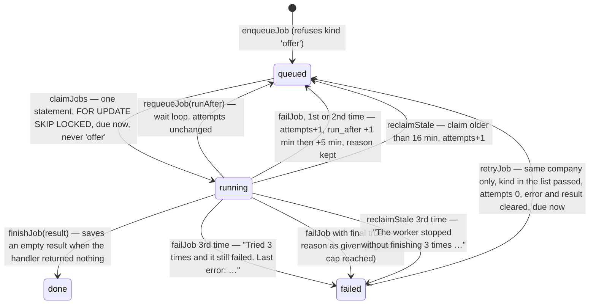
```mermaid
stateDiagram-v2
  [*] --> queued: enqueueJob (refuses kind 'offer')
  queued --> running: claimJobs — one statement, FOR UPDATE SKIP LOCKED, due now, never 'offer'
  running --> done: finishJob(result) — saves an empty result when the handler returned nothing
  running --> queued: requeueJob(runAfter) — wait loop, attempts unchanged
  running --> queued: failJob, 1st or 2nd time — attempts+1, run_after +1 min then +5 min, reason kept
  running --> failed: failJob 3rd time — "Tried 3 times and it still failed. Last error: …"
  running --> failed: failJob with final true — reason as given (e.g. cost cap reached)
  running --> queued: reclaimStale — claim older than 16 min, attempts+1
  running --> failed: reclaimStale 3rd time — "The worker stopped without finishing 3 times …"
  failed --> queued: retryJob — same company only, kind in the list passed, attempts 0, error and result cleared, due now
```

- `nextRunAfter({kinds})` reads the earliest queued `run_after` (never `offer`), so the
  worker can wait inside its pass for a job due in a few seconds. UNVERIFIED: no worker yet (U22).
- `JOB_KINDS` (`src/marketing/job-kinds.mjs`) is **empty**. A kind not in it is never
  claimed by the worker and cannot be retried from the screen. U24, U28 and U35 add kinds.
- Retry button → `POST marketing/jobs/retry` → `retryJob`: UNVERIFIED, the route is U26.

### A buzz (marketing_buzzes, 411)

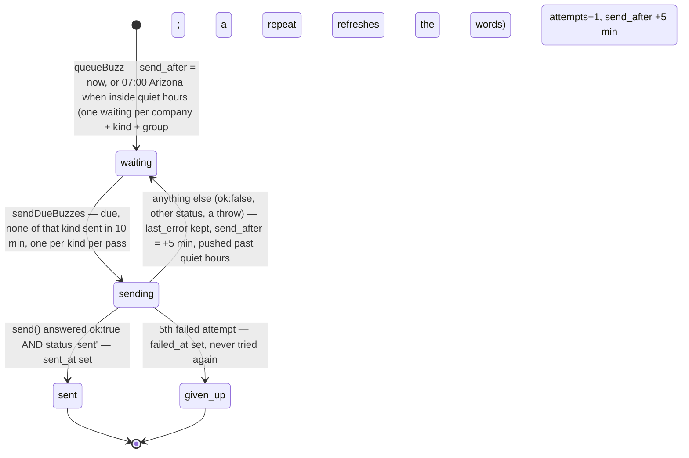
```mermaid
stateDiagram-v2
  [*] --> waiting: queueBuzz — send_after = now, or 07:00 Arizona when inside quiet hours (one waiting per company + kind + group; a repeat refreshes the words)
  waiting --> sending: sendDueBuzzes — due, none of that kind sent in 10 min, one per kind per pass; lease: attempts+1, send_after +5 min
  sending --> sent: send() answered ok:true AND status 'sent' — sent_at set
  sending --> waiting: anything else (ok:false, other status, a throw) — last_error kept, send_after = +5 min, pushed past quiet hours
  sending --> given_up: 5th failed attempt — failed_at set, never tried again
  sent --> [*]
  given_up --> [*]
```

- `send()` is always passed in. The worker will pass notify-fanout's `send`
  (`src/ad-videos/notify-fanout.mjs`); tests pass a fake. UNVERIFIED: no worker yet (U22).
- Which events buzz (scripts ready, videos ready, stuck) is decided by the callers
  (U24, U35, M3). UNVERIFIED: none of them call `queueBuzz` yet.

### Model cost (marketing_model_usage, 411)

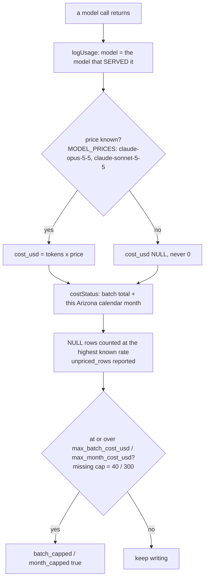
```mermaid
flowchart TD
  C[a model call returns] --> L[logUsage: model = the model that SERVED it]
  L --> P{price known?<br/>MODEL_PRICES: claude-opus-5-5, claude-sonnet-5-5}
  P -->|yes| R1[cost_usd = tokens x price]
  P -->|no| R2[cost_usd NULL, never 0]
  R1 & R2 --> S[costStatus: batch total + this Arizona calendar month]
  S --> W[NULL rows counted at the highest known rate<br/>unpriced_rows reported]
  W --> K{at or over max_batch_cost_usd / max_month_cost_usd?<br/>missing cap = 40 / 300}
  K -->|yes| X[batch_capped / month_capped true]
  K -->|no| Y[keep writing]
```

UNVERIFIED: the writer that logs every call and stops at a cap is U24; Write now's refusal is U26.

### A shoot (marketing_shoots, 411)

Table only. States `planned | filming | uploaded | done`, enforced by the database; a done
shoot must have `finished_at`. Nothing reads or writes it yet (Shoot Day routes and screen
are later units). UNVERIFIED.

**X5 update (branch `mm-x5-shoot-teleprompter`):** the Shoot Day routes now read and write
it — `GET/POST /api/marketing/shoot` and `POST /api/marketing/shoot/mark` — and so do the
Shoot tab (`public/app/cc-tab-shoot.js`, tab `shoot`) and the teleprompter page
(`public/app/teleprompter.html`). The states, the take file name rule and the gaps are
drawn in [`shoot-flow.md`](./shoot-flow.md). UNVERIFIED on production.

### Gaps between the spec and this code (findings, not reconciled)

- Spec §6 Step 3 lists `marketing_buzzes` without `attempts`, `last_error`, `failed_at`;
  the plan added them because notify-fanout's `send()` resolves `{ok:false}` instead of
  throwing. Built as the plan says.
- Spec §6 Step 4 says "After 3 attempts, a job fails". Here an attempt is a run that went
  wrong, not a claim, so wait loops (requeue) never use up tries.
- `group_key` is `NOT NULL DEFAULT ''` (spec lists it with no type) so "one waiting per
  group" also holds when no group is given.
## U05 M0 step 2: repo outbox (412), GitHub client provider, path allow-list, edit ops, lease-based drain (pooler-safe), worker wake

Drawn 2026-10-05 from the code on branch `mm-u05-repo-outbox`: `src/repo/outbox.mjs`,
`src/repo/allow-list.mjs`, `src/repo/edit-ops.mjs`, `src/messaging/providers/github-repo.mjs`,
`src/marketing/wake.mjs`, `db/migrations/412_repo_outbox.sql`. Spec §6 Step 2 and §2 item 8
("every save goes to the database and the repo").

**Nothing calls this yet.** The save routes (U25, U26, U35) call `enqueueRepoWrite` and
`wakeWorker`; the worker (U22) calls `drainOutbox` at most once a minute. Those boxes are
marked **NOT BUILT** below. Live commits also need `GITHUB_REPO_TOKEN` (only Chris can make it,
spec §16) and `MARKETING_WORKER_SECRET`; neither is set by this unit.

### A save, from the app to the repo

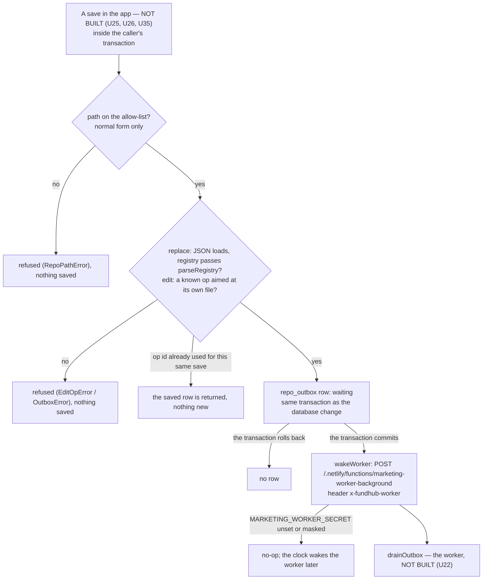
```mermaid
flowchart TD
  S["A save in the app — NOT BUILT (U25, U26, U35)<br/>inside the caller's transaction"] --> P{"path on the allow-list?<br/>normal form only"}
  P -->|no| P1["refused (RepoPathError), nothing saved"]
  P -->|yes| V{"replace: JSON loads, registry passes parseRegistry?<br/>edit: a known op aimed at its own file?"}
  V -->|no| V1["refused (EditOpError / OutboxError), nothing saved"]
  V -->|"op id already used for this same save"| V2["the saved row is returned, nothing new"]
  V -->|yes| E["repo_outbox row: waiting<br/>same transaction as the database change"]
  E -->|"the transaction rolls back"| X["no row"]
  E -->|"the transaction commits"| W["wakeWorker: POST /.netlify/functions/marketing-worker-background<br/>header x-fundhub-worker"]
  W -->|"MARKETING_WORKER_SECRET unset or masked"| W1["no-op; the clock wakes the worker later"]
  W --> D["drainOutbox — the worker, NOT BUILT (U22)"]
```

### One drain pass (`drainOutbox`)

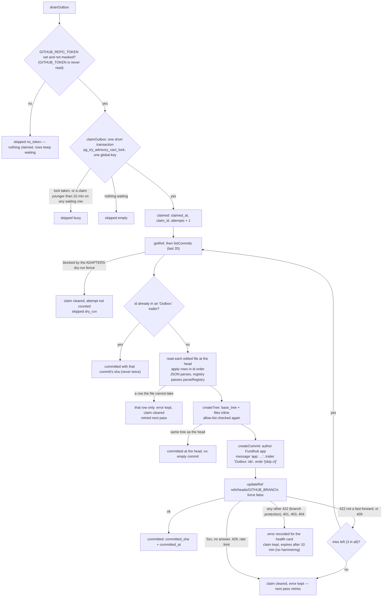
```mermaid
flowchart TD
  D["drainOutbox"] --> T{"GITHUB_REPO_TOKEN set and not masked?<br/>(GITHUB_TOKEN is never read)"}
  T -->|no| T1["skipped no_token — nothing claimed, rows keep waiting"]
  T -->|yes| C{"claimOutbox: one short transaction<br/>pg_try_advisory_xact_lock, one global key"}
  C -->|"lock taken, or a claim younger than 10 min on any waiting row"| C1["skipped busy"]
  C -->|"nothing waiting"| C2["skipped empty"]
  C -->|yes| CL["claimed: claimed_at, claim_id, attempts + 1"]
  CL --> G["getRef, then listCommits (last 20)"]
  G -->|"blocked by the ADAPTERS dry-run fence"| H["claim cleared, attempt not counted<br/>skipped dry_run"]
  G --> TR{"id already in an 'Outbox:' trailer?"}
  TR -->|yes| DONE1["committed with that commit's sha (never twice)"]
  TR -->|no| A["read each edited file at the head<br/>apply rows in id order<br/>JSON parses, registry passes parseRegistry"]
  A -->|"a row the file cannot take"| R["that row only: error kept, claim cleared<br/>retried next pass"]
  A --> TREE["createTree: base_tree + files inline<br/>allow-list checked again"]
  TREE -->|"same tree as the head"| DONE2["committed at the head, no empty commit"]
  TREE --> CM["createCommit: author Fundhub app<br/>message 'app: …', trailer 'Outbox: ids', ends '[skip ci]'"]
  CM --> U["updateRef refs/heads/GITHUB_BRANCH, force false"]
  U -->|ok| DONE3["committed: committed_sha + committed_at"]
  U -->|"422 not a fast forward, or 409"| G2{"tries left (3 in all)?"}
  G2 -->|yes| G
  G2 -->|no| RT["claim cleared, error kept — next pass retries"]
  U -->|"5xx, no answer, 429, rate limit"| RT
  U -->|"any other 422 (branch protection), 401, 403, 404"| ER["error recorded for the health card<br/>claim kept, expires after 10 min (no hammering)"]
```

- No lock and no transaction is held across any GitHub call. A drain whose lease was taken
  over writes nothing: every update is limited to rows that still carry its `claim_id`.
- The health card that shows `error` and the dry-run hold is U22 — **NOT BUILT**.
- Fallback reads: `netlify.toml` now bundles RULES.md, VOICE.md, RECIPES.md, angles.json,
  banned-live.json, registry.json and `marketing/broll/catalog.json` with every function. The
  code that falls back to them is in the readers (U24, U26) — **NOT BUILT**.

### Gaps between the spec and this code (findings, not reconciled)

- Spec §6 Step 2 says the drain "takes `pg_try_advisory_lock`". Built instead as
  `pg_try_advisory_xact_lock` plus a 10-minute lease, per the plan's critique fix B1: a session
  lock leaks on the Supabase transaction pooler.
- Spec §6 Step 2 cites `parseRegistry` at `src/ads/registry.mjs:108`; it is at :118 today.
- A save that does not fit its file (for example an edit to a Part 0 rule number that is not
  there) is retried every pass with its reason on the row. There is no "gave up" state; the
  spec names none.
- `docs/journeys/marketing-machine-intended.md` is not on main, so this was checked against
  the spec text, not the intended journey.
## U06 M0 step 4 model client: callModel provider 'anthropic'

Drawn 2026-10-05 from `src/agents/model.mjs` (`callModel` → `callAnthropicForced`)
on branch `mm-u06-anthropic-model-client`. Spec §6 step 4 "The model client" and
§4 trap 8. No screen. Nothing calls this path yet; the writer (U24) is its first
user.

What it does, in plain words:

- `callModel({ provider: 'anthropic', ... })` only ever calls
  `api.anthropic.com`. An OpenAI key in the same env is ignored.
- Without `provider`, `callModel` is the same code as before (OpenAI first, then
  Anthropic). A test pins the old Anthropic request body byte for byte.
- A missing key, a masked key (it holds `*`), a forced tool choice (`'any'` or a
  named tool), a non-Claude model name or a bad option is refused before
  anything is sent. The error starts `not sent:`.
- Every request carries `output_config.effort` (default `medium`), a timer
  (default 10 minutes) that aborts the request, and `max_tokens` (default 16000,
  because thinking counts toward it). It never carries `thinking`,
  `temperature`, `top_p`, `top_k` or `budget_tokens`.
- `cache: true` sends the system prompt as one block marked
  `cache_control: ephemeral`.
- `outputSchema` goes out as `output_config.format` (`json_schema`); the parsed
  reply comes back as `json`, or the error `no_json`.
- `tools` go out with `strict: true`, `additionalProperties: false` and a
  `required` list on every object. The first `tool_use` input comes back as
  `toolInput`; no tool call (choice `auto`) is the error `no_tool_call`.
- On claude-opus-5-5, claude-opus-5, claude-sonnet-5-5 and claude-fable-5-1 it
  asks for `fallbacks: "default"` with the beta header
  `server-side-fallback-2026-07-01` unless `fallbacks: false`. `servedModel` is
  the model that answered.
- Every result has `usage` with input, output, cache-read and cache-write tokens.

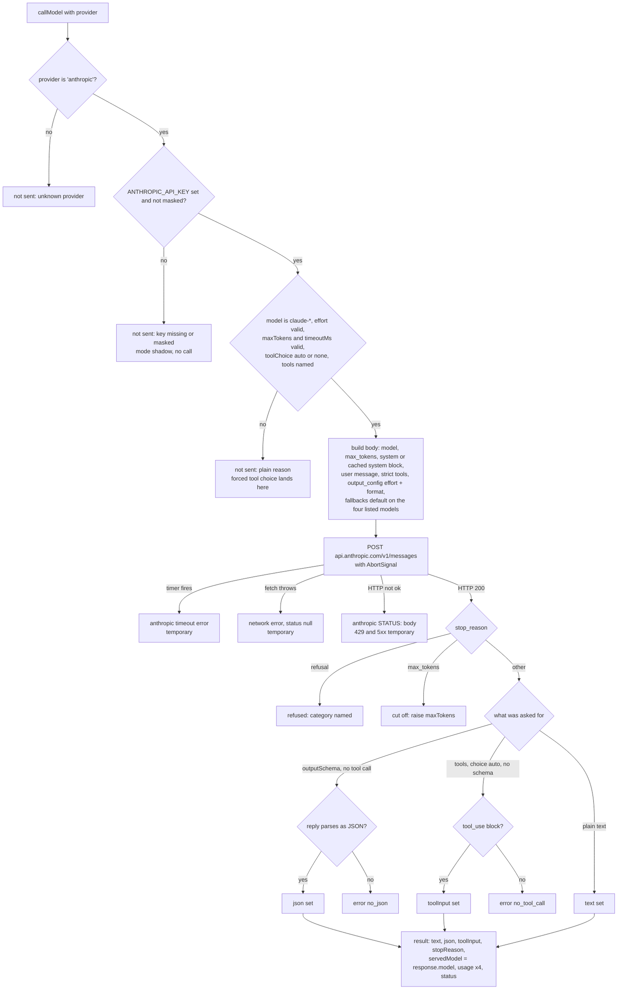
```mermaid
flowchart TD
  A[callModel with provider] --> P{provider is 'anthropic'?}
  P -->|no| N1[not sent: unknown provider]
  P -->|yes| K{ANTHROPIC_API_KEY set and not masked?}
  K -->|no| N2[not sent: key missing or masked<br/>mode shadow, no call]
  K -->|yes| V{model is claude-*, effort valid,<br/>maxTokens and timeoutMs valid,<br/>toolChoice auto or none, tools named}
  V -->|no| N3[not sent: plain reason<br/>forced tool choice lands here]
  V -->|yes| B[build body: model, max_tokens, system or cached system block,<br/>user message, strict tools, output_config effort + format,<br/>fallbacks default on the four listed models]
  B --> S[POST api.anthropic.com/v1/messages<br/>with AbortSignal]
  S -->|timer fires| T[anthropic timeout error<br/>temporary]
  S -->|fetch throws| U[network error, status null<br/>temporary]
  S -->|HTTP not ok| H[anthropic STATUS: body<br/>429 and 5xx temporary]
  S -->|HTTP 200| R{stop_reason}
  R -->|refusal| RF[refused: category named]
  R -->|max_tokens| MT[cut off: raise maxTokens]
  R -->|other| C{what was asked for}
  C -->|outputSchema, no tool call| J{reply parses as JSON?}
  J -->|yes| OK1[json set]
  J -->|no| NJ[error no_json]
  C -->|tools, choice auto, no schema| TU{tool_use block?}
  TU -->|yes| OK2[toolInput set]
  TU -->|no| NT[error no_tool_call]
  C -->|plain text| OK3[text set]
  OK1 --> Z[result: text, json, toolInput, stopReason,<br/>servedModel = response.model, usage x4, status]
  OK2 --> Z
  OK3 --> Z
```

UNVERIFIED: that Anthropic accepts this exact request shape. Fake-fetch tests
prove what is sent, not that the vendor takes it. The orchestrator's one small
live call after the ship is the proof (a 400 means the shape is wrong).

Gaps against the spec (findings, not reconciled):

- Spec §6 step 4 lists `tools` and `toolChoice`, and §7.6 speaks of a forced
  `save_script` tool. Forced tool use is HTTP 400 on claude-opus-5-5 and
  claude-sonnet-5-5 (claude-api skill), so only `auto` and `none` are accepted
  and the writer gets `outputSchema` instead.
- The spec names no default model, `maxTokens`, timeout or effort for this
  path. The defaults above come from the claude-api skill.
## U08 Ship stays in step with GitHub (spec M0 step 8)

Drawn 2026-10-05 from `scripts/ship.mjs`, `scripts/ship-machine-paths.mjs`,
`scripts/netlify-ignore-machine-only.mjs` and the `[build] ignore` line in
`netlify.toml`, on branch `mm-u08-ship-pull-push`. Ops only, no screen.

Machine-only folders (one list, `MACHINE_ONLY_PATHS`, read by both ship and the
Netlify skip rule): `marketing/ads/scripts/machine/`, `marketing/ads/ideas/`,
`marketing/ads/videos/`, `marketing/brain/`, `ops/page-requests/`. Rule, voice and
registry files (`marketing/ads/RULES.md`, `VOICE.md`, `registry.json`,
`banned-live.json`, `angles.json`) are not on it, so they still ship.

### `npm run ship`

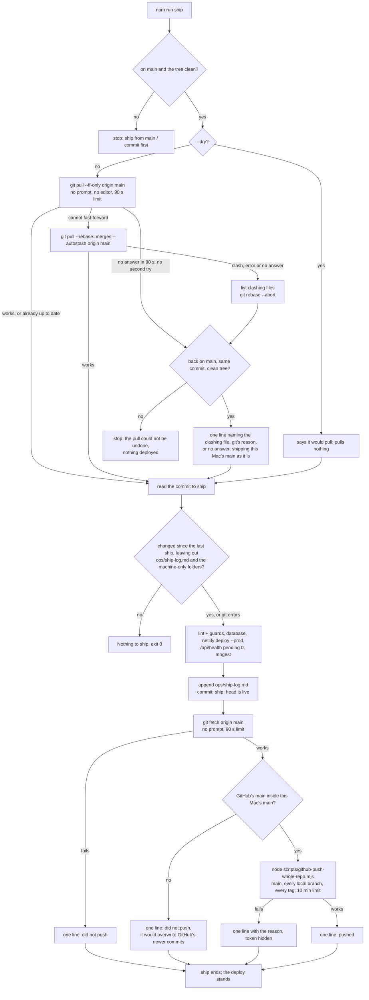
```mermaid
flowchart TD
  S[npm run ship] --> B{on main and the tree clean?}
  B -->|no| X1[stop: ship from main / commit first]
  B -->|yes| D{--dry?}
  D -->|yes| P0[says it would pull; pulls nothing]
  D -->|no| P1[git pull --ff-only origin main<br/>no prompt, no editor, 90 s limit]
  P1 -->|works, or already up to date| H
  P1 -->|no answer in 90 s: no second try| R
  P1 -->|cannot fast-forward| P2[git pull --rebase=merges --autostash origin main]
  P2 -->|works| H
  P2 -->|clash, error or no answer| A[list clashing files<br/>git rebase --abort]
  A --> R{back on main, same commit, clean tree?}
  R -->|yes| L2[one line naming the clashing file, git's reason,<br/>or no answer: shipping this Mac's main as it is] --> H
  R -->|no| X2[stop: the pull could not be undone,<br/>nothing deployed]
  P0 --> H
  H[read the commit to ship] --> K{changed since the last ship, leaving out<br/>ops/ship-log.md and the machine-only folders?}
  K -->|no| N[Nothing to ship, exit 0]
  K -->|yes, or git errors| C[lint + guards, database, netlify deploy --prod,<br/>/api/health pending 0, Inngest]
  C --> LOG[append ops/ship-log.md<br/>commit: ship: head is live]
  LOG --> F[git fetch origin main<br/>no prompt, 90 s limit]
  F -->|fails| Q1[one line: did not push]
  F -->|works| I{GitHub's main inside this Mac's main?}
  I -->|no| Q2[one line: did not push,<br/>it would overwrite GitHub's newer commits]
  I -->|yes| PUSH[node scripts/github-push-whole-repo.mjs<br/>main, every local branch, every tag; 10 min limit]
  PUSH -->|works| OK[one line: pushed]
  PUSH -->|fails| Q3[one line with the reason, token hidden]
  Q1 & Q2 & Q3 & OK --> E[ship ends; the deploy stands]
```

- A failed pull never stops the ship. The only stop in the pull step is a folder left
  half way through a pull, because deploying it would ship a broken tree.
- The push runs only after the ship-log commit. Nothing after it can stop the ship or
  undo the deploy.
- Why the push is checked first: `github-push-whole-repo.mjs` leases `main` on the copy
  it fetches a moment before, so on its own it would overwrite GitHub commits this Mac
  does not have (the outbox's saves). Ship pushes only when GitHub's main is already
  inside this Mac's main; the next ship pulls first.
- A rebase copies this Mac's local commits, including the commits of branches merged
  locally since the last push. The merge commits stay merges, but the old branch tips
  are no longer inside `main` afterwards.

### Netlify build started by a GitHub push

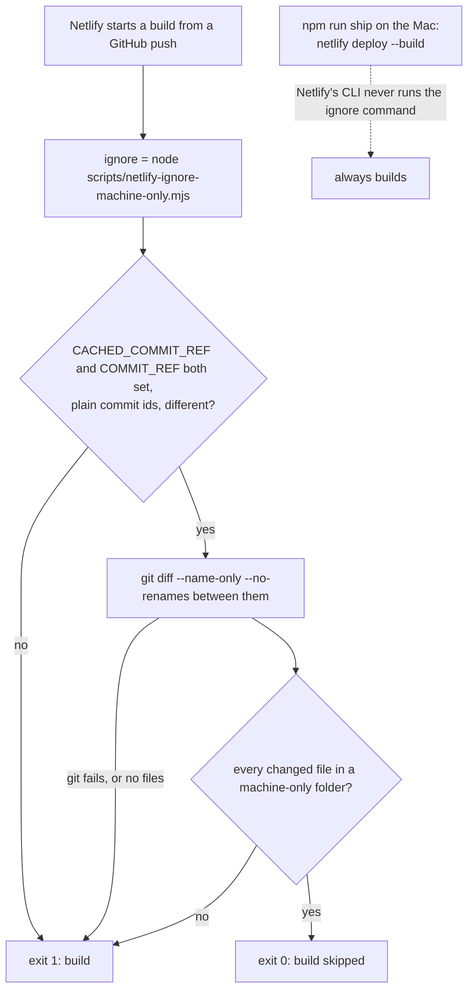
```mermaid
flowchart TD
  G[Netlify starts a build from a GitHub push] --> IG[ignore = node scripts/netlify-ignore-machine-only.mjs]
  IG --> E1{CACHED_COMMIT_REF and COMMIT_REF both set,<br/>plain commit ids, different?}
  E1 -->|no| BUILD[exit 1: build]
  E1 -->|yes| DF[git diff --name-only --no-renames between them]
  DF -->|git fails, or no files| BUILD
  DF --> M{every changed file in a machine-only folder?}
  M -->|no| BUILD
  M -->|yes| SKIP[exit 0: build skipped]
  LAP[npm run ship on the Mac:<br/>netlify deploy --build] -.->|Netlify's CLI never runs the ignore command| ALWAYS[always builds]
```

- A commit that changes only `ops/ship-log.md` is "nothing to ship" for `npm run ship`
  but builds on Netlify (the skip list is the machine-only folders only).
- **UNVERIFIED:** whether the live site still starts builds from GitHub pushes at all
  (repo link, stop_builds). This unit did not read the site's build settings; the
  orchestrator's precondition records them.
- **UNVERIFIED:** Netlify's own handling of the exit code (0 skips, 1 builds) is from
  Netlify's docs, not seen on a live build.
## U22 M0 step 4: marketing clock + background worker (in-pass waits) + GET marketing/health (heartbeats 415)

Drawn 2026-10-06 from the code on branch `mm-u22-marketing-clock`:
`src/marketing/clock.mjs` (tick), `src/marketing/worker.mjs` (runPass, the door),
`netlify/functions/marketing-clock.mjs`, `netlify/functions/marketing-worker-background.mjs`,
`api/marketing/health.mjs`, `db/migrations/415_marketing_heartbeats.sql`. Spec §6 Step 4,
§8.3 (health card), §2 item 4 (buzzes). Back end only: the health card screen is lane E.

### The clock (`marketing-clock`, every 15 minutes, a 30-second scheduled function)

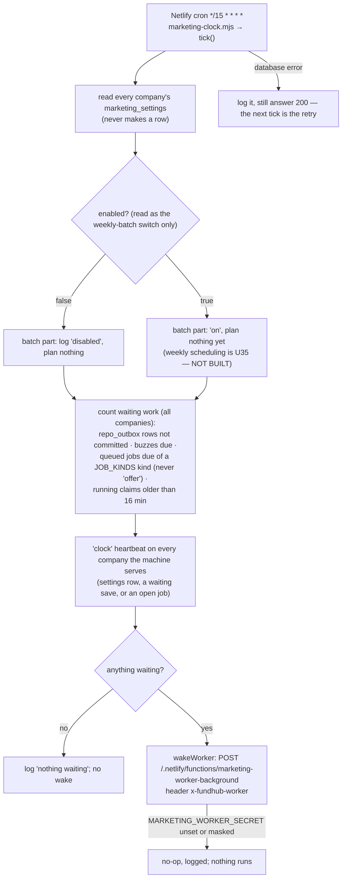
```mermaid
flowchart TD
  T["Netlify cron */15 * * * *<br/>marketing-clock.mjs → tick()"] --> S["read every company's marketing_settings<br/>(never makes a row)"]
  S --> B{"enabled? (read as the weekly-batch switch only)"}
  B -->|false| BD["batch part: log 'disabled', plan nothing"]
  B -->|true| BO["batch part: 'on', plan nothing yet<br/>(weekly scheduling is U35 — NOT BUILT)"]
  BD & BO --> W["count waiting work (all companies):<br/>repo_outbox rows not committed · buzzes due ·<br/>queued jobs due of a JOB_KINDS kind (never 'offer') ·<br/>running claims older than 16 min"]
  W --> HB["'clock' heartbeat on every company the machine serves<br/>(settings row, a waiting save, or an open job)"]
  HB --> K{anything waiting?}
  K -->|no| N["log 'nothing waiting'; no wake"]
  K -->|yes| WK["wakeWorker: POST /.netlify/functions/marketing-worker-background<br/>header x-fundhub-worker"]
  WK -->|"MARKETING_WORKER_SECRET unset or masked"| WN["no-op, logged; nothing runs"]
  T -->|"database error"| E["log it, still answer 200 — the next tick is the retry"]
```

- The clock imports no model, GitHub, Meta or texting module (`clock.test.mjs` walks the imports).
- It queues nothing in this unit. The only row it writes is its heartbeat.

### One worker pass (`marketing-worker-background`, up to 15 minutes)

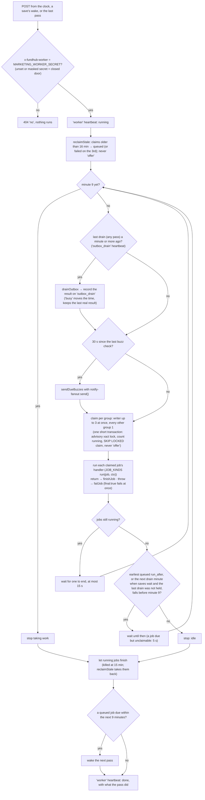
```mermaid
flowchart TD
  D["POST from the clock, a save's wake, or the last pass"] --> G{"x-fundhub-worker = MARKETING_WORKER_SECRET?<br/>(unset or masked secret = closed door)"}
  G -->|no| X["404 'no', nothing runs"]
  G -->|yes| H1["'worker' heartbeat: running"]
  H1 --> R["reclaimStale: claims older than 16 min → queued (or failed on the 3rd); never 'offer'"]
  R --> L{"minute 9 yet?"}
  L -->|yes| STOP["stop taking work"]
  L -->|no| DR{"last drain (any pass) a minute or more ago?<br/>('outbox_drain' heartbeat)"}
  DR -->|yes| DO["drainOutbox → record the result on 'outbox_drain'<br/>('busy' moves the time, keeps the last real result)"]
  DR -->|no| BZ
  DO --> BZ{"30 s since the last buzz check?"}
  BZ -->|yes| SB["sendDueBuzzes with notify-fanout send()"]
  BZ -->|no| CL
  SB --> CL["claim per group: writer up to 3 at once, every other group 1<br/>(one short transaction: advisory xact lock, count running, SKIP LOCKED claim, never 'offer')"]
  CL --> RJ["run each claimed job's handler (JOB_KINDS run(job, ctx))<br/>return → finishJob · throw → failJob (final:true fails at once)"]
  RJ --> F{"jobs still running?"}
  F -->|yes| WT["wait for one to end, at most 15 s"] --> L
  F -->|no| NX{"earliest queued run_after, or the next drain minute<br/>when saves wait and the last drain was not held,<br/>falls before minute 9?"}
  NX -->|yes| SL["wait until then (a job due but unclaimable: 5 s)"] --> L
  NX -->|no| IDLE["stop: idle"]
  STOP & IDLE --> FIN["let running jobs finish (killed at 15 min; reclaimStale takes them back)"]
  FIN --> RW{"a queued job due within the next 9 minutes?"}
  RW -->|yes| WAKE["wake the next pass"]
  RW -->|no| END
  WAKE --> END["'worker' heartbeat: done, with what the pass did"]
```

- A job that re-queues itself 10 seconds out (U28's Meta video poll) runs again in the same
  pass. NOT BUILT: no job kind is registered yet (`JOB_KINDS` is empty until U24, U28 and U35),
  so today a pass drains, sends buzzes and ends.
- Concurrent passes are safe: claims skip locked rows, the outbox drain holds a 10-minute
  lease, buzzes take a lease, and the group caps count running jobs in the database.

### GET /api/marketing/health

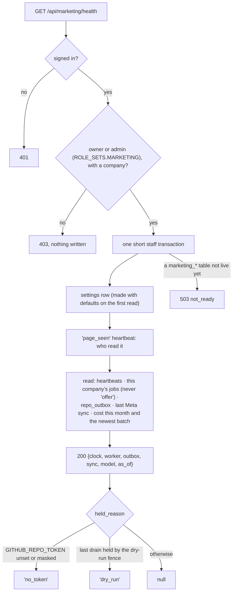
```mermaid
flowchart TD
  Q["GET /api/marketing/health"] --> A{"signed in?"}
  A -->|no| E401["401"]
  A -->|yes| RL{"owner or admin (ROLE_SETS.MARKETING), with a company?"}
  RL -->|no| E403["403, nothing written"]
  RL -->|yes| TX["one short staff transaction"]
  TX --> S1["settings row (made with defaults on the first read)"]
  S1 --> PS["'page_seen' heartbeat: who read it"]
  PS --> RD["read: heartbeats · this company's jobs (never 'offer') ·<br/>repo_outbox · last Meta sync · cost this month and the newest batch"]
  RD --> OUT["200 {clock, worker, outbox, sync, model, as_of}"]
  OUT --> HR{"held_reason"}
  HR -->|"GITHUB_REPO_TOKEN unset or masked"| NT["'no_token'"]
  HR -->|"last drain held by the dry-run fence"| DRY["'dry_run'"]
  HR -->|otherwise| NUL["null"]
  TX -->|"a marketing_* table not live yet"| E503["503 not_ready"]
```

### Gaps between the spec and this code (findings, not reconciled)

- **The clock and `enabled`.** Spec M0 step 4 says the clock "does nothing while `enabled` is
  false". This unit reads `enabled` as the weekly-batch switch only: with it off the batch part
  logs "disabled" and plans nothing (M0 Done #4), but the clock still wakes the worker for saves,
  due buzzes, due jobs and stale claims, because those come from Chris's own taps (Write now,
  rule edits, script saves) and must work while the weekly schedule is off. For Chris to see once.
- Spec §6 Step 4 says the clock's self-wake `fetch` goes on `ALLOWED_RAW_FETCH`. The clock calls
  `wakeWorker` (`src/marketing/wake.mjs`, already on that list from U05), so no new entry.
- Spec says "runs up to 3 writer jobs at once". The other groups (loader, system) run 1 at a time
  each, per the plan brief; the spec does not name them.
- Heartbeats for the clock, the worker and the drain are written on every company the machine
  serves; the health card reads its own company's. `marketing_heartbeats.org_id` cascades when a
  company is deleted (a status light, not a record). The spec names no heartbeat table; the plan
  contract does (415).
- `sync.last_sync_at` is the later of the Meta connection's `last_synced_at` and the newest
  `ad_metrics_daily.synced_at`. `model.last_batch_cost_usd` is the newest `marketing_batches`
  row's cost; null when there is no batch.
- Buzz retries use the one company's quiet hours when exactly one company has settings, else the
  spec default (21:00-07:00 Arizona). A new buzz already waits through quiet hours when queued.
- `docs/journeys/marketing-machine-intended.md` is not on main, so this was checked against the
  spec text and the plan contract, not the intended journey.

## U26 Retry a stuck step — `POST /api/marketing/jobs/retry`

Generated from the code on 2026-10-06 (branch `mm-u26-ideas-rules-retry`): `api/marketing/jobs/retry.mjs`,
`retryJob` in `src/marketing/jobs.mjs`, `JOB_KINDS` in `src/marketing/job-kinds.mjs`. Spec §8.3 (Today
lists each machine stage with Retry; Chris runs marketing from the dashboard, never from Claude
Code). Owner and admin only (requireAuth, then requireRole `ROLE_SETS.MARKETING`). Today's
`stuck_jobs` (plan unit U32) carry the ids this route takes.

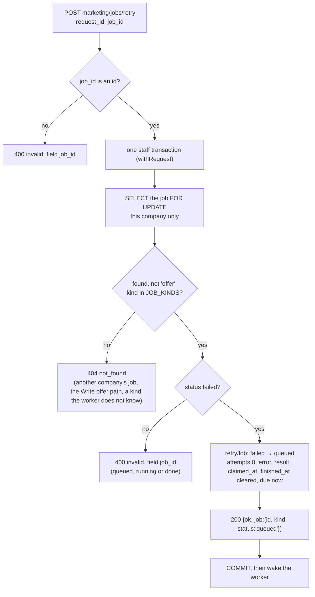
```mermaid
flowchart TD
  P["POST marketing/jobs/retry<br/>request_id, job_id"] --> U{"job_id is an id?"}
  U -->|no| X["400 invalid, field job_id"]
  U -->|yes| T["one staff transaction (withRequest)"]
  T --> F["SELECT the job FOR UPDATE<br/>this company only"]
  F --> K{"found, not 'offer',<br/>kind in JOB_KINDS?"}
  K -->|no| NF["404 not_found<br/>(another company's job, the Write offer path, a kind the worker does not know)"]
  K -->|yes| S{"status failed?"}
  S -->|no| NX["400 invalid, field job_id<br/>(queued, running or done)"]
  S -->|yes| R["retryJob: failed → queued<br/>attempts 0, error, result, claimed_at, finished_at cleared, due now"]
  R --> OK["200 {ok, job:{id, kind, status:'queued'}}"]
  OK --> W["COMMIT, then wake the worker"]
```

- Free: a retry spends nothing by itself; the job's own handler checks the cost caps when it runs.
- A repeated request_id answers the first 200 and changes nothing, even if the job failed again since.
- **UNVERIFIED in a real database on this Mac** (no Postgres here): proved by
  `src/http/marketing-jobs-retry.pg.test.mjs` in GitHub CI. Today JOB_KINDS is empty, so every
  live job answers 404 until units U24, U28 and U35 register their kinds.

### Batch history and Write now on the dashboard

`GET marketing/batches` and `POST marketing/batches/write-now` are drawn in `ad-script-flow.md`,
section "U26 Ideas, rules, Fix and Write now". `write_now_ready` is false until `start_batch` is in
JOB_KINDS, so the Today and Scripts screens show no Write now button that cannot produce drafts.

## X4 Funnel builder: automatic addresses, tags, full tracking, Push live to a NEW path

Drawn from code on branch `mm-x4-funnel-builder`: migration `425_marketing_funnel_builder.sql`,
`api/marketing/funnels/{create,rename,build,push-live}.mjs`, `api/marketing/funnel.mjs`,
`src/marketing/funnel-{paths,tracking,pages,copy,store,build,push,worker,routes,transport}.mjs`,
`src/messaging/providers/clickfunnels-pages.mjs`, `netlify/functions/marketing-funnel-background.mjs`,
and the tracking changes in `public/funnel/fh-events.js` and `src/funnel/track.mjs`. Owner order
2026-10-05 ("every time a funnel is made we tag it", "a url system so I don't have to name them,
or allow me to name them in the dash", "we can push a funnel live, /blueprint or similar"). Owner
and admin only on every route (requireAuth, then requireRole `ROLE_SETS.MARKETING`).

### A funnel's states

```mermaid
stateDiagram-v2
  [*] --> draft_empty: POST funnels/create<br/>address picked or typed + checked,<br/>tag fnl-word saved once, utm_campaign = lane,<br/>active false
  draft_empty --> draft_built: job funnel done<br/>(one model call, copy check passed,<br/>3 pages with tag + tracking saved)
  draft_empty --> draft_empty: job funnel failed<br/>(copy check failed twice, month cap, no key)
  draft_built --> draft_built: POST funnels/build (write again)<br/>POST funnels/rename (pages redrawn from saved words)
  draft_empty --> draft_empty: POST funnels/rename
  draft_built --> pushing: POST funnels/push-live<br/>confirm_url = the funnel's address
  pushing --> draft_built: an address is a page we did not make<br/>(stopped before anything was made)
  pushing --> pushed: pages made (POST custom_html), ids saved,<br/>token PUT on our own page ids
  pushed --> pushed: proof not seen yet (job fails, Retry proves again, makes nothing new)
  pushed --> live: every page proven by a cache-busted read<br/>(tag + tracking on the live page)<br/>status live, live_at, active true
  live --> [*]
```

- A live funnel never changes: rename, build and push-live are refused (400), and the
  database refuses any change to a pushed page's address, HTML or page id, a live
  funnel's address, and any tag.

### Make — `POST /api/marketing/funnels/create`

```mermaid
flowchart TD
  P[POST create<br/>request_id, offer_key, lane?, name?, campaign?, path?, build?] --> V{offer sold on a call?<br/>capital_blueprint or funding_dfy}
  V -->|no| V1[400 offer_key]
  V -->|yes| L[READ the live ClickFunnels page list<br/>GET /workspaces/id/pages]
  L -->|cannot read| L1[503 clickfunnels_unreadable<br/>nothing made]
  L -->|read| W[withRequest: one staff transaction<br/>lock: one create per company at a time]
  W --> T[taken = live pages + every address our funnels use<br/>+ reserved words + funnel keys]
  T --> A{path typed?}
  A -->|yes| A1{all three addresses free?<br/>word, word-book, word-thank-you}
  A1 -->|no| A2[400 path, says which one]
  A1 -->|yes| M
  A -->|no| N[offer word: /blueprint, then /blueprint-2, -3 ...]
  N --> M[insert funnel: kind book_a_call, status draft,<br/>tag fnl-key, utm_campaign = lane, created_by, active false<br/>+ 3 empty pages]
  M --> B{build true?}
  B -->|yes| J[queue job funnel]
  B -->|no| R
  J --> R[COMMIT, 200 funnel + job]
  R --> K[wake marketing-funnel-background<br/>with the owner's session]
  K -->|wake failed| K1[job failed with the reason]
```

### Write the pages — job `funnel` (`src/marketing/funnel-build.mjs`)

```mermaid
flowchart TD
  S[worker claims the job by id<br/>queued, this company] --> G{funnel built here,<br/>nothing on ClickFunnels?}
  G -->|no| F1[failed: a live page is never rewritten]
  G -->|yes| D{every page already<br/>saved by this job?}
  D -->|yes| OK[done, nothing paid again]
  D -->|no| C{month model spend under the cap?}
  C -->|no| F2[failed: cap reached, nothing written]
  C -->|yes| M[one Anthropic call, claude-opus-5-5,<br/>structured output COPY_SCHEMA<br/>facts: src/config/offers.mjs + campaign files if any<br/>cost logged to marketing_model_usage]
  M --> K{copy check<br/>strict ad checker + outcome first,<br/>no invented numbers, no price,<br/>no testimonials, no SSN, no guarantee}
  K -->|fails, first round| M
  K -->|fails twice| F3[failed with the reasons, nothing saved]
  K -->|passes| R[draw 3 pages in the house template<br/>tag block first in head + manifest tracking]
  R --> DB[(save each page;<br/>the database refuses a page<br/>without the tag or the scripts)]
  DB --> OK
```

### Push live — `POST /api/marketing/funnels/push-live` and job `funnel_push`

> Replaced by X4F (2026-10-06): the push below made standalone pages, which ClickFunnels never
> serves on apply.fundhub.ai. The push as the code runs it now is drawn in `## X4F` at the end of
> this file. This diagram is kept as the record of what shipped in X4.

```mermaid
flowchart TD
  P[POST push-live<br/>request_id, id, confirm_url] --> V{pages built, not live,<br/>confirm_url = the funnel's address,<br/>nothing in flight?}
  V -->|no| V1[400 id or confirm_url]
  V -->|yes| J[queue job funnel_push, 202, wake the worker]
  J --> L[READ live page list]
  L --> C{each of the 3 addresses:<br/>free, ours already, or ours from a crash<br/>by its description marker?}
  C -->|a page we did not make| X[failed before anything was made]
  C -->|ok| O[thank-you, booking, then landing:<br/>POST custom_html = a NEW page]
  O -->|429 or no answer| RT[tried again later by the worker,<br/>nothing saved, nothing made twice]
  O -->|401, 403, 404, 422| FX[failed for good with the reason]
  O --> A{ClickFunnels answered<br/>the page address?}
  A -->|no address| NA[failed before saving: never guessed;<br/>Retry takes the page back by its marker]
  A -->|yes| SV[save its id and that address at once]
  SV --> H{address = https://apply.fundhub.ai<br/>+ this page's path?}
  H -->|another host or path| WH[failed: funnel stays a draft,<br/>no token, no proof, no more pages;<br/>a Retry stops here again]
  H -->|yes| T[page token into that page:<br/>PUT /pages/id, only for ids this push made]
  T --> R[cache-busted GET of each page at its own address:<br/>tag + tracking there?]
  R -->|not yet, 4 tries| F[failed: Retry proves again,<br/>makes nothing new]
  R -->|all proven| CK{all 3 pages at their own address,<br/>landing page at the funnel's address?}
  CK -->|no| WH
  CK -->|yes| LV[one transaction: funnel live: status, live_at,<br/>landing_url = live address, active true<br/>+ the 3 pages queued in repo_outbox:<br/>marketing/landing-pages/funnels/key/page.html]
  LV --> WK[wake the marketing worker<br/>the outbox commits them when it drains]
```

- The repo save needed one more folder on the outbox allow-list
  (`src/repo/allow-list.mjs`): `marketing/landing-pages/funnels/`. Nothing else under
  `marketing/landing-pages/` is writable by the app.

### The tag and the tracking on every page

```mermaid
flowchart LR
  H[page head: fh-funnel-tag meta +<br/>window.FH_FUNNEL first,<br/>then Meta pixel PageView eventID,<br/>Clarity and GA4 when set, CF SDK + token] --> E[fh-events.js:<br/>page not on its fixed list but<br/>FH_FUNNEL names it -> sends, + funnel_tag]
  E --> D[POST /api/public/slo-interest kind track]
  D --> Q{tag + address in<br/>marketing_funnel_pages?}
  Q -->|no| Q1[page_invalid, nothing saved]
  Q -->|yes| S[events row funnel = tag, step = position,<br/>funnel_tag, funnel_id; page events_seen + 1]
  S --> M[Meta server copy as before:<br/>PageView; Schedule on booking_confirmed]
  A[fh-attribution.js] --> F[every form, the framed calendar too:<br/>UTMs + landing_path = this funnel's first page]
```

- UTMs keep the ad-number law: the ad's url_tags are `utm_source=fb&utm_medium=paid&utm_campaign=<lane>&utm_content=<ad number>`
  (`utm_template` on the funnel). The tag never rides in a UTM.
- Leads and bookings carry the funnel through `landing_path`; the address belongs to one funnel only.

### Gaps between the spec, the design and this code (findings, not reconciled)

- **No design slice.** The design (`docs/specs/command-center-design-2026-10-05.md`) has no
  funnel-builder slice; this unit follows the owner order of 2026-10-05 and the extras brief.
  No screen is built here (X8 draws the Funnels cards).
- **Build route added.** The brief names create, rename, push-live and the two reads. The page
  writer needs a press to start or redo it, so `POST marketing/funnels/build` was added; create
  also queues the first build (build: true by default).
- **Head code.** The brief says "head_code from the tracking manifest". ClickFunnels refuses
  head_code on a custom HTML page (422, OpenAPI read 2026-10-06), so the manifest's tracking
  rides inside the page document, the same way the /roadmap pages do it.
- **Meta Lead.** docs/tracking/meta-events.md maps Lead to the /roadmap buy box and the survey's
  last answer only. A book-a-call funnel page fires PageView and, on a real booking, Schedule;
  no Lead fires from these pages. Purchase stays server-only (the payment path). Adding a Lead
  on booking needs a new row in that contract table.
- **No VSL slot.** No Capital Blueprint video exists, so the landing page has no video block
  (a missing file would 404 on a live page, as slo-02-booking does today).
- **Standalone pages.** The pages are made as standalone custom HTML pages (no `funnel` block),
  so no existing ClickFunnels funnel is changed. Which domain ClickFunnels serves a standalone
  page on is UNVERIFIED until the first push (the /roadmap pages sit inside a ClickFunnels funnel
  whose domain is apply.fundhub.ai; `docs/sops/clickfunnels-custom-html-push.md`). The push saves
  the `url` ClickFunnels answers as it is and stops at the first page whose address is not
  `https://apply.fundhub.ai` + its path: the funnel stays a draft and no more pages are made.
  If that happens, the thank-you page is left on ClickFunnels at the other host, and the funnel
  cannot be renamed (a page is on ClickFunnels); it needs an owner call (move the pages into a
  ClickFunnels funnel on apply.fundhub.ai, the /roadmap way) before it can go live.
- **Rename keeps the first word.** A rename moves the address but keeps the funnel's key, its
  tag (law: a tag never changes) and its repo folder. After /blueprint-2 is renamed to
  /blueprint-vip, its tag stays `fnl-blueprint-2` and its live pages save under
  `marketing/landing-pages/funnels/blueprint_2/`; the next automatic create skips /blueprint-2
  (its key is still taken). The Funnels card (X8) should print the tag and the repo folder next
  to the address so this shows.
- **Draft campaign files.** The writer reads the campaign's stage files whatever their approval
  stamp and reports each file's status on the job result; it does not wait for approval.
- **U22 worker.** Not on main, so the jobs run in their own background function (the offer
  pattern). Both kinds are in `JOB_KINDS` for U22's worker to pick up later. The wake carries
  the owner's session to that function; design §5 rule 18 says every wake carries the worker
  secret, never the owner's session. When U22's worker lands, kinds `funnel` and `funnel_push`
  move to it and `netlify/functions/marketing-funnel-background.mjs` retires.
- **UNVERIFIED in a real database on this Mac** (no Postgres here): the SQL is proved by
  `src/http/marketing-funnel-builder.pg.test.mjs` in GitHub CI. Never run against live
  ClickFunnels: every ClickFunnels call in the tests is a fake behind the real provider.

## U31 M5 11.2 part 1: GET marketing/ads and GET marketing/ad?n=

Drawn from code on branch `mm-u31-ads-routes`: `api/marketing/ads.mjs`,
`api/marketing/ad.mjs`, the readers in `src/marketing/metrics.mjs` (U20) and
`readLastSync` in `api/marketing/today.mjs`. Spec §11.2, §11.1, §11.3; shapes are
fixed shape 8 in `docs/specs/marketing-machine-api.md` §6.7. Read only: no row is
written, nothing is texted, Meta and models are not called. Owner and admin only
(requireAuth, then requireRole `ROLE_SETS.MARKETING`, then a company on the session).
Every query runs in one `asStaff()` transaction.

### The Ads view — `GET /api/marketing/ads?from&to&funnel&format&angle`

```mermaid
flowchart TD
  A[GET marketing/ads] --> B{signed in?}
  B -->|no| B1[401]
  B -->|yes| C{owner or admin?<br/>ROLE_SETS.MARKETING}
  C -->|no| C1[403, nothing read]
  C -->|yes| D{from / to real YYYY-MM-DD,<br/>from not after to?}
  D -->|no| D1[400 invalid, field from or to]
  D -->|yes| W[window: Arizona days, both ends in<br/>none sent = the last 30 days ending today]
  W --> F{funnel, format or angle sent?}
  F -->|yes| L[script labels per number:<br/>live ad_scripts version, else newest<br/>keep numbers whose labels all match]
  L -->|no number matches| E[rows empty]
  L --> R1[readAdNumbers for those numbers]
  F -->|no| R2[readAdNumbers for every number<br/>with spend or a lead in the window]
  R2 --> L2[script labels for those numbers]
  R1 & L2 --> ROW[one row per ad NUMBER:<br/>counts from the reader, rates from ratiosFor<br/>labels null when no script]
  ROW --> S[most spend first, unknown spend last, then number]
  W --> U[unmapped: spend of ads with no number,<br/>per campaign, same window, filters do not apply]
  W --> T[as_of = connection last_synced_at,<br/>else newest saved ad-day; null if never synced]
  S & E & U & T --> OK[200 rows, unmapped, as_of]
```

- Every number is U20's: `readAdNumbers` gives the counts and `ratiosFor` the rates.
  The route adds, divides and rounds nothing of its own.
- A row also carries the reader's raw counts after the contract keys: `ads`,
  `link_clicks`, `plays`, `ad_days`, `reported_days`, `maturing_leads`,
  `cash_unknown` (extra keys are allowed by the contract).
- Unknown stays `null`: spend of a number with leads but no ad-days, a rate whose
  bottom is 0 or never reported. `maturing` is true when a lead is under 14 days old.

### The drawer — `GET /api/marketing/ad?n=91`

```mermaid
flowchart TD
  A[GET marketing/ad?n=] --> G[same gate: 401 / 403]
  G --> N{n is 1-9 digits?}
  N -->|no| N1[400 invalid, field n]
  N -->|yes| K{this company has a Meta ad,<br/>a script or a tagged lead with n?}
  K -->|no| K1[404 not_found]
  K -->|yes| R[the Ads row for n over the last 30 Arizona days<br/>nothing in the window: spend null, counts 0]
  R --> M[meta_ads: every ads row with n, oldest first]
  R --> CU[curve: one entry per Meta ad per saved ad-day in the 30 days<br/>video_play_curve as stored, null when Meta sent none]
  R --> WA[watch.alerts: ad_watch_curve_alerts of those ads<br/>watch.diagnoses: ad_watch_curve_diagnoses, newest day first, at most 100,<br/>not limited to the 30 days]
  M & CU & WA --> OK[200 ad, as_of]
```

- `watch` inner keys (U31 owns them): an alert is `{ad_id, dies_before_25_alerted_on,
  updated_at}`; a diagnosis is `{date, diagnosis, fix_type, film_note,
  next_take_improved, id, ad_id, created_at}`. `ad_id` is `ads.id` (the Meta ad row).
- Two Meta ads with one number keep two curves (each entry names its `ad_id`); they
  are never averaged.

### Fast with 30 days (spec M5 done 2)

`src/http/marketing-ads.pg.test.mjs` runs every read of both routes under
`EXPLAIN (ANALYZE)` on a 30-day fixture with seq scans turned off for that one
transaction, and fails if `ad_metrics_daily` or `client_ad_attribution` is read
without an index condition. The live timing of each route is taken after ship
(the orchestrator writes it on the board).

### Gaps between the spec, the design and this code (findings, not reconciled)

- **Design keys not built.** The design doc's Ads row (`ad_id`, `angle`, `hold_2s`,
  `sales_ours`, `sales_meta`, `cpb_cents`, `last_day`, `unknown_ad`) and drawer
  (`quartiles`, `diagnosis`, `script{hook, line2}`, `links`) differ from fixed
  shape 8; the contract wins. Meta's own purchase count, the last day an ad ran,
  the script's hook and line 2 and the unmapped lead count are not in these answers.
- **Funnel of a row comes from the script only.** U32's funnel roll-up falls back
  to `marketing_funnels.meta_campaign_ids`; this route does not, so a number with no
  script funnel reads `funnel_key` null here while its spend can count on Funnels.
- **Unmapped spend ignores funnel / format / angle.** Spend with no number has no
  script, so no label can match it.
- **No 10-play floor.** The design prints "unknown (fewer than 10 plays)" through
  `watchRate()`; U20's rates and this route have no floor.
- **`readLastSync` is not index-checked.** Its `max(synced_at)` reads the company's
  ad-days with no index that orders them; it is today's shared helper, not this unit's.
- **Lead days are not range-scanned.** U20's lead read finds the company's tagged
  leads by index, then keeps the window by Arizona day of `captured_at` (not sargable).
- **UNVERIFIED on this Mac** (no Postgres here): proved only by the pg test in GitHub CI.

## U32 M5 11.2 part 2: angles, funnel numbers, and the M5 keys on Today

Written 2026-10-06 from the code on branch `mm-u32-angles-funnel-stats`. Read only: nothing
here writes a row, calls Meta or calls a model. Code: `api/marketing/angles.mjs`,
`api/marketing/funnels/stats.mjs`, `api/marketing/today.mjs` (part 5),
`src/marketing/metrics-rollups.mjs`. The counting rules are U20's
(`src/marketing/metrics.mjs`); this unit only decides which funnel and which angle a number
belongs to, and adds the per-number results up.

Three routes, one gate (owner and admin, `ROLE_SETS.MARKETING`; the company from the
session):

```mermaid
flowchart TD
  A[GET marketing/angles<br/>GET marketing/funnels/stats] --> B{signed in?}
  T[GET marketing/today] --> B
  B -->|no| B1[401]
  B -->|yes| C{owner or admin?}
  C -->|no| C1[403, nothing read]
  C -->|yes| W[window: last 30 Arizona days<br/>Today: today, 7 and 30 days]
  W --> R[one asStaff read<br/>Today: four parts side by side]
  R -->|a marketing_ table not there yet| NR[angles, funnels/stats: 503 not_ready<br/>Today: that part empty + named in waiting]
  R -->|database not answering| DD[503 db down]
  R --> OK[200 + as_of<br/>angles, funnels/stats: last Meta sync<br/>Today: when built; Meta time is last_sync]
```

Which funnel and which angle a number belongs to:

```mermaid
flowchart TD
  AD[ads row with spend<br/>ad_metrics_daily, Arizona spend day] --> N{ad number?}
  N -->|yes| S{its LIVE script<br/>ad_scripts.ad_id, archived_at NULL}
  S -->|names funnel_key| F1[that funnel]
  S -->|no script, or no funnel_key| CA{campaign on a funnel's<br/>meta_campaign_ids?}
  N -->|no| CA
  CA -->|yes| F2[that funnel]
  CA -->|no| UM[Unmapped spend]
  S -->|names angle_key| A1[that angle]
  S -->|no angle_key| SP{v_ad_label_spine:<br/>creative's script angle?}
  SP -->|yes| A2[that angle]
  SP -->|no| NA[no angle: in no angle row]
  L[lead: client_ad_attribution<br/>first touch, Arizona lead day] --> LN{ad number?}
  LN -->|no| LU[not placed]
  LN -->|yes| LS[number: script's funnel and angle,<br/>else the one its ads rows agree on]
  LS -->|two funnels disagree| LU
  LS --> RES[readAdNumbers results: booked, showed,<br/>sales, roadmaps, cash, reported cash — 14 days]
```

- **GET marketing/angles** → `{rows:[{angle_key, name, spend_cents, ads, leads, booked, sales,
  cash_cents, roas}], as_of}`. One row per angle with spend or leads in the window. `ads` =
  distinct ad numbers (an ads row with no number counts on its own). `name` from
  `marketing/ads/angles.json` (bundled through netlify.toml `included_files`); a key not in
  the file shows the key.
- **GET marketing/funnels/stats** → `{rows:[{funnel_key, name, spend_cents, page_views,
  click_to_page, page_to_lead, leads, booked, showed, sales, cash_cents, roas}],
  unmapped_spend_cents, as_of}`. Every active funnel plus any funnel spend or leads were placed
  on. `page_views` = `funnel.page` events from people on the funnel's landing page (its
  `landing_url` path; null when the tracker does not run on that page). `click_to_page` =
  page views ÷ the funnel's ads' link clicks; `page_to_lead` = leads ÷ page views.
- **GET marketing/today, added keys** (every old key unchanged): `numbers` (today / d7 / d30
  from `readTotals`), `daily` (30 days from `readDaily`), `spend_by_funnel` (7 days, with an
  Unmapped row), `flow` (7 days: landing page views, Meta link clicks, then `numbers.d7`'s
  leads, booked, showed, sales), `scripts_waiting` (released drafts and the machine's flagged
  ones), `stuck_jobs` (failed `marketing_jobs`, not `offer`, newest first, each with its id
  for Retry).
- **Unknown stays null.** Spend with no saved ad-day is null. A funnel with nothing placed is
  null while some spend is unmapped, and a known 0 only when all saved spend is placed. Cash
  over several numbers is null only when payments exist and none reported an amount.
- **Index proof.** Every query starts with a `-- m5:<name>` line;
  `src/http/marketing-funnels-stats.pg.test.mjs` runs EXPLAIN (ANALYZE) on each with sequential
  scans priced out and fails if `ad_metrics_daily`, `events`, `ad_scripts` or
  `marketing_jobs` is read without an index. `ad_spend` walks `ads` then
  `ad_metrics_daily (ad_id, date)`; `funnel_steps` walks `idx_events_name (org_id, name,
  created_at)` with constant Arizona-midnight bounds.

Gaps between the spec, the design and this code (recorded, not reconciled):

1. **Design vs contract shapes.** The design doc (`command-center-design-2026-10-05.md` §3.1,
   §3.7) draws `money{…, prior_30_days}`, `by_funnel`, `flow{page, pressed_buy, paid, booked}`,
   angles `{ok, angles[], suggestions[]}` and funnels `{ok, funnels[{key, flow{}, page_funnel{},
   clarity{}}]}`. This code builds the plan's fixed shapes 7 and 9
   (`docs/specs/marketing-machine-api.md`), which win per the plan. The design's per-angle
   "cost per lead, last run date, best and worst ad", the page funnel (pressed buy, paid) and
   Clarity rows are not in these answers.
2. **Two populations in one rate.** `page_views` counts every person on the landing page (ad
   or not); `leads` counts only leads tagged with an ad number that maps to the funnel. So
   `page_to_lead` understates while most leads carry no number (2 of 18 on 2026-10-06,
   `docs/marketing/metrics.md` gap 8).
3. **Flagged and visible rules are copied, not shared.** `scripts_waiting` repeats U25's
   visibility rule and `isFlagged` (`src/marketing/scripts-store.mjs`, not on main when this
   was written) in SQL. If either changes, this count must change with it.
4. **Angle names lag one ship.** Names come from the bundled `angles.json`; an angle added
   through the repo outbox shows its key until the next ship.
5. **UNVERIFIED:** the live timing of each route (spec M5 "under 2 seconds with 30 days of
   data"). The orchestrator records one live timing per route after ship.
## X1 Build the avatar on the server (design slice 5a)

The full flow, generated from the code, is its own file:
[marketing-avatar-flow.md](marketing-avatar-flow.md). What it changes on this page's
records:

- `marketing_jobs`: kind `avatar` (group `research`, one at a time), payload.campaign and
  payload.step required by a CHECK, one in flight per company and campaign (migration 418).
  The worker hands every job handler `finishByMs` (minute 14 of the pass) so a long step
  waits for the next pass instead of being cut off.
- `marketing_model_usage`: `web_search_requests`, `web_fetch_requests`, `step`; a search's
  $10-per-1,000 fee is inside `cost_usd`.
- `marketing_settings.run_caps` = `{"avatar": 20}` by default.
- `repo_outbox`: `marketing/flywheel/` is on the allow-list; edit ops
  `set_front_matter_key` (Approve) and `append_line_under_heading` (Tweak).
- New reads: `GET marketing/costs` (every cost line's source; null = "unknown, not
  measured yet"), `GET marketing/flywheel`, `GET marketing/flywheel/job`.

```mermaid
flowchart LR
    COSTS[GET marketing/costs] -->|last finished job of a kind with ledger rows| LEDGER[(marketing_model_usage)]
    COSTS -->|month used vs max_month_cost_usd| LEDGER
    RUN[POST marketing/flywheel/run] -->|kind avatar| JOBS[(marketing_jobs)]
    JOBS -->|claimed one step at a time| WORKER[marketing worker]
    WORKER -->|one row per call| LEDGER
    WORKER -->|step 10: eight files| OUTBOX[(repo_outbox)]
```

## X3 The flywheel on the dashboard (Ideas: Offer and market card back end)

Drawn 2026-10-06 from the code on branch `mm-x3-ideas-flywheel`: `api/marketing/flywheel.mjs`,
`api/marketing/flywheel/{run,approve,tweak,spend-read,campaign}.mjs`, `src/marketing/flywheel/*`
(reader, stages, store, steps, copy-stage, strategy-stage, spend-read, campaigns, stamp, save,
doctrine, copy-checks, stage-job), `src/marketing/job-kinds.mjs` (`flywheel_stage`),
`src/repo/{allow-list,edit-ops}.mjs`, `scripts/flywheel/status.mjs` (`evaluateFiles`).
Design `docs/specs/command-center-design-2026-10-05.md` §3.2 row 6, §5, §6 slice 5. Owner and admin
only on every route (requireAuth, then requireRole `ROLE_SETS.MARKETING`). Back end only: the
Ideas tab screen is unit X8.

### Where the stage files are read from (every answer names its source)

```mermaid
flowchart TD
  R["readFlywheel(campaign)"] --> T{"GITHUB_REPO_TOKEN set and not masked?"}
  T -->|no| B["bundle-fallback: marketing/flywheel/** shipped with the function"]
  T -->|yes| REF["getRef: the branch's commit"]
  REF -->|error| B
  REF --> L["listFolder marketing/flywheel @commit: the campaigns"]
  L --> F["getContents x8 @commit (ETag cache): 00-OWNER-NOTES, 01-avatar, the word bank, 02 to 06"]
  F -->|error| B
  F --> P["lay on top: repo_outbox rows of this company not yet committed<br/>(replace = the new file, edit = re-applied) → source 'outbox-pending'"]
  B --> PB["lay on top: every flywheel row of this company, committed too<br/>(both edit ops are idempotent)"]
  P & PB --> S["states: scripts/flywheel/status.mjs evaluateFiles (the same rules as npm run flywheel:status)"]
```

### The six rows and what each button does

```mermaid
flowchart TD
  G["GET marketing/flywheel?campaign="] --> V["six rows: label_words, state_word, sentence,<br/>can_run{ok, reason}, run{step, step_word, cost_so_far_usd}, review_card_md, files"]
  RUN["POST marketing/flywheel/run {campaign, stage, request_id}"] --> W{stage}
  W -->|1 or 2| NB["409 not_built: 'Not on this page yet: it ships in slice 5a / 10.'"]
  W -->|3| OF["hand to POST marketing/offer/generate with the campaign's own files (kind 'offer')"]
  W -->|6| SR["spend read now, one staff transaction → 200"]
  W -->|4 or 5| GATE{"step 3 approved? (5: 3 and 4)"}
  GATE -->|no| BL["409 blocked, the reason printed"]
  GATE -->|yes| KEY{"Anthropic key? month cap left?"}
  KEY -->|no key| NM["503 no_model"]
  KEY -->|cap reached| CH["409 cap_hit"]
  KEY -->|yes| J["one staff transaction: advisory lock (company, campaign, stage) →<br/>a queued/running flywheel_stage row? answer it : insert one"]
  J --> A202["202 {started, already_running, job, poll}; wake the worker after the commit"]
  AP["POST marketing/flywheel/approve {campaign, stage}"] --> AE["file there? → outbox edit set_front_matter_key status: approved<br/>(the body hash does not change, nothing downstream goes out of date)"]
  TW["POST marketing/flywheel/tweak {campaign, stage, note}"] --> TN["outbox edit append_line_under_heading '## Notes':<br/>'YYYY-MM-DD | stage N | note' (append only, a repeat writes once)"]
  TN --> TR["re-run where it can: 4/5 a job with the note in its payload · 6 the read now ·<br/>3 the offer path with the line in its notes, started after the commit<br/>(a replayed request_id answers: handed to Write the offer, its row shows the run) · 1/2 not yet (reason given)"]
  CA["POST marketing/flywheel/campaign {key}"] --> CN["offer key → folder (UWIQ_DELIVERABLES → capital-blueprint) →<br/>outbox replace 00-OWNER-NOTES.md with 'Offer key: …' (201; exists → 200)"]
```

### Steps 4 and 5 on the worker (job kind `flywheel_stage`, group writer)

```mermaid
flowchart TD
  C["worker claims flywheel_stage → stage-job.mjs run(job)"] --> D{"payload.stage has a runner? campaign a folder name?"}
  D -->|no| FF["fail now (final), plain reason"]
  D -->|yes| ST["runSteps: start at result.state, else payload.resume (kept for Retry), else fresh"]
  ST --> CAP{"before every batch: run spend + batch worst case under the run cap<br/>(max_batch_cost_usd, $40) and the month cap ($300)?"}
  CAP -->|shrink to fit| CALL["callModel provider 'anthropic', explicit model, maxTokens, timeout;<br/>one marketing_model_usage row per call (served model, job_id)"]
  CAP -->|not one call fits| STOP["'Stopped at the $40 run cap while …' : result.stopped_at_cap, place kept, failed (final)"]
  CALL --> SAVE["save the place in result (one statement)"]
  SAVE --> SL{"2-minute slice used?"}
  SL -->|yes| BACK["requeueJob (no attempt counted), due now → the next claim resumes"]
  SL -->|no| NEXT["next step"]
  NEXT --> CAP
  NEXT --> OUT["save step: stamp (stage, version+1, draft, input hashes, counts) →<br/>repo_outbox replace 0N-*.md, op id flywheel:job:file → job done with the evidence"]
```

- Step 4 (copy.js port): inputs → angles (Opus) → write per reason (Sonnet) → humanize per piece
  (banScan in code with rules-data.mjs lists; up to 3 attack and rewrite passes; still dirty or
  figures sanded off = dropped) → verify (closing-line collisions dropped by code, then three
  lenses) → assemble (Opus) → save `04-copy.md`.
- Step 5 (ad-strategy.js port): inputs (offer, copy, the company's own 30-day totals as staff, the
  ground files from GitHub or beside the code; missing ones listed) → ground (Sonnet) → plans x2
  (Opus, doctrine bundled in `doctrine.mjs`) → checks (`screenTargeting` run in code on each plan,
  then three lenses) → repair once → assemble → save `05-ad-strategy.md`.
- Step 6 (spend read): `readAdNumbers` + `readTotals` + Meta purchases per number, 30 Arizona days
  ending yesterday, as staff; the conclusion is code (watch-curve law words, no benchmark) →
  `06-spend.md` through the outbox.
- Quick copy: `src/creative/providers/copy.mjs` is forced to Claude (`claude-sonnet-5-5` unless a
  Claude model is configured); `POST creative/run` adds `check` (checkScriptText strict, in words)
  to every copy asset and `model` to every job.
  Proved on the route by `src/http/creative-run.test.mjs` (check on each copy asset, none on a
  picture, the job's model passed through) and on real tables by `src/creative/generate.pg.test.mjs`
  (a copy job answers `model` = `claude-sonnet-5-5` and its stored row carries `copy_text`).

### Gaps between the design and this code (findings, not reconciled)

- **Stages 1 and 2 do not run here.** Units X1 (avatar, kind `avatar`) and X2 (market research,
  `flywheel_stage` stage 2) own them; `STAGE_RUNNERS[1|2]` is null and the routes answer
  `not_built` with the row's sentence. X1/X2 add their runner lines (`stages.mjs`,
  `stage-job.mjs`) rather than new routes.
- **One run in flight per campaign and stage is held in code** (advisory transaction lock plus a
  look), not by the partial unique index the design names: X3 has no migration number. The index
  belongs in the `marketing_jobs` follow-up migration (design slice 10).
- **The run cap for steps 4 and 5 is the batch cap** (`max_batch_cost_usd`, $40). The design names
  no cap of its own for them.
- **Retry clears `result`** (U04 `retryJob`), so the runner keeps its place in `payload.resume`
  as well; a retried run picks up there.
- **The spend read reads every ad in the account.** Ads are not tied to one flywheel campaign yet
  (no column links them); the file says so.
- **Step 5's ground files** (`ops/workflows/ads-waterfall-projections-2026-08-26.md`,
  `ops/workflows/ads-revenue-model-2026-08-24.md`, `marketing/ads/ascension/ascension-ads.md`) are
  read from GitHub; with no token they are read only where the function bundle has them (the
  `ops/` files are not in `included_files`), and the run lists them as missing. The revenue model
  file is not in the repo at all.
- **The doctrine** is the repo's excerpts only (`ascension-ads.md` §1 and §5, the Drive index
  lines); the full SOPs are in Drive and are not read. The plans are told so.
- **GET marketing/angles** is unit U32's (on main since merge 1b3961ab4; not built here);
  **GET/POST marketing/batches/next** is unit U23's. Not built twice.
- **GET marketing/flywheel/job?id=** (design slice 5a) is unit X1's; `GET marketing/flywheel`
  carries each row's run instead.
- `docs/journeys/marketing-machine-intended.md` is not on main, so this was checked against the
  design and spec text, not the intended journey.
- **UNVERIFIED on this Mac** (no Postgres): the routes and the worker run against real tables
  are proved by `src/http/marketing-flywheel.pg.test.mjs` in GitHub CI.

## Wave 2b merge: one set of flywheel routes for X1, X2 and X3

Units X1 (step 1), X2 (step 2) and X3 (steps 3 to 6, the Ideas card) each built
`api/marketing/flywheel*.mjs` in parallel. Drawn from the merged code on branch `mm-wave2b`:
X3's route files are kept, and steps 1 and 2 are handed, after X3's gate, to the other
units' route bodies, which answer in their own words.

```mermaid
flowchart TD
  RUN["POST marketing/flywheel/run<br/>owner or admin, a company"] --> S{stage}
  S -->|1| A1["X1 runAvatarStage<br/>src/marketing/avatar/run-route.mjs<br/>job kind 'avatar'"]
  S -->|2| A2["X2 runMarketStage<br/>src/marketing/research/market-run-route.mjs<br/>job kind 'flywheel_stage', stage 2"]
  S -->|3| A3["X3: handed to Write the offer"]
  S -->|4, 5| A4["X3: job kind 'flywheel_stage', stage 4 or 5"]
  S -->|6| A6["X3: the spend read, now, free"]
  S -->|other| BAD["400 invalid, field stage"]
  TW["POST marketing/flywheel/tweak"] --> T{stage}
  T -->|1| T1["X1 runAvatarTweak: the line is queued<br/>and a new avatar run carries it"]
  T -->|2 to 6| T2["X3: the line is queued, then that step re-runs where it can<br/>(2: not on this page yet)"]
  JOB["worker claims kind 'flywheel_stage'<br/>group 'research', one step at a time"] --> SJ{payload.stage}
  SJ -->|2| R2["X2 ad-research.mjs run()"]
  SJ -->|4| R4["X3 copy-stage.mjs runStage()"]
  SJ -->|5| R5["X3 strategy-stage.mjs runStage()"]
  GET["GET marketing/flywheel"] --> G3["X3's six rows"] --> G1["plus X1's step 1: the newest avatar run,<br/>its words, the 'What we sell' pre-fill,<br/>campaigns[].key and .source"]
```

- **Approve and Start a flywheel are X3's, unchanged** (X1's extra answer keys are dropped; no
  screen reads them; a step with no file to approve is X3's 400 on `stage`, not X1's 404).
  A new folder takes X3's name for the offer
  (UWIQ_DELIVERABLES -> `capital-blueprint`, FUNDING_DFY -> `funding-done-for-you`); X1's
  "What we sell" pre-fill maps both folder forms back to the offer.
- **The two edit ops are one implementation** (X3's), with X1's stamp-key allow-list (`status`,
  `approved_by`, `approved_at`) and one heading form: the whole line, `## Notes`.
- **Gap (for unit GL, wave 2d):** `STAGE_RUNNERS[1|2]` in `src/marketing/flywheel/stages.mjs`
  is still null, so the Ideas card's rows for steps 1 and 2 say "Not on this page yet" and offer
  no Run, while POST run starts them (Today's step-1 row does offer Build the avatar).
- **Gap:** `GET marketing/flywheel/job?id=` (X1) reads avatar runs only, so the `poll` link X2's
  step-2 answer prints answers 404. GET marketing/flywheel carries the step-2 run on its row.
- **UNVERIFIED on this Mac** (no Postgres): proved by `src/http/marketing-flywheel.pg.test.mjs`
  (X3), `src/http/marketing-flywheel-avatar.pg.test.mjs` (X1) and
  `src/http/marketing-research.pg.test.mjs` (X2) in GitHub CI.

## U34 Command Center frame: tab bar, Today in its own file, Settings tab

Drawn from code on branch `mm-u34-frame`: `public/app/marketing-command-center.html` (the
frame's markup and shared style), `public/app/marketing-command-center.js` (the frame),
`public/app/marketing-cc-today.js` (Today, moved unchanged), `public/app/marketing-cc-settings.js`
(Settings). The tab-file contract is `docs/specs/command-center-tabs.md` (main's text, with what
the frame accepts as built). Spec §8.3 (tabs,
Settings); design `docs/specs/command-center-design-2026-10-05.md` §3.0, §3.1, §3.8, §6 slices 0-2.
No route, table or migration added; Settings reads and writes U03's routes and U22's health read.

### The frame — which tab shows

```mermaid
flowchart TD
  L[page loads: shell.js, then the frame, then one script per tab] --> R[each tab file registers in either spelling]
  R --> R1[main's: FundhubCC.registerTab<br/>id, label, order 1-7, render, refresh, hide]
  R --> R2[the frame's: FHMarketingCCTabs.register<br/>key, label, order 10-70, place, render, show, hide, rules]
  R1 --> Q{frame there yet?}
  R2 --> Q
  Q -->|no| QU[FHMarketingCCTabsQueue, then FundhubCC._q;<br/>the frame drains both when it starts]
  Q -->|yes| MAP[main's tab: id is the key, order x10,<br/>settings goes behind the gear]
  QU --> MAP
  MAP --> DUP{same key already there?}
  DUP -->|yes| IGN[ignored: the first one wins<br/>a file that registers in both spellings counts once]
  DUP -->|no| ST[strip: tabs in work order<br/>gear: the one gear tab, Settings]
  ST --> W[after the tab file has finished running: route]
  H[hashchange / Back / Forward] --> W
  W --> A{what the address asks}
  A -->|#key, a registered tab| S[show it]
  A -->|#key with no tab on the page, e.g. #ideas| F[after all scripts load: the remembered tab, else Today<br/>history.replaceState to #that-tab]
  A -->|no hash| P{?tab= once, else fh_mcc_tab in this browser, else Today}
  P --> S
  F --> S
  S --> FR{first time this tab is shown?}
  FR -->|yes| RN[render panel, ctx<br/>Today: paints its cards and reads GET marketing/today, ad-videos, offer<br/>Settings: reads settings, funnels, health]
  FR -->|no| SH[show panel, ctx if the tab has one,<br/>else refresh ctx if it has one]
  RN --> M[remember the tab; strip + gear marked aria-current;<br/>footer bits with data-cc-tab show only on their tab]
  SH --> M
  LV[another tab is shown] --> HD[an open sheet closes as Cancel; hide runs]
  TK[every 5 minutes in view, or back in view after a minute away] --> RF{shown tab has refresh, no sheet open?}
  RF -->|yes| RFX[refresh ctx]
  RF -->|no| RFN[nothing: the tab keeps its own timers, as Today does]
```

- A tab whose file is not on the page never shows: today the strip has Today only, and Settings
  sits behind the gear. No empty or "coming soon" tab (UI-STANDARDS §5).
- Today is drawn only when it is opened: a buzz link to `#settings` reads no Today numbers.
- Today's own reads, timers and words are unchanged (the e2e suite for Today runs as before).
  Its footer clock ("Loaded 3:02 PM") hides on Settings.
- A main-contract tab's `render` may be async. If it throws, or its promise fails before it drew
  anything, the panel says "This tab did not open. Reload the page and try again."

### The sheets a tab asks through (ctx.costSheet, ctx.confirm)

```mermaid
flowchart TD
  T1[a paid tap in a tab] --> CS[ctx.costSheet kind, title, lines, button]
  CS --> CW[sheet opens; the page under it is inert;<br/>Checking the cost... and the yes button waits]
  CW --> GC[GET marketing/costs, at most once a minute]
  GC -->|answers| CL[About $X and about N minutes last run<br/>Model spend this month: $X of $Y]
  GC -->|404 not built yet, or no answer| CU[Cost: unknown, not measured yet.<br/>Model spend this month: unknown.]
  CL --> YES{tap}
  CU --> YES
  T2[Reject, Turn on, Push live and the like] --> CF[ctx.confirm title, consequence, button<br/>the second tap names the consequence]
  CF --> YES
  YES -->|yes button| Y[sheet closes; promise true; onConfirm runs once]
  YES -->|Cancel, Escape, tap outside, a new sheet, leaving the tab| N[sheet closes; promise false; nothing runs]
  Y --> API[the tab calls ctx.api method, path, body, version, requestId<br/>the body gets request_id and version]
  API --> AN[ok, status, data, error, conflict, current<br/>a 409 hands back the saved copy]
```

- One sheet at a time. Cancel has the first focus. The yes button is the only filled button on
  screen while the sheet is open. At 480px and below it is a bottom sheet, yes above Cancel,
  32px apart, both 48px tall, above the status strip and over the shell's Chat button.
- Proved in a real browser with a probe tab written to main's contract and loaded from its own
  file before the frame (`e2e/helpers/cc-frame-probe.mjs`).

### Settings — what one press does

```mermaid
flowchart TD
  O[Settings opens] --> G[GET marketing/settings + GET marketing/funnels + GET marketing/health]
  G -->|each part on its own| P1[settings card, or: The settings did not load. reason. Try again]
  G --> P2[funnels card, or: The funnels did not load. reason. Try again]
  G --> P3[used this month from health.model, or unknown]
  B[Chris changes a box] --> D{anything different from saved, or a box not right?}
  D -->|no| D0[Save rests: No changes to save.]
  D -->|yes| D1[Save on: You have changes that are not saved.]
  SV[Save] --> V{every box right?}
  V -->|no| V1[Did not save. the box, in words; nothing sent]
  V -->|yes| CAP{month cap below what is spent this month?}
  CAP -->|yes, first tap| C1[warn: Runs stop at once. Tap Save anyway]
  CAP -->|no, or second tap| S1[POST marketing/settings<br/>request_id, updated_at, patch: only the changed boxes, never enabled]
  S1 --> F1[then POST marketing/funnels for each changed funnel<br/>request_id, funnel: key, changed fields, updated_at]
  S1 -->|409| K[both versions side by side; Save rests<br/>Keep mine: same patch over the saved updated_at, new request_id<br/>Use the saved one: boxes show the saved version, nothing sent]
  F1 -->|409| K
  F1 --> AN[one answer: Saved 8:04 AM. / Settings saved 8:04 AM. Roadmap $147 did not save. reason. Try again.]
  SW[Turn on weekly scripts] --> SA[second tap names the day, time, count and both caps<br/>Yes, turn it on / Not now]
  SA -->|Yes| SP[POST marketing/settings patch: enabled true, only]
  SP --> SAN[Weekly scripts are on. Saved 8:04 AM.]
```

- `enabled` is sent only from the switch's own confirm (`switchPatch`); the form's patch never
  carries it. A unit test counts the one place.
- A funnel saved with no mix yet (`{}`, the table's default; X4's funnel builder makes them that
  way) does not block a Save. The mix rule ("at least one above 0") applies only when the mix is
  being sent, which is when U03 checks it too.
- Video choices (Submagic template, caption place, zooms, clean audio, caption words, animation
  mode, flip, settle minutes) are not shown and never sent; they keep their saved values.
- A Meta campaign already on another funnel is disabled with "Linked to <funnel>." (U03 refuses
  it too). Unticking a campaign clears its default ad set. No campaign linked: "its spend reads
  unknown and the batch split treats it as $0 spent." Spend null prints "unknown", never $0.
- Save sits bottom-right in a bar pinned above the status strip, clear of the shell's Chat button.

### Gaps between the spec, the design and this code (findings, not reconciled)

- **Routing.** The plan's U34 contract says "routing by ?tab="; the design (§3.0) says the URL
  hash, and buzz links use `#scripts`. Built: the hash, plus `?tab=` read once when there is no
  hash.
- **Registry name.** The plan names `window.FHMarketingCCTabs.register({key, label, render,
  rules})`; built as named, plus `order` and `place`, and `id` read as `key`. Main's contract
  (`docs/specs/command-center-tabs.md`, written by the main session while U34 was building) names
  `window.FundhubCC.registerTab` and a different `ctx`. The frame now takes both, and the contract
  file says so. The Ideas, Scripts, Launch and Numbers tab files on their branches were loaded into
  this frame in a trial run: all four showed on the strip in work order and drew with no script
  error.
- **Design §3.8 items not on the page**, each because nothing behind it exists yet (UI-STANDARDS
  §5): per-run caps (avatar, research, page draft, proof; no `run_caps` column yet), "Research
  counts against the month cap", the buzz list and **Test buzz** (no `POST marketing/buzz/test`),
  keys status by name, the Submagic template picker (hidden with the video choices), the proof
  folders, next free ad number (no read for `next_ad_number`), and "who flipped it last"
  (`updated_by` is the last person to save any setting, as a staff id, not the switch's flipper).
- **Settle minutes.** Design §3.8 lists it under Schedule; the plan brief hides it with the video
  choices until the video pipeline reads it. Hidden.
- **The winner rule** shows "Not set yet." with no editor: `winner_rule` is jsonb with no shape
  in the spec.
- **Model spend this month** comes from `GET marketing/health` (`model.month_cost_usd`), as design
  §3.8 says. `GET marketing/costs` is not built; `ctx.costs()` answers "missing" and every cost
  line prints "Cost: unknown, not measured yet."
- **The clock and `enabled`** (from U22): the switch's words say "It only holds back the weekly
  batch", which is what the clock does today; spec M0 step 4 still says the clock does nothing
  while it is off.
- **UNVERIFIED in a real database:** the screen is proved against the U01 contract's examples
  (node:vm and Playwright). The routes themselves are proved by U03's and U22's pg tests in CI.
- `docs/journeys/marketing-machine-intended.md` is not on main, so this was checked against the
  spec text, the design and the plan contract, not the intended journey.

### Wave 2b merge: Build the avatar inside U34's frame

`public/app/marketing-avatar-row.js` (unit X1) is not a tab: it adds Build the avatar to
Today's step-1 row (`li.row[data-stage="avatar"]` in `#flywheelList`). U34 draws Today from
`marketing-cc-today.js` the first time the frame shows it, so the row's script now loads
after the tab scripts and waits for `#flywheelList` to appear (a page opened on Settings
first gets the row once Today is opened). Proved by `e2e/marketing-avatar-row.spec.mjs`
"opened on Settings first".

## U36 Command Center Scripts tab (`public/app/marketing-cc-scripts.js`)

Drawn from the code on 2026-10-06 (branch `mm-u36-scripts-tab`). One tab module. It registers on both
tab contracts that exist tonight: U34's frame (`window.FHMarketingCCTabs.register({key:'scripts',
order:30, place:'strip', rules, render, show, hide})`, or `FHMarketingCCTabsQueue` when the frame loads
second) and main's `docs/specs/command-center-tabs.md` (`window.FundhubCC.registerTab({id:'scripts',
order:3})`). Every call goes through the frame's ctx: U34's `ctx.api('/api/…', {method})` and
`ctx.post(path, body, request_id)`, or main's `ctx.api(method, path, body)`. Cost words under a paid
button come from U34's `ctx.costLine` (GET marketing/costs) or say "unknown, not measured yet"; under
main's contract a paid tap also opens `ctx.costSheet` first. The page gets one line,
`<script defer src="marketing-cc-scripts.js">`. Yardstick (plan note: no intended journey on main):
spec §8.3 Scripts, §8.1 Inbox / Ideas / Rules, §7.8, §4 trap 17, and the design
`command-center-design-2026-10-05.md` §3.3. **UNVERIFIED on the live page:** the frame (U34) is not on
main. In CI the tab runs in the stub frame (`e2e/helpers/cc-tab-harness.mjs`, both contracts); on this
Mac it also opened at `#scripts` inside U34's own frame files from `mm-u34-frame` and approved a draft.

### What the tab reads when it opens

```mermaid
flowchart TD
  R["render(root, ctx)<br/>(ctx.param: approved, rules, ideas, batches or a script id)"] --> P["paint: skeletons in the real layout"]
  P --> A["GET marketing/scripts<br/>every live script the screen may see"]
  P --> B["GET marketing/batches<br/>history + write_now_ready"]
  P --> S["GET marketing/settings<br/>daily count, $ caps, weekly drop time"]
  P --> F["GET marketing/funnels<br/>names for captions and the idea box"]
  P --> I["GET marketing/ideas"]
  RF["Rules fold opened"] --> RU["GET marketing/rules (once, then on Try again)"]
  VF["'Every version and its checks' opened"] --> V["GET marketing/script?id="]
  A -->|"fails"| AE["'The scripts did not load. … The rest of this tab is current.' + Try again"]
  B -->|"write_now_ready true"| WN["Write now drawn, with its cost note"]
  B -->|"false or failed"| NW["no Write now anywhere (header or idea box)"]
```

### The Monday taps on one draft (filter Drafts; "needs a look" first, a draft being rewritten last)

```mermaid
flowchart TD
  C["Draft card: caption, needs-a-look chip + reason, the words,<br/>one check line, Approve, Edit / Fix, Reject apart, folds under"] -->|"Approve (one tap)"| AP["POST marketing/scripts/approve<br/>{request_id, id, version}"]
  AP -->|"200"| AP2["'Approved. This is Ad N.' (+ registry note if skipped)<br/>card leaves Drafts, shows under Approved"]
  C -->|"Edit"| ED["one box per part (or the whole script)<br/>Approve hidden while open"]
  ED -->|"Save new version"| EP["POST marketing/scripts/edit<br/>{request_id, id, version, body (parts swapped in place), parts}"]
  EP -->|"200"| E2["'Saved as version N. Your old version is kept.'<br/>+ checker warnings (never block)"]
  C -->|"Fix"| FX["note box + 'Make this a rule for every script'"]
  FX -->|"Rewrite it (cost line fix_script printed under it;<br/>main's contract: ctx.costSheet first)"| FP["POST marketing/scripts/fix<br/>{request_id, id, version, note, make_rule}"]
  FP -->|"202"| F2["card goes to the end, chip 'rewriting', Approve disabled with the reason"]
  F2 -->|"every 5 s while on screen:<br/>GET marketing/scripts"| F3["a newer version of the same root →<br/>'#quot;Title#quot; was rewritten from your note. Version N is in your drafts.'"]
  C -->|"Reject (tap 1)"| RJ["'Reject this script? It will not be filmed…'<br/>optional reason · Keep it (filled) · Reject it"]
  RJ -->|"Reject it (tap 2)"| RP["POST marketing/scripts/reject<br/>{request_id, id, version, reason?}"]
  RP -->|"200"| R2["'Rejected. It will not be filmed.'"]
  AP & EP & FP & RP -->|"409 stale"| ST["both texts side by side (stacked at 390)<br/>Edit: Use mine (re-reads the live id, saves on it) / Use theirs<br/>Approve, Fix, Reject: Read the new version"]
  AP & EP & FP & RP -->|"other failure"| ER["one plain sentence, never a status code;<br/>the same request_id is kept for the retry"]
  C -->|"swipe left / right"| SW["next / previous card; a swipe never posts"]
```

### Film order, Write now, ideas and rules

```mermaid
flowchart TD
  AL["Approved filter: approved scripts by film_order, then ad number"] -->|"Up / Down / Film first"| OR["POST marketing/scripts/order<br/>{request_id, order:[root_script_id…]}"]
  OR -->|"200"| O2["film_order 1..n on the screen, 'Film order saved.'"]
  WN["Write now (only when write_now_ready)<br/>cost line start_batch + month line under it"] -->|"tap (main's contract: ctx.costSheet first)"| WP["POST marketing/batches/write-now {request_id}"]
  WP -->|"202"| W2["'Writing now. New drafts show up here when they are done.'<br/>GET batches + scripts + ideas every 5 s while on screen, up to 30 min"]
  ID["Ideas fold: big box, format?, funnel?"] -->|"Save idea (free)"| IP["POST marketing/ideas {request_id, raw_points, script_format?, funnel_key?}"]
  ID -->|"Write it now (only when write_now_ready) → cost sheet"| IW["POST marketing/ideas {…, write_now:true}"]
  IP -->|"200"| I2["'Saved. It goes in the next batch.' + the idea on top of Your ideas"]
  IW -->|"200 with batch_id"| I3["'Saved. Writing one script from it now.'"]
  IW -->|"200 with note (a cap)"| I4["'Saved, but not written now. then the note'"]
  RU["Rules fold: Part 0 numbered, banned phrases, recent changes"] -->|"Add the rule / Change → Save the rule / Ban the phrase"| RP["POST marketing/rules {request_id, action add|edit|ban, n?, text}"]
  RP -->|"202"| R2["GET marketing/rules: the change shows as 'Reaching the repo'"]
  R2 -->|"every 5 s while a change waits and the tab is on screen"| R3["'In the repo' (commit sha) or 'Refused by the repo'"]
```

- Polling: one 5-second timer, and it asks only while the tab's root is drawn, the page is not in the
  background, and something is moving (a Fix, a Write now, a writing batch, a waiting rule, an idea
  being written). `hide()` stops it; `refresh()` starts it again.
- Batch history fold: newest first, "N of M ready · N need a look · N failed", Out / Goes out time,
  the error sentence on a stopped batch.

### Gaps between the spec, the design and this code (findings, not reconciled)

1. **The idea box is in two places.** The design puts "Drop an idea" on the Ideas tab (unit X8); this
   unit's plan acceptance puts Ideas in Scripts. Built here as a folded "Ideas" card on the same
   `POST marketing/ideas`. If X8 ships its own, the integrator picks one.
2. **Next batch plan** (design §3.3 item 5) is not here: the plan brief puts it on Today (U37).
3. **New-opening card** (design §3.3 item 3): out of this unit's scope (plan brief).
4. **"Send to Shoot" link** is not drawn: the Shoot tab is another unit's, and a link to a tab that
   may not exist would be a dead control.
5. **"Why this slot" line:** the Script object has no `slot_reason` (contract shape 3 wins, U25 gap 7).
6. **Batch cost** ("cost $12.40" in the design header and history): `GET marketing/batches` has no
   cost field, so no cost is printed.
7. **"The machine has learned from N of your edits":** no route returns a voice-pair count.
8. **Offline queue:** the shared review module (`public/app/marketing-review.js`, IndexedDB queue) does
   not exist; with no connection a tap says "Nothing changed. Check the connection and try again."
9. **Edit request shape:** the design's `parts:[{kind, before, after}]` loses to the contract's
   `{body, parts}`; the body is rebuilt by swapping each changed part in place.
10. **Cost kinds:** Write now and Write it now ask the frame for kind `start_batch`, Fix for
    `fix_script` (U34's `ctx.costLine`, or main's `ctx.costSheet`). `GET marketing/costs` does not
    exist yet, so every line reads "unknown, not measured yet". No route names the kinds yet.
11. **Two tab contracts.** Main's `docs/specs/command-center-tabs.md` (`window.FundhubCC`, files
    `cc-tab-<id>.js`, the integrator adds the script line) and U34's on `mm-u34-frame`
    (`window.FHMarketingCCTabs`, files `marketing-cc-<tab>.js`, the tab adds its own line) disagree.
    This tab follows U34's names (the plan's `owns_files` agree), registers on both, and adds its one
    line to the page after `marketing-command-center.js`; on U34's page it belongs between
    `marketing-cc-today.js` and `marketing-cc-settings.js`.
12. **No cost sheet in U34's frame:** under U34's contract Fix and Write now are one tap with the cost
    printed under the button (design safety rule 3); the design's two-tap list does not include them.

## U38 Command Center Numbers tab: Ads, Angles and Funnels views

Drawn 2026-10-06 from the code on branch `mm-u38-numbers-views`: `public/app/cc-tab-numbers.js`
(+ `cc-tab-numbers.css`). One tab module, registered through `window.FundhubCC.registerTab`
(`docs/specs/command-center-tabs.md`): id `numbers`, order 7. Design §3.7; spec §11.3. It reads
U31's and U32's routes, posts U26's ideas route, and changes no ad, budget or page. The frame
(`cc-frame.js`) is not on main yet, so the integrator adds
`` to `marketing-command-center.html`; the tab loads
its own stylesheet.

```mermaid
flowchart TD
  R[frame calls render root, ctx] --> P{ctx.param or the URL hash numbers/...}
  P -->|ads / ads/91| A
  P -->|angles| G
  P -->|funnels| F
  P -->|none| M[last view this viewer used<br/>localStorage, try/catch; else Ads]
  M --> A & G & F
  A[Ads view] --> AQ[GET marketing/ads?from&to&funnel&format&angle<br/>window = Arizona days, last 30 by default]
  A --> AN[GET marketing/funnels + GET marketing/angles<br/>names for the filters only]
  AQ -->|loading| SK[skeleton table]
  AQ -->|error| AE[one plain sentence + Try again<br/>the rest of the page stays]
  AQ -->|no rows| AY[No ad numbers saved for Sep 7 to Oct 6<br/>+ Clear filters when filters are on]
  AQ -->|rows| T[table: one row per ad number, sort by any column<br/>unknown sorts last, null prints unknown<br/>still maturing chip on leads under 14 days]
  T -->|filter change| AQ
  T -->|tap a row| D[drawer: GET marketing/ad?n=<br/>URL hash numbers/ads/n]
  D --> DC[watch curve: SVG polyline drawn by hand<br/>newest day with a curve; day picker per Meta ad per day<br/>no curve: Meta sent no curve for that day]
  D --> DW[diagnosis in words: opening / middle / ask,<br/>fix type, film note, next take; buzz day if alerted]
  D --> DM[Meta ads with the number + status]
  D -->|Close / Escape| T
  AQ --> U[unmapped spend per campaign<br/>Link to a funnel]
  U -->|tap| S[ctx.go settings, funnels]
  G[Angles view] --> GQ[GET marketing/angles, last 30 days]
  GQ --> GC[card per angle, most spend first:<br/>spend, ads, leads, cost per lead, booked, sales, cash, ROAS]
  GC -->|Make more of this| SH[sheet: words prefilled from the angle name<br/>Save idea = the one filled button]
  SH -->|Save idea| PI[POST marketing/ideas<br/>request_id, raw_points, angle_key if a store key, source chris]
  PI -->|200| OK[Saved to your ideas. The next batch of scripts starts with your ideas.]
  PI -->|error| ER[Not saved + why; words kept;<br/>the same request_id is sent again]
  F[Funnels view] --> FQ[GET marketing/funnels/stats, last 30 days]
  FQ --> FC[card per funnel: spend, cash, ROAS;<br/>page views - click to page; leads - page to lead;<br/>booked - lead to call; showed; sales - call to sale]
  FQ --> FU[spend not tied to a funnel + Link to a funnel]
  FU -->|tap| S
```

- **Numbers are the server's.** Counts, money, CTR, the 2-second and 25% rates, thruplay rate, cost
  per lead / booked call and ROAS print as U31 and U32 send them. The page divides only what no route
  carries: lead to call (booked ÷ leads), call to sale (sales ÷ showed) and an angle's cost per lead
  (spend ÷ leads). `src/ui/cc-tab-numbers.test.mjs` holds those to `src/marketing/metrics.mjs`'s
  own rule (4 places, null on an unknown side or a 0 bottom).
- **Arizona days.** The window ends on today's Arizona day (UTC−7, no daylight saving); the unit
  test holds it equal to `src/lib/ad-account-day.mjs` across the year.
- **as-of.** One line under the view switch: "Meta numbers pulled <time> Arizona time.", from the
  open view's `as_of`; "never pulled yet" when it is null.
- **Phone.** One column at 390px; the Ads table is the only sideways scroll, inside its own box,
  with the ad column pinned; the drawer is a full-screen sheet that stops above the status strip.

### Gaps between the spec, the design and this code (findings, not reconciled)

1. **Ads columns the design names that no route sends:** plays, "Meta says" purchases, the last
   day an ad ran, and the unmapped lead count ("18 leads, 0 tied to an ad number yet"). Not shown.
   The 2-second and quarter-mark columns use the design's labels, "Still there at 2 s" and
   "Still there at 25%" (design §3.1 and safety rule 7); the math stays metrics.md's (2-second
   plays ÷ impressions; 25% plays ÷ plays). Short terms keep their meaning next to them, because a
   phone shows no hover: "Taps per show (CTR)", "Cash per $1 (ROAS)", "Shows (impressions)",
   "Watched 15 s (ThruPlay)", "Sales per show-up (close rate)".
2. **Drawer parts the design names that `GET marketing/ad` does not send:** the 25/50/75/100%
   quartiles, the hop note, the script's hook and line 2, links to Meta and the repo file.
   **New opening** is out of this unit's scope (plan U38 brief).
3. **Angles:** last run date, best and worst ad, and the planner's 3 suggestions with Accept are
   not in U32's answer (suggestions live in U23's `GET marketing/batches/next`). Not built here.
4. **Funnels:** the page funnel (opened, scrolled, played, pressed buy, paid), the Clarity table
   and the Pages card are out of scope (design slices 4b and 9).
5. **Map view and Make the report** have no back end; they are not drawn (UI-STANDARDS §5: no
   "coming soon").
6. **Link button.** The plan's contract sends it to the Settings funnel mapping
   (`ctx.go('settings', 'funnels')`); the design's Ads "unknown ad" row names the
   `campaigns/link-asset` control instead. Built per the plan, labelled "Link to a funnel". That
   counts the campaign's spend on the Funnels view; it does not give the ads a number, so they stay
   in the Ads unmapped list. **UNVERIFIED:** that the Settings tab (U34) opens on its funnel part
   for the param `funnels`.
7. **No 10-play floor.** The design prints "unknown (fewer than 10 plays)"; the routes have no
   floor (U31 gap), so a rate on a handful of plays prints as a number.
8. **Angles and Funnels are always the last 30 days.** Their routes take no window; only Ads does.
9. **UNVERIFIED in the frame.** Proved in a stub frame (`e2e/helpers/cc-numbers-stub.mjs`) until
   `cc-frame.js` lands; the live load time of each view is recorded by the orchestrator after ship.
10. **Two drawer reads past the contract.** The drawer reads `ad.maturing_leads` and
    `ad.curve[].ad_id`. `api/marketing/ad.mjs` always sends both (the unit test proves it against
    the handler), but `GET marketing/ad` in `src/marketing/api-contract.mjs` does not list them.
    The tab falls back to "Some leads are" and day-only labels without them. Adding them to the
    contract is U31's file and `docs/specs/marketing-machine-api.md`; not changed here.

## U39 Command Center Launch tab (`public/app/cc-tab-launch.js`)

Generated from `public/app/cc-tab-launch.js` on branch `mm-u39-launch-tab` (2026-10-06).
Design §3.6 and §5 rules 1, 2, 4, 5; spec §10.5 and §2 item 6. The tab plugs into the
Command Center through `window.FundhubCC.registerTab` (`docs/specs/command-center-tabs.md`,
id `launch`, order 6). It reads two routes and sends three bodies, nothing else.

```mermaid
flowchart TD
  OPEN[Chris opens the Launch tab] --> SK[skeleton: count + rows]
  SK --> R1[GET marketing/meta/load-status]
  SK --> R2[GET ad-videos?status=approved,delivered&limit=200]
  R1 -->|fails| E1[banner: The Meta loads did not load. Try again.<br/>Load all is off]
  R2 -->|fails| E2[banner: The list of approved videos did not load.<br/>The rest of this page is current.]
  R1 & R2 --> V[one row per ad video: load-status rows,<br/>then approved videos it does not list; non-ad videos dropped]
  V -->|no rows| EMPTY[No approved videos to load. Approve one on Videos first.<br/>Open Videos -> ctx.go videos]
  V --> ROW{row state}
  ROW -->|not loaded yet| LOAD[Load to Meta, one tap]
  ROW -->|refused or failed| RETRY[reasons as sentences + Retry load]
  ROW -->|waiting or loading| STEP[Step N of 4 in words; tab re-reads every 20 s while any load is in flight]
  ROW -->|loaded, PAUSED| TON{ad set daily budget known?}
  ROW -->|loaded, ACTIVE| ON[On: no button]
  LOAD & RETRY --> P1[POST marketing/meta/load<br/>ad_video_id + request_id]
  V --> ALL[Load all approved into Meta, paused<br/>the one filled button]
  ALL --> C1[ctx.confirm: N ads load PAUSED ... Costs $0.]
  C1 -->|Load them| P2[POST marketing/meta/load<br/>all: true + request_id]
  C1 -->|Cancel| NOTHING1[nothing sent]
  P1 & P2 -->|202| Q[Queued. It loads paused. Row re-reads in 3 s]
  TON -->|no| OFF[Turn on disabled: Turn on is off: we cannot see this ad set's daily budget yet.]
  TON -->|yes| C2[ctx.confirm: Turn on Ad N? It can spend up to $X a day in ad set.<br/>+ ad set / campaign paused lines]
  C2 -->|Cancel| NOTHING2[nothing sent]
  C2 -->|Yes, turn on Ad N| P3[POST campaigns/write<br/>action resume_ad, ad_id = our ads.id, request_id]
  P3 -->|200| ONNOW[Ad N is on. Row says On]
  P3 -->|403| ONLY[Only Chris can turn ads on.]
  P3 -->|Meta said no| SAID[the server's sentence; the ad is still paused]
```

- Flags on every loaded or asked row: "Ad set is paused: nothing in it spends until the ad set
  is on." and the same for the campaign, read from `ad_set.status` and `campaign.status`.
  A row with no ad set says "Pick one in Settings" with Open Settings (`ctx.go('settings')`).
- Turn on is only on a loaded, paused row that has our `ads.id` (`ad_row_id`). It never sends
  a Meta id, a campaign id, or the campaign-level actions; `src/ui/cc-tab-launch.test.mjs`
  reads the file to hold that, and `e2e/cc-tab-launch.spec.mjs` checks the body the browser sends.
- Open Campaigns (`campaign-manager.html`) is the only way to pause or change a budget (owner
  default: no per-ad pause on Launch in v1).
- **Gap, measured:** `GET marketing/meta/load-status` (U28) sends no daily budget, so today
  every Turn on is disabled with its reason. The tab reads `ad_set.daily_budget_cents` the day
  load-status sends it (design §3.6 shape). Until then nothing can be turned on from this tab.
- **Gap, measured:** load-status has no `counts`; the count line is counted from the rows the
  tab shows (one list, so it cannot disagree with itself). "Ads on now" counts only loaded ads,
  not every live ad in the account (design §3.6 item 1 wants all).
- **Gap:** the "unknown ad" bucket (design §3.6 item 5) and the loader-down line (worker last
  check-in) are not on this tab; no route gives them to it.
- **Gap:** the tab is not on the live page yet. The frame (U34) adds its `<script>` tag; until
  then only `e2e/helpers/cc-launch-stub.mjs` renders it.
- **UNVERIFIED:** how the real frame's `ctx.confirm` answers (callback or promise). The tab takes
  either; only an explicit yes sends.

## X8 The Ideas tab: what each tap sends (`public/app/cc-tab-ideas.js`)

Drawn from the code on branch `mm-x8-ideas-funnels-tab`: `public/app/cc-tab-ideas.js` (the tab,
registered with `window.FundhubCC` per `docs/specs/command-center-tabs.md`) and
`public/app/cc-tab-ideas.css`. Owner and admin only, because every route it calls gates on
`ROLE_SETS.MARKETING`. The intended flow used is the design (`docs/specs/command-center-design-2026-10-05.md`
§3.2, §5) and spec §1; `docs/journeys/marketing-machine-intended.md` does not exist (design §7 q7).

```mermaid
flowchart TD
  L["Tab opens"] --> R["GET marketing/costs, ideas, batches, batches/next, angles,<br/>research, flywheel, funnels, today<br/>(each part paints alone; a failed part says so, the rest stays)"]
  R --> NB{"route answers the router's 404<br/>(names the path)?"}
  NB -->|yes| H["one honest sentence: Not on this page yet: it ships in slice N<br/>no button"]
  NB -->|no| C["cards drawn; every paid button prints its cost line<br/>from GET marketing/costs, or 'Cost: unknown, not measured yet.'"]

  C --> I1["Save idea (free)"] --> P1["POST marketing/ideas {raw_points, script_format?, funnel_key?}"]
  C --> I2["Write now from this idea<br/>(only when write_now_ready)"] --> S1["cost sheet"] --> P2["POST marketing/batches/write-now {count:1, idea_ids}"]
  C --> I3["Accept / Make more of this (free)"] --> P3["POST marketing/ideas {source:'suggestion'?, angle_key}"]
  C --> D1["Research it<br/>(off until a stop amount is typed, or while the research list failed to load,<br/>with the reason printed; Deep off until a Quick look is measured)"] --> S2["cost sheet: the server's search ceiling and its fee, cap, month"] --> P4["POST marketing/research {question, depth, sources, belief?, max_cost_usd}"]
  C --> D2["Read it / Approve / Tweak / Redo / Save to the brain / Retry"] --> P5["GET marketing/research?id= · POST research/approve · research/tweak (sheet) · research (sheet) · research/brain · jobs/retry"]
  C --> F1["Build the avatar · Research the market · Write the copy · Pick the strategy<br/>(off with the server's can_run reason, e.g. 4 until 3 is approved;<br/>a step the site cannot run yet shows its sentence and no button)"] --> S3["cost sheet with caps and search ceilings"] --> P6["POST marketing/flywheel/run {campaign, stage, kind, service_description? | market?, competitors?}"]
  C --> F2["Write the offer"] --> S4["cost sheet"] --> P7["POST marketing/flywheel/run {campaign, stage:3, kind:'offer'}<br/>(X3 hands it to the Write offer path with the campaign's files)"]
  C --> F3["Approve (free) · Tweak (sheet) · Retry / Resume (free) · Start over (sheet)"] --> P8["POST flywheel/approve · flywheel/tweak · jobs/retry (else flywheel/run {retry_job_id}) · flywheel/run"]
  C --> F4["Read the spend (free) · Start a flywheel (free)"] --> P9["POST flywheel/spend-read {campaign} · flywheel/campaign {key}"]
  C --> U1["Make the funnel"] --> S5["cost sheet (one model call)"] --> P10["POST marketing/funnels/create {offer_key, path?}<br/>answer shows the automatic address and tag"]
  C --> U2["Change the address (free) · Write the pages (sheet) · See the pages<br/>(off with 'write the pages first' until a page is written)"] --> P11["POST funnels/rename {id, path} · funnels/build {id} · GET marketing/funnel?id=<br/>(preview in a sandboxed frame: scripts off, no visit counted)"]
  C --> U3["Push live: tap 1"] --> CF["confirm naming the address, Costs $0"] --> U4["tap 2 (online only)<br/>a yes by onConfirm, a promise of true or true; sent once"] --> P12["POST marketing/funnels/push-live {id, confirm_url}"]
  C --> Q1["Write one piece (Quick copy)"] --> S6["cost sheet"] --> P13["POST creative/generate, then POST creative/run {max_jobs:1}"]
  P4 & P6 & P7 & P10 & P11 & P12 --> PO["the row polls its GET every 10 s while something runs<br/>and the tab is shown (hide() stops it)"]
```

- Nothing on the tab spends ad money, and no tap posts before its sheet's button: proved by
  `e2e/cc-tab-ideas.spec.mjs` at 390x844 and 1280 (36 tap paths, mocked answers) and the word rules
  by `src/ui/cc-tab-ideas.test.mjs`.
- **Search ceilings come from the server** (design §3.2, §5 rule 3), first match wins:
  `GET marketing/research` `limits.{quick, deep}.searches` (X2's `researchLimits()`), then
  `GET marketing/costs` `limits.<kind>` (X1 sends `limits.avatar.max_searches` and
  `max_search_usd`; market research would be `limits.ad_research` with
  `searches_with_retries`), then `kinds.<kind>.max_searches`. Only when no server sends one does
  the line fall back to the design's numbers (184, 106/138, 62/542).
- **Sheets:** `ctx.costSheet` and `ctx.confirm` may say yes by calling `onConfirm`, by returning a
  promise that resolves `true`, or by returning `true`; the work runs once even if a frame does
  two of these, and a sheet that throws sends nothing. The contract does not pin the shape yet.
- **UNVERIFIED against a real back end:** `GET marketing/costs`, `GET/POST marketing/flywheel*` and
  `GET/POST marketing/research*` are being built in units X1, X2 and X3 and are not merged on this
  branch. The flywheel card reads unit X3's real answer (branch `mm-x3-ideas-flywheel` at 8a2aaf4b4:
  `label_words`, `state_word`, `sentence`, `can_run`, `can_approve`, `run.stopped_at_cap`,
  `campaigns[{name, words}]`, `offers[{key, name}]`); research and costs follow the design's shapes.
  `flywheel/run` gets both `stage` and `kind`. Until a route ships, its card prints the honest
  sentence. Market research (stage 2) has no server limit yet: X2's `marketLimits()` is not sent
  by any route, so its 106/138 line is the design's number until one is.
- **Gaps against the design (findings, not reconciled):** the Proof card is one honest sentence
  (slice 11 not built); the Ideas tab
  is not yet on `marketing-command-center.html` (the frame unit U34 owns the page and adds the
  script tag); "one filled button" is per card (Build the avatar only while step 1 needs it), as the
  design's §3.2 words it.

## Wave 2c integration: the tab script tags (branch `mm-wave2c`)

Per `docs/specs/command-center-tabs.md` ("The integrator adds each tab's `<script>` tag to the
page"), `public/app/marketing-command-center.html` now loads, in tab order, `cc-tab-ideas.js`,
`marketing-cc-scripts.js` (already there from U36), `cc-tab-shoot.js`, `cc-tab-launch.js` and
`cc-tab-numbers.js`, plus `cc-tab-ideas.css` and `cc-tab-numbers.css` (every rule scoped to the
tab's own class).

```mermaid
flowchart TD
  P["marketing-command-center.html loads"] --> T["each tab file runs:<br/>FundhubCC.registerTab({id, order, render})"]
  T --> F{"frame cc-frame.js (U34) on the page?"}
  F -->|"no (today)"| Q["the tab waits in FundhubCC._q;<br/>nothing new is drawn"]
  F -->|yes| D["the frame drains _q and shows the tab bar"]
```

- **Gap:** the frame (U34, wave 2b) is not merged, so no tab is drawn on the live page yet. The
  page looks the same as before; the five files only queue themselves.

### Wave 2b meets wave 2c: the frame draws the five tabs

With U34's frame merged (branch `mm-wave2b`), the page loads the frame
(`marketing-command-center.js`), then Today and Settings, then the five wave 2c tab files, then
X1's Build the avatar row. The frame drains `FundhubCC._q` and draws one strip in work order:
Today, Ideas, Scripts, Shoot, Launch, Numbers (Videos has no module yet, so it is not on the
strip; a `#videos` link lands on Today). Settings stays behind the gear. The gap above (no tab
drawn) is closed on this branch. U34's frame tests now read that strip (they were written when
Today was the only tab with a module).

## U35 The clock's weekly batch tick and the batch jobs in the worker

Generated from code on 2026-10-06 (branch `mm-u35-batch-lifecycle`): `src/marketing/clock.mjs` (`tick`, `weeklyTick`,
`followLateDrafts`), `src/marketing/schedule.mjs`, `src/marketing/job-kinds.mjs`. This replaces the "weekly scheduling
is U35 — NOT BUILT" box in the U22 clock diagram above. The batch's own states are drawn in
`docs/journeys/ad-script-flow.md`, section U35. Spec §7.7, §7.2, §7.9, §2 items 1 and 4, M0 Done #4.

### One clock tick (every 15 minutes, 30-second scheduled function)

```mermaid
flowchart TD
    T["tick()"] --> S["read every company's settings<br/>(enabled, batch_weekday, batch_time, timezone)"]
    S --> E{"enabled?"}
    E -->|false| OFF["log 'disabled'; no batch row, no job (M0 Done #4)"]
    E -->|true| WT["weeklyTick: ONE short transaction,<br/>per-company advisory xact lock (two clocks at once queue nothing twice)"]
    WT --> W1{"3 h before the next drop<br/>(Monday 7:00 am Arizona = 14:00 UTC by default)?"}
    W1 -->|yes| INS["INSERT the weekly batch (week_key = ISO week of release_at in the zone)<br/>ON CONFLICT on the one-weekly index DO NOTHING"]
    W1 -->|no| W2
    INS --> W2["weekly batch 'planned' or 'failed', from release_at - 3 h to release_at + 24 h,<br/>no start_batch queued or running → (back to planned) + queue start_batch"]
    W2 --> W3["weekly batch 'ready', release_at passed, no release_batch open<br/>→ queue release_batch (backstop: finish_batch already queued one for release_at)"]
    W3 --> W4["5 h before the drop: one voice_export per week_key"]
    W4 --> W5["from 02:00 in the zone: one nightly_script_check and one expire_drafts per night"]
    OFF --> LATE
    W5 --> LATE["followLateDrafts (every company): a released batch whose write_slot finished<br/>after its last count, no finish_batch open → queue finish_batch {late:true}"]
    LATE --> WORK["count waiting work (the jobs just queued included) → beat → wake the worker"]
```

### The batch jobs in the worker (group `system`, one at a time)

| Kind | Queued by | What it does |
|---|---|---|
| `start_batch` | the clock (weekly), Write now (U26) | pins main's commit, plans, one `write_slot` per slot, one `finish_batch`, status `writing` |
| `finish_batch` | `start_batch`, the clock (late drafts) | waits for the slots (re-queues itself 30 s out, no attempt counted), counts, `ready`, queues `release_batch` for `release_at` |
| `release_batch` | `finish_batch`, the clock (backstop) | `ready` → `released` only at `release_at`; every draft's file; one buzz (Write now: only when Chris is not on the page) |
| `expire_drafts` | the clock, nightly | machine drafts of a batch released over `draft_expiry_days` ago → `expired`, with their file |
| `voice_export` | the clock, weekly | unexported voice pairs → one VOICE.md edit per 50, stamped once |
| `nightly_script_check` | the clock, nightly | file list once per folder, body hashes, a `replace` row only on a mismatch |

- No job here calls a model or texts anyone: the writer (`write_slot`, U24) calls Anthropic; the buzz is a
  `marketing_buzzes` row the worker sends after quiet hours.
- GitHub is read only by `start_batch` (main's ref and angles.json) and `nightly_script_check` (folder listings, a
  file it does not recognise), always outside a transaction. Every repo write goes through `repo_outbox`.

### Gaps (findings, not reconciled)

- `GET marketing/health` does not show the nightly check's counts yet (the job's result holds them).
- With `enabled` off, the clock queues no voice export, expiry or nightly check either (all scheduled chores).
- The late-draft follow-up runs for every company, switch on or off: it only reacts to Chris's own Retry.

## The run queue bridge: AI jobs run on Chris's Mac with Claude Code (`MARKETING_AI_RUNNER=local`)

Drawn 2026-10-06 from the code on branch `mm-bridge-claude-code`:
`src/marketing/ai-runner.mjs` (the switch, the AI kinds), `src/agents/claude-code.mjs`
(model provider `claude-code`), `src/marketing/run-queue.mjs` +
`scripts/marketing-run-queue.mjs` (`npm run marketing:run-queue`), and the gates in
`src/marketing/worker.mjs`, `src/marketing/clock.mjs`, `netlify/functions/marketing-offer-background.mjs`,
`api/marketing/offer/generate.mjs`, `src/marketing/funnel-worker.mjs`, `src/marketing/funnel-routes.mjs`,
`src/creative/generate.mjs` + `src/creative/runner.mjs`, `api/creative/run.mjs`,
`netlify/functions/creative-job-runner.mjs`, `api/marketing/today.mjs`.
Why: owner call 2026-10-06 — no Anthropic API credit. Jobs are still started from the
dashboard; the AI work runs under Chris's Claude subscription on the Mac.

AI kinds: `write_slot`, `fix_script`, `funnel`, `avatar`, `flywheel_stage`, `deep_research`,
the `offer` job, and Creative Factory jobs with `assetKind` `copy` (Write ad copy).
Everything else (`funnel_push`, `meta_load`, the batch chores, the outbox drain, the buzzes)
stays on Netlify. `ai-runner.test.mjs` fails if a new job kind is not sorted into one list.

```mermaid
flowchart TD
  P["Chris presses a button on the dashboard"] --> Q["the route saves a queued job<br/>(marketing_jobs / generation_jobs) — unchanged"]
  Q --> M{"MARKETING_AI_RUNNER = local?"}
  M -->|"no (unset)"| NET["Netlify runs it, exactly as before<br/>(worker, offer and funnel background functions, creative cron)"]
  M -->|yes| K{"AI kind?"}
  K -->|no| NET
  K -->|yes| WAIT["stays queued. Netlify never claims it:<br/>worker + clock use the registry without AI kinds;<br/>reclaimStale excludes them; offer press does not wake;<br/>offer background fn answers 'waiting_for mac';<br/>funnel press does not wake for 'funnel';<br/>creative claim excludes assetKind copy"]
  WAIT --> SHOW["dashboard says it: Today row 'Waiting for your Mac to run it'<br/>(GET marketing/today mac_queue) · offer press message ·<br/>Write ad copy answer"]
  WAIT --> MAC["npm run marketing:run-queue on the Mac<br/>(.env DATABASE_URL; claude command found)"]
  MAC --> LOOP["one look: the worker's own runPass with the AI kinds only<br/>(same claim SKIP LOCKED + group caps, same handlers, finishJob/failJob;<br/>drain, buzzes, heartbeat, wake turned off) ·<br/>runOfferJob per queued offer · runDue for copy jobs"]
  LOOP --> CC["every model call → callModel → Claude Code<br/>claude -p, one prompt on stdin, no tools<br/>(WebSearch/WebFetch only when web tools were asked),<br/>no ANTHROPIC_API_KEY in its env, run in the temp folder"]
  CC --> RES["same result shape as the API: text, json (schema checked,<br/>one retry), web result blocks with source links,<br/>servedModel 'claude-code'"]
  RES --> LEDGER["usage ledger: model 'claude-code', cost $0<br/>(no search fee); offer result model 'claude-code'"]
  LEDGER --> DONE["job done / failed exactly as the worker writes it"]
  DONE --> NEXT{"anything ran?"}
  NEXT -->|yes| LOOP
  NEXT -->|"no, --once"| EXIT["stop"]
  NEXT -->|no| SLEEP["wait 60 s"] --> LOOP
  MAC -->|Ctrl-C| STOPM["running job → requeueJob (no try counted);<br/>a running offer → queued; claude children ended; exit.<br/>A copy job's claim rolls back with its transaction.<br/>Ctrl-C twice: exit now; the Mac's reclaimStale (16 min) takes it back"]
```

### Gaps (findings, not reconciled)

- The routes that start AI jobs still refuse with `no_model` when the site has no
  `ANTHROPIC_API_KEY` (offer, flywheel run/tweak, research, avatar run/tweak). With the key
  set but out of credit they start fine. Not changed here.
- Only the Today page and the offer and Write ad copy answers say "Waiting for your Mac".
  The other screens show such a job as queued, in their own words.
- A queued offer older than 16 minutes is failed by the next Write offer press
  (`expireStaleOfferJobs`), so a long-off Mac means pressing again.
- Claude Code's WebFetch hands back its own reading of a page, not the raw page, so a quote
  is proved word for word against that reading.
- The Mac runs one research job at a time and up to 3 script writers at once (the worker's
  caps), each as its own `claude -p`.
- Write ad copy on the Mac still records its tokens in `partner_ai_usage` (model
  `claude-code`), which counts toward Social Studio's monthly token cap.

## X4F Push live on apply.fundhub.ai: one ClickFunnels funnel per marketing funnel

Drawn from code on branch `mm-x4f-funnel-push-on-domain`: `src/marketing/funnel-push.mjs`,
`src/messaging/providers/clickfunnels-pages.mjs`, `src/marketing/funnel-store.mjs`
(`markPageAddress`, `backfillTags`), `src/marketing/funnel-paths.mjs` (`pathsFromFunnels`,
`isTag`, `/fnl` reserved) and `src/marketing/funnel-copy.mjs` (`fundingLeadFailures`).
Found in the live test on 2026-10-06 (funnel `fnl-blueprint`, push job ef7db844): the X4 push
made a standalone page (25568231, `/blueprint-thank-you`), and ClickFunnels serves standalone
pages on the workspace subdomain only. Every live apply.fundhub.ai page is a step of a
ClickFunnels funnel whose domain is apply.fundhub.ai.

What ClickFunnels answers (read only, 2026-10-06): a page's `url` is always the subdomain plus
the page's own path, even for a funnel step on apply.fundhub.ai. The address people open is the
funnel's domain plus `show_page_step.current_path`. A funnel's own path sends people on to its
first step (apply.fundhub.ai/vsl goes to /watch). The domain list holds apply.fundhub.ai
(id 673591).

### Push live — job `funnel_push`, as the code runs it now

```mermaid
flowchart TD
  P[POST push-live<br/>confirm_url = the funnel's address] --> J[job funnel_push]
  J --> R[READ ClickFunnels: pages, funnels, domains]
  R --> D{apply.fundhub.ai<br/>in the domain list?}
  D -->|no| DX[failed, nothing made]
  D -->|yes| F{our ClickFunnels funnel already there?<br/>name = Fundhub tag + our row id}
  F -->|two of them| FX[failed, nothing changed]
  F -->|yes, on another domain| FX
  F -->|none yet, or yes on apply.fundhub.ai| C{every address free of anything<br/>this machine did not make?<br/>page paths, step paths, funnel paths}
  C -->|no| CX[failed before anything was made]
  C -->|yes| M{funnel there?}
  M -->|no| MF[POST funnels: name, /fnl-tag,<br/>domain apply.fundhub.ai, live mode]
  MF -->|answer has another domain| MX[failed, no page made;<br/>Retry finds it by name and stops again]
  MF --> L
  M -->|yes| L[each page: thank-you, booking, landing last]
  L --> H{page row has a ClickFunnels page?}
  H -->|no, ours by marker| AD[take it back]
  H -->|no| MK[POST custom_html INSIDE our funnel<br/>at the page's path, sort_order puts it<br/>after the pages already in it]
  MK -->|429 or no answer| RT[tried again later, nothing saved]
  MK -->|401, 403, 404, 422| FX2[failed for good with the reason]
  MK --> NA{answer names an address?}
  AD --> NA
  NA -->|no| NAX[failed before saving: never guessed;<br/>Retry takes it back by its marker]
  NA -->|yes| SV[save page id and address at once<br/>address = apply.fundhub.ai + step path<br/>only when the step is in OUR funnel]
  H -->|yes| AT
  SV --> AT{at apply.fundhub.ai + its own path?}
  AT -->|yes| TK
  AT -->|no| GP[GET the page]
  GP --> SA{standalone page of ours,<br/>not proven yet?}
  SA -->|yes| MV[make a step for it: our new page in our funnel<br/>at that path, marked; Retry finds it by marker<br/>then PUT our page onto that step<br/>the step's first page stays, unlinked]
  MV -->|ClickFunnels refuses, or puts the step elsewhere| MVX[failed: funnel stays a draft,<br/>the page stays where it is]
  MV --> GP2[GET it again]
  GP2 --> OK2{now at its own address?}
  SA -->|no| OK2
  OK2 -->|no| WH[failed: funnel stays a draft,<br/>no token, no proof, no next page]
  OK2 -->|yes| UA[save the address]
  UA --> TK[page token into OUR page: PUT custom_html]
  TK --> L
  L -->|all three placed| ST{GET the funnel's steps:<br/>our three pages, landing, booking, thank-you?}
  ST -->|no| STX[failed, nothing called live]
  ST -->|yes| PR[cache-busted GET of each page<br/>on apply.fundhub.ai: tag + tracking?]
  PR -->|not yet, 4 tries| PRX[failed: Retry proves again,<br/>makes nothing new]
  PR -->|all proven| LV[one transaction: funnel live,<br/>landing_url, active<br/>+ 3 pages queued in repo_outbox]
```

- Never: a DELETE, a page made outside a funnel (the provider refuses it before any request),
  a PUT on a page id this funnel did not save, a change to a funnel this machine did not make.
- The page the X4 push made on its own (25568231 on the live database) is never made again and
  never deleted. Its row keeps that page id for good (425's trigger); the push moves it into the
  new funnel. The page made for its step is left on ClickFunnels, unlinked.

### Tag on create — the funnels mapped by hand

```mermaid
flowchart LR
  C[POST funnels/create] --> K[lock: one create per company]
  K --> B[every funnel row with no tag:<br/>tag = tagFor key, when it is a valid tag<br/>and no other funnel has it]
  B --> N[then the new funnel as before]
```

- book_call (/watch) gets `fnl-book-call`; roadmap_147 (/roadmap) gets `fnl-roadmap-147`, at the
  next create. A database tag only: the row's address, live page, status, active and
  `updated_at` stay as they are. 425's trigger keeps a tag from ever changing after.

### Lead with funding — the page writer's check

- The prompt's rule 8: lead with funding, never credit repair; inquiries cost fundability, said in
  the body as a step toward funding.
- `checkCopy` refuses: a landing headline that names no funding word (funding, funded, capital,
  approved, business loan, credit line); one that says credit before funding; any headline or
  the landing eyebrow that leads with fixing, repairing or cleaning up credit, or a score. The
  live test's headline ("Get a clear plan to fix your credit and find funding") fails it.

### Gaps (findings, not reconciled)

- **UNVERIFIED on live ClickFunnels.** No live push was run from this branch (owner law for this
  unit; the main session reruns the live test after ship). Three answers are read from the docs,
  not seen: that `POST custom_html` with `funnel.funnel_id` puts the step at `current_path` on
  the funnel's domain; that `PUT /pages/{id}` with `funnel.show_page_step_id` takes a standalone
  page; that a new funnel's step path is not taken by the standalone page's own path (they live
  in different places: the subdomain and the domain). Each wrong answer stops the push with the
  funnel a draft (tests: `src/marketing/funnel-push.test.mjs`).
- **The Push live button stays off for the live-test funnel.** `public/app/cc-tab-ideas.js`
  `funnelBlock` turns Push live off once any page is on ClickFunnels ("A page is already on
  ClickFunnels, so the address is fixed."). The thank-you page is, so the push can be started
  again only through the API (push-live) or the jobs Retry route, not from the Command Center.
- **Create does not read funnel paths.** The create route's address check reads the ClickFunnels
  page list only. The push now also refuses a ClickFunnels funnel's own path (/vsl,
  /fundhub-297-roadmap), so such a name is caught at push time, not at create.
- **The step page left behind.** Moving a standalone page into the funnel leaves the page made
  for its step on ClickFunnels, unlinked (ClickFunnels has no other way to add an existing page
  to a funnel; workflow steps have no page step type). Deleting it is an owner call.
