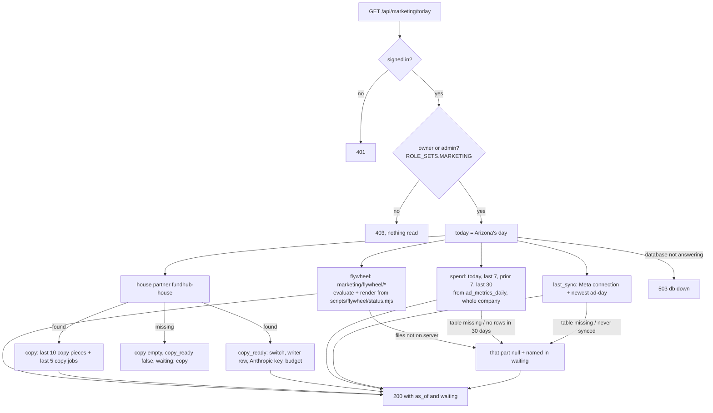
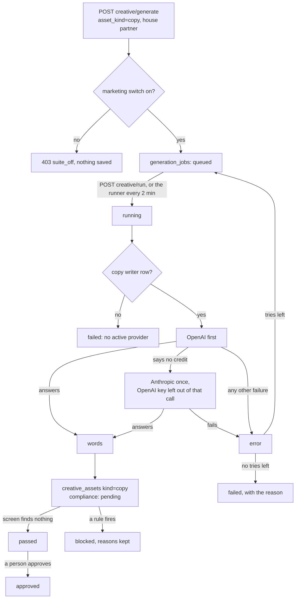
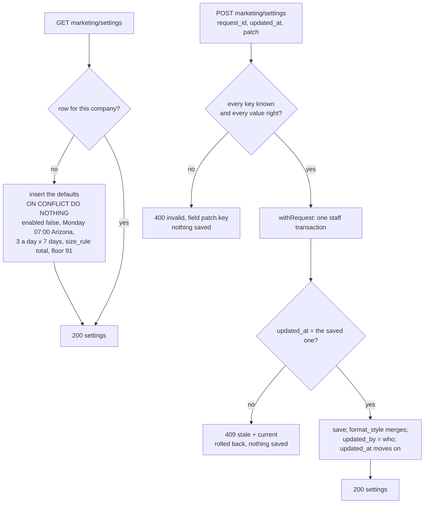
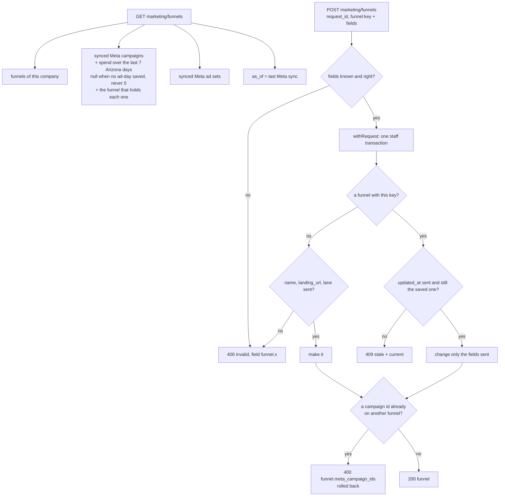
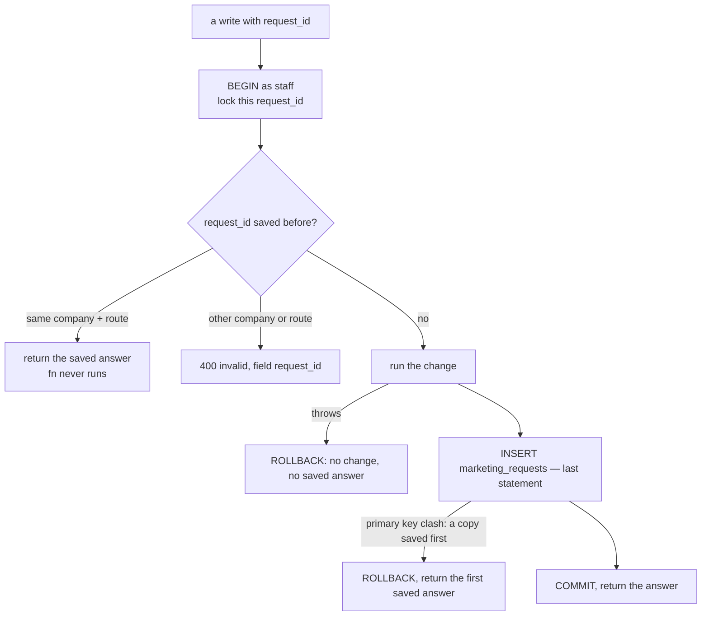
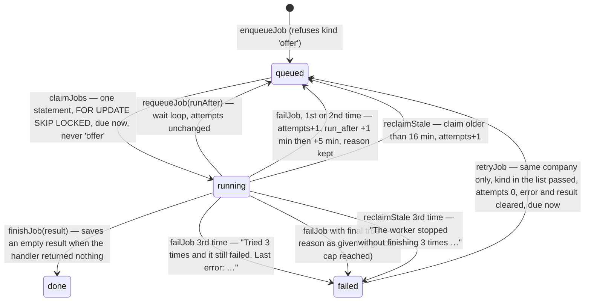
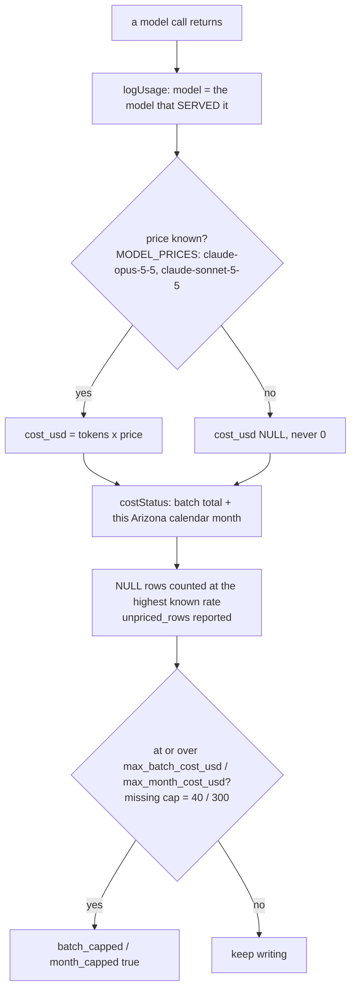
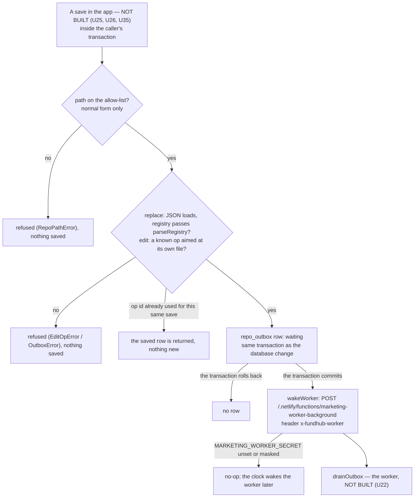
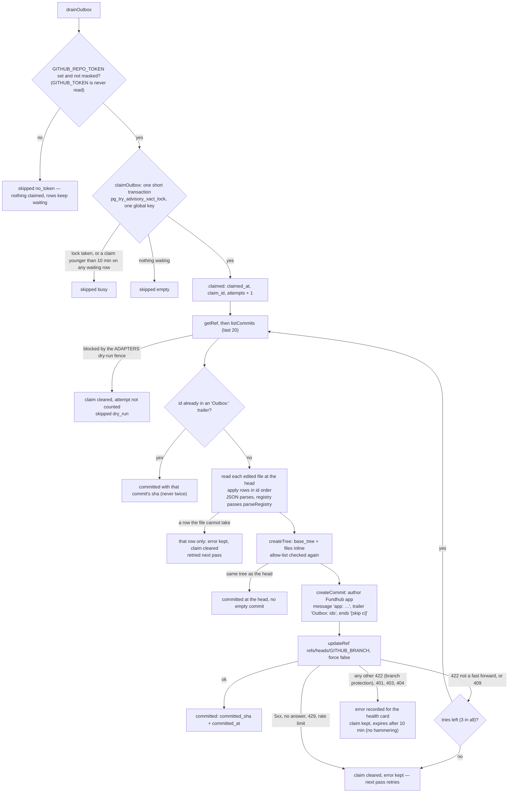

# Marketing Command Center — what the back end does today

Required by `CLAUDE.md` §3a step 4. Written 2026-10-05 from the code on branch
`m10-dashboard-backend` (slice 1, back end only). The plan is
`docs/specs/marketing-dashboard-plan-2026-10-05.md`; the JSON shape is
`docs/specs/marketing-today-contract.md`.

Drawn from code, not from the plan. Anything the code does not do yet is marked
**NOT BUILT** rather than drawn as if it ran.

## The Today read — `GET /api/marketing/today`

Read only. Each part reads in its own short transaction (`asStaff()`), so one part
that cannot be read does not take the others with it.

- A window with no saved ad-days is `null`, never `0`.
- A table or column that is not in the database yet (Postgres 42P01 / 42703 / 42883)
  makes that part `waiting`. Any other database error is a 503 (connection) or a 500.

## Write ad copy — the job states (existing Creative Factory path)

Nothing new in the states. What changed in slice 1: the writer's backup to Anthropic,
the copy writer row, and the house partner's switch (`db/seed/296`).

## NOT BUILT (on this branch)

- The page `public/app/marketing-command-center.*` (workflow M11).
- Running a flywheel stage from the page (slice 2). The flywheel rows are read only.
- The offer generator (workflow M12).

## U01 API contract for every marketing/* route

Added 2026-10-05 by plan unit U01. This adds no step, state, route or screen. It writes down the
request and answer shape of every `marketing/*` route in spec v3 (M1 to M8), plus
`POST marketing/jobs/retry` and the `resume_ad` action on `campaigns/write`, so the back-end units
and the screens build to one shape.

- Doc: `docs/specs/marketing-machine-api.md` (46 routes).
- Twin: `src/marketing/api-contract.mjs` (`CONTRACT`, `assertMatchesContract`, `exampleResponse`).
- Test: `src/marketing/api-contract.test.mjs` fails when the doc and the module drift apart.

What is in the code today, traced through `ROUTES` in `netlify/functions/api.mjs`:

| Routes | Owner | In ROUTES today |
|---|---|---|
| `GET marketing/today` | existing; U32 adds keys | yes (existing keys only; the M5 keys are UNVERIFIED until U32 lands) |
| `POST campaigns/write` | existing; U15 adds `resume_ad` | yes (pause, resume, update_budget only; `resume_ad` is UNVERIFIED until U15 lands) |
| settings, funnels | U03 | no |
| scripts, script, approve, edit, reject, order | U25 | no |
| scripts/fix, ideas, batches, write-now, rules, jobs/retry | U26 | no |
| batches/next | U23 | no |
| health | U22 | no |
| angles, funnels/stats | U32 | no |
| ads, ad | U31 | no |
| meta/load, meta/load-status | U28 | no |
| shoot, shoot/mark, videos/*, video, map, pages/* | deferred | no |

Every route marked "no" is a shape only. Each owner unit adds its own flow section here when its
route lands. Gaps between the spec, the design doc and the fixed shapes are listed in the
contract's section 8.
## U03 Settings, funnels, and one save per press

Drawn from code on branch `mm-u03-settings-funnels`: `api/marketing/settings.mjs`,
`api/marketing/funnels.mjs`, `src/marketing/http.mjs`, `src/marketing/settings-store.mjs`,
`src/marketing/offer-facts.mjs`, migration `410_marketing_settings_funnels.sql`, seed
`297_marketing_funnels.sql`. Spec §6 Step 3, §7.8, §17. Owner and admin only on both
routes (requireAuth, then requireRole `ROLE_SETS.MARKETING`).

### Settings — `GET/POST /api/marketing/settings`

- `enabled` goes true only when the patch says so — Chris's tap in Settings. No seed
  or migration sets it.
- Times are `HH:MM`. Money caps are whole dollars (model bills only).

### Funnels — `GET/POST /api/marketing/funnels`

- Seed 297 makes `book_call` (https://apply.fundhub.ai/watch, lane sorting, book a call,
  offer `funding_dfy`, mix standard 2 : sorting 1) and `roadmap_147`
  (https://apply.fundhub.ai/roadmap, lane uwiq, offer `slo_roadmap`, mix standard 1) in the
  default company, once. `meta_campaign_ids` stay empty until Chris maps them.
- `offerFacts(offer_key)` reads each price from `src/slo/offer.mjs` or
  `src/config/offers.mjs`. No price is typed in `src/marketing/`.

### One save per press — `withRequest` (every marketing write)

### Gaps between the spec and this code (findings, not reconciled)

- **Roadmap lane.** The spec seeds `roadmap_147` with lane `uwiq`; live roadmap visitors
  read lane `slo` (406/407). The seed uses the spec value until Chris answers the yes/no
  on the board. Numbers (M5) group by funnel, not lane.
- **offer_key values** (`funding_dfy`, `slo_roadmap`) are plan-chosen; the spec names the
  column, not the values.
- **One funnel per campaign.** The code refuses a Meta campaign that is already on another
  funnel of the same company, so a campaign's spend cannot count twice. The spec does not
  say this either way.
- **UNVERIFIED in a real database on this Mac** (no Postgres here): the SQL is proved by
  `src/http/marketing-settings.pg.test.mjs` and `marketing-funnels.pg.test.mjs` in GitHub CI.
## U04 Jobs, buzzes, model cost and shoots — the records (migration 411)

Drawn 2026-10-05 from the code on branch `mm-u04-jobs-buzzes-usage`:
`src/marketing/jobs.mjs`, `src/marketing/job-kinds.mjs`, `src/marketing/notify.mjs`,
`src/marketing/model-usage.mjs`, `db/migrations/411_marketing_buzzes_usage_shoots.sql`.
These are libraries and tables only. **No route, clock or worker calls them yet**: the
worker that claims jobs and sends buzzes is U22, the Retry button's route is U26, the
writer that logs model cost is U24. Those calls are marked UNVERIFIED below.

### A queued job (marketing_jobs, table from 409; claim index from 411)

`attempts` counts runs that went wrong (a failure, or a claim nobody finished). Claiming
and requeueing do not count. Kind `offer` is never touched by any of this: it runs on the
Write offer path above (`src/marketing/offer-store.mjs`).

- `nextRunAfter({kinds})` reads the earliest queued `run_after` (never `offer`), so the
  worker can wait inside its pass for a job due in a few seconds. UNVERIFIED: no worker yet (U22).
- `JOB_KINDS` (`src/marketing/job-kinds.mjs`) is **empty**. A kind not in it is never
  claimed by the worker and cannot be retried from the screen. U24, U28 and U35 add kinds.
- Retry button → `POST marketing/jobs/retry` → `retryJob`: UNVERIFIED, the route is U26.

### A buzz (marketing_buzzes, 411)

```mermaid
stateDiagram-v2
  [*] --> waiting: queueBuzz — send_after = now, or 07:00 Arizona when inside quiet hours (one waiting per company + kind + group; a repeat refreshes the words)
  waiting --> sending: sendDueBuzzes — due, none of that kind sent in 10 min, one per kind per pass; lease: attempts+1, send_after +5 min
  sending --> sent: send() answered ok:true AND status 'sent' — sent_at set
  sending --> waiting: anything else (ok:false, other status, a throw) — last_error kept, send_after = +5 min, pushed past quiet hours
  sending --> given_up: 5th failed attempt — failed_at set, never tried again
  sent --> [*]
  given_up --> [*]
```

- `send()` is always passed in. The worker will pass notify-fanout's `send`
  (`src/ad-videos/notify-fanout.mjs`); tests pass a fake. UNVERIFIED: no worker yet (U22).
- Which events buzz (scripts ready, videos ready, stuck) is decided by the callers
  (U24, U35, M3). UNVERIFIED: none of them call `queueBuzz` yet.

### Model cost (marketing_model_usage, 411)

UNVERIFIED: the writer that logs every call and stops at a cap is U24; Write now's refusal is U26.

### A shoot (marketing_shoots, 411)

Table only. States `planned | filming | uploaded | done`, enforced by the database; a done
shoot must have `finished_at`. Nothing reads or writes it yet (Shoot Day routes and screen
are later units). UNVERIFIED.

### Gaps between the spec and this code (findings, not reconciled)

- Spec §6 Step 3 lists `marketing_buzzes` without `attempts`, `last_error`, `failed_at`;
  the plan added them because notify-fanout's `send()` resolves `{ok:false}` instead of
  throwing. Built as the plan says.
- Spec §6 Step 4 says "After 3 attempts, a job fails". Here an attempt is a run that went
  wrong, not a claim, so wait loops (requeue) never use up tries.
- `group_key` is `NOT NULL DEFAULT ''` (spec lists it with no type) so "one waiting per
  group" also holds when no group is given.
## U05 M0 step 2: repo outbox (412), GitHub client provider, path allow-list, edit ops, lease-based drain (pooler-safe), worker wake

Drawn 2026-10-05 from the code on branch `mm-u05-repo-outbox`: `src/repo/outbox.mjs`,
`src/repo/allow-list.mjs`, `src/repo/edit-ops.mjs`, `src/messaging/providers/github-repo.mjs`,
`src/marketing/wake.mjs`, `db/migrations/412_repo_outbox.sql`. Spec §6 Step 2 and §2 item 8
("every save goes to the database and the repo").

**Nothing calls this yet.** The save routes (U25, U26, U35) call `enqueueRepoWrite` and
`wakeWorker`; the worker (U22) calls `drainOutbox` at most once a minute. Those boxes are
marked **NOT BUILT** below. Live commits also need `GITHUB_REPO_TOKEN` (only Chris can make it,
spec §16) and `MARKETING_WORKER_SECRET`; neither is set by this unit.

### A save, from the app to the repo

### One drain pass (`drainOutbox`)

- No lock and no transaction is held across any GitHub call. A drain whose lease was taken
  over writes nothing: every update is limited to rows that still carry its `claim_id`.
- The health card that shows `error` and the dry-run hold is U22 — **NOT BUILT**.
- Fallback reads: `netlify.toml` now bundles RULES.md, VOICE.md, RECIPES.md, angles.json,
  banned-live.json, registry.json and `marketing/broll/catalog.json` with every function. The
  code that falls back to them is in the readers (U24, U26) — **NOT BUILT**.

### Gaps between the spec and this code (findings, not reconciled)

- Spec §6 Step 2 says the drain "takes `pg_try_advisory_lock`". Built instead as
  `pg_try_advisory_xact_lock` plus a 10-minute lease, per the plan's critique fix B1: a session
  lock leaks on the Supabase transaction pooler.
- Spec §6 Step 2 cites `parseRegistry` at `src/ads/registry.mjs:108`; it is at :118 today.
- A save that does not fit its file (for example an edit to a Part 0 rule number that is not
  there) is retried every pass with its reason on the row. There is no "gave up" state; the
  spec names none.
- `docs/journeys/marketing-machine-intended.md` is not on main, so this was checked against
  the spec text, not the intended journey.
