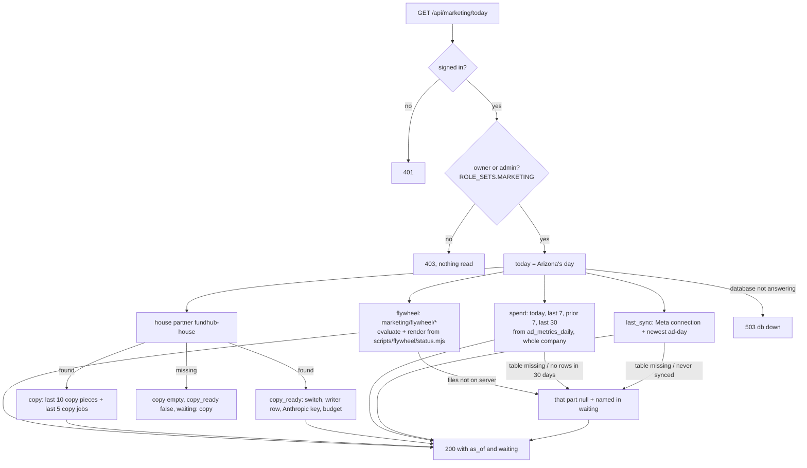
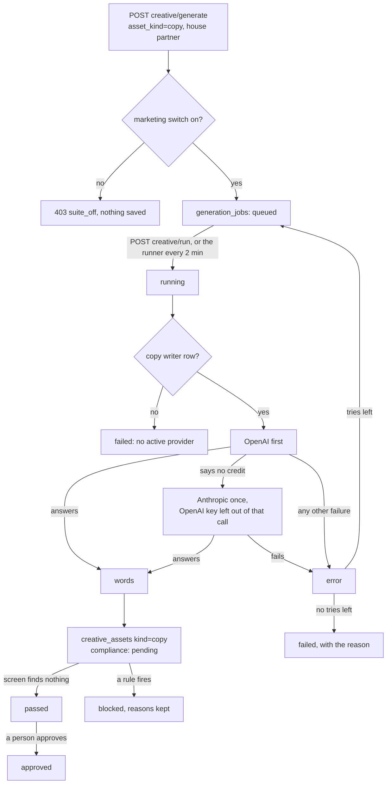
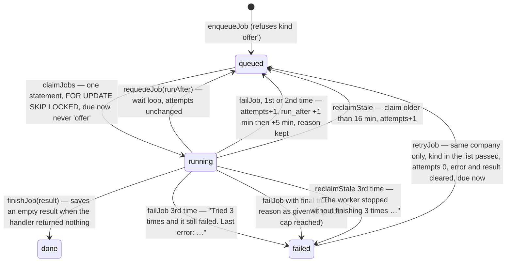
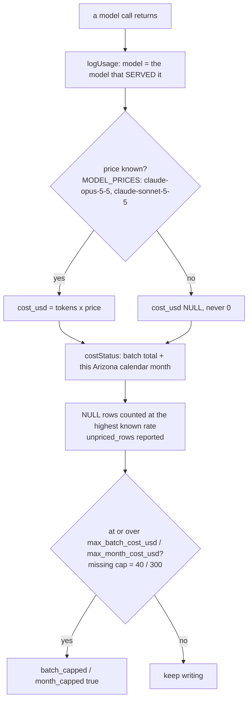

# Marketing Command Center — what the back end does today

Required by `CLAUDE.md` §3a step 4. Written 2026-10-05 from the code on branch
`m10-dashboard-backend` (slice 1, back end only). The plan is
`docs/specs/marketing-dashboard-plan-2026-10-05.md`; the JSON shape is
`docs/specs/marketing-today-contract.md`.

Drawn from code, not from the plan. Anything the code does not do yet is marked
**NOT BUILT** rather than drawn as if it ran.

## The Today read — `GET /api/marketing/today`

Read only. Each part reads in its own short transaction (`asStaff()`), so one part
that cannot be read does not take the others with it.

- A window with no saved ad-days is `null`, never `0`.
- A table or column that is not in the database yet (Postgres 42P01 / 42703 / 42883)
  makes that part `waiting`. Any other database error is a 503 (connection) or a 500.

## Write ad copy — the job states (existing Creative Factory path)

Nothing new in the states. What changed in slice 1: the writer's backup to Anthropic,
the copy writer row, and the house partner's switch (`db/seed/296`).

## NOT BUILT (on this branch)

- The page `public/app/marketing-command-center.*` (workflow M11).
- Running a flywheel stage from the page (slice 2). The flywheel rows are read only.
- The offer generator (workflow M12).

## U04 Jobs, buzzes, model cost and shoots — the records (migration 411)

Drawn 2026-10-05 from the code on branch `mm-u04-jobs-buzzes-usage`:
`src/marketing/jobs.mjs`, `src/marketing/job-kinds.mjs`, `src/marketing/notify.mjs`,
`src/marketing/model-usage.mjs`, `db/migrations/411_marketing_buzzes_usage_shoots.sql`.
These are libraries and tables only. **No route, clock or worker calls them yet**: the
worker that claims jobs and sends buzzes is U22, the Retry button's route is U26, the
writer that logs model cost is U24. Those calls are marked UNVERIFIED below.

### A queued job (marketing_jobs, table from 409; claim index from 411)

`attempts` counts runs that went wrong (a failure, or a claim nobody finished). Claiming
and requeueing do not count. Kind `offer` is never touched by any of this: it runs on the
Write offer path above (`src/marketing/offer-store.mjs`).

- `nextRunAfter({kinds})` reads the earliest queued `run_after` (never `offer`), so the
  worker can wait inside its pass for a job due in a few seconds. UNVERIFIED: no worker yet (U22).
- `JOB_KINDS` (`src/marketing/job-kinds.mjs`) is **empty**. A kind not in it is never
  claimed by the worker and cannot be retried from the screen. U24, U28 and U35 add kinds.
- Retry button → `POST marketing/jobs/retry` → `retryJob`: UNVERIFIED, the route is U26.

### A buzz (marketing_buzzes, 411)

```mermaid
stateDiagram-v2
  [*] --> waiting: queueBuzz — send_after = now, or 07:00 Arizona when inside quiet hours (one waiting per company + kind + group; a repeat refreshes the words)
  waiting --> sending: sendDueBuzzes — due, none of that kind sent in 10 min, one per kind per pass; lease: attempts+1, send_after +5 min
  sending --> sent: send() answered ok:true AND status 'sent' — sent_at set
  sending --> waiting: anything else (ok:false, other status, a throw) — last_error kept, send_after = +5 min, pushed past quiet hours
  sending --> given_up: 5th failed attempt — failed_at set, never tried again
  sent --> [*]
  given_up --> [*]
```

- `send()` is always passed in. The worker will pass notify-fanout's `send`
  (`src/ad-videos/notify-fanout.mjs`); tests pass a fake. UNVERIFIED: no worker yet (U22).
- Which events buzz (scripts ready, videos ready, stuck) is decided by the callers
  (U24, U35, M3). UNVERIFIED: none of them call `queueBuzz` yet.

### Model cost (marketing_model_usage, 411)

UNVERIFIED: the writer that logs every call and stops at a cap is U24; Write now's refusal is U26.

### A shoot (marketing_shoots, 411)

Table only. States `planned | filming | uploaded | done`, enforced by the database; a done
shoot must have `finished_at`. Nothing reads or writes it yet (Shoot Day routes and screen
are later units). UNVERIFIED.

### Gaps between the spec and this code (findings, not reconciled)

- Spec §6 Step 3 lists `marketing_buzzes` without `attempts`, `last_error`, `failed_at`;
  the plan added them because notify-fanout's `send()` resolves `{ok:false}` instead of
  throwing. Built as the plan says.
- Spec §6 Step 4 says "After 3 attempts, a job fails". Here an attempt is a run that went
  wrong, not a claim, so wait loops (requeue) never use up tries.
- `group_key` is `NOT NULL DEFAULT ''` (spec lists it with no type) so "one waiting per
  group" also holds when no group is given.
