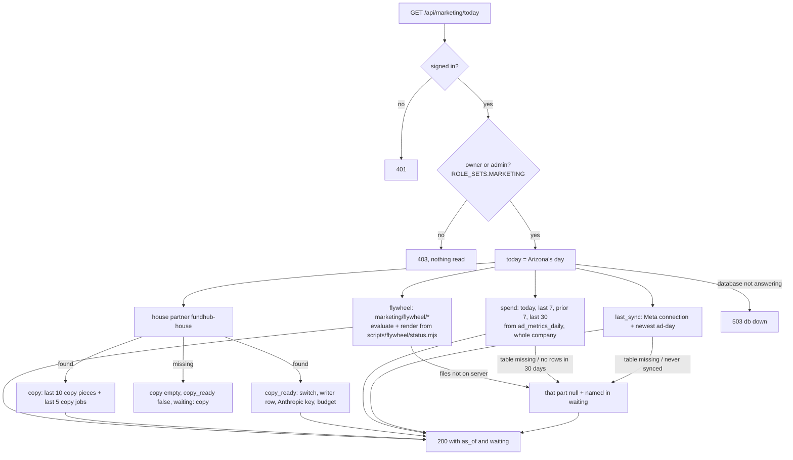
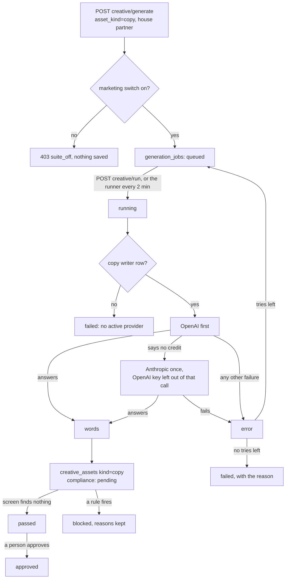
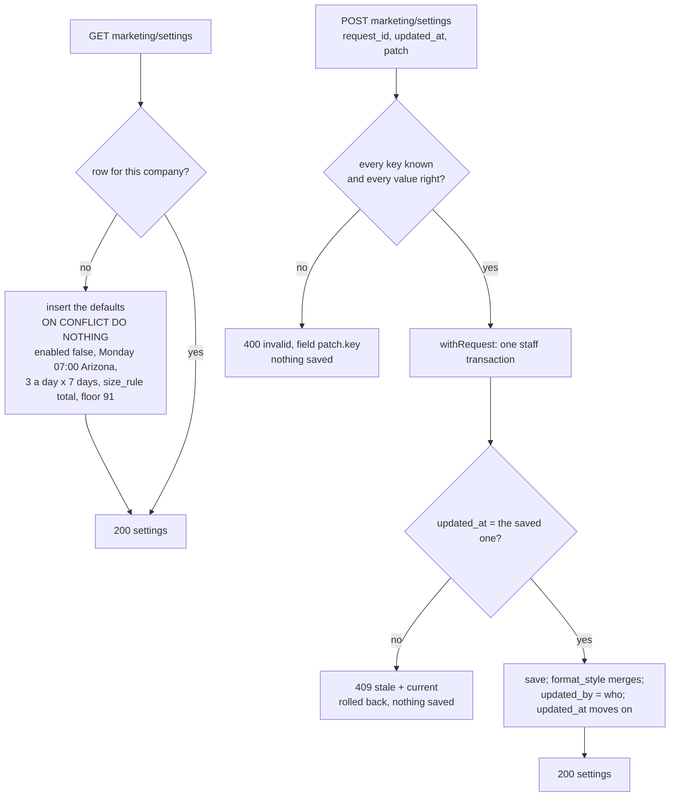
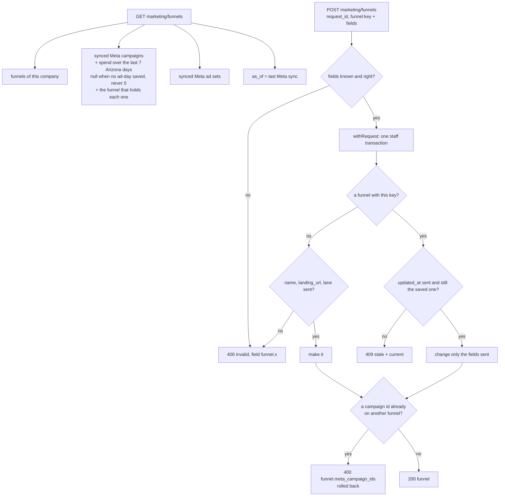
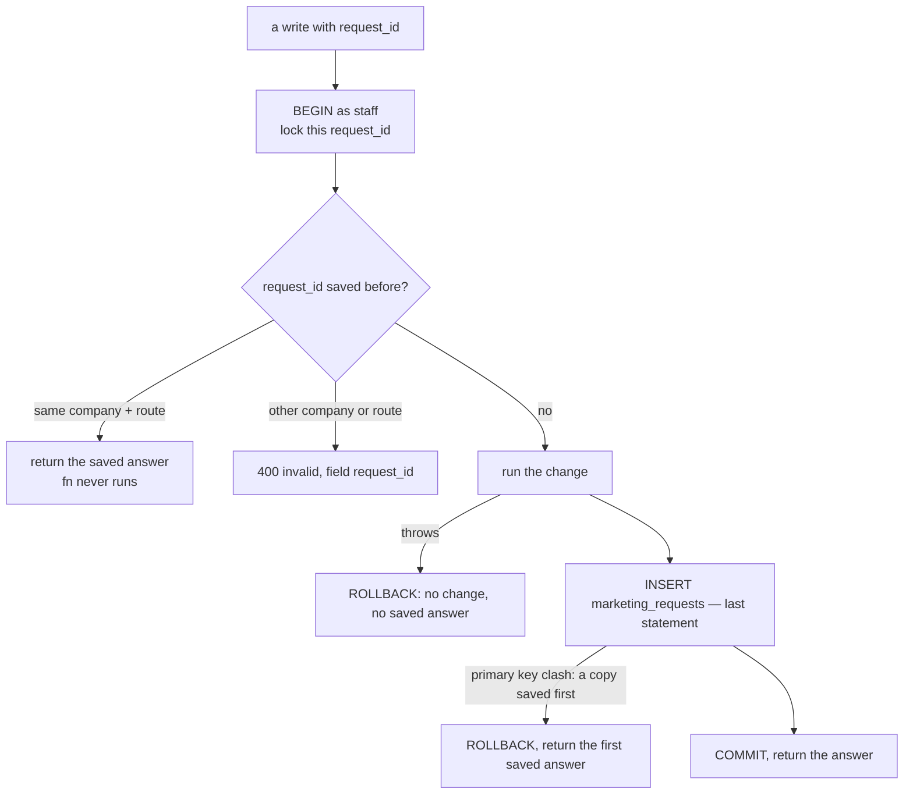

# Marketing Command Center — what the back end does today

Required by `CLAUDE.md` §3a step 4. Written 2026-10-05 from the code on branch
`m10-dashboard-backend` (slice 1, back end only). The plan is
`docs/specs/marketing-dashboard-plan-2026-10-05.md`; the JSON shape is
`docs/specs/marketing-today-contract.md`.

Drawn from code, not from the plan. Anything the code does not do yet is marked
**NOT BUILT** rather than drawn as if it ran.

## The Today read — `GET /api/marketing/today`

Read only. Each part reads in its own short transaction (`asStaff()`), so one part
that cannot be read does not take the others with it.

- A window with no saved ad-days is `null`, never `0`.
- A table or column that is not in the database yet (Postgres 42P01 / 42703 / 42883)
  makes that part `waiting`. Any other database error is a 503 (connection) or a 500.

## Write ad copy — the job states (existing Creative Factory path)

Nothing new in the states. What changed in slice 1: the writer's backup to Anthropic,
the copy writer row, and the house partner's switch (`db/seed/296`).

## NOT BUILT (on this branch)

- The page `public/app/marketing-command-center.*` (workflow M11).
- Running a flywheel stage from the page (slice 2). The flywheel rows are read only.
- The offer generator (workflow M12).

## U03 Settings, funnels, and one save per press

Drawn from code on branch `mm-u03-settings-funnels`: `api/marketing/settings.mjs`,
`api/marketing/funnels.mjs`, `src/marketing/http.mjs`, `src/marketing/settings-store.mjs`,
`src/marketing/offer-facts.mjs`, migration `410_marketing_settings_funnels.sql`, seed
`297_marketing_funnels.sql`. Spec §6 Step 3, §7.8, §17. Owner and admin only on both
routes (requireAuth, then requireRole `ROLE_SETS.MARKETING`).

### Settings — `GET/POST /api/marketing/settings`

- `enabled` goes true only when the patch says so — Chris's tap in Settings. No seed
  or migration sets it.
- Times are `HH:MM`. Money caps are whole dollars (model bills only).

### Funnels — `GET/POST /api/marketing/funnels`

- Seed 297 makes `book_call` (https://apply.fundhub.ai/watch, lane sorting, book a call,
  offer `funding_dfy`, mix standard 2 : sorting 1) and `roadmap_147`
  (https://apply.fundhub.ai/roadmap, lane uwiq, offer `slo_roadmap`, mix standard 1) in the
  default company, once. `meta_campaign_ids` stay empty until Chris maps them.
- `offerFacts(offer_key)` reads each price from `src/slo/offer.mjs` or
  `src/config/offers.mjs`. No price is typed in `src/marketing/`.

### One save per press — `withRequest` (every marketing write)

### Gaps between the spec and this code (findings, not reconciled)

- **Roadmap lane.** The spec seeds `roadmap_147` with lane `uwiq`; live roadmap visitors
  read lane `slo` (406/407). The seed uses the spec value until Chris answers the yes/no
  on the board. Numbers (M5) group by funnel, not lane.
- **offer_key values** (`funding_dfy`, `slo_roadmap`) are plan-chosen; the spec names the
  column, not the values.
- **One funnel per campaign.** The code refuses a Meta campaign that is already on another
  funnel of the same company, so a campaign's spend cannot count twice. The spec does not
  say this either way.
- **UNVERIFIED in a real database on this Mac** (no Postgres here): the SQL is proved by
  `src/http/marketing-settings.pg.test.mjs` and `marketing-funnels.pg.test.mjs` in GitHub CI.
