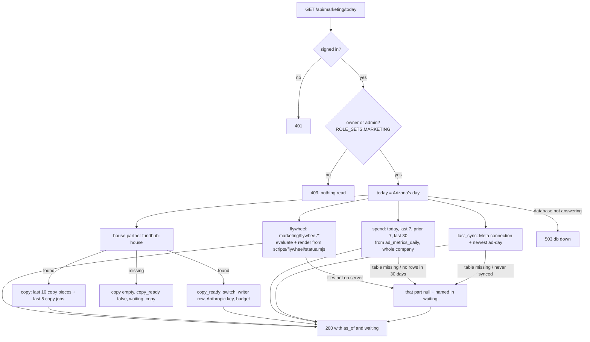
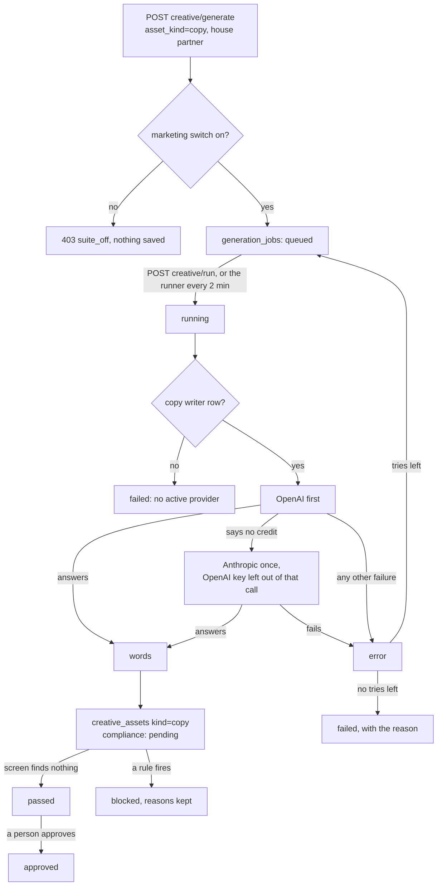
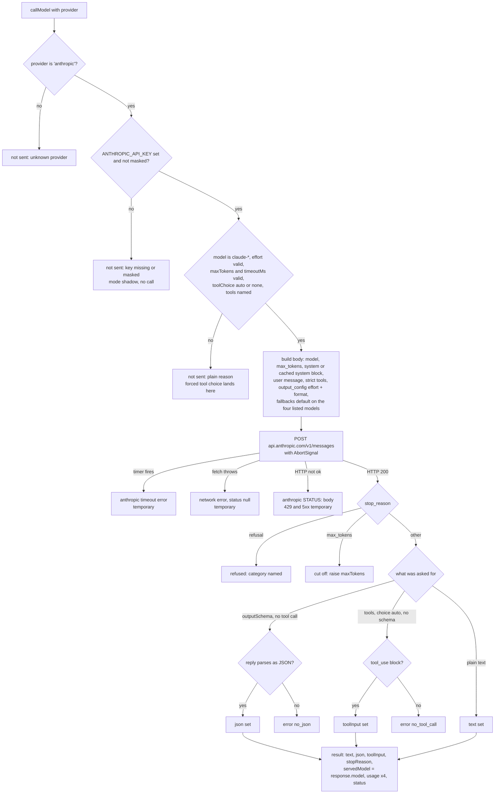

# Marketing Command Center — what the back end does today

Required by `CLAUDE.md` §3a step 4. Written 2026-10-05 from the code on branch
`m10-dashboard-backend` (slice 1, back end only). The plan is
`docs/specs/marketing-dashboard-plan-2026-10-05.md`; the JSON shape is
`docs/specs/marketing-today-contract.md`.

Drawn from code, not from the plan. Anything the code does not do yet is marked
**NOT BUILT** rather than drawn as if it ran.

## The Today read — `GET /api/marketing/today`

Read only. Each part reads in its own short transaction (`asStaff()`), so one part
that cannot be read does not take the others with it.

- A window with no saved ad-days is `null`, never `0`.
- A table or column that is not in the database yet (Postgres 42P01 / 42703 / 42883)
  makes that part `waiting`. Any other database error is a 503 (connection) or a 500.

## Write ad copy — the job states (existing Creative Factory path)

Nothing new in the states. What changed in slice 1: the writer's backup to Anthropic,
the copy writer row, and the house partner's switch (`db/seed/296`).

## NOT BUILT (on this branch)

- The page `public/app/marketing-command-center.*` (workflow M11).
- Running a flywheel stage from the page (slice 2). The flywheel rows are read only.
- The offer generator (workflow M12).

## U06 M0 step 4 model client: callModel provider 'anthropic'

Drawn 2026-10-05 from `src/agents/model.mjs` (`callModel` → `callAnthropicForced`)
on branch `mm-u06-anthropic-model-client`. Spec §6 step 4 "The model client" and
§4 trap 8. No screen. Nothing calls this path yet; the writer (U24) is its first
user.

What it does, in plain words:

- `callModel({ provider: 'anthropic', ... })` only ever calls
  `api.anthropic.com`. An OpenAI key in the same env is ignored.
- Without `provider`, `callModel` is the same code as before (OpenAI first, then
  Anthropic). A test pins the old Anthropic request body byte for byte.
- A missing key, a masked key (it holds `*`), a forced tool choice (`'any'` or a
  named tool), a non-Claude model name or a bad option is refused before
  anything is sent. The error starts `not sent:`.
- Every request carries `output_config.effort` (default `medium`), a timer
  (default 10 minutes) that aborts the request, and `max_tokens` (default 16000,
  because thinking counts toward it). It never carries `thinking`,
  `temperature`, `top_p`, `top_k` or `budget_tokens`.
- `cache: true` sends the system prompt as one block marked
  `cache_control: ephemeral`.
- `outputSchema` goes out as `output_config.format` (`json_schema`); the parsed
  reply comes back as `json`, or the error `no_json`.
- `tools` go out with `strict: true`, `additionalProperties: false` and a
  `required` list on every object. The first `tool_use` input comes back as
  `toolInput`; no tool call (choice `auto`) is the error `no_tool_call`.
- On claude-opus-5-5, claude-opus-5, claude-sonnet-5-5 and claude-fable-5-1 it
  asks for `fallbacks: "default"` with the beta header
  `server-side-fallback-2026-07-01` unless `fallbacks: false`. `servedModel` is
  the model that answered.
- Every result has `usage` with input, output, cache-read and cache-write tokens.

UNVERIFIED: that Anthropic accepts this exact request shape. Fake-fetch tests
prove what is sent, not that the vendor takes it. The orchestrator's one small
live call after the ship is the proof (a 400 means the shape is wrong).

Gaps against the spec (findings, not reconciled):

- Spec §6 step 4 lists `tools` and `toolChoice`, and §7.6 speaks of a forced
  `save_script` tool. Forced tool use is HTTP 400 on claude-opus-5-5 and
  claude-sonnet-5-5 (claude-api skill), so only `auto` and `none` are accepted
  and the writer gets `outputSchema` instead.
- The spec names no default model, `maxTokens`, timeout or effort for this
  path. The defaults above come from the claude-api skill.
