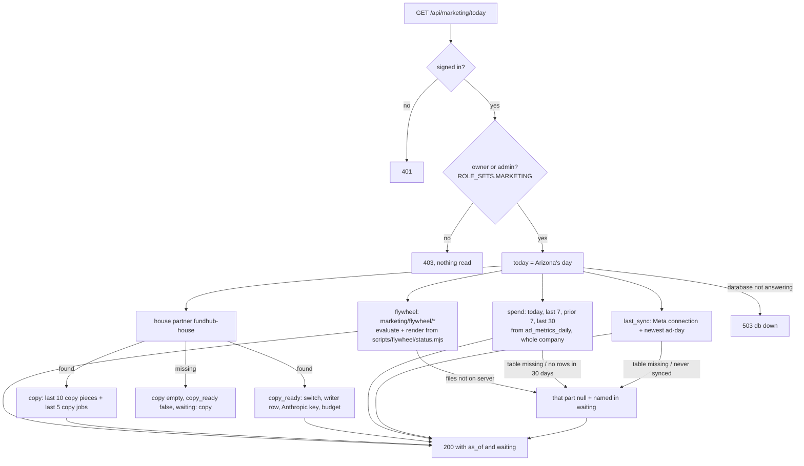
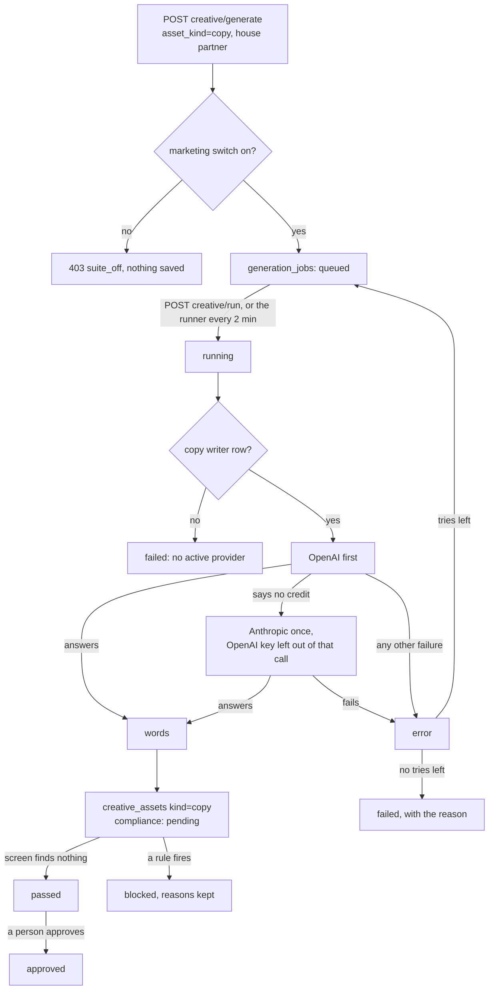
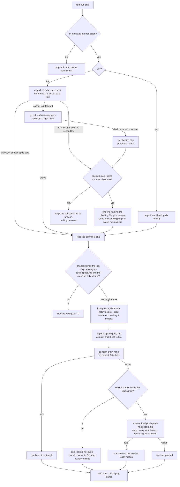
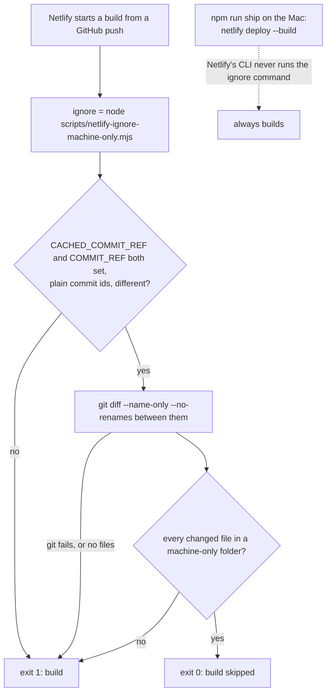

# Marketing Command Center — what the back end does today

Required by `CLAUDE.md` §3a step 4. Written 2026-10-05 from the code on branch
`m10-dashboard-backend` (slice 1, back end only). The plan is
`docs/specs/marketing-dashboard-plan-2026-10-05.md`; the JSON shape is
`docs/specs/marketing-today-contract.md`.

Drawn from code, not from the plan. Anything the code does not do yet is marked
**NOT BUILT** rather than drawn as if it ran.

## The Today read — `GET /api/marketing/today`

Read only. Each part reads in its own short transaction (`asStaff()`), so one part
that cannot be read does not take the others with it.

- A window with no saved ad-days is `null`, never `0`.
- A table or column that is not in the database yet (Postgres 42P01 / 42703 / 42883)
  makes that part `waiting`. Any other database error is a 503 (connection) or a 500.

## Write ad copy — the job states (existing Creative Factory path)

Nothing new in the states. What changed in slice 1: the writer's backup to Anthropic,
the copy writer row, and the house partner's switch (`db/seed/296`).

## NOT BUILT (on this branch)

- The page `public/app/marketing-command-center.*` (workflow M11).
- Running a flywheel stage from the page (slice 2). The flywheel rows are read only.
- The offer generator (workflow M12).

## U08 Ship stays in step with GitHub (spec M0 step 8)

Drawn 2026-10-05 from `scripts/ship.mjs`, `scripts/ship-machine-paths.mjs`,
`scripts/netlify-ignore-machine-only.mjs` and the `[build] ignore` line in
`netlify.toml`, on branch `mm-u08-ship-pull-push`. Ops only, no screen.

Machine-only folders (one list, `MACHINE_ONLY_PATHS`, read by both ship and the
Netlify skip rule): `marketing/ads/scripts/machine/`, `marketing/ads/ideas/`,
`marketing/ads/videos/`, `marketing/brain/`, `ops/page-requests/`. Rule, voice and
registry files (`marketing/ads/RULES.md`, `VOICE.md`, `registry.json`,
`banned-live.json`, `angles.json`) are not on it, so they still ship.

### `npm run ship`

- A failed pull never stops the ship. The only stop in the pull step is a folder left
  half way through a pull, because deploying it would ship a broken tree.
- The push runs only after the ship-log commit. Nothing after it can stop the ship or
  undo the deploy.
- Why the push is checked first: `github-push-whole-repo.mjs` leases `main` on the copy
  it fetches a moment before, so on its own it would overwrite GitHub commits this Mac
  does not have (the outbox's saves). Ship pushes only when GitHub's main is already
  inside this Mac's main; the next ship pulls first.
- A rebase copies this Mac's local commits, including the commits of branches merged
  locally since the last push. The merge commits stay merges, but the old branch tips
  are no longer inside `main` afterwards.

### Netlify build started by a GitHub push

- A commit that changes only `ops/ship-log.md` is "nothing to ship" for `npm run ship`
  but builds on Netlify (the skip list is the machine-only folders only).
- **UNVERIFIED:** whether the live site still starts builds from GitHub pushes at all
  (repo link, stop_builds). This unit did not read the site's build settings; the
  orchestrator's precondition records them.
- **UNVERIFIED:** Netlify's own handling of the exit code (0 skips, 1 builds) is from
  Netlify's docs, not seen on a live build.
