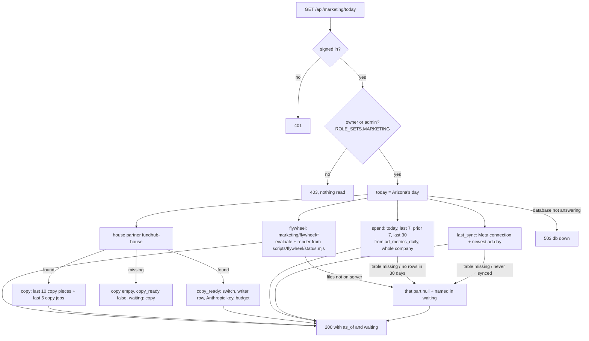
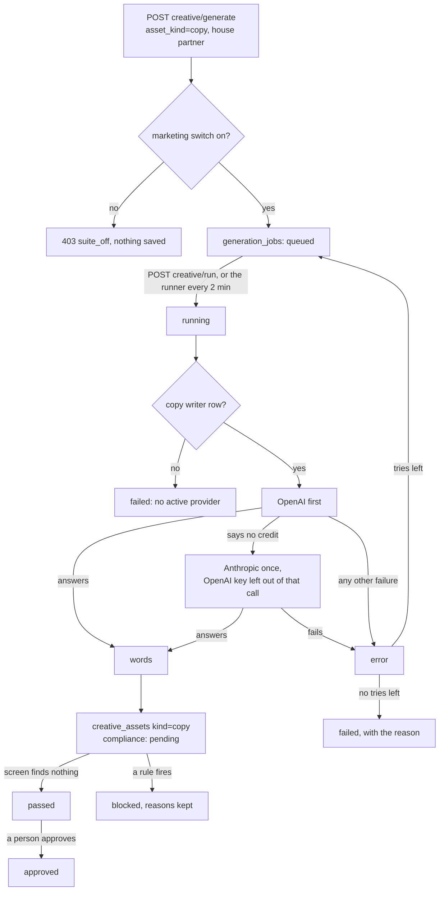
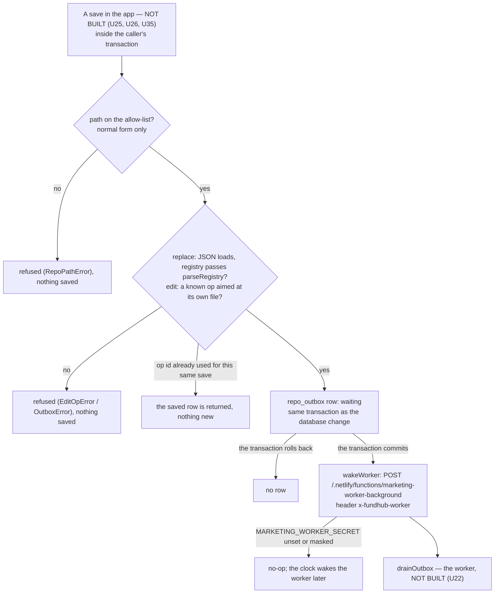
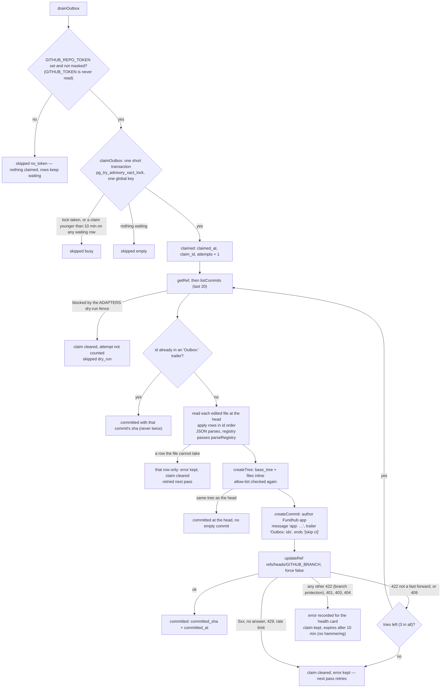

# Marketing Command Center — what the back end does today

Required by `CLAUDE.md` §3a step 4. Written 2026-10-05 from the code on branch
`m10-dashboard-backend` (slice 1, back end only). The plan is
`docs/specs/marketing-dashboard-plan-2026-10-05.md`; the JSON shape is
`docs/specs/marketing-today-contract.md`.

Drawn from code, not from the plan. Anything the code does not do yet is marked
**NOT BUILT** rather than drawn as if it ran.

## The Today read — `GET /api/marketing/today`

Read only. Each part reads in its own short transaction (`asStaff()`), so one part
that cannot be read does not take the others with it.

- A window with no saved ad-days is `null`, never `0`.
- A table or column that is not in the database yet (Postgres 42P01 / 42703 / 42883)
  makes that part `waiting`. Any other database error is a 503 (connection) or a 500.

## Write ad copy — the job states (existing Creative Factory path)

Nothing new in the states. What changed in slice 1: the writer's backup to Anthropic,
the copy writer row, and the house partner's switch (`db/seed/296`).

## NOT BUILT (on this branch)

- The page `public/app/marketing-command-center.*` (workflow M11).
- Running a flywheel stage from the page (slice 2). The flywheel rows are read only.
- The offer generator (workflow M12).

## U05 M0 step 2: repo outbox (412), GitHub client provider, path allow-list, edit ops, lease-based drain (pooler-safe), worker wake

Drawn 2026-10-05 from the code on branch `mm-u05-repo-outbox`: `src/repo/outbox.mjs`,
`src/repo/allow-list.mjs`, `src/repo/edit-ops.mjs`, `src/messaging/providers/github-repo.mjs`,
`src/marketing/wake.mjs`, `db/migrations/412_repo_outbox.sql`. Spec §6 Step 2 and §2 item 8
("every save goes to the database and the repo").

**Nothing calls this yet.** The save routes (U25, U26, U35) call `enqueueRepoWrite` and
`wakeWorker`; the worker (U22) calls `drainOutbox` at most once a minute. Those boxes are
marked **NOT BUILT** below. Live commits also need `GITHUB_REPO_TOKEN` (only Chris can make it,
spec §16) and `MARKETING_WORKER_SECRET`; neither is set by this unit.

### A save, from the app to the repo

### One drain pass (`drainOutbox`)

- No lock and no transaction is held across any GitHub call. A drain whose lease was taken
  over writes nothing: every update is limited to rows that still carry its `claim_id`.
- The health card that shows `error` and the dry-run hold is U22 — **NOT BUILT**.
- Fallback reads: `netlify.toml` now bundles RULES.md, VOICE.md, RECIPES.md, angles.json,
  banned-live.json, registry.json and `marketing/broll/catalog.json` with every function. The
  code that falls back to them is in the readers (U24, U26) — **NOT BUILT**.

### Gaps between the spec and this code (findings, not reconciled)

- Spec §6 Step 2 says the drain "takes `pg_try_advisory_lock`". Built instead as
  `pg_try_advisory_xact_lock` plus a 10-minute lease, per the plan's critique fix B1: a session
  lock leaks on the Supabase transaction pooler.
- Spec §6 Step 2 cites `parseRegistry` at `src/ads/registry.mjs:108`; it is at :118 today.
- A save that does not fit its file (for example an edit to a Part 0 rule number that is not
  there) is retried every pass with its reason on the row. There is no "gave up" state; the
  spec names none.
- `docs/journeys/marketing-machine-intended.md` is not on main, so this was checked against
  the spec text, not the intended journey.
