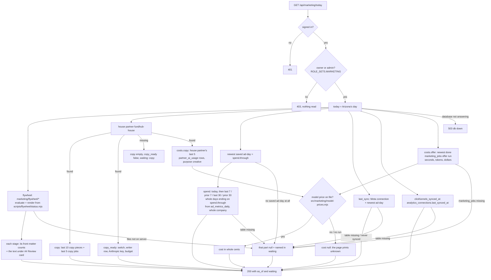
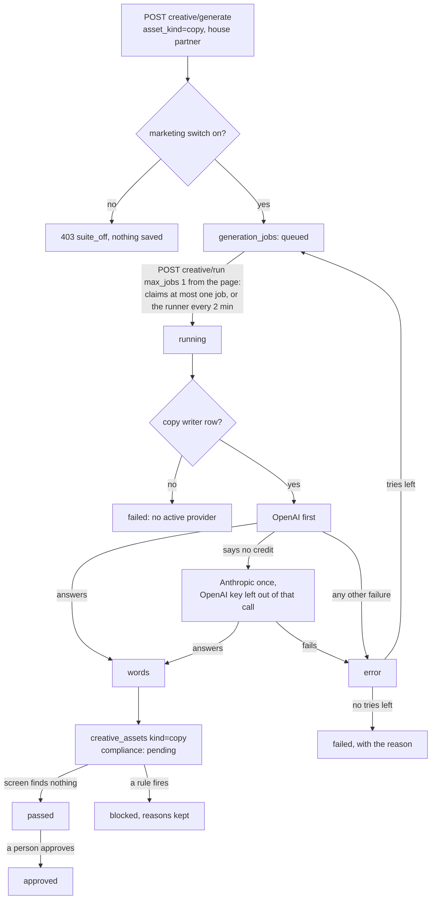
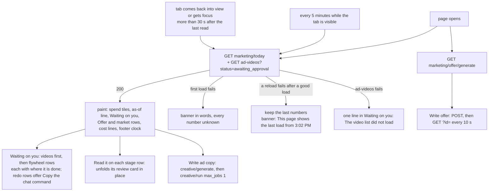

# Marketing Command Center — what the back end does today

Required by `CLAUDE.md` §3a step 4. Written 2026-10-05 from the code on branch
`m10-dashboard-backend` (slice 1, back end only). The plan is
`docs/specs/marketing-dashboard-plan-2026-10-05.md`; the JSON shape is
`docs/specs/marketing-today-contract.md`.

Drawn from code, not from the plan. Anything the code does not do yet is marked
**NOT BUILT** rather than drawn as if it ran.

Updated 2026-10-05 on branch `cc-slice0-today-truth` for slice 0 of
`docs/specs/command-center-design-2026-10-05.md` ("Today tells the truth"): whole-day
spend windows, `prior_30_days`, the ClickFunnels time, measured costs, the stage counts
and review cards, the page that reads them, and `max_jobs: 1` on Write ad copy.

## The Today read — `GET /api/marketing/today`

Read only. Each part reads in its own short transaction (`asStaff()`), so one part
that cannot be read does not take the others with it.

- A window with no saved ad-days is `null`, never `0`.
- The 7 and 30 day windows end on the newest day with saved numbers, not on today, so
  both sides of every comparison are whole days. Only `today` is today.
- A cost is `null` when no run was measured, or when a run's model has no price with a
  source in `src/marketing/model-prices.mjs` (today only `claude-opus-5-5` has one).
- A table or column that is not in the database yet (Postgres 42P01 / 42703 / 42883)
  makes that part `waiting`. Any other database error is a 503 (connection) or a 500.

## Write ad copy — the job states (existing Creative Factory path)

Nothing new in the states. What changed in slice 1: the writer's backup to Anthropic,
the copy writer row, and the house partner's switch (`db/seed/296`).

## The page — `public/app/marketing-command-center.*` (Today view)

What the page reads, and when. Drawn from `public/app/marketing-command-center.js`.

- Nothing on the page approves a video or a flywheel step. The videos row says
  approving is not on the page yet, and when the text message's links ran out
  (`approval_expires_at`). Approving a stage still runs in chat; the row says so.
- No inner scroll box: long ad copy and the offer fold behind Show more.

## NOT BUILT (on this branch)

- Running a flywheel stage from the page, approving one, tweaking one (design slice 5).
  The flywheel rows are read only.
- Approving or rejecting a video from the page (design slice 2). Only the count, the
  ads and the dates are shown.
- `GET marketing/costs` and the cost ledger (design slice 1). Until then the cost lines
  come from `GET marketing/today` `costs`, as above.
