# Marketing Command Center — what the back end does today

Required by `CLAUDE.md` §3a step 4. Written 2026-10-05 from the code on branch
`m10-dashboard-backend` (slice 1, back end only). The plan is
`docs/specs/marketing-dashboard-plan-2026-10-05.md`; the JSON shape is
`docs/specs/marketing-today-contract.md`.

Drawn from code, not from the plan. Anything the code does not do yet is marked
**NOT BUILT** rather than drawn as if it ran.

## The Today read — `GET /api/marketing/today`

Read only. Each part reads in its own short transaction (`asStaff()`), so one part
that cannot be read does not take the others with it.

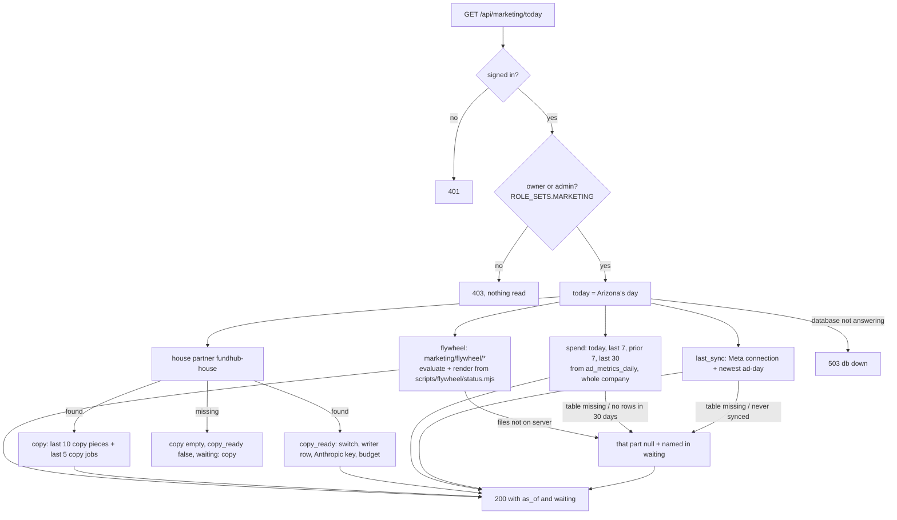
```mermaid
flowchart TD
  A[GET /api/marketing/today] --> B{signed in?}
  B -->|no| B1[401]
  B -->|yes| C{owner or admin?<br/>ROLE_SETS.MARKETING}
  C -->|no| C1[403, nothing read]
  C -->|yes| D[today = Arizona's day]
  D --> F[flywheel: marketing/flywheel/*<br/>evaluate + render from scripts/flywheel/status.mjs]
  D --> H[house partner fundhub-house]
  H -->|found| H1[copy: last 10 copy pieces + last 5 copy jobs]
  H -->|found| H2[copy_ready: switch, writer row, Anthropic key, budget]
  H -->|missing| H3[copy empty, copy_ready false, waiting: copy]
  D --> S[spend: today, last 7, prior 7, last 30<br/>from ad_metrics_daily, whole company]
  D --> L[last_sync: Meta connection + newest ad-day]
  F & H1 & H2 & S & L --> Z[200 with as_of and waiting]
  F -->|files not on server| W[that part null + named in waiting]
  S -->|table missing / no rows in 30 days| W
  L -->|table missing / never synced| W
  W --> Z
  D -->|database not answering| E[503 db down]
```

- A window with no saved ad-days is `null`, never `0`.
- A table or column that is not in the database yet (Postgres 42P01 / 42703 / 42883)
  makes that part `waiting`. Any other database error is a 503 (connection) or a 500.

## Write ad copy — the job states (existing Creative Factory path)

Nothing new in the states. What changed in slice 1: the writer's backup to Anthropic,
the copy writer row, and the house partner's switch (`db/seed/296`).

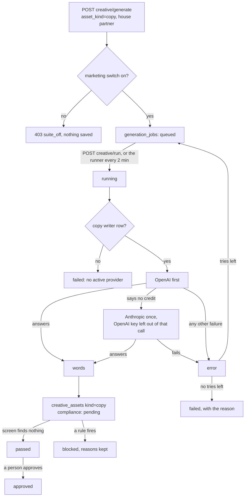
```mermaid
flowchart TD
  C0[POST creative/generate<br/>asset_kind=copy, house partner] --> G{marketing switch on?}
  G -->|no| G1[403 suite_off, nothing saved]
  G -->|yes| C1[generation_jobs: queued]
  C1 -->|POST creative/run, or the runner every 2 min| C2[running]
  C2 --> R{copy writer row?}
  R -->|no| C9[failed: no active provider]
  R -->|yes| M[OpenAI first]
  M -->|answers| T[words]
  M -->|says no credit| A[Anthropic once,<br/>OpenAI key left out of that call]
  M -->|any other failure| X[error]
  A -->|answers| T
  A -->|fails| X
  X -->|tries left| C1
  X -->|no tries left| C9b[failed, with the reason]
  T --> C3[creative_assets kind=copy<br/>compliance: pending]
  C3 -->|screen finds nothing| C4[passed]
  C3 -->|a rule fires| C5[blocked, reasons kept]
  C4 -->|a person approves| C6[approved]
```

## U20 M5 11.1: metric definitions (`src/marketing/metrics.mjs`)

Written 2026-10-06 from the code on branch `mm-u20-metric-definitions`. Read only:
nothing here writes a row, calls Meta or calls a model. No endpoint yet (U31/U32
call these readers). The words for each number are in `docs/marketing/metrics.md`.

How one lead becomes numbers on its ad:

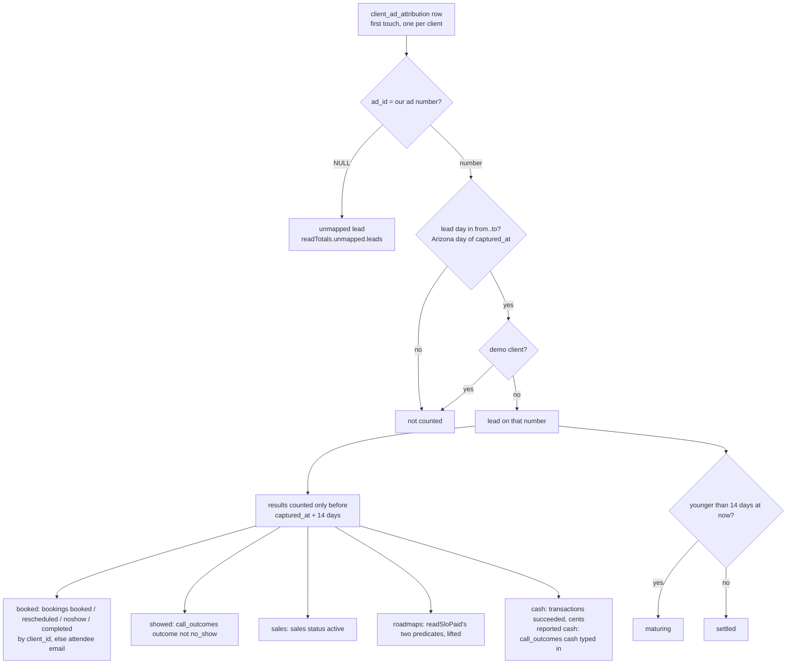
```mermaid
flowchart TD
  T[client_ad_attribution row<br/>first touch, one per client] --> N{ad_id = our ad number?}
  N -->|NULL| U[unmapped lead<br/>readTotals.unmapped.leads]
  N -->|number| D{lead day in from..to?<br/>Arizona day of captured_at}
  D -->|no| X[not counted]
  D -->|yes| C{demo client?}
  C -->|yes| X
  C -->|no| L[lead on that number]
  L --> W[results counted only before<br/>captured_at + 14 days]
  W --> B[booked: bookings booked / rescheduled / noshow / completed<br/>by client_id, else attendee email]
  W --> S[showed: call_outcomes outcome not no_show]
  W --> SA[sales: sales status active]
  W --> R[roadmaps: readSloPaid's two predicates, lifted]
  W --> M[cash: transactions succeeded, cents<br/>reported cash: call_outcomes cash typed in]
  L --> MA{younger than 14 days at now?}
  MA -->|yes| MT[maturing]
  MA -->|no| ST[settled]
```

How spend reaches a number, and how the two meet:

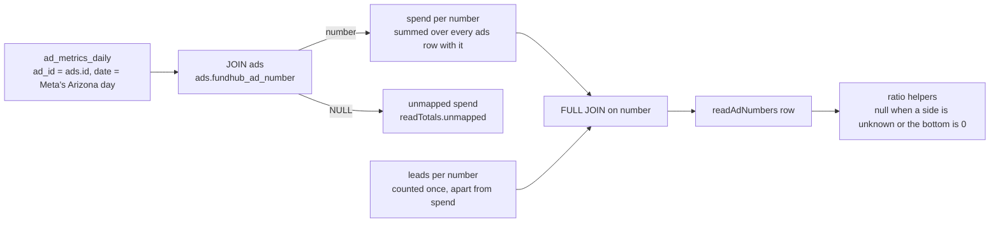
```mermaid
flowchart LR
  AM[ad_metrics_daily<br/>ad_id = ads.id, date = Meta's Arizona day] --> J[JOIN ads<br/>ads.fundhub_ad_number]
  J -->|number| SP[spend per number<br/>summed over every ads row with it]
  J -->|NULL| UM[unmapped spend<br/>readTotals.unmapped]
  SP --> F[FULL JOIN on number]
  LD[leads per number<br/>counted once, apart from spend] --> F
  F --> ROW[readAdNumbers row]
  ROW --> RT[ratio helpers<br/>null when a side is unknown or the bottom is 0]
```

Page events (`readFunnelEvents`): `events` named `funnel.*`, actor `person`, not
demo, by the event's Arizona day → ad number from the visit's own tags (leading
digits of `utm_content`, else the 407 Meta match) → funnel and step from
`src/funnel/pages.mjs`.

Gaps between the spec and the live data (recorded, not fixed) are listed in
`docs/marketing/metrics.md` under "Measured gaps": bookings has 0 rows while 74
`booking.created` events carry no client; call_outcomes has 0 rows; cash here is
transactions while `adAttributionRollup` counts payment links; "25% hold" is not
ad-spine's `hold_rate`; 2-second plays are stored on 0 of 69 ad-days.

## NOT BUILT (on this branch)

- The page `public/app/marketing-command-center.*` (workflow M11).
- Running a flywheel stage from the page (slice 2). The flywheel rows are read only.
- The offer generator (workflow M12).

## U01 API contract for every marketing/* route

Added 2026-10-05 by plan unit U01. This adds no step, state, route or screen. It writes down the
request and answer shape of every `marketing/*` route in spec v3 (M1 to M8), plus
`POST marketing/jobs/retry` and the `resume_ad` action on `campaigns/write`, so the back-end units
and the screens build to one shape.

- Doc: `docs/specs/marketing-machine-api.md` (46 routes).
- Twin: `src/marketing/api-contract.mjs` (`CONTRACT`, `assertMatchesContract`, `exampleResponse`).
- Test: `src/marketing/api-contract.test.mjs` fails when the doc and the module drift apart.

What is in the code today, traced through `ROUTES` in `netlify/functions/api.mjs`:

| Routes | Owner | In ROUTES today |
|---|---|---|
| `GET marketing/today` | existing; U32 adds keys | yes (existing keys only; the M5 keys are UNVERIFIED until U32 lands) |
| `POST campaigns/write` | existing; U15 adds `resume_ad` | yes (pause, resume, update_budget only; `resume_ad` is UNVERIFIED until U15 lands) |
| settings, funnels | U03 | no |
| scripts, script, approve, edit, reject, order | U25 | no |
| scripts/fix, ideas, batches, write-now, rules, jobs/retry | U26 | no |
| batches/next | U23 | no |
| health | U22 | no |
| angles, funnels/stats | U32 | no |
| ads, ad | U31 | no |
| meta/load, meta/load-status | U28 | no |
| shoot, shoot/mark, videos/*, video, map, pages/* | deferred | no |

Every route marked "no" is a shape only. Each owner unit adds its own flow section here when its
route lands. Gaps between the spec, the design doc and the fixed shapes are listed in the
contract's section 8.
## U03 Settings, funnels, and one save per press

Drawn from code on branch `mm-u03-settings-funnels`: `api/marketing/settings.mjs`,
`api/marketing/funnels.mjs`, `src/marketing/http.mjs`, `src/marketing/settings-store.mjs`,
`src/marketing/offer-facts.mjs`, migration `410_marketing_settings_funnels.sql`, seed
`297_marketing_funnels.sql`. Spec §6 Step 3, §7.8, §17. Owner and admin only on both
routes (requireAuth, then requireRole `ROLE_SETS.MARKETING`).

### Settings — `GET/POST /api/marketing/settings`

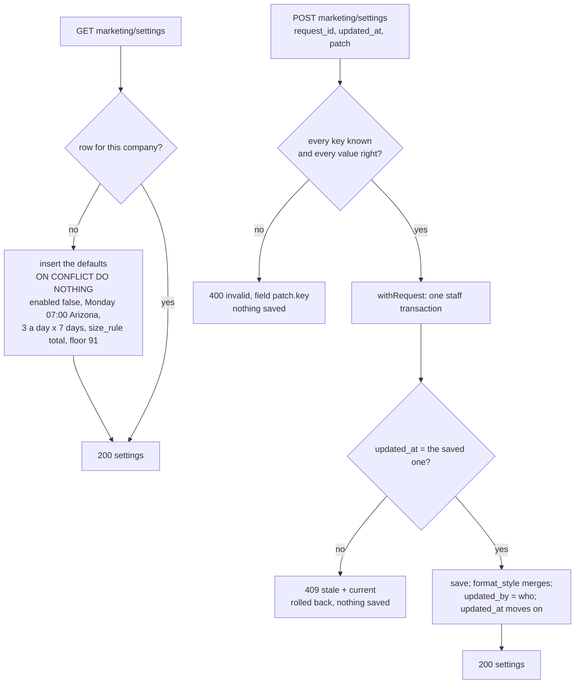
```mermaid
flowchart TD
  G[GET marketing/settings] --> G1{row for this company?}
  G1 -->|no| G2[insert the defaults<br/>ON CONFLICT DO NOTHING<br/>enabled false, Monday 07:00 Arizona,<br/>3 a day x 7 days, size_rule total, floor 91]
  G1 -->|yes| G3[200 settings]
  G2 --> G3
  P[POST marketing/settings<br/>request_id, updated_at, patch] --> V{every key known<br/>and every value right?}
  V -->|no| V1[400 invalid, field patch.key<br/>nothing saved]
  V -->|yes| W[withRequest: one staff transaction]
  W --> S{updated_at = the saved one?}
  S -->|no| S1[409 stale + current<br/>rolled back, nothing saved]
  S -->|yes| S2[save; format_style merges;<br/>updated_by = who; updated_at moves on]
  S2 --> R[200 settings]
```

- `enabled` goes true only when the patch says so — Chris's tap in Settings. No seed
  or migration sets it.
- Times are `HH:MM`. Money caps are whole dollars (model bills only).

### Funnels — `GET/POST /api/marketing/funnels`

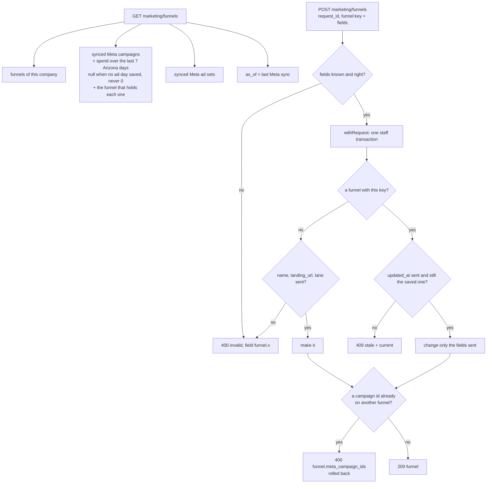
```mermaid
flowchart TD
  G[GET marketing/funnels] --> F[funnels of this company]
  G --> C[synced Meta campaigns<br/>+ spend over the last 7 Arizona days<br/>null when no ad-day saved, never 0<br/>+ the funnel that holds each one]
  G --> A[synced Meta ad sets]
  G --> T[as_of = last Meta sync]
  P[POST marketing/funnels<br/>request_id, funnel:key + fields] --> V{fields known and right?}
  V -->|no| V1[400 invalid, field funnel.x]
  V -->|yes| W[withRequest: one staff transaction]
  W --> K{a funnel with this key?}
  K -->|no| N{name, landing_url, lane sent?}
  N -->|no| V1
  N -->|yes| M[make it]
  K -->|yes| U{updated_at sent and still the saved one?}
  U -->|no| S1[409 stale + current]
  U -->|yes| X[change only the fields sent]
  M --> D{a campaign id already<br/>on another funnel?}
  X --> D
  D -->|yes| V2[400 funnel.meta_campaign_ids<br/>rolled back]
  D -->|no| R[200 funnel]
```

- Seed 297 makes `book_call` (https://apply.fundhub.ai/watch, lane sorting, book a call,
  offer `funding_dfy`, mix standard 2 : sorting 1) and `roadmap_147`
  (https://apply.fundhub.ai/roadmap, lane uwiq, offer `slo_roadmap`, mix standard 1) in the
  default company, once. `meta_campaign_ids` stay empty until Chris maps them.
- `offerFacts(offer_key)` reads each price from `src/slo/offer.mjs` or
  `src/config/offers.mjs`. No price is typed in `src/marketing/`.

### One save per press — `withRequest` (every marketing write)

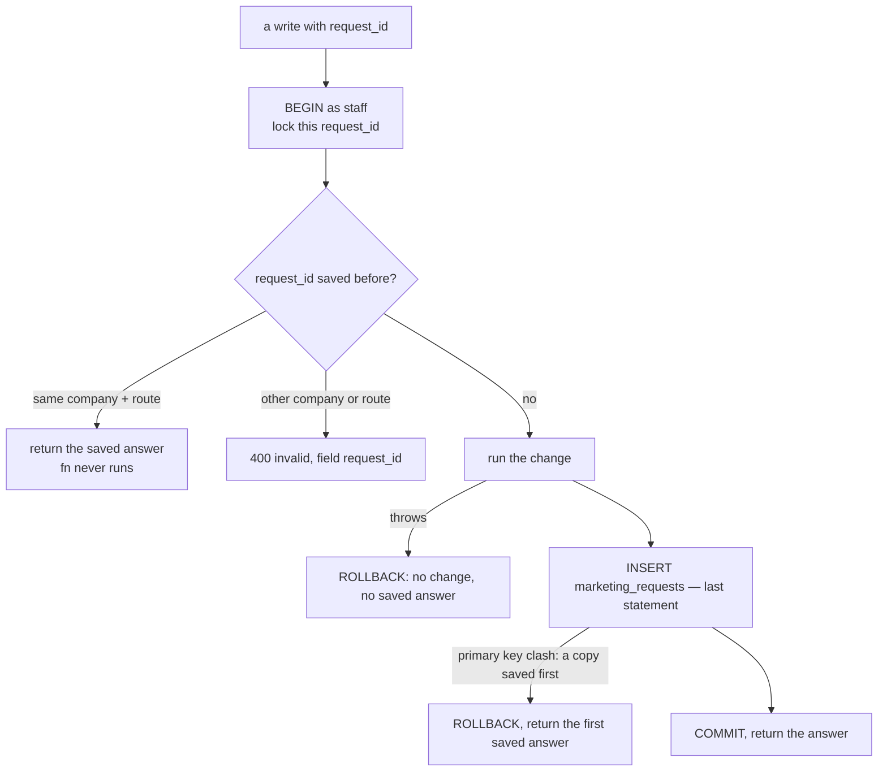
```mermaid
flowchart TD
  Q[a write with request_id] --> L[BEGIN as staff<br/>lock this request_id]
  L --> F{request_id saved before?}
  F -->|same company + route| A[return the saved answer<br/>fn never runs]
  F -->|other company or route| B[400 invalid, field request_id]
  F -->|no| R[run the change]
  R -->|throws| X[ROLLBACK: no change, no saved answer]
  R --> I[INSERT marketing_requests — last statement]
  I -->|primary key clash: a copy saved first| Y[ROLLBACK, return the first saved answer]
  I --> C[COMMIT, return the answer]
```

### Gaps between the spec and this code (findings, not reconciled)

- **Roadmap lane.** The spec seeds `roadmap_147` with lane `uwiq`; live roadmap visitors
  read lane `slo` (406/407). The seed uses the spec value until Chris answers the yes/no
  on the board. Numbers (M5) group by funnel, not lane.
- **offer_key values** (`funding_dfy`, `slo_roadmap`) are plan-chosen; the spec names the
  column, not the values.
- **One funnel per campaign.** The code refuses a Meta campaign that is already on another
  funnel of the same company, so a campaign's spend cannot count twice. The spec does not
  say this either way.
- **UNVERIFIED in a real database on this Mac** (no Postgres here): the SQL is proved by
  `src/http/marketing-settings.pg.test.mjs` and `marketing-funnels.pg.test.mjs` in GitHub CI.
## U04 Jobs, buzzes, model cost and shoots — the records (migration 411)

Drawn 2026-10-05 from the code on branch `mm-u04-jobs-buzzes-usage`:
`src/marketing/jobs.mjs`, `src/marketing/job-kinds.mjs`, `src/marketing/notify.mjs`,
`src/marketing/model-usage.mjs`, `db/migrations/411_marketing_buzzes_usage_shoots.sql`.
These are libraries and tables only. **No route, clock or worker calls them yet**: the
worker that claims jobs and sends buzzes is U22, the Retry button's route is U26, the
writer that logs model cost is U24. Those calls are marked UNVERIFIED below.

### A queued job (marketing_jobs, table from 409; claim index from 411)

`attempts` counts runs that went wrong (a failure, or a claim nobody finished). Claiming
and requeueing do not count. Kind `offer` is never touched by any of this: it runs on the
Write offer path above (`src/marketing/offer-store.mjs`).

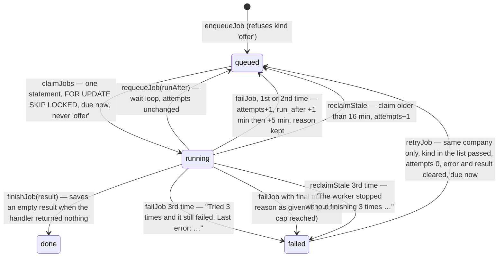
```mermaid
stateDiagram-v2
  [*] --> queued: enqueueJob (refuses kind 'offer')
  queued --> running: claimJobs — one statement, FOR UPDATE SKIP LOCKED, due now, never 'offer'
  running --> done: finishJob(result) — saves an empty result when the handler returned nothing
  running --> queued: requeueJob(runAfter) — wait loop, attempts unchanged
  running --> queued: failJob, 1st or 2nd time — attempts+1, run_after +1 min then +5 min, reason kept
  running --> failed: failJob 3rd time — "Tried 3 times and it still failed. Last error: …"
  running --> failed: failJob with final true — reason as given (e.g. cost cap reached)
  running --> queued: reclaimStale — claim older than 16 min, attempts+1
  running --> failed: reclaimStale 3rd time — "The worker stopped without finishing 3 times …"
  failed --> queued: retryJob — same company only, kind in the list passed, attempts 0, error and result cleared, due now
```

- `nextRunAfter({kinds})` reads the earliest queued `run_after` (never `offer`), so the
  worker can wait inside its pass for a job due in a few seconds. UNVERIFIED: no worker yet (U22).
- `JOB_KINDS` (`src/marketing/job-kinds.mjs`) is **empty**. A kind not in it is never
  claimed by the worker and cannot be retried from the screen. U24, U28 and U35 add kinds.
- Retry button → `POST marketing/jobs/retry` → `retryJob`: UNVERIFIED, the route is U26.

### A buzz (marketing_buzzes, 411)

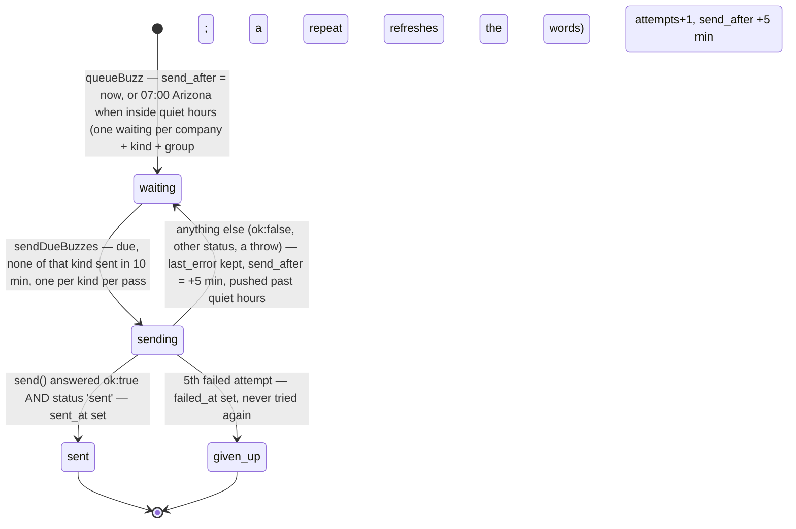
```mermaid
stateDiagram-v2
  [*] --> waiting: queueBuzz — send_after = now, or 07:00 Arizona when inside quiet hours (one waiting per company + kind + group; a repeat refreshes the words)
  waiting --> sending: sendDueBuzzes — due, none of that kind sent in 10 min, one per kind per pass; lease: attempts+1, send_after +5 min
  sending --> sent: send() answered ok:true AND status 'sent' — sent_at set
  sending --> waiting: anything else (ok:false, other status, a throw) — last_error kept, send_after = +5 min, pushed past quiet hours
  sending --> given_up: 5th failed attempt — failed_at set, never tried again
  sent --> [*]
  given_up --> [*]
```

- `send()` is always passed in. The worker will pass notify-fanout's `send`
  (`src/ad-videos/notify-fanout.mjs`); tests pass a fake. UNVERIFIED: no worker yet (U22).
- Which events buzz (scripts ready, videos ready, stuck) is decided by the callers
  (U24, U35, M3). UNVERIFIED: none of them call `queueBuzz` yet.

### Model cost (marketing_model_usage, 411)

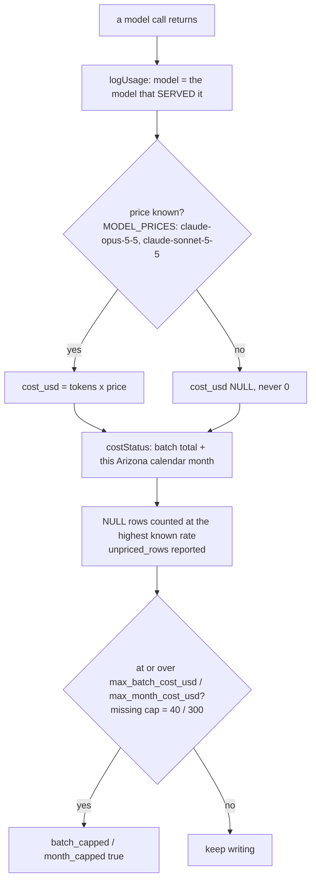
```mermaid
flowchart TD
  C[a model call returns] --> L[logUsage: model = the model that SERVED it]
  L --> P{price known?<br/>MODEL_PRICES: claude-opus-5-5, claude-sonnet-5-5}
  P -->|yes| R1[cost_usd = tokens x price]
  P -->|no| R2[cost_usd NULL, never 0]
  R1 & R2 --> S[costStatus: batch total + this Arizona calendar month]
  S --> W[NULL rows counted at the highest known rate<br/>unpriced_rows reported]
  W --> K{at or over max_batch_cost_usd / max_month_cost_usd?<br/>missing cap = 40 / 300}
  K -->|yes| X[batch_capped / month_capped true]
  K -->|no| Y[keep writing]
```

UNVERIFIED: the writer that logs every call and stops at a cap is U24; Write now's refusal is U26.

### A shoot (marketing_shoots, 411)

Table only. States `planned | filming | uploaded | done`, enforced by the database; a done
shoot must have `finished_at`. Nothing reads or writes it yet (Shoot Day routes and screen
are later units). UNVERIFIED.

### Gaps between the spec and this code (findings, not reconciled)

- Spec §6 Step 3 lists `marketing_buzzes` without `attempts`, `last_error`, `failed_at`;
  the plan added them because notify-fanout's `send()` resolves `{ok:false}` instead of
  throwing. Built as the plan says.
- Spec §6 Step 4 says "After 3 attempts, a job fails". Here an attempt is a run that went
  wrong, not a claim, so wait loops (requeue) never use up tries.
- `group_key` is `NOT NULL DEFAULT ''` (spec lists it with no type) so "one waiting per
  group" also holds when no group is given.
## U05 M0 step 2: repo outbox (412), GitHub client provider, path allow-list, edit ops, lease-based drain (pooler-safe), worker wake

Drawn 2026-10-05 from the code on branch `mm-u05-repo-outbox`: `src/repo/outbox.mjs`,
`src/repo/allow-list.mjs`, `src/repo/edit-ops.mjs`, `src/messaging/providers/github-repo.mjs`,
`src/marketing/wake.mjs`, `db/migrations/412_repo_outbox.sql`. Spec §6 Step 2 and §2 item 8
("every save goes to the database and the repo").

**Nothing calls this yet.** The save routes (U25, U26, U35) call `enqueueRepoWrite` and
`wakeWorker`; the worker (U22) calls `drainOutbox` at most once a minute. Those boxes are
marked **NOT BUILT** below. Live commits also need `GITHUB_REPO_TOKEN` (only Chris can make it,
spec §16) and `MARKETING_WORKER_SECRET`; neither is set by this unit.

### A save, from the app to the repo

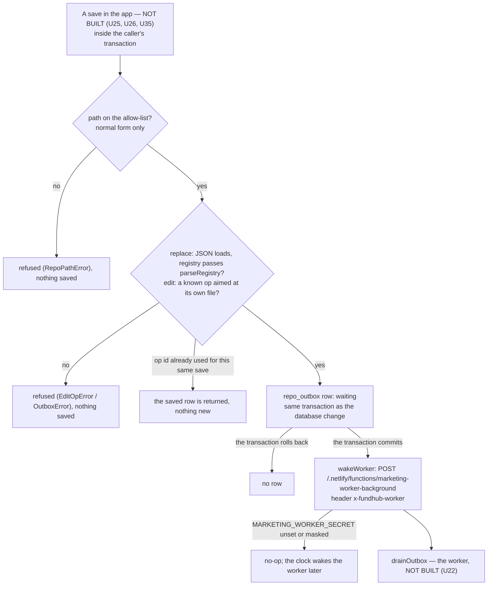
```mermaid
flowchart TD
  S["A save in the app — NOT BUILT (U25, U26, U35)<br/>inside the caller's transaction"] --> P{"path on the allow-list?<br/>normal form only"}
  P -->|no| P1["refused (RepoPathError), nothing saved"]
  P -->|yes| V{"replace: JSON loads, registry passes parseRegistry?<br/>edit: a known op aimed at its own file?"}
  V -->|no| V1["refused (EditOpError / OutboxError), nothing saved"]
  V -->|"op id already used for this same save"| V2["the saved row is returned, nothing new"]
  V -->|yes| E["repo_outbox row: waiting<br/>same transaction as the database change"]
  E -->|"the transaction rolls back"| X["no row"]
  E -->|"the transaction commits"| W["wakeWorker: POST /.netlify/functions/marketing-worker-background<br/>header x-fundhub-worker"]
  W -->|"MARKETING_WORKER_SECRET unset or masked"| W1["no-op; the clock wakes the worker later"]
  W --> D["drainOutbox — the worker, NOT BUILT (U22)"]
```

### One drain pass (`drainOutbox`)

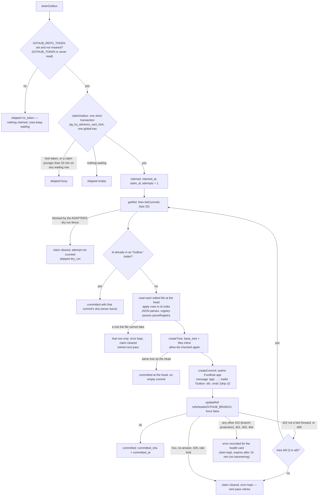
```mermaid
flowchart TD
  D["drainOutbox"] --> T{"GITHUB_REPO_TOKEN set and not masked?<br/>(GITHUB_TOKEN is never read)"}
  T -->|no| T1["skipped no_token — nothing claimed, rows keep waiting"]
  T -->|yes| C{"claimOutbox: one short transaction<br/>pg_try_advisory_xact_lock, one global key"}
  C -->|"lock taken, or a claim younger than 10 min on any waiting row"| C1["skipped busy"]
  C -->|"nothing waiting"| C2["skipped empty"]
  C -->|yes| CL["claimed: claimed_at, claim_id, attempts + 1"]
  CL --> G["getRef, then listCommits (last 20)"]
  G -->|"blocked by the ADAPTERS dry-run fence"| H["claim cleared, attempt not counted<br/>skipped dry_run"]
  G --> TR{"id already in an 'Outbox:' trailer?"}
  TR -->|yes| DONE1["committed with that commit's sha (never twice)"]
  TR -->|no| A["read each edited file at the head<br/>apply rows in id order<br/>JSON parses, registry passes parseRegistry"]
  A -->|"a row the file cannot take"| R["that row only: error kept, claim cleared<br/>retried next pass"]
  A --> TREE["createTree: base_tree + files inline<br/>allow-list checked again"]
  TREE -->|"same tree as the head"| DONE2["committed at the head, no empty commit"]
  TREE --> CM["createCommit: author Fundhub app<br/>message 'app: …', trailer 'Outbox: ids', ends '[skip ci]'"]
  CM --> U["updateRef refs/heads/GITHUB_BRANCH, force false"]
  U -->|ok| DONE3["committed: committed_sha + committed_at"]
  U -->|"422 not a fast forward, or 409"| G2{"tries left (3 in all)?"}
  G2 -->|yes| G
  G2 -->|no| RT["claim cleared, error kept — next pass retries"]
  U -->|"5xx, no answer, 429, rate limit"| RT
  U -->|"any other 422 (branch protection), 401, 403, 404"| ER["error recorded for the health card<br/>claim kept, expires after 10 min (no hammering)"]
```

- No lock and no transaction is held across any GitHub call. A drain whose lease was taken
  over writes nothing: every update is limited to rows that still carry its `claim_id`.
- The health card that shows `error` and the dry-run hold is U22 — **NOT BUILT**.
- Fallback reads: `netlify.toml` now bundles RULES.md, VOICE.md, RECIPES.md, angles.json,
  banned-live.json, registry.json and `marketing/broll/catalog.json` with every function. The
  code that falls back to them is in the readers (U24, U26) — **NOT BUILT**.

### Gaps between the spec and this code (findings, not reconciled)

- Spec §6 Step 2 says the drain "takes `pg_try_advisory_lock`". Built instead as
  `pg_try_advisory_xact_lock` plus a 10-minute lease, per the plan's critique fix B1: a session
  lock leaks on the Supabase transaction pooler.
- Spec §6 Step 2 cites `parseRegistry` at `src/ads/registry.mjs:108`; it is at :118 today.
- A save that does not fit its file (for example an edit to a Part 0 rule number that is not
  there) is retried every pass with its reason on the row. There is no "gave up" state; the
  spec names none.
- `docs/journeys/marketing-machine-intended.md` is not on main, so this was checked against
  the spec text, not the intended journey.
## U06 M0 step 4 model client: callModel provider 'anthropic'

Drawn 2026-10-05 from `src/agents/model.mjs` (`callModel` → `callAnthropicForced`)
on branch `mm-u06-anthropic-model-client`. Spec §6 step 4 "The model client" and
§4 trap 8. No screen. Nothing calls this path yet; the writer (U24) is its first
user.

What it does, in plain words:

- `callModel({ provider: 'anthropic', ... })` only ever calls
  `api.anthropic.com`. An OpenAI key in the same env is ignored.
- Without `provider`, `callModel` is the same code as before (OpenAI first, then
  Anthropic). A test pins the old Anthropic request body byte for byte.
- A missing key, a masked key (it holds `*`), a forced tool choice (`'any'` or a
  named tool), a non-Claude model name or a bad option is refused before
  anything is sent. The error starts `not sent:`.
- Every request carries `output_config.effort` (default `medium`), a timer
  (default 10 minutes) that aborts the request, and `max_tokens` (default 16000,
  because thinking counts toward it). It never carries `thinking`,
  `temperature`, `top_p`, `top_k` or `budget_tokens`.
- `cache: true` sends the system prompt as one block marked
  `cache_control: ephemeral`.
- `outputSchema` goes out as `output_config.format` (`json_schema`); the parsed
  reply comes back as `json`, or the error `no_json`.
- `tools` go out with `strict: true`, `additionalProperties: false` and a
  `required` list on every object. The first `tool_use` input comes back as
  `toolInput`; no tool call (choice `auto`) is the error `no_tool_call`.
- On claude-opus-5-5, claude-opus-5, claude-sonnet-5-5 and claude-fable-5-1 it
  asks for `fallbacks: "default"` with the beta header
  `server-side-fallback-2026-07-01` unless `fallbacks: false`. `servedModel` is
  the model that answered.
- Every result has `usage` with input, output, cache-read and cache-write tokens.

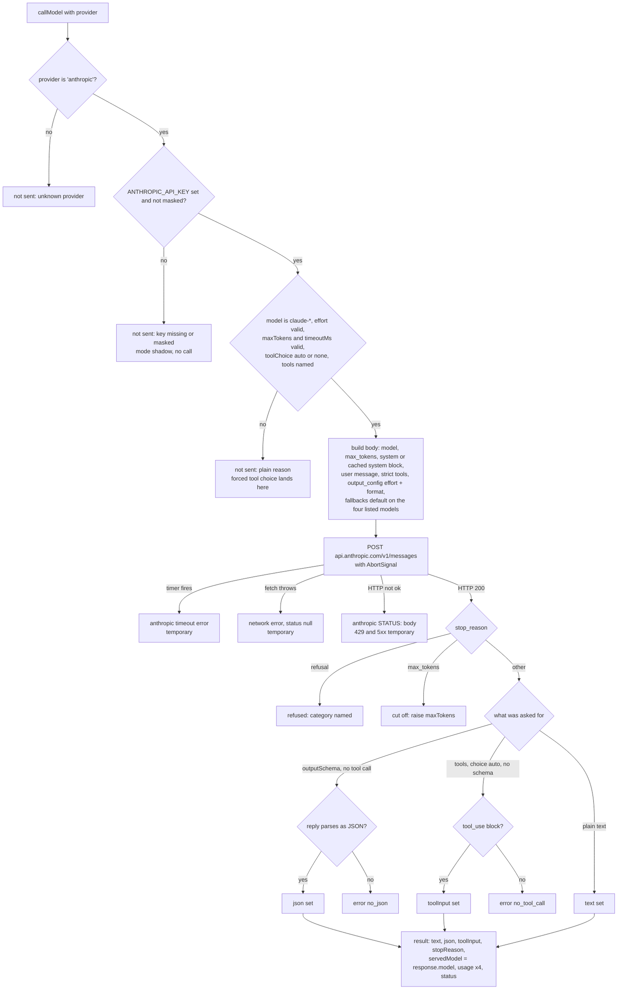
```mermaid
flowchart TD
  A[callModel with provider] --> P{provider is 'anthropic'?}
  P -->|no| N1[not sent: unknown provider]
  P -->|yes| K{ANTHROPIC_API_KEY set and not masked?}
  K -->|no| N2[not sent: key missing or masked<br/>mode shadow, no call]
  K -->|yes| V{model is claude-*, effort valid,<br/>maxTokens and timeoutMs valid,<br/>toolChoice auto or none, tools named}
  V -->|no| N3[not sent: plain reason<br/>forced tool choice lands here]
  V -->|yes| B[build body: model, max_tokens, system or cached system block,<br/>user message, strict tools, output_config effort + format,<br/>fallbacks default on the four listed models]
  B --> S[POST api.anthropic.com/v1/messages<br/>with AbortSignal]
  S -->|timer fires| T[anthropic timeout error<br/>temporary]
  S -->|fetch throws| U[network error, status null<br/>temporary]
  S -->|HTTP not ok| H[anthropic STATUS: body<br/>429 and 5xx temporary]
  S -->|HTTP 200| R{stop_reason}
  R -->|refusal| RF[refused: category named]
  R -->|max_tokens| MT[cut off: raise maxTokens]
  R -->|other| C{what was asked for}
  C -->|outputSchema, no tool call| J{reply parses as JSON?}
  J -->|yes| OK1[json set]
  J -->|no| NJ[error no_json]
  C -->|tools, choice auto, no schema| TU{tool_use block?}
  TU -->|yes| OK2[toolInput set]
  TU -->|no| NT[error no_tool_call]
  C -->|plain text| OK3[text set]
  OK1 --> Z[result: text, json, toolInput, stopReason,<br/>servedModel = response.model, usage x4, status]
  OK2 --> Z
  OK3 --> Z
```

UNVERIFIED: that Anthropic accepts this exact request shape. Fake-fetch tests
prove what is sent, not that the vendor takes it. The orchestrator's one small
live call after the ship is the proof (a 400 means the shape is wrong).

Gaps against the spec (findings, not reconciled):

- Spec §6 step 4 lists `tools` and `toolChoice`, and §7.6 speaks of a forced
  `save_script` tool. Forced tool use is HTTP 400 on claude-opus-5-5 and
  claude-sonnet-5-5 (claude-api skill), so only `auto` and `none` are accepted
  and the writer gets `outputSchema` instead.
- The spec names no default model, `maxTokens`, timeout or effort for this
  path. The defaults above come from the claude-api skill.
## U08 Ship stays in step with GitHub (spec M0 step 8)

Drawn 2026-10-05 from `scripts/ship.mjs`, `scripts/ship-machine-paths.mjs`,
`scripts/netlify-ignore-machine-only.mjs` and the `[build] ignore` line in
`netlify.toml`, on branch `mm-u08-ship-pull-push`. Ops only, no screen.

Machine-only folders (one list, `MACHINE_ONLY_PATHS`, read by both ship and the
Netlify skip rule): `marketing/ads/scripts/machine/`, `marketing/ads/ideas/`,
`marketing/ads/videos/`, `marketing/brain/`, `ops/page-requests/`. Rule, voice and
registry files (`marketing/ads/RULES.md`, `VOICE.md`, `registry.json`,
`banned-live.json`, `angles.json`) are not on it, so they still ship.

### `npm run ship`

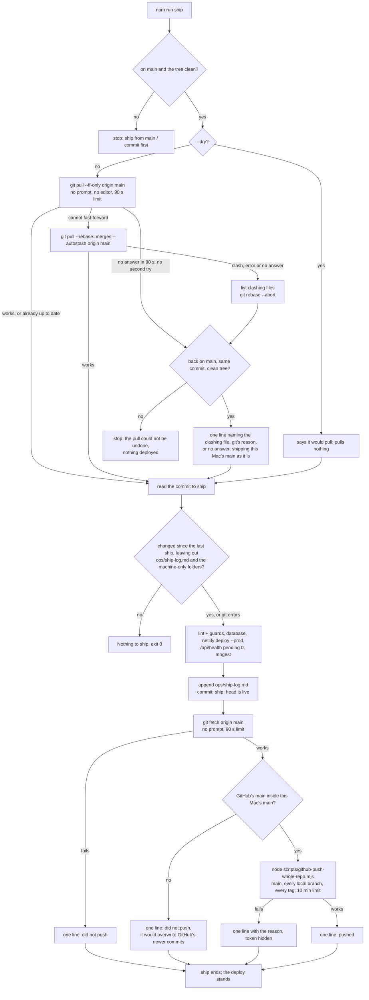
```mermaid
flowchart TD
  S[npm run ship] --> B{on main and the tree clean?}
  B -->|no| X1[stop: ship from main / commit first]
  B -->|yes| D{--dry?}
  D -->|yes| P0[says it would pull; pulls nothing]
  D -->|no| P1[git pull --ff-only origin main<br/>no prompt, no editor, 90 s limit]
  P1 -->|works, or already up to date| H
  P1 -->|no answer in 90 s: no second try| R
  P1 -->|cannot fast-forward| P2[git pull --rebase=merges --autostash origin main]
  P2 -->|works| H
  P2 -->|clash, error or no answer| A[list clashing files<br/>git rebase --abort]
  A --> R{back on main, same commit, clean tree?}
  R -->|yes| L2[one line naming the clashing file, git's reason,<br/>or no answer: shipping this Mac's main as it is] --> H
  R -->|no| X2[stop: the pull could not be undone,<br/>nothing deployed]
  P0 --> H
  H[read the commit to ship] --> K{changed since the last ship, leaving out<br/>ops/ship-log.md and the machine-only folders?}
  K -->|no| N[Nothing to ship, exit 0]
  K -->|yes, or git errors| C[lint + guards, database, netlify deploy --prod,<br/>/api/health pending 0, Inngest]
  C --> LOG[append ops/ship-log.md<br/>commit: ship: head is live]
  LOG --> F[git fetch origin main<br/>no prompt, 90 s limit]
  F -->|fails| Q1[one line: did not push]
  F -->|works| I{GitHub's main inside this Mac's main?}
  I -->|no| Q2[one line: did not push,<br/>it would overwrite GitHub's newer commits]
  I -->|yes| PUSH[node scripts/github-push-whole-repo.mjs<br/>main, every local branch, every tag; 10 min limit]
  PUSH -->|works| OK[one line: pushed]
  PUSH -->|fails| Q3[one line with the reason, token hidden]
  Q1 & Q2 & Q3 & OK --> E[ship ends; the deploy stands]
```

- A failed pull never stops the ship. The only stop in the pull step is a folder left
  half way through a pull, because deploying it would ship a broken tree.
- The push runs only after the ship-log commit. Nothing after it can stop the ship or
  undo the deploy.
- Why the push is checked first: `github-push-whole-repo.mjs` leases `main` on the copy
  it fetches a moment before, so on its own it would overwrite GitHub commits this Mac
  does not have (the outbox's saves). Ship pushes only when GitHub's main is already
  inside this Mac's main; the next ship pulls first.
- A rebase copies this Mac's local commits, including the commits of branches merged
  locally since the last push. The merge commits stay merges, but the old branch tips
  are no longer inside `main` afterwards.

### Netlify build started by a GitHub push

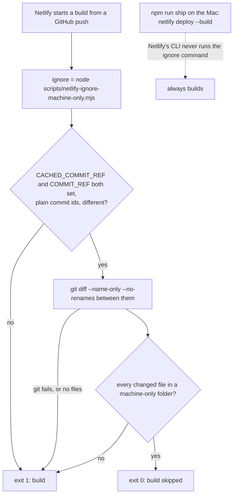
```mermaid
flowchart TD
  G[Netlify starts a build from a GitHub push] --> IG[ignore = node scripts/netlify-ignore-machine-only.mjs]
  IG --> E1{CACHED_COMMIT_REF and COMMIT_REF both set,<br/>plain commit ids, different?}
  E1 -->|no| BUILD[exit 1: build]
  E1 -->|yes| DF[git diff --name-only --no-renames between them]
  DF -->|git fails, or no files| BUILD
  DF --> M{every changed file in a machine-only folder?}
  M -->|no| BUILD
  M -->|yes| SKIP[exit 0: build skipped]
  LAP[npm run ship on the Mac:<br/>netlify deploy --build] -.->|Netlify's CLI never runs the ignore command| ALWAYS[always builds]
```

- A commit that changes only `ops/ship-log.md` is "nothing to ship" for `npm run ship`
  but builds on Netlify (the skip list is the machine-only folders only).
- **UNVERIFIED:** whether the live site still starts builds from GitHub pushes at all
  (repo link, stop_builds). This unit did not read the site's build settings; the
  orchestrator's precondition records them.
- **UNVERIFIED:** Netlify's own handling of the exit code (0 skips, 1 builds) is from
  Netlify's docs, not seen on a live build.

## U31 M5 11.2 part 1: GET marketing/ads and GET marketing/ad?n=

Drawn from code on branch `mm-u31-ads-routes`: `api/marketing/ads.mjs`,
`api/marketing/ad.mjs`, the readers in `src/marketing/metrics.mjs` (U20) and
`readLastSync` in `api/marketing/today.mjs`. Spec §11.2, §11.1, §11.3; shapes are
fixed shape 8 in `docs/specs/marketing-machine-api.md` §6.7. Read only: no row is
written, nothing is texted, Meta and models are not called. Owner and admin only
(requireAuth, then requireRole `ROLE_SETS.MARKETING`, then a company on the session).
Every query runs in one `asStaff()` transaction.

### The Ads view — `GET /api/marketing/ads?from&to&funnel&format&angle`

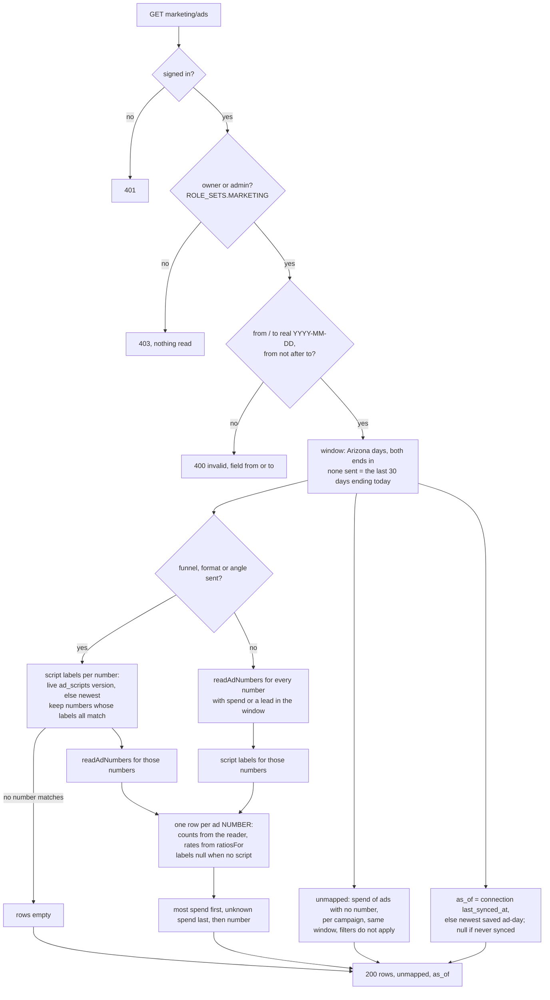
```mermaid
flowchart TD
  A[GET marketing/ads] --> B{signed in?}
  B -->|no| B1[401]
  B -->|yes| C{owner or admin?<br/>ROLE_SETS.MARKETING}
  C -->|no| C1[403, nothing read]
  C -->|yes| D{from / to real YYYY-MM-DD,<br/>from not after to?}
  D -->|no| D1[400 invalid, field from or to]
  D -->|yes| W[window: Arizona days, both ends in<br/>none sent = the last 30 days ending today]
  W --> F{funnel, format or angle sent?}
  F -->|yes| L[script labels per number:<br/>live ad_scripts version, else newest<br/>keep numbers whose labels all match]
  L -->|no number matches| E[rows empty]
  L --> R1[readAdNumbers for those numbers]
  F -->|no| R2[readAdNumbers for every number<br/>with spend or a lead in the window]
  R2 --> L2[script labels for those numbers]
  R1 & L2 --> ROW[one row per ad NUMBER:<br/>counts from the reader, rates from ratiosFor<br/>labels null when no script]
  ROW --> S[most spend first, unknown spend last, then number]
  W --> U[unmapped: spend of ads with no number,<br/>per campaign, same window, filters do not apply]
  W --> T[as_of = connection last_synced_at,<br/>else newest saved ad-day; null if never synced]
  S & E & U & T --> OK[200 rows, unmapped, as_of]
```

- Every number is U20's: `readAdNumbers` gives the counts and `ratiosFor` the rates.
  The route adds, divides and rounds nothing of its own.
- A row also carries the reader's raw counts after the contract keys: `ads`,
  `link_clicks`, `plays`, `ad_days`, `reported_days`, `maturing_leads`,
  `cash_unknown` (extra keys are allowed by the contract).
- Unknown stays `null`: spend of a number with leads but no ad-days, a rate whose
  bottom is 0 or never reported. `maturing` is true when a lead is under 14 days old.

### The drawer — `GET /api/marketing/ad?n=91`

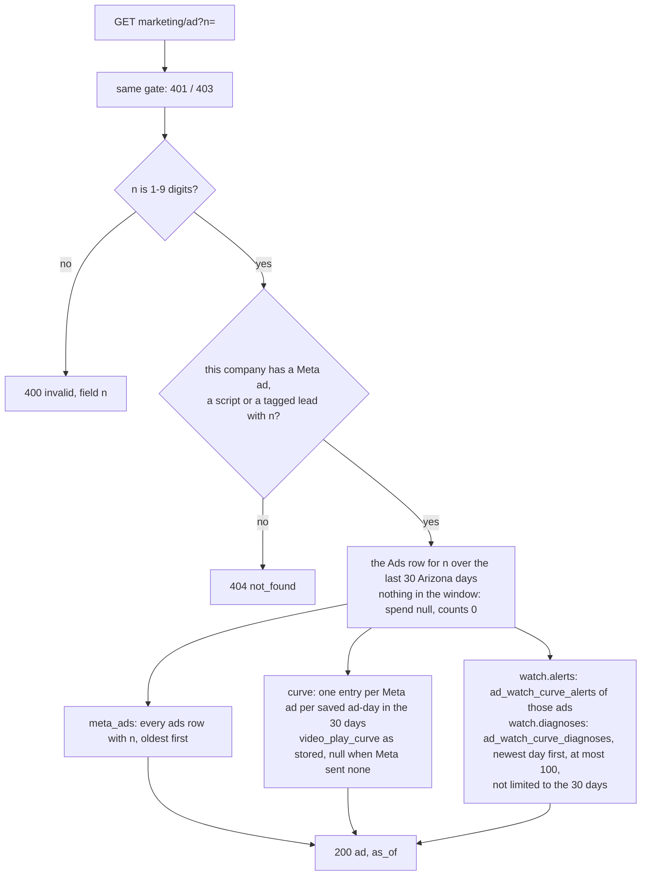
```mermaid
flowchart TD
  A[GET marketing/ad?n=] --> G[same gate: 401 / 403]
  G --> N{n is 1-9 digits?}
  N -->|no| N1[400 invalid, field n]
  N -->|yes| K{this company has a Meta ad,<br/>a script or a tagged lead with n?}
  K -->|no| K1[404 not_found]
  K -->|yes| R[the Ads row for n over the last 30 Arizona days<br/>nothing in the window: spend null, counts 0]
  R --> M[meta_ads: every ads row with n, oldest first]
  R --> CU[curve: one entry per Meta ad per saved ad-day in the 30 days<br/>video_play_curve as stored, null when Meta sent none]
  R --> WA[watch.alerts: ad_watch_curve_alerts of those ads<br/>watch.diagnoses: ad_watch_curve_diagnoses, newest day first, at most 100,<br/>not limited to the 30 days]
  M & CU & WA --> OK[200 ad, as_of]
```

- `watch` inner keys (U31 owns them): an alert is `{ad_id, dies_before_25_alerted_on,
  updated_at}`; a diagnosis is `{date, diagnosis, fix_type, film_note,
  next_take_improved, id, ad_id, created_at}`. `ad_id` is `ads.id` (the Meta ad row).
- Two Meta ads with one number keep two curves (each entry names its `ad_id`); they
  are never averaged.

### Fast with 30 days (spec M5 done 2)

`src/http/marketing-ads.pg.test.mjs` runs every read of both routes under
`EXPLAIN (ANALYZE)` on a 30-day fixture with seq scans turned off for that one
transaction, and fails if `ad_metrics_daily` or `client_ad_attribution` is read
without an index condition. The live timing of each route is taken after ship
(the orchestrator writes it on the board).

### Gaps between the spec, the design and this code (findings, not reconciled)

- **Design keys not built.** The design doc's Ads row (`ad_id`, `angle`, `hold_2s`,
  `sales_ours`, `sales_meta`, `cpb_cents`, `last_day`, `unknown_ad`) and drawer
  (`quartiles`, `diagnosis`, `script{hook, line2}`, `links`) differ from fixed
  shape 8; the contract wins. Meta's own purchase count, the last day an ad ran,
  the script's hook and line 2 and the unmapped lead count are not in these answers.
- **Funnel of a row comes from the script only.** U32's funnel roll-up falls back
  to `marketing_funnels.meta_campaign_ids`; this route does not, so a number with no
  script funnel reads `funnel_key` null here while its spend can count on Funnels.
- **Unmapped spend ignores funnel / format / angle.** Spend with no number has no
  script, so no label can match it.
- **No 10-play floor.** The design prints "unknown (fewer than 10 plays)" through
  `watchRate()`; U20's rates and this route have no floor.
- **`readLastSync` is not index-checked.** Its `max(synced_at)` reads the company's
  ad-days with no index that orders them; it is today's shared helper, not this unit's.
- **Lead days are not range-scanned.** U20's lead read finds the company's tagged
  leads by index, then keeps the window by Arizona day of `captured_at` (not sargable).
- **UNVERIFIED on this Mac** (no Postgres here): proved only by the pg test in GitHub CI.

## U32 M5 11.2 part 2: angles, funnel numbers, and the M5 keys on Today

Written 2026-10-06 from the code on branch `mm-u32-angles-funnel-stats`. Read only: nothing
here writes a row, calls Meta or calls a model. Code: `api/marketing/angles.mjs`,
`api/marketing/funnels/stats.mjs`, `api/marketing/today.mjs` (part 5),
`src/marketing/metrics-rollups.mjs`. The counting rules are U20's
(`src/marketing/metrics.mjs`); this unit only decides which funnel and which angle a number
belongs to, and adds the per-number results up.

Three routes, one gate (owner and admin, `ROLE_SETS.MARKETING`; the company from the
session):

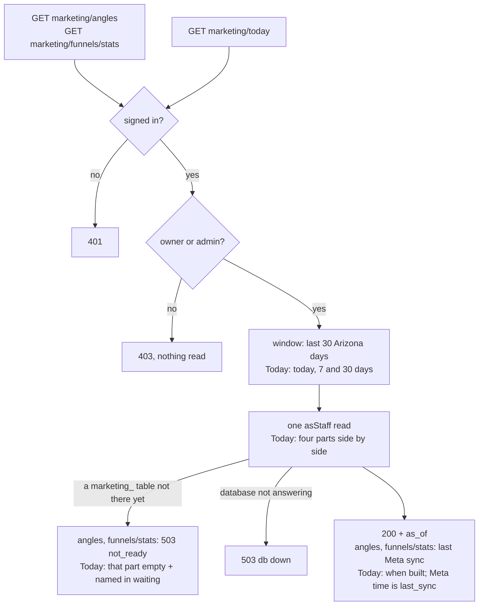
```mermaid
flowchart TD
  A[GET marketing/angles<br/>GET marketing/funnels/stats] --> B{signed in?}
  T[GET marketing/today] --> B
  B -->|no| B1[401]
  B -->|yes| C{owner or admin?}
  C -->|no| C1[403, nothing read]
  C -->|yes| W[window: last 30 Arizona days<br/>Today: today, 7 and 30 days]
  W --> R[one asStaff read<br/>Today: four parts side by side]
  R -->|a marketing_ table not there yet| NR[angles, funnels/stats: 503 not_ready<br/>Today: that part empty + named in waiting]
  R -->|database not answering| DD[503 db down]
  R --> OK[200 + as_of<br/>angles, funnels/stats: last Meta sync<br/>Today: when built; Meta time is last_sync]
```

Which funnel and which angle a number belongs to:

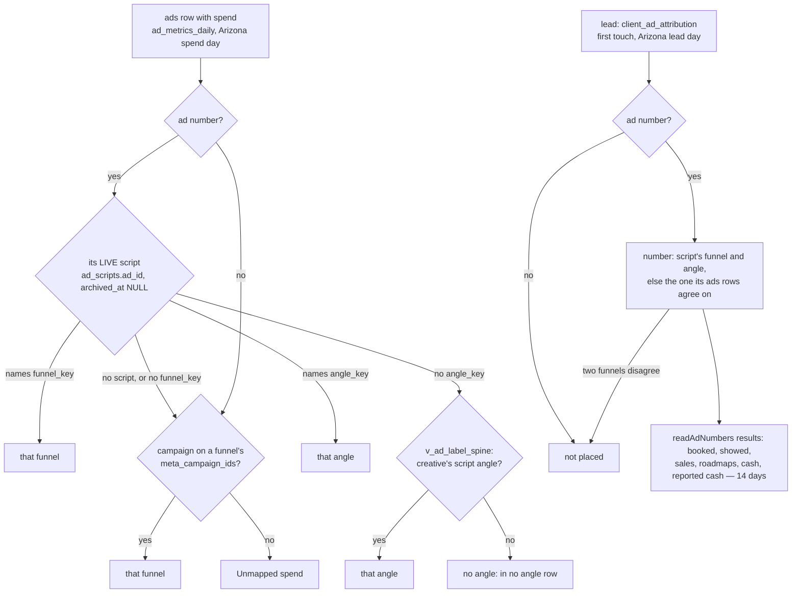
```mermaid
flowchart TD
  AD[ads row with spend<br/>ad_metrics_daily, Arizona spend day] --> N{ad number?}
  N -->|yes| S{its LIVE script<br/>ad_scripts.ad_id, archived_at NULL}
  S -->|names funnel_key| F1[that funnel]
  S -->|no script, or no funnel_key| CA{campaign on a funnel's<br/>meta_campaign_ids?}
  N -->|no| CA
  CA -->|yes| F2[that funnel]
  CA -->|no| UM[Unmapped spend]
  S -->|names angle_key| A1[that angle]
  S -->|no angle_key| SP{v_ad_label_spine:<br/>creative's script angle?}
  SP -->|yes| A2[that angle]
  SP -->|no| NA[no angle: in no angle row]
  L[lead: client_ad_attribution<br/>first touch, Arizona lead day] --> LN{ad number?}
  LN -->|no| LU[not placed]
  LN -->|yes| LS[number: script's funnel and angle,<br/>else the one its ads rows agree on]
  LS -->|two funnels disagree| LU
  LS --> RES[readAdNumbers results: booked, showed,<br/>sales, roadmaps, cash, reported cash — 14 days]
```

- **GET marketing/angles** → `{rows:[{angle_key, name, spend_cents, ads, leads, booked, sales,
  cash_cents, roas}], as_of}`. One row per angle with spend or leads in the window. `ads` =
  distinct ad numbers (an ads row with no number counts on its own). `name` from
  `marketing/ads/angles.json` (bundled through netlify.toml `included_files`); a key not in
  the file shows the key.
- **GET marketing/funnels/stats** → `{rows:[{funnel_key, name, spend_cents, page_views,
  click_to_page, page_to_lead, leads, booked, showed, sales, cash_cents, roas}],
  unmapped_spend_cents, as_of}`. Every active funnel plus any funnel spend or leads were placed
  on. `page_views` = `funnel.page` events from people on the funnel's landing page (its
  `landing_url` path; null when the tracker does not run on that page). `click_to_page` =
  page views ÷ the funnel's ads' link clicks; `page_to_lead` = leads ÷ page views.
- **GET marketing/today, added keys** (every old key unchanged): `numbers` (today / d7 / d30
  from `readTotals`), `daily` (30 days from `readDaily`), `spend_by_funnel` (7 days, with an
  Unmapped row), `flow` (7 days: landing page views, Meta link clicks, then `numbers.d7`'s
  leads, booked, showed, sales), `scripts_waiting` (released drafts and the machine's flagged
  ones), `stuck_jobs` (failed `marketing_jobs`, not `offer`, newest first, each with its id
  for Retry).
- **Unknown stays null.** Spend with no saved ad-day is null. A funnel with nothing placed is
  null while some spend is unmapped, and a known 0 only when all saved spend is placed. Cash
  over several numbers is null only when payments exist and none reported an amount.
- **Index proof.** Every query starts with a `-- m5:<name>` line;
  `src/http/marketing-funnels-stats.pg.test.mjs` runs EXPLAIN (ANALYZE) on each with sequential
  scans priced out and fails if `ad_metrics_daily`, `events`, `ad_scripts` or
  `marketing_jobs` is read without an index. `ad_spend` walks `ads` then
  `ad_metrics_daily (ad_id, date)`; `funnel_steps` walks `idx_events_name (org_id, name,
  created_at)` with constant Arizona-midnight bounds.

Gaps between the spec, the design and this code (recorded, not reconciled):

1. **Design vs contract shapes.** The design doc (`command-center-design-2026-10-05.md` §3.1,
   §3.7) draws `money{…, prior_30_days}`, `by_funnel`, `flow{page, pressed_buy, paid, booked}`,
   angles `{ok, angles[], suggestions[]}` and funnels `{ok, funnels[{key, flow{}, page_funnel{},
   clarity{}}]}`. This code builds the plan's fixed shapes 7 and 9
   (`docs/specs/marketing-machine-api.md`), which win per the plan. The design's per-angle
   "cost per lead, last run date, best and worst ad", the page funnel (pressed buy, paid) and
   Clarity rows are not in these answers.
2. **Two populations in one rate.** `page_views` counts every person on the landing page (ad
   or not); `leads` counts only leads tagged with an ad number that maps to the funnel. So
   `page_to_lead` understates while most leads carry no number (2 of 18 on 2026-10-06,
   `docs/marketing/metrics.md` gap 8).
3. **Flagged and visible rules are copied, not shared.** `scripts_waiting` repeats U25's
   visibility rule and `isFlagged` (`src/marketing/scripts-store.mjs`, not on main when this
   was written) in SQL. If either changes, this count must change with it.
4. **Angle names lag one ship.** Names come from the bundled `angles.json`; an angle added
   through the repo outbox shows its key until the next ship.
5. **UNVERIFIED:** the live timing of each route (spec M5 "under 2 seconds with 30 days of
   data"). The orchestrator records one live timing per route after ship.
