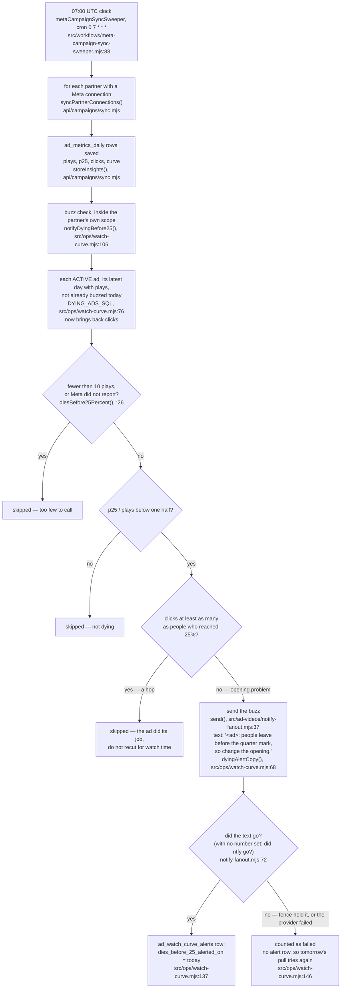

# Marketing night jobs flow — the dying-ad buzz, the next-take table, the ClickFunnels pull

Required by `CLAUDE.md` §3a step 4 and §4. Written 2026-10-05, traced from the code on
branch `m2-alerts-night-jobs`, not from the plan. Anything that could not be traced is
marked **UNVERIFIED**.

The rules these jobs follow are Meta's own words, in `marketing/ads/watch-curve.md`, the
law in `.claude/rules/ad-watch-curve.md`, and the playbook in
`marketing/ads/curve-optimization.md`.

---

## 1. The dying-ad buzz

Every morning at 07:00 UTC the Meta pull runs. At the end of each partner's pull, the
buzz check looks at every **running** ad's latest day. If most plays never reach the
quarter mark **and** people are not tapping through, Chris gets a text (and an ntfy push)
naming the ad and saying to change the opening. At most once per ad per day. It never
pauses an ad or changes a budget.

**What was broken until 2026-10-05.** The check called `notify.send`, but the file it
imported hands back the send function itself, so `notify.send` was empty. The first dying
running ad made it throw "send is not a function". The Meta pull catches that so the
numbers it saved are kept, and the Meta sweeper's run log does not copy the buzz result,
so nobody saw it. `ad_watch_curve_alerts` held 0 rows (live, read-only, 2026-10-05). The
query also left `clicks` out, so a hop (people left early because they tapped through)
could never be told apart from a broken opening.

| From | To | What fires it | Where | Works today? |
|---|---|---|---|---|
| nothing | a day of Meta numbers saved | the 07:00 UTC clock | `src/workflows/meta-campaign-sync-sweeper.mjs:88` | **yes** (last pull 2026-10-05 07:01 UTC) |
| a saved day | the buzz check | the end of the same partner's pull | `notifyDyingBefore25()`, `api/campaigns/sync.mjs` | **yes** |
| a dying running ad, not a hop | a text and a push to Chris | the check | `src/ops/watch-curve.mjs:106` → `src/ad-videos/notify-fanout.mjs:37` | **yes on this branch, after ship.** Proved offline with a fake transport only; no real text sent |
| a buzz that went | today's alert row | the buzz landing | `src/ops/watch-curve.mjs:137` | **yes on this branch** |
| a buzz that did not go | counted as `failed`, retried next morning | the buzz failing | `src/ops/watch-curve.mjs:146` | **yes on this branch** |

**Not visible yet.** The buzz result (`stats.watch_curve`) is returned by the pull but the
Meta sweeper's run log does not copy it (`src/workflows/meta-campaign-sync-sweeper.mjs:153-172`),
so a failed buzz still does not show in the Inngest run log. Left as a card on
`ops/workflows/perfect-machine-2026-10-05.md`.

**Today every ad reads PAUSED** (live, 2026-10-05), so the check finds no running ad and
sends nothing until an ad is turned back on.
