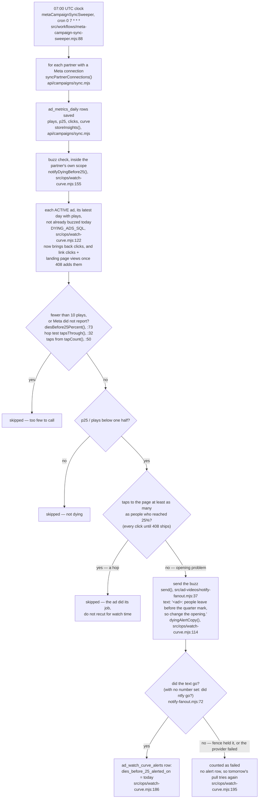
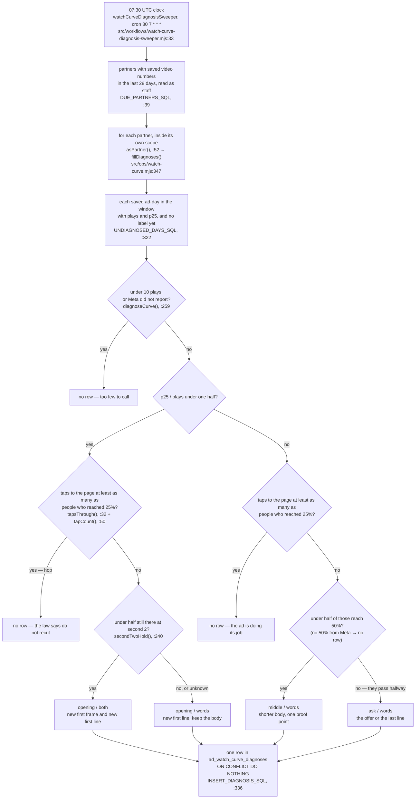
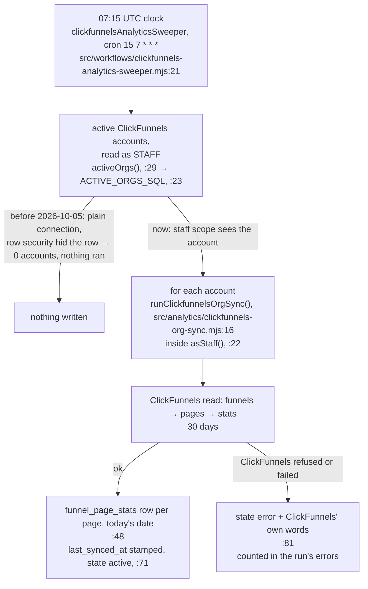
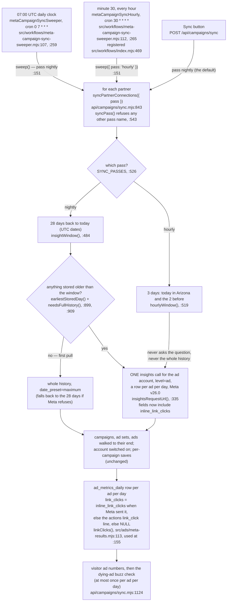

# Marketing night jobs flow — the dying-ad buzz, the next-take table, the ClickFunnels pull

Required by `CLAUDE.md` §3a step 4 and §4. Written 2026-10-05, traced from the code on
branch `m2-alerts-night-jobs`, not from the plan. Anything that could not be traced is
marked **UNVERIFIED**.

The rules these jobs follow are Meta's own words, in `marketing/ads/watch-curve.md`, the
law in `.claude/rules/ad-watch-curve.md`, and the playbook in
`marketing/ads/curve-optimization.md`.

---

## 1. The dying-ad buzz

Every morning at 07:00 UTC the Meta pull runs. At the end of each partner's pull, the
buzz check looks at every **running** ad's latest day. If most plays never reach the
quarter mark **and** people are not tapping through, Chris gets a text (and an ntfy push)
naming the ad and saying to change the opening. At most once per ad per day. It never
pauses an ad or changes a budget.

**What was broken until 2026-10-05.** The check called `notify.send`, but the file it
imported hands back the send function itself, so `notify.send` was empty. The first dying
running ad made it throw "send is not a function". The Meta pull catches that so the
numbers it saved are kept, and the Meta sweeper's run log does not copy the buzz result,
so nobody saw it. `ad_watch_curve_alerts` held 0 rows (live, read-only, 2026-10-05). The
query also left `clicks` out, so a hop (people left early because they tapped through)
could never be told apart from a broken opening.

| From | To | What fires it | Where | Works today? |
|---|---|---|---|---|
| nothing | a day of Meta numbers saved | the 07:00 UTC clock | `src/workflows/meta-campaign-sync-sweeper.mjs:88` | **yes** (last pull 2026-10-05 07:01 UTC) |
| a saved day | the buzz check | the end of the same partner's pull | `notifyDyingBefore25()`, `api/campaigns/sync.mjs` | **yes** |
| a dying running ad, not a hop | a text and a push to Chris | the check | `src/ops/watch-curve.mjs:155` → `src/ad-videos/notify-fanout.mjs:37` | **yes on this branch, after ship.** Proved offline with a fake transport only; no real text sent |
| a buzz that went | today's alert row | the buzz landing | `src/ops/watch-curve.mjs:186` | **yes on this branch** |
| a buzz that did not go | counted as `failed`, retried next morning | the buzz failing | `src/ops/watch-curve.mjs:195` | **yes on this branch** |

**Taps, 2026-10-05 (M4's tie-out card).** A hop is judged on taps to the page: the larger
of Meta's link clicks and landing page views, which M1's migration 408 adds. Before 408 ships
the row has no such column and the check uses every click, as before. Recorded example:
SLO4 on 2026-09-26 had 32 clicks but 17 landing page views for 22 people at the quarter
mark — a hop on every click, a broken opening on taps to the page.

**Not visible yet.** The buzz result (`stats.watch_curve`) is returned by the pull but the
Meta sweeper's run log does not copy it (`src/workflows/meta-campaign-sync-sweeper.mjs:153-172`),
so a failed buzz still does not show in the Inngest run log. Left as a card on
`ops/workflows/perfect-machine-2026-10-05.md`.

**Today every ad reads PAUSED** (live, 2026-10-05), so the check finds no running ad and
sends nothing until an ad is turned back on.

---

## 2. The "what to fix in the next take" table

Every morning at 07:30 UTC, half an hour after the Meta pull, a clock labels each saved
ad-day that has video numbers and no label yet. It writes one row per ad-day into
`ad_watch_curve_diagnoses`: where the watch curve broke (opening, middle or ask), the fix
type (words, visual or both) and a one- or two-sentence film note built from that day's
own numbers. It never overwrites a row, so a row Chris changed stays changed. It sends
nothing and changes no ad, campaign or budget.

**What was broken until 2026-10-05.** Nothing wrote the table. Migration 395 made it and
the playbook described it; it held 0 rows (live, read-only, 2026-10-05).

| From | To | What fires it | Where | Works today? |
|---|---|---|---|---|
| a saved ad-day with video numbers | a label: opening / middle / ask, fix type, film note | the 07:30 UTC clock | `src/workflows/watch-curve-diagnosis-sweeper.mjs:33` → `src/ops/watch-curve.mjs:347` | **yes on this branch, after ship.** Proved offline on all 36 recorded SLO days: 27 opening rows (19 both, 8 words), 8 hops and 1 too-few left alone |
| a hop, a too-few day, or an ad doing its job | no row | the same pass | `diagnoseCurve()`, `src/ops/watch-curve.mjs:259` | **yes on this branch** |
| a label Chris changed | kept | the next pass skips it | `ON CONFLICT DO NOTHING`, `src/ops/watch-curve.mjs:336` | **yes on this branch** |
| a label | `next_take_improved` true or false | a later take's curve | **not built** — stays NULL | **no** |

**Picks made without asking (written on the board):** "tapping through" is the larger of
Meta's link clicks and landing page views (M1's migration 408), read with `to_jsonb()` so the
query runs before 408 ships; until then (no such column on the row) it falls back to Meta's
every-click count. After 408, a day where Meta sent no link-click line counts as no taps
reported, so no hop is claimed. Fix type
is "both" only when under half are still watching at second 2, else "words"; middle and
ask are always "words".

---

## 3. The ClickFunnels night pull

Every morning at 07:15 UTC a clock pulls the last 30 days of page views and opt-ins for
every active ClickFunnels account into `funnel_page_stats`. It only reads from
ClickFunnels.

**What was broken from 2026-09-22 to 2026-10-05.** The clock asked for the active accounts
with a plain database connection. The accounts table is staff-only by row security
(`302_analytics_connections.sql`), so a plain connection sees zero rows. It is not an
error, just empty, so every pass was "0 accounts, nothing to do". Measured 2026-09-28:
plain sees 0, staff sees 1 (`ops/workflows/2026-09-28-landing-page-conversion.md:55-63`).
Live on 2026-10-05: `funnel_page_stats` holds rows only for 2026-09-22 and 2026-10-04,
both hand pulls. Now the list is read with the staff scope, the same one the per-account
pull and the Meta clock already use. No row security was loosened.

| From | To | What fires it | Where | Works today? |
|---|---|---|---|---|
| nothing | the list of active ClickFunnels accounts | the 07:15 UTC clock | `src/workflows/clickfunnels-analytics-sweeper.mjs:29` | **yes on this branch, after ship.** Proved offline with a fake pool that hides the row unless the transaction is stamped staff; the real-database proof runs in CI (`clickfunnels-analytics-sweeper.pg.test.mjs`) |
| an active account | a day of page numbers saved | the same pass | `src/analytics/clickfunnels-org-sync.mjs:48` | **yes** (the hand pull already used this path) |
| a failed pull | the account marked `error` | ClickFunnels refusing | `src/analytics/clickfunnels-org-sync.mjs:81` | **yes** — and the clock then skips that account until a hand pull sets it back to `active`. Left as a card on the board, not changed here |

---

## U07 Meta API v26.0, an hourly 3-day pull plus the nightly 28-day pull, link clicks source

Marketing machine M0 step 5 (`docs/specs/marketing-machine-2026-10-04.md`). Traced from the
code on branch `mm-u07-meta-v26-sync`, 2026-10-05. Not run against a database or live Meta:
the proof is unit tests with a fake transaction and a fake Meta
(`src/http/campaigns-sync-hourly.test.mjs`, `src/workflows/meta-campaign-sync-hourly.test.mjs`,
`src/http/meta-api-version.test.mjs`), plus CI.

**Two clocks now run the same pull.** The nightly one is unchanged. The new hourly one reads
only today in Arizona and the 2 days before it, and it never reads an account's whole history.
Everything after the numbers read is the same for both: the lists, the switch-on, the saves,
the visitor ad numbers and the dying-ad buzz (still at most once per ad per day).

| From | To | What fires it | Where | Works today? |
|---|---|---|---|---|
| nothing | today + 2 days of Meta numbers saved | minute 30 of every hour | `src/workflows/meta-campaign-sync-sweeper.mjs:265`, `api/campaigns/sync.mjs:519` | **UNVERIFIED** — unit-tested; live only after ship (Inngest picks up the new function then) |
| nothing | 28 days of Meta numbers saved | the 07:00 UTC clock | `src/workflows/meta-campaign-sync-sweeper.mjs:259` | **yes** (unchanged; last pull 2026-10-05 07:01 UTC on the old version) |
| an account with nothing older than 28 days stored | its whole history | the nightly clock or the Sync button only | `api/campaigns/sync.mjs:899-909` | **UNVERIFIED** — unit-tested; the hourly pass is proved never to ask |
| a Meta insights row | `ad_metrics_daily.link_clicks` | the same save | `src/ads/meta-results.mjs:113` | **UNVERIFIED** — unit-tested; no new column (408's `link_clicks`) |
| every Meta Graph call outside `src/adplatforms/meta.mjs` | v26.0, or `META_API_VERSION` when set | each call | `api/campaigns/sync.mjs:136`, `src/social/adapters.mjs:13`, `src/social/oauth.mjs:17`, `src/messaging/providers/meta-capi.mjs:42` | **UNVERIFIED** — unit-tested; `src/adplatforms/meta.mjs` still says version 21 until U13 lands |

**Field check, 2026-10-05.** Every field the sync, the Conversions API sender, the Page post
and the Page connect ask for is still in Meta's v26.0 SDK (`facebook-python-business-sdk`
26.0.2) and is not named in the Marketing API or Graph API v22 to v26 changelogs. Nothing was
removed or renamed, so no field changed.

**Gaps against the spec, recorded, not reconciled.**
- The spec's step 5 says "store it in a new `ad_metrics_daily.link_clicks` column". Migration
  408 had already added that column (filled from `actions`), so no second column was made; the
  plan says the same.
- The nightly window and the Sync button still count days in UTC dates (unchanged on purpose:
  "the nightly pass is unchanged"). The new hourly window counts Arizona days.
