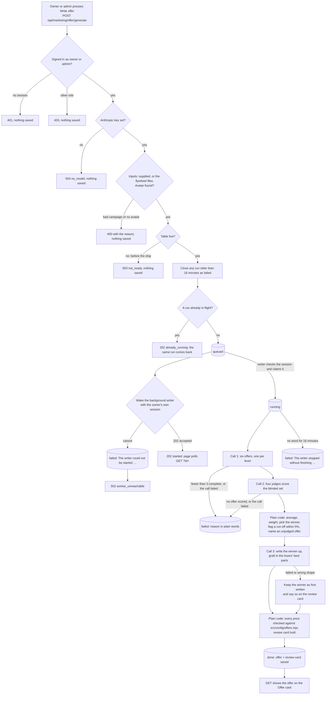
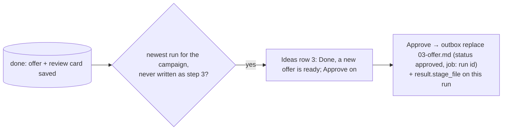

# Offer generator flow — the states one "Write offer" run moves through

Required by `CLAUDE.md` §3a step 4. Written 2026-10-05 from the code in this commit
(`api/marketing/offer/generate.mjs`, `netlify/functions/marketing-offer-background.mjs`,
`src/marketing/offer-*.mjs`, `db/migrations/409_marketing_jobs.sql`).

The screen (the dashboard's Offer card) is a window onto this page. The contract it calls
is `docs/specs/marketing-offer-contract.md`.

## The record

One run is one `marketing_jobs` row with `kind = 'offer'`.

| Column | What it holds |
|---|---|
| `status` | `queued` · `running` · `done` · `failed` (`marketing_jobs_status_ck`) |
| `payload` | the inputs actually used: campaign, the three summaries, where each came from |
| `result` | the winning offer, the review card, the scores, all six candidates, token use |
| `error` | a plain sentence. Required when `failed` (`marketing_jobs_failed_reason_ck`) |

Two rules live in the database, not the screen:

- `done` needs a `result` (`marketing_jobs_done_result_ck`).
- Only one offer run in flight (`queued` or `running`) per company (`marketing_jobs_one_offer_in_flight_uq`).

## The flow

## What is not in this flow

- **Approve, tweak and redo** from the review card. The card prints the line; nothing on
  the server records the answer yet. The dashboard plan puts that in slice 2
  (`POST marketing/flywheel/approve`, `POST marketing/flywheel/tweak`).
- **Writing `marketing/flywheel/<campaign>/03-offer.md`.** Not written by the run itself. Since
  unit GL (2026-10-06), Approve on the Ideas card's offer row writes it from the newest
  finished run through the repo outbox, and keeps the stamp on the run as
  `result.stage_file` (drawn in `marketing-dashboard-flow.md`, "GL Blueprint glue").

- **Avatar and ad research runs.** They stay in chat (they need live web research). This
  flow only reads what they already saved.

## Not verified on a real database

No Postgres on the Mac where this was written. The in-memory test
(`src/http/marketing-offer-generate.test.mjs`) runs the real handler, auth and SQL text;
the Postgres proof of the SQL and the four database rules is
`src/http/marketing-offer-generate.pg.test.mjs`, which runs in CI.
