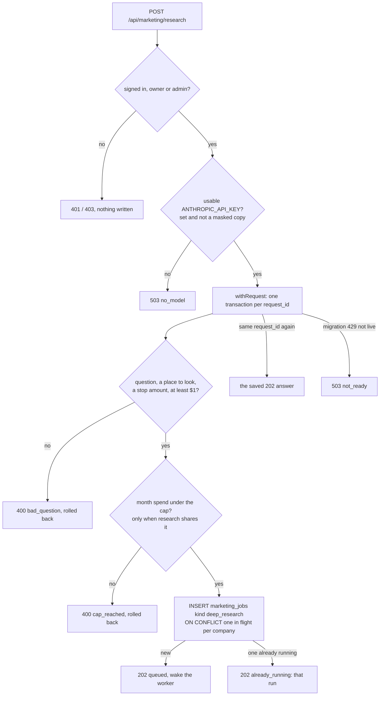
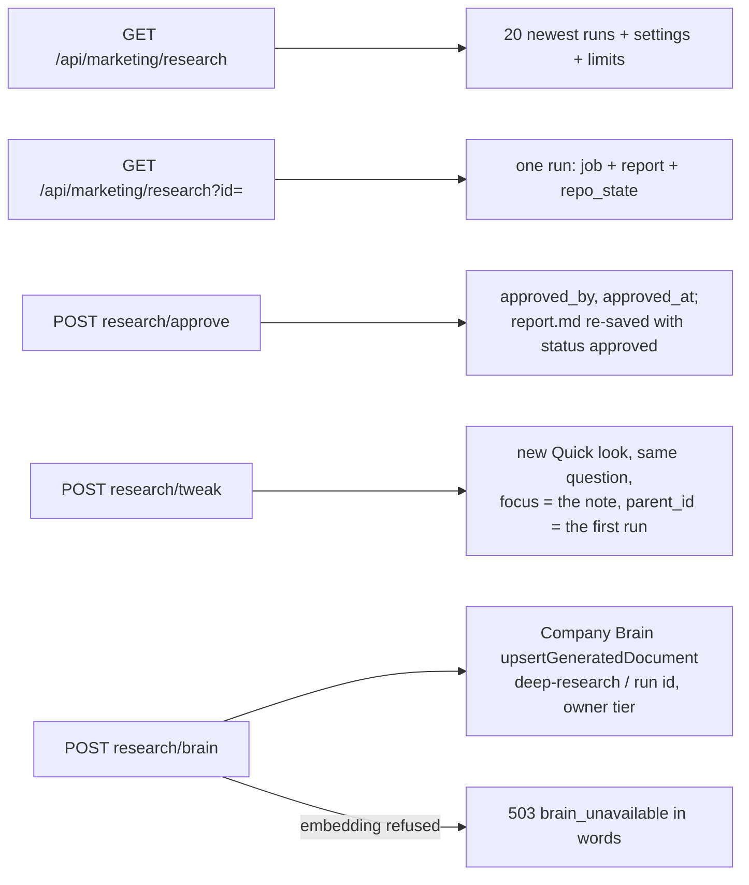

# Research it (deep research, J20) — what the back end does today

Required by `CLAUDE.md` §3a step 4. Written 2026-10-06 from the code on branch
`mm-x2-market-deep-research` (unit X2, design `docs/specs/command-center-design-2026-10-05.md`
§6 "Slice 10", back end only; the card on Ideas is lane E's unit X8). The route shapes are
in `docs/specs/marketing-machine-api.md` §6.10.

Drawn from code, not from the design. Anything the code does not do yet is marked
**NOT BUILT** rather than drawn as if it ran. There is no `marketing-machine-intended.md`
on any branch (only Chris can land it); the yardstick for this unit is the design's slice 10
and §5 safety rules 13, 14, 16, 17 and 18.

## Starting a run — `POST /api/marketing/research`

- The stop amount is the one typed on the card, or Settings' `max_research_cost_usd`;
  with neither the answer is `400 bad_question` (no default is invented).
- `depth` quick (default) or deep; `sources` web and vault on, own files off.

## The run — 8 saved steps on the marketing worker

`src/marketing/research/deep-research.mjs`, run by `src/marketing/research/runner.mjs`.
One step per worker claim; the checkpoint lives in `marketing_jobs.result`.

```mermaid
stateDiagram-v2
  [*] --> queued: POST marketing/research (or tweak)
  queued --> running: the worker claims it (group research, one step at a time)
  state running {
    plan: 1 plan (Opus, structured output, no tools)
    vault: 2 vault (the Hormozi notes as search_result blocks)
    sweep: 3 sweep (one Sonnet call per sub-question, web_search + web_fetch)
    chase: 4 chase (deep only)
    critic: 5 critic (deep only)
    verify: 6 verify (quick one way up to 5, deep two ways up to 15)
    synthesize: 7 write-up (Opus) or the report built by code
    save: 8 save (report.md + sources.json through the outbox, one buzz)
    plan --> vault: vault ticked
    plan --> sweep: vault off, web on
    vault --> sweep: web on
    sweep --> sweep: deep, fewer than two dry rounds, under 6
    sweep --> chase: deep
    sweep --> verify: quick
    chase --> critic
    critic --> verify
    verify --> verify: more key claims (8 calls a pass)
    verify --> synthesize
    plan --> synthesize: cap reached
    sweep --> synthesize: cap reached
    verify --> synthesize: cap reached
    synthesize --> save
  }
  running --> queued: step done (yield, back in 5 s)
  running --> queued: step failed, tries left (1 min, then 5 min)
  running --> failed: a step failed 3 times, or a final error (no key, web search off)
  running --> done: save finished (result holds report.markdown, CHECK 429)
  failed --> queued: Retry (POST marketing/jobs/retry keeps the saved steps)
  done --> done: Approve (approved_by, approved_at; the file saved again as approved)
```

What each step checks in code (design §5 rule 14):

- A web finding is kept only when its link is in that call's own `web_search_tool_result`,
  `web_fetch_tool_result` or `web_search_result_location` citations. A link the model only
  typed is dropped and counted (`dropped`).
- A quote stays only when its words are in Anthropic's `cited_text` for that link or in the
  page web fetch returned for it; otherwise it is left out and counted (`quotes_unchecked`).
- A vault finding must name one of the passages' files, and its quote must be in that repo
  file (read again from disk).
- Every link in the written report must be a kept source; any other is replaced with
  "(link removed: not one of the sources this run read)".
- The report always ends with a code-built "How this was checked" footer: the counts,
  "Treat with caution", "What we could not reach" and the Sources list.

What the caps do (design §5 rule 13):

- Before every batch: spent so far (from `marketing_model_usage`, job id) plus the batch's
  worst case, with the write-up's reserve (about $0.42) held back, against the run's stop
  amount, and against the month cap when research shares it. The batch shrinks first
  (the row says so: "Round 3 read 2 of 4 sub-questions to stay under $5."), then the run
  skips to the write-up and ends "Done, stopped at the cap".
- The search ceiling is summed across continuations: at most 62 searches for a Quick look,
  542 for Leave nothing unturned ($10 per 1,000, from `searchCeiling()`).
- A write-up that fails twice, or does not fit, becomes a report built by code from the
  findings ("Done, write-up failed, findings below").

## Reads and the other taps

- `repo_state` reads the outbox: "Saved. Reaching the repo…" until the commit lands, then
  "In the repo".
- Nothing a research run writes reaches a page, an ad or a customer (rule 16).

## Gaps (findings, not fixes)

1. **Retry route not on this branch.** `POST marketing/jobs/retry` belongs to U26
   (branch `mm-u26-ideas-rules-retry`). This unit makes `retryJob` keep a saved-step
   checkpoint, so Retry resumes once U26 lands; until then a failed research run has no
   Retry tap on the server. **NOT BUILT here.**
2. **`GET marketing/costs` is not built** by this unit. The cost sheet's research lines can
   read `GET marketing/research` (`settings.last_run`, `limits`) until it exists.
3. **No streaming.** Every call is capped at 270 seconds with `max_tokens` sized to fit;
   the design's "streaming for calls that can pass 270 s" is U06's and is not built.
4. **Design 409s.** The design writes `409 cap_hit` and `409 brain_unavailable`; the API
   contract keeps 409 for `stale`, so these answer `400 cap_reached` and `503
   brain_unavailable` (API doc §8 gap 9).
5. **"Our own files"** is read as the partner flywheel's stage files (avatar, ad research,
   owner notes) and reaches only the plan and the write-up. The design does not name the
   files; this is the default picked.
