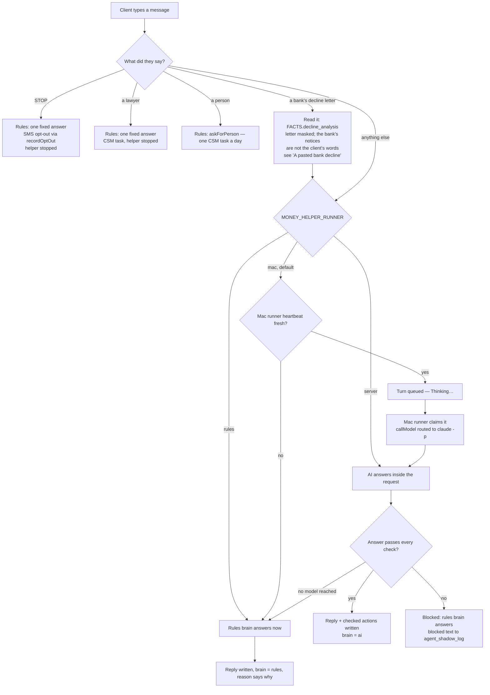
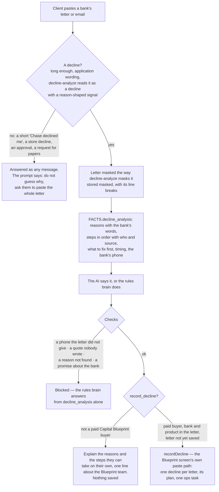
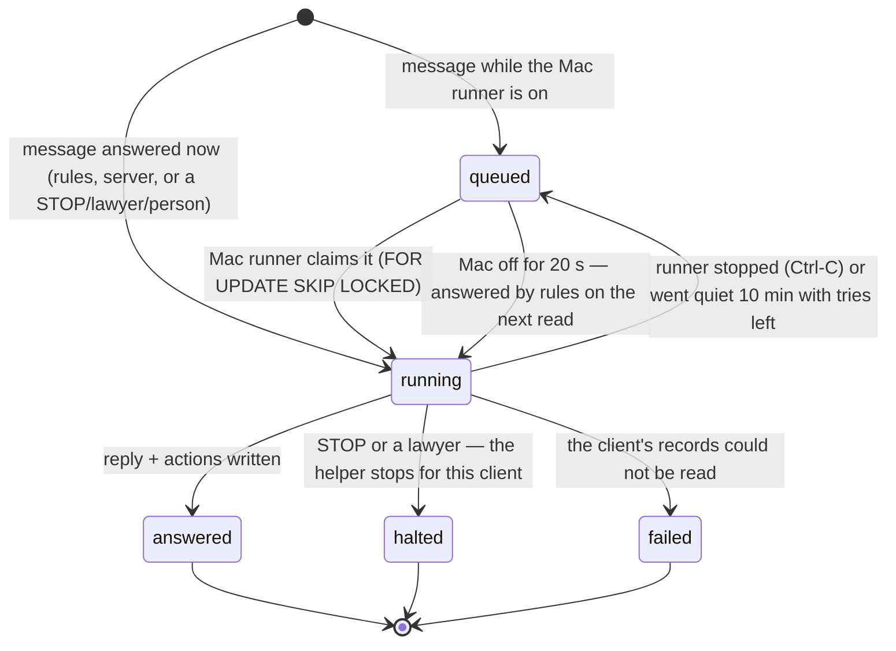
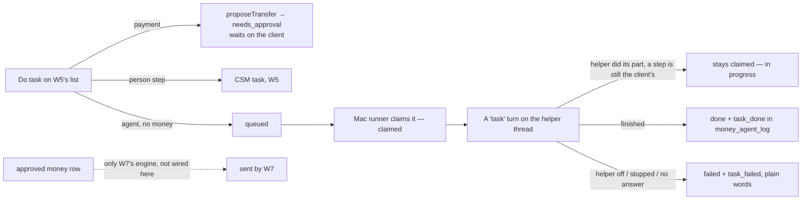

# FinanceOS Money Helper — flow

FinanceOS wave 5, unit W6 (`ops/workflows/finance-os-wave5-2026-10-06.md`). Spec:
`docs/finance/client-finance-os-build-spec-2026-09-19.md` §6. Owner (2026-10-06): "Really set
up the AI agent… so we can role-play and see it work simulated." "AI tells you exactly what to
do; press Do task to assign actions to AI agents."

The agent is `agents` row **FOS-01** (migration 465), status **shadow**: it answers in the app
and never texts. It thinks through the shared model client (`callModel`,
`src/agents/model.mjs`) — Claude Code on Chris's Mac today, the API later, same code.

Code: `src/finance/money-agent-ai.mjs` (the brain and its checks), `src/finance/money-helper.mjs`
(turns, routing, writes), `src/finance/money-agent-tasks.mjs` (W5's Do-task rows),
`src/finance/money-helper-runner.mjs` + `scripts/money-agent-run-queue.mjs` (the Mac runner),
`api/money/helper.mjs`, `public/app/money-helper.js`.

## One message

Every answered turn also writes the text it **would have texted** to `agent_shadow_log`
(reason `shadow_status`, or `guardrail_halt` for STOP / a lawyer, `guardrail_block` for a
blocked AI answer) and one row to `agent_runs`. Nothing is texted while FOS-01 is shadow.

A turn left queued when the Mac stops is answered by rules on the client's next read
(`answerOrphans`), so nobody waits on a computer that is off.

## The checks an AI answer must pass (`validateAnswer`)

- Actions only from the closed set: `create_reminder`, `create_csm_task`,
  `mark_task_in_progress`, `schedule_pin`, `propose_transfer`, `record_decline`, `no_action`;
  every field checked against the client's own records.
- Every number in the reply is in the facts it was handed or in the client's own words.
- No promised outcome; never "I moved your money"; UnderwriteIQ only word for word.
- A transfer is a **proposal** (W5's `proposeTransfer`, a `money_agent_tasks` row at
  `needs_approval`) and the reply says it needs the client's approval.
- A client who says they cannot pay gets a CSM task (once per chat).

## A pasted bank decline (Capital Blueprint launch, unit B1b, migration 468)

Owner, 2026-10-06: "The decline defense is something I can just copy into the agent. If they get
declined, they copy it and it determines what the reason could be, then finds the reconsideration
steps an agent can take as a process." Contract of the reading: `docs/finance/decline-defense.md`
(the `analyze_decline` TOOL, `src/blueprint/decline-analyze.mjs`). The helper's half is
`src/finance/money-decline.mjs`.

What the helper may and may not do with it:

- **Detection is conservative.** Never a guess on a short message. A card declined at a store, an
  approval, a counteroffer and a request for papers are not pastes.
- **The client's numbers stay masked** in the prompt, in FACTS, in what the thread keeps, in the
  shadow log and in the saved decline. The reply cannot say a number the letter hid.
- **The bank's notices are not the client.** A bank email ends in "unsubscribe" and "opt out" lines
  and sometimes names an Attorney General. STOP, a lawyer and "a person" are read from the client's
  own short first paragraph only. A STOP above the letter still stops the helper.
- **Only what `decline_analysis` says.** No phone number the bank's letter did not give (a credit
  bureau's number is not the bank's), no words in quotation marks that nobody wrote, no reason the
  reader did not find, no promise about the bank ("the bank will approve", "they have to reconsider").
  A line no source covers stays a blank for a person.
- **`record_decline` is code-checked:** `decline_analysis` in FACTS, a paid Capital Blueprint buyer
  (`isCapitalBlueprintBuyer`; unknown counts as not a buyer), the bank and product written in the
  letter, the letter not already saved in this chat. `recordDecline` checks the buyer again, caps a
  client's pastes at 5 a day, masks again, and answers a repeat as a duplicate. The saved text is the
  client's masked paste, never the model's words.
- **Follow-ups keep the analysis.** "What should I fix first?" a message later is answered from the
  same letter (read again from the earlier message); a saved letter is not saved twice.
- **A longer message is allowed for a letter only.** A chat message stays under 2000 characters; a
  pasted decline may run to the reader's cap (20000, `MAX_PASTE_CHARS`). Migration 468 widens the turn
  table's input check to match.

Role-play: persona (g) in `src/finance/money-agent-sim.mjs`, scored for the reasons said, the steps in
order, no invented phone, and a save only for a buyer (`--buyer=yes|no`, `--prompt=code`).

For the screen (not built here): `public/app/money-helper.js` caps the box at 2000 characters
(`MAX_CHARS`) and names no word for the new action (`ACT_WORD` has no `record_decline`).

## A turn

## A "Do task" row (W5's queue, migration 464)

W6 never claims an approved money row without W7's engine and never moves money.

## Where it shows

- The chat: `/app/money-helper.html` (section `FinanceOS.sections.helper`).
- Reminders and plan steps: the Plan, through plan source `agent`
  (`src/finance/plan-sources/agent.mjs`, registered by the orchestrator).
- The daily ladder (`src/finance/money-agent.mjs`) holds its texts for a client who stopped the
  chat helper, and uses the AI brain only when `MONEY_HELPER_RUNNER=server`.

## Not covered by an intended journey

No `*-intended.md` describes the money helper chat. The role-play
(`npm run money:roleplay`) scores spec §6 and the agent's own prompt; its sequence check is
**UNVERIFIED** until Chris writes one.
