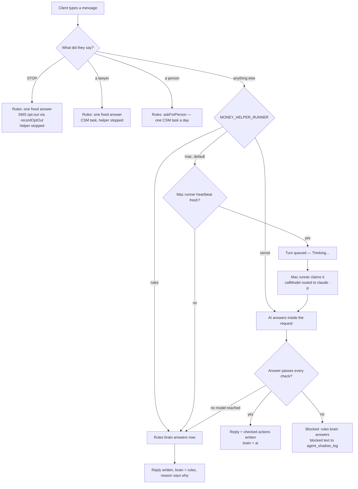
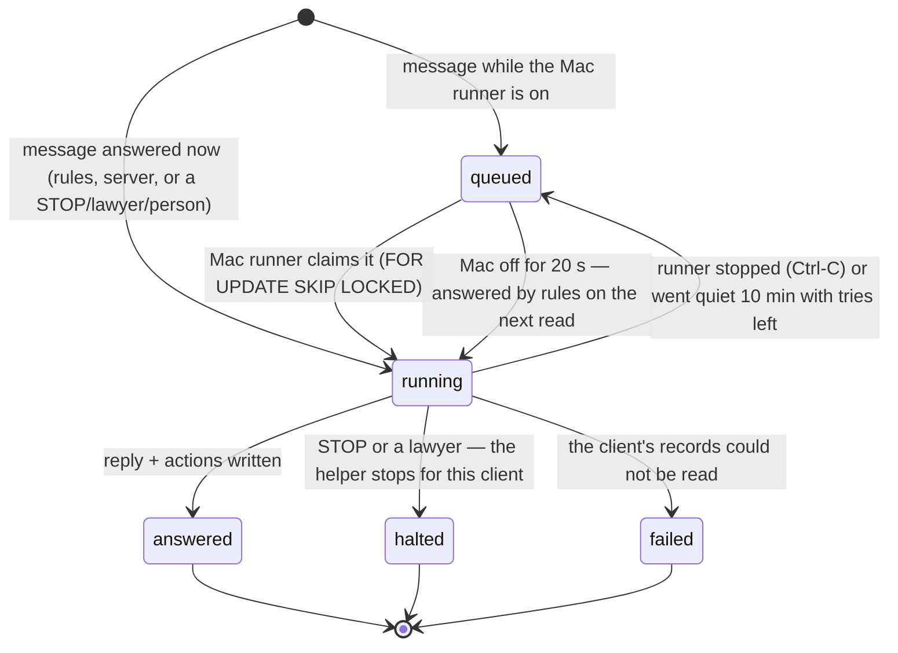
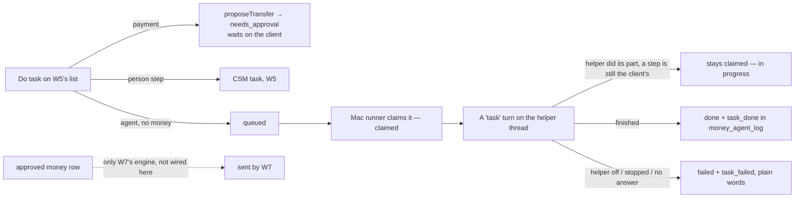

# FinanceOS Money Helper — flow

FinanceOS wave 5, unit W6 (`ops/workflows/finance-os-wave5-2026-10-06.md`). Spec:
`docs/finance/client-finance-os-build-spec-2026-09-19.md` §6. Owner (2026-10-06): "Really set
up the AI agent… so we can role-play and see it work simulated." "AI tells you exactly what to
do; press Do task to assign actions to AI agents."

The agent is `agents` row **FOS-01** (migration 465), status **shadow**: it answers in the app
and never texts. It thinks through the shared model client (`callModel`,
`src/agents/model.mjs`) — Claude Code on Chris's Mac today, the API later, same code.

Code: `src/finance/money-agent-ai.mjs` (the brain and its checks), `src/finance/money-helper.mjs`
(turns, routing, writes), `src/finance/money-agent-tasks.mjs` (W5's Do-task rows),
`src/finance/money-helper-runner.mjs` + `scripts/money-agent-run-queue.mjs` (the Mac runner),
`api/money/helper.mjs`, `public/app/money-helper.js`.

## One message

Every answered turn also writes the text it **would have texted** to `agent_shadow_log`
(reason `shadow_status`, or `guardrail_halt` for STOP / a lawyer, `guardrail_block` for a
blocked AI answer) and one row to `agent_runs`. Nothing is texted while FOS-01 is shadow.

A turn left queued when the Mac stops is answered by rules on the client's next read
(`answerOrphans`), so nobody waits on a computer that is off.

## The checks an AI answer must pass (`validateAnswer`)

- Actions only from the closed set: `create_reminder`, `create_csm_task`,
  `mark_task_in_progress`, `schedule_pin`, `propose_transfer`, `no_action`; every field checked
  against the client's own records.
- Every number in the reply is in the facts it was handed or in the client's own words.
- No promised outcome; never "I moved your money"; UnderwriteIQ only word for word.
- A transfer is a **proposal** (W5's `proposeTransfer`, a `money_agent_tasks` row at
  `needs_approval`) and the reply says it needs the client's approval.
- A client who says they cannot pay gets a CSM task (once per chat).

## A turn

## A "Do task" row (W5's queue, migration 464)

W6 never claims an approved money row without W7's engine and never moves money.

## Where it shows

- The chat: `/app/money-helper.html` (section `FinanceOS.sections.helper`).
- Reminders and plan steps: the Plan, through plan source `agent`
  (`src/finance/plan-sources/agent.mjs`, registered by the orchestrator).
- The daily ladder (`src/finance/money-agent.mjs`) holds its texts for a client who stopped the
  chat helper, and uses the AI brain only when `MONEY_HELPER_RUNNER=server`.

## Not covered by an intended journey

No `*-intended.md` describes the money helper chat. The role-play
(`npm run money:roleplay`) scores spec §6 and the agent's own prompt; its sequence check is
**UNVERIFIED** until Chris writes one.
