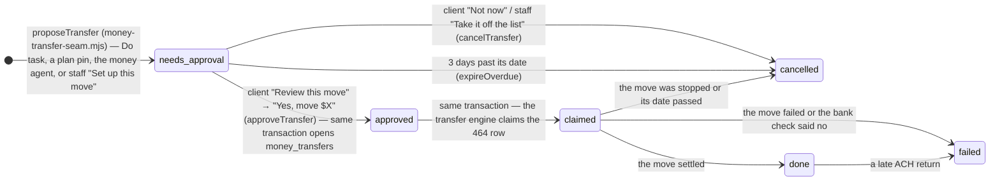
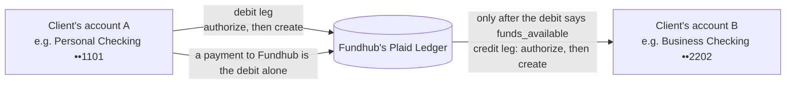

# money-transfers-flow — FinanceOS money moves

How one FinanceOS money move goes from "set up" to "landed", and what can stop
it. FinanceOS wave 5, unit W7 (`ops/workflows/finance-os-wave5-2026-10-06.md`).
Drawn by hand from the code on 2026-10-07 — every arrow names the function or
event that fires it. Plaid sandbox only until production is switched on.

**The hard rule:** nothing moves until the client says yes to that exact move —
the account it comes from, where it goes, the amount and the date. The money
agent, the rules helper and staff can only set a move up.

## 1. The proposal and the move — one record each, linked



The left column is the 464 row (`money_agent_tasks`, unit W5). Only the client's
own login can take it past `needs_approval`; the database refuses a money row
that skips the yes (`money_agent_tasks_money_needs_ok_ck`).

## 2. The move itself — `money_transfers` (466)

```mermaid
stateDiagram-v2
    direction TB
    [*] --> approved: approveTransfer — opened only if it matches the approved 464 row (money_transfers_guard)
    approved --> approved: not its day yet · over today's limit · bank login needs fixing · bank did not answer (waits; the 15-minute pass tries again)
    approved --> cancelled: client or staff stop it (cancelTransfer) · 3 days past its date (date_passed)
    approved --> declined: Plaid's bank check says no (/transfer/authorization/create → declined, e.g. NSF)
    approved --> failed: the account it comes from is gone · Plaid refuses the request
    approved --> authorized: Plaid's bank check says yes (debit authorization)
    authorized --> submitted: /transfer/create — the debit leg (idempotent on the authorization)
    authorized --> failed: Plaid refuses the create
    submitted --> submitted: Plaid events (/transfer/event/sync): debit pending → posted → settled → funds_available, then the credit leg starts: credit pending → posted
    submitted --> cancelled: stopped while Plaid still says "cancellable" (/transfer/cancel)
    submitted --> settled: credit settled (bank to bank) · debit settled (a payment to Fundhub)
    submitted --> failed: a leg failed or was returned
    settled --> failed: a late ACH return
    settled --> [*]
    failed --> [*]
    cancelled --> [*]
    declined --> [*]
```

## 3. Two legs, because Plaid moves money through Fundhub's Plaid Ledger



https://plaid.com/docs/transfer/flow-of-funds/ — a debit pulls money into the
Ledger; a credit pays it out. The engine never pays out before the debit's money
is available.

## What starts each step

| Step | Who or what | Code |
|---|---|---|
| Set up a move | Do task · plan pin · money agent · staff | `proposeTransfer` in `src/finance/money-transfer-seam.mjs` (writes the 464 row) |
| Say yes | The client's own login, never staff, never an authorized rep | `POST /api/money/transfers {action:"approve"}` → `approveTransfer` |
| Send a move dated today | Right after the yes | `api/money/transfers.mjs` → `executeTransfer` |
| Send later moves, read Plaid's events, start credit legs, expire stale ones | Every 15 minutes | `src/workflows/finance-os-money-transfers.mjs` → `runTransfersPass` |
| Stop a move | Client or staff | `POST {action:"cancel"}` → `cancelTransfer` |
| Every state change | The database | `money_transfers_ledger` trigger → `money_transfer_events` (append-only) |

## Switches (fail closed)

- `FINANCE_OS_TRANSFER_MAX_CENTS` and `FINANCE_OS_TRANSFER_DAILY_MAX_CENTS` — both
  must be whole numbers above 0, or nothing can be approved or sent and the pass
  does nothing.
- `PLAID_ENV=sandbox` — Plaid's test bank only.
- Real money needs `PLAID_ENV=production` **and** `FINANCE_OS_TRANSFERS_LIVE=1`.
  The wire (`src/banking/providers/plaid-http.mjs`) refuses the production host
  without both.
