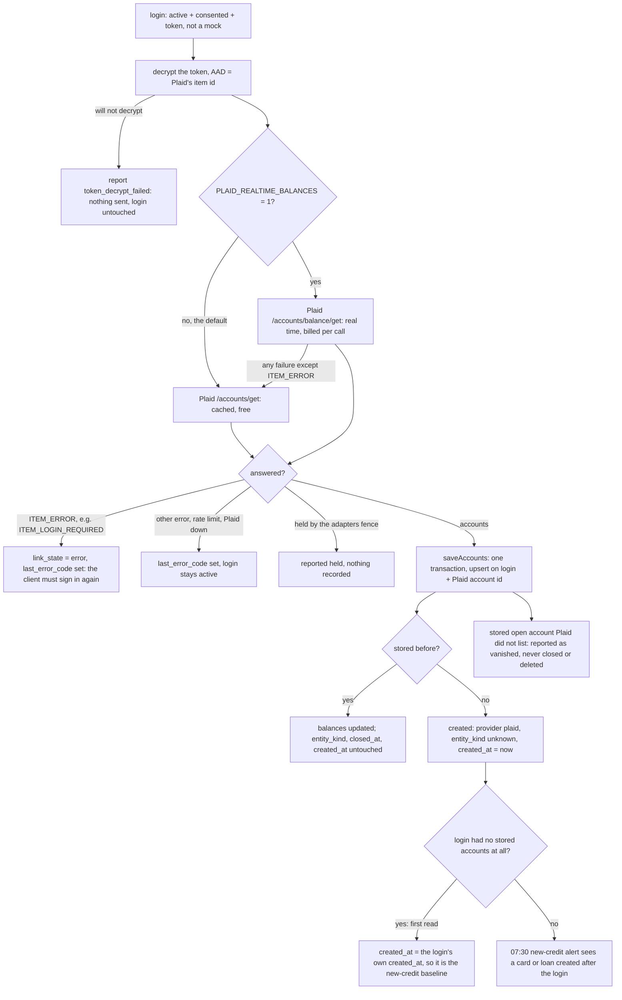

# Plaid account refresh — flow

Owner (2026-10-07): "make it work" for real banks, not just the sandbox. Before this,
nothing re-read a client's Plaid accounts after the day they linked: balances went stale
and a card opened later at the same bank never reached `bank_accounts`. The cash-cushion
and new-credit alerts (`docs/finance/file-protection-alerts.md`) read that table as it stands.

Code: `src/banking/plaid-refresh.mjs` (the refresh), `src/workflows/plaid-transactions-sweeper.mjs`
(runs it daily), `src/banking/accounts-sync.mjs` + `api/banking/sync-accounts.mjs` (staff: refresh one
client now), `src/banking/providers/plaid-http.mjs` (`fetchAccounts`, and `fetchBalances` for the opt-in).
No migration: it writes the columns that already exist.

## One daily pass (07:00 UTC) — accounts first, then transactions

```mermaid
flowchart TD
    S[plaid-transactions-sweeper 07:00 UTC] --> L[clientsWithPlaid: active, consented logins]
    L --> C[one step per client]
    C --> R[refreshClientAccounts: every readable login of the client]
    R --> T[syncClientTransactions: charges and deposits, then the bill detector]
    R -. a failed or thrown refresh is recorded under tally.accounts and never stops the sync .-> T
    R --> A[07:30 UTC: trend snapshots and file-protection alerts read the fresh rows]
    T --> A
```

A transaction is only stored for an account already in `bank_accounts`, so refreshing first also
means a new card's charges are no longer dropped as `account_not_saved`.

## One login



## Who may change what

```mermaid
stateDiagram-v2
    [*] --> active: completeLink (client finishes Plaid Link)
    active --> active: refresh succeeds, or fails for a reason that is not the login
    active --> error: Plaid says ITEM_ERROR (refresh or transactions sync)
    active --> [*]: the login is revoked (src/banking/revoke.mjs deletes the row, and its accounts with it)
    error --> [*]: not read again; a fresh Link makes a new login
```



Nothing in the refresh deletes a row, closes an account, sets `entity_kind`, or moves a stored
`created_at` (the one exception is the first-read baseline above, which only ever moves a row
the same read just created). An unknown balance is stored as null, never 0.

## Staff: refresh one client now

`POST /api/banking/sync-accounts` `{ client_id, provider: "plaid" }`, owner / admin / sales_manager.
`item_id` (a `plaid_items` uuid) refreshes just that login. The answer lists, per login, what was
created, what vanished, which balances moved, and `relink_needed`. A login that is not readable
(not this client's, or not active) is a 404.
