# repair documents — actual

What the code **does** today when a credit-repair client sends us the two
documents the whole program is built on: a government photo ID and a proof of
address. Traced from the code, not from a spec. First traced on branch
`feat/repair-doc-path`; the letters half re-traced 2026-10-09 on
`build/ZU-P-2026-10-09` after the signing box started the letters, and again on
`build/ZU-P-r2-2026-10-09` after the gate order and the server ID read were
corrected.

The identity in those two pictures is what stays on the credit report. Every
other name and every other address on the report is disputed off against it. So
until both have arrived and been read, there is nothing honest to put in a
letter.

## In one picture

```mermaid
flowchart TD
    BUY([Client buys a repair program]) --> ENROL["src/repair/enroll.mjs<br/>grants metro2-letter-pack"]
    ENROL --> EV1[["event: repair.enrolled"]]
    EV1 --> INTAKE["optimization card → intake"]

    INTAKE --> ASK{"Are the ID and the<br/>proof of address on file?<br/>src/inquiry-ops/doc-gate.mjs<br/>checkDocPacket()"}
    ASK -->|"could not read the documents"| UNK["nothing is emitted<br/>unknown stays unknown"]
    ASK -->|No| EV2[["event: repair.docs.needed"]]
    ASK -->|Yes| EV3[["event: repair.docs.complete"]]

    EV2 --> WAIT["card → awaiting_documents<br/>portal reads: 'We need a few documents —<br/>Upload your ID and proof of address to continue'<br/>SLA chases the owner after 14 days"]
    EV2 --> ASKED{"Was this client already asked?<br/>a DOC-01 message on file, or the<br/>shared one-shot lock doc_01_request_sent_at<br/>src/repair/notify.mjs"}
    ASKED -->|"No"| ASK1["email EMAIL-DOC-01-REQUEST queued once<br/>'Documents needed before we can start':<br/>photo ID + proof of address, portal link<br/>email only — repair never texts"]
    ASKED -->|"Yes — by the funding or inquiry path,<br/>or by this step's own second run"| ASK0["nothing sent — never asked twice"]

    WAIT --> DOORS{"How does the client send them?"}
    DOORS --> PORTAL["Client portal, the identity door<br/>public/app/client-portal.html<br/>open to repair AND funding clients"]
    DOORS --> TEXT["They text a photo<br/>src/handlers/inbound-mms-docs.mjs"]

    TEXT --> CLASSIFY{"DOC-CHECK reads the image:<br/>what IS this?"}
    CLASSIFY -->|"'Arizona driver license'<br/>a plain name, no doubt in it"| SUB1["filed as id_document"]
    CLASSIFY -->|"'utility bill'"| SUB2["filed as proof_of_address"]
    CLASSIFY -->|"'no valid ID in this photo'<br/>'too blurry to read the ID'<br/>'appears to be a licence'<br/>the agent held it or listed a problem<br/>a whole sentence, not a name<br/>two answers at once, or none"| SUB3["filed as other<br/>the label is never stronger<br/>than the evidence"]

    PORTAL --> RECV[["event: docs.received"]]
    SUB1 --> RECV
    SUB2 --> RECV
    SUB3 --> RECV

    RECV --> GUARD{"src/repair/handlers.mjs<br/>onRepairDocsReceived"}
    GUARD -->|"not a repair client"| STOP1[ignored]
    GUARD -->|"card is past awaiting_documents"| STOP2["ignored — a round-5 file<br/>is never dragged backwards"]
    GUARD -->|"only one of the two is in"| STOP3["ignored — says which is missing"]
    GUARD -->|"both are in"| EV3

    EV3 --> ANALYSIS["card → analysis<br/>src/repair/handlers.mjs onRepairEvent"]
    ANALYSIS --> START["src/repair/start-letters.mjs<br/>startRepairLetters — round R1<br/>ONE shared call, used by BOTH doors"]
    START --> BRAIN["src/repair/analyze.mjs<br/>analyzeAndGenerate — the credit-repair brain"]

    BRAIN --> AUTH{"Is there a signed repair agreement<br/>OR a live dispute_authorization consent?<br/>src/repair/dispute-auth.mjs"}
    AUTH -->|"neither"| NOAUTH["REFUSED: no_authorization<br/>nothing saved, nothing flagged<br/>card stays on analysis"]
    AUTH -->|"yes"| EARLY{"First gates, in order:<br/>letters already on file for R1 · round cap ·<br/>stored credit file"}
    EARLY -->|"R1 letters already on file"| DONE0["already_generated<br/>nothing written — safe to call twice"]
    EARLY -->|"round cap, or no stored credit file"| STAY["REFUSED with its own reason<br/>card stays on analysis<br/>nothing retries these<br/>Staff can press Stage: api/repair/generate.mjs<br/>sla.mjs raises engineering_engine_failure after 1 hour"]
    EARLY -->|"all clear"| PATH{"On the repair path?<br/>signed repair agreement<br/>OR an ACTIVE repair_programs row<br/>OR outcome tier REPAIR_ONLY / FUNDING_PLUS_REPAIR"}
    PATH -->|"yes"| IDGATE{"Client and name on record?<br/>THEN: is the name verified from the ID?<br/>src/identity/verified.mjs<br/>THE ID CHECK APPLIES ON THE REPAIR PATH ONLY"}
    PATH -->|"no"| REC{"Client and name on record?"}
    IDGATE -->|"no client or name on record,<br/>or name not verified from the ID"| STAY
    REC -->|"no"| STAY
    IDGATE -->|"yes"| WIDE["engine findings + derogatory claims<br/>+ personal-information floor"]
    REC -->|"yes"| NARROW["engine findings only"]
    WIDE --> ANY{"Anything to dispute?"}
    NARROW --> ANY
    ANY -->|"no — no_violations"| STAY
    ANY -->|"yes"| STORE["cases, items and letters stored"]
    STORE --> COPY["same letter body saved twice:<br/>dispute_letters (bureau send)<br/>and documents (client copy)"]
    COPY --> READY["card → letters_generated then ready_to_send<br/>NO email to the client<br/>Specialist Send is still a human click"]

    NOAUTH --> SIGN["Client portal box<br/>'Sign to authorize dispute letters'<br/>public/app/client-portal.html<br/>shown only when dispute_consent is true:<br/>metro2-letter-pack OR funding-snapshot entitlement<br/>api/read/portal-summary.mjs"]
    SIGN --> CAP["POST /api/consent/capture<br/>kind dispute_authorization<br/>consent row saved FIRST"]
    CAP --> SAVED["Client gets the same answer as before:<br/>{ ok, consent }"]
    CAP --> RETRY{"api/consent/capture.mjs →<br/>startLettersAfterAuthorization<br/>Is the repair card on analysis?"}
    RETRY -->|"no card, or any other stage"| NOTHING["nothing runs<br/>if the documents are not in yet,<br/>the docs door starts the letters when they land"]
    RETRY -->|"yes"| START
    RETRY -.->|"the writer throws"| KEEP["caught and logged<br/>the signature stays saved"]

    NOAUTH -.-> DESK["Repair desk chip 'Needs agreement'<br/>src/repair/read-repair-signals.mjs authorization_ok<br/>= live consent OR signed repair contract<br/>false only when BOTH reads worked and found nothing;<br/>a failed read leaves it unknown and shows no chip<br/>src/repair/lens.mjs deriveChip"]
```

How to read the new part: the two ways in are `repair.docs.complete` (the
documents landed) and a signed dispute authorization (the portal box). Both call
the same `startRepairLetters`. Whichever paper arrives **last** starts the
letters. The signature only acts on a card that is already sitting on
`analysis`, so a client who signs before the documents arrive changes nothing
until the documents land.

## What each piece is, and where it lives

| Step | File | Note |
|---|---|---|
| Enrolment | `src/repair/enroll.mjs` | Trial is capped at 2 rounds, full at 6. Owner-set; correct. |
| The stage list | `src/repair/pipeline.mjs` | `intake → awaiting_documents → analysis → …` |
| The client's words | `src/repair/portal.mjs` | "We need a few documents" |
| The 14-day chase | `src/repair/sla.mjs` | `awaiting_documents: 14 days → owner_contact_client` |
| Asks the client for them | `src/repair/notify.mjs` | On `repair.docs.needed`: `EMAIL-DOC-01-REQUEST`, email only, once per client. Shares the "already asked" check and the `doc_01_request_sent_at` lock with `src/workflows/s-doc-collection.mjs` and `src/handlers/inquiry-docs.mjs`, which send the same message. Until 2026-09-18 this step sent nothing (hole N8). |
| Has the packet arrived | `src/inquiry-ops/doc-gate.mjs` | `checkDocPacket()` — the ONE implementation |
| Emits the two events | `src/repair/handlers.mjs` | `announceRepairDocState()` |
| Listens for uploads | `src/repair/register.mjs` | `docs.received → onRepairDocsReceived` |
| The upload doors | `src/repair/upload-doors.mjs` | the identity door opens for repair AND funding |
| A texted photo | `src/handlers/inbound-mms-docs.mjs` | classified before it is filed |
| Reads the images | `src/handlers/doc-check.mjs` | seeded in `db/migrations/114_ghl_agent_seed.sql` |
| Builds the letters | `src/repair/analyze.mjs` | `analyzeAndGenerate`. Called from `startRepairLetters` (below) and from POST `/api/repair/generate`. Mails nothing. Refuses with `no_authorization` until a signed repair agreement or a live `dispute_authorization` consent is on file. A client with an ACTIVE `repair_programs` row is on the repair path (`hasActiveRepairProgram`), keyed to that row and not to the `metro2-letter-pack` entitlement. The path is decided first; the verified-name check then applies on the repair path only. The verified name comes from `verifiedIdentity` in `src/identity/verified.mjs`, imported statically at the top of the file so the server bundle carries it (a string-path `import()` used here until 2026-10-09 could not find the file on the server). |
| Starts the letter writer | `src/repair/start-letters.mjs` | `startRepairLetters` is the one call. `repair.docs.complete` (in `handlers.mjs`) and a signed dispute authorization (in `api/consent/capture.mjs`, through `startLettersAfterAuthorization`) both use it. The signature only acts on a card on `analysis`. Never throws. Emails the client nothing: `TEMPLATE_BY_EVENT` in `notify.mjs` has no template for `repair.docs.complete`, `repair.analysis.complete` or `repair.letters.ready`. |
| The signing box | `public/app/client-portal.html`, `api/consent/capture.mjs` | Shown when `api/read/portal-summary.mjs` says `dispute_consent` (repair or funding entitlement). Stores a `dispute_authorization` consent. The `$1,000` repair agreement text is a placeholder the system refuses to send, so this box is the one working paper. |
| What the Repair desk says | `src/repair/read-repair-signals.mjs`, `src/repair/lens.mjs` | `authorization_ok` is a live `dispute_authorization` consent or a signed repair contract. An enrolled program no longer counts (changed 2026-10-09), so the "Needs agreement" chip shows for a paid client who has signed nothing. It is false only when both reads worked and found nothing. If one read failed and the other found nothing, it stays unknown and no chip shows. |
| Client copy of the same letter | `src/repair/persist-generated-letters.mjs` | Same `body_text` as `dispute_letters`, saved as an HTML deliverable |

## What was broken until 2026-09-04

1. **A repair client could not see the identity door.** `activeUploadDoors()`
   opened the door carrying `id_document` and `proof_of_address` on the
   funding-snapshot entitlement only. A repair client is granted
   `metro2-letter-pack`, so all they ever saw was the bureau-response door. The
   program's first requirement had nowhere to be sent.

2. **`awaiting_documents` had never once been reached.** The stage, the client
   copy, the 14-day chase and the event handlers all existed. `repair.docs.needed`
   and `repair.docs.complete` were emitted by nothing at all, so every repair
   client sat on `intake` and no screen ever asked them for anything.

3. **A texted photo was filed as "other".** Every inbound picture message was
   registered with subtype `other`, so neither the document agent nor the
   document gate could tell an ID from a gas bill. A client who texted their
   licence had, as far as every check downstream was concerned, sent nothing.

## Three refusals worth knowing

* **Unknown is never "missing".** If the documents table will not answer,
  nothing is emitted. A client is never told they have not sent something on the
  strength of a failed read.
* **An upload never moves a file backwards.** `onRepairDocsReceived` only acts on
  a card sitting on `intake` or `awaiting_documents`. A client on round five
  texting a bureau letter changes nothing.
* **The label is never stronger than the evidence.** A photo is typed as a
  government ID only when the document agent plainly named one. The subtype
  falls back to `other` — the same as before any of this work — whenever:
  the agent's words carry a denial or a doubt ("no valid ID was visible", "too
  blurry to read the ID", "appears to be a driver's license", "possibly a
  passport", "belonging to someone other than the client"); the agent held the
  document, asked for a better one, or listed a problem with it; the answer is a
  sentence about the photo rather than a short name for it; the answer names two
  document types, or none. When two answers come back they must agree, and one
  answer we cannot read spoils the whole reply. Nothing is ever inferred from
  the filename, the sender, or the order the pictures arrived in: an MMS
  filename is `mms-<message id>-<n>` and says nothing. A photo that stays
  `other` is recorded with `classified_by: null`, so an unread picture never
  looks agent-verified.

  This matters because `id_document` is one leg of the identity gate in
  `src/inquiry-ops/doc-gate.mjs`, and that gate is what decides whether dispute
  letters may be mailed in a client's name. A wrong label there would open it on
  nothing.

## What this page does NOT claim

Four notes on this path. Some are real and not fixed here, and one is a
correction of an old claim. They are written down so nobody reads the diagram as
more finished than it is.

* **CORRECTED 2026-09-04 — the earlier claim here was wrong.** An earlier draft
  of this page said the document agent has no instructions on a freshly migrated
  database, so no photo is ever classified. That is FALSE. On a virgin database
  with all 239 migrations applied to empty, `select code, status,
  length(coalesce(prompt,'')) from agents where code='DOC-CHECK'` returns
  `DOC-CHECK | live | 3275` and classification works. The wrong number came from
  measuring a database the test suite had already run against: the pg half
  mutates the `agents` table, and afterwards the same query returns
  `DOC-CHECK | draft | 0`. Never read the agents table on a database the suite
  has touched, and never quote a seeded-row measurement without saying whether
  the database was virgin.

* **The credit-repair contract check does not run on this path.**
  `canLeaveIntake()` in `src/repair/croa.mjs` checks that a complete contract is
  on file before a repair file leaves `intake`. `src/repair/handlers.mjs` only
  applies it when the event payload carries `fromIntake`, and nothing in the
  repository sets that flag — `git grep -n fromIntake -- src` returns only the
  check itself. So enrolment moves the card to `awaiting_documents` without that
  check running. COMPLIANCE REVIEW REQUIRED.

* **CORRECTED 2026-10-09 — the earlier claim here is out of date.** It said
  nothing moves a card out of `analysis` on its own and that only
  `api/repair/generate.mjs` calls `analyzeAndGenerate()`. Since commit
  `2e19c7c7` (2026-09-18) `repair.docs.complete` runs the writer by itself, and
  since the signing change a signed dispute authorization runs it too. What is
  still true: when the writer refuses for any reason other than a missing
  signature (no stored credit file, name not verified from the ID, nothing to
  dispute, round cap), the card stays on `analysis` and nothing retries it.
  Staff can press Stage (`api/repair/generate.mjs`), and `src/repair/sla.mjs`
  raises `engineering_engine_failure` on the staff board one hour later.

* **UNVERIFIED on the live site — the new signing path has not run there.** The
  code path above is traced and tested against a stand-in database. The ID read
  and the letter counts were also proved from a built server bundle, read-only,
  with the signature and every write faked (see the ZU-P manifest): signed, the
  writer makes 3 letters for FH-000507 (TU 13, EX 5, EQ 14 items); unsigned, it
  answers `no_authorization`. That proof is not a live run. The change has not
  shipped. The one paying repair client, FH-000507, has an active program, a card
  on `analysis`, and no consent on file; until he signs the box, the writer still
  refuses him.

* **KNOWN, NOT FIXED — two writer runs at the same moment make two sets.** Repeat
  clicks of the sign button are guarded in the page (a busy flag), not on the
  server. Two signature posts, or a signature that lands while the documents door
  is still running the writer, can each pass the "letters already on file" check
  before either saves. There is no database rule that stops a second set of
  cases, and the send claim is per case, so both sets could be mailed by staff.
  Shown possible with a stand-in database in the checker's race run. Narrow, and
  it needs a lock or a unique rule to close.

## Not covered here

`docs/journeys/client-intended.md` is route-level only and says nothing about
document stages, so there is no intended-versus-actual gap to report on this
page. No new route, screen, tab or step was added — every piece above already
existed and was simply not connected to the next one.
