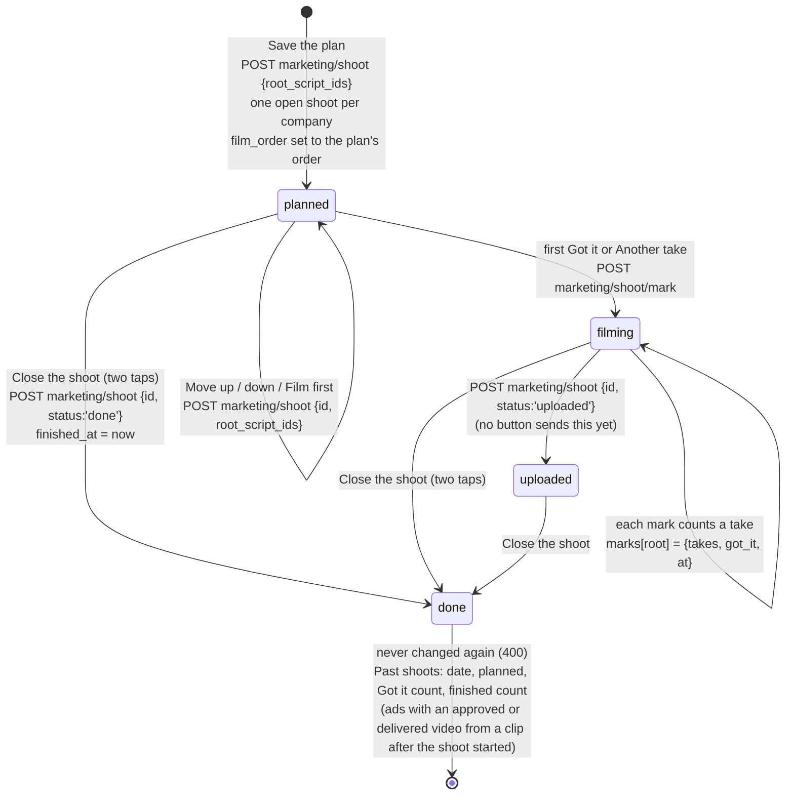
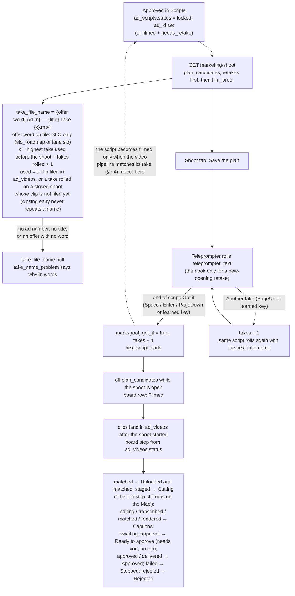
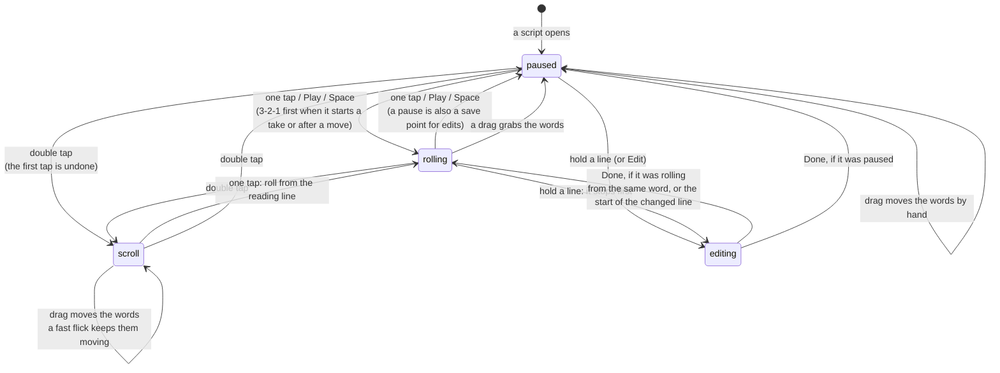
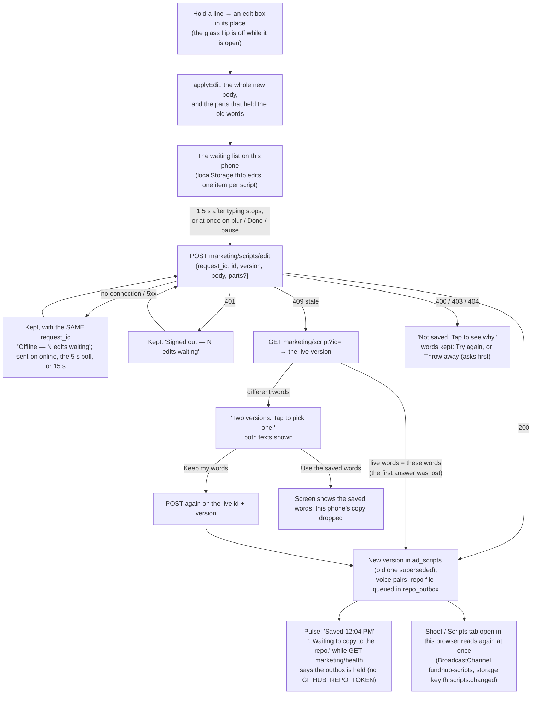

# Shoot Day flow (actual, from code)

Generated by hand from the code on branch `mm-x5-shoot-teleprompter` (unit X5), not from the spec, and extended on branch `mm-teleprompter-v2` (section 4). Files: `api/marketing/shoot.mjs`, `api/marketing/shoot/mark.mjs`, `src/marketing/shoot-store.mjs`, `src/marketing/shoot-plan.mjs`, `public/app/cc-tab-shoot.js`, `public/app/teleprompter.html` + `teleprompter.js` + `teleprompter-edits.js`, and the shipped edit route `api/marketing/scripts/edit.mjs` (`editScript` in `src/marketing/scripts-store.mjs`). Table: `marketing_shoots` (migration 411, U04).

Yardstick (the intended flow, per the plan's intended-journey note): spec `docs/specs/marketing-machine-2026-10-04.md` §1, §8.1, §8.2, the design `docs/specs/command-center-design-2026-10-05.md` §3.4, and the owner needs `docs/specs/teleprompter-requirements-2026-10-06.md`. No `-intended.md` file was read or changed.

Every arrow below is **UNVERIFIED on production**: proved in GitHub CI (scratch Postgres) and in a mocked browser only. Nothing is live until a ship.

## 1. A shoot, from plan to closed

## 2. One script on Shoot Day

## 3. Offline and repeats

- Every Save and every mark carries a fresh `request_id`. A repeated `request_id` answers the first save again and writes nothing (`withRequest`, `src/marketing/http.mjs`).
- The teleprompter keeps a mark it could not send (no connection, or signed out) in this phone's storage and sends it, with the same `request_id`, when the connection or the sign-in comes back. So a press is never counted twice and never lost.

## 4. The teleprompter v2: touch, edit on the fly, the change pulse

Owner needs, 2026-10-06. Same page, same routes: no route was added or changed. Proved in a mocked browser at iPhone (390 x 844, touch) and iPad (1024 x 1366, touch) sizes (`e2e/teleprompter-touch.spec.mjs`) and in unit tests (`src/ui/teleprompter.test.mjs`, `src/ui/teleprompter-edits.test.mjs`). **UNVERIFIED on a real iPhone or iPad and on production.**

### 4a. What a finger does (`gestureStep` in `teleprompter.js`)

Bluetooth remote and keyboard keys are unchanged (v1's keys, Learn remote). "Tap a word to start there" (spec §8.1, v1) is replaced by the owner's tap rule: drag the word to the reading line and tap.

### 4b. One edit, from the box to the repo

- The database version is the memory. The repo file follows through the outbox, which is held until `GITHUB_REPO_TOKEN` exists; the pulse says so.
- History (the History button, or tap the pulse): `GET marketing/script?id=` — every version newest first, who (from `source`: Chris, The machine, An agent, Imported), when, the words out (red) and in (green), and "In the repo." / "Not in the repo yet." Edits still on this phone show on top.
- The 5-second shoot poll never redraws under the edit box, and an edit still waiting on this phone wins over what the server sends. Words changed elsewhere redraw only while nothing rolls, keeping the place.

### 4c. The rig

- iPad (wider than 700 and taller than 600): 64 px words by default, one row of controls, every sheet opens as a side drawer. Phone on its side: one slim row.
- Mirror left-right and the optional upside-down flip stay per device (localStorage `fhtp.settings`), with the new Line width setting.
- Dark glass: black, white words, a red reading line. The pulse row (take file name, save status) never hides, even while it rolls.
- Next script (in film order, no mark) sits beside Play.

## Gaps against the intended flow (findings, not fixed here)

1. **Offer word for Book a call.** `marketing/ads/NAMING.md` names only `SLO`. Scripts for the `funding_dfy` offer (the `book_call` funnel) show "file name unknown" until Chris names a word. Safe default: no word is made up.
2. **The board's Assign, Retry and Use this cut / Re-film** (design §3.4) need `POST marketing/videos/assign|retry|hold-choice`, which are the Videos unit's routes. The board says so in one sentence; `can_retry` is always false.
3. **Animations and Loaded** steps (spec §8.2 table) have no `ad_videos` state yet (9.1a states `cut`, `animated`, `loaded` are not in migration 389). No row can reach them.
4. **A merged take shows under its master** (spec §8.2): joined takes are left off the board, not drawn under the master.
5. **Teleprompter tabs** (spec §8.1: Inbox, Shoot Day, Videos, Ideas, Rules) are not on the teleprompter page; those jobs live in the Command Center tabs (design §3.0). The page links back to the Command Center.
6. **Service worker, `window.FH_API_BASE` and the app's own sign-in form** (spec §8.1, for the iPhone app) are not built: there is no app yet. The page keeps its last answer in this phone's storage and rolls from it when offline.
7. **The shared review module** `public/app/marketing-review.js` (design §3.0) does not exist yet; the tab and the teleprompter each write their own request ids and offline queue.
8. **The Shoot tab is not on the page yet.** `public/app/cc-tab-shoot.js` registers with `window.FundhubCC` (the tab contract, `docs/specs/command-center-tabs.md`); the integrator adds its `<script>` tag when the frame (U34) lands.
9. **Past shoots show no loaded count** (design §3.4 item 7). Date, planned, Got it and finished are shown; loaded waits for a loaded state in `ad_videos` (same cause as gap 3). No number is made up.
10. **Another device hears a saved edit late.** The Shoot and Scripts tabs read again at once only in the same browser. On another device they read again when the tab is shown, when the page comes back after a minute away, or on the 5-minute reload. There is no server push.
11. **Camera** (requirements doc: front camera, mirrored, a preview that fades) is not on the web page. It is the native app's job (`tools/teleprompter-ios/`, spec §8.5); a web page camera may also cap below 4K on iPhone.
12. **Long press opens the keyboard on finger-up.** iPhone Safari opens the keyboard only inside a touch, so the edit box shows at once and the keyboard opens when the finger lifts (tapping the box also opens it). Not yet tried on a real iPhone.
