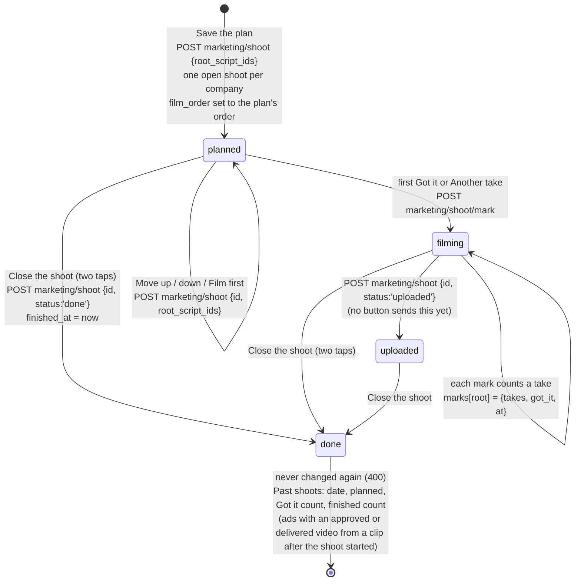
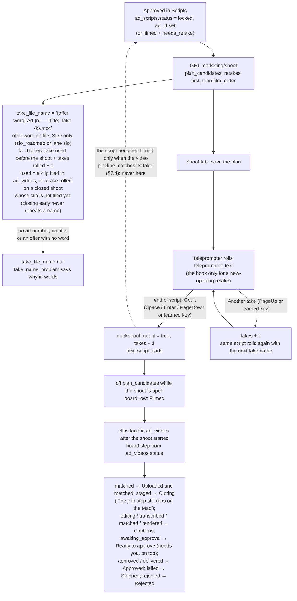

# Shoot Day flow (actual, from code)

Generated by hand from the code on branch `mm-x5-shoot-teleprompter` (unit X5), not from the spec. Files: `api/marketing/shoot.mjs`, `api/marketing/shoot/mark.mjs`, `src/marketing/shoot-store.mjs`, `src/marketing/shoot-plan.mjs`, `public/app/cc-tab-shoot.js`, `public/app/teleprompter.html` + `teleprompter.js`. Table: `marketing_shoots` (migration 411, U04).

Yardstick (the intended flow, per the plan's intended-journey note): spec `docs/specs/marketing-machine-2026-10-04.md` §1, §8.1, §8.2 and the design `docs/specs/command-center-design-2026-10-05.md` §3.4. No `-intended.md` file was read or changed.

Every arrow below is **UNVERIFIED on production**: proved in GitHub CI (scratch Postgres) and in a mocked browser only. Nothing is live until a ship.

## 1. A shoot, from plan to closed

## 2. One script on Shoot Day

## 3. Offline and repeats

- Every Save and every mark carries a fresh `request_id`. A repeated `request_id` answers the first save again and writes nothing (`withRequest`, `src/marketing/http.mjs`).
- The teleprompter keeps a mark it could not send (no connection, or signed out) in this phone's storage and sends it, with the same `request_id`, when the connection or the sign-in comes back. So a press is never counted twice and never lost.

## Gaps against the intended flow (findings, not fixed here)

1. **Offer word for Book a call.** `marketing/ads/NAMING.md` names only `SLO`. Scripts for the `funding_dfy` offer (the `book_call` funnel) show "file name unknown" until Chris names a word. Safe default: no word is made up.
2. **The board's Assign, Retry and Use this cut / Re-film** (design §3.4) need `POST marketing/videos/assign|retry|hold-choice`, which are the Videos unit's routes. The board says so in one sentence; `can_retry` is always false.
3. **Animations and Loaded** steps (spec §8.2 table) have no `ad_videos` state yet (9.1a states `cut`, `animated`, `loaded` are not in migration 389). No row can reach them.
4. **A merged take shows under its master** (spec §8.2): joined takes are left off the board, not drawn under the master.
5. **Teleprompter tabs** (spec §8.1: Inbox, Shoot Day, Videos, Ideas, Rules) are not on the teleprompter page; those jobs live in the Command Center tabs (design §3.0). The page links back to the Command Center.
6. **Service worker, `window.FH_API_BASE` and the app's own sign-in form** (spec §8.1, for the iPhone app) are not built: there is no app yet. The page keeps its last answer in this phone's storage and rolls from it when offline.
7. **The shared review module** `public/app/marketing-review.js` (design §3.0) does not exist yet; the tab and the teleprompter each write their own request ids and offline queue.
8. **The Shoot tab is not on the page yet.** `public/app/cc-tab-shoot.js` registers with `window.FundhubCC` (the tab contract, `docs/specs/command-center-tabs.md`); the integrator adds its `<script>` tag when the frame (U34) lands.
9. **Past shoots show no loaded count** (design §3.4 item 7). Date, planned, Got it and finished are shown; loaded waits for a loaded state in `ad_videos` (same cause as gap 3). No number is made up.
