<!-- GENERATED by scripts/journeys/generate.mjs — do not edit by hand. Run `npm run journeys`. -->

# white-label — actual

What the code **does** today for a signed-in `partner`.
Generated from the routing table and the gate on each handler, not from a spec.

> **Who this is, in the code:** db/migrations/036_partner_role.sql — "External white-label partner"; db/migrations/044_accounts.sql — "partner — white-label operator, sees their own book only"

## In one picture

```mermaid
flowchart TD
    START([white-label arrives]) --> AUTH{Signed in?}
    AUTH -->|No| OUT[Refused — 401 not signed in]
    AUTH -->|Yes| WHO{Recognised as partner?}
    WHO -->|No| DENY[Refused — 403 forbidden]
    WHO -->|Yes| CAN[Can reach]
    CAN --> A_adintel[adintel — 1 route]
    CAN --> A_auth[Signing in and out — 6 routes]
    CAN --> A_brand[brand — 1 route]
    CAN --> A_campaigns[Campaigns — 10 routes]
    CAN --> A_climate[climate — 2 routes]
    CAN --> A_contracts[contracts — 1 route]
    CAN --> A_creative[Creative Factory — 7 routes]
    CAN --> A_documents[Documents — 1 route]
    CAN --> A_gifts[gifts — 1 route]
    CAN --> A_hiring[Hiring — 1 route]
    CAN --> A_partner_marketing[partner-marketing — 5 routes]
    CAN --> A_public[public — 18 routes]
    CAN --> A_read[Reading data — 5 routes]
    CAN --> A_scripts[scripts — 1 route]
    CAN --> A_social[social — 6 routes]
    CAN --> A_top_level[Everything else — 7 routes]
    CAN --> A_trials[trials — 2 routes]
    CAN --> A_webhooks[Incoming webhooks — 1 route]
    WHO -->|Yes| CANT[Blocked — 210 routes]
    CANT --> B_affiliates[affiliates — 1 blocked]
    CANT --> B_analytics[analytics — 4 blocked]
    CANT --> B_auth[Signing in and out — 8 blocked]
    CANT --> B_banking[banking — 3 blocked]
    CANT --> B_blueprint[blueprint — 1 blocked]
    CANT --> B_chat[chat — 4 blocked]
    CANT --> B_company_brain[company-brain — 4 blocked]
    CANT --> B_consent[consent — 1 blocked]
    CANT --> B_content[content — 3 blocked]
    CANT --> B_dashboard[The dashboard — 7 blocked]
    CANT --> B_demo[demo — 2 blocked]
    CANT --> B_finance[Finance — 12 blocked]
    CANT --> B_hiring[Hiring — 7 blocked]
    CANT --> B_journeys[journeys — 2 blocked]
    CANT --> B_marketing[marketing — 30 blocked]
    CANT --> B_ops[ops — 2 blocked]
    CANT --> B_partner_brand[partner-brand — 1 blocked]
    CANT --> B_partners[partners — 1 blocked]
    CANT --> B_privacy[privacy — 1 blocked]
    CANT --> B_proxy[proxy — 2 blocked]
    CANT --> B_push[push — 3 blocked]
    CANT --> B_read[Reading data — 62 blocked]
    CANT --> B_repair[repair — 5 blocked]
    CANT --> B_scripts[scripts — 1 blocked]
    CANT --> B_social[social — 1 blocked]
    CANT --> B_staff[staff — 3 blocked]
    CANT --> B_top_level[Everything else — 37 blocked]
    CANT --> B_trials[trials — 2 blocked]
```

## What they can reach

**76 of 286 routes.**

| Route | Methods | Who the code lets in |
|---|---|---|
| `/api/adintel/board` | — | partner, staff |
| `/api/auth/login` | GET | anyone |
| `/api/auth/logout` | — | anyone |
| `/api/auth/magic-link` | — | anyone |
| `/api/auth/magic-link-verify` | — | anyone |
| `/api/auth/reset` | POST | anyone |
| `/api/auth/session` | — | anyone |
| `/api/brand/review` | POST | employees: owner, admin plus: partner |
| `/api/campaigns/action-log` | GET | partner, staff |
| `/api/campaigns/connections` | GET | partner, staff |
| `/api/campaigns/detail` | GET | partner, staff |
| `/api/campaigns/fatigue` | GET | partner, staff |
| `/api/campaigns/link-asset` | POST | partner, staff |
| `/api/campaigns/list` | GET | partner, staff |
| `/api/campaigns/meta-agency` | POST | partner, staff |
| `/api/campaigns/spend` | GET | partner, staff |
| `/api/campaigns/sync` | POST | partner, staff |
| `/api/campaigns/write` | POST | partner, staff |
| `/api/climate` | OPTIONS | anyone |
| `/api/climate/config` | — | anyone |
| `/api/climate/geocode` | OPTIONS | anyone |
| `/api/contracts/sign` | GET, POST | **not a sign-in** — signed link |
| `/api/creative/actions` | POST | partner, staff |
| `/api/creative/approvals` | GET | partner, staff |
| `/api/creative/brand-kits` | GET | partner, staff |
| `/api/creative/generate` | POST | partner, staff |
| `/api/creative/jobs` | GET | partner, staff |
| `/api/creative/library` | GET | partner, staff |
| `/api/creative/run` | POST | partner, staff |
| `/api/documents/:id` | HEAD | **not a sign-in** — signed link |
| `/api/gifts/message-blaster` | GET, HEAD | staff, affiliate, partner |
| `/api/health` | — | anyone |
| `/api/hiring/apply` | GET, POST | anyone |
| `/api/inngest` | — | **not a sign-in** — Inngest request signing |
| `/api/org-brand` | GET, PUT | staff, partner, affiliate, client |
| `/api/partner-brand` | GET, PUT | employees: owner, admin plus: partner |
| `/api/partner-marketing/copy-history` | GET, POST | employees: owner, admin plus: partner |
| `/api/partner-marketing/enable` | GET, POST | employees: owner, admin plus: partner |
| `/api/partner-marketing/generate-copy` | POST | employees: owner, admin plus: partner |
| `/api/partner-marketing/generate-logo` | POST | employees: owner, admin plus: partner |
| `/api/partner-marketing/usage` | GET | employees: owner, admin plus: partner |
| `/api/partner-pages` | GET, PATCH, POST | employees: owner, admin plus: partner |
| `/api/public/ad-video-approve` | — | anyone |
| `/api/public/affiliate-click` | POST | anyone |
| `/api/public/climate-match` | GET, POST | anyone |
| `/api/public/education-enroll` | POST | anyone |
| `/api/public/eeo-survey` | GET, POST | anyone |
| `/api/public/funnel-checkout` | GET, POST | anyone |
| `/api/public/optimize` | GET, POST | anyone |
| `/api/public/partner-apply` | POST | anyone |
| `/api/public/partner-page` | GET | anyone |
| `/api/public/rb2b-webhook` | — | anyone |
| `/api/public/slo-checkout` | — | anyone |
| `/api/public/slo-interest` | — | anyone |
| `/api/public/slo-pull` | POST | anyone |
| `/api/public/slo-repair-checkout` | — | anyone |
| `/api/public/slo-status` | — | anyone |
| `/api/public/survey-submit` | POST | anyone |
| `/api/public/unsubscribe` | — | **not a sign-in** — signed link |
| `/api/public/vsl-watch` | OPTIONS, POST | anyone |
| `/api/read/company-brain-affiliate` | POST | employees: affiliate, partner plus: affiliate, partner |
| `/api/read/partner-home-tiles` | GET | partner, staff |
| `/api/read/partner-production` | GET | partner, staff |
| `/api/read/partner-training` | GET | partner, staff |
| `/api/read/partners` | GET | employees: owner, admin, sales_manager plus: partner |
| `/api/scripts/list` | GET | partner, staff |
| `/api/social/channels` | GET | partner, staff |
| `/api/social/generate` | POST | partner, staff |
| `/api/social/posts` | GET, POST | employees: owner, admin plus: partner |
| `/api/social/publish` | POST | partner, staff |
| `/api/social/schedule` | POST | partner, staff |
| `/api/social/settings` | GET, POST | employees: owner, admin plus: partner |
| `/api/soft-pull-approve` | GET, POST | **not a sign-in** — signed link |
| `/api/trials/dashboard` | GET | partner, staff |
| `/api/trials/eligibility` | POST | anyone |
| `/api/webhooks/:provider` | OPTIONS | **not a sign-in** — provider signature |

### Worth knowing

- **29 routes are genuinely open** — no sign-in needed, reachable by anyone and not by this journey in particular: `/api/auth/login`, `/api/auth/logout`, `/api/auth/magic-link`, `/api/auth/magic-link-verify`, `/api/auth/reset`, `/api/auth/session`, `/api/climate`, `/api/climate/config`, `/api/climate/geocode`, `/api/health`, `/api/hiring/apply`, `/api/public/ad-video-approve`, `/api/public/affiliate-click`, `/api/public/climate-match`, `/api/public/education-enroll`, `/api/public/eeo-survey`, `/api/public/funnel-checkout`, `/api/public/optimize`, `/api/public/partner-apply`, `/api/public/partner-page`, `/api/public/rb2b-webhook`, `/api/public/slo-checkout`, `/api/public/slo-interest`, `/api/public/slo-pull`, `/api/public/slo-repair-checkout`, `/api/public/slo-status`, `/api/public/survey-submit`, `/api/public/vsl-watch`, `/api/trials/eligibility`. These are the sign-in routes and the health check.
- **6 routes need no sign-in but are NOT open.** `/api/contracts/sign` (signed link), `/api/documents/:id` (signed link), `/api/inngest` (Inngest request signing), `/api/public/unsubscribe` (signed link), `/api/soft-pull-approve` (signed link), `/api/webhooks/:provider` (provider signature). Anyone can call these, but a caller without the right signature is refused.

## What they are blocked from

**210 of 286 routes.**

| Route | Methods | Who the code lets in |
|---|---|---|
| `/api/ad-videos` | GET | owner, admin |
| `/api/affiliates/refer` | POST | client |
| `/api/agent-call` | POST | owner, admin, sales_manager, closer, setter, inquiry_specialist |
| `/api/agents` | POST | owner, admin, funding_advisor, closer, inquiry_specialist, setter, sales_manager, csm |
| `/api/ai-bureau-config` | POST | owner, admin, funding_advisor |
| `/api/analytics/clickfunnels-connect` | POST | owner, admin, funding_advisor, closer, inquiry_specialist, setter, sales_manager, csm |
| `/api/analytics/clickfunnels-sync` | POST | owner, admin, funding_advisor, closer, inquiry_specialist, setter, sales_manager, csm |
| `/api/analytics/youtube-connect` | POST | owner, admin, funding_advisor, closer, inquiry_specialist, setter, sales_manager, csm |
| `/api/analytics/youtube-sync` | POST | owner, admin, funding_advisor, closer, inquiry_specialist, setter, sales_manager, csm |
| `/api/applications` | GET, POST | owner, admin, funding_advisor, closer, inquiry_specialist, setter, sales_manager, csm |
| `/api/auth/admin-reset` | POST | owner, admin |
| `/api/auth/authorized-rep` | GET, POST | owner, admin |
| `/api/auth/authorized-rep-file` | GET, POST | client |
| `/api/auth/invite` | POST | owner, admin |
| `/api/auth/send-portal-link` | POST | owner, admin |
| `/api/auth/staff-role` | POST | owner, admin |
| `/api/auth/staff-update` | POST | owner, admin |
| `/api/auth/suspend` | POST | owner, admin |
| `/api/banking/accounts` | GET, POST | owner, admin, funding_advisor, closer, inquiry_specialist, setter, sales_manager, csm |
| `/api/banking/revoke` | GET, POST | owner, admin |
| `/api/banking/sync-accounts` | POST | owner, admin, sales_manager |
| `/api/blueprint/staff-actions` | POST | owner, admin, funding_advisor, closer, inquiry_specialist, setter, sales_manager, csm |
| `/api/bookings` | GET | staff |
| `/api/call-outcomes` | POST | owner, admin, closer, sales_manager |
| `/api/chat/ask` | POST | owner, admin, funding_advisor, closer, inquiry_specialist, setter, sales_manager, csm |
| `/api/chat/messages` | GET, POST | staff |
| `/api/chat/peers` | GET | owner, admin, funding_advisor, closer, inquiry_specialist, setter, sales_manager, csm |
| `/api/chat/portal-message` | GET, POST | client |
| `/api/client-notes` | POST | owner, admin, funding_advisor, closer, inquiry_specialist, setter, sales_manager, csm |
| `/api/closer-deck` | POST | closer, sales_manager, owner, admin |
| `/api/commission-rules` | GET, POST | owner, admin, sales_manager |
| `/api/commissions` | POST | owner, admin, sales_manager |
| `/api/company-brain/reviews` | GET, POST | owner |
| `/api/company-brain/sync` | GET, POST | owner, admin, sales_manager |
| `/api/company-brain/threads` | GET, POST | owner, admin, funding_advisor, closer, inquiry_specialist, setter, sales_manager, csm |
| `/api/company-brain/upload` | GET, POST | owner, admin, funding_advisor, closer, inquiry_specialist, setter, sales_manager, csm |
| `/api/consent/capture` | GET, POST | employees: owner, admin, closer, funding_advisor plus: client |
| `/api/content/tiles` | GET, POST | owner, admin |
| `/api/content/upload` | POST | owner, admin |
| `/api/content/welcome-video` | GET, HEAD | staff, client |
| `/api/contracts` | POST | owner, admin, funding_advisor, closer, inquiry_specialist, setter, sales_manager, csm |
| `/api/customer-insights` | POST | owner, admin, funding_advisor, closer, inquiry_specialist, setter, sales_manager, csm |
| `/api/dashboard/client` | — | staff |
| `/api/dashboard/client-archive` | POST | staff |
| `/api/dashboard/clients` | — | staff |
| `/api/dashboard/kpis` | — | staff |
| `/api/dashboard/pipeline` | — | staff |
| `/api/dashboard/pipeline-counts` | — | staff |
| `/api/dashboard/seed` | — | admin, owner |
| `/api/demo/mode` | DELETE, GET, POST | owner, admin |
| `/api/demo/simulate` | DELETE, POST | owner, admin |
| `/api/documents-download` | GET | staff, client |
| `/api/documents-upload` | POST | staff, client |
| `/api/finance/alerts` | GET, POST | owner, admin, funding_advisor, closer, inquiry_specialist, setter, sales_manager, csm |
| `/api/finance/bank-accounts` | GET, POST | owner, admin, sales_manager |
| `/api/finance/bills` | GET, POST | owner, admin, sales_manager |
| `/api/finance/cards` | GET, POST | owner, admin, sales_manager |
| `/api/finance/cashflow` | GET, POST | owner, admin, sales_manager |
| `/api/finance/crs-pull` | POST | owner, admin, closer, funding_advisor |
| `/api/finance/entities` | GET, POST | owner, admin, funding_advisor, closer, inquiry_specialist, setter, sales_manager, csm |
| `/api/finance/liabilities` | GET, POST | owner, admin, funding_advisor, closer, inquiry_specialist, setter, sales_manager, csm |
| `/api/finance/model` | POST | owner, admin, funding_advisor, closer, inquiry_specialist, setter, sales_manager, csm |
| `/api/finance/paydown-simulator` | POST | owner, admin, funding_advisor, closer, inquiry_specialist, setter, sales_manager, csm |
| `/api/finance/soft-pull` | GET, POST | employees: owner, admin, closer, funding_advisor plus: client |
| `/api/finance/subscriptions` | GET, POST | owner, admin, sales_manager |
| `/api/hiring/application` | GET | owner, admin |
| `/api/hiring/bench` | GET | owner, admin |
| `/api/hiring/candidates` | GET | owner, admin |
| `/api/hiring/decide` | POST | owner, admin |
| `/api/hiring/decisions` | GET | owner, admin |
| `/api/hiring/funnel` | GET | owner, admin |
| `/api/hiring/postings` | GET | owner, admin |
| `/api/inquiries` | GET, POST | staff |
| `/api/inquiry` | — | inquiry_specialist, admin, owner |
| `/api/inquiry-cases` | POST | owner, admin, funding_advisor, closer, inquiry_specialist, setter, sales_manager, csm |
| `/api/journeys` | GET, PUT | owner, admin |
| `/api/journeys/ask` | POST | owner, admin |
| `/api/journeys/run` | POST | owner, admin, sales_manager |
| `/api/lender-observations` | POST | owner, admin, funding_advisor |
| `/api/lenders` | POST | owner, admin, funding_advisor |
| `/api/marketing-flags` | POST | owner, admin, sales_manager |
| `/api/marketing/ad` | GET | owner, admin |
| `/api/marketing/ads` | GET | owner, admin |
| `/api/marketing/angles` | GET | owner, admin |
| `/api/marketing/batches` | GET | owner, admin |
| `/api/marketing/batches/write-now` | POST | owner, admin |
| `/api/marketing/funnel` | GET | owner, admin |
| `/api/marketing/funnels` | GET, POST | owner, admin |
| `/api/marketing/funnels/build` | POST | owner, admin |
| `/api/marketing/funnels/create` | POST | owner, admin |
| `/api/marketing/funnels/push-live` | POST | owner, admin |
| `/api/marketing/funnels/rename` | POST | owner, admin |
| `/api/marketing/funnels/stats` | GET | owner, admin |
| `/api/marketing/health` | GET | owner, admin |
| `/api/marketing/ideas` | GET, POST | owner, admin |
| `/api/marketing/jobs/retry` | POST | owner, admin |
| `/api/marketing/meta/load` | POST | owner, admin |
| `/api/marketing/meta/load-status` | GET | owner, admin |
| `/api/marketing/offer/generate` | GET, POST | owner, admin |
| `/api/marketing/rules` | GET, POST | owner, admin |
| `/api/marketing/script` | GET | owner, admin |
| `/api/marketing/scripts` | GET | owner, admin |
| `/api/marketing/scripts/approve` | POST | owner, admin |
| `/api/marketing/scripts/edit` | POST | owner, admin |
| `/api/marketing/scripts/fix` | POST | owner, admin |
| `/api/marketing/scripts/order` | POST | owner, admin |
| `/api/marketing/scripts/reject` | POST | owner, admin |
| `/api/marketing/settings` | GET, POST | owner, admin |
| `/api/marketing/shoot` | GET, POST | owner, admin |
| `/api/marketing/shoot/mark` | POST | owner, admin |
| `/api/marketing/today` | GET | owner, admin |
| `/api/message-templates` | POST | owner, admin, funding_advisor, closer, inquiry_specialist, setter, sales_manager, csm |
| `/api/messages` | POST | staff |
| `/api/messages-outbound` | GET, POST | owner, admin, funding_advisor, closer, inquiry_specialist, setter, sales_manager, csm |
| `/api/ops/hire-closer` | POST | owner, admin |
| `/api/ops/weekly-brief` | POST | owner, admin, funding_advisor, closer, inquiry_specialist, setter, sales_manager, csm |
| `/api/paid-services` | GET, POST | staff, client |
| `/api/partner-addons` | GET, POST | owner, admin |
| `/api/partner-brand/verify-domain` | POST | owner, admin |
| `/api/partners/approve` | POST | owner, admin |
| `/api/payment-links` | GET, POST | owner, admin, sales_manager, closer |
| `/api/pii` | GET, POST | owner, admin, inquiry_specialist, funding_advisor |
| `/api/pipeline-cards` | POST | owner, admin, funding_advisor, closer, inquiry_specialist, setter, sales_manager, csm |
| `/api/pipeline-clients` | POST | owner, admin, funding_advisor, closer, inquiry_specialist, setter, sales_manager, csm |
| `/api/privacy/erasure` | GET, POST | owner, admin |
| `/api/products` | POST | owner, admin, sales_manager |
| `/api/proxy/end` | POST | owner, funding_advisor |
| `/api/proxy/launch` | POST | owner, funding_advisor |
| `/api/push/key` | GET | client |
| `/api/push/subscribe` | GET, POST | client |
| `/api/push/unsubscribe` | DELETE, POST | client |
| `/api/read/ad-attribution` | GET | owner, admin, funding_advisor, closer, inquiry_specialist, setter, sales_manager, csm |
| `/api/read/ad-books` | GET | owner, admin, funding_advisor, closer, inquiry_specialist, setter, sales_manager, csm |
| `/api/read/ad-spine` | GET | owner, admin, funding_advisor, closer, inquiry_specialist, setter, sales_manager, csm |
| `/api/read/affiliate-portal` | GET | staff, affiliate, client |
| `/api/read/affiliates` | GET | employees: owner, admin, sales_manager plus: affiliate |
| `/api/read/agent-context` | — | owner, admin, funding_advisor, closer, inquiry_specialist, setter, sales_manager, csm |
| `/api/read/agent-shadow-log` | — | owner, admin, funding_advisor, closer, inquiry_specialist, setter, sales_manager, csm |
| `/api/read/agents` | GET | owner, admin, funding_advisor, closer, inquiry_specialist, setter, sales_manager, csm |
| `/api/read/ai-bureau-config` | GET | owner, admin, funding_advisor, closer, inquiry_specialist, setter, sales_manager, csm |
| `/api/read/bank-inbox` | GET | owner, admin, funding_advisor, closer, inquiry_specialist, setter, sales_manager, csm |
| `/api/read/banking-surface` | GET | owner, admin, sales_manager |
| `/api/read/blueprint-combined-approval` | GET | owner, admin, funding_advisor, closer, inquiry_specialist, setter, sales_manager, csm |
| `/api/read/call-outcomes` | GET | owner, admin, funding_advisor, closer, inquiry_specialist, setter, sales_manager, csm |
| `/api/read/client-progress` | GET | staff, client |
| `/api/read/closer-call` | GET | owner, admin, funding_advisor, closer, inquiry_specialist, setter, sales_manager, csm |
| `/api/read/closer-deck` | GET | closer, sales_manager, owner, admin |
| `/api/read/closer-now` | GET | owner, admin, funding_advisor, closer, inquiry_specialist, setter, sales_manager, csm |
| `/api/read/commissions` | GET | owner, admin, sales_manager |
| `/api/read/company-activity` | GET | owner, admin, funding_advisor, closer, inquiry_specialist, setter, sales_manager, csm |
| `/api/read/company-brain` | POST | owner, admin, funding_advisor, closer, inquiry_specialist, setter, sales_manager, csm |
| `/api/read/contracts` | GET | owner, admin, funding_advisor, closer, inquiry_specialist, setter, sales_manager, csm |
| `/api/read/conversations` | GET | owner, admin, funding_advisor, closer, inquiry_specialist, setter, sales_manager, csm |
| `/api/read/csm-queue` | GET | owner, admin, funding_advisor, closer, inquiry_specialist, setter, sales_manager, csm |
| `/api/read/customer-insights` | GET | owner, admin, funding_advisor, closer, inquiry_specialist, setter, sales_manager, csm |
| `/api/read/deal-math` | GET | owner, admin, funding_advisor, closer, inquiry_specialist, setter, sales_manager, csm |
| `/api/read/documents` | GET | owner, admin, funding_advisor, closer, inquiry_specialist, setter, sales_manager, csm |
| `/api/read/eeo-aggregate` | GET | owner, admin |
| `/api/read/entitlements` | GET | employees: owner, admin, funding_advisor, closer, inquiry_specialist, setter, sales_manager, csm plus: client |
| `/api/read/failed-events` | GET | owner, admin |
| `/api/read/finance-ask` | POST | owner, admin, funding_advisor, closer, inquiry_specialist, setter, sales_manager, csm |
| `/api/read/finance-command` | GET | owner, admin, funding_advisor, closer, inquiry_specialist, setter, sales_manager, csm |
| `/api/read/finance-os` | GET | owner, admin, funding_advisor, closer, inquiry_specialist, setter, sales_manager, csm |
| `/api/read/finance-os-suggestions` | GET | owner, admin, funding_advisor, closer, inquiry_specialist, setter, sales_manager, csm |
| `/api/read/funding-rounds` | GET | owner, admin, funding_advisor, closer, inquiry_specialist, setter, sales_manager, csm |
| `/api/read/funnel-pages` | GET | owner, admin, funding_advisor, closer, inquiry_specialist, setter, sales_manager, csm |
| `/api/read/inbox` | GET | owner, admin, funding_advisor, closer, inquiry_specialist, setter, sales_manager, csm |
| `/api/read/inquiries` | GET | owner, admin, funding_advisor, closer, inquiry_specialist, setter, sales_manager, csm |
| `/api/read/inquiry-cases` | GET | owner, admin, inquiry_specialist, funding_advisor |
| `/api/read/invoices` | GET | owner, admin, sales_manager |
| `/api/read/lender-matches` | GET | owner, admin, funding_advisor, closer, inquiry_specialist, setter, sales_manager, csm |
| `/api/read/lender-observations` | GET | owner, admin, funding_advisor |
| `/api/read/lenders` | GET | owner, admin, funding_advisor |
| `/api/read/message-templates` | GET | owner, admin, funding_advisor, closer, inquiry_specialist, setter, sales_manager, csm |
| `/api/read/messages` | GET | owner, admin, funding_advisor, closer, inquiry_specialist, setter, sales_manager, csm |
| `/api/read/money-map` | GET | owner, admin, funding_advisor, closer, inquiry_specialist, setter, sales_manager, csm |
| `/api/read/my-numbers` | GET | owner, admin, closer, sales_manager |
| `/api/read/ops-pulse` | GET | owner, admin |
| `/api/read/portal-contracts` | GET | staff, client |
| `/api/read/portal-summary` | GET | staff, client |
| `/api/read/products` | GET | owner, admin, funding_advisor, closer, inquiry_specialist, setter, sales_manager, csm |
| `/api/read/proxy-sessions` | GET | owner, funding_advisor |
| `/api/read/repair-cases` | GET | owner, admin, inquiry_specialist, funding_advisor |
| `/api/read/sales-floor` | GET | owner, admin, sales_manager |
| `/api/read/search` | GET | owner, admin, funding_advisor, closer, inquiry_specialist, setter, sales_manager, csm |
| `/api/read/slo-connections` | GET | owner, admin |
| `/api/read/staff` | GET | owner, admin, sales_manager |
| `/api/read/tradelines` | — | owner, admin, funding_advisor, closer, inquiry_specialist, setter, sales_manager, csm |
| `/api/read/transactions` | GET | owner, admin, funding_advisor, closer, inquiry_specialist, setter, sales_manager, csm |
| `/api/read/underwrite` | GET | owner, admin, funding_advisor, closer, inquiry_specialist, setter, sales_manager, csm |
| `/api/read/unrecorded-calls` | GET | owner, admin, funding_advisor, closer, inquiry_specialist, setter, sales_manager, csm |
| `/api/read/video-stats` | GET | owner, admin, funding_advisor, closer, inquiry_specialist, setter, sales_manager, csm |
| `/api/read/workflows` | GET | owner, admin, funding_advisor, closer, inquiry_specialist, setter, sales_manager, csm |
| `/api/repair/enroll` | POST | owner, admin, closer, inquiry_specialist |
| `/api/repair/exceptions` | GET, POST | owner, admin, inquiry_specialist |
| `/api/repair/generate` | POST | owner, admin, closer, inquiry_specialist |
| `/api/repair/inbound-mail` | POST | owner, admin, closer, inquiry_specialist |
| `/api/repair/send` | POST | owner, admin, funding_advisor, closer, inquiry_specialist, setter, sales_manager, csm |
| `/api/scripts/write` | POST | owner, admin, funding_advisor, closer, inquiry_specialist, setter, sales_manager, csm |
| `/api/shifts` | GET, POST | staff |
| `/api/slo-connections` | POST | owner, admin |
| `/api/social/oauth` | — | owner, admin, partner |
| `/api/staff/avatar` | GET, POST | any signed-in employee |
| `/api/staff/monitoring-consent` | POST | owner |
| `/api/staff/telemetry` | GET | owner, admin, sales_manager |
| `/api/tasks` | GET, PATCH | staff |
| `/api/training-progress` | POST | owner, admin |
| `/api/trials/convert` | POST | owner, admin |
| `/api/trials/provision` | POST | owner, admin |
| `/api/waypoint-tick` | POST | client |

## UNVERIFIED

_None — every route's gate was traced to its source._

## How to check this yourself

Every row above comes from two places, and you can open both:

- **Which routes exist:** the `ROUTES` map in `netlify/functions/api.mjs`. A handler
  missing from that map answers 404, so that map is the definition of what exists.
- **Who each one lets in:** the gate written at the top of each `api/…` handler.

Run `npm run journeys` to rebuild this file. `npm test` fails if it is out of date.
