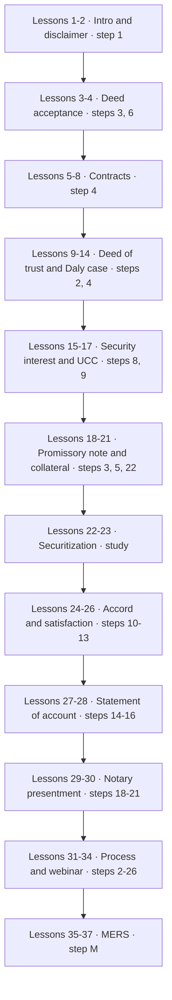
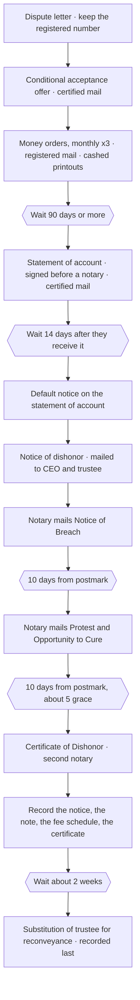
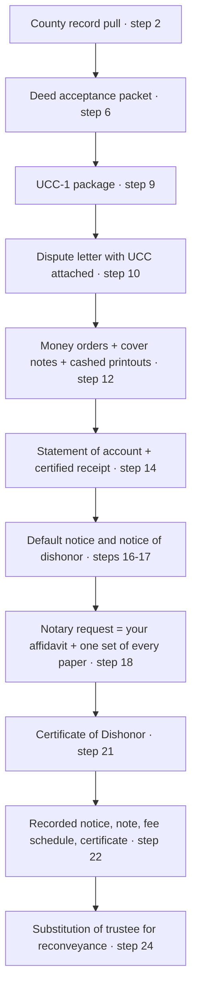
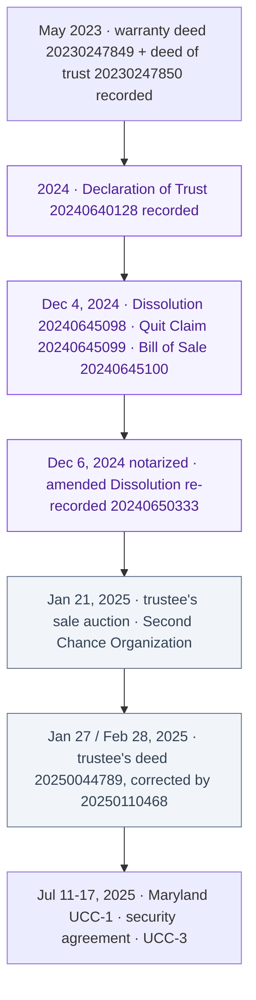
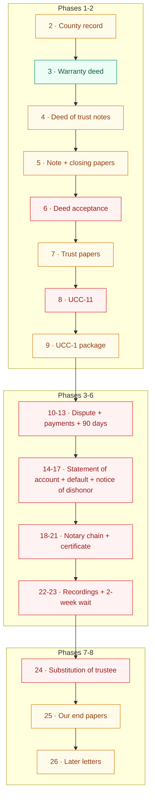

# Mortgage Re{CON}veyance — Step-by-Step SOP

## How to use this SOP

This is Bryan Stay Strong's Mortgage Re{CON}veyance course, turned into one ordered checklist that works for **any property in any state**.

- **Part A** is the process. Steps 1 to 26, in the order Bryan actually did the work.
- **Part A2** is the lesson guide. All 37 course lessons in course order, each pointing to the step it feeds.
- **Part B** is one worked example: Unit 4011, Scottsdale, Arizona. It shows which steps have papers and which are gaps.

**Where the order comes from.** The course teaches in one order (lessons 1 to 37). Bryan does the work in a different order. He walks his whole file, start to finish, in the 154-minute webinar (lesson 33), and answers order questions in its Q&A. Part A follows that order. Every step lists the lessons it comes from.

**Two kinds of steps.**

- **Course step** — Bryan says to do it. The words come from the course transcripts.
- **Our step** — a paper we used on our own that the course does not teach. It is placed where it does its job, and the reason is written on the step.

**Your state.** Bryan speaks from Texas. He cites the Texas Business and Commerce Code next to every Uniform Commercial Code (UCC) section. He says to find your own state's matching section and use your own county recorder. In his words: "you need to also find your state, if you're not in Texas" (lesson 28).

**Bryan's own disclaimer (lesson 2).** He says he is not an attorney, does not give legal advice, and teaches from information and his own experience. Lesson 14 adds his rule for students: understand each step before you do it.

**How each step is laid out.** Each step lists what Bryan says to do and when it is done. Where they apply, it also lists your state, the documents, and the templates.

**Sources.** Course transcripts in `credentials/drive-course-docs-temp/thinkific-export/course-material/` (from `Bryan-Stay-Strong-Thinkific-Course-Export.zip` in the [Reconveyance folder](https://drive.google.com/drive/folders/1coNo39Vbm7830hyOct-Gcn23UWHqYElF)). Templates in `credentials/drive-course-docs-temp/`. Example files in `credentials/mortgage-recon-playbook/maricopa/` and `credentials/drive-course-docs-temp/INDEX.txt`.

---

## The whole process on one page

| Step | What you do | Who signs or mails | Wait after | Lessons |
|---|---|---|---|---|
| **Phase 1 — Get ready** | | | | |
| 1 | Read the disclaimer and intro | — | — | 1, 2, 14 |
| 2 | Pull the full county record for the property | You | — | 12, 33 |
| 3 | Read the warranty deed | You | — | 3, 21 |
| 4 | Read the deed of trust and check the contract | You | — | 5–12, 33 |
| 5 | Get the note and the closing papers | You ask the lender | — | 18, 21, 33 |
| **Phase 2 — Accept and secure** | | | | |
| 6 | Accept the deed and record the acceptance | You sign, notary, county records | — | 3, 4, 8, 33 |
| 7 | *Our step:* put the property in the trust | You | — | (33) |
| 8 | Get a certified UCC-11 search | You, Secretary of State | — | 16, 17, 33 |
| 9 | Record and file the UCC-1 package | You, notary, county, Secretary of State | — | 15, 16, 33 |
| **Phase 3 — Dispute and pay** | | | | |
| 10 | Send the bona fide dispute letter | You sign and seal | 15–90 day window | 26, 33 |
| 11 | Send the offer of conditional acceptance | You, certified mail | — | 33 |
| 12 | Pay by money order with the restrictive endorsement, each month | You, registered mail | monthly × 3 | 24–26, 33 |
| 13 | Wait | — | **90 days or more** | 26, 33 |
| **Phase 4 — Statement of account and default** | | | | |
| 14 | Send the statement of account request | You sign before a notary, certified mail | — | 27, 28, 33 |
| 15 | Wait for their signed answer | — | **14 days after they receive it** | 27, 28 |
| 16 | Send the default notice on the statement of account | You sign and seal | — | 28 |
| 17 | Send the notice of dishonor to the CEO and the trustee | You sign as trustor | 10 business days to release liens | 33 |
| **Phase 5 — Notary presentment** | | | | |
| 18 | Give the notary your request and one set of papers | You sign (your affidavit) | — | 29, 30, 33 |
| 19 | Notary mails the Notice of Breach | Notary | **10 days from postmark** | 30 |
| 20 | Notary mails the Notice of Protest and Opportunity to Cure | Notary | **10 days from postmark** (+ about 5 grace) | 30 |
| 21 | Notary issues the Certificate of Dishonor | Notary, then a second notary | — | 29, 30 |
| **Phase 6 — Record and wait** | | | | |
| 22 | Record the notice of dishonor, the promissory note, the fee schedule, and the certificate | You, county | — | 19, 33 |
| 23 | Wait | — | **about 2 weeks** | 33 |
| **Phase 7 — Reconveyance** | | | | |
| 24 | Record the substitution of trustee for reconveyance | You as trustor, new trustee | — | 11, 33 |
| 25 | *Our step:* our end papers (dissolution, reconveyance, revocation) | You | — | (33) |
| **Phase 8 — After** | | | | |
| 26 | Keep the whole file and answer later letters | You | — | 33 |
| M | *Optional:* MERS check | You | — | 35–37 |

---

## Master flowchart — course order (lessons 1–37)

The order the course teaches. Each box shows the steps in Part A it feeds.

## Diagram 1 — The doing order

```mermaid
flowchart TD
  subgraph P1["Phase 1 · Get ready"]
    S1["1 · Read disclaimer"] --> S2["2 · Pull county record"] --> S3["3 · Read warranty deed"] --> S4["4 · Read deed of trust"] --> S5["5 · Get note and closing papers"]
  end
  subgraph P2["Phase 2 · Accept and secure"]
    S6["6 · Accept the deed and record it"] --> S7["7 · Our step · property into trust"]:::ours --> S8["8 · Certified UCC-11 search"] --> S9["9 · Record and file UCC-1 package"]
  end
  subgraph P3["Phase 3 · Dispute and pay"]
    S10["10 · Bona fide dispute letter"] --> S11["11 · Offer of conditional acceptance"] --> S12["12 · Money orders, monthly x3"] --> S13{{"13 · Wait 90+ days"}}
  end
  subgraph P4["Phase 4 · Statement of account and default"]
    S14["14 · Statement of account request"] --> S15{{"15 · Wait 14 days"}} --> S16["16 · Default notice"] --> S17["17 · Notice of dishonor to CEO and trustee"]
  end
  subgraph P5["Phase 5 · Notary presentment"]
    S18["18 · Request to notary + one set"] --> S19["19 · Notice of Breach · 10 days"] --> S20["20 · Opportunity to Cure · 10 days"] --> S21["21 · Certificate of Dishonor"]
  end
  subgraph P6["Phase 6 · Record and wait"]
    S22["22 · Record notice, note, fee schedule, certificate"] --> S23{{"23 · Wait about 2 weeks"}}
  end
  subgraph P7["Phase 7 · Reconveyance"]
    S24["24 · Record substitution of trustee for reconveyance"] --> S25["25 · Our step · end papers"]:::ours
  end
  subgraph P8["Phase 8 · After"]
    S26["26 · Keep file · answer later letters"]
  end
  S5 --> S6
  S9 --> S10
  S13 --> S14
  S17 --> S18
  S21 --> S22
  S23 --> S24
  S25 --> S26
  classDef ours fill:#f5f3ff,stroke:#7c3aed,color:#4c1d95
```

## Diagram 2 — Papers and waiting periods

## Diagram 3 — Which paper feeds which

---

## Part A — The process, step by step

---

### Phase 1 — Get ready

### Step 1 — Read the disclaimer and the intro

**Course step.** Lessons 1 MortRe[CON] Intro, 2 Disclaimer, 14 Daly Case Example Conclusion.

**What Bryan says to do**

1. Watch the intro. He calls the course a change in how you think, with information and strategies.
2. Read his disclaimer. He says he is not an attorney and gives no legal advice. It is information and education, mostly his own experience.
3. Understand each step before you do it. Lesson 14: "don't do nothing you don't understand."
4. He says to reach out to him if you need help.

**Documents:** the notice-disclaimer download (listed on every lesson).

**Done when**

- [ ] Intro and disclaimer watched.
- [ ] You can say in one line what Bryan says the course is and is not.

---

### Step 2 — Pull the full county record for the property

**Course step.** Lessons 12 DOT Example, 33 Webinar.

**What Bryan says to do**

1. Go to your county records. Search by name. Every recorded document tied to that name comes up. It is public.
2. Walk the list from the first record to the last. In his words: "we're gonna go all the way through this [roll]." Each record is time-stamped.
3. To find the deed of trust, search by document type "deed of trust." He warns the type list has a typo.
4. Open each document and let it load.
5. Save copies of the recorded warranty deed and the recorded deed of trust. Note any assignment of the deed of trust (lesson 35 checks those).

**Your state:** use your own county recorder. His example is Henderson County, Texas (and Dallas County for his first property).

**Documents:** list of every recorded document for the property, with recorder number and date. Copies of the recorded warranty deed and deed of trust.

**Done when**

- [ ] A list of every recorded document for the property, with recorder number and date, is in the case folder.
- [ ] Copies of the recorded warranty deed and deed of trust are saved.

---

### Step 3 — Read the warranty deed

**Course step.** Lessons 3 Deed Acceptance, 21 Collateral.

**What Bryan says to do**

1. Know the three main papers in a home deal: the warranty deed, the deed of trust (called a mortgage in some states), and the promissory note.
2. Pull out your warranty deed and read it. Who gave it to you (grantor)? Who received it (grantee)? What did you pay? Lesson 21: the deed often shows $10.
3. Check the four parts of signing a deed: signed, sealed when needed, attested and acknowledged, delivered to the grantee.
4. Ask yourself: did you ever accept your deed? He says acceptance is the grantee's most important role. Without it, he says, the deed is not delivered and title does not pass.

**Your state:** he speaks from Texas and reads Texas Property Code 5.022(b). He says fact-check what is similar in your state.

**Documents:** your recorded warranty deed.

**Done when**

- [ ] You can name the grantor, the grantee, and the price on the deed.
- [ ] You checked the four signing parts.
- [ ] You know whether you ever accepted the deed.

---

### Step 4 — Read the deed of trust and check the contract

**Course step.** Lessons 5 Contract Elements, 6 Offer and Acceptance, 7 HolderInDue1, 8 Meeting Of the Minds, 9 DOT1, 10 DOT2, 11 DOT3, 12 DOT Example, 33 Webinar.

**What Bryan says to do**

1. Know the three parties: trustor (borrower), trustee, beneficiary (lender). A mortgage has only two. The trustee holds bare legal title with a power of sale.
2. Read the definitions first. Lesson 33: he says that is where the tricks are.
3. Find and write down: the trustor, the beneficiary, the trustee, and the note amount.
4. Read how the deed of trust defines "loan." Ask yourself what was actually loaned.
5. Go straight to the signature page. Who signed? Who did not? Did the trustee ever sign to accept? Whom does the notary block cover?
6. Contract checks (lessons 5–8):
   - Were you ever told of acceptance within 90 days? Is the recorded paper a contract, or only an offer?
   - Is there a signature or acknowledgment from the lender side, not just yours?
   - Who made the offer? Did you negotiate, or was it take it or leave it?
   - Read the Federal Trade Commission holder rule yourself (lesson 7).
7. Find out if a contract exists before you argue its terms (lesson 8).

**Your state:** the deed-of-trust state lists he reads include Arizona and Texas. In a mortgage state he says the method is the same, with two parties instead of three (lesson 33).

**Documents:** your recorded deed of trust. One notes sheet.

**Done when**

- [ ] A notes sheet names the trustor, trustee, beneficiary, and note amount.
- [ ] The "loan" definition is read and noted.
- [ ] The signature page is checked: who signed, who did not, and the notary block.
- [ ] The contract checks above are answered on the same sheet.

---

### Step 5 — Get the note and the closing papers

**Course step.** Lessons 18 Promissory Note Example, 21 Collateral, 33 Webinar.

**What Bryan says to do**

1. Ask the lender for a copy of the note they hold (lesson 18).
2. Check that copy: date, amount, payment address, maturity date, first payment date.
3. Check the signature page for a notary. His had none.
4. Check the last page for an endorsement: "pay to the order of … without recourse."
5. After closing, ask the loan officer for copies of the closing papers with everyone's signatures (lesson 33). If you are sent to the attorney named on the papers, reach out. Bryan called, left messages with the assistant, and sent emails, and no one called back.
6. Check your loan papers for an arbitration clause (lesson 21).

**Documents:** your request to the lender, the lender's copy of the note, your requests to the loan officer and attorney.

**Done when**

- [ ] A copy of the note is on file, or your written request is on file.
- [ ] The notary and endorsement checks are noted.
- [ ] Your closing-papers requests and any replies are in the folder.
- [ ] The arbitration clause question is answered.

---

### Study lessons — watch before Phase 3 (no papers)

These lessons explain Bryan's reasons. They produce no paper.

| Lesson | What to take from it | Used in step |
|---|---|---|
| 13 Daly case | A narrated clip: the jury found no lawful consideration. | background |
| 14 Daly conclusion | Look the case up yourself; do nothing you do not understand. | 1 |
| 15 Security Interest | A lender must attach (value, ownership, signed security agreement) and then perfect. | 9 |
| 16 UCC Financing Statement | Perfecting means filing a UCC-1 with the Secretary of State. Did they file one on your deal? | 8, 9 |
| 20 and 32 Richard Werner | The same interview clip, twice. He says banks buy your note; they do not lend money. | background |
| 22 Securitization Pt1 | A 1930 law review article. Bryan's point: the note and the mortgage must stay together. | background |
| 23 Securitization pt2 | FDIC Credit Card Securitization Manual, chapter 2. He says keep it as evidence. | background |
| 24–25 Accord & Satisfaction | UCC 3-311 and a 1992 Florida case. Dispute + payment-in-full wording + they cash it. | 12 |
| 27 SOA1 | UCC 9-210. They must sign back an approval or correction within 14 days. | 14 |
| 29 NotaryPre1 | UCC 3-505. A protest is a certificate of dishonor by a notary. Start with a presentment. | 18 |
| 31 Overstanding the Game | Mark Emory role play of a banker on the stand. The transcript ends before the remedy. | background |
| 34 Mortgage Process Explained | An unnamed speaker tells how a loan is sold, insured, and split by MERS. His list: securitization audit, Bloomberg report, sworn affidavit. The transcript is cut off. | background |

---

### Phase 2 — Accept and secure

### Step 6 — Accept the deed and record the acceptance

**Course step.** Lessons 3 Deed Acceptance, 4 Deed Acceptance Example, 8 Meeting Of the Minds, 33 Webinar. This is also on our own list of papers (deed of acceptance at the county recorder).

Bryan calls this the first step for everyone: "That's actually the first step is accepting that." (lesson 33). Lesson 8 says accept your property before you challenge anyone.

**What Bryan says to do**

1. Get a **certified copy** of your recorded deed from the county.
2. Write a one-page **Acknowledgment and Acceptance of Warranty Deed** (lesson 4 walks a real one):
   - Notice of confidentiality rights at the top. Strike any Social Security or driver's license number.
   - Title: acknowledgment and acceptance of (special) warranty deed.
   - Name each grantee.
   - Say you are recorded as the grantee on the deed.
   - Point to the attached certified copy for the property description.
   - Say it is your free will, act, and deed to accept the deed and your ownership.
   - Ask the recorder (register of deeds) to update the record. All rights reserved.
   - Close under your hand and seal.
3. **Notarize** it before you go to the county (lesson 33). He says a UPS store notary works, about $5.
4. **Record both together**, the acceptance on top of the certified copy.
5. If the clerk pushes back, stay calm and explain. If they refuse, ask for the reason **in writing**.

**Your state:** his example is a Dallas County, Texas cover page. He says the deed's name does not matter (warranty, grant, or any deed). Record at your own county recorder.

**Documents:** certified copy of the recorded deed, notarized acknowledgment and acceptance, recording receipt, recorded copy. A written refusal if the clerk says no.

**Done when**

- [ ] The acceptance and the certified deed are recorded together, and the recorder number is written down.
- [ ] The recorded copy and receipt are in the case folder.
- [ ] Or: the clerk's written reason for refusing is in the folder.

**Templates**

- `credentials/drive-course-docs-temp/Ack_Acceptance_Warranty_Deed.txt` — a filled sample for a different Florida property. It uses two witnesses and no notary. Bryan's lesson 33 version is notarized.
- `Jai_ACK_alt.txt` and `Jai_ACK_subfolder.txt` — exact copies of the same file.
- Course downloads not on this Mac: `Ack_Acceptance of Deed TEMP.docx` (lesson 4 page) and the acknowledgment-of-acceptance template from the warranty-deed track.

---

### Step 7 — Our step: put the property in the trust

**Our step.** The course does not teach these papers. Bryan's closest step is in lesson 33. Two days after his closing, his company granted all its personal and real property to his trust as secured party. The trust's lien went on a UCC financing statement. He also says: "You don't have to be in trust to do these type of stuff."

**What we do, in this order**

1. **Declaration of Trust** — creates the trust and names the trustee.
2. **Quit Claim Deed** — the current owner (person or company) deeds the property to the trust.
3. **Bill of Sale** — the current owner sells the property to the trust on paper.
4. Record each one at the county.

**Your state:** use your state's quit claim deed form and your county recorder.

**Documents:** declaration of trust, quit claim deed, bill of sale, recording receipts.

**Done when**

- [ ] All three are recorded, and each recorder number is on the property index.
- [ ] Names match across all three papers, letter for letter.

**Templates**

- `credentials/drive-course-docs-temp/recon-Arizona_Quit_Claim_Deed.pdf` — a recorded example.
- `credentials/drive-course-docs-temp/DeedAcceptance_Untitled.txt` — despite its name, this is the first page of a Florida warranty deed from a person to a trust (a different property).

**Order note:** in Bryan's file the grant to the trust came two days after closing, before the dispute letter. Keep this step before Phase 3.

---

### Step 8 — Get a certified UCC-11 search

**Course step.** Lessons 16 UCC Financing Statement, 17 UCC Filing, 33 Webinar.

**What Bryan says to do**

1. Find your state Secretary of State's **UCC-11 information request** form.
2. Fill it in with your information and follow the form's instructions.
3. Submit it to your state's Secretary of State.
4. Read what comes back: who, if anyone, has a perfected lien on you or your property.
5. Get a **certified copy** of the result (lesson 33).
6. Repeat it now and then. He says people sometimes file fake liens.

**Your state:** his example is the Texas Secretary of State. Use your own state's office.

**Documents:** UCC-11 request, certified search result.

**Done when**

- [ ] The certified UCC-11 result is in the case folder, with its date.

**Templates:** none on this Mac.

---

### Step 9 — Record and file the UCC-1 package

**Course step.** Lessons 15 Security Interest, 16 UCC Financing Statement, 33 Webinar.

**What Bryan says to do**

1. Put the package together: your **promissory note**, your **security agreement**, and the **financing statement**, all notarized.
2. Record the package at the **county first**. In his words: "You register first on the county level."
3. In Texas, a UCC on real property needs a real-property addendum.
4. On the UCC-1, put the **county document number** in the collateral section. The Secretary of State gets notice of the county recording, not the papers.
5. File the UCC-1 with the Secretary of State. Your trust (or you) is the secured party.
6. Lessons 15–16: the security agreement must describe the collateral exactly. The debtor name must be right, or the filing can be seriously misleading.

**Your state:** use your state's UCC-1 form. He says most states use the same form; New York's is different.

**If the county refuses to record:** lesson 33 says file it in your federal district court as a miscellaneous filing, get a certified copy, then take that to the county. Dallas County stopped taking his UCC filings. Henderson County takes them.

**Documents:** security agreement, promissory note copy, financing statement, real-property addendum (Texas), county recording receipt, Secretary of State filing receipt.

**Done when**

- [ ] The package has a county recorder number.
- [ ] The UCC-1 is filed with the Secretary of State, with that county number in the collateral section.
- [ ] Stamped copies and both numbers are in the case folder.

**Templates:** `credentials/drive-course-docs-temp/UCC_Security_Agreement.txt` — our own trust's security agreement text. It holds real account numbers, so treat it as an owner example, not a blank.

---

### Phase 3 — Dispute and pay (accord and satisfaction)

### Step 10 — Send the bona fide dispute letter

**Course step.** Lessons 26 Accord & Satisfaction pt3, 33 Webinar.

Bryan calls this "the first letter I sent them after closing" (lesson 33).

**What Bryan says to do**

1. Sign it as the settlor on behalf of your trust (or as yourself).
2. Attach your UCC financing statement from step 9.
3. Say no loan is registered under UCC Article 9 and no UCC-3 transfer was ever filed.
4. Ask them to prove they are the real party in interest. He cites Federal Rule of Civil Procedure 17.
5. Ask for three things:
   - a certified copy of the note, signed under penalty of perjury;
   - a certified copy of the deed of trust, signed the same way;
   - the place of business where they will receive payment.
6. Give them **not less than 15 and not more than 90 days**.
7. Warn them a payment in full, with a restrictive endorsement, is coming. Say no answer counts as agreement.
8. He listed the state comptroller and attorney general on the letter but did not send it to them.
9. Sign, seal, and send. Keep the registered mail number.
10. Lesson 26 adds: offer a settlement and ask where to send the payment.

**Documents:** the dispute letter, the attached financing statement, the mail receipt.

**Done when**

- [ ] A signed and sealed copy, with the financing statement attached, is in the folder.
- [ ] The mail receipt and number are in the folder.
- [ ] The 15-day and 90-day dates are written down.

**Templates:** none on this Mac.

---

### Step 11 — Send the offer of conditional acceptance

**Course step.** Lesson 33 Webinar.

**What Bryan says to do**

1. Send an **offer of conditional acceptance for settlement**. It tells them there is a problem, gives them time to fix it, and says what follows if they do not.
2. Send it by **certified mail**. His went March 1, 2022.
3. He calls this giving notice the right way: "a gentleman always gives notice."

The transcript does not make clear if this is the same paper as the dispute letter or a second one. Bryan's dates show two mailings: the dispute letter in February, the conditional acceptance on March 1.

**Documents:** the offer, the certified mail receipt.

**Done when**

- [ ] A copy and the certified receipt are in the folder.

**Templates:** none on this Mac.

---

### Step 12 — Pay by money order with the restrictive endorsement

**Course step.** Lessons 24–25 Accord & Satisfaction pt1–2 (the rule), 26 pt3, 33 Webinar.

**What Bryan says to do**

1. Pay with **postal money orders**. One money order holds $1,000 at most, so use more than one if needed.
2. **Front, memo line:** the restrictive endorsement. Payment in full satisfaction, made on condition that the obligation be cancelled. Add the loan number. Lesson 26 also adds his "redeeming lawful money" wording.
3. **Back:** "By acknowledgement and endorsement of this draft, the payee acknowledges full and final settlement of all sums owed … on account number ___."
4. Put the same wording on **every** money order.
5. Send a short **cover note** with each payment saying what it is for.
6. Send by **registered mail**. His first went March 2, 2022.
7. Pay **every month**. He did three months.
8. Check each money order's status online (serial number, post office, amount, then "view status") until it shows **cashed**. Save the printout.
9. The rule he reads (UCC 3-311, lesson 24): a good-faith payment in full, on a disputed amount, that they cash, with a clear payment-in-full statement.

**Your state:** he cites Texas Business and Commerce Code 3.311 next to UCC 3-311. Find your state's version.

**Documents:** a front-and-back copy of every money order, each cover note, registered mail receipts, "cashed" printouts.

**Done when**

- [ ] For every payment, the front-and-back copy, cover note, receipt, and "cashed" printout are in the folder.
- [ ] Three monthly payments are done.

**Templates:** none on this Mac. The exact wording is in lessons 26 and 33.

---

### Step 13 — Wait at least 90 days

**Course step.** Lessons 26, 33.

**What Bryan says to do**

1. Wait. Lesson 33: "it can't be no sooner than 90 days."
2. Lesson 26: in that time they either send the money back, or he treats it as accepted. He says they then must release their liens. He had not received a release when he recorded that lesson.

**Documents:** a dated note of when the 90 days started and ended. Any refund or lien release they send.

**Done when**

- [ ] 90 days have passed since the accord and satisfaction default, and the end date is written down.
- [ ] Any reply, refund, or release is saved.

---

### Phase 4 — Statement of account and default

### Step 14 — Send the statement of account request

**Course step.** Lessons 27 SOA1, 28 SOA2, 33 Webinar.

**What Bryan says to do**

1. Use UCC 9-210. "Authenticated" means signed.
2. Address it to a **named officer**, a living person, not just the company. He used the president/CEO.
3. Write a cover letter titled "Request Regarding a Statement of Account." Quote 9-210 and say they have 14 days to reply with a signed record.
4. Fill in the statement:
   - date, creditor, debtor, account number;
   - collateral (the property address) and parcel number;
   - beginning balance, amount paid, and the balance you believe is due;
   - a line that the information is true and correct.
5. **Sign it in front of a notary** (lesson 33).
6. Send it by **certified mail**. His was mailed April 25 (lesson 28) and delivered April 29, 2022 (lesson 33).
7. Lesson 27: one free reply every six months; extra replies can cost up to $25.

**Your state:** he cites Texas Business and Commerce Code 9.210(b)(1) next to UCC 9-210(b)(1). "You need to also find your state, if you're not in Texas."

**Documents:** cover letter, signed and notarized statement of account, certified mail receipt.

**Done when**

- [ ] The signed, notarized statement and cover letter are in the folder.
- [ ] The certified receipt is in the folder, and the delivery date is written down.

**Templates:** course downloads on lesson 28, not on this Mac: `RequestRegardingaStatementofAccount-230501-201448.pdf` and `Request4Accounting-230501-201337.pdf`.

---

### Step 15 — Wait 14 days for their signed answer

**Course step.** Lessons 27, 28, 33.

**What Bryan says to do**

1. They must sign and send back an approval or a correction within **14 days after they receive it**.
2. His deadline math: 3 days for mail + 2 weeks + 3 days for return mail + 1 day for a Sunday.
3. If no one signs and sends it back, he says your stated balance stands. His was zero.

**Documents:** a dated deadline note. Any reply they send.

**Done when**

- [ ] The deadline date is written down.
- [ ] It passed with no signed reply, or the reply is saved.

---

### Step 16 — Send the default notice on the statement of account

**Course step.** Lesson 28 SOA2.

**What Bryan says to do**

1. Title it a default on the statement of account request under 9-210. Send it to the same named officer.
2. Give the date you mailed the statement of account and the deadline date.
3. Say you never received the signed record you asked for.
4. Cite your state code next to UCC 9-210(b)(1). Quote the 14-day rule and the rule for a lender that claims no interest.
5. List what you already sent: the offer (by registered mail, with delivery date and time), the payments tendered and cashed, and the money orders with restrictive endorsements.
6. Say they failed to comply, so your statement stands (his: a zero balance). Ask them to adjust the account.
7. Sign it and add your seal. Send it. His is "as of May 20, 2022."

**Your state:** Texas 9.210(b)(1) in his example. Use your state's version.

**Documents:** the default notice, the mail receipt.

**Done when**

- [ ] The signed and sealed notice and its mail receipt are in the folder.

**Templates:** none on this Mac.

---

### Step 17 — Send the notice of dishonor to the CEO and the trustee

**Course step.** Lesson 33 Webinar.

**What Bryan says to do**

1. Write a **notice of dishonor for non-acceptance of the deed of trust contract offer**.
2. Head it: notice to agent is notice to principal.
3. Cite UCC 2-202 in the title. In the facts, cite UCC 2-206 (offer and acceptance) next to your state's version.
4. Address it to the lender's **CEO** (the agent) and to the **trustee** named in the deed of trust.
5. Statement of facts: no authenticated acceptance, no trustee or lender signature, neither was at closing.
6. Sign as the **trustor**, not the borrower. State that the powers given to the trustee and beneficiary are void for non-acceptance.
7. Tell the whole story: the conditional acceptance, the cashed payments, the statement of account default.
8. Add a demand for settlement and remedy: a signed release of all liens within **10 business days**, and a full refund by certified funds check with tracking.
9. Attach your **fee schedule**. Sign it.
10. Mail it directly to both people. He titled the mailed copy a "default notice." A copy is recorded later (step 22).

**How this relates to step 16:** they are two papers. Lesson 28's default notice on the statement of account is "as of May 20, 2022." Lesson 33's notice of dishonor is "as of May 23, 2022" and says "as mentioned in previous default notice."

**Your state:** he cites Texas Business and Commerce Code 2.206. Use your state's version.

**Documents:** the notice, the fee schedule, mail receipts for both recipients.

**Done when**

- [ ] Mail receipts for the CEO and the trustee are in the folder.
- [ ] The 10-business-day date is written down.

**Templates:** none on this Mac.

---

### Phase 5 — Notary presentment

Lesson 29 sets the rule: "first is always the presentment." Your mailed notices in Phases 3 and 4 are those presentments. Their silence is the dishonor. The notary is the third-party witness who proves it. Lesson 33: once they failed the statement of account, "I began the next process which was called the notary presentment."

### Step 18 — Give the notary your request and one set of papers

**Course step.** Lessons 29 NotaryPre1, 30 NotaryPre2, 33 Webinar.

**What Bryan says to do**

1. Find a notary who will do a notarial presentment. He says most notaries do not know this process, so you may have to explain it.
2. Write a **Request for Notarial Presentment** to the notary:
   - the notary's name and address, and the date;
   - the officer's name, the lender's name, and its main business address;
   - every paper you already sent, with the exact certified or registered mail details.
3. Give the notary **one full set** of everything you sent. Not one set per money order (lesson 33).
4. Ask the notary to follow up under her notary seal and send it to the named officer for you.
5. **Sign** the request. Your signed request counts as your **affidavit**.
6. Keep every mail receipt. He says the postmaster is a witness too.

**Your state:** the notary letters cite Texas Business and Commerce Code 3.505 next to UCC 3-505. "If you are not in Texas, you must find your state statute."

**Documents:** the signed request (affidavit), one full set of copies, all mail receipts.

**Done when**

- [ ] The notary has the signed request and the full set.
- [ ] A copy of what you gave the notary is in the folder.

**Templates:** `credentials/drive-course-docs-temp/Request_Notarial_Presentment.txt` — a filled Texas 2022 sample. Replace every name, date, and code section.

---

### Step 19 — The notary mails the Notice of Breach

**Course step.** Lesson 30.

**What the notary does (per Bryan)**

1. Titles it **Notice of Breach** (or notice of default).
2. Says the notary received a request by affidavit for a protest under the state code.
3. Says they dishonored your presentment (the statement of account), delivered as shown by certified mail receipts.
4. Attaches a copy of that presentment.
5. Says they may answer the notary within **10 days from the postmark**, and the notary will forward the answer.
6. The notary signs and mails it. You do not.

**Your state:** your state's code section goes next to the UCC cite, same as step 18.

**Documents:** the notary's letter and mail receipt.

**Done when**

- [ ] A copy and the receipt are in the folder.
- [ ] 10 days from the postmark have passed, with no real answer (or the answer is saved).

**Templates:** `credentials/drive-course-docs-temp/Notice_Breach.txt` — filled Texas sample.

---

### Step 20 — The notary mails the Notice of Protest and Opportunity to Cure

**Course step.** Lesson 30.

**What the notary does (per Bryan)**

1. After 10 days with no answer, mails the **Notice of Protest and Opportunity to Cure**. In his lesson 30 example it went out July 5.
2. Says the Notice of Breach went out and they did not accept or perform.
3. Says they are now in default and have stipulated to the terms of your presentment.
4. Gives **10 more days from the postmark** to cure, or a Certificate of Dishonor will issue.
5. He says the notary may give about **5 more days** of grace.

**Your state:** your state's version of UCC 3-505 (his: Texas 3.505).

**Documents:** the notary's letter and mail receipt.

**Done when**

- [ ] A copy and the receipt are in the folder.
- [ ] 10 days (plus any grace) have passed with no cure.

**Templates:** `credentials/drive-course-docs-temp/Opportunity_Cure.txt` — filled Texas sample.

---

### Step 21 — The notary issues the Certificate of Dishonor

**Course step.** Lessons 29, 30.

**What the notary does (per Bryan)**

1. Issues the **Certificate of Dishonor**, naming herself as the one all mail goes to.
2. Lists both notices and that each gave 10 days.
3. States no response reached the notary.
4. States she interviewed you, and attaches your affidavit (your step 18 request).
5. States they dishonored by non-acceptance or non-performance and assented to the terms.
6. Signs it as the **third-party witness**.
7. A **different notary** notarizes the first notary's signature. Two notaries in all.
8. You add your information and attach your affidavit.

**Your state:** UCC 3-505 next to your state's version (his: Texas 3.505).

**Documents:** the signed certificate with the second notarization and your affidavit attached.

**Done when**

- [ ] The certificate is signed by the first notary and notarized by a second notary.
- [ ] Your affidavit is attached.

**Templates:** `credentials/drive-course-docs-temp/Cert_Dishonor.txt` — filled Texas sample. It calls the first notary letter "Notice of Dishonor"; the step 19 template is titled "Notice of Breach." Use one name across your set.

---

### Phase 6 — Record and wait

### Step 22 — Record the notice, the note, the fee schedule, and the certificate

**Course step.** Lessons 19 Promissory Note Recorded Example, 33 Webinar.

**What Bryan says to do**

1. **Record a copy of the notice of dishonor** (step 17) at the county. "Then I recorded one in the public." His was recorded July 14, 2022.
2. **Record your promissory note** the same day. His recorded note shows the borrower's signature, a notary acknowledgment (a third-party witness), the notary's signature, and an acceptance endorsement signed by the settlor for the trust. He says the lender was supposed to record the note and did not (lesson 19), and calls the recorded note a registered security (lesson 33).
3. **Record your schedule of fees** at the county and send it to them.
4. **Record the Certificate of Dishonor** (step 21): "certificate of dishonor and now I record that as well." He gives no date for this one.

In his file, the notary presentment (steps 18–21) ran before these July 14 recordings. The lender's attorney letter of July 13 came "after all that happened."

**Your state:** use your county recorder.

**Documents:** the four papers and their recording receipts.

**Done when**

- [ ] The notice, the note, the fee schedule, and the certificate each have a recorder number.
- [ ] The recorded copies are in the folder.

**Templates:** none on this Mac.

---

### Step 23 — Wait about two weeks

**Course step.** Lesson 33. "I just give them about two weeks to try to respond."

In his file the two weeks ran from the July 14 recordings to the July 27 substitution of trustee (step 24).

**Done when**

- [ ] About two weeks have passed since the recordings, and any reply is saved.

---

### Phase 7 — Reconveyance

### Step 24 — Record the substitution of trustee for reconveyance

**Course step.** Lessons 11 DOT3, 33 Webinar. Also the "What is Reconveyance" lesson in the Reverse Overlay track.

**What Bryan says to do**

1. As trustor (settlor), you remove the trustee named in the deed of trust. He says that trustee never accepted.
2. Prepare a **substitution of trustee for reconveyance**, signed by you as settlor/trustor.
3. Name the new trustee. He named his son.
4. The paper recites that all sums secured by the deed of trust are paid (through the recorded note), and that the note and deed of trust were surrendered for cancellation.
5. The new trustee reconveys "without warranty" to the persons legally entitled.
6. Record it. In his file it was the **last** document recorded (July 27, 2022), about two weeks after the July 14 recordings. He did it after the trustee sent a letter about accelerating the loan.

**Background he reads (lesson 11 and the Reverse Overlay track):** when a loan is paid, title goes back to the borrower by reconveyance. Deed of reconveyance, full reconveyance, and satisfaction of mortgage "mean the same thing." The name depends on the state.

**Your state:** use your state's name for this paper and record at your county recorder.

**Documents:** the substitution of trustee for reconveyance, the recording receipt, the recorded copy.

**Done when**

- [ ] It is recorded, and the recorder number and copy are in the folder.
- [ ] It is the last document on the county list for the property.

**Templates:** none from Bryan on this Mac. `credentials/drive-course-docs-temp/Untitled_recon.txt` is an outline that is not from Bryan. It is written from the trustee's side and skips the request to the notary and the second notary.

---

### Step 25 — Our step: our end papers

**Our step.** These are papers we did on our own (owner's list, 2026-10-05). The course does not teach them by name. In Bryan's order they belong in Phase 7, after the recordings in step 22.

| Our paper | What it does | Course link |
|---|---|---|
| **Deed of Dissolution of Deed of Trust** | Says the deed of trust is dissolved and names a new trustee and beneficiary. | Lesson 33 Q&A: for a mortgage-state caller, Bryan names the angle of dissolving the document for non-acceptance of the contract offer. His own end paper is step 24. |
| **Deed of Reconveyance** | Reconveys title from the deed of trust. | Step 24 is Bryan's version (substitution of trustee, then reconveyance by the new trustee). |
| **Notice of Revocation of Power of Attorney** | Revokes a power of attorney. | Closest Bryan step: step 17, where he states the powers given to the trustee and beneficiary are void. Check whose power the notice revokes before you place it. |

**Your state:** use your county recorder.

**Documents:** each paper and its recording receipt.

**Done when**

- [ ] Each paper is recorded, and its recorder number is on the property index.
- [ ] A draft is never listed as recorded.

**Templates:** none on this Mac.

---

### Phase 8 — After recording

### Step 26 — Keep the whole file and answer later letters

**Course step.** Lesson 33.

**What Bryan says to do**

1. Keep the whole file, start to finish, with every receipt. "Here's the whole file from beginning to end."
2. If a lender's attorney or servicer writes to you:
   - accept it for value, return it for value, and list their violations;
   - attach your fee schedule and an invoice (his was $10,000);
   - point to the county document numbers (note, certificate of dishonor, substitution);
   - do not tell them to stop contacting you. Tell them to stop using your company's name and to deal with you directly;
   - tell them to send all mail to your trust office by certified or registered mail.
3. If an attorney emails, reply that every attempt to settle privately was made, the certificate of dishonor is recorded, and attach the last presentment.
4. Bryan also says he reported the payment to the IRS on a 1099 and took a bad-debt deduction. The transcript gives no form steps.

**Documents:** the full file, each later letter, your replies, mail receipts.

**Done when**

- [ ] The full file and every receipt are in one folder.
- [ ] Every later letter is answered, and the answer and mail receipt are saved.

---

### Optional — Step M: MERS check

**Course step.** Lessons 35 MERS FRAUD [X]-POSED, 36–37 MERS audio (Chase Bank). The separate MERS track repeats lesson 35 and adds one lesson.

**What Bryan shows**

1. Read the deed of trust definitions. Is MERS named as beneficiary or nominee?
2. Check the signature page: who signed and who did not.
3. Search the county for any recorded **assignment** of the deed of trust. Check the assignor, assignee, consideration line, signer, notary, and preparer against the original.
4. Read the MERS Procedures Manual (lesson 35 download) on transfers of beneficial rights.
5. Lessons 36–37 are his recorded calls with the servicer. He sent the assignment, manual pages, the UCC financing statement, and the note, and asked them to verify the signer's authority.
6. MERS track lesson 6 (a client's file) shows an affidavit of memorandum, a substitution of trustee, and a notice of dishonor for non-acceptance with a request for proof of claim (10 days to remove liens).

Bryan does not say what to do when MERS is not named. The MERS lessons assume it is.

**Your state:** lesson 37 quotes a Harris County, Texas district attorney on MERS. Check your own county recorder for any MERS assignment on your deed of trust.

**Documents:** the deed of trust, any recorded assignment.

**Done when**

- [ ] You noted whether MERS is named on the deed of trust.
- [ ] If it is: any recorded assignment is pulled and checked.

**Templates:** course download `MERS-Procedures-Manual_63-1.pdf` (lesson 35, not on this Mac).

---

### Special cases from Bryan's Q&A (lesson 33)

- **County will not record:** file in your federal district court as a miscellaneous filing, get a certified copy, then record that at the county.
- **Mortgage state (two parties):** same method. A deed of trust has three parties; a mortgage has two.
- **Already in a foreclosure case:** he still says get the deed acceptance (step 6) and a certified UCC-11 (step 8) ready. He says his method is proactive and he cannot speak much on reactive cases.
- **Already sold at foreclosure:** he says check the county for excess funds from the sale and get the answer in writing. He points to a 241–242 lawsuit.

### Bryan's own file — his dates (lesson 33, with lesson 28 and 30 papers)

His second property, Henderson County, Texas:

| Date | What happened | Step |
|---|---|---|
| Jan 25, 2022 | Closing (warranty deed Jan 26) | — |
| Jan 27, 2022 | Company grants property to his trust as secured party. The trust's UCC financing statement was registered before the Feb 26 letter (no date given) | 7, 9 |
| Feb 26 | Bona fide dispute letter (the transcript says 2021) | 10 |
| Mar 1, 2022 | Offer of conditional acceptance, certified mail | 11 |
| Mar 2, 2022 | First payment, registered mail (delivered Mar 7); then monthly for 3 months | 12 |
| Apr 25 / Apr 29, 2022 | Statement of account mailed Apr 25 (lesson 28), delivered Apr 29 by certified mail (lesson 33) | 14 |
| May 20, 2022 | Default notice on the statement of account, "as of May 20, 2022" (lesson 28) | 16 |
| May 23, 2022 | Notice of dishonor, "as of May 23, 2022" (lesson 33), mailed directly | 17 |
| Jun–Jul 2022 | Notary presentment; lesson 30 shows the Opportunity to Cure mailed July 5 | 18–21 |
| Jul 13, 2022 | Lender's attorney letter, "after all that happened" | 26 |
| Jul 14, 2022 | Notice of dishonor and promissory note recorded | 22 |
| Jul 27, 2022 | Substitution of trustee for reconveyance recorded — the last record | 24 |
| Jul 28, 2022 | His reply to the attorney letter | 26 |

Note: his own statement of account was mailed April 25, 2022, which is 54 days after his first payment. That is shorter than the 90 days he tells students to wait (step 13).

---

## Part A2 — Lesson guide, in course order

All 37 lessons of the main track. Titles are from the course lesson list. "Kind" says whether the lesson makes a paper (action) or only teaches (study). Every lesson's only download is the generic notice-disclaimer unless another file is named.

| # | Lesson title (course list) | Kind | Feeds step |
|---|---|---|---|
| 1 | MortRe[CON]Intro | intro | 1 |
| 2 | DISCLAIMER | intro | 1 |
| 3 | Deed Acceptance | action | 3, 6 |
| 4 | Deed Acceptance Example | action | 6 |
| 5 | Contract Elements | study | 4 |
| 6 | Offer and Acceptance | study | 4 |
| 7 | HolderInDue1 | study | 4 |
| 8 | Meeting Of the Minds | study | 4, 6 |
| 9 | DOT1 | study | 4 |
| 10 | DOT2_ | study | 4 |
| 11 | DOT3 (1) | study | 4, 24 |
| 12 | DOT Example | action | 2, 4 |
| 13 | Daly v First National Bank of Montgomery Case Example | study | background |
| 14 | Daly Case Example Conclusion | study | 1 |
| 15 | Security Interest | study | 9 |
| 16 | UCC Financing Statement | study | 8, 9 |
| 17 | UCC Filing | action | 8 |
| 18 | Promissory Note Example | action | 5 |
| 19 | Promissory Note Recorded Example | action | 22 |
| 20 | Promissory Note Deposits | study | background |
| 21 | Collateral | study | 3, 5 |
| 22 | Securitization Pt1 | study | background |
| 23 | Securitization pt2 | study | background |
| 24 | Accord&Satisfaction pt1 | study | 12 |
| 25 | Accord &Satisfaction pt2 | study | 12 |
| 26 | Accord &Satisfaction pt3 | action | 10, 12, 13 |
| 27 | SOA1 | study | 14, 15 |
| 28 | SOA2 | action | 14, 15, 16 |
| 29 | NotaryPre1 | study | 18, 21 |
| 30 | NotaryPre2 | action | 18–21 |
| 31 | Overstanding-the-Game | study | background |
| 32 | Professor/Economist Richard Werner | study | background |
| 33 | Mortgage Re[CON]Webinar | action | 2, 4–26 |
| 34 | Mortgage Process Explained | study | background |
| 35 | MERS FRAUD [X]-POSED | study | M |
| 36 | MERS FRAUD AUDIO:CHASE BANK | study | M |
| 37 | MERS FRAUD AUDIO:CHASE BANK Pt2 | study | M |

### Intro — lessons 1–2

#### Lesson 1 — MortRe[CON] Intro · intro · step 1

- **Bryan says:** the course changes how you think; it gives information and strategies; reach out to him.
- **Documents:** none. **Done when:** watched.
- **Your state:** not covered. **Template:** notice-disclaimer download.

#### Lesson 2 — Disclaimer · intro · step 1

- **Bryan says:** he is not an attorney and gives no legal advice; it is information and education, mostly his own experience.
- **Documents:** notice-disclaimer download. **Done when:** read.
- **Your state:** not covered. Same video as the warranty-deed track's lesson 1.

### Deed acceptance — lessons 3–4

#### Lesson 3 — Deed Acceptance · action · steps 3 and 6

- **Bryan says:** three papers (deed, deed of trust, note). Read your warranty deed: grantor, grantee, price. Check the four signing parts. Did you accept your deed? Accept it quickly; acceptance makes you the equitable title holder.
- **Documents:** your recorded warranty deed.
- **Done when:** you can answer his questions about your own deed.
- **Your state:** he speaks from Texas (Property Code 5.022(b)); do your own due diligence for your state.

#### Lesson 4 — Deed Acceptance Example · action · step 6

- **Bryan says:** walks a real acknowledgment and acceptance of special warranty deed, recorded on top of a certified copy. Be patient with the clerk; if refused, get the reason in writing.
- **Documents:** certified copy of the deed, the acceptance, county cover page.
- **Done when:** acceptance recorded with the certified copy, or a written refusal.
- **Your state:** his example is Dallas County. **Template:** page names `Ack_Acceptance of Deed TEMP.docx` (not on this Mac); local sample `Ack_Acceptance_Warranty_Deed.txt`.

### Contracts — lessons 5–8

#### Lesson 5 — Contract Elements · study · step 4

- **Bryan says:** a contract needs mutual consent (offer and acceptance), consideration, capacity, and legality. Both sides must perform.
- **Documents:** none. **Done when:** you can name the parts.
- **Your state:** the definition he reads says some states allow a substitute for consideration.

#### Lesson 6 — Offer and Acceptance · study · step 4

- **Bryan says:** reads UCC 2-206 and the firm-offer rule (three months, which he reads as 90 days). Pull out your documents: were you told of acceptance within 90 days? Is it a contract, or an offer recorded in the county?
- **Documents:** your recorded loan papers. **Done when:** both questions answered.
- **Your state:** not covered.

#### Lesson 7 — HolderInDue1 · study · step 4

- **Bryan says:** read the Federal Trade Commission holder rule yourself. The holder notice must appear without limiting words. Both sides' promises depend on each other.
- **Documents:** none to make. **Done when:** rule read; you can explain the notice.
- **Your state:** federal rule. The transcript ends on a cliffhanger; there is no part 2 in the course.

#### Lesson 8 — Meeting Of the Minds · study · steps 4 and 6

- **Bryan says:** find out if a contract exists before you argue its terms. Check for the other side's signature or acceptance. Who made the offer? Did you negotiate? Accept your property first, before you challenge anyone.
- **Documents:** your loan papers. **Done when:** checks answered; deed acceptance done first.
- **Your state:** not covered. Same video as the warranty-deed track's lesson 5.

### Deed of trust — lessons 9–14

#### Lesson 9 — DOT1 · study · step 4

- **Bryan says:** the deed of trust is the paper the bank needs to foreclose; the trustee holds the power of sale.
- **Documents:** none. **Done when:** you can explain the power of sale.
- **Your state:** not covered.

#### Lesson 10 — DOT2 · study · step 4

- **Bryan says:** three parties (trustor, trustee, beneficiary) versus two in a mortgage. A deed of trust allows a trustee sale without court.
- **Documents:** none. **Done when:** you checked whether your state is on his list.
- **Your state:** his list includes Arizona and Texas; Kentucky, Maryland, and South Dakota allow both.

#### Lesson 11 — DOT3 · study · steps 4 and 24

- **Bryan says:** the trustee holds bare legal title; you keep equitable title and possession. The deed of trust is recorded in the county. When the loan is paid, it is released by reconveyance. The deed of trust is a contract.
- **Documents:** none. **Done when:** you can explain reconveyance.
- **Your state:** his list includes Arizona, New Mexico, and Texas.

#### Lesson 12 — DOT Example · action · steps 2 and 4

- **Bryan says:** pull a recorded deed of trust (search by type; watch for the typo). Read definitions, the note amount, the "loan" definition, the trustee, then the signature page. Go check your own documents.
- **Documents:** your recorded deed of trust. **Done when:** the step 4 notes sheet is done.
- **Your state:** not named.

#### Lesson 13 — Daly v First National Bank of Montgomery Case Example · study · background

- **Bryan says:** plays a narrated clip of the 1969 Minnesota case: no lawful consideration, foreclosure rejected.
- **Documents:** none. **Done when:** watched.
- **Your state:** not covered.

#### Lesson 14 — Daly Case Example Conclusion · study · step 1

- **Bryan says:** double-check everything so far, look up the case yourself, and do nothing you do not understand.
- **Documents:** none. **Done when:** case looked up.
- **Your state:** not covered.

### Security interest and UCC — lessons 15–17

#### Lesson 15 — Security Interest · study · step 9

- **Bryan says:** a lender must attach (value, you own the collateral, a signed security agreement that describes it exactly), then perfect by registering. Was the home the collateral or the loan?
- **Documents:** none to make. **Done when:** you can explain attach and perfect.
- **Your state:** not covered.

#### Lesson 16 — UCC Financing Statement · study · steps 8 and 9

- **Bryan says:** creditors file a UCC-1 with the Secretary of State to perfect. Did they file one on your deal? Check with a UCC-11 debtor search.
- **Documents:** none to make. **Done when:** you know the check question.
- **Your state:** most states use the same form; New York's differs.

#### Lesson 17 — UCC Filing · action · step 8

- **Bryan says:** fill in your state's UCC-11 information request, follow its instructions, submit it, read who has a lien. Repeat now and then.
- **Documents:** UCC-11 form and result. **Done when:** result in hand.
- **Your state:** his example is the Texas Secretary of State; use yours.

### Promissory note — lessons 18–21

#### Lesson 18 — Promissory Note Example · action · step 5

- **Bryan says:** he asked the lender for a copy of the note. Check the signature page for a notary and the last page for "pay to the order of … without recourse."
- **Documents:** the lender's copy of the note. **Done when:** checks noted.
- **Your state:** not covered.

#### Lesson 19 — Promissory Note Recorded Example · action · step 22

- **Bryan says:** he recorded his own note at the county, with a notary acknowledgment and a settlor acceptance endorsement. He shows the unofficial copy on the Dallas County site and says the recorded note is evidence the obligation was fulfilled.
- **Documents:** recorded note. **Done when:** recorder number on file.
- **Your state:** his example is Dallas County. No downloads listed for this lesson.

#### Lesson 20 — Promissory Note Deposits · study · background

- **Bryan says:** nothing; it is the same Richard Werner interview clip as lesson 32.
- **Documents:** none. **Done when:** watched.
- **Your state:** not covered (UK interview).

#### Lesson 21 — Collateral · study · steps 3 and 5

- **Bryan says:** you can only pledge what you already own; your deed often shows $10. Check your loan papers for an arbitration clause.
- **Documents:** warranty deed, loan papers. **Done when:** arbitration clause checked.
- **Your state:** not covered.

### Securitization — lessons 22–23

#### Lesson 22 — Securitization Pt1 · study · background

- **Bryan says:** reads a 1930 law review article. A holder of a pledged note may not sell it without agreement. The note and the mortgage must stay together.
- **Documents:** none. **Done when:** watched.
- **Your state:** the article says some states forbid separating the collateral from the debt.

#### Lesson 23 — Securitization pt2 · study · background

- **Bryan says:** reads the FDIC Credit Card Securitization Manual, chapter 2. Keep it to use as evidence in a case or petition.
- **Documents:** the manual chapter. **Done when:** saved.
- **Your state:** federal source.

### Accord and satisfaction — lessons 24–26

#### Lesson 24 — Accord & Satisfaction pt1 · study · step 12

- **Bryan says:** UCC 3-311: good-faith payment in full, on a disputed amount, that they cash, with a clear statement.
- **Documents:** none. **Done when:** you can name the conditions.
- **Your state:** the case is from Florida.

#### Lesson 25 — Accord & Satisfaction pt2 · study · step 12

- **Bryan says:** the court found accord and satisfaction. His recipe: a real dispute, then payment with a payment-in-full endorsement, then they cash it.
- **Documents:** none. **Done when:** you can explain the recipe.
- **Your state:** Florida Statute 671.207 is discussed in the case.

#### Lesson 26 — Accord & Satisfaction pt3 · action · steps 10, 12, 13

- **Bryan says:** on his other property's servicer: dispute first, then money orders with restrictive wording front and back, check "cashed," wait 90 days for a refund or a lien release.
- **Documents:** dispute, money orders, status printouts. **Done when:** 90 days passed.
- **Your state:** not covered. He points to his YouTube video for the reconveyance itself.

### Statement of account — lessons 27–28

#### Lesson 27 — SOA1 · study · steps 14 and 15

- **Bryan says:** UCC 9-210. You sign the request; they must sign back an approval or correction within 14 days after receipt.
- **Documents:** none to make. **Done when:** you can explain the rule.
- **Your state:** the state version comes in lesson 28.

#### Lesson 28 — SOA2 · action · steps 14, 15, 16

- **Bryan says:** shows his filled statement of account and the default notice he sent when there was no reply.
- **Documents:** request, statement, default notice. **Done when:** steps 14–16 done.
- **Your state:** Texas 9.210(b)(1); find your state's version. **Downloads:** `RequestRegardingaStatementofAccount-230501-201448.pdf`, `Request4Accounting-230501-201337.pdf` (not on this Mac).

### Notary presentment — lessons 29–30

#### Lesson 29 — NotaryPre1 · study · steps 18 and 21

- **Bryan says:** "first is always the presentment." Their silence is dishonor. A notary, as third-party witness, makes the protest (certificate of dishonor) under UCC 3-505.
- **Documents:** none to make. **Done when:** you can explain the order.
- **Your state:** state version in lesson 30.

#### Lesson 30 — NotaryPre2 · action · steps 18–21

- **Bryan says:** shows the four papers: your request to the notary, the Notice of Breach (10 days), the Notice of Protest and Opportunity to Cure (10 days), and the Certificate of Dishonor (second notary).
- **Documents:** the four papers and receipts. **Done when:** certificate in hand.
- **Your state:** Texas 3.505; find your state statute. **Templates:** the four notary `.txt` files.

### Process — lessons 31–34

#### Lesson 31 — Overstanding the Game · study · background

- **Bryan says:** nothing; Mark Emory acts out a banker on the stand. The transcript ends before the remedy.
- **Documents:** none. **Done when:** watched.

#### Lesson 32 — Professor/Economist Richard Werner · study · background

- **Bryan says:** nothing; an interview clip. Same as lesson 20.
- **Documents:** none. **Done when:** watched.

#### Lesson 33 — Mortgage Re[CON] Webinar · action · steps 2, 4–26

- **Bryan says:** walks his whole Henderson County file in order: how he took over the property (the seller's LLC), closing, every paper through the recorded substitution of trustee, then his replies to the lender's attorney. Then Q&A on deed acceptance, UCC filings, notary protest, county workarounds, and taxes.
- **Documents:** every Bryan paper in Phases 2–8 (not the our-step papers in steps 7 and 25). **Done when:** see each step.
- **Your state:** every state adopted the UCC; find your state's version of each section. The Webinar track and the Reverse Overlay replay are the same webinar.

#### Lesson 34 — Mortgage Process Explained · study · background

- **Bryan says:** nothing; an unnamed speaker tells the story of a loan being sold, insured, and split by MERS. His list: securitization audit, Bloomberg report, sworn affidavit. The transcript is cut off.
- **Documents:** none to make. **Done when:** watched.

### MERS — lessons 35–37

#### Lesson 35 — MERS FRAUD [X]-POSED · study · step M

- **Bryan says:** read the deed of trust for MERS, check the signature page, pull any recorded assignment and check its signer and notary, read the MERS manual.
- **Documents:** deed of trust, any assignment. **Done when:** step M done.
- **Download:** `MERS-Procedures-Manual_63-1.pdf` (not on this Mac).

#### Lesson 36 — MERS FRAUD AUDIO: CHASE BANK · study · step M

- **Bryan says:** his recorded call with the servicer about the assignment.
- **Documents:** none to make. **Done when:** listened.

#### Lesson 37 — MERS FRAUD AUDIO: CHASE BANK Pt2 · study · step M

- **Bryan says:** the second call. The servicer says the assignment is fine; he sends them back to the original lender.
- **Documents:** none to make. **Done when:** listened.
- **Your state:** he quotes a Harris County, Texas district attorney on MERS. Check your own county recorder for any MERS assignment on your deed of trust.

### Extra tracks — what they add

| Track | What it adds |
|---|---|
| Warranty Deed Acceptance (5 lessons) | Same videos as main lessons 1–4 and 8. Adds only the acknowledgment-of-acceptance template download. |
| Mortgage Re[CON]veyance Webinar (2 lessons) | Lesson 1 is the same disclaimer as main lesson 2. Lesson 2 is the same webinar as lesson 33, in a rougher transcript; use lesson 33. Adds one download: `What is Re[CON].pdf` (`WhatisReCON-230501-132930.pdf`, 1.65 MB, not on this Mac). |
| [Re]verse Overlay (5 lessons) | Lesson 3 "What is Reconveyance": the paper's name changes by state; a full reconveyance is signed by the trustee and a notary. Its download is `WhatisReCON-230501-182259.pdf` (not on this Mac). Lesson 4 is the lesson 33 webinar again. Lesson 5 books a Zoom for an e-book that is not in the scrape. |
| MERS FRAUD [X]-POSED (7 lessons) | Lessons 2–5 are lesson 35. Lesson 6 adds a client file: affidavit of memorandum, substitution of trustee, notice of dishonor with a request for proof of claim. |

---

## Part B — Worked example: 7137 E Rancho Vista Dr Unit 4011, Scottsdale AZ

This part is an example only. It maps the steps in Part A to the files we have for one property. Facts come from `credentials/drive-course-docs-temp/INDEX.txt` and the recorded copies in `credentials/mortgage-recon-playbook/maricopa/`.

**Status key:** ✅ done · 🟡 partly done · ⬜ gap (no paper) · 📚 course only (nothing to file)

### B1 — The property's papers

| Paper | Number and date | Parties |
|---|---|---|
| Warranty deed | 20230247849, recorded 05/12/2023 (per INDEX) | OCV Holdings, LLC → CJS Enterprises LLC |
| Deed of trust | 20230247850, made 05/09/2023, recorded 5/12/2023 | Trustor CJS Enterprises LLC · Beneficiary Center Street Lending VIII SPE, LLC · Trustee Great American Title Agency, Inc. · Loan No. 68846 · $1,350,000 |
| 2023 purchase file | INDEX section 4 | Change Lending loan #6000041372 |
| Declaration of Trust | 20240640128 (stamp covered; lower number than the Dec 4 set) | Chris Jackson Stanbridge Living Trust |
| Deed of Dissolution of Deed of Trust | 20240645098, recorded 12/04/2024 | CJS Enterprises LLC as trustor |
| Arizona Quit Claim Deed | 20240645099, recorded 12/04/2024 | CJS Enterprises LLC → Chris Jackson Stanbridge Living Trust |
| Bill of Sale | 20240645100 (Dec 4, 2024) | CJS Enterprises LLC → Chris Jackson Stanbridge Living Trust · names the unit; seller agrees to deliver a warranty deed |
| Deed of Dissolution of Deed of Trust — amended, re-recorded | 20240650333 (notarized 12/06/2024) | CJS Enterprises LLC as trustor |
| Trustee's Deed Upon Sale | 20250110468 (signed 2/28/2025) | Trustee Carrington Foreclosure Services → Second Chance Organization, LLC · auction 1/21/2025 · corrects earlier trustee's deed 20250044789 (recorded 1/27/2025) |
| HOA judgment | 20250175833, case CV2024-013788 | Optima Camelview Village HOA v. CJS Enterprises LLC |
| Maryland UCC-1 | 250711-1908000, filed 07/11/2025 | — |
| UCC-3 amendment | 250717-0039001, filed 07/17/2025 | Adds loan Acct 68846 on #4011 |
| Arizona UCC-1 | page 1 only | — |
| Security agreements | Trust No. 2 (notarized 07/15/2025); Trust (Google Doc) | — |

### B2 — What was filed, in date order

**Compared with Bryan's order:** the end papers (step 25, the dissolutions) were recorded on 12/04/2024, the same minute as the step 7 quit claim deed. In Bryan's order they come last. Phases 3 to 6 (dispute, payments, statement of account, notice of dishonor, notary chain, recordings) have no papers. The UCC papers (step 9) came after the trustee's sale.

### B3 — Status by step

| Step | What the step needs | Unit 4011 files | Status |
|---|---|---|---|
| 1 | Watch intro and disclaimer | — | 📚 |
| 2 | Full county record list, with numbers and dates | INDEX section 1 + 7 recorded copies in `credentials/mortgage-recon-playbook/maricopa/` + `credentials/drive-course-docs-temp/recon-Arizona_Quit_Claim_Deed.pdf`. Not on the list yet: 20240459062 (cited by both dissolutions) and 20250044789 (first trustee's deed). No date yet for 20240640128 or HOA judgment 20250175833 | 🟡 |
| 3 | Read the warranty deed | 20230247849 on disk | ✅ |
| 4 | Deed of trust notes sheet | 20230247850 on disk; no written notes sheet | 🟡 |
| 5 | Note copy + closing-papers request | 2023 purchase file (loan #6000041372); no note for loan 68846 and no request on file | 🟡 |
| 6 | Recorded deed acceptance | INDEX section 3 (Deed folder, not yet reviewed): Acceptance of Warranty Deed (.docx, .jpg) and Acknowledgment and Acceptance of Warranty Deed. The acceptance text on disk is for a different property (Broward County, Florida; a different owner). No recorded acceptance for this unit found | ⬜ |
| 7 | *Our step:* trust papers recorded | Declaration of Trust 20240640128; Quit Claim 20240645099; Bill of Sale 20240645100 — all recorded. Only 20240645099 is in INDEX. Bill of Sale page 1 runs the buyer name together ("STANBRIDGELIVING") | 🟡 |
| 8 | Certified UCC-11 search | none | ⬜ |
| 9 | UCC-1 package recorded at county, then filed | Maryland UCC-1, UCC-3, Arizona UCC-1 page 1, security agreements; no county-recorded package | 🟡 |
| 10 | Bona fide dispute letter | none | ⬜ |
| 11 | Offer of conditional acceptance | none | ⬜ |
| 12 | Money orders, monthly × 3 | none | ⬜ |
| 13 | 90-day wait | — | ⬜ |
| 14 | Statement of account request | none | ⬜ |
| 15 | 14-day wait | — | ⬜ |
| 16 | Default notice on the statement of account | none | ⬜ |
| 17 | Notice of dishonor to CEO and trustee | none | ⬜ |
| 18 | Request to notary + one set | Texas sample templates only | ⬜ |
| 19 | Notice of Breach | template only | ⬜ |
| 20 | Opportunity to Cure | template only | ⬜ |
| 21 | Certificate of Dishonor | template only | ⬜ |
| 22 | Recorded notice, note, fee schedule, certificate | none | ⬜ |
| 23 | 2-week wait | — | ⬜ |
| 24 | Recorded substitution of trustee for reconveyance | none; no REL D/T found | ⬜ |
| 25 | *Our step:* end papers | Dissolution 20240645098 + amended 20240650333 recorded. Deed of Reconveyance: in INDEX only as still missing; no copy in our files. Revocation of Power of Attorney: not on this Mac | 🟡 |
| 26 | File kept; later letters answered | Related: trustee's deed, HOA statement 08/01/2025 ($44,487.61), case CC2025058680 | 🟡 |
| M | MERS check | Deed of trust page 1 names Center Street Lending VIII SPE as beneficiary; MERS is not named on page 1 | 🟡 |

### B4 — Keep these four things separate

1. **County-recorded REL D/T (release of deed of trust) or deed of reconveyance:** none. INDEX searched Maricopa for CJS Enterprises LLC, Center Street Lending VIII SPE LLC, and Change Lending LLC with code REL D/T, 2023–2025: no hit. No file on disk is a release or reconveyance.
2. **Recorded Deeds of Dissolution of Deed of Trust:** two are recorded — 20240645098 (12/04/2024) and the amended re-recording 20240650333 (notarized 12/06/2024). These are **not** a REL D/T. Neither one cites the deed of trust number 20230247850. Both cite 20240459062, which is not on disk.
3. **Draft "Dissolution of Deed of Trust 2":** listed in INDEX section 3. It is a draft, not on this Mac, and not a county recording.
4. **Other recordings:** warranty deed, deed of trust, declaration of trust, quit claim deed, bill of sale, HOA judgment, trustee's deed.

**File names on disk that do not match what is inside:** `20240645098-declaration-of-trust.pdf` is the Deed of Dissolution. `20240650333-declaration-of-trust.pdf` is the amended Deed of Dissolution. `20240645100-trust-agreement.pdf` is the Bill of Sale. Only `20240640128-declaration-of-trust.pdf` is a Declaration of Trust.

### B5 — Other properties in our files

| Property | What we have | Step | Status |
|---|---|---|---|
| Florida property (Broward County), a different owner | Acknowledgment and Acceptance of Warranty Deed text and the first page of a warranty deed to a trust, both dated November 27, 2024 | 6, 7 | 🟡 text on disk; recording not shown here |
| Not confirmed | `BILL OF SALE KW 2.pdf`, `REVOCATION OF POWER OF ATTORNEY.pdf` in the Reconveyance Drive folder | 7, 25 | not on this Mac; property not confirmed |

### B6 — Where INDEX and the recorded copies disagree

- Four recordings on disk are not in INDEX section 1: 20240640128 (Declaration of Trust), 20240645098 (Deed of Dissolution), 20240645100 (Bill of Sale), 20240650333 (amended Deed of Dissolution).
- INDEX says deed of trust 20230247850 is part of the "Change Lending purchase loan #6000041372 chain." The recorded deed of trust shows Center Street Lending VIII SPE, LLC as beneficiary and Loan Number 68846. The words "Change Lending" and "6000041372" do not appear in its 13 pages.
- INDEX says the security agreement is dated 07/16/2025. The text on disk says effective June 16, 2025 and executed July 15, 2025. The UCC-3 itself is not on disk.
- INDEX says the trustee's deed 20250110468 was recorded 02/28/2025. On the copy, 2/28/2025 is the signing date; the recording stamp is covered.
- The trustee's deed names Carrington Foreclosure Services, LLC as trustee. The deed of trust named Great American Title Agency, Inc. No substitution-of-trustee recording for that change is on disk or in INDEX.
- The security agreement text names "Chris Jackson Stanbridge Trust." The recorded quit claim deed and declaration name "Chris Jackson Stanbridge Living Trust."

### B7 — Gap list for Unit 4011

1. Step 2 — add 20240459062 and 20250044789 to the record list, and dates for 20240640128 and 20250175833.
2. Step 4 — written deed-of-trust notes sheet.
3. Step 5 — copy of the note for loan 68846, and the closing-papers request.
4. Step 6 — recorded deed acceptance for this unit (the acceptance text on disk is for a different Florida property; the Deed folder files are not yet reviewed).
5. Step 7 — add 20240640128 and 20240645100 to INDEX; the Bill of Sale buyer name differs from the other two papers.
6. Step 8 — certified UCC-11 search.
7. Step 9 — UCC package recorded at the county, with the county number on the UCC-1.
8. Steps 10–13 — dispute letter, conditional acceptance, money orders, 90-day wait.
9. Steps 14–17 — statement of account, 14-day wait, default notice, notice of dishonor.
10. Steps 18–21 — notary request, Notice of Breach, Opportunity to Cure, Certificate of Dishonor.
11. Steps 22–23 — recorded notice, note, fee schedule, and certificate; 2-week wait.
12. Step 24 — recorded substitution of trustee for reconveyance; no REL D/T on record.
13. Step 25 — Deed of Reconveyance not in our files; Revocation of Power of Attorney not on this Mac.
14. Special case — the trustee's deed (sale 1/21/2025) puts this unit under Bryan's "already sold at foreclosure" Q&A. His points there: check the county for excess funds from the sale and get the answer in writing.
