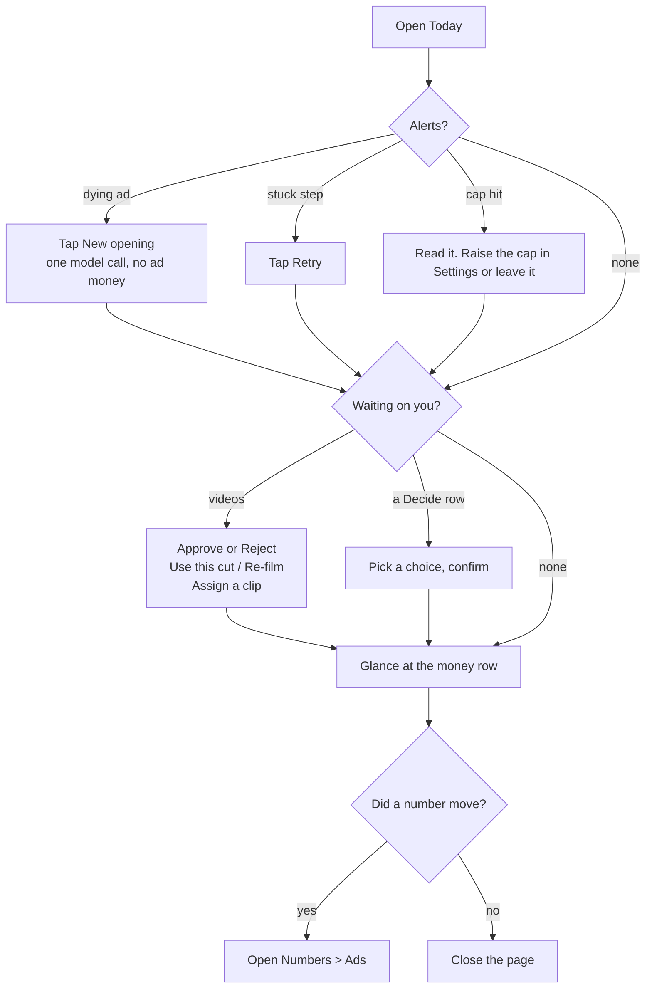
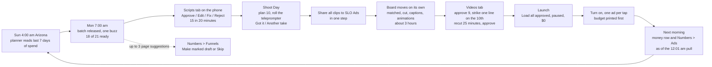

# Command Center design, final (2026-10-05)

Written by the Fable lead designer for the builders on `ops/workflows/marketing-machine-2026-10.md`. This is a design. Nothing in it is live unless §2 says "yes" in the "Back end exists" column.

**How this was chosen.** Three designs were scored by three judges. Totals: Design 1 (Today is home) 20.5; Design 2 (content pipeline, left to right) 23.5; Design 3 (decisions and money first, Studio) 23.5. The top two tied on points; two of the three judges named Design 2 the winner, so Design 2 is the spine. Grafted from Design 3: the no-table "honest page" slice first, "Today's numbers come in tomorrow morning", per-part error banners, disabled-with-reason on every blocked tap, tab state in the URL hash, the model-spend meter, the buzz list in Settings, "Start a roadmap flywheel", the "in chat" labels (retired 2026-10-05 by owner law, §3.9), and Numbers moved earlier. Grafted from Design 1: the job table in §2 as the done-when list, "Read it" on every flywheel row, the Submagic "Waiting for minutes" rule, the one-ad-per-resume-call test, the "unknown ad" bucket, and the per-stage word table.

**Laws this obeys.** `docs/specs/marketing-machine-2026-10-04.md` (§1, §2, §8.3, §15, §17 all defaults), `docs/specs/marketing-dashboard-plan-2026-10-05.md`, `docs/rules/UI-STANDARDS.md`, `docs/specs/marketing-today-contract.md`, `docs/specs/marketing-offer-contract.md`, `.claude/rules/ad-watch-curve.md`, `.claude/rules/clarity-export-rate-limit.md`, `.claude/rules/page-edits-marked-draft.md`, `.claude/rules/proof-cards-from-source.md`, `.claude/rules/chris-never-clickfunnels.md` and `.claude/rules/chris-never-submagic.md` (API only, no logins), and the owner law of 2026-10-05: nothing starts from Claude Code (§3.9). The company is Fundhub. NULL prints "unknown", never $0. Owner and admin only (`ROLE_SETS.MARKETING`, live in `src/http/read-api.mjs:223`).

**Where the numbers in this file come from.** Every number is from the repo or a live read on 2026-10-05: the Today contract (spend windows), the offer contract (one measured run), `marketing/MACHINE-GAPS.md`, `ops/workflows/roadmap-marketing-2026-10-04.md`, and the approved spec's defaults. Nothing is a guess. Where a cost has never been measured, the page prints "unknown, not measured yet". Tool and model prices for the research, proof and page jobs were read from platform.claude.com/docs on 2026-10-05: web search `web_search_20260318` at $10 per 1,000 searches plus tokens (a failed search is not billed); web fetch `web_fetch_20260318` at no charge beyond tokens; Opus 5.5 at $4 in / $20 out per million tokens; Sonnet 5.5 at $2 / $10; cache reads $0.20. Netlify background functions run up to 15 minutes and retry an errored call after 1 minute and again after 2 (docs.netlify.com/build/functions/background-functions/). None of these jobs has a measured run yet; every cost line prints "unknown" until its first ledger row.

---

## 1. The goal, in Chris's words

"I want to run all of marketing from the dashboard, not from Claude Code." Every Monday the scripts show up on my phone and I approve them in 20 minutes. I film them in one sitting, share the clips, and the same day the finished videos are waiting for me to approve. I tap one button and the ads load into Meta, paused. I turn on the ones I want, and I see the budget before I say yes. The next morning the page shows me what each ad did. When something needs me, the page says so in plain words and gives me the tap. Nothing on the page spends my money or turns an ad on unless I tap it and it told me the cost first. Nothing is left in chat. "I don't want to initiate them from Claude Code. I don't want to run my business from inside Claude Code, that's bad system design." (owner law, 2026-10-05). The jobs that read live web pages run on the server too, and the page runs them.

---

## 2. Every Claude Code marketing job -> its dashboard button

This table is the done-when list. A job has "left chat" only when its row's button exists on the page and its cost line reads from the cost ledger (or honestly says "unknown, not measured yet").

| # | Job Chris runs in Claude Code today | Tab | Button label | Inputs | Output | Cost and time shown before the tap | Back end exists | Endpoint |
|---|---|---|---|---|---|---|---|---|
| J1 | Avatar builder (flywheel step 1; Chris's 7-step Avatar Builder SOP with live web research; 19 to 33 model calls) | Today's stage-1 row first (slice 5a), then Ideas, "Offer and market" card, row 1 "Who we sell to" | Build the avatar · Read it · Approve · Tweak · Redo · Retry | Campaign (any folder under `marketing/flywheel/`; Start a flywheel makes one for any offer key); "What we sell", pre-filled from the offer facts; owner notes, read-only | The Core Avatar Profile, six supporting documents and a Sources list, committed to `marketing/flywheel/<campaign>/01-avatar*` through the outbox; row: "Done. 141 new quotes, 455 kept. Version 2, built on the server. Not reviewed." | First run: "Cost: unknown, not measured yet. Stops by itself at $20. At most 184 searches ($1.84). Time unknown; worst case about 3 hours." After: "About $X and Y minutes (last run)." | No. Needs slice 1 with the additions in §6; 10 saved steps on the Netlify worker; Anthropic's own web_search and web_fetch do the reading | `POST marketing/flywheel/run {campaign, stage:1}`, `GET marketing/flywheel`, `GET marketing/flywheel/job?id=`, `POST marketing/flywheel/approve|tweak|campaign` |
| J2 | Ad research (flywheel step 2; about 50 model calls with live web reads) | Ideas, row 2 "What the market sells" | Research the market · Read it · Approve · Tweak · Redo · Resume (after a cap stop) | Campaign; market (one line, pre-filled); known competitors (optional); step 1 and owner notes read from the repo | `02-ad-research.md` (the stamp, the reliability header, every claim with its link, the review card) through the outbox; the full evidence on the job row; row: "Done. 361 findings, 8 checked, 160 competitors. Not reviewed." | "Cost: unknown, not measured yet. Cannot pass $40 a run or $300 a month. Ceiling about $37 if every page is full size. At most 106 searches ($1.06), 138 with retries." | No. Same worker and model-client extension as J1; 5 saved steps | `POST marketing/flywheel/run {campaign, stage:2}`, `GET marketing/flywheel`, `POST marketing/flywheel/approve|tweak`, `POST marketing/jobs/retry` |
| J3 | Offer (flywheel step 3) | Ideas, row 3 "The offer" | Write the offer · Read it · Approve · Tweak · Redo | Avatar summary, ad research summary, owner notes (defaulted from the stage files); prices from `src/config/offers.mjs` | Review card first, then name and price; `03-offer.md` written through the outbox so the row turns "Done" | "About 5 minutes. About $0.67 of model spend (last measured run: 4 min 29 s). One run at a time." | Yes, `POST/GET marketing/offer/generate` (writes `marketing_jobs`, not the stage file yet) | `POST marketing/offer/generate`, then `POST marketing/flywheel/approve`, `tweak` |
| J4 | Flywheel copy (step 4; partner-offer ads and emails; dozens to hundreds of calls) | Ideas, row 4 "Ad copy for the partner offer" | Write the copy (off until step 3 is approved) · Read it · Approve · Tweak · Redo | Offer summary, avatar summary, language bank, burned-out angles, owner notes | Top 3 hooks, every piece by angle with its id, dropped pieces with reasons; `04-copy.md` | "Writes 15 to 20 whole ads in three lengths plus email subjects. Dozens of model calls. A few minutes. Cost: unknown until the first server run." | No | `POST marketing/flywheel/run {campaign, stage:4}` |
| J5 | Ad strategy (step 5; the chat script points at a laptop path that no longer exists) | Ideas, row 5 "Which ad strategy" | Pick the strategy (off until 3 and 4 are approved) · Read it · Approve · Tweak · Redo | Offer summary, copy summary, creative count, owner notes; doctrine bundled in `src/` | Strategy name, day-one cost before anything is learned, creative needed vs on hand, tactics Meta would reject; `05-ad-strategy.md` | "About 9 model calls. A few minutes. Spends no ad money. Cost: unknown until measured." | No | `POST marketing/flywheel/run {campaign, stage:5}` |
| J6 | Spend read (step 6: is copy, offer or market the problem?) | Ideas, row 6 "Read the spend" | Read the spend | None to type; reads `ad_metrics_daily` and `ads.fundhub_ad_number` | Table per ad (spend, taps, cost per lead, purchases; "unknown" where NULL), unmatched ads, one conclusion line, a jump to the step it points at; `06-spend.md` | "Free. Reads saved numbers. A few seconds." | No (no code anywhere today) | `POST marketing/flywheel/spend-read {campaign}` |
| J7 | Flywheel approve / tweak / redo (file edits in git that Netlify cannot write today) | Ideas, every stage row | Approve · Tweak · Redo | Stage; one tweak line | Approved stamp or one dated owner-notes line, committed through the outbox; the row shows the same words `npm run flywheel:status` prints | Approve: "Free." Tweak and Redo: "Re-runs step N (its cost and time) and makes later steps out of date." | No | `POST marketing/flywheel/approve`, `tweak`, `run` |
| J8 | Fundhub ad scripts (standard, sorting-hat shorts, long, Notes, VSL) plus the rule and voice edits. The biggest time sink: 32 full ads, 7 shorts, 6 videos since 9/2; one ad took about 20 line-edit commits on 10/4 | Scripts (and Write now on Today) | Write now · Approve · Edit · Fix · Reject · Add a rule · Ban a phrase · Film first | Count and funnel split (from last 7 days' spend), Chris's ideas, `RULES.md` Part 0, `VOICE.md`, recipes; for Fix, Chris's note | Draft cards (hook, line 2, cues, reveal, CTA, check line, slot reason). Approve gives the next number from 91 and commits the file; Edit saves a new version and voice pairs; rules land in Part 0 | Write now: "About $X for N scripts (last batch $Y). Cap $40 a batch; $Z of $300 used this month. Under 10 minutes." Fix: "One rewrite, about the cost of one script." Approve, Edit, Reject, rules: free | Partial: `POST scripts/write` saves text with no model; checker is CLI only; no server writer | Spec §7.8 routes: `GET marketing/scripts`, `POST marketing/scripts/approve|edit|fix|reject|order`, `POST marketing/batches/write-now`, `GET/POST marketing/rules` |
| J9 | "Write ad copy" (Creative Factory one-shot writer; 1 job ever, failed) | Ideas, "Quick copy" card (demoted; stays Today's one filled button only until Write now exists) | Write one piece | Free-text angle; offer type (funding, credit cards, credit repair) | One copy piece with the screen result, the checker's verdict, and the model actually used | "About $X (average of your last 5 runs), or unknown. Writes one piece. About a minute. $U of $2,500 writing budget used this month." | Yes, `POST creative/generate` + `POST creative/run` | same, with `max_jobs: 1` |
| J10 | Meta ad reviews and the hand-built ad -> page -> buy -> sale report (agent hours of SQL) | Numbers (Ads and Funnels views); the money row on Today | Make the report · filters · sort | Window, funnel, format, angle | Sortable per-ad table with as-of, the funnel flow, the "unknown ad" bucket with Link, the Oct 4 report shape as a page | "Free. Saved numbers as of <last pull>." No confirm | Partial: Meta sync daily; migrations 406 to 408 save purchases, link clicks, landing page views; no joined endpoints | `GET marketing/ads`, `GET marketing/ad?n=`, `GET marketing/funnels/stats`, `GET marketing/report` |
| J11 | Watch-curve diagnosis, the dying-ad buzz, the "New opening" rewrite | Today (Alerts) and Numbers (Ads drawer); the 3-choice card lands in Scripts | New opening | The flagged ad (same body kept) | 3 new first lines as one card; picking one saves a new version with the same number, marks it `needs_retake`, puts it on top of Shoot as "first line only" | "One model call, about the cost of one script (last: $X, or unknown). Spends no ad money. Never pauses the ad." | Diagnosis and buzz yes (cron 07:30 UTC, tables `ad_watch_curve_alerts`, `ad_watch_curve_diagnoses`); screen and writer no | `POST marketing/ideas {kind:'opening', target_script_id}` |
| J12 | Clarity pulls (laptop script; 10 a day Microsoft cap; counter in a folder Netlify cannot write) | Numbers, Funnels view | Pull Clarity now (plus a daily sweeper, at most 2 calls) | None (project id and token on the server) | By-page table: sessions, dead clicks, rage clicks, scroll depth, with its pull time | "N of 10 Microsoft pulls used today. One pull, no retry." Refuses at 10 | No (sweeper exists but is not registered) | `POST marketing/clarity/pull`, `GET marketing/clarity` |
| J13 | Ad video pipeline by hand: take matching, joining, Submagic, animations, approve (24 takes tracked, 0 ever approved; 2 waiting since Sep 24) | Videos (and the board on Shoot and Today) | Approve · Reject · strike a line (Recut) · Use the script word · Remove or change an animation · A free note · Retry · Assign · Use this cut / Re-film | Clips shared to SLO Ads, the locked scripts, Settings (template, caption position, animation mode) | One finished video per ad in the Facebook folder, loaded into Meta paused on approve; each decision stored with Chris's staff id | Approve, Reject, animation edits: "free". Any new Submagic project: "about 25 minutes; Submagic bills about N minutes again; M of 100 left this month; a retry pays again." Free note: "one small model call, a few cents" | Partial: sweeper every 5 min, `GET ad-videos`, token approve page; join step runs only on the Mac | Spec §9.1 routes: `GET marketing/videos`, `GET marketing/video?id=`, `POST marketing/videos/approve|reject|edit|hold-choice|recut|retry|assign` |
| J14 | Loading approved ads into Meta and turning them on (the media buyer builds ads by hand; `createAd` exists, nothing calls it) | Launch | Load all approved into Meta, paused · Load this one · Turn on (per ad) · Retry | Approved videos, each funnel's default ad set (Settings), the script's `meta_copy` | Paused ads in Meta with their numbers, copy, CTA, link and UTMs; Meta ids on each row; one ad on per confirm | Load: "Costs $0. Ads load PAUSED. Nothing spends until you turn one on." Turn on: "Ad 91 can spend up to $<budget> a day in <ad set>." Disabled with the reason when the budget is unknown | No for load; campaign-level pause/resume/budget exist on the Campaigns page | `POST marketing/meta/load`, `GET marketing/meta/load-status`, `POST campaigns/write {action:'resume_ad', target:'ad'}` |
| J15 | Weekly brief and the morning pulse in words (manual trigger, no screen) | Today, machine card | Make this week's brief | None | The brief text on the page with a link to Company Brain | "One short model call, under a minute, a few cents." | Yes, `POST ops/weekly-brief` | same |
| J16 | Angles and concepts (angle generator, the 48-concept sheet, Chris's 20 picks in browser storage, "next 10 sorting-hat ads") | Ideas (angle list, the planner's 3 suggestions) and Numbers Angles view | Make more of this · Accept · Save idea | A tap; optional idea text | `ad_ideas` rows that reach the writer; angles with spend, last run, ads per angle | "Free." (Writing costs only through Write now) | No | `GET marketing/angles`, `GET/POST marketing/ideas`, `GET/POST marketing/batches/next` |
| J17 | Shoot planning: lock scripts the night before, BigVU pastes, a 10-video shoot taking a week | Shoot (and the teleprompter page for rolling) | Save the plan · Got it · Another take · Open the teleprompter · Close the shoot | Locked scripts, film order, reading speed | A `marketing_shoots` row, "estimated 48 minutes for 10 ads", the board moving as clips land | "Free." The only confirm is Got it per script | No (`tools/teleprompter/` v1 is a local page; `public/app/teleprompter.html` does not exist) | `GET marketing/shoot`, `POST marketing/shoot`, `POST marketing/shoot/mark` |
| J18 | Landing-page copy changes (marked red/green drafts, ClickFunnels pushes) | Numbers, Funnels view, "Pages" card | Make marked draft · Read it · Fix it · Tweak · Redo · Skip · Push live · Start from the live page · Put the old page back · Retry | A page (one of the three custom-HTML roadmap pages) and "What should change?" in his words; or a machine suggestion, pre-filled | A `page_change_requests` row requested -> drafted -> fixed -> live; the red draft, then the green one, shown inside the dashboard at the same link every round; on Push live the old page kept twice, the new page committed to the repo and PUT to ClickFunnels, proven two ways | "One model call. About 3 minutes. Cost: unknown, not measured yet (list price about $0.15 to $0.40). Cap $5 a draft; $Z of $300 used." Push live: "Costs $0. This changes the live page. The old page is kept." | No. Worker steps read -> mark -> fix -> commit -> put; no agent, no Mac | `GET marketing/pages`, `POST marketing/pages/request|choose|fix-it|tweak|redo|skip|push-live|start-from-live|restore`, `GET marketing/pages/request?id=`, `GET marketing/pages/suggestions` |
| J19 | Proof cards and testimonial thumbnails (approval screenshots -> win cards; testimonial videos -> hook, poster, tall crop) | Ideas, "Proof: client wins and testimonials" card | Add a screenshot · Pick from Drive · Add a testimonial video · Approve · Tweak · Redo · Reject · Push approved testimonials live · Push approved win cards live (disabled until a deck slot exists) | A screenshot (phone or Drive) or a Drive video (optional transcript, name, business type, product label); name mode off / blur / show (only names read off the picture) | Win: a `deck.json` record in amount order through the outbox, the 1200x900 crop stored; "Approved, saved to the deck file". Testimonial: a `testimonials.json` record, poster and tall MP4, live in the testimonial slot on /roadmap after Push live | Screenshot: "2 small model calls. Cost: unknown, not measured yet (worst case about $0.19 from the price list). About 1 minute." Video: "3 model calls plus the video worker. Cost unknown. About 15 minutes." Push live: "Free. About 1 minute." | No. Screenshot half: the Netlify worker and the model reads the picture. Testimonial half: the Render video worker (slice 8) and R2 | `POST marketing/proof/sources`, `GET marketing/proof/sources?drive=1`, `GET marketing/proof/cards`, `GET marketing/proof/card?id=`, `POST marketing/proof/cards/approve|tweak|redo|reject`, `POST marketing/proof/push-live`, `GET api/marketing/proof/pickup` |
| J20 | Deep research and the Hormozi vault (plan, sweep until dry, chase, critic, verify, write-up) | Ideas, "Deep research" card (above "Offer and market") | Research it · Read it · Approve · Tweak · Redo · Save to the brain · Retry | The question; Quick look or Leave nothing unturned; where to look (web, the Hormozi vault, our own files); a belief line; the stop amount for this run | One cited report plus `sources.json` in `marketing/research/<date>-<slug>-<id>/` through the outbox; the report on the card with "treat with caution" and "what we could not reach" lists | "About N web searches ($10 per 1,000): Quick look about 62 ($0.62), Deep about 542 ($5.42). Tokens and time: unknown, not measured yet. Stops at your cap: $C." | No. Saved steps on the Netlify worker; the Hormozi vault read from the repo bundle (no Drive) | `POST marketing/research`, `GET marketing/research?id=`, `GET marketing/research`, `POST marketing/research/approve|tweak|brain`, `POST marketing/jobs/retry` |
| J21 | Owner decisions buried on boards ($197 follow-up vs $147 page, Submagic credits yes/no, retry may pay again) | Today, "Waiting on you" Decide rows | One tap per choice, then a confirm | Rows an agent writes to `marketing_decisions` | The answer saved with staff id and time, read by the agent that asked | "Free." | No | `GET/POST marketing/decisions` |
| J22 | The three foundations every button above leans on: a repo write path, a cost ledger, a forced-Anthropic model call | No button. Settings shows "Model spend this month: $Z of $300"; the health line on Today shows the outbox state | none | `repo_outbox` rows (fine-grained `GITHUB_REPO_TOKEN`), `marketing_model_usage` rows with dollars, `callModel` `provider:'anthropic'` | Approve, Edit, Tweak, Rule and stage saves land in git; every cost line is the last real run; no call silently swaps to gpt-4o-mini | Until built, every unmeasured button prints "Cost: unknown, not measured yet" with the cap still shown | No | `GET marketing/costs`, `GET marketing/health` |

---

## 3. The tabs

### 3.0 Rules for every tab

- **The strip.** Seven tabs in work order: **Today · Ideas · Scripts · Shoot · Videos · Launch · Numbers.** Settings sits behind the gear top-right (UI-STANDARDS §8), off the strip. Versus spec §8.3: Ideas and Shoot are added; Ads, Angles, Funnels and Map fold into Numbers as four views; nothing is dropped. The strip uses the `.tabs` class (already on the brand shadow list) and at 390px it wraps 4 + 3. It never scrolls sideways.
- **Tab state lives in the URL hash** (`#today`, `#ideas`, `#scripts`, `#shoot`, `#videos`, `#launch`, `#numbers/ads`, `#settings`). Every buzz deep-links through `/login.html?next=/app/marketing-command-center.html#scripts`, so buzz -> tap -> card is two taps.
- **One filled button per screen.** On Today it is always the top row of "Waiting on you". When nothing waits, Today has no filled button.
- **Counts come from one server view.** The strip's counts, the tab dots and the "Waiting on you" rows all read `pipeline` and `waiting` from `GET marketing/today`. The page never adds things up itself, so two places can never disagree.
- **Every cost line reads `GET marketing/costs`** (last measured cost and minutes per job kind, plus month used vs cap). It returns "unknown" until a ledger row exists for that kind. No button prints a guess.
- **One shared review module,** `public/app/marketing-review.js`, draws the script card, the video card and every confirm sheet, and owns `decide(kind, payload)`: it makes a `request_id`, attaches the card's `version`, writes the intent to an IndexedDB queue first, then POSTs. Both this page and `public/app/teleprompter.html` (spec §8.1) use it. One write path per decision.
- **Four states on every card** (UI-STANDARDS §6). Loading is a skeleton in the real layout. Errors are per part: "The Meta numbers did not load. The rest of this page is current. Try again." Never a status code.
- **Blocked taps are disabled with the reason printed,** never hidden, never a blind yes.
- **Text sizes only from the shell whitelist** (`.caption`, `.chip`, `.eyebrow`; body 16px; `.big` for the hero number). At most one escape hatch per screen (UI-STANDARDS §12.7).
- **Phone first.** One column at 390px, no inner scroll boxes except a table, 44px taps, 56px for Approve, Reject at least 32px away from the safe buttons. If any bar is pinned to the bottom it uses `bottom: calc(var(--fh-statusbar) + env(safe-area-inset-bottom))` so it clears `data.js`'s fixed status strip.
- **Word table for every flywheel row and every machine row.** "Offer, step 3 of 6", never "Flywheel step 3". State words: Done / Done, approved / Needs a redo / Waiting on step 3 / Out of date / Running (with the step and the live spend: "Running: step 3 of 10, searching the web for buyer quotes, round 2. $1.90 spent so far.") / Stopped at the cap / Thin / Not run yet / Not on this page yet (only until its slice ships; "Runs in chat" is never an end state, §3.9). Done rows get a sentence ("Done. 133 customer quotes collected."), failed rows get a fix sentence ("The offer file has no guarantee section. Redo the step."). Campaign folder names map to words (`partner` -> "Partner offer").

### 3.1 Today

**Purpose.** The two-minute morning look. Two questions, in order: what needs me, and is the machine healthy? Nothing on Today spends money or turns an ad on.

**What Chris sees, top to bottom.**

1. **Waiting on you** (top-left, largest, with a count badge: "3 to do"). A typed list the server builds from every source table, newest-stuck first. Each row is a count + one verb + how long it has waited + a tap that opens the right tab on the exact card. Row kinds: scripts to approve, videos to approve, cuts on hold (Use this cut / Re-film), clips with no ad (Assign), approved videos not yet loaded, failed machine steps (Retry), page suggestions to pick, a finished avatar, market research or deep-research report to read, a proof card or testimonial card to approve, a marked page draft to read, a run stopped at its cap (Resume), and owner decisions written by agents ("The follow-up text still says $197. The page says $147. Pick one."). The top row's verb is the one filled button on the page. A row whose action is not built yet never shows a dead button; it says "Not on this page yet. It ships in slice N." and, until that slice ships, offers Copy the chat command (safety rule 9). That sentence marks a gap, never an end state (§3.9).
2. **Alerts.** Only things the machine found, in the watch-curve law's words with the real numbers. Oct 4 example: "SLO2 is dying: 1 in 10 people are still watching at the quarter mark. $498.01 spent on it. Change the opening." with **New opening**. Oct 5 example: "No ads are running. The last day with ads was Oct 4." Also: a stuck step ("Captions failed on Ad 91." with Retry), the cost cap ("Writing stopped at $40 for this batch. 14 of 21 are ready."), Submagic out of minutes. An ad people leave early but tap through is never an alert; the Ads drawer says "Left early but tapped through. Leave it." When nothing is wrong: "Nothing needs you right now."
3. **The pipeline strip.** Seven boxes left to right, one count and one verb each: **Ideas** "3 new ideas" · **Scripts** "15 to approve" · **Shoot** "10 to film" · **Videos** "2 to approve" · **Launch** "0 to load, 4 on" · **Numbers** "$606.53 last 7 days" · **Fix next** "1 ad needs a new opening". A zero reads "nothing waiting". Tapping a box opens that tab. This is the week in one glance. At 390px it wraps 4 + 3.
4. **Next drop.** "Monday 7:00 am Arizona · 21 scripts · Roadmap $147: 14, Book a call: 7 (by last 7 days of spend)" with **Change the plan** (opens Scripts > Next batch) and **Write now** (outline). Until the script machine is on: "The script machine is off. Turn it on in Settings."
5. **This shoot** (only while a shoot is open): the progress board, same component as the Shoot tab, read-only here, with an "Open Shoot" link.
6. **Money row.** Three columns: today / 7 days / 30 days. Rows: Spend, Leads, Calls booked, Sales, Cash, ROAS. Every 7 and 30 day cell carries its comparison under it ("Up from $308.93 the 7 days before") and a sparkline. Two sales cells side by side and never added: "Our checkout: 0 paid" and "Meta says: unknown". ROAS prints as words: "$0 back per $1 (0 sales on $915.46)". The today column shows only what our own database owns right now (people on the page, pressed buy, paid, booked, cash) and carries one caption: "Today's ad spend comes in tomorrow morning. The Meta pull runs at 12:01 am." The spend label says "Ad spend, all accounts"; Chris's own account (fundhub-direct) is the hero number with all-accounts under it. One as-of sentence under the row: "Meta numbers run through Oct 4, pulled 12:01 am (7 hours ago). Page tracker live. ClickFunnels last pulled Oct 4, 3:10 pm." When the pull is older than two days the row leads with "Old numbers: last saved Oct 1." Under the row: spend by funnel as a short bar list, and the ad -> page -> lead -> call -> sale flow for 7 days ("135 on the page, 2 pressed buy, 0 paid, 0 booked"). Every by-ad number keeps an "unknown ad" bucket with a Link button so totals never shrink. Rates with fewer than 10 plays print "unknown (fewer than 10 plays)". The words "hook rate" never appear on the page; the cells are "Still there at 2 s" and "Still there at 25%" (the spec §11.1 definition stays under the plainer label).
7. **The machine** (replaces "Machine parts"). One health line first: "The machine is healthy. Last Meta pull 12:01 am. Model spend $Z of $300 this month." Only stuck rows are expanded, each with five words of purpose, when it failed, the reason in words, and Retry. "Show all jobs" unfolds the full clock list (Meta pull, ClickFunnels pull, next-take labels, copy runner, video sweeper, marketing clock, planner, writer, cutter, captions, animations, loader) with last run and result in words ("saved 4 ad-days", "27 labels written", "nothing to do"). Last line, always: "It never turns an ad on, pauses one, or changes a budget. You do that in Launch."
8. **Footer.** "Loaded 3:02 PM" as a clock time, exact time in the title. The page reloads `GET marketing/today` when the tab comes back into focus and every 5 minutes.

**Actions.**

- The one filled button = the top Waiting row ("Approve 15 scripts" -> `#scripts`; "Approve 2 videos" -> `#videos`; "Load 9 approved ads (paused)" -> `#launch`). Until Scripts exists it stays **Write ad copy** (which moves to Ideas as Quick copy after that).
- **New opening** (on a dying-ad alert): sheet "Make 3 new first lines for Ad 84, same body? One model call, about the cost of one script (last: $X, or unknown until measured). Spends no ad money. Never pauses the ad." -> `POST marketing/ideas {kind:'opening', target_script_id}`.
- **Retry** (only on a failed machine row or shoot row): free, one tap -> `POST marketing/jobs/retry {job_id}`. Answers on the row: "Running again. Started 3:04 PM."
- **Write now** (outline): sheet with a count picker (default 3), funnels by spend share, "About $X for 3 scripts (last batch $Y; cap $40 a batch; $Z of $300 used this month). Under 10 minutes." -> `POST marketing/batches/write-now`. The strip then counts "Writing 3… 1 of 3 ready".
- **Decide** rows: one tap per choice ("Use $147" / "Use $197" / "Something else" with a one-line box), then a confirm sheet "Use $147 for the follow-up text? This is saved as your call." -> `POST marketing/decisions`. Two taps, because it is written as owner-set.
- **Pull Meta now** (outline, inside the machine card): "Reads only. Spends nothing. About a minute." -> existing `POST campaigns/sync`.
- **Make this week's brief** (outline, machine card): "One short model call, under a minute, a few cents." -> existing `POST ops/weekly-brief`; result is the brief text with a link to Company Brain.
- **Build the avatar** (on Today's stage-1 row from slice 5a until the Ideas tab lands): the cost sheet in §3.2 row 1, then one tap -> `POST marketing/flywheel/run {campaign, stage:1}`. The row then prints the step it is on and the live spend. The same row's **Read it**, **Approve**, **Tweak**, **Redo** and **Retry** work here first and move to Ideas with no back-end change.
- **Link this ad** (on the unknown-ad bucket): opens the Campaigns page's existing "Link this ad" control. Free.
- Links: Open Campaigns (`campaign-manager.html`), Open the teleprompter.

**Empty, loading and error states.** Loading: skeletons in the real layout (3 waiting rows, 7 strip boxes, a 6 by 3 money grid, the health line). Waiting empty: "Nothing is waiting on you." and no filled button. Alerts empty: "Nothing needs you right now." Money with no rows: "No ad spend saved yet. The Meta pull runs at 12:01 am." Every NULL prints "unknown"; a measured zero prints 0. Stale pull (over 2 days): the row leads with "Old numbers: last saved Oct 1." and the machine card marks the pull "not ready". Error: one banner per part that failed, the rest stays painted. A part the server reports as not built renders one sentence, never a disabled control with no words. Offer card after a run while the stage file is unwired (until slice 1): "The flywheel step and the latest offer are checked two different ways right now." Offline: "No connection. This page shows the last load from 3:02 PM."

**Phone layout.** One column: Waiting, Alerts, the strip (4 + 3), Next drop, board, money row stacked (today / 7 / 30 as three short blocks), machine, footer. No inner scroll boxes; long text folds behind "Show more". Any time older than a day prints the full date and time in the text. Tiles stack one per row up to 960px.

**Endpoints, in brief.**

- `GET marketing/today` (exists; extend) -> `{ok, as_of, today, timezone, waiting[], alerts[{kind, ad_number, sentence, numbers{}, action}], needs_you[{kind, count, verb, since, href, card_id}], pipeline{ideas, scripts, shoot, videos, launch, numbers_spend_cents, fix_next}, next_drop{at, count, split[], enabled}, shoot{…} | null, money{today, last_7_days, prior_7_days, last_30_days, prior_30_days: {spend_cents, leads, booked, sales_ours, sales_meta, cash_cents, roas}}, by_funnel[], flow{page, pressed_buy, paid, booked}, machine{healthy, line, stuck[], jobs[]}, flywheel{…}, copy{…}, copy_ready{…}, spend{…}, last_sync{meta_synced_at, metrics_synced_at, latest_metrics_date, clickfunnels_synced_at}}`. Back end also builds `last_7_days` as the 7 full days ending at `latest_metrics_date` so both compare windows are 7 days, and adds `prior_30_days`.
- `GET marketing/health` (new) -> `{clock, worker, outbox{pending, last_commit_sha, error}, last_syncs{}, model_spend{used_usd, cap_usd}}`.
- `GET marketing/costs` (new, small) -> `{kinds{offer:{last_cost_usd, last_minutes, measured_at}, script:{…}, opening:{…}, quick_copy:{…}, brief:{…}, avatar:{…, last_searches, last_fetches, run_cap_usd}, ad_research:{…, last_searches, last_page_reads, ceiling_usd}, research:{…}, page_draft:{…}, proof_read:{…}, proof_check:{…}, testimonial_hook:{…}, testimonial_frames:{…}, testimonial_check:{…}}, month{used_usd, cap_usd}, run_caps{}, submagic{minutes_used, minutes_included}}`; a kind with no ledger row returns `null` and the page prints "unknown, not measured yet".
- `GET/POST marketing/decisions` (new) -> rows `{id, text, choices[], source, answered_by, answered_at, answer}`; POST `{id, answer, request_id}`.
- `POST marketing/jobs/retry {job_id}` (new) -> `202 {ok, job}`.
- `POST marketing/ideas` (spec §7.8), `POST marketing/batches/write-now` (202), `POST campaigns/sync` (exists), `POST ops/weekly-brief` (exists).
- `GET ad-videos?status=awaiting_approval` (exists) feeds the videos wait row until `GET marketing/videos` lands.
- Money definitions come only from `docs/marketing/metrics.md` (new, with fixture tests; the folder does not exist today), built on `adAttributionRollup` in `src/ads/store.mjs:79`. Never from `src/dashboard/kpis.mjs`.

### 3.2 Ideas

**Purpose.** What should we make next, and what do we know? Everything the writer reads lives here: Chris's ideas, the planner's suggestions, the angle list, the research (any question, plus the flywheel's first two steps), the offer-and-market work (the flywheel), and the proof cards. Every Run on this tab shows its cost first and spends no ad money. Nothing here starts in a chat (§3.9).

**What Chris sees, top to bottom.**

1. A meter line: "Model spend this month: $Z of $300. Nothing on this tab spends ad money."
2. **Drop an idea.** A big text box (the keyboard mic does the talking), optional format (standard, short, long, notes, VSL) and funnel. Under it **Your ideas**, each with a status word: new, being written, written (link to the script card), dropped (with the reason).
3. **The machine suggests.** The planner's 3 angle suggestions with their numbers ("Bank turned you down: $212 spend, 2 leads, $106 a lead, last ran Sep 28") and an **Accept** each. Until the planner has run: "The planner has not run yet. It runs 3 hours before the next drop (Monday 4:00 am)."
4. **Angles.** Every angle with spend, leads, last run date, ads per angle. **Make more of this** adds an idea. Chris's 20 picks from the concept sheet move out of browser storage into `ad_ideas` rows here so they survive and reach the writer.
5. **Research.** One card, **Deep research**, for any question (J20). A big text box for the question (the mic works). **How deep:** "Quick look" (plan, one sweep round of 4 sub-questions, check up to 5 key claims, write-up) or "Leave nothing unturned" (up to 8 sub-questions, sweep until two rounds come back dry, chase what the best sources cite, a critic for what everyone missed, check up to 15 key claims two ways, write-up). Quick look is the default until one Quick look has been measured; the Deep choice says "Run a Quick look first so the cost of a full run gets measured." **Where to look:** three tap boxes, "Live web pages" (on), "The Hormozi vault" (on; the 109 files under `marketing/knowledge/hormozi/`, read from the repo, no Drive), "Our own files" (off; these reach only the planning and write-up steps, never a step that touches the web). One optional line: "What I already think the answer is" (the critic and the checkers attack it). **"Stop at $__ for this run"**, pre-filled from Settings; while Settings is blank the box is required and the button is disabled with "Type a stop amount first". One outline button **Research it**. Under it **Your research**, one row per run, newest first: "Running: sweeping round 2 of up to 6 · 37 findings · $1.12 so far" / "Done, 11 of 14 key claims held up" / "Done, stopped at the cap: $X after round N" / "Done, write-up failed, findings below" / "Could not finish: <reason in words>". Done rows get Read it · Approve · Tweak · Redo · Save to the brain; failed rows get Retry. Until the repo write path exists every done row also says "Not in the repo yet." The flywheel's first two steps are research too; they run from their own rows on the next card.
6. **Offer and market** (the flywheel). A campaign picker at the top: every folder under `marketing/flywheel/` read live from GitHub with pending saves laid on top ("Partner offer" today); **Start a flywheel** makes a folder and owner-notes file for any offer key in `src/config/offers.mjs` (for example the Capital Blueprint) through the outbox, free. Six rows in order with plain names and the word table: "1. Who we sell to · Done. 141 new quotes, 455 kept. Version 2, built on the server. Approved." / "2. What the market sells · Done. 361 findings, 8 checked, 160 competitors. Approved." / "3. The offer · Needs a redo: the offer file has no guarantee section." / "4. Ad copy for the partner offer · Needs a redo: it did not count its reasons." / "5. Which ad strategy · Waiting on steps 3 and 4." / "6. Read the spend · Not run yet." Each row has **Read it**, which unfolds the stage's review card on this page (What this decided / Three things to check / What I wasn't sure about), then Show more for the whole document, then links to the files on GitHub once the commit lands (the repo is public, so they open without a login). Rows 1 and 2 have their own run buttons, **Build the avatar** (J1) and **Research the market** (J2). While one runs the row prints the step and the live spend from the ledger: "Running: step 3 of 10, searching the web for buyer quotes, round 2. 58 new quotes so far (455 kept from last time). $1.90 spent so far, 23 searches." / "Running: step 2 of 5, reading the market, round 1 of 3. 23 findings so far. $2.10 so far." A run that shrank a round to stay under its cap says so: "Round 3 read 2 of 4 surfaces to stay under $40." A thin result says so: "Thin: 61 phrases, needs 100." / "Thin: not enough could be reached. 5 findings, 0 checked." A cap stop: "Stopped at the $20 run cap after step 6. What it found so far is saved." with Retry (row 1) or Resume plus Start over (row 2). An out-of-date row says what changed under it ("Step 1 changed on Oct 7, so this needs a redo"; after an avatar run row 4 reads "Out of date: the word bank grew"). Until slices 5a and 10 ship, rows 1 and 2 keep the honest sentence "Not on this page yet: it ships in slice 5a (or 10). Cost not measured." and Copy the chat command (safety rule 9), never a dead button.
7. **Quick copy** (the old Write ad copy, demoted to an outline), labelled honestly: "Short copy from a prompt. Not a checked ad script." with the last 10 pieces, each with the model used and the checker's verdict in words.
8. **Proof: client wins and testimonials** (J19). Three outline buttons: **Add a screenshot** (the phone photo picker; the page shrinks the picture to fit the upload limit and says "Shrunk to fit. The words still read." when it had to), **Pick from Drive** (new files in the screenshots folder and the testimonial folder set in Settings, newest first, each marked "already a card" when it was seen before; one tap picks; a box under the list takes a pasted Drive link), and **Add a testimonial video** (Drive only: "Videos come from Drive. They are too big to send through the site."; disabled with "The video worker is not live yet. Screenshot cards work now." until slice 8 and the media bucket exist). Below the buttons, every card as a row with a state word, newest first: Reading / Waiting on you / Approved, saved / Live / Stopped (with the plain reason) / Rejected. Rows read "Win · $6,000 · Barclays JetBlue · Waiting on you" or "Testimonial · Colin · Approved, saved". The top "Waiting on you" row's Approve is this card's one filled button (56px). At the bottom, two push rows: **Push approved testimonials live** (outline; enabled once a testimonial is approved and hosted) and **Push approved win cards live** (disabled with "The Roadmap page has no approvals deck since Oct 1. Say yes in Settings to put it back; that change gets a marked draft first." until a page in the push manifest has the deck slot again; today none does, so win cards build up as a checked library in `deck.json`: 36 cards today, 0 live).

**Actions.**

- **Save idea**: free, one tap -> `POST marketing/ideas {raw_points, script_format?, funnel_key?}`. Answers "Saved. It goes in the next batch."
- **Write now from this idea**: "One script. About $X (last script cost $Y). $Z of $300 used this month. Under 10 minutes." -> `POST marketing/batches/write-now {idea_id}`.
- **Accept** a suggestion / **Make more of this**: free; makes an idea; the row flips to "In the next batch".
- **Research it** (Deep research): the cost sheet first, in these words, read from `GET marketing/costs`: "Deep research on: <question>. Searches: about N web searches. Anthropic bills $10 per 1,000 searches, so about $N/100 in search fees (a search that fails is not billed). Reading pages costs nothing extra; the words it reads and writes are billed as tokens. Tokens: [Last run: $X in Y minutes] or [unknown, not measured yet]. Time: [Last run took Y minutes] or [unknown, not measured yet]. It stops at your cap: $C for this run. $Z of $300 model spend used this month. It runs in the background; this card shows the step it is on; you get a buzz when the report is ready." N is computed by code from the server's own limits (Deep: 542 at most, about $5.42 in search fees; Quick look: 62, about $0.62), never typed. Then **Start the research** -> `POST marketing/research {question, depth, sources, belief?, max_cost_usd, request_id}`. **Read it** (free) unfolds the report in place with every source as a link. **Approve** (free). **Tweak** (one line, such as "go deeper on bank overlays"; the sheet names the cost of a short re-run, or "unknown, not measured yet") -> `POST marketing/research/tweak`. **Redo** (same inputs, same sheet). **Save to the brain** (owner tier; disabled with "The brain cannot save new pages right now: its embedding key has no credit." when that is true) -> `POST marketing/research/brain`. **Retry** on a failed row only (free; resumes from the saved steps) -> `POST marketing/jobs/retry`.
- Row 1 **Build the avatar**: filled when the row reads "Not started" or "Needs a redo", outline otherwise. The cost sheet first. First ever run: "Cost: unknown, not measured yet. This run stops by itself at $20 (the cap is in Settings). $Z of $300 used this month. Web searches cost 1 cent each (Anthropic: $10 per 1,000). This run makes at most 184 searches, so at most $1.84 of it is search. Pages it reads and model time are the rest. It runs in 10 steps on the server; the row shows each step. Time: unknown, not measured yet. Worst case about 3 hours before any retry. The word bank is kept and added to, not replaced." After the first run: "About $X and Y minutes (last run, Oct 7). Stops at $20. $Z of $300 used this month." The sheet also shows "What we sell" (one text box, pre-filled from the chosen campaign's offer facts in `src/marketing/offer-inputs.mjs`; he can edit it or leave it) and his owner notes (read-only: the stage-1 and "all" lines from `00-OWNER-NOTES.md`, fed into the run). One tap -> `POST marketing/flywheel/run {campaign, stage:1, service_description?, request_id}`. A second tap while one runs: "The avatar is already being built. This is that run." **Retry** (only on a failed or cap-stopped run, free) re-queues the failed step only; finished steps are kept and never paid for twice.
- Row 2 **Research the market**: the cost sheet first: "Cost: unknown, not measured yet. It cannot go past $40 a run (your batch cap) or $300 a month ($Z used so far). The most it could ever reach, if every page it opens is full size, is about $37; the usual run should be far under that. Searches cost $10 per 1,000; this run makes at most 106 searches ($1.06), 138 if a slow surface is retried ($1.38). Page reads cost only the words read. Time: unknown until the first run; it runs in saved steps on the server, so a stop never loses work. It uses a small amount of Netlify computer time (Netlify bills 10 credits per GB-hour)." After the first run: "Last run: $X, N minutes, S searches, K page reads." The sheet shows the market line (pre-filled, editable), "Who we sell to" (which step-1 file it will read, or "No step 1 on file. Research runs without it and says so."), optional competitor chips, and his notes. **Start the research** -> `POST marketing/flywheel/run {campaign, stage:2, market?, competitors?, request_id}`. **Resume** (only after a cap or time stop; continues from the saved steps) -> `POST marketing/jobs/retry {job_id}`; **Start over** beside it makes a fresh run.
- Row 3 **Write the offer**: "About 5 minutes. About $0.67 of model spend (last measured run: 4 min 29 s, 24,551 in / 28,640 out tokens). One run at a time." Progress "six offers -> judges -> write-up". Result: the review card first, then the name and price, then the whole offer behind Show more. A second tap while one runs gets "An offer is already being written. This is that run." -> existing `POST marketing/offer/generate`, poll `GET ?id=` every 5 to 10 s while the tab is visible.
- Row 4 **Write the copy**: disabled until row 3 is approved, with the reason printed. "Writes 15 to 20 whole ads in three lengths plus email subjects. Dozens of model calls. A few minutes. Cost: unknown until the first server run." Progress "angles -> written N of 20 -> cleaned N of 60 -> checks". -> `POST marketing/flywheel/run {campaign, stage:4}`.
- Row 5 **Pick the strategy**: disabled until 3 and 4 are approved. "About 9 model calls. A few minutes. Spends nothing on ads. Cost: unknown until measured." -> `POST marketing/flywheel/run {campaign, stage:5}`.
- Row 6 **Read the spend**: free, no model -> `POST marketing/flywheel/spend-read {campaign}`. Result: a table per ad (spend, taps, cost per lead, purchases; "unknown" for NULL), ads with no match, one conclusion line ("Clicks are fine, cost per lead is high: redo the offer") and a button that jumps to that row's Run. Matches ads by `ads.fundhub_ad_number` (migration 407), not by piece id.
- **Approve** (free, one tap; flips the stamp's status to approved through one outbox edit that touches the front matter only, so the body hash and nothing downstream changes; the row flips at once from the pending save and stays when the commit lands) -> `POST marketing/flywheel/approve {campaign, stage, request_id}`. **Tweak** (one-line box; confirm: "This adds one line to your notes, re-runs step N (last run $X and Y minutes, or 'cost unknown') and makes steps N+1 to 6 out of date.") -> `POST marketing/flywheel/tweak {campaign, stage, note, request_id}`; the note is appended as one dated line under `## Notes` in `00-OWNER-NOTES.md` (append only, never a rewrite) and also rides in the new run's payload, so the run does not wait for the commit. **Redo** (same warning) -> `POST marketing/flywheel/run`.
- **Start a flywheel** -> `POST marketing/flywheel/campaign {key}` (free; any offer key).
- **Quick copy**: "About $X (average of your last 5 runs), or unknown. Writes one piece. About a minute." -> existing `POST creative/generate` then `POST creative/run` with `max_jobs: 1`.
- **Add a screenshot** / **Pick from Drive** (proof) -> `POST marketing/proof/sources`. The row reads "Reading" while the model reads the picture on the server: the dollar amount as printed, the lender and product, whether it is a final approval of a credit card or a credit line, the box around the approval message, and the boxes that must hide names, emails, phones and account numbers. The deck's own rule stops the wrong pictures in code, with the reason on the row: "This reads like an offer or a pre-approval, not a final approval." / "The deck takes cards and credit lines, not loans." / "No dollar amount is printed on this picture." A duplicate picture answers "This picture is already a card." Under the buttons: "Reads the picture with the model. 2 small model calls. Cost: unknown, not measured yet (the worst case from the price list shows on the sheet). Per-run cap: not set (Settings). Month cap $300, $Z used. About 1 minute. No ad money."
- **Approve** (proof; this card's one filled button, 56px): the sheet shows the card exactly as it will render, the real picture with the crop box and the hide boxes drawn (solid, movable), the line "Reads 'revolving credit line of $6,000.00' · Barclays JetBlue · credit card · final approval", the check call's cost line, and "Approve. Saves the card to the deck file. Not live yet." On the tap the page cuts the 4:3 crop with the solid boxes painted and sends it; the server re-reads the finished crop as a check (is the amount readable? does any private detail still show? is a face visible?) and sends the card back to Waiting on you with the reason if the check fails; otherwise it saves the record into `deck.json` in amount order through the outbox -> `POST marketing/proof/cards/approve`. For a testimonial the sheet shows the their-line -> hook table (3 rows with timestamps), the chosen frame, the poster with the caption band, the product label and caption, and the 4K defect line when it applies.
- **Tweak** (proof): only the dials the law allows. Win: pick a different amount text among the dollar strings the model read (no free typing of a dollar figure), move or resize the 4:3 crop, add or remove hide boxes, name off / blur / show (show lists only names the model read on the picture), category between credit card and credit line. Video: hook 1, 2 or 3, another of the 6 frames, nudge the band, change the product label. "Tweak re-checks the card: about $0.0X (last measured) or the worst-case line." -> `POST marketing/proof/cards/tweak`. **Redo** (two taps; reads the picture again) -> `POST marketing/proof/cards/redo`. **Reject** (two taps; "Reject this card? The source stays where it was. Nothing goes live.") -> `POST marketing/proof/cards/reject`.
- **Add a testimonial video** -> `POST marketing/proof/sources {drive_file_id | drive_url, transcript?, client_name?, business_type?, product_label?}`. The video worker pulls the file, gets the words (the pasted transcript, else whisper on the worker), grabs frames and measures the caption band; the model picks 3 candidate hooks (exact lines the client said, with timestamps) and the best frame; Chris approves from his phone; the worker renders the 9:16 poster and the tall crop (608x1080 from a 1080p source; never upscaled, never letterboxed); the record is saved to `marketing/testimonials/testimonials.json` through the outbox. Under the button: "Picks the line, the frame and the caption band. 3 model calls plus the video worker. Cost: unknown, not measured yet. About 15 minutes. No ad money. No Submagic minutes."
- **Push approved testimonials live** (two taps: "Push 2 approved testimonials to the Roadmap $147 page?" then "This changes the live page. The old page is kept. About 1 minute.") -> `POST marketing/proof/push-live {page_key, kind:'testimonial', request_id}`. Progress words: Hosting -> Saving the old page -> Pushing -> Proving -> Saving to the repo -> "Live 3:05 PM" with the page link, or the plain error ("ClickFunnels said no: <plain>. The page did not change.") with Retry. The push patches only the testimonial slot between its markers on the live page; it never rebuilds the page from the repo copy. **Push approved win cards live**: disabled with the reason until a deck slot exists (§7, question 10).

**Empty, loading and error states.** Loading: skeleton rows. Empty ideas: "No ideas yet. Type or say one above. It goes in the next batch." A flywheel row with no file: "Not started." with its Run button. A failed run keeps its last good state and adds one sentence from the job's error in plain words ("The offer writer stopped: the model key is missing. That is written on the board for an agent.") with Redo. Cap hit: "Stopped at the $300 month cap. Raise it in Settings or wait for next month." A run stopped at its own cap: "Stopped at the $20 run cap after step 6. What it found so far is saved. Raise the cap in Settings and tap Retry to finish." A thin result prints its counts and the gate sentence ("Does not clear the bar for step 3: only 5 checked. Approve anyway if you like it, or Redo."), never padded. No Anthropic key (503 `no_model`): "No Anthropic key is set on the site. An agent must set it." Web search turned off for the Anthropic account (a 400 from Anthropic): "Web search is turned off for our Anthropic account. One click turns it on: https://platform.claude.com/settings/capabilities." The reader could open no page: "Anthropic's reader could not open any page. Nothing was researched." A row read from the fallback copy: "last known (read from the copy built into the site)". Table not live (503 `not_ready`): "This button is not live yet. It turns on at the next ship." Repo write pending: "Saved. Reaching the repo…" then "In the repo"; outbox refused (422): "The repo refused the save: <plain>. Shown on the machine card." Research with no runs: "No research yet. Type a question above." Proof with no cards: "No proof cards yet. Add a screenshot or pick one from Drive." Drive folder not readable: "Drive folder not readable: <name>. Fix the folder id in Settings or paste a link." A proof check that failed: "A private detail still shows. Add a box." / "The amount is too small to read. Loosen the crop." A picture type the browser cannot draw: "This picture type does not open here. Take a screenshot of it instead." Quick copy with a missing setup piece names it in words before the button is enabled (from `copy_ready.missing`).

**Phone layout.** One column; the idea box first; the research question box full width with the How-deep and Where-to-look rows as 44px chips; each flywheel row a two-column grid (name | state chip) with the sentence on a full-width second line; the review card and the report unfold in place with Show more past the first screen; proof rows as name | state chip, and on the Approve sheet the real picture full width with the boxes drawn over it; no inner scroll box.

**Endpoints, in brief.**

- `GET marketing/flywheel?campaign=` (new) -> `{campaign, campaigns[] (every folder under marketing/flywheel/ from the GitHub read plus pending outbox rows), stages[{n, key, label_words, state, state_word, sentence, approved, source ('github' | 'outbox-pending' | 'bundle-fallback'), gate{clears, sentence}, run{job_id, status, step, step_n, steps_total, step_word, round, counts_so_far{quotes, verbatim, paraphrase, kept, added, phrases, findings}, searches_so_far, fetches_so_far, cost_so_far_usd, shrunk[], resumable, started_at, finished_at, error}, review_card_md, document_md, files[{path, github_url}], version}], advice}`. The API reads the stamped files from GitHub (Contents API with an ETag, pinned to a commit) with pending outbox rows laid on top; the function bundle is the fallback only, because outbox commits carry `[skip ci]` and never refresh the bundle.
- `GET marketing/flywheel/job?id=` -> `{ok, job: jobView + steps[]}` (poll every 5 to 10 s while the tab is visible).
- `POST marketing/flywheel/run {campaign, stage, request_id, service_description?, market?, competitors?, retry_job_id?}` -> `202 {ok, started, already_running, job, poll}`; `400` bad campaign; `503 no_model | not_ready`; `409 cap_hit` with the cap sentence. `POST marketing/flywheel/approve` -> `200 {ok, stage, outbox_id}` (outbox edit op `set_front_matter_key`); `POST marketing/flywheel/tweak {campaign, stage, note, request_id}` -> `202 {ok, job, outbox_id}` (outbox edit op `append_line_under_heading`); `POST marketing/flywheel/spend-read {campaign}` -> `200 {ok, rows[], unmatched[], conclusion{text, points_to_stage}}`; `POST marketing/flywheel/campaign {key}` -> `201 {ok, campaign}` (any offer key).
- Job kinds. Stage 1 is a `marketing_jobs` row with `kind='avatar'` and `payload={campaign, step, …}` (10 saved steps; one in flight per campaign by a partial unique index; done rows keep `payload.step='done'`). Stages 2, 4 and 5 are `kind='flywheel_stage'` with `payload={campaign, stage, …}` (stage 2 runs as 5 saved steps; one in flight per campaign and stage). Results go to `marketing/flywheel/<campaign>/0N-*.md` through the outbox (`marketing/flywheel/` on the allow-list). Stage 1 ports `.claude/workflows/avatar-builder.js` (its prompts word for word, minus the chat-only lines) into `src/marketing/avatar/*.mjs`; stage 2 ports `ad-research.js` into `src/marketing/flywheel/ad-research.mjs`; stages 4 and 5 port `copy.js` and `ad-strategy.js` into `src/marketing/flywheel/*.mjs`; all as pure functions with the doctrine, facts and prompts bundled in `src/` as string exports (esbuild cannot see an `fs` read). Live web reading inside those steps is Anthropic's own `web_search_20260318` and `web_fetch_20260318` server tools inside the model call (platform.claude.com/docs/en/agents-and-tools/tool-use/web-search-tool and /web-fetch-tool, read 2026-10-05): web search costs $10 per 1,000 searches plus tokens and a failed search is not billed; web fetch costs nothing beyond tokens, reads only URLs already in the conversation, cannot read JavaScript-only pages, and honours robots.txt. The copy stage checkpoints per piece into `marketing_jobs.result` and re-queues itself under the 15-minute worker cap.
- Deep research: `POST marketing/research {question, depth:'quick'|'deep', sources:{web, vault, own_files}, belief?, max_cost_usd, request_id}` -> `202 {ok, started, already_running, job, poll}` | `400 bad_question` (empty question or missing cap) | `503 no_model | not_ready`; `GET marketing/research?id=` -> `{ok, job{id, status, step_word, progress{round, findings, searches_used, cost_usd_so_far, started_at, updated_at}, error}, report{markdown, fallback_report, key_verified, key_killed, unreachable[], dropped, quotes_unchecked, rounds, cost_usd, minutes, stopped_at_cap, repo_path, approved_by, approved_at} | null}`; `GET marketing/research` -> `{ok, runs[] (20 newest), settings{max_research_cost_usd, research_shares_month_cap, month_used_usd, month_cap_usd, measured}}`; `POST marketing/research/approve {id, request_id}`; `POST marketing/research/tweak {id, note, request_id}` -> `202 {ok, job}`; `POST marketing/research/brain {id, request_id}` -> `200 {ok, brain_file_id}` | `409 brain_unavailable`. Kind `deep_research` on `marketing_jobs` (one in flight per company); steps plan -> vault -> sweep rounds -> chase -> critic -> verify -> synthesize -> save; the report and `sources.json` go to `marketing/research/<yyyy-mm-dd>-<slug>-<job id first 8>/` through the outbox (`marketing/research/` on the allow-list). The Hormozi vault ships with the worker function through a per-function `included_files` block (`marketing/knowledge/hormozi/**`, 4.6 MB, never in the global list) and is read by a pure keyword scorer; vault passages go in as `search_result` blocks so their citations name the repo file.
- Proof: `POST marketing/proof/sources` (multipart `{file}` or JSON `{drive_file_id | drive_url, transcript?, client_name?, business_type?, product_label?, page_key?}`) -> `202 {ok, source, card, job, poll}` | `409` already a card | `413` over 4.5 MB | `415` not PNG/JPEG/WebP | `503 no_model | not_ready | no_worker`; `GET marketing/proof/sources?drive=1` -> `{ok, files[{id, name, mime, modified, already_card}]}`; `GET marketing/proof/cards?status=&page_key=` -> `{ok, cards[{id, kind, state_word, amount_text, lender, category, headline, since, version, can_approve, blocked_reason, worst_case_cents, measured_cents}], counts{}, push{wins{enabled, reason}, testimonials{enabled, reason}}}`; `GET marketing/proof/card?id=` -> the card with the model's read (`amount_text_on_crop, amount_dollars, is_final_approval, category, lender, product, crop_box, hide_boxes, names_read, face_present, confidence`), hooks, frames, band, defects, steps and push proof; `POST marketing/proof/cards/approve|tweak|redo|reject {id, version, request_id, …}`; `POST marketing/proof/push-live {page_key, kind:'testimonial'|'win', request_id}` -> `202` | `409 no live slot for this page`; `GET marketing/proof/push-status?job_id=`; `GET api/marketing/proof/pickup?card=&exp=&sig=` (the only public read: a 15-minute signed link that streams the crop or poster so the ClickFunnels image library can copy it; 404 for anything else). Tables `marketing_proof_sources` and `marketing_proof_cards` (§6 slice 11); job kinds `proof_card`, `proof_card_finish`, `testimonial_card`, `proof_push`. The model reads pictures through `callModel` with structured outputs (boxes as objects; code checks counts and ranges) and `transformations:{oversized_image:'error'}` so a silent resize can never shift a box (platform.claude.com/docs/en/build-with-claude/vision-coordinates); every call is priced first with the free `count_tokens` endpoint.
- `GET/POST marketing/ideas`, `GET/POST marketing/batches/next`, `GET marketing/angles` (spec §7.8, §11.2).
- Existing: `POST/GET marketing/offer/generate` (the offer run must also write `03-offer.md` through the outbox and a `marketing_model_usage` row), `POST creative/generate` + `POST creative/run` (add `max_jobs: 1` or a `job_id` filter in `api/creative/run.mjs`; force Anthropic with an explicit model as `src/marketing/offer-transport.mjs` does; run `checkScriptText` on the saved text and return the verdict; drop the em dash from the offer writer's message).

### 3.3 Scripts

**Purpose.** The Monday job: approve this week's scripts from the phone in 20 minutes, 80 seconds a script. Also the next plan, batch history and the copy rules.

**What Chris sees, top to bottom.**

1. Header: "Monday's batch: 18 of 21 ready, 3 need a look, cost $12.40" and "12 left" as the pass moves. Filter chips: Drafts (default), Approved, Filmed, Rejected, All.
2. **One card at a time.** Caption: "Draft 3 of 15 · Roadmap $147 · standard" (no ad number yet; it is given on Approve). The hook and line 2 as two bold body-size lines, word for word. The cues as a short list. The reveal and the CTA word for word. "Read the rest" for long and VSL formats. One check line in words: "Passes every rule" or "Needs a look: it says 'round two'. Approve anyway if you like it." One slot line: "Why this slot: Ad 84's angle spent $498 last week." The planned animations as a short list; the Meta ad text folded under "Ad text".
3. A **new opening** card type: "New first line for Ad 84" with three full-width 56px outline choices, each a candidate first line word for word.
4. **Approved and locked**: number (91 and up), angle, funnel, format, filmed yes/no, film order with up/down arrows and a **Film first** toggle (no drag on a phone), and a "Send to Shoot" link.
5. **Next batch**: the plan with each slot's reason, the split by funnel, and Chris's one-time changes.
6. **Batch history**: date, count ("18 of 21 ready, 3 failed"), cost, release time.
7. **Rules**: Part 0 as a numbered list in his words, the banned phrases, recent changes with dates and the commit time when the outbox lands it. A line "The machine has learned from N of your edits" (voice pairs).

**Actions.**

- **Approve**: the one filled button, 56px, full width on a phone. Free. "Approved. This is Ad 91." Locks the script, gives the number once (from 91), commits -> `POST marketing/scripts/approve {id, version, request_id}`. Advances to the next card.
- **Edit** (outline, 44px): the card's parts become one text box each, hook and line 2 first; **Save new version** / Cancel -> `POST marketing/scripts/edit {id, version, request_id, parts:[{kind, before, after}]}`. Old version kept; voice pairs saved from the diff; checker warnings never block.
- **Fix** (outline, 44px): a dictation box plus a "Make this a rule" checkbox, then **Rewrite it**. Sheet: "One rewrite, about the cost of one script ($X last measured)." -> `POST marketing/scripts/fix {id, version, request_id, note, make_rule}` returns 202; the card says "Rewriting from your note. It comes back here when done." and slides to the end of the stack; the header count does not drop.
- **Reject**: a text-weight outline at least 32px below the action group; confirm sheet "Reject this script? It will not be filmed." with an optional dictated reason (default "rejected from the app, no reason given") and **Reject it** / **Keep it** -> `POST marketing/scripts/reject {id, version, request_id, reason}`. Two taps, never one.
- **Pick an opening**: tap one of three, confirm "Use this opening for Ad 84?" -> `POST marketing/scripts/edit {from_idea_id, option}`. New version, same body, same number, `needs_retake`.
- **Film first** and arrows -> `POST marketing/scripts/order {ids[]}`.
- **Write now** (outline in the header): the same cost sheet as Today -> `POST marketing/batches/write-now {count?, idea_id?}`.
- **Change the next plan** -> `POST marketing/batches/next {overrides}`; shows the new split before save.
- **Add a rule** / **Ban a phrase** -> `POST marketing/rules {op, text, request_id}` (free; lands in `RULES.md` Part 0 through the outbox; answers "Saved. The next batch follows it.").
- Swipe left or right moves between cards or reveals the buttons. **A swipe never saves.** Only the button tap posts, because Approve burns a number that is never reused. Pointer events with `touch-action: pan-y`, so page scroll still works and Playwright drives it with `page.mouse`.

**Empty, loading and error states.** Loading: one skeleton card. Drafts empty: "No scripts waiting. The next drop is Monday 7:00 am. Write now makes some today." Before the machine ships: "Scripts still come from chat. This tab turns on when the script machine is ready." Writing: "Writing. 6 of 21 ready." as a live count. A flagged draft: a word chip "needs a look" and the one failing rule as a sentence at the top; Approve stays enabled. Cap hit: "Writing stopped at $40 for this batch. 14 of 21 are ready; the rest come next time." Stale save (409): a Yours / Theirs sheet, stacked at 390px, with **Use mine** / **Use theirs**. Signed out (401): the queue is kept, the sign-in wall shows, the queue sends after sign-in. Offline: "No connection. Saved on this phone. It sends when you are back online." Repo commit lagging: "Saved. Reaching the repo…" then "In the repo." Rules save failed: "The rule did not save. Nothing changed."

**Phone layout.** One card fills the screen. Approve 56px full width; Edit and Fix 44px side by side under it; Reject below them with the gap; the header count stays visible. The new-opening card is three 56px choices. The Rules and Next batch sections sit below the inbox as folded cards.

**Endpoints, in brief** (spec §7.8; every write carries `version` and `request_id`; stale = `409 {error:'stale', current:{version, body, parts}}`).

- `GET marketing/scripts?status=&batch=` -> `{ok, scripts[{id, root_script_id, version, status, ad_id, script_format, funnel_key, angle_key, parts[], check_results, slot_reason, cost_usd, film_order, needs_retake}], batch{id, counts, cost_usd, release_at}}`.
- `GET marketing/script?id=` -> `{ok, script, versions[], checks[]}`.
- `POST marketing/scripts/approve` -> `200 {ok, script:{id, ad_id, status:'locked', version}, outbox_id}`; `edit` -> `200 {ok, script, voice_pairs_saved}`; `fix` -> `202 {ok, job}`; `reject` -> `200 {ok}`; `order` -> `200 {ok}`.
- `GET marketing/batches`, `GET/POST marketing/batches/next`, `POST marketing/batches/write-now` -> `202 {ok, batch}`, `GET/POST marketing/rules` -> `{ok, rules[], banned[], recent[]}`.
- Tables (spec §7.4): `marketing_batches`, `ad_ideas`, `voice_pairs`, the new `ad_scripts` columns, `next_ad_number(org)` with floor 91. The 8 live `ad_scripts` rows and the locked SLO ads 84 to 90 (`scripts/ad-scripts-load-locked.mjs`) must survive the backfill.
- The writer: `callModel` `provider:'anthropic'`, model `claude-opus-5-5`, forced `save_script` tool, strict `checkScriptText` import, Sonnet judge, compliance screen, sameness; every call logged in `marketing_model_usage`; the batch stops at `max_batch_cost_usd` ($40) or `max_month_cost_usd` ($300) with one buzz.
- `docs/specs/marketing-machine-api.md` is written in lane A's first M1 PR so lane E can mock every route.

### 3.4 Shoot

**Purpose.** What do I film today, and where is each clip now? Plan the shoot, roll it in the teleprompter, watch each ad move to a finished video.

**What Chris sees, top to bottom.**

1. Top-left: "Today's shoot: 10 scripts, about 48 minutes" (each script's read time at the set speed, plus 2 minutes per ad). Retakes and new openings sit on top, labelled "first line only".
2. The plan list: every approved script with no Got it mark, in film order, with number, angle, format and read time; up/down arrows and **Film first** on each row.
3. A checklist with tap boxes: rig set, mirror on, remote paired, phone charged with storage free.
4. **Open the teleprompter** (opens `teleprompter.html` on this shoot).
5. After filming: "Share all the clips to SLO Ads in one step" with the Drive link (folder `13ZOjA56MNuM-PHSRK5fQK0bovRwR8raZ`), then one line above the board: "N clips landed, matching".
6. **The progress board.** One row per ad that moves on its own: filmed -> uploaded and matched -> cutting -> captions -> animations -> ready to approve -> approved -> loaded. A merged take shows under its ad's master. A failed row shows the step it failed at and Retry. A rejected video puts its script back on the plan as a retake. Anything that needs Chris (a clip with no ad, a missing hook, a held cut) sits at the top. Until the video worker ships, a row stuck at cutting says "The join step still runs on the Mac" instead of spinning.
7. Past shoots: date, filmed count, finished count, loaded count.

**Actions.**

- **Save the plan**: the one filled button before filming. Free. "Saved. 10 scripts in this order." -> `POST marketing/shoot {root_script_ids[], shoot_date}`.
- **Got it** / **Another take**: free; from the teleprompter or the row here -> `POST marketing/shoot/mark {shoot_id, root_script_id, mark}`.
- **Assign a clip**: pick the script for a clip the matcher could not place. Free -> `POST marketing/videos/assign {video_id, script_id}`.
- **Retry a failed step**: free when it is the cut or the animations. When it would make a new Submagic project the button reads "Retry captions: Submagic bills about N minutes again. M of 100 left this month." and needs a confirm. When Submagic minutes are 0 the button is replaced by the words "Waiting for Submagic minutes" so no tap can pay -> `POST marketing/videos/retry {video_id}`.
- **Use this cut** / **Re-film** on a held cut: free -> `POST marketing/videos/hold-choice {video_id, choice}`.
- **Close the shoot**: confirm "Close this shoot? Scripts not marked Got it stay on the next plan." -> `POST marketing/shoot {id, status:'done'}`.

**Empty, loading and error states.** Loading: skeleton rows. Empty plan: "No approved scripts to film. Approve some in Scripts first." No open shoot: "No shoot planned. Pick scripts above and save the plan." Board empty after filming: "No clips have landed yet. Share them to SLO Ads; they show here within 5 minutes." Match failed: "This clip did not match a script. Pick one." with Assign. Step failed: the step name and the reason in words ("Captions stopped: Submagic is out of credits. Buying more is in Waiting on you.") with Retry only where a retry can help. Teleprompter link with no shoot: disabled with "Save a plan first."

**Phone layout.** The time estimate top-left; plan rows as a two-column grid (name | read time) with arrows at the far right; the checklist as 44px rows; the board rows as name | step chip with the reason on a second line.

**Endpoints, in brief.** `GET marketing/shoot` -> `{ok, shoot{id, shoot_date, status, root_script_ids[], marks{}, estimated_minutes, board[{ad_id, angle, step, step_word, since, reason, can_retry, needs_you}], landed_unmatched}} | {shoot:null, plan_candidates[]}`; `POST marketing/shoot` -> `201|200 {ok, shoot}`; `POST marketing/shoot/mark` -> `200 {ok, marks}`; table `marketing_shoots` (spec §6 step 3). Board rows read the `ad_videos` states through `STATE_MEANING` words (`src/ad-videos/states.mjs:57`). `public/app/teleprompter.html` (spec §8.1) reads the same `GET marketing/shoot`.

### 3.5 Videos

**Purpose.** Which finished videos go out? Approve, fix one line, or send it back to be filmed again. The line list is the editor.

**What Chris sees, top to bottom.**

1. Header: "2 to approve · 1 on hold · 3 being cut". One card at a time for videos waiting on him.
2. The card: the player full width (controls, `playsinline`, `preload="metadata"`, never autoplay with sound) from a signed 24-hour link to our own final file; "Ad 91 · <angle> · Roadmap $147"; takes used; "Submagic billed 1.2 minutes on this video"; the date it finished.
3. The script lines under the player, each a 44px row with a word chip ("kept", "missing", "said differently") and the transcript's words when different. Caption mismatches as rows: "Submagic heard: fundable · Script says: fundability". The animations as a list with Remove / Change.
4. Held cuts: "Ad 87: the cut is missing the reveal line. Use this cut, or re-film?"
5. **Approved** list with the finished file name in the Facebook folder and the state word: "In the folder", "In Meta, paused", "On".
6. **Being cut** list with each video's step and the time it entered it.
7. A Submagic meter: "38 of 100 Submagic minutes used this month" (reads "unknown" until minutes are logged per video).

**Actions.**

- **Approve**: the one filled button, 56px. Free. "Approved. It goes to the Facebook folder and loads into Meta paused." Records Chris's staff id -> `POST marketing/videos/approve {id, version, request_id}`.
- **Reject**: set apart below the group, outline; confirm "Reject this video? Ad 91 goes back to Shoot Day to be re-filmed." with an optional reason -> `POST marketing/videos/reject {id, version, request_id, reason}`.
- **Tap a line to strike or restore it** (local until sent). Once a line is struck the filled button becomes "Recut with 1 line struck: about 25 minutes. Submagic bills about N minutes again (M of 100 left)." and Approve turns outline, so there are never two filled buttons. N is the master length; "unknown" when null -> `POST marketing/videos/edit {id, version, request_id, kind:'strike', lines[]}`.
- **Use the script word** (caption mismatch): label "no recut, a few minutes, no new Submagic charge" -> `edit {kind:'caption', word_from, word_to}`; the word also joins `caption_dictionary`.
- **Remove / Change an animation**: label "only this clip re-renders; Submagic does not run again" -> `edit {kind:'animation', …}`.
- **A free note** (mic): sheet "One small model call, a few cents. If it cannot be turned into an edit, an agent gets it." -> `edit {kind:'note', text}`.
- **Use this cut** / **Re-film** -> `POST marketing/videos/hold-choice`. **Recut with the late take** (same minutes sentence) -> `POST marketing/videos/recut`. **Retry** (same rule as the Shoot tab) -> `POST marketing/videos/retry`.

**Empty, loading and error states.** Loading: a skeleton card with a grey player box and 6 line rows. Empty: "No videos waiting. Finished videos show here about 3 hours after a shoot." No playable link: "The finished video is not linkable yet. Try again in a minute." with Approve and Reject disabled and that sentence beside them. Submagic out of minutes: "Submagic has 0 minutes left this month. Captions wait until more are bought." and no paid tap anywhere. Failed step: the step name and the reason in words, Retry only where it helps. Edit in progress: "Recutting. Back in about 25 minutes." and the card moves to Being cut. 409: "Someone already decided this video at 3:01 PM." with the current state. Offline: the queued-save sentence. Worker down: "The video worker has not checked in since 2:10 PM." and Retry disabled with that reason.

**Phone layout.** Player full width, then the line list (44px rows, chip first), then the action group (Approve 56px, edits as outlines), Reject apart. No inner scroll box; the take list folds.

**Endpoints, in brief** (spec §9.1). `GET marketing/videos` -> `{ok, videos[{id, ad_id, angle, funnel_key, state, state_word, since, master_duration_seconds, submagic_minutes, can_approve}], counts{}}`; `GET marketing/video?id=` -> `{ok, video, signed_url|null, lines[{text, state, heard}], caption_mismatches[], animations[], takes[], edits[]}`; `POST marketing/videos/approve|reject|edit|hold-choice|recut|retry|assign` -> `200|202 {ok, video}`; table `ad_video_edits`; one commit per round to `marketing/ads/videos/<ad>.json` through the outbox. **One writer.** These staff routes call the same `store.approve()` / `store.reject()` in `src/ad-videos/store.mjs` that the public token page (`api/public/ad-video-approve.mjs`) uses; `docs/specs/marketing-machine-api.md` records that the token page becomes a thin wrapper over the same function or is retired for new rounds. Never two independent writers. Until the full routes land, the thin version reads `GET ad-videos?status=awaiting_approval` and decides through the existing store path.

### 3.6 Launch

**Purpose.** Put approved ads into Meta, paused, and turn on the ones Chris picks, one ad at a time, with the budget shown first. The only tab where a tap can lead to spending.

**What Chris sees, top to bottom.**

1. Top-left, largest: "10 approved, 0 loaded" and beside it "Ads on now: 4".
2. One row per approved or loaded ad: "Ad 91 · <angle> · Roadmap $147 · ad set <name> · PAUSED", its ad set's daily budget ("up to $100 a day", or "unknown"), Meta ids as they come back, and the load step it is on (uploading video -> waiting for Meta -> creating the ad -> loaded).
3. A plain flag when the ad set or campaign is paused: "Ad set is paused: nothing in it spends until the ad set is on."
4. Refusals as sentences on the row: "Meta will not take this ad set: it already has 50 ads." "This copy was blocked by our screen: <reason>." with Retry where a retry can help.
5. An "unknown ad" bucket: Meta spend on ads with no number, with **Link this ad**.
6. A short line of what loading does: "Ads load PAUSED with their number, copy, link, UTMs and every Meta enhancement turned off."
7. **Open Campaigns** link to `campaign-manager.html` for campaign-level pause and budget (those controls already exist there through `campaigns/write`).

**Actions.**

- **Load all approved into Meta, paused** (the one filled button): confirm sheet "10 ads load PAUSED into their funnel's ad set. Nothing spends until you turn one on. Costs $0." -> **Load them** -> `POST marketing/meta/load {all:true}`; rows fill in from `GET marketing/meta/load-status`.
- **Load this one** (outline per row) -> `POST marketing/meta/load {script_id}`.
- **Turn on** (outline, far right of a loaded row): sheet "Turn on Ad 91? It can spend up to $100 a day in roadmap_147. (Ad set is paused: it will not spend until the ad set is on.)" -> **Yes, turn on Ad 91** -> `POST campaigns/write {action:'resume_ad', target:'ad', id}` through `guardedWrite`. One ad per call. Select-many shows one sheet listing each ad and the summed daily budget; the server still makes one `resume_ad` call per ad. **Disabled with the reason when the budget is unknown:** "Its ad set's daily budget is unknown. Sync Meta first." with a Pull Meta now link.
- **Retry load** (per row) -> `POST marketing/meta/load` again; it resumes from the last saved Meta id.
- **Link this ad** (unknown bucket): the Campaigns page's existing control. Free.
- **Never present:** turn on a whole campaign or ad set, pause all, delete an ad. Per-ad Pause and ad-set budget change are not in v1 (see §7, question 3); the Campaigns page keeps campaign-level pause and budget.

**Empty, loading and error states.** Loading: the big number as a skeleton and 3 skeleton rows. Empty: "No approved videos to load. Approve one on Videos first." No ad set mapped: "The Roadmap $147 funnel has no default ad set. Set it in Settings." with a link. Token cannot create ads: "Meta's connection cannot create ads. An agent must re-connect it with ads_management." (one browser click for Chris; the page says so; the stored key is never removed). Meta refused: the row sentence plus Retry; never a code. Video still processing at Meta after 20 minutes: "Meta is still working on the video. It retries by itself; no tap needed." Load worker down: the filled button is disabled with "The loader has not checked in since 2:10 PM." A failed Turn on answers on the row: "Meta said no: <plain reason>. The ad is still paused."

**Phone layout.** The big count, the filled Load button full width, then one row per ad with a 44px Turn on at the far right; the confirm sheets slide up from the bottom above the status strip.

**Endpoints, in brief** (spec §10). `POST marketing/meta/load {all?|script_id, request_id}` -> `202 {ok, jobs[]}`; `GET marketing/meta/load-status` -> `{ok, rows[{script_id, ad_id, angle, funnel_key, ad_set{external_id, name, status, daily_budget_cents}, step, meta_video_id, meta_creative_id, meta_ad_external_id, loaded_at, load_error}], counts{approved, loaded, on}}`. `src/adplatforms/meta.mjs` gains `uploadVideo`, `waitForVideo`, `createCreative` (every enhancement `OPT_OUT`, read back, stop on `OPT_IN`; `url_tags` = `utm_source=fb&utm_medium=paid&utm_campaign=<lane>&utm_content=<ad number>`); the existing `createAd` stays PAUSED; the ad set guards (archived, dynamic creative, 50 ads, special ad category); Meta API v26.0 (spec §6 step 5); a migration replacing `ads_fundhub_number_uq` with a plain index and adding `fundhub_ad_number_source`. `api/campaigns/write.mjs` gains `resume_ad` with target `ad` through `guardedWrite`. The sync stores ad set `daily_budget` and `status` so the sheet can print them. `marketing_funnels.default_ad_set_external_id` comes from Settings.

### 3.7 Numbers

**Purpose.** What happened, by ad, angle and funnel, and what do we make more of? Four views under one as-of line: **Ads · Angles · Funnels · Map.** No money and no ad changes on this tab. The only model calls are New opening and Make marked draft (one call each), the only confirms are those two, Pull Clarity now and Push live, and each of them says so.

**What Chris sees, top to bottom.**

1. A view switch (Ads · Angles · Funnels · Map) and one shared as-of sentence: "Meta numbers run through Oct 4, pulled 12:01 am. Page tracker live. Clarity pulled Oct 4. ClickFunnels totals, not by day."
2. **Ads view.** A sortable table, sorted by spend: ad number, angle, funnel, spend, shows, taps, plays, "Still there at 2 s", "Still there at 25%", ThruPlay, leads, calls booked, sales (our checkout) and "Meta says" purchases side by side, cash, cost per lead, cost per booked call, ROAS, last day it ran. Filters above the table: window, funnel, format, angle. A last row "unknown ad" keeps the unmapped spend and leads with a Link button. Leads newer than 14 days carry a "still maturing" chip. Tap a row: a drawer with the second-by-second watch curve (`ad_metrics_daily.video_play_curve`) and the quartiles, the next-take diagnosis (opening / middle / ask, fix type, film note, date), the hop note ("Left early but tapped through. Leave it."), the script's hook and line 2, links to Meta and the repo file, and **New opening** when the curve flagged it. The curve note says "from the curve" when the 2-second column was blank.
3. **Angles view.** Each angle with spend, leads, cost per lead, last run date, ads per angle, best and worst ad; **Make more of this**; the planner's 3 suggestions with **Accept**.
4. **Funnels view.** Per funnel: ad -> page -> lead -> call -> sale with step rates; the page funnel (opened, scrolled, played the video, pressed buy, paid); spend by funnel; the Clarity table by page (sessions, dead clicks, rage clicks, scroll depth) with "N of 10 pulls used today" and its as-of; the **Pages** card (J18). At the top of the card, **Change a page**: a page picker (only pages the API can fully replace: /roadmap, /roadmap-book and /roadmap-thank-you, each with its live URL and "last changed <date>" from the repo; builder pages such as /watch and /apply show greyed with "This is a builder page. ClickFunnels only lets the API add scripts to it, not change its words."), a big text box "What should change?" (say it in your words; the mic works; example: "the first screen never says the price"), and the outline button **Make marked draft** with its cost line. Two grey lines: "Your words and the page are saved in the company's public code repo when you push. Do not type anything private here." and "The sample pages and the approvals deck are inside the page's code. The dashboard can't change those words yet." Under that, the machine's own page suggestions (page, the problem with numbers, the exact new words) each with **Make marked draft** / **Skip**. Under that, every open request as a row: "/roadmap · Draft ready · Read it", "/roadmap-book · Writing the fixes…", "/roadmap · Live since Oct 7, 3:12 PM", "/roadmap · ClickFunnels has words the repo does not · Start from the live page". **Read it** opens the draft full screen inside the dashboard (a sandboxed frame that runs no tracker, takes no card, and shows a placeholder where the checkout or the booking calendar sits): round 1 is the red draft, a numbered red box on each line the ask points at with the problem and "Suggested fix:" under it, blue dashed boxes where a block moves; round 2 is the same page with the fixes in green and a **Hide the marks** button. The link is the same every round (`#numbers/funnels/page/<id>`). Later a Testimonials list reading `marketing/testimonials/testimonials.json` (the Proof card on Ideas owns the writes).
5. **Map view.** The brain map on canvas (nodes: offer, funnel, angle, ad, script, video, page, batch; size = spend; color = type with a word label, never color alone), zoom, pan, search, filters; a side panel with the node's numbers and links to Drive, Meta and the repo file; a **Library** list Offer -> Funnel -> Angle -> Ad -> versions, takes, final video, Meta ad, numbers. On a phone the Library list is the default; the canvas is a tap away.
6. **Make the report**: renders the Oct 4 report shape (spend, shows, taps, plays, 25/50/75/100, ThruPlay, sales; then the page funnel: opened, scrolled, played, pressed buy, paid) as a page for any window, SQL only, with "Copy as text".

**Actions.**

- Filters and sort: free. Row click opens the drawer; actions live at the row's far right.
- **New opening** (drawer): the same sheet as Today -> `POST marketing/ideas {kind:'opening'}`.
- **Link this ad** (unknown-ad row): the existing `campaigns/link-asset` control.
- **Make more of this** / **Accept** -> `POST marketing/ideas` (free).
- **Pull Clarity now** (Funnels): sheet "Uses 1 of 10 daily pulls (N used today). Free in dollars. One pull, no retry." -> `POST marketing/clarity/pull`; at 10 the button is disabled with "10 of 10 pulls used today. More tomorrow."
- **Pages** (J18). **Make marked draft** (from his own ask or from a suggestion): cost line "One model call. About 3 minutes. Cost: unknown, not measured yet. Cap $5 a draft; $Z of $300 used this month." (after the first measured run: "About $X (last draft $Y). About 3 minutes.") -> `POST marketing/pages/request {page_key, ask_text, request_id}` or `POST marketing/pages/choose {suggestion_id, action:'draft'|'skip', request_id}`. The server reads the page's file from the repo at a pinned commit, proves the ClickFunnels key and that the live page still matches the repo, splits the page into lines, and marks ONLY the lines the ask points at (his copy-round law: change only the named line; a code guard refuses a fix that touches any other line). **Read it** (free). **Skip this one** per mark (free). **Fix it** (free, one tap; the fixes are written in green with no model call) -> `POST marketing/pages/fix-it {id, version, request_id, accepted_mark_ids[]}`. **Tweak** (one line; "This re-writes the fixes your note touches. One model call, about the cost of one draft.") -> `POST marketing/pages/tweak`. **Redo** (one line, optional; starts the draft over) -> `POST marketing/pages/redo`. **Skip** (free; "Drop this request? Nothing on the live page changes.") -> `POST marketing/pages/skip`. **Start from the live page** (free, two taps; only when ClickFunnels and the repo disagree: it saves the live words to the repo first, then drafts again; nothing on the live page changes) -> `POST marketing/pages/start-from-live`. **Push live** (the filled button only once a green round exists, the repo and the live page agree, and the phone is online; two taps: "This changes the live page https://apply.fundhub.ai/roadmap. The old page is kept in the repo and on this card. Costs $0." then **Push it live**) -> `POST marketing/pages/push-live {id, version, request_id}`; the server keeps the old page twice, commits the new page to the repo through the outbox, PUTs it through the ClickFunnels API, and proves it two ways (the stored page equals what was sent; the public page shows the new words) before the row prints "Live since 3:12 PM". Push live is never queued offline. **Put the old page back** (two taps, online only; the same commit-then-push order) -> `POST marketing/pages/restore`. **Retry** on a failed push (free; refuses with "A newer change went live. This one is done." when the page moved on) -> `POST marketing/jobs/retry`. No agent session is ever asked to build a draft.
- **Make the report** -> `GET marketing/report?from&to` (free).
- **Make this week's brief** also lives here (same button as Today).

**Empty, loading and error states.** Loading: a table skeleton of 8 rows, a grey map box. No data in the window: "No ad numbers saved for Sep 1 to Sep 7." Unmapped: "18 leads, 0 tied to an ad number yet." with Link. Rates under 10 plays: "unknown (fewer than 10 plays)". Curve missing: "Meta sent no curve for this day." Clarity cap: the disabled button with its sentence; Clarity failed: the one error sentence, no retry button, by law. ClickFunnels stale: "ClickFunnels numbers last pulled Oct 4, 3:10 pm." Suggestions empty: "No page suggestions yet. They arrive with each batch. Type your own change above." Draft being built: "Reading the page… Marking the lines… Back in about 3 minutes." Drift: "ClickFunnels has words the repo does not. The draft is built from the repo. Tap Start from the live page to use the live words instead." Push failed: "ClickFunnels said no: <plain>. The page did not change." with Retry. Repo write path missing: Push live disabled with "The repo write path is not set up yet." Model declined: "The model declined this edit. Nothing was applied." Worker off: "The worker is not switched on yet." Map empty: "The map fills in as ads get numbers. 7 ads, 0 linked yet." Report with missing sources: each missing block prints "not pulled" with its last as-of, never a blank. The page must load in under 2 seconds with 30 days of data (spec M5 done-when 2).

**Phone layout.** The view switch as four chips; the Ads table scrolls inside its own box (the one allowed exception, UI-STANDARDS §11); everything else stacks; the drawer opens as a full-screen sheet; the Library list is the Map's phone default.

**Endpoints, in brief** (spec §11.2). `GET marketing/ads?from&to&funnel&format&angle` -> `{ok, as_of{}, rows[{ad_id, angle, funnel_key, spend_cents, impressions, link_clicks, plays, hold_2s, hold_25, thruplay, leads, booked, sales_ours, sales_meta, cash_cents, cpl_cents, cpb_cents, roas, last_day, maturing}], unknown_ad{…}}`; `GET marketing/ad?n=` -> `{ok, ad, curve[], quartiles{}, diagnosis{…}|null, script{hook, line2}, links{}}`; `GET marketing/angles` -> `{ok, angles[], suggestions[]}`; `GET marketing/funnels/stats` -> `{ok, funnels[{key, name, flow{spend, page, lead, call, sale}, page_funnel{}, clarity{rows[], pulled_at, pulls_today}}]}`; `GET marketing/report?from&to` -> the report blocks with each source's as-of; `POST marketing/clarity/pull` -> `{ok, pulled_at, pulls_today}` or the one error sentence; `GET marketing/pages`, `GET marketing/pages/request?id=` (with `&render=red|green|clean|before` for the draft HTML), `GET marketing/pages/suggestions`, `POST marketing/pages/request|choose|fix-it|tweak|redo|skip|push-live|start-from-live|restore` (spec §14 amended: steps 3.1 and 3.3, the Claude Code task and the agent push, are deleted; tables `page_suggestions`, `page_change_requests`, `page_draft_renders`; `marketing_jobs` kind `page_draft` with the steps read -> mark -> fix -> commit -> put; one `claude-opus-5-5` call per round through `callModel` with structured outputs; the ClickFunnels GET and PUT through one fenced provider, `src/messaging/providers/clickfunnels-pages.mjs`, that `scripts/cf-push-custom-html.mjs` also imports, so there is one writer); `GET marketing/map` -> `{nodes[], edges[]}` (spec §13). Every fraction goes through `watchRate()` in `src/ops/watch-curve.mjs` so the 10-play floor and the word "unknown" are the same everywhere. One shared day helper (`src/lib/ad-account-day.mjs`) and one money formatter are shared with Today, the Campaigns page, the ops brief and the pulse. Clarity: the counter moves into the database; `src/workflows/clarity-insights-sweeper.mjs` is registered at most 2 calls a day with `retries: 0`; the pull goes through `src/adapters/clarity-export.mjs` only.

### 3.8 Settings (the gear, top-right)

**Purpose.** The machine's dials. Nothing here spends. Chris changes a number, taps Save, done.

**What Chris sees, top to bottom.**

1. The machine switch: On / Off, with "When on, scripts come every Monday at 7:00 am Arizona and the writer may spend up to $40 a batch." and who flipped it last. One more sentence under it: "Buttons you tap run even when the machine is off. The switch only holds back the Monday batch and the other scheduled work."
2. Schedule: drop day and time (Monday 7:00 am, Arizona), scripts a day (3), days a batch (7), size rule ("3 a day in total" or "3 a day for each running funnel"), drafts expire after 14 days, settle time 10 minutes. Next free ad number (read-only, from `next_ad_number`) and the floor 91.
3. Costs: "$40 a batch, $300 a month" with "used this month: $Z" and the last batch's cost. A cap set below what is already spent warns before Save: "This is below what is already spent ($Z). Runs stop at once." Per-run caps for the tapped jobs, one field each: avatar $20; market research $40 (the batch cap until he sets its own); deep research blank until he types a number (the card asks per run until then); page draft $5; proof reads blank (the worst case from the price list shows until set). And "Research counts against the $300 month cap: yes / no" (yes by default).
4. Quiet hours 9:00 pm to 7:00 am: "Buzzes wait until 7:00 am." Then the buzz list as read-only words: "You get a buzz when: a batch is released (with the count), a shoot is ready to approve, an edit round is back, an ad is dying (opening only), the cost cap is hit, a step is stuck that needs you. Everything else is page-only." Plus the phone that gets buzzed and a **Test buzz** button.
5. Funnels: one row each (`roadmap_147`, `book_call`): landing page, lane, book-a-call yes/no, format mix, weight, active, the Meta campaigns linked to it with each campaign's 7-day spend beside it for mapping, and the default ad set picked from the synced ad sets.
6. Video: Submagic template (picked from Submagic's own list; Hormozi 2 default, Hormozi 1 backup), caption position, magic zooms off, clean audio on, caption dictionary words, animation mode (full frame / see-through), flip for a mirrored camera.
7. The winner rule: blank, with "Until you fill this in, the machine writes more new versions of the angles you spend the most on."
8. Keys status by name only (Anthropic, Meta, Submagic, ClickFunnels, Clarity): "set" or "not answering". Never the value. The page never offers to remove or replace a key.
9. Proof: the screenshots folder and the testimonial folder on Drive (folder ids an agent finds by Drive search and proves it can list before the field shows; editable, because a wrong id must be fixable), the proof page (default Roadmap $147), and the yes / no "Put the approvals deck back on /roadmap" (a yes only opens a page-change request, which gets a marked draft first).
10. "What the machine never does: turn an ad on, pause one, or change a budget."

**Actions.** **Save** (bottom-right, the one filled button) -> `POST marketing/settings`; answers "Saved 3:05 PM". **Turn the machine on / off**: confirm names the consequence ("Turning on starts the Monday batch. It writes scripts and may spend up to $40 a batch." / "Turning off stops new batches. Nothing already written is lost."). **Save funnels** / link a Meta campaign / pick the default ad set -> `POST marketing/funnels`. **Pick the Submagic template** (reads `GET marketing/submagic/templates`). **Test buzz** -> `POST marketing/buzz/test` (free; "Sent 3:06 PM" or the plain error).

**Empty, loading and error states.** First open: the defaults row is created and the page says "These are the defaults you approved on Oct 5. The machine is off until you turn it on." Loading: a form skeleton. Save failed: "Did not save. <plain>. Try again." with the old values still in the boxes. Submagic list unreachable: "Could not read Submagic's templates. Hormozi 2 stays." Funnel with no campaign linked: "No Meta campaign is linked to this funnel, so its spend reads unknown and the batch split treats it as $0 spent." No synced ad sets: "No ad sets are synced yet. Pull Meta now, then pick one." Test buzz failed: the plain error, no retry loop.

**Phone layout.** One column of labelled fields, 44px inputs, Save pinned bottom-right above the status strip.

**Endpoints, in brief.** `GET/POST marketing/settings` (`marketing_settings`, one row per org created on first read with the spec §6 step 3 defaults); `GET/POST marketing/funnels` (`marketing_funnels`, seeded `book_call` and `roadmap_147`, joined to synced campaigns' 7-day spend and ad sets); `GET marketing/submagic/templates`; `POST marketing/buzz/test` (through `notify-fanout`, written as a `marketing_buzzes` row); `GET marketing/health` for the cost meter. The machine switch gates only scheduled work (planner, writer, release, expiry). Jobs Chris tapped, the outbox drain and due buzzes always run (spec §6 step 4, amended 2026-10-05; §4.4).

### 3.9 Nothing stays in Claude Code

Owner law (Chris, 2026-10-05): "I don't want to initiate them from Claude Code. I don't want to run my business from inside Claude Code, that's bad system design."

So after every slice in §6 ships, no marketing job starts in Claude Code, in a chat, as a skill Chris has to call, or as a script on his Mac. The five jobs an earlier draft of this file kept in chat now each have a button and a server job: avatar research (J1, **Build the avatar**), ad research (J2, **Research the market**), deep research (J20, **Research it**), proof cards and testimonial thumbnails (J19, **Add a screenshot** / **Add a testimonial video**), and the marked page draft (J18, **Make marked draft**). The live web reading those jobs need is done by Anthropic's own `web_search` and `web_fetch` server tools inside the model call, so a Netlify background function can run it in saved steps. The chat workflows under `.claude/workflows/` and the skills stay in the repo only as the source the server ports were made from; nothing on the page points at them, and a run never starts by itself.

Done-when, one line a builder can check: open https://fundhub.ai/app/marketing-command-center.html and no row, card or sentence on any tab says "Runs in chat", "Still in chat" or "Copy the chat command"; every job in §2 has a button whose cost line reads from `GET marketing/costs`. Until a slice ships, its row keeps the honest "Not on this page yet: it ships in slice N" sentence (safety rule 9); while that sentence is on the page, this done-when is not met.

---

## 4. The weekly loop and the morning view

### 4.1 The morning view as it should have read on Oct 5 at 7:00 am Arizona

Built from real numbers so the builders have a concrete target.

- **Waiting on you (3 to do):** "Approve or reject 2 videos (waiting since Sep 24) > Videos" · "Redo the offer step: it has no guarantee section > Ideas" · "Decide: the follow-up text says $197, the page says $147 > Use $147 / Use $197".
- **Alerts:** "No ads are running. The last day with ads was Oct 4. 4 of 4 ads that ran had an opening problem." (On Oct 4 it would have read: "SLO2 is dying: 1 in 10 people are still watching at the quarter mark. $498.01 spent on it. Change the opening. [New opening]".)
- **Strip:** Ideas "nothing waiting" · Scripts "scripts still come from chat" · Shoot "no shoot open" · Videos "2 to approve" · Launch "0 to load, 0 on" · Numbers "$606.53 last 7 days" · Fix next "4 ads need a new opening".
- **Money row:** Spend: today (comes in tomorrow morning) / $606.53, up from $308.93 the 7 days before / $915.46. Leads: unknown ad for all 18 tagged visitors (0 tied to an ad number yet). Calls booked: 0 / 0 / 0. Sales: our checkout 0 paid, Meta says unknown. Cash: $0 / $0 / $0. ROAS: "$0 back per $1 (0 sales on $915.46)". Flow: "135 on the page Oct 1 to 4, 2 pressed buy, 0 paid, 0 booked." As-of: "Meta numbers run through Oct 4, pulled 12:01 am (7 hours ago). Page tracker live. ClickFunnels last pulled Oct 4, 3:10 pm."
- **The machine:** "The machine is healthy. Last Meta pull 12:01 am. Model spend: unknown, not measured yet."

### 4.2 Every morning (under two minutes)

Daily decisions are exactly five: approve or reject a video, pick 1 of 3 new openings, Use this cut or Re-film, Retry or leave a failed step, answer a Decide row. Nothing on Today turns an ad on, pauses one, or changes a budget.

### 4.3 The week

- **Monday 7:00 am Arizona.** The batch drops (planner ran 3 hours earlier; one buzz: "18 of 21 ready, 3 need a look"). Chris opens Scripts from the Today button "Approve 15 scripts" and clears the cards in about 20 minutes. Approve hands out a number from 91 and commits the file.
- **Shoot Day (his pick of day).** Plan on the Shoot tab, pick 10 in film order (retakes and new openings on top), check the rig list, roll the teleprompter with the remote, Got it or Another take, share all clips to SLO Ads in one step. The board shows each ad moving.
- **Same day.** "Approve 10 videos" is the Today button. He approves 9, strikes one line on the tenth (the button says 25 minutes and the Submagic minutes first), approves it when it returns. Then Launch: Load all approved into Meta, paused ($0), then Turn on one ad at a time with that ad set's daily budget in the confirm sentence.
- **The next morning.** The money row and Numbers > Ads show each new ad's spend, "Still there at 2 s", "Still there at 25%", leads and booked calls, as of the 12:01 am pull.
- **Once a month or when he feels like it.** Fill the winner rule in Settings. Read Make this week's brief.

### 4.4 What the machine does on its own

| Clock (Arizona) | Job | Exists today |
|---|---|---|
| 12:01 am daily (07:00 UTC) | Meta pull (`meta-campaign-sync-sweeper`); saves through yesterday | yes |
| 12:15 am daily | ClickFunnels night pull | yes |
| 12:30 am daily (07:30 UTC) | Next-take labels into `ad_watch_curve_diagnoses`; the dying-ad check | yes (built 2026-10-05) |
| every 2 minutes | Copy runner (`creative-job-runner`) | yes |
| every 5 minutes | Ad-video sweeper | yes |
| 7:00 am (America/Denver) | Daily pulse | yes |
| every 15 minutes, always | Marketing clock, housekeeping: wakes the worker for any job Chris tapped (avatar, market research, deep research, page draft, proof card, offer) whose wake was lost; takes back a running claim older than 16 minutes and re-queues it; drains the outbox; sends buzzes that are due. Not gated by the machine switch, so a tapped run is never stranded while the switch is Off. It never starts a research run by itself | no (spec §6 step 4, amended 2026-10-05) |
| every 15 minutes, only while Settings says On | The same clock queues the scheduled work: planner, writer, release, expiry | no (spec §6 step 4) |
| Sunday 4:00 am | Planner (3 hours before release) | no |
| Monday 7:00 am | Release and one buzz | no |
| after each shoot | Cut, captions, animations, finalize, deliver (video worker) | no (join step runs only on the Mac) |
| twice a day at most | Clarity sweeper (`retries: 0`) | exists, not registered |
| once an hour at most | Brain notes committed through the outbox | no |

It never turns an ad on, pauses one, or changes a budget.

### 4.5 Buzzes

Buzz only when he has something to do (spec §2 item 4): batch released with its count, shoot ready to approve, edit round back, dying ad (opening only), cost cap hit, a step stuck that needs him. Everything else is page-only. Every buzz also sits on Today until its wait is cleared, so a missed text is never a lost task. The dying-ad text fires today at 12:01 am Arizona inside quiet hours because it bypasses the buzz queue; when `marketing_buzzes` lands, the check writes the `ad_watch_curve_alerts` row at pull time (so Today shows it at 12:30 am) and queues the phone buzz with `send_after = quiet_end` (7:00 am).

---

## 5. Safety rules

1. **Ads load PAUSED.** Load all approved and Load this one create paused ads only. The sheet says "Costs $0. Nothing spends until you turn one on."
2. **Only Chris turns an ad on, pauses one, or changes a budget.** Turn on is one ad per `resume_ad` call, never a campaign or ad set. Select-many still makes one call per ad. The Launch unit's done-when includes a test that the resume call targets exactly one ad id. Nothing on Today, Ideas, Scripts, Shoot, Videos or Numbers can start ad spend.
3. **Cost before every run.** Every button that calls a model or a paid vendor prints its cost and time under the button before the tap, read from `GET marketing/costs`. The only measured number in the repo today is the offer run ($0.67, 4 min 29 s). Every other kind prints "Cost: unknown, not measured yet" with the cap still shown, until its first ledger row. No constant, no guess.
4. **Budget before every Turn on.** The confirm sentence names the ad, the ad set and that ad set's daily budget. When the budget is unknown, Turn on is disabled with the reason. Never a yes against a number Chris cannot see.
5. **Explicit taps.** Approve, Reject, Turn on, Load, Recut, Push live, Decide and machine On/Off each take a tap on a button; Reject, Turn on, Recut, Push live, Decide and the machine switch take two (the second names the consequence). A swipe never saves.
6. **Paid vendor steps say so.** Any tap that makes a new Submagic project prints "about 25 minutes; Submagic bills about N minutes again; M of 100 left this month; a retry pays again." When minutes are 0, the Retry button is replaced by the words "Waiting for Submagic minutes". Clarity prints "N of 10 pulls used today", one pull per tap, no retry, refuses at 10.
7. **No fake numbers.** Every figure is a saved value with its as-of time. Rates under 10 plays print "unknown (fewer than 10 plays)". Two sales counts are shown side by side and never added. The "unknown ad" bucket is always shown so totals never shrink. The words "hook rate" never appear on the page.
8. **Unknown, not 0.** NULL prints "unknown". A measured zero prints 0. Today's Meta spend reads "comes in tomorrow morning" while the pull is fresh and "unknown" only when it is stale.
9. **Every visible control works.** A row whose action is not built yet shows one honest sentence ("Not on this page yet: it ships in slice N") and, until that slice ships, Copy the chat command, never a dead button (UI-STANDARDS §5). That sentence marks a gap, never an end state: when every slice in §6 has shipped, no such row exists (§3.9).
10. **One writer per decision.** Video approve and reject go through one store function; the public token page wraps it or retires. Every write carries `version` and `request_id`; a stale write gets a 409 with both texts.
11. **Keys are named, never shown, never removed.** Settings prints "set" or "not answering" by name. A broken key is worked around at the point of use, never unset.
12. **Repo saves land in git through the outbox** (allow-listed paths only), never from the browser, never to tracked secrets. The laptop can never undo a dashboard save: `scripts/github-push-whole-repo.mjs` refuses a non-fast-forward and `scripts/ship.mjs` pulls `--ff-only` first, so a server commit is never force-pushed away.
13. **Research cost caps, enforced in code.** Every research button (Build the avatar, Research the market, Research it, Make marked draft, and every proof read) prints its per-run cap and the month cap before the tap. The worker checks spend so far plus the next step's worst case before every step and every parallel batch; it shrinks the batch first, then stops with a plain sentence and Retry or Resume; a step already running can overshoot by at most that step's own calls, and the sheet says so once. Caps: avatar $20 (`marketing_settings.run_caps`), market research $40 (the batch cap), deep research the number Chris typed (no default is invented; the card asks per run until Settings has one), page draft $5, proof reads the worst case from the free `count_tokens` call until he sets a cap; all inside the $300 month cap unless he says research gets its own. A run never starts past a cap. Cost is unknown until each kind's first measured run, and the page says so.
14. **Every research claim keeps its source link, enforced in code, not in a prompt.** A web finding is kept only when its link appeared in that same call's search or fetch result blocks or citations; a quote is marked verbatim only when its words match Anthropic's cited text for that link, else it is labelled a paraphrase or dropped; a vault quote must be a substring of the named repo file; the assembled documents are re-checked against the kept set; thin results print as thin ("Thin: 61 phrases, needs 100.") and are never padded; "treat with caution" and "what we could not reach" are printed, with the counts of dropped and unchecked lines. Every file saved carries its sources list.
15. **Proof cards come from the picture only.** The amount is read off the real screenshot by the model and re-read after the hide boxes are painted; the lender and product come off the picture or stay blank; no face is ever added (the face upload does not exist and the generic face file is never referenced, by test); the name is off unless it was read on the picture; a testimonial hook is an exact substring of the transcript; the deck's own rule (credit cards and credit lines only; no offers, pre-approvals, loans or quotes; smallest first) is enforced in code; private details are painted solid before the save, and the check call must find none before the card is kept.
16. **A live page changes only on Chris's Push live tap.** A page draft, a testimonial card or a win card reaches a live page only after Push live and its confirm (two taps that name the page URL), online only, never from the offline queue. The old page is kept twice (on the row and in the repo); the live page is patched between its markers, never rebuilt from the repo copy; the push is proven two ways before "Live" prints. Nothing starts a push on its own. A research run saves internal files only: nothing it writes reaches a page, an ad or a customer. The pages the dashboard may change are the custom-HTML pages only; builder pages are refused on the server with the reason.
17. **Tapped jobs run while the machine is Off.** The machine switch gates only scheduled work (planner, writer, release, expiry). A job Chris started, the outbox drain and a due buzz always run, so a lost wake never strands a run or a save. The clock never starts a research run by itself.
18. **A step is paid for once.** Every worker step is idempotent: a Netlify retry or a clock reclaim re-enters a step, sees it done and skips it; the worker answers 2xx to Netlify even when a job fails; one run in flight per campaign, page or card; every wake carries the worker secret, never the owner's session, so logging out cannot kill a run.

---

## 6. Build order, in small shippable slices

Each slice ends with lint, `tsc`, the suite green on a scratch database, the 390px Playwright run, the journey file and changelog line, a change manifest on the board, and one real tap on Chris's phone against the live page.

**Slice 0: Today tells the truth** (days; no new table; no only-Chris item).
Back end: `GET marketing/today` adds `prior_30_days`, builds `last_7_days` as 7 full days ending at `latest_metrics_date`, adds `clickfunnels_synced_at`; `api/creative/run.mjs` honours `max_jobs: 1` from the page. Screen: cost lines under Write offer ("About 5 minutes. About $0.67, last measured run.") and Write ad copy ("about $X from the last 5 jobs, or unknown; $U of $2,500 writing budget used"); "Ad spend, all accounts"; "Numbers through Oct 4, saved 12:01 am" and the "Old numbers" lead when stale; "Today's numbers come in tomorrow morning" instead of "Today so far: unknown"; a real clock in the footer and reload on focus and every 5 minutes; the per-stage word table ("Offer, step 3 of 6", "Done. 133 customer quotes collected.", "What is turned on"); the honest sentences on Waiting on you and the Offer card; **Read it** on every stage row; the 2 videos waiting since Sep 24 added to Waiting on you from `GET ad-videos`; remove the two inner scroll boxes (`.offer-body`, `.words`) in favour of Show more; the chip on the row's first line at 390px; `.span-4` stacks at 960px; update the two pinned unit assertions (`src/ui/marketing-command-center.test.mjs:170`, `:195`). Ships: a page Chris can trust this week.

**Slice 1: Foundations and Settings** (spec M0 steps 2 to 4; lane A; migrations 410 to 415).
Back end: `repo_outbox` with `marketing/flywheel/` and `marketing/ads/` on the allow-list and the fine-grained `GITHUB_REPO_TOKEN` (one browser click for Chris); `marketing_settings`, `marketing_funnels`, `marketing_buzzes`, `marketing_model_usage`, `marketing_decisions`; the 15-minute clock and the worker; `callModel` `provider:'anthropic'` (`timeoutMs`, `cache`, `tools`); `GET marketing/health`, `GET marketing/costs`, `GET/POST marketing/settings`, `GET/POST marketing/funnels`, `GET/POST marketing/decisions`, `POST marketing/buzz/test`; the offer run writes the stamped `03-offer.md` through the outbox and logs its dollars. Screen: the Settings gear (switch, schedule, caps with the below-used warning, quiet hours and the buzz list, funnels and default ad sets, video choices, winner rule blank, keys by name). Ships: the Offer card stops contradicting itself; every cost line has an honest source; the $197 vs $147 question becomes a row Chris can close.

**Slice 1 additions for the research, proof and page jobs** (owner law 2026-10-05; each line is a done-when of the unit named, not a new slice). `callModel` (U06) grows: a `messages[]` input; `system` as content blocks; `tools` passed through as-is (the server tools `web_search_20260318` and `web_fetch_20260318`, and strict client tools) with `tool_choice` auto or none only (a forced any/tool returns 400 on Opus 5.5 and Sonnet 5.5); `output_config.effort` set on every call; an `outputSchema` option sent as `output_config.format` (never on a call that also has web search: citations plus structured output returns 400); `max_tokens` per call, never the 600 default; the full `content` array and full usage back (cache read and write tokens, `server_tool_use.web_search_requests` and `web_fetch_requests`); a `pause_turn` loop that resends the paused assistant content unchanged, passes the container id back, caps continuations at 2 to 3 and lowers `max_uses` by the searches already used; streaming for calls that can pass 270 s (Node's fetch drops a call that waits 300 s for headers); `stop_reason` refusal and `max_tokens` treated as errors; image `transformations` passed through; a test that only api.anthropic.com is called when both keys are set. `marketing_settings` (U03) gains `run_caps` jsonb (`{"avatar": 20}`), `max_page_draft_cost_usd` (5), `max_research_cost_usd` (null until Chris sets it), `research_shares_month_cap` (true), the two proof Drive folder ids, `proof_page_key`, `proof_run_cap_cents` (null) and `proof_deck_return_requested`. `marketing_model_usage` (U04) gains `web_search_requests`, `web_fetch_requests`, the cache token columns and a `step` text, so searches are priced at $10 per 1,000 and cache reads at their rate. The outbox (U05) allow-list gains `marketing/flywheel/`, `marketing/research/`, top-level `.html` files under `marketing/landing-pages/slo/` (no subfolders), `marketing/landing-pages/slo/client-wins/deck.json`, `marketing/testimonials/`, `ops/page-requests/` and `ops/workflows/cf-push-snapshots/`; two edit ops, idempotent by op id and re-applied to the newest copy on retry: `set_front_matter_key` (the body untouched, so the body hash is stable) and `append_line_under_heading` (append only); a GitHub READ path (Contents and Trees API with an ETag, pinned to a commit SHA) with pending outbox rows laid on top, used by the flywheel routes, the research and page endpoints and `src/marketing/offer-inputs.mjs`, with the function bundle as the fallback only and every response naming its source. The clock and worker (U22), amended: `enabled` gates only the planner, writer, release and expiry; the clock always advances jobs Chris tapped (kinds `avatar`, `flywheel_stage`, `deep_research`, `page_draft`, the proof kinds, `offer`), takes back only `running` rows whose claim is older than 16 minutes and re-queues them instead of failing them, drains the outbox and sends due buzzes; every wake, including a self-wake, carries `x-fundhub-worker: MARKETING_WORKER_SECRET`, never the owner's session bearer (a logout would kill a run); a yield between steps sets `queued`, `run_after = now()`, `claimed_at = NULL` and leaves `attempts` alone; attempts are counted per step in `result.steps[name].attempts` (3, then failed with the reason); staleness for multi-pass kinds reads `updated_at`, and the offer's 16-minute sweep (`expireStaleOfferJobs`) is never reused for them; the worker always answers 2xx to Netlify so its automatic retry (after 1 minute, then 2) never pays for a step twice; each pass has a 13 to 14 minute deadline under Netlify's 15-minute cap. Spec M0 step 8 becomes a hard done-when of U05 and U08: `scripts/github-push-whole-repo.mjs` refuses a non-fast-forward (today its `--force-with-lease` takes the SHA it just fetched, so it is a force push in practice and would erase a dashboard commit), `scripts/cf-push-custom-html.mjs` refuses a `custom_html_put` when the local fragment is behind `origin/main`, and `scripts/ship.mjs` pulls `--ff-only` before it deploys. Env in this slice: `MARKETING_WORKER_SECRET` (an agent makes it), `MARKETING_RESEARCH_MODEL` (name in `.env.example` and spec Appendix D), `GITHUB_REPO_TOKEN` (Chris's one browser click); full values in `.env` and `credentials/env.full.snapshot` first, then Netlify without `--secret`. Migration numbers: lane A's 410 to 415 carry these column and allow-list changes; each new per-job index or table takes a number the orchestrator grants on the board before the file is written (free today: 418 to 423 in lane B, 425 to 429 in lane D; never 430 and up, production holds 430 to 433). Spec edits in the same change: §6 step 4 ("does nothing while enabled is false" becomes "scheduled work only"), step 2 allow-list and edit ops, step 3 ledger columns, Appendix D and E. `docs/journeys/marketing-machine-intended.md` is missing today and only Chris can supply it (§7, question 7).

**Slice 2: The morning look, the thin Videos tab, and the shared review module** (lane E on the live page; lane B's thin routes).
Back end: `GET marketing/today` gains `alerts` (from `ad_watch_curve_alerts` + the latest `ad_watch_curve_diagnoses` row per ad + failed `marketing_jobs`), the typed `needs_you` list, `pipeline`, `machine`; `POST marketing/jobs/retry`; `GET marketing/videos` and `GET marketing/video?id=` (thin), `POST marketing/videos/approve|reject` over the one `store.approve()` path. Screen: the tab strip with hash routing (tabs with no back end do not render yet), Waiting on you with the filled button, Alerts, the pipeline strip (4 + 3 at 390px), the machine card with the health line, Decide rows with the confirm, `public/app/marketing-review.js` with `decide()`, the IndexedDB queue and the 409 sheet, the Videos tab (one card, player, Approve 56px, Reject apart with its confirm), `e2e/marketing-review-phone.spec.mjs` at 390 by 844 with `page.clock` and `setOffline` (one-tap approve asserts `version` and `request_id`; reject is exactly two taps; a 409 renders both texts; offline then online fires the queued POST once; nothing overlaps the status strip; no inner scrollbar except a table). Ships: the 2 videos waiting since Sep 24 get decided from the phone; Chris sees a dying ad on the page even when the buzz misses.

**Slice 3: Scripts** (spec M1; lane A back end, lane E screen). The biggest time sink first.
Back end: `docs/specs/marketing-machine-api.md`; migrations for `marketing_batches`, `ad_ideas`, `voice_pairs`, the `ad_scripts` columns, `next_ad_number` from 91 (the 8 live rows and ads 84 to 90 survive); planner, writer (Opus, forced `save_script`, strict checker import, Sonnet judge, compliance screen, sameness, $40 / $300 stop), release, expiry; the §7.8 routes; `enabled` turned on. Screen: the Scripts tab in both hosts (inbox cards, Edit per part, Fix with Make this a rule, Reject confirm, new-opening card, film order, Next batch, Rules); Write now with its cost sheet on Today and Scripts; Today's filled button becomes "Approve N scripts"; Write ad copy demoted to Ideas as Quick copy; the 390px tap-path tests for approve, edit, fix and reject. Ships: the Monday batch approved on the phone in 20 minutes, ad numbers from 91, rules and voice edits saved from the page.

**Slice 4: Numbers v1 and the money row** (spec M5; lane D back end). Moved up because the hand report is a weekly chat job and SQL only.
Back end: `docs/marketing/metrics.md` with fixture tests first; `GET marketing/ads`, `GET marketing/ad?n=`, `GET marketing/funnels/stats`, `GET marketing/report`; `money`, `by_funnel` and `flow` on `GET marketing/today`; `POST marketing/ideas {kind:'opening'}`; Today added to `e2e/report-tieout.spec.mjs`. Screen: the Numbers tab with the Ads table and drawer (curve, diagnosis, New opening), the Funnels view with the flow and page funnel, Make the report, the money row with comparisons and sparklines, spend by funnel, the unknown-ad bucket with Link. Done-when: three ads match a hand check against Ads Manager and the CRM. Ships: the hand-built report and the Meta review by hand stop.

**Slice 4b: Pages, the marked draft on the server** (J18; lane A back end; the card lives on the Funnels view from slice 4; two migrations from lane D's pool, granted on the board).
Back end: `page_suggestions` and `page_change_requests` (status requested -> reading -> marking -> drafted -> fixing -> fixed -> pushing -> push_failed -> live | failed | skipped; one open request per page by a partial unique index) and `page_draft_renders` (red, green and clean per round); `marketing_jobs` kind `page_draft` as five worker steps: read (the page's fragment from GitHub at a pinned SHA; the ClickFunnels key proven by `GET /pages/{id}`; the live body compared with the repo and drift flagged), mark (one `claude-opus-5-5` call with structured outputs that marks ONLY the block units the ask points at; code sanitizes every fix to text plus bold, italic and line breaks, refuses any number, dollar, name or quote not in the ask, the page or the price constants, and runs the copy-laws check: no "Social Security" outside checkout, no "credit repair", no "FundHub", every price a repo constant), fix (no model; the clean render must be byte-identical to the base outside the accepted lines or it refuses), commit (the kept old page as `<page>.before-<date>-<time>-<id>.html`, the new page and `ops/page-requests/<date>-<page>-<id>.md` in one `[skip ci]` outbox commit; refuses if the fragment moved since the draft was made or the document would pass ClickFunnels' 2 MB cap), put and prove (`PUT /pages/{id}` through the new fenced provider `src/messaging/providers/clickfunnels-pages.mjs`, which `scripts/cf-push-custom-html.mjs` also imports, so there is one writer; proof one: `GET /pages/{id}/custom_html` equals what was sent; proof two: the public URL with a cache-buster shows the new words, and never alone marks a push failed); Start from the live page and Put the old page back follow the same commit-then-put order; Retry re-checks the pushed SHA; `marketing/landing-pages/COPY-LAWS.md` written in Chris's words from the laptop memory files so the server can read them; `netlify.toml` names the four page files and the laws file exactly (never a glob under `marketing/landing-pages/slo/`, which is 48 MB); the routes in §3.7; `docs/journeys/marketing-page-change-flow.md` and a CHANGELOG line. Screen: the Pages card on Numbers > Funnels (the page picker with the three eligible pages and the greyed builder pages, the ask box, Make marked draft with its cost line, the suggestions with Make marked draft / Skip, the request rows), Read it as the sandboxed full-screen draft with the numbered marks and Hide the marks, the Fix it / Tweak / Redo / Skip / Push live / Start from the live page / Put the old page back sheets (Push live and Restore online-only, never queued), the Today "Read the marked draft" row. Depends on: slice 1 with its additions (U03, U04, U05 with the lease fix, U06 with structured outputs, U22, U26), and the Funnels view from slice 4 as the card's home; slice 2's review module is soft. Only-Chris: the per-draft cap ($5) and the page-draft answers in §7. Done-when adds: the push is proven first on a throwaway custom-HTML page at a new path, never on /roadmap until Chris taps Push live himself. Ships: a page change from his phone, red, then green, then live, with no agent session and no Mac.

**Slice 5: Ideas** (plan slice 2).
Back end: `GET marketing/flywheel`, `POST marketing/flywheel/run|approve|tweak|spend-read|campaign` (run, approve, tweak and campaign may already exist from slice 5a; this slice adds stages 4, 5 and 6); ports of `copy.js` and `ad-strategy.js` into `src/marketing/flywheel/*` with the doctrine bundled; stage 6 as SQL writing `06-spend.md`; `GET marketing/angles`, `GET/POST marketing/batches/next`; Quick copy forced to Anthropic with the checker verdict. Screen: the Ideas tab (idea box, suggestions with Accept, angles, the Offer and market card with Read it / Approve / Tweak / Redo on every row, Build the avatar from slice 5a moved onto row 1, row 2's honest "Not on this page yet: it ships in slice 10" sentence until slice 10 lands, Start a flywheel for any offer key, Quick copy; the Research card and the Proof card land with slices 10 and 11). Ships: the whole flywheel from the offer on finishes without chat; picks leave browser storage.

**Slice 5a: Who we sell to runs on the server** (J1; lane A back end; one small migration numbered on the board). It does not wait for slice 5: the button mounts on the stage-1 row that slice 0 already puts on Today, and moves to the Ideas card with no back-end change when slice 5 lands.
Back end: `POST marketing/flywheel/run {campaign, stage:1}`, `GET marketing/flywheel`, `GET marketing/flywheel/job`, `POST marketing/flywheel/approve|tweak|campaign`; `marketing_jobs` kind `avatar` run as 10 saved steps on the worker (foundation -> overview -> up to 4 rounds of 5 parallel web-search calls for buyer quotes, one per source family -> sort the quotes and name the mechanism -> merge the word bank in code, never replace it -> new-information research with web fetch capped at 3 uses -> assemble the facts -> write the avatar -> check and repair -> save), each step idempotent and resumable per family; a partial unique index (one avatar run per campaign) and a CHECK that an avatar row carries `payload.campaign` and `payload.step`; `src/marketing/avatar/*.mjs` with the SOP prompts, the business facts and the campaign -> offer-key map as string exports; `marketing/testimonials/testimonials.json` added to `included_files` (the fallback for the GitHub read); the source check in code (a quote is verbatim only when its words match Anthropic's `cited_text` for the same normalized link in the same call; else `[PARAPHRASE]` or dropped; failed families never count as a dry round); the 184-search ceiling enforced across continuations; the long Opus writes streamed; one `marketing_model_usage` row per call; a `marketing_buzzes` row "The avatar for Partner offer is ready to read"; `docs/journeys/marketing-avatar-flow.md` and a CHANGELOG line. The second copy under `marketing/avatars/<campaign>/` is no longer written (nothing in `src/`, `api/` or `scripts/` reads it; the chat workflow `.claude/workflows/offer.js:48` still does and keeps seeing v1 until it is retired). Screen: Build the avatar with its cost sheet, Read it with the review card and the GitHub links, Approve, Tweak, Redo, Retry; the running words with live spend; the Today "Read the avatar for Partner offer" row and the Alerts row for a failed or cap-stopped run. Depends on: slice 1 with its additions (U03 `run_caps`, U04 ledger columns, U05 allow-list, edit ops, the GitHub read and the lease fix, U06 the full extension, U22 the clock amendment); `GET marketing/costs`. Soft: slice 2 for `POST marketing/jobs/retry` (until then the row's own Retry calls run with `retry_job_id`). Only-Chris: the $20 run cap default and the model split (§7). Ships: step 1 of the flywheel from one tap, saved to the repo, with every quote carrying its link.

**Slice 6: Shoot** (spec §8.2; the teleprompter page in the same slice or the one after).
Back end: `marketing_shoots`, `GET marketing/shoot`, `POST marketing/shoot`, `POST marketing/shoot/mark`, `POST marketing/videos/assign|hold-choice|retry`. Screen: the Shoot tab (plan, order with arrows, time estimate, checklist, Open the teleprompter, the board with Assign, Retry, hold choice, Close the shoot; "The join step still runs on the Mac" on cutting rows until slice 8); `public/app/teleprompter.html` reading the same shoot and the shared review module. Ships: a 10-video shoot planned and rolled in one session with the board showing where every clip is.

**Slice 7: Launch** (spec M4; lane B back end).
Back end: `POST marketing/meta/load`, `GET marketing/meta/load-status`; `uploadVideo`, `waitForVideo`, `createCreative` with every enhancement OPT_OUT and the owner UTMs; the ad set guards; the migration for the plain index and `fundhub_ad_number_source`; `resume_ad` through `guardedWrite`; ad set budgets and status in the sync; Meta API v26.0. Screen: the Launch tab with the Load confirm sheet, per-row load steps, per-ad Turn on disabled-with-reason when the budget is unknown, refusals as sentences, the one-ad-per-call test. Ships: the media buyer stops building ads by hand; Chris turns ads on with the budget in front of him.

**Slice 8: Videos, full edits, and the video worker** (spec M3; the Render Standard worker, about $25 a month, is already a §17 default).
Back end: the worker with ffmpeg and whisper so the join and cut leave the Mac; the aligner; Submagic captions; animations last; finalize; deliver to the Facebook folder with the brief; `POST marketing/videos/edit|recut`; `ad_video_edits`; Submagic minutes logged per video; one commit per round to `marketing/ads/videos/<ad>.json`. Screen: the line list with strike and restore, the recut sentence with minutes, caption-word and animation edits, the free note, Use this cut / Re-film, the Submagic meter, "Waiting for Submagic minutes". Ships: the 25-minute edit round from the phone; a 10-ad shoot waiting for approval the same day. Amendments for the testimonial half of slice 11: the worker claims work for any table and id, not only `ad_videos`; `whisper.cpp` with a model file and `playwright` in the image; the two thumbnail fonts bundled or fonts.googleapis.com allowed.

**Slice 9: The rest of Numbers, the brief, the Map** (spec M5 §11.4, M7, M8).
Back end: the Clarity counter in the database, the sweeper registered at 2 a day with `retries: 0`, `POST marketing/clarity/pull`; the suggestion writer that fills `page_suggestions` after each batch (the tables, the Pages card and every draft and push route already ship in slice 4b; spec §14 steps 3.1 and 3.3, the Claude Code task and the agent push, are deleted); `GET marketing/map`; brain notes through the outbox hourly; Make this week's brief wired to `POST ops/weekly-brief`. Screen: the Angles view with the planner's suggestions, Pull Clarity now with its count, the machine's suggestions on the Pages card with Make marked draft / Skip, the Map view and Library list. Ships: Clarity, angle picking and the machine's own page suggestions leave chat; nothing is agent-built; everything is findable by number.

**Slice 10: Market research and deep research on the server** (J2 and J20; lane A back end, lane E cards; no new table for J2; one migration for J20 from lane D's pool, numbered on the board).
Back end, market research (J2): `POST marketing/flywheel/run {campaign, stage:2}` as `marketing_jobs` kind `flywheel_stage` run in 5 saved steps on the worker (reach check and plan; up to 3 sweep rounds of 4 parallel `claude-sonnet-5-5` calls, one per surface, each saving on its own; up to 4 competitor teardowns, reads only, no forms, no bookings; verify up to 14 key findings two ways each; confidence computed in code, then one `claude-opus-5-5` board call in its own pass); the pure module `src/marketing/flywheel/ad-research.mjs` ported from `.claude/workflows/ad-research.js` (same six phases, same schemas, same confidence formula) with the provenance gate (a finding is thrown out unless its URL was in that call's own search or fetch result blocks), the research JSON parser (text after the last tool result only, joined with no separator, fetch citations off), the cost guard (before every step and every parallel batch: spent plus that batch's worst case against $40 and the month cap; shrink the batch first, then stop with Resume), the search budget summed across continuations (106 searches, 138 with retries), the reader fallback only after an HTTP error and never after a robots.txt refusal, the stamp with the avatar body hash from the same pinned repo read; a shared partial unique index (one `flywheel_stage` run per campaign and stage) in slice 1's `marketing_jobs` follow-up migration; `02-ad-research.md` through the outbox; `src/marketing/offer-inputs.mjs` reading stage 2 through the same repo reader so the offer writer sees it without a ship; `docs/journeys/marketing-ad-research-flow.md`. Back end, deep research (J20): `POST marketing/research` and its reads, kind `deep_research` (one in flight per company; steps plan -> vault -> sweep rounds until two come back dry -> chase -> critic -> verify two ways -> synthesize -> save, with a yield between passes and a code-built fallback report if the write-up fails twice); `src/marketing/research/*.mjs` ported from `.claude/workflows/deep-research.js` with the HONESTY block word for word; the nothing-invented check (URL in the step's result blocks or citations; a quote kept only as a substring of a cited text or the fetched page; vault quotes a substring of the named repo file); per-call cost reserves (output at `max_tokens`, searches at `max_uses`, an input estimate) settled to real usage, with the write-up's reserve held back at the tap so a cap stop still ends with a report; one migration adding the research in-flight index, `approved_by` and `approved_at` on `marketing_jobs`, `max_research_cost_usd` and `research_shares_month_cap` on `marketing_settings`, and a CHECK that a done research row holds a report; the Hormozi vault in a per-function `included_files` block for the worker only, read by a pure keyword scorer that imports nothing from `src/company-brain/hormozi-kb.mjs` (its `process.cwd()` path into `credentials/` broke the 2026-10-05 ship); `marketing/research/` on the allow-list; `docs/journeys/marketing-research-flow.md`. Screen: Research the market with its cost sheet, Resume and Start over, the shrink and thin lines; the Deep research card (question, How deep, Where to look, the belief line, the stop amount, Research it, the Your research rows, Read it / Approve / Tweak / Redo / Save to the brain / Retry); the Today rows "Read and approve the market research", "Research stopped at the cap. Resume?" and "Read the research: <question>"; the Settings fields "Research: stop at $__ a run" and "Research counts against the $300 month cap". Depends on: slice 1 with its additions (the same list as slice 5a; both jobs reuse the avatar's worker pattern and `callModel` extension), slice 5 (the Ideas tab and the flywheel routes), slice 2 (`POST marketing/jobs/retry` for Resume and Retry; the typed Waiting rows). Not needed: Render, Drive, slices 3, 4, 6 to 9. Only-Chris: the per-run cap numbers and the month-cap question (§7). Ships: steps 1 to 5 of the flywheel finish without chat; any question gets a cited report from one tap.

**Slice 11: Proof cards and testimonial thumbnails** (J19; two halves; the screenshot half needs no ClickFunnels write and no new vendor).
Back end, screenshot half: `marketing_proof_sources` and `marketing_proof_cards` (status reading -> waiting -> approved -> approved_not_live -> pushing -> live, with stopped and rejected; versions, who approved and when, the model's read, the worst-case and measured cost, the push proof) and the in-flight indexes on `marketing_jobs` (kinds `proof_card`, `proof_card_finish`, `proof_push`); `POST marketing/proof/sources` storing the picture through the document store (sha256-named, no client registry) and waking the worker; the worker steps: pre-size and price (the free `count_tokens` first; stop before the call when the worst case passes the per-run or month cap), read (one `claude-opus-5-5` call with structured outputs: the amount as printed, lender, product, final approval yes/no, category, names read, the crop box, the hide boxes; the deck's own rule enforced in code: credit cards and credit lines only, no offers, pre-approvals, loans or quotes, smallest first), check (re-read the finished 1200x900 crop: amount readable, no private detail visible, a face reported for Chris), save (`deck.json` in amount order through the outbox; the card HTML generated by `src/marketing/proof/deck-cards.mjs`, the `card()` function moved out of `build-deck.mjs` with a golden test on today's 36 cards; `fundhub-generic-face.png` never referenced, by test); the crop and the solid hide boxes cut by the dashboard page in the phone's browser on Approve (no new image library; `fillRect`, never the canvas blur iOS turns off) unless Chris says yes to `sharp` (§7); `GET api/marketing/proof/pickup` (a 15-minute signed link) for the ClickFunnels image library; the two proof Drive folders found and proven listable by an agent before Settings shows them; `docs/journeys/marketing-proof-flow.md` and a CHANGELOG line. Back end, testimonial half (needs slice 8 and the R2 media bucket, spec M6a): the Render video worker gains job types `testimonial_prepare` and `testimonial_render` (with the slice 8 amendments); the hooks and frame call (3 named hooks, each an exact substring of the transcript, the skill's never-write list run as a regex; the best frame and the caption band read off a tile); the 9:16 crop never upscaled; the poster from `scripts/testimonials/thumbnail.html` in the worker's Chrome; the tall MP4 to R2 at `funnel/slo-testimonial-<id>.mp4`; the record appended to `marketing/testimonials/testimonials.json` with a `product_label` field added first to the three live records so `build-slots.mjs --check` passes with zero visible change (today it exits 1); the testimonial generator moved into `src/marketing/proof/testimonial-slots.mjs` with a golden test; Push live as the slot-patch flow (page id from the push manifest at push time, GET the live page, snapshot, replace only the `SLOT-TESTIMONIALS` block, PUT through the same fenced ClickFunnels provider slice 4b builds, the same patch to the repo copy through the outbox, proof of every poster and video URL). Screen: the Proof card on Ideas (Add a screenshot, Pick from Drive with the pasted-link box, Add a testimonial video disabled with the reason until its half ships, the rows by state word, the Approve sheet with the real picture and the movable solid boxes, Tweak with only the lawful dials, Redo, Reject, the two push rows), the Today rows "Approve a proof card" and "Approve a testimonial card", the Settings proof fields. Depends on: screenshot half: slice 1 with its additions (`callModel` structured outputs, image `transformations`, cache and usage capture, stop_reason errors; the outbox with `deck.json` and `marketing/testimonials/` allow-listed; the clock housekeeping while Off) and slice 2 (the review module, the typed Waiting rows); slice 5 soft (the Ideas tab renders with only this card if it has not landed). Testimonial half: slice 8 with its amendments, spec M6a (R2), and the ClickFunnels page provider from slice 4b. Only-Chris: §7 questions 10 to 14. Ships: a real approval screenshot becomes a checked win card in the deck file from the phone; a testimonial video becomes a live card on /roadmap after two taps; nothing invented, no face ever.

**Shared files every slice touches, in this order:** `netlify/functions/api.mjs` (ROUTES), `src/http/read-api.mjs`, `public/app/shell.js` and the sidebar fragment, `netlify.toml` (`included_files`), `src/pulse/registry.mjs`. Lane E has no unit rows on the board yet; the orchestrator adds E1 (the shared review module with its tests), E2 (Scripts and Videos in both hosts), E3 (Launch), E4 (Today reshape and strip), E5 (Ideas, Shoot), E6 (Numbers, Settings), E7 (the Research and Proof cards on Ideas, the Pages card on Numbers, the Build the avatar button on Today's stage row), each with the tap-path test and one real tap on Chris's phone as its done-when.

---

## 7. Open questions (owner decisions only)

1. **Seven tabs instead of the spec's nine?** Ideas and Shoot are added; Ads, Angles, Funnels and Map fold into Numbers as four views; Settings sits behind the gear. UI-STANDARDS §4 caps a role at seven. The pills can move back up to the strip with no back-end change. **Yes / No. Recommended: Yes.**
2. **May a retry that makes a new Submagic project pay again?** `marketing/MACHINE-GAPS.md` lists this as an open owner call (`src/ad-videos/store.mjs:426, 446`). The design prints the minutes and asks a confirm either way; this question is whether the paid retry button exists at all. **Yes / No. Recommended: Yes, behind the confirm that prints the minutes and "a retry pays again".**
3. **Per-ad Pause and ad-set budget change on the Launch tab in v1?** Spec §10.5 asks only for `resume_ad`; the Campaigns page already has campaign-level pause and budget. Adding per-ad pause and ad-set budget means more code in `api/campaigns/write.mjs`, a shared file. **Yes / No. Recommended: No for v1; Launch links to Campaigns for pause and budget, and per-ad Pause comes with slice 9.**

The rest are the owner calls the five server jobs need (added 2026-10-05). Browser clicks that are already slice-1 or §16 items (the GitHub token, the R2 token, turning web search on in the Anthropic Console if the first run says it is off) are not listed; an agent opens the page and he clicks.

4. **Per-run caps for the tapped jobs?** Avatar $20; market research $40 (the batch cap, until he sets its own); page draft $5; deep research and proof reads get no default: the deep-research card asks for a stop amount per run and the proof sheet shows the worst case from the price list until he types a number in Settings. **Yes / No. Recommended: Yes; set the deep-research number after the first measured Quick look.**
5. **Does research spend from the same $300 month cap, or get its own?** **Shared / Own. Recommended: Shared.**
6. **Model split for the research jobs:** Opus 5.5 writes (plan, assemble, avatar, board, report) and Sonnet 5.5 searches and checks; one env name flips the sweeps to Opus if the first run comes back thin. **Yes / All Opus. Recommended: Yes.**
7. **Approve the intended journey so an agent can commit it.** `docs/journeys/marketing-machine-intended.md` does not exist; CLAUDE.md §4 and a hook stop agents from writing `*-intended.md`, and spec M0 step 7 says stop and ask. The words: "Every marketing job starts from a Command Center tap and runs on the server. Results save to the repo through the outbox. Nothing starts by itself. A live page changes only on Push live." One yes, and an agent writes it from these words, with the avatar, research, page and proof sections. **Yes / No. Recommended: Yes.**
8. **Page drafts: amend the marked-draft law so the dashboard card is the share link.** `.claude/rules/page-edits-marked-draft.md` step 5 says "an Artifact link"; both rule files change in one commit, and the agent-built lines in this file and spec §14 steps 3.1 and 3.3 are retired. **Yes / No. Recommended: Yes.**
9. **Page drafts: when ClickFunnels and the repo disagree,** Push live stays off and the card offers Start from the live page, which saves the live words to the repo first; or the repo wins and overwrites the live words. **Save live first / Repo wins. Recommended: Save live first.** And v1 drafts only the three roadmap pages (/roadmap, /roadmap-book, /roadmap-thank-you). **Yes / No. Recommended: Yes.**
10. **Put the approvals deck back on /roadmap?** No live page has had a deck slot since Oct 1 (`deck.json` holds 36 cards, 0 live). Until a yes, win cards build up as a checked library and Push approved win cards live stays disabled with the reason; a yes becomes a marked page draft first. **Yes / Not yet. Recommended: Not yet; say yes when the library is worth showing.**
11. **The Render video worker and the R2 media bucket for the testimonial half of proof cards.** Render is about $25 a month on a Hobby workspace ($50 on Pro) and already §17 default 5; R2 is about $0.015 per GB a month. Screenshot cards need neither. **Yes / No. Recommended: Yes, with slice 8.**
12. **An image library (`sharp`) on the site so the screenshot crop and the hide boxes are cut on the server?** No means the dashboard page cuts the crop in the phone's browser on Approve with solid boxes, and the server re-checks it; zero new dependencies. **Yes / No. Recommended: No.**
13. **A card added inside the deck or testimonial slot may skip the red and green marked-draft rounds,** with the in-place preview on the Approve sheet as the draft. Any other change to the sales page still gets the full marked draft. **Yes / No. Recommended: Yes.**
14. **Proof card defaults:** the name is off (not blurred) unless the picture shows one he wants shown; a testimonial filmed under 4K is reported on the card as a defect, not blocked; the ClickFunnels image library stays the host for crops and posters (today's host for all 36 deck images, no extra cost). **Yes / No. Recommended: Yes to all three.**
