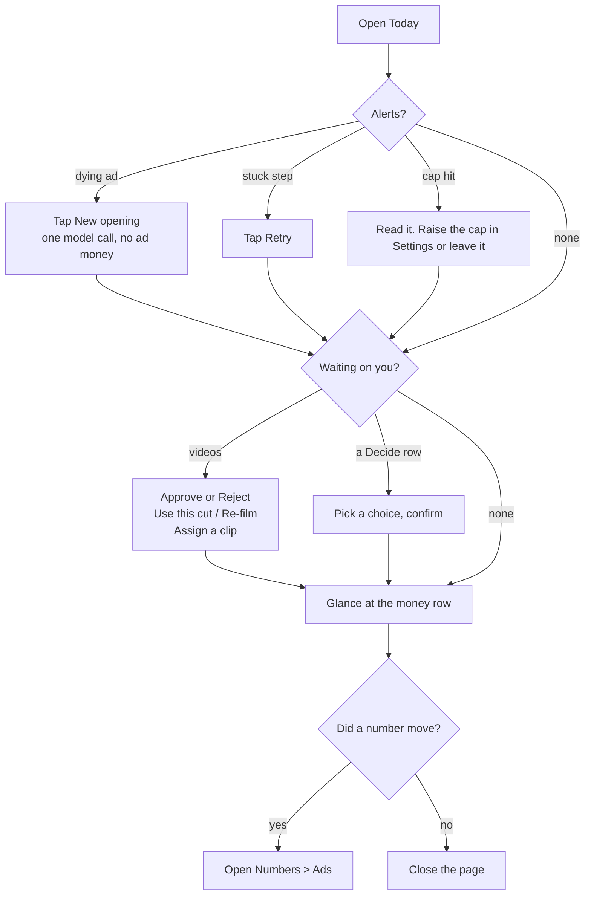
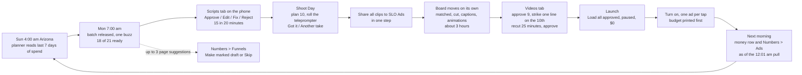

# Command Center design, final (2026-10-05)

Written by the Fable lead designer for the builders on `ops/workflows/marketing-machine-2026-10.md`. This is a design. Nothing in it is live unless §2 says "yes" in the "Back end exists" column.

**How this was chosen.** Three designs were scored by three judges. Totals: Design 1 (Today is home) 20.5; Design 2 (content pipeline, left to right) 23.5; Design 3 (decisions and money first, Studio) 23.5. The top two tied on points; two of the three judges named Design 2 the winner, so Design 2 is the spine. Grafted from Design 3: the no-table "honest page" slice first, "Today's numbers come in tomorrow morning", per-part error banners, disabled-with-reason on every blocked tap, tab state in the URL hash, the model-spend meter, the buzz list in Settings, "Start a roadmap flywheel", the "in chat" labels, and Numbers moved earlier. Grafted from Design 1: the job table in §2 as the done-when list, "Read it" on every flywheel row, the Submagic "Waiting for minutes" rule, the one-ad-per-resume-call test, the "unknown ad" bucket, and the per-stage word table.

**Laws this obeys.** `docs/specs/marketing-machine-2026-10-04.md` (§1, §2, §8.3, §15, §17 all defaults), `docs/specs/marketing-dashboard-plan-2026-10-05.md`, `docs/rules/UI-STANDARDS.md`, `docs/specs/marketing-today-contract.md`, `docs/specs/marketing-offer-contract.md`, `.claude/rules/ad-watch-curve.md`, `.claude/rules/clarity-export-rate-limit.md`, `.claude/rules/page-edits-marked-draft.md`. The company is Fundhub. NULL prints "unknown", never $0. Owner and admin only (`ROLE_SETS.MARKETING`, live in `src/http/read-api.mjs:223`).

**Where the numbers in this file come from.** Every number is from the repo or a live read on 2026-10-05: the Today contract (spend windows), the offer contract (one measured run), `marketing/MACHINE-GAPS.md`, `ops/workflows/roadmap-marketing-2026-10-04.md`, and the approved spec's defaults. Nothing is a guess. Where a cost has never been measured, the page prints "unknown, not measured yet".

---

## 1. The goal, in Chris's words

"I want to run all of marketing from the dashboard, not from Claude Code." Every Monday the scripts show up on my phone and I approve them in 20 minutes. I film them in one sitting, share the clips, and the same day the finished videos are waiting for me to approve. I tap one button and the ads load into Meta, paused. I turn on the ones I want, and I see the budget before I say yes. The next morning the page shows me what each ad did. When something needs me, the page says so in plain words and gives me the tap. Nothing on the page spends my money or turns an ad on unless I tap it and it told me the cost first. The only things left in chat are the ones that need live web research, and the page tells me which those are.

---

## 2. Every Claude Code marketing job -> its dashboard button

This table is the done-when list. A job has "left chat" only when its row's button exists on the page and its cost line reads from the cost ledger (or honestly says "unknown, not measured yet").

| # | Job Chris runs in Claude Code today | Tab | Button label | Inputs | Output | Cost and time shown before the tap | Back end exists | Endpoint |
|---|---|---|---|---|---|---|---|---|
| J1 | Avatar builder (flywheel step 1; 22 to 33 agent runs with live web search) | Ideas, "Offer and market" card, row 1 "Who we sell to" | Read it · Approve · Copy the chat command | Service description; campaign | Status row: "Done. 133 customer quotes collected. Approved." | "Runs in chat for now: it reads live web pages. Cost not measured." | Status yes (in `GET marketing/today`); run no, on purpose | `GET marketing/flywheel?campaign=`, `POST marketing/flywheel/approve` |
| J2 | Ad research (flywheel step 2; 15 to 39 agent runs with web fetch) | Ideas, row 2 "What the market sells" | Read it · Approve · Copy the chat command | Campaign, market, avatar summary, owner notes | Status row: "Done. 361 findings, 8 checked, 160 competitors. Approved." | "Runs in chat for now: it reads live competitor pages. Cost not measured." | Status yes; run no, on purpose | same as J1 |
| J3 | Offer (flywheel step 3) | Ideas, row 3 "The offer" | Write the offer · Read it · Approve · Tweak · Redo | Avatar summary, ad research summary, owner notes (defaulted from the stage files); prices from `src/config/offers.mjs` | Review card first, then name and price; `03-offer.md` written through the outbox so the row turns "Done" | "About 5 minutes. About $0.67 of model spend (last measured run: 4 min 29 s). One run at a time." | Yes, `POST/GET marketing/offer/generate` (writes `marketing_jobs`, not the stage file yet) | `POST marketing/offer/generate`, then `POST marketing/flywheel/approve`, `tweak` |
| J4 | Flywheel copy (step 4; partner-offer ads and emails; dozens to hundreds of calls) | Ideas, row 4 "Ad copy for the partner offer" | Write the copy (off until step 3 is approved) · Read it · Approve · Tweak · Redo | Offer summary, avatar summary, language bank, burned-out angles, owner notes | Top 3 hooks, every piece by angle with its id, dropped pieces with reasons; `04-copy.md` | "Writes 15 to 20 whole ads in three lengths plus email subjects. Dozens of model calls. A few minutes. Cost: unknown until the first server run." | No | `POST marketing/flywheel/run {campaign, stage:4}` |
| J5 | Ad strategy (step 5; the chat script points at a laptop path that no longer exists) | Ideas, row 5 "Which ad strategy" | Pick the strategy (off until 3 and 4 are approved) · Read it · Approve · Tweak · Redo | Offer summary, copy summary, creative count, owner notes; doctrine bundled in `src/` | Strategy name, day-one cost before anything is learned, creative needed vs on hand, tactics Meta would reject; `05-ad-strategy.md` | "About 9 model calls. A few minutes. Spends no ad money. Cost: unknown until measured." | No | `POST marketing/flywheel/run {campaign, stage:5}` |
| J6 | Spend read (step 6: is copy, offer or market the problem?) | Ideas, row 6 "Read the spend" | Read the spend | None to type; reads `ad_metrics_daily` and `ads.fundhub_ad_number` | Table per ad (spend, taps, cost per lead, purchases; "unknown" where NULL), unmatched ads, one conclusion line, a jump to the step it points at; `06-spend.md` | "Free. Reads saved numbers. A few seconds." | No (no code anywhere today) | `POST marketing/flywheel/spend-read {campaign}` |
| J7 | Flywheel approve / tweak / redo (file edits in git that Netlify cannot write today) | Ideas, every stage row | Approve · Tweak · Redo | Stage; one tweak line | Approved stamp or one dated owner-notes line, committed through the outbox; the row shows the same words `npm run flywheel:status` prints | Approve: "Free." Tweak and Redo: "Re-runs step N (its cost and time) and makes later steps out of date." | No | `POST marketing/flywheel/approve`, `tweak`, `run` |
| J8 | Fundhub ad scripts (standard, sorting-hat shorts, long, Notes, VSL) plus the rule and voice edits. The biggest time sink: 32 full ads, 7 shorts, 6 videos since 9/2; one ad took about 20 line-edit commits on 10/4 | Scripts (and Write now on Today) | Write now · Approve · Edit · Fix · Reject · Add a rule · Ban a phrase · Film first | Count and funnel split (from last 7 days' spend), Chris's ideas, `RULES.md` Part 0, `VOICE.md`, recipes; for Fix, Chris's note | Draft cards (hook, line 2, cues, reveal, CTA, check line, slot reason). Approve gives the next number from 91 and commits the file; Edit saves a new version and voice pairs; rules land in Part 0 | Write now: "About $X for N scripts (last batch $Y). Cap $40 a batch; $Z of $300 used this month. Under 10 minutes." Fix: "One rewrite, about the cost of one script." Approve, Edit, Reject, rules: free | Partial: `POST scripts/write` saves text with no model; checker is CLI only; no server writer | Spec §7.8 routes: `GET marketing/scripts`, `POST marketing/scripts/approve|edit|fix|reject|order`, `POST marketing/batches/write-now`, `GET/POST marketing/rules` |
| J9 | "Write ad copy" (Creative Factory one-shot writer; 1 job ever, failed) | Ideas, "Quick copy" card (demoted; stays Today's one filled button only until Write now exists) | Write one piece | Free-text angle; offer type (funding, credit cards, credit repair) | One copy piece with the screen result, the checker's verdict, and the model actually used | "About $X (average of your last 5 runs), or unknown. Writes one piece. About a minute. $U of $2,500 writing budget used this month." | Yes, `POST creative/generate` + `POST creative/run` | same, with `max_jobs: 1` |
| J10 | Meta ad reviews and the hand-built ad -> page -> buy -> sale report (agent hours of SQL) | Numbers (Ads and Funnels views); the money row on Today | Make the report · filters · sort | Window, funnel, format, angle | Sortable per-ad table with as-of, the funnel flow, the "unknown ad" bucket with Link, the Oct 4 report shape as a page | "Free. Saved numbers as of <last pull>." No confirm | Partial: Meta sync daily; migrations 406 to 408 save purchases, link clicks, landing page views; no joined endpoints | `GET marketing/ads`, `GET marketing/ad?n=`, `GET marketing/funnels/stats`, `GET marketing/report` |
| J11 | Watch-curve diagnosis, the dying-ad buzz, the "New opening" rewrite | Today (Alerts) and Numbers (Ads drawer); the 3-choice card lands in Scripts | New opening | The flagged ad (same body kept) | 3 new first lines as one card; picking one saves a new version with the same number, marks it `needs_retake`, puts it on top of Shoot as "first line only" | "One model call, about the cost of one script (last: $X, or unknown). Spends no ad money. Never pauses the ad." | Diagnosis and buzz yes (cron 07:30 UTC, tables `ad_watch_curve_alerts`, `ad_watch_curve_diagnoses`); screen and writer no | `POST marketing/ideas {kind:'opening', target_script_id}` |
| J12 | Clarity pulls (laptop script; 10 a day Microsoft cap; counter in a folder Netlify cannot write) | Numbers, Funnels view | Pull Clarity now (plus a daily sweeper, at most 2 calls) | None (project id and token on the server) | By-page table: sessions, dead clicks, rage clicks, scroll depth, with its pull time | "N of 10 Microsoft pulls used today. One pull, no retry." Refuses at 10 | No (sweeper exists but is not registered) | `POST marketing/clarity/pull`, `GET marketing/clarity` |
| J13 | Ad video pipeline by hand: take matching, joining, Submagic, animations, approve (24 takes tracked, 0 ever approved; 2 waiting since Sep 24) | Videos (and the board on Shoot and Today) | Approve · Reject · strike a line (Recut) · Use the script word · Remove or change an animation · A free note · Retry · Assign · Use this cut / Re-film | Clips shared to SLO Ads, the locked scripts, Settings (template, caption position, animation mode) | One finished video per ad in the Facebook folder, loaded into Meta paused on approve; each decision stored with Chris's staff id | Approve, Reject, animation edits: "free". Any new Submagic project: "about 25 minutes; Submagic bills about N minutes again; M of 100 left this month; a retry pays again." Free note: "one small model call, a few cents" | Partial: sweeper every 5 min, `GET ad-videos`, token approve page; join step runs only on the Mac | Spec §9.1 routes: `GET marketing/videos`, `GET marketing/video?id=`, `POST marketing/videos/approve|reject|edit|hold-choice|recut|retry|assign` |
| J14 | Loading approved ads into Meta and turning them on (the media buyer builds ads by hand; `createAd` exists, nothing calls it) | Launch | Load all approved into Meta, paused · Load this one · Turn on (per ad) · Retry | Approved videos, each funnel's default ad set (Settings), the script's `meta_copy` | Paused ads in Meta with their numbers, copy, CTA, link and UTMs; Meta ids on each row; one ad on per confirm | Load: "Costs $0. Ads load PAUSED. Nothing spends until you turn one on." Turn on: "Ad 91 can spend up to $<budget> a day in <ad set>." Disabled with the reason when the budget is unknown | No for load; campaign-level pause/resume/budget exist on the Campaigns page | `POST marketing/meta/load`, `GET marketing/meta/load-status`, `POST campaigns/write {action:'resume_ad', target:'ad'}` |
| J15 | Weekly brief and the morning pulse in words (manual trigger, no screen) | Today, machine card | Make this week's brief | None | The brief text on the page with a link to Company Brain | "One short model call, under a minute, a few cents." | Yes, `POST ops/weekly-brief` | same |
| J16 | Angles and concepts (angle generator, the 48-concept sheet, Chris's 20 picks in browser storage, "next 10 sorting-hat ads") | Ideas (angle list, the planner's 3 suggestions) and Numbers Angles view | Make more of this · Accept · Save idea | A tap; optional idea text | `ad_ideas` rows that reach the writer; angles with spend, last run, ads per angle | "Free." (Writing costs only through Write now) | No | `GET marketing/angles`, `GET/POST marketing/ideas`, `GET/POST marketing/batches/next` |
| J17 | Shoot planning: lock scripts the night before, BigVU pastes, a 10-video shoot taking a week | Shoot (and the teleprompter page for rolling) | Save the plan · Got it · Another take · Open the teleprompter · Close the shoot | Locked scripts, film order, reading speed | A `marketing_shoots` row, "estimated 48 minutes for 10 ads", the board moving as clips land | "Free." The only confirm is Got it per script | No (`tools/teleprompter/` v1 is a local page; `public/app/teleprompter.html` does not exist) | `GET marketing/shoot`, `POST marketing/shoot`, `POST marketing/shoot/mark` |
| J18 | Landing-page copy changes (marked red/green drafts, ClickFunnels pushes) | Numbers, Funnels view, "Page suggestions" | Make marked draft · Skip · Fix it · Push live | A tap; the suggestion's page, problem with numbers and exact new words come from the machine | A `page_change_requests` row moving requested -> drafted -> fixed -> live; the draft link when an agent session writes it (the draft itself stays agent-built, by law) | "Up to 3 suggestions per batch, about N cents (shown once per batch)." Push live: "This changes the live page. The old page is kept." | No | `GET marketing/pages/suggestions`, `POST marketing/pages/choose|fix-it|push-live` |
| J19 | Testimonial thumbnails, captions, proof cards (local ffmpeg, whisper, Playwright; source screenshots) | None yet. Stays in chat on purpose; the Ideas tab names it under "Still in chat" | none | none | none | none | n/a | later: a Testimonials list on Funnels reading `marketing/testimonials/testimonials.json` |
| J20 | Deep research and the Hormozi vault | None. Stays in chat; "Ask the brain" on `company-brain.html` is the door once ingest is approved | none | none | none | none | n/a | none |
| J21 | Owner decisions buried on boards ($197 follow-up vs $147 page, Submagic credits yes/no, retry may pay again) | Today, "Waiting on you" Decide rows | One tap per choice, then a confirm | Rows an agent writes to `marketing_decisions` | The answer saved with staff id and time, read by the agent that asked | "Free." | No | `GET/POST marketing/decisions` |
| J22 | The three foundations every button above leans on: a repo write path, a cost ledger, a forced-Anthropic model call | No button. Settings shows "Model spend this month: $Z of $300"; the health line on Today shows the outbox state | none | `repo_outbox` rows (fine-grained `GITHUB_REPO_TOKEN`), `marketing_model_usage` rows with dollars, `callModel` `provider:'anthropic'` | Approve, Edit, Tweak, Rule and stage saves land in git; every cost line is the last real run; no call silently swaps to gpt-4o-mini | Until built, every unmeasured button prints "Cost: unknown, not measured yet" with the cap still shown | No | `GET marketing/costs`, `GET marketing/health` |

---

## 3. The tabs

### 3.0 Rules for every tab

- **The strip.** Seven tabs in work order: **Today · Ideas · Scripts · Shoot · Videos · Launch · Numbers.** Settings sits behind the gear top-right (UI-STANDARDS §8), off the strip. Versus spec §8.3: Ideas and Shoot are added; Ads, Angles, Funnels and Map fold into Numbers as four views; nothing is dropped. The strip uses the `.tabs` class (already on the brand shadow list) and at 390px it wraps 4 + 3. It never scrolls sideways.
- **Tab state lives in the URL hash** (`#today`, `#ideas`, `#scripts`, `#shoot`, `#videos`, `#launch`, `#numbers/ads`, `#settings`). Every buzz deep-links through `/login.html?next=/app/marketing-command-center.html#scripts`, so buzz -> tap -> card is two taps.
- **One filled button per screen.** On Today it is always the top row of "Waiting on you". When nothing waits, Today has no filled button.
- **Counts come from one server view.** The strip's counts, the tab dots and the "Waiting on you" rows all read `pipeline` and `waiting` from `GET marketing/today`. The page never adds things up itself, so two places can never disagree.
- **Every cost line reads `GET marketing/costs`** (last measured cost and minutes per job kind, plus month used vs cap). It returns "unknown" until a ledger row exists for that kind. No button prints a guess.
- **One shared review module,** `public/app/marketing-review.js`, draws the script card, the video card and every confirm sheet, and owns `decide(kind, payload)`: it makes a `request_id`, attaches the card's `version`, writes the intent to an IndexedDB queue first, then POSTs. Both this page and `public/app/teleprompter.html` (spec §8.1) use it. One write path per decision.
- **Four states on every card** (UI-STANDARDS §6). Loading is a skeleton in the real layout. Errors are per part: "The Meta numbers did not load. The rest of this page is current. Try again." Never a status code.
- **Blocked taps are disabled with the reason printed,** never hidden, never a blind yes.
- **Text sizes only from the shell whitelist** (`.caption`, `.chip`, `.eyebrow`; body 16px; `.big` for the hero number). At most one escape hatch per screen (UI-STANDARDS §12.7).
- **Phone first.** One column at 390px, no inner scroll boxes except a table, 44px taps, 56px for Approve, Reject at least 32px away from the safe buttons. If any bar is pinned to the bottom it uses `bottom: calc(var(--fh-statusbar) + env(safe-area-inset-bottom))` so it clears `data.js`'s fixed status strip.
- **Word table for every flywheel row and every machine row.** "Offer, step 3 of 6", never "Flywheel step 3". State words: Done / Done, approved / Needs a redo / Waiting on step 3 / Out of date / Running / Not run yet / Runs in chat. Done rows get a sentence ("Done. 133 customer quotes collected."), failed rows get a fix sentence ("The offer file has no guarantee section. Redo the step."). Campaign folder names map to words (`partner` -> "Partner offer").

### 3.1 Today

**Purpose.** The two-minute morning look. Two questions, in order: what needs me, and is the machine healthy? Nothing on Today spends money or turns an ad on.

**What Chris sees, top to bottom.**

1. **Waiting on you** (top-left, largest, with a count badge: "3 to do"). A typed list the server builds from every source table, newest-stuck first. Each row is a count + one verb + how long it has waited + a tap that opens the right tab on the exact card. Row kinds: scripts to approve, videos to approve, cuts on hold (Use this cut / Re-film), clips with no ad (Assign), approved videos not yet loaded, failed machine steps (Retry), page suggestions to pick, and owner decisions written by agents ("The follow-up text still says $197. The page says $147. Pick one."). The top row's verb is the one filled button on the page. A row whose action is not built yet never shows a dead button; it says "Not on this page yet. It still runs in chat." and offers Copy the chat command.
2. **Alerts.** Only things the machine found, in the watch-curve law's words with the real numbers. Oct 4 example: "SLO2 is dying: 1 in 10 people are still watching at the quarter mark. $498.01 spent on it. Change the opening." with **New opening**. Oct 5 example: "No ads are running. The last day with ads was Oct 4." Also: a stuck step ("Captions failed on Ad 91." with Retry), the cost cap ("Writing stopped at $40 for this batch. 14 of 21 are ready."), Submagic out of minutes. An ad people leave early but tap through is never an alert; the Ads drawer says "Left early but tapped through. Leave it." When nothing is wrong: "Nothing needs you right now."
3. **The pipeline strip.** Seven boxes left to right, one count and one verb each: **Ideas** "3 new ideas" · **Scripts** "15 to approve" · **Shoot** "10 to film" · **Videos** "2 to approve" · **Launch** "0 to load, 4 on" · **Numbers** "$606.53 last 7 days" · **Fix next** "1 ad needs a new opening". A zero reads "nothing waiting". Tapping a box opens that tab. This is the week in one glance. At 390px it wraps 4 + 3.
4. **Next drop.** "Monday 7:00 am Arizona · 21 scripts · Roadmap $147: 14, Book a call: 7 (by last 7 days of spend)" with **Change the plan** (opens Scripts > Next batch) and **Write now** (outline). Until the script machine is on: "The script machine is off. Turn it on in Settings."
5. **This shoot** (only while a shoot is open): the progress board, same component as the Shoot tab, read-only here, with an "Open Shoot" link.
6. **Money row.** Three columns: today / 7 days / 30 days. Rows: Spend, Leads, Calls booked, Sales, Cash, ROAS. Every 7 and 30 day cell carries its comparison under it ("Up from $308.93 the 7 days before") and a sparkline. Two sales cells side by side and never added: "Our checkout: 0 paid" and "Meta says: unknown". ROAS prints as words: "$0 back per $1 (0 sales on $915.46)". The today column shows only what our own database owns right now (people on the page, pressed buy, paid, booked, cash) and carries one caption: "Today's ad spend comes in tomorrow morning. The Meta pull runs at 12:01 am." The spend label says "Ad spend, all accounts"; Chris's own account (fundhub-direct) is the hero number with all-accounts under it. One as-of sentence under the row: "Meta numbers run through Oct 4, pulled 12:01 am (7 hours ago). Page tracker live. ClickFunnels last pulled Oct 4, 3:10 pm." When the pull is older than two days the row leads with "Old numbers: last saved Oct 1." Under the row: spend by funnel as a short bar list, and the ad -> page -> lead -> call -> sale flow for 7 days ("135 on the page, 2 pressed buy, 0 paid, 0 booked"). Every by-ad number keeps an "unknown ad" bucket with a Link button so totals never shrink. Rates with fewer than 10 plays print "unknown (fewer than 10 plays)". The words "hook rate" never appear on the page; the cells are "Still there at 2 s" and "Still there at 25%" (the spec §11.1 definition stays under the plainer label).
7. **The machine** (replaces "Machine parts"). One health line first: "The machine is healthy. Last Meta pull 12:01 am. Model spend $Z of $300 this month." Only stuck rows are expanded, each with five words of purpose, when it failed, the reason in words, and Retry. "Show all jobs" unfolds the full clock list (Meta pull, ClickFunnels pull, next-take labels, copy runner, video sweeper, marketing clock, planner, writer, cutter, captions, animations, loader) with last run and result in words ("saved 4 ad-days", "27 labels written", "nothing to do"). Last line, always: "It never turns an ad on, pauses one, or changes a budget. You do that in Launch."
8. **Footer.** "Loaded 3:02 PM" as a clock time, exact time in the title. The page reloads `GET marketing/today` when the tab comes back into focus and every 5 minutes.

**Actions.**

- The one filled button = the top Waiting row ("Approve 15 scripts" -> `#scripts`; "Approve 2 videos" -> `#videos`; "Load 9 approved ads (paused)" -> `#launch`). Until Scripts exists it stays **Write ad copy** (which moves to Ideas as Quick copy after that).
- **New opening** (on a dying-ad alert): sheet "Make 3 new first lines for Ad 84, same body? One model call, about the cost of one script (last: $X, or unknown until measured). Spends no ad money. Never pauses the ad." -> `POST marketing/ideas {kind:'opening', target_script_id}`.
- **Retry** (only on a failed machine row or shoot row): free, one tap -> `POST marketing/jobs/retry {job_id}`. Answers on the row: "Running again. Started 3:04 PM."
- **Write now** (outline): sheet with a count picker (default 3), funnels by spend share, "About $X for 3 scripts (last batch $Y; cap $40 a batch; $Z of $300 used this month). Under 10 minutes." -> `POST marketing/batches/write-now`. The strip then counts "Writing 3… 1 of 3 ready".
- **Decide** rows: one tap per choice ("Use $147" / "Use $197" / "Something else" with a one-line box), then a confirm sheet "Use $147 for the follow-up text? This is saved as your call." -> `POST marketing/decisions`. Two taps, because it is written as owner-set.
- **Pull Meta now** (outline, inside the machine card): "Reads only. Spends nothing. About a minute." -> existing `POST campaigns/sync`.
- **Make this week's brief** (outline, machine card): "One short model call, under a minute, a few cents." -> existing `POST ops/weekly-brief`; result is the brief text with a link to Company Brain.
- **Link this ad** (on the unknown-ad bucket): opens the Campaigns page's existing "Link this ad" control. Free.
- Links: Open Campaigns (`campaign-manager.html`), Open the teleprompter.

**Empty, loading and error states.** Loading: skeletons in the real layout (3 waiting rows, 7 strip boxes, a 6 by 3 money grid, the health line). Waiting empty: "Nothing is waiting on you." and no filled button. Alerts empty: "Nothing needs you right now." Money with no rows: "No ad spend saved yet. The Meta pull runs at 12:01 am." Every NULL prints "unknown"; a measured zero prints 0. Stale pull (over 2 days): the row leads with "Old numbers: last saved Oct 1." and the machine card marks the pull "not ready". Error: one banner per part that failed, the rest stays painted. A part the server reports as not built renders one sentence, never a disabled control with no words. Offer card after a run while the stage file is unwired (until slice 1): "The flywheel step and the latest offer are checked two different ways right now." Offline: "No connection. This page shows the last load from 3:02 PM."

**Phone layout.** One column: Waiting, Alerts, the strip (4 + 3), Next drop, board, money row stacked (today / 7 / 30 as three short blocks), machine, footer. No inner scroll boxes; long text folds behind "Show more". Any time older than a day prints the full date and time in the text. Tiles stack one per row up to 960px.

**Endpoints, in brief.**

- `GET marketing/today` (exists; extend) -> `{ok, as_of, today, timezone, waiting[], alerts[{kind, ad_number, sentence, numbers{}, action}], needs_you[{kind, count, verb, since, href, card_id}], pipeline{ideas, scripts, shoot, videos, launch, numbers_spend_cents, fix_next}, next_drop{at, count, split[], enabled}, shoot{…} | null, money{today, last_7_days, prior_7_days, last_30_days, prior_30_days: {spend_cents, leads, booked, sales_ours, sales_meta, cash_cents, roas}}, by_funnel[], flow{page, pressed_buy, paid, booked}, machine{healthy, line, stuck[], jobs[]}, flywheel{…}, copy{…}, copy_ready{…}, spend{…}, last_sync{meta_synced_at, metrics_synced_at, latest_metrics_date, clickfunnels_synced_at}}`. Back end also builds `last_7_days` as the 7 full days ending at `latest_metrics_date` so both compare windows are 7 days, and adds `prior_30_days`.
- `GET marketing/health` (new) -> `{clock, worker, outbox{pending, last_commit_sha, error}, last_syncs{}, model_spend{used_usd, cap_usd}}`.
- `GET marketing/costs` (new, small) -> `{kinds{offer:{last_cost_usd, last_minutes, measured_at}, script:{…}, opening:{…}, quick_copy:{…}, brief:{…}}, month{used_usd, cap_usd}, submagic{minutes_used, minutes_included}}`; a kind with no ledger row returns `null` and the page prints "unknown, not measured yet".
- `GET/POST marketing/decisions` (new) -> rows `{id, text, choices[], source, answered_by, answered_at, answer}`; POST `{id, answer, request_id}`.
- `POST marketing/jobs/retry {job_id}` (new) -> `202 {ok, job}`.
- `POST marketing/ideas` (spec §7.8), `POST marketing/batches/write-now` (202), `POST campaigns/sync` (exists), `POST ops/weekly-brief` (exists).
- `GET ad-videos?status=awaiting_approval` (exists) feeds the videos wait row until `GET marketing/videos` lands.
- Money definitions come only from `docs/marketing/metrics.md` (new, with fixture tests; the folder does not exist today), built on `adAttributionRollup` in `src/ads/store.mjs:79`. Never from `src/dashboard/kpis.mjs`.

### 3.2 Ideas

**Purpose.** What should we make next? Everything the writer reads lives here: Chris's ideas, the planner's suggestions, the angle list, and the offer-and-market work (the flywheel). Every Run on this tab shows its cost first and spends no ad money.

**What Chris sees, top to bottom.**

1. A meter line: "Model spend this month: $Z of $300. Nothing on this tab spends ad money."
2. **Drop an idea.** A big text box (the keyboard mic does the talking), optional format (standard, short, long, notes, VSL) and funnel. Under it **Your ideas**, each with a status word: new, being written, written (link to the script card), dropped (with the reason).
3. **The machine suggests.** The planner's 3 angle suggestions with their numbers ("Bank turned you down: $212 spend, 2 leads, $106 a lead, last ran Sep 28") and an **Accept** each. Until the planner has run: "The planner has not run yet. It runs 3 hours before the next drop (Monday 4:00 am)."
4. **Angles.** Every angle with spend, leads, last run date, ads per angle. **Make more of this** adds an idea. Chris's 20 picks from the concept sheet move out of browser storage into `ad_ideas` rows here so they survive and reach the writer.
5. **Offer and market** (the flywheel). A campaign picker at the top ("Partner offer"; **Start a roadmap flywheel** creates the folder and owner-notes file through the outbox, free). Six rows in order with plain names and the word table: "1. Who we sell to · Done. 133 customer quotes collected. Approved." / "2. What the market sells · Done. 361 findings, 160 competitors. Approved." / "3. The offer · Needs a redo: the offer file has no guarantee section." / "4. Ad copy for the partner offer · Needs a redo: it did not count its reasons." / "5. Which ad strategy · Waiting on steps 3 and 4." / "6. Read the spend · Not run yet." Each row has **Read it**, which unfolds the stage's review card on this page. An out-of-date row says what changed under it ("Step 3 changed on Oct 5, so this needs a redo").
6. **Quick copy** (the old Write ad copy, demoted to an outline), labelled honestly: "Short copy from a prompt. Not a checked ad script." with the last 10 pieces, each with the model used and the checker's verdict in words.
7. **Still in chat.** One line each for the jobs that stay in Claude Code on purpose and why: avatar research and ad research (live web pages), deep research, testimonial thumbnails and proof cards (local tools and source screenshots), the marked page draft itself (built by an agent session, by law). This list is the page's own record of what has not left chat.

**Actions.**

- **Save idea**: free, one tap -> `POST marketing/ideas {raw_points, script_format?, funnel_key?}`. Answers "Saved. It goes in the next batch."
- **Write now from this idea**: "One script. About $X (last script cost $Y). $Z of $300 used this month. Under 10 minutes." -> `POST marketing/batches/write-now {idea_id}`.
- **Accept** a suggestion / **Make more of this**: free; makes an idea; the row flips to "In the next batch".
- Rows 1 and 2: **Copy the chat command** only (`/flywheel stage 1 partner`), with one line why: "This step reads live web pages, which only the chat agent can do." No Run button until a background function has a web tool.
- Row 3 **Write the offer**: "About 5 minutes. About $0.67 of model spend (last measured run: 4 min 29 s, 24,551 in / 28,640 out tokens). One run at a time." Progress "six offers -> judges -> write-up". Result: the review card first, then the name and price, then the whole offer behind Show more. A second tap while one runs gets "An offer is already being written. This is that run." -> existing `POST marketing/offer/generate`, poll `GET ?id=` every 5 to 10 s while the tab is visible.
- Row 4 **Write the copy**: disabled until row 3 is approved, with the reason printed. "Writes 15 to 20 whole ads in three lengths plus email subjects. Dozens of model calls. A few minutes. Cost: unknown until the first server run." Progress "angles -> written N of 20 -> cleaned N of 60 -> checks". -> `POST marketing/flywheel/run {campaign, stage:4}`.
- Row 5 **Pick the strategy**: disabled until 3 and 4 are approved. "About 9 model calls. A few minutes. Spends nothing on ads. Cost: unknown until measured." -> `POST marketing/flywheel/run {campaign, stage:5}`.
- Row 6 **Read the spend**: free, no model -> `POST marketing/flywheel/spend-read {campaign}`. Result: a table per ad (spend, taps, cost per lead, purchases; "unknown" for NULL), ads with no match, one conclusion line ("Clicks are fine, cost per lead is high: redo the offer") and a button that jumps to that row's Run. Matches ads by `ads.fundhub_ad_number` (migration 407), not by piece id.
- **Approve** (free, one tap; writes the approved stamp through the outbox; the row flips to the same words `npm run flywheel:status` prints) -> `POST marketing/flywheel/approve {campaign, stage, request_id}`. **Tweak** (one-line box; confirm: "This adds one line to your notes, re-runs step 3 (about $0.67) and makes steps 4 to 6 out of date.") -> `POST marketing/flywheel/tweak {campaign, stage, note, request_id}`. **Redo** (same warning) -> `POST marketing/flywheel/run`.
- **Start a roadmap flywheel** -> `POST marketing/flywheel/campaign {key:'roadmap'}` (free).
- **Quick copy**: "About $X (average of your last 5 runs), or unknown. Writes one piece. About a minute." -> existing `POST creative/generate` then `POST creative/run` with `max_jobs: 1`.

**Empty, loading and error states.** Loading: skeleton rows. Empty ideas: "No ideas yet. Type or say one above. It goes in the next batch." A flywheel row with no file: "Not started." with its Run or Copy-the-command button. A failed run keeps its last good state and adds one sentence from the job's error in plain words ("The offer writer stopped: the model key is missing. That is written on the board for an agent.") with Redo. Cap hit: "Stopped at the $300 month cap. Raise it in Settings or wait for next month." No Anthropic key (503 `no_model`): "No Anthropic key is set on the site. An agent must set it." Table not live (503 `not_ready`): "This button is not live yet. It turns on at the next ship." Repo write pending: "Saved. Reaching the repo…" then "In the repo"; outbox refused (422): "The repo refused the save: <plain>. Shown on the machine card." Quick copy with a missing setup piece names it in words before the button is enabled (from `copy_ready.missing`).

**Phone layout.** One column; the idea box first; each flywheel row is a two-column grid (name | state chip) with the sentence on a full-width second line; the review card unfolds in place; no inner scroll box.

**Endpoints, in brief.**

- `GET marketing/flywheel?campaign=` (new) -> `{campaign, stages[{n, key, label_words, state, state_word, sentence, approved, last_run{job_id, finished_at, cost_usd}, review_card_md}], advice, campaigns[]}`.
- `POST marketing/flywheel/run {campaign, stage, request_id}` -> `202 {ok, job}`; `POST marketing/flywheel/approve` -> `200 {ok, stage, outbox_id}`; `POST marketing/flywheel/tweak {campaign, stage, note, request_id}` -> `202 {ok, job, outbox_id}`; `POST marketing/flywheel/spend-read {campaign}` -> `200 {ok, rows[], unmatched[], conclusion{text, points_to_stage}}`; `POST marketing/flywheel/campaign {key}` -> `201 {ok, campaign}`.
- Flywheel runs are `marketing_jobs` rows with `kind='flywheel_stage'` and `payload={campaign, stage}`; results go to `marketing/flywheel/<campaign>/0N-*.md` through the outbox (add `marketing/flywheel/` to the allow-list in spec §6 step 2). Ports of `.claude/workflows/copy.js` and `ad-strategy.js` land in `src/marketing/flywheel/*.mjs` as pure functions with the doctrine bundled in `src/` (the chat versions read skill folders that are missing from this Mac or outside the repo). The copy stage checkpoints per piece into `marketing_jobs.result` and re-queues itself under the 15-minute worker cap.
- `GET/POST marketing/ideas`, `GET/POST marketing/batches/next`, `GET marketing/angles` (spec §7.8, §11.2).
- Existing: `POST/GET marketing/offer/generate` (the offer run must also write `03-offer.md` through the outbox and a `marketing_model_usage` row), `POST creative/generate` + `POST creative/run` (add `max_jobs: 1` or a `job_id` filter in `api/creative/run.mjs`; force Anthropic with an explicit model as `src/marketing/offer-transport.mjs` does; run `checkScriptText` on the saved text and return the verdict; drop the em dash from the offer writer's message).

### 3.3 Scripts

**Purpose.** The Monday job: approve this week's scripts from the phone in 20 minutes, 80 seconds a script. Also the next plan, batch history and the copy rules.

**What Chris sees, top to bottom.**

1. Header: "Monday's batch: 18 of 21 ready, 3 need a look, cost $12.40" and "12 left" as the pass moves. Filter chips: Drafts (default), Approved, Filmed, Rejected, All.
2. **One card at a time.** Caption: "Draft 3 of 15 · Roadmap $147 · standard" (no ad number yet; it is given on Approve). The hook and line 2 as two bold body-size lines, word for word. The cues as a short list. The reveal and the CTA word for word. "Read the rest" for long and VSL formats. One check line in words: "Passes every rule" or "Needs a look: it says 'round two'. Approve anyway if you like it." One slot line: "Why this slot: Ad 84's angle spent $498 last week." The planned animations as a short list; the Meta ad text folded under "Ad text".
3. A **new opening** card type: "New first line for Ad 84" with three full-width 56px outline choices, each a candidate first line word for word.
4. **Approved and locked**: number (91 and up), angle, funnel, format, filmed yes/no, film order with up/down arrows and a **Film first** toggle (no drag on a phone), and a "Send to Shoot" link.
5. **Next batch**: the plan with each slot's reason, the split by funnel, and Chris's one-time changes.
6. **Batch history**: date, count ("18 of 21 ready, 3 failed"), cost, release time.
7. **Rules**: Part 0 as a numbered list in his words, the banned phrases, recent changes with dates and the commit time when the outbox lands it. A line "The machine has learned from N of your edits" (voice pairs).

**Actions.**

- **Approve**: the one filled button, 56px, full width on a phone. Free. "Approved. This is Ad 91." Locks the script, gives the number once (from 91), commits -> `POST marketing/scripts/approve {id, version, request_id}`. Advances to the next card.
- **Edit** (outline, 44px): the card's parts become one text box each, hook and line 2 first; **Save new version** / Cancel -> `POST marketing/scripts/edit {id, version, request_id, parts:[{kind, before, after}]}`. Old version kept; voice pairs saved from the diff; checker warnings never block.
- **Fix** (outline, 44px): a dictation box plus a "Make this a rule" checkbox, then **Rewrite it**. Sheet: "One rewrite, about the cost of one script ($X last measured)." -> `POST marketing/scripts/fix {id, version, request_id, note, make_rule}` returns 202; the card says "Rewriting from your note. It comes back here when done." and slides to the end of the stack; the header count does not drop.
- **Reject**: a text-weight outline at least 32px below the action group; confirm sheet "Reject this script? It will not be filmed." with an optional dictated reason (default "rejected from the app, no reason given") and **Reject it** / **Keep it** -> `POST marketing/scripts/reject {id, version, request_id, reason}`. Two taps, never one.
- **Pick an opening**: tap one of three, confirm "Use this opening for Ad 84?" -> `POST marketing/scripts/edit {from_idea_id, option}`. New version, same body, same number, `needs_retake`.
- **Film first** and arrows -> `POST marketing/scripts/order {ids[]}`.
- **Write now** (outline in the header): the same cost sheet as Today -> `POST marketing/batches/write-now {count?, idea_id?}`.
- **Change the next plan** -> `POST marketing/batches/next {overrides}`; shows the new split before save.
- **Add a rule** / **Ban a phrase** -> `POST marketing/rules {op, text, request_id}` (free; lands in `RULES.md` Part 0 through the outbox; answers "Saved. The next batch follows it.").
- Swipe left or right moves between cards or reveals the buttons. **A swipe never saves.** Only the button tap posts, because Approve burns a number that is never reused. Pointer events with `touch-action: pan-y`, so page scroll still works and Playwright drives it with `page.mouse`.

**Empty, loading and error states.** Loading: one skeleton card. Drafts empty: "No scripts waiting. The next drop is Monday 7:00 am. Write now makes some today." Before the machine ships: "Scripts still come from chat. This tab turns on when the script machine is ready." Writing: "Writing. 6 of 21 ready." as a live count. A flagged draft: a word chip "needs a look" and the one failing rule as a sentence at the top; Approve stays enabled. Cap hit: "Writing stopped at $40 for this batch. 14 of 21 are ready; the rest come next time." Stale save (409): a Yours / Theirs sheet, stacked at 390px, with **Use mine** / **Use theirs**. Signed out (401): the queue is kept, the sign-in wall shows, the queue sends after sign-in. Offline: "No connection. Saved on this phone. It sends when you are back online." Repo commit lagging: "Saved. Reaching the repo…" then "In the repo." Rules save failed: "The rule did not save. Nothing changed."

**Phone layout.** One card fills the screen. Approve 56px full width; Edit and Fix 44px side by side under it; Reject below them with the gap; the header count stays visible. The new-opening card is three 56px choices. The Rules and Next batch sections sit below the inbox as folded cards.

**Endpoints, in brief** (spec §7.8; every write carries `version` and `request_id`; stale = `409 {error:'stale', current:{version, body, parts}}`).

- `GET marketing/scripts?status=&batch=` -> `{ok, scripts[{id, root_script_id, version, status, ad_id, script_format, funnel_key, angle_key, parts[], check_results, slot_reason, cost_usd, film_order, needs_retake}], batch{id, counts, cost_usd, release_at}}`.
- `GET marketing/script?id=` -> `{ok, script, versions[], checks[]}`.
- `POST marketing/scripts/approve` -> `200 {ok, script:{id, ad_id, status:'locked', version}, outbox_id}`; `edit` -> `200 {ok, script, voice_pairs_saved}`; `fix` -> `202 {ok, job}`; `reject` -> `200 {ok}`; `order` -> `200 {ok}`.
- `GET marketing/batches`, `GET/POST marketing/batches/next`, `POST marketing/batches/write-now` -> `202 {ok, batch}`, `GET/POST marketing/rules` -> `{ok, rules[], banned[], recent[]}`.
- Tables (spec §7.4): `marketing_batches`, `ad_ideas`, `voice_pairs`, the new `ad_scripts` columns, `next_ad_number(org)` with floor 91. The 8 live `ad_scripts` rows and the locked SLO ads 84 to 90 (`scripts/ad-scripts-load-locked.mjs`) must survive the backfill.
- The writer: `callModel` `provider:'anthropic'`, model `claude-opus-5-5`, forced `save_script` tool, strict `checkScriptText` import, Sonnet judge, compliance screen, sameness; every call logged in `marketing_model_usage`; the batch stops at `max_batch_cost_usd` ($40) or `max_month_cost_usd` ($300) with one buzz.
- `docs/specs/marketing-machine-api.md` is written in lane A's first M1 PR so lane E can mock every route.

### 3.4 Shoot

**Purpose.** What do I film today, and where is each clip now? Plan the shoot, roll it in the teleprompter, watch each ad move to a finished video.

**What Chris sees, top to bottom.**

1. Top-left: "Today's shoot: 10 scripts, about 48 minutes" (each script's read time at the set speed, plus 2 minutes per ad). Retakes and new openings sit on top, labelled "first line only".
2. The plan list: every approved script with no Got it mark, in film order, with number, angle, format and read time; up/down arrows and **Film first** on each row.
3. A checklist with tap boxes: rig set, mirror on, remote paired, phone charged with storage free.
4. **Open the teleprompter** (opens `teleprompter.html` on this shoot).
5. After filming: "Share all the clips to SLO Ads in one step" with the Drive link (folder `13ZOjA56MNuM-PHSRK5fQK0bovRwR8raZ`), then one line above the board: "N clips landed, matching".
6. **The progress board.** One row per ad that moves on its own: filmed -> uploaded and matched -> cutting -> captions -> animations -> ready to approve -> approved -> loaded. A merged take shows under its ad's master. A failed row shows the step it failed at and Retry. A rejected video puts its script back on the plan as a retake. Anything that needs Chris (a clip with no ad, a missing hook, a held cut) sits at the top. Until the video worker ships, a row stuck at cutting says "The join step still runs on the Mac" instead of spinning.
7. Past shoots: date, filmed count, finished count, loaded count.

**Actions.**

- **Save the plan**: the one filled button before filming. Free. "Saved. 10 scripts in this order." -> `POST marketing/shoot {root_script_ids[], shoot_date}`.
- **Got it** / **Another take**: free; from the teleprompter or the row here -> `POST marketing/shoot/mark {shoot_id, root_script_id, mark}`.
- **Assign a clip**: pick the script for a clip the matcher could not place. Free -> `POST marketing/videos/assign {video_id, script_id}`.
- **Retry a failed step**: free when it is the cut or the animations. When it would make a new Submagic project the button reads "Retry captions: Submagic bills about N minutes again. M of 100 left this month." and needs a confirm. When Submagic minutes are 0 the button is replaced by the words "Waiting for Submagic minutes" so no tap can pay -> `POST marketing/videos/retry {video_id}`.
- **Use this cut** / **Re-film** on a held cut: free -> `POST marketing/videos/hold-choice {video_id, choice}`.
- **Close the shoot**: confirm "Close this shoot? Scripts not marked Got it stay on the next plan." -> `POST marketing/shoot {id, status:'done'}`.

**Empty, loading and error states.** Loading: skeleton rows. Empty plan: "No approved scripts to film. Approve some in Scripts first." No open shoot: "No shoot planned. Pick scripts above and save the plan." Board empty after filming: "No clips have landed yet. Share them to SLO Ads; they show here within 5 minutes." Match failed: "This clip did not match a script. Pick one." with Assign. Step failed: the step name and the reason in words ("Captions stopped: Submagic is out of credits. Buying more is in Waiting on you.") with Retry only where a retry can help. Teleprompter link with no shoot: disabled with "Save a plan first."

**Phone layout.** The time estimate top-left; plan rows as a two-column grid (name | read time) with arrows at the far right; the checklist as 44px rows; the board rows as name | step chip with the reason on a second line.

**Endpoints, in brief.** `GET marketing/shoot` -> `{ok, shoot{id, shoot_date, status, root_script_ids[], marks{}, estimated_minutes, board[{ad_id, angle, step, step_word, since, reason, can_retry, needs_you}], landed_unmatched}} | {shoot:null, plan_candidates[]}`; `POST marketing/shoot` -> `201|200 {ok, shoot}`; `POST marketing/shoot/mark` -> `200 {ok, marks}`; table `marketing_shoots` (spec §6 step 3). Board rows read the `ad_videos` states through `STATE_MEANING` words (`src/ad-videos/states.mjs:57`). `public/app/teleprompter.html` (spec §8.1) reads the same `GET marketing/shoot`.

### 3.5 Videos

**Purpose.** Which finished videos go out? Approve, fix one line, or send it back to be filmed again. The line list is the editor.

**What Chris sees, top to bottom.**

1. Header: "2 to approve · 1 on hold · 3 being cut". One card at a time for videos waiting on him.
2. The card: the player full width (controls, `playsinline`, `preload="metadata"`, never autoplay with sound) from a signed 24-hour link to our own final file; "Ad 91 · <angle> · Roadmap $147"; takes used; "Submagic billed 1.2 minutes on this video"; the date it finished.
3. The script lines under the player, each a 44px row with a word chip ("kept", "missing", "said differently") and the transcript's words when different. Caption mismatches as rows: "Submagic heard: fundable · Script says: fundability". The animations as a list with Remove / Change.
4. Held cuts: "Ad 87: the cut is missing the reveal line. Use this cut, or re-film?"
5. **Approved** list with the finished file name in the Facebook folder and the state word: "In the folder", "In Meta, paused", "On".
6. **Being cut** list with each video's step and the time it entered it.
7. A Submagic meter: "38 of 100 Submagic minutes used this month" (reads "unknown" until minutes are logged per video).

**Actions.**

- **Approve**: the one filled button, 56px. Free. "Approved. It goes to the Facebook folder and loads into Meta paused." Records Chris's staff id -> `POST marketing/videos/approve {id, version, request_id}`.
- **Reject**: set apart below the group, outline; confirm "Reject this video? Ad 91 goes back to Shoot Day to be re-filmed." with an optional reason -> `POST marketing/videos/reject {id, version, request_id, reason}`.
- **Tap a line to strike or restore it** (local until sent). Once a line is struck the filled button becomes "Recut with 1 line struck: about 25 minutes. Submagic bills about N minutes again (M of 100 left)." and Approve turns outline, so there are never two filled buttons. N is the master length; "unknown" when null -> `POST marketing/videos/edit {id, version, request_id, kind:'strike', lines[]}`.
- **Use the script word** (caption mismatch): label "no recut, a few minutes, no new Submagic charge" -> `edit {kind:'caption', word_from, word_to}`; the word also joins `caption_dictionary`.
- **Remove / Change an animation**: label "only this clip re-renders; Submagic does not run again" -> `edit {kind:'animation', …}`.
- **A free note** (mic): sheet "One small model call, a few cents. If it cannot be turned into an edit, an agent gets it." -> `edit {kind:'note', text}`.
- **Use this cut** / **Re-film** -> `POST marketing/videos/hold-choice`. **Recut with the late take** (same minutes sentence) -> `POST marketing/videos/recut`. **Retry** (same rule as the Shoot tab) -> `POST marketing/videos/retry`.

**Empty, loading and error states.** Loading: a skeleton card with a grey player box and 6 line rows. Empty: "No videos waiting. Finished videos show here about 3 hours after a shoot." No playable link: "The finished video is not linkable yet. Try again in a minute." with Approve and Reject disabled and that sentence beside them. Submagic out of minutes: "Submagic has 0 minutes left this month. Captions wait until more are bought." and no paid tap anywhere. Failed step: the step name and the reason in words, Retry only where it helps. Edit in progress: "Recutting. Back in about 25 minutes." and the card moves to Being cut. 409: "Someone already decided this video at 3:01 PM." with the current state. Offline: the queued-save sentence. Worker down: "The video worker has not checked in since 2:10 PM." and Retry disabled with that reason.

**Phone layout.** Player full width, then the line list (44px rows, chip first), then the action group (Approve 56px, edits as outlines), Reject apart. No inner scroll box; the take list folds.

**Endpoints, in brief** (spec §9.1). `GET marketing/videos` -> `{ok, videos[{id, ad_id, angle, funnel_key, state, state_word, since, master_duration_seconds, submagic_minutes, can_approve}], counts{}}`; `GET marketing/video?id=` -> `{ok, video, signed_url|null, lines[{text, state, heard}], caption_mismatches[], animations[], takes[], edits[]}`; `POST marketing/videos/approve|reject|edit|hold-choice|recut|retry|assign` -> `200|202 {ok, video}`; table `ad_video_edits`; one commit per round to `marketing/ads/videos/<ad>.json` through the outbox. **One writer.** These staff routes call the same `store.approve()` / `store.reject()` in `src/ad-videos/store.mjs` that the public token page (`api/public/ad-video-approve.mjs`) uses; `docs/specs/marketing-machine-api.md` records that the token page becomes a thin wrapper over the same function or is retired for new rounds. Never two independent writers. Until the full routes land, the thin version reads `GET ad-videos?status=awaiting_approval` and decides through the existing store path.

### 3.6 Launch

**Purpose.** Put approved ads into Meta, paused, and turn on the ones Chris picks, one ad at a time, with the budget shown first. The only tab where a tap can lead to spending.

**What Chris sees, top to bottom.**

1. Top-left, largest: "10 approved, 0 loaded" and beside it "Ads on now: 4".
2. One row per approved or loaded ad: "Ad 91 · <angle> · Roadmap $147 · ad set <name> · PAUSED", its ad set's daily budget ("up to $100 a day", or "unknown"), Meta ids as they come back, and the load step it is on (uploading video -> waiting for Meta -> creating the ad -> loaded).
3. A plain flag when the ad set or campaign is paused: "Ad set is paused: nothing in it spends until the ad set is on."
4. Refusals as sentences on the row: "Meta will not take this ad set: it already has 50 ads." "This copy was blocked by our screen: <reason>." with Retry where a retry can help.
5. An "unknown ad" bucket: Meta spend on ads with no number, with **Link this ad**.
6. A short line of what loading does: "Ads load PAUSED with their number, copy, link, UTMs and every Meta enhancement turned off."
7. **Open Campaigns** link to `campaign-manager.html` for campaign-level pause and budget (those controls already exist there through `campaigns/write`).

**Actions.**

- **Load all approved into Meta, paused** (the one filled button): confirm sheet "10 ads load PAUSED into their funnel's ad set. Nothing spends until you turn one on. Costs $0." -> **Load them** -> `POST marketing/meta/load {all:true}`; rows fill in from `GET marketing/meta/load-status`.
- **Load this one** (outline per row) -> `POST marketing/meta/load {script_id}`.
- **Turn on** (outline, far right of a loaded row): sheet "Turn on Ad 91? It can spend up to $100 a day in roadmap_147. (Ad set is paused: it will not spend until the ad set is on.)" -> **Yes, turn on Ad 91** -> `POST campaigns/write {action:'resume_ad', target:'ad', id}` through `guardedWrite`. One ad per call. Select-many shows one sheet listing each ad and the summed daily budget; the server still makes one `resume_ad` call per ad. **Disabled with the reason when the budget is unknown:** "Its ad set's daily budget is unknown. Sync Meta first." with a Pull Meta now link.
- **Retry load** (per row) -> `POST marketing/meta/load` again; it resumes from the last saved Meta id.
- **Link this ad** (unknown bucket): the Campaigns page's existing control. Free.
- **Never present:** turn on a whole campaign or ad set, pause all, delete an ad. Per-ad Pause and ad-set budget change are not in v1 (see §7, question 3); the Campaigns page keeps campaign-level pause and budget.

**Empty, loading and error states.** Loading: the big number as a skeleton and 3 skeleton rows. Empty: "No approved videos to load. Approve one on Videos first." No ad set mapped: "The Roadmap $147 funnel has no default ad set. Set it in Settings." with a link. Token cannot create ads: "Meta's connection cannot create ads. An agent must re-connect it with ads_management." (one browser click for Chris; the page says so; the stored key is never removed). Meta refused: the row sentence plus Retry; never a code. Video still processing at Meta after 20 minutes: "Meta is still working on the video. It retries by itself; no tap needed." Load worker down: the filled button is disabled with "The loader has not checked in since 2:10 PM." A failed Turn on answers on the row: "Meta said no: <plain reason>. The ad is still paused."

**Phone layout.** The big count, the filled Load button full width, then one row per ad with a 44px Turn on at the far right; the confirm sheets slide up from the bottom above the status strip.

**Endpoints, in brief** (spec §10). `POST marketing/meta/load {all?|script_id, request_id}` -> `202 {ok, jobs[]}`; `GET marketing/meta/load-status` -> `{ok, rows[{script_id, ad_id, angle, funnel_key, ad_set{external_id, name, status, daily_budget_cents}, step, meta_video_id, meta_creative_id, meta_ad_external_id, loaded_at, load_error}], counts{approved, loaded, on}}`. `src/adplatforms/meta.mjs` gains `uploadVideo`, `waitForVideo`, `createCreative` (every enhancement `OPT_OUT`, read back, stop on `OPT_IN`; `url_tags` = `utm_source=fb&utm_medium=paid&utm_campaign=<lane>&utm_content=<ad number>`); the existing `createAd` stays PAUSED; the ad set guards (archived, dynamic creative, 50 ads, special ad category); Meta API v26.0 (spec §6 step 5); a migration replacing `ads_fundhub_number_uq` with a plain index and adding `fundhub_ad_number_source`. `api/campaigns/write.mjs` gains `resume_ad` with target `ad` through `guardedWrite`. The sync stores ad set `daily_budget` and `status` so the sheet can print them. `marketing_funnels.default_ad_set_external_id` comes from Settings.

### 3.7 Numbers

**Purpose.** What happened, by ad, angle and funnel, and what do we make more of? Four views under one as-of line: **Ads · Angles · Funnels · Map.** No model, no money, no confirm on this tab except New opening, Pull Clarity now and Push live, and each of those says so.

**What Chris sees, top to bottom.**

1. A view switch (Ads · Angles · Funnels · Map) and one shared as-of sentence: "Meta numbers run through Oct 4, pulled 12:01 am. Page tracker live. Clarity pulled Oct 4. ClickFunnels totals, not by day."
2. **Ads view.** A sortable table, sorted by spend: ad number, angle, funnel, spend, shows, taps, plays, "Still there at 2 s", "Still there at 25%", ThruPlay, leads, calls booked, sales (our checkout) and "Meta says" purchases side by side, cash, cost per lead, cost per booked call, ROAS, last day it ran. Filters above the table: window, funnel, format, angle. A last row "unknown ad" keeps the unmapped spend and leads with a Link button. Leads newer than 14 days carry a "still maturing" chip. Tap a row: a drawer with the second-by-second watch curve (`ad_metrics_daily.video_play_curve`) and the quartiles, the next-take diagnosis (opening / middle / ask, fix type, film note, date), the hop note ("Left early but tapped through. Leave it."), the script's hook and line 2, links to Meta and the repo file, and **New opening** when the curve flagged it. The curve note says "from the curve" when the 2-second column was blank.
3. **Angles view.** Each angle with spend, leads, cost per lead, last run date, ads per angle, best and worst ad; **Make more of this**; the planner's 3 suggestions with **Accept**.
4. **Funnels view.** Per funnel: ad -> page -> lead -> call -> sale with step rates; the page funnel (opened, scrolled, played the video, pressed buy, paid); spend by funnel; the Clarity table by page (sessions, dead clicks, rage clicks, scroll depth) with "N of 10 pulls used today" and its as-of; **Page suggestions** (page, the problem with numbers, the exact new words, status new / drafted / skipped / fixed / live, the draft link when it exists); later a Testimonials list.
5. **Map view.** The brain map on canvas (nodes: offer, funnel, angle, ad, script, video, page, batch; size = spend; color = type with a word label, never color alone), zoom, pan, search, filters; a side panel with the node's numbers and links to Drive, Meta and the repo file; a **Library** list Offer -> Funnel -> Angle -> Ad -> versions, takes, final video, Meta ad, numbers. On a phone the Library list is the default; the canvas is a tap away.
6. **Make the report**: renders the Oct 4 report shape (spend, shows, taps, plays, 25/50/75/100, ThruPlay, sales; then the page funnel: opened, scrolled, played, pressed buy, paid) as a page for any window, SQL only, with "Copy as text".

**Actions.**

- Filters and sort: free. Row click opens the drawer; actions live at the row's far right.
- **New opening** (drawer): the same sheet as Today -> `POST marketing/ideas {kind:'opening'}`.
- **Link this ad** (unknown-ad row): the existing `campaigns/link-asset` control.
- **Make more of this** / **Accept** -> `POST marketing/ideas` (free).
- **Pull Clarity now** (Funnels): sheet "Uses 1 of 10 daily pulls (N used today). Free in dollars. One pull, no retry." -> `POST marketing/clarity/pull`; at 10 the button is disabled with "10 of 10 pulls used today. More tomorrow."
- **Page suggestions**: **Make marked draft** / **Skip** -> `POST marketing/pages/choose`; **Fix it** -> `POST marketing/pages/fix-it`; **Push live** with confirm "This changes the live page. The old page is kept." -> `POST marketing/pages/push-live`. The buttons only move the row; an agent session builds the draft by the marked-draft law and the link appears on the card.
- **Make the report** -> `GET marketing/report?from&to` (free).
- **Make this week's brief** also lives here (same button as Today).

**Empty, loading and error states.** Loading: a table skeleton of 8 rows, a grey map box. No data in the window: "No ad numbers saved for Sep 1 to Sep 7." Unmapped: "18 leads, 0 tied to an ad number yet." with Link. Rates under 10 plays: "unknown (fewer than 10 plays)". Curve missing: "Meta sent no curve for this day." Clarity cap: the disabled button with its sentence; Clarity failed: the one error sentence, no retry button, by law. ClickFunnels stale: "ClickFunnels numbers last pulled Oct 4, 3:10 pm." Suggestions empty: "No page suggestions yet. They arrive with each batch." Draft not built yet: "Draft requested Oct 6. An agent builds it; the link shows here." Map empty: "The map fills in as ads get numbers. 7 ads, 0 linked yet." Report with missing sources: each missing block prints "not pulled" with its last as-of, never a blank. The page must load in under 2 seconds with 30 days of data (spec M5 done-when 2).

**Phone layout.** The view switch as four chips; the Ads table scrolls inside its own box (the one allowed exception, UI-STANDARDS §11); everything else stacks; the drawer opens as a full-screen sheet; the Library list is the Map's phone default.

**Endpoints, in brief** (spec §11.2). `GET marketing/ads?from&to&funnel&format&angle` -> `{ok, as_of{}, rows[{ad_id, angle, funnel_key, spend_cents, impressions, link_clicks, plays, hold_2s, hold_25, thruplay, leads, booked, sales_ours, sales_meta, cash_cents, cpl_cents, cpb_cents, roas, last_day, maturing}], unknown_ad{…}}`; `GET marketing/ad?n=` -> `{ok, ad, curve[], quartiles{}, diagnosis{…}|null, script{hook, line2}, links{}}`; `GET marketing/angles` -> `{ok, angles[], suggestions[]}`; `GET marketing/funnels/stats` -> `{ok, funnels[{key, name, flow{spend, page, lead, call, sale}, page_funnel{}, clarity{rows[], pulled_at, pulls_today}}]}`; `GET marketing/report?from&to` -> the report blocks with each source's as-of; `POST marketing/clarity/pull` -> `{ok, pulled_at, pulls_today}` or the one error sentence; `GET marketing/pages/suggestions`, `POST marketing/pages/choose|fix-it|push-live` (spec §14; tables `page_suggestions`, `page_change_requests`); `GET marketing/map` -> `{nodes[], edges[]}` (spec §13). Every fraction goes through `watchRate()` in `src/ops/watch-curve.mjs` so the 10-play floor and the word "unknown" are the same everywhere. One shared day helper (`src/lib/ad-account-day.mjs`) and one money formatter are shared with Today, the Campaigns page, the ops brief and the pulse. Clarity: the counter moves into the database; `src/workflows/clarity-insights-sweeper.mjs` is registered at most 2 calls a day with `retries: 0`; the pull goes through `src/adapters/clarity-export.mjs` only.

### 3.8 Settings (the gear, top-right)

**Purpose.** The machine's dials. Nothing here spends. Chris changes a number, taps Save, done.

**What Chris sees, top to bottom.**

1. The machine switch: On / Off, with "When on, scripts come every Monday at 7:00 am Arizona and the writer may spend up to $40 a batch." and who flipped it last.
2. Schedule: drop day and time (Monday 7:00 am, Arizona), scripts a day (3), days a batch (7), size rule ("3 a day in total" or "3 a day for each running funnel"), drafts expire after 14 days, settle time 10 minutes. Next free ad number (read-only, from `next_ad_number`) and the floor 91.
3. Costs: "$40 a batch, $300 a month" with "used this month: $Z" and the last batch's cost. A cap set below what is already spent warns before Save: "This is below what is already spent ($Z). Runs stop at once."
4. Quiet hours 9:00 pm to 7:00 am: "Buzzes wait until 7:00 am." Then the buzz list as read-only words: "You get a buzz when: a batch is released (with the count), a shoot is ready to approve, an edit round is back, an ad is dying (opening only), the cost cap is hit, a step is stuck that needs you. Everything else is page-only." Plus the phone that gets buzzed and a **Test buzz** button.
5. Funnels: one row each (`roadmap_147`, `book_call`): landing page, lane, book-a-call yes/no, format mix, weight, active, the Meta campaigns linked to it with each campaign's 7-day spend beside it for mapping, and the default ad set picked from the synced ad sets.
6. Video: Submagic template (picked from Submagic's own list; Hormozi 2 default, Hormozi 1 backup), caption position, magic zooms off, clean audio on, caption dictionary words, animation mode (full frame / see-through), flip for a mirrored camera.
7. The winner rule: blank, with "Until you fill this in, the machine writes more new versions of the angles you spend the most on."
8. Keys status by name only (Anthropic, Meta, Submagic, ClickFunnels, Clarity): "set" or "not answering". Never the value. The page never offers to remove or replace a key.
9. "What the machine never does: turn an ad on, pause one, or change a budget."

**Actions.** **Save** (bottom-right, the one filled button) -> `POST marketing/settings`; answers "Saved 3:05 PM". **Turn the machine on / off**: confirm names the consequence ("Turning on starts the Monday batch. It writes scripts and may spend up to $40 a batch." / "Turning off stops new batches. Nothing already written is lost."). **Save funnels** / link a Meta campaign / pick the default ad set -> `POST marketing/funnels`. **Pick the Submagic template** (reads `GET marketing/submagic/templates`). **Test buzz** -> `POST marketing/buzz/test` (free; "Sent 3:06 PM" or the plain error).

**Empty, loading and error states.** First open: the defaults row is created and the page says "These are the defaults you approved on Oct 5. The machine is off until you turn it on." Loading: a form skeleton. Save failed: "Did not save. <plain>. Try again." with the old values still in the boxes. Submagic list unreachable: "Could not read Submagic's templates. Hormozi 2 stays." Funnel with no campaign linked: "No Meta campaign is linked to this funnel, so its spend reads unknown and the batch split treats it as $0 spent." No synced ad sets: "No ad sets are synced yet. Pull Meta now, then pick one." Test buzz failed: the plain error, no retry loop.

**Phone layout.** One column of labelled fields, 44px inputs, Save pinned bottom-right above the status strip.

**Endpoints, in brief.** `GET/POST marketing/settings` (`marketing_settings`, one row per org created on first read with the spec §6 step 3 defaults); `GET/POST marketing/funnels` (`marketing_funnels`, seeded `book_call` and `roadmap_147`, joined to synced campaigns' 7-day spend and ad sets); `GET marketing/submagic/templates`; `POST marketing/buzz/test` (through `notify-fanout`, written as a `marketing_buzzes` row); `GET marketing/health` for the cost meter. The clock does nothing while `enabled` is false (spec §6 step 4).

### 3.9 What stays in Claude Code, and how the page says so

After every slice in §6 ships, the only marketing work left in Claude Code is: avatar research (J1), ad research (J2), deep research (J20), testimonial thumbnails and proof cards (J19), and the building of a marked page draft (the agent-side half of J18). Each has a status row or a stated reason on the Ideas tab under "Still in chat". That sentence is a board done-when: a builder can check it by reading the page.

---

## 4. The weekly loop and the morning view

### 4.1 The morning view as it should have read on Oct 5 at 7:00 am Arizona

Built from real numbers so the builders have a concrete target.

- **Waiting on you (3 to do):** "Approve or reject 2 videos (waiting since Sep 24) > Videos" · "Redo the offer step: it has no guarantee section > Ideas" · "Decide: the follow-up text says $197, the page says $147 > Use $147 / Use $197".
- **Alerts:** "No ads are running. The last day with ads was Oct 4. 4 of 4 ads that ran had an opening problem." (On Oct 4 it would have read: "SLO2 is dying: 1 in 10 people are still watching at the quarter mark. $498.01 spent on it. Change the opening. [New opening]".)
- **Strip:** Ideas "nothing waiting" · Scripts "scripts still come from chat" · Shoot "no shoot open" · Videos "2 to approve" · Launch "0 to load, 0 on" · Numbers "$606.53 last 7 days" · Fix next "4 ads need a new opening".
- **Money row:** Spend: today (comes in tomorrow morning) / $606.53, up from $308.93 the 7 days before / $915.46. Leads: unknown ad for all 18 tagged visitors (0 tied to an ad number yet). Calls booked: 0 / 0 / 0. Sales: our checkout 0 paid, Meta says unknown. Cash: $0 / $0 / $0. ROAS: "$0 back per $1 (0 sales on $915.46)". Flow: "135 on the page Oct 1 to 4, 2 pressed buy, 0 paid, 0 booked." As-of: "Meta numbers run through Oct 4, pulled 12:01 am (7 hours ago). Page tracker live. ClickFunnels last pulled Oct 4, 3:10 pm."
- **The machine:** "The machine is healthy. Last Meta pull 12:01 am. Model spend: unknown, not measured yet."

### 4.2 Every morning (under two minutes)

Daily decisions are exactly five: approve or reject a video, pick 1 of 3 new openings, Use this cut or Re-film, Retry or leave a failed step, answer a Decide row. Nothing on Today turns an ad on, pauses one, or changes a budget.

### 4.3 The week

- **Monday 7:00 am Arizona.** The batch drops (planner ran 3 hours earlier; one buzz: "18 of 21 ready, 3 need a look"). Chris opens Scripts from the Today button "Approve 15 scripts" and clears the cards in about 20 minutes. Approve hands out a number from 91 and commits the file.
- **Shoot Day (his pick of day).** Plan on the Shoot tab, pick 10 in film order (retakes and new openings on top), check the rig list, roll the teleprompter with the remote, Got it or Another take, share all clips to SLO Ads in one step. The board shows each ad moving.
- **Same day.** "Approve 10 videos" is the Today button. He approves 9, strikes one line on the tenth (the button says 25 minutes and the Submagic minutes first), approves it when it returns. Then Launch: Load all approved into Meta, paused ($0), then Turn on one ad at a time with that ad set's daily budget in the confirm sentence.
- **The next morning.** The money row and Numbers > Ads show each new ad's spend, "Still there at 2 s", "Still there at 25%", leads and booked calls, as of the 12:01 am pull.
- **Once a month or when he feels like it.** Fill the winner rule in Settings. Read Make this week's brief.

### 4.4 What the machine does on its own

| Clock (Arizona) | Job | Exists today |
|---|---|---|
| 12:01 am daily (07:00 UTC) | Meta pull (`meta-campaign-sync-sweeper`); saves through yesterday | yes |
| 12:15 am daily | ClickFunnels night pull | yes |
| 12:30 am daily (07:30 UTC) | Next-take labels into `ad_watch_curve_diagnoses`; the dying-ad check | yes (built 2026-10-05) |
| every 2 minutes | Copy runner (`creative-job-runner`) | yes |
| every 5 minutes | Ad-video sweeper | yes |
| 7:00 am (America/Denver) | Daily pulse | yes |
| every 15 minutes, only while Settings says On | Marketing clock: queues the planner, writer, release, expiry, outbox drain, buzz send | no (spec §6 step 4) |
| Sunday 4:00 am | Planner (3 hours before release) | no |
| Monday 7:00 am | Release and one buzz | no |
| after each shoot | Cut, captions, animations, finalize, deliver (video worker) | no (join step runs only on the Mac) |
| twice a day at most | Clarity sweeper (`retries: 0`) | exists, not registered |
| once an hour at most | Brain notes committed through the outbox | no |

It never turns an ad on, pauses one, or changes a budget.

### 4.5 Buzzes

Buzz only when he has something to do (spec §2 item 4): batch released with its count, shoot ready to approve, edit round back, dying ad (opening only), cost cap hit, a step stuck that needs him. Everything else is page-only. Every buzz also sits on Today until its wait is cleared, so a missed text is never a lost task. The dying-ad text fires today at 12:01 am Arizona inside quiet hours because it bypasses the buzz queue; when `marketing_buzzes` lands, the check writes the `ad_watch_curve_alerts` row at pull time (so Today shows it at 12:30 am) and queues the phone buzz with `send_after = quiet_end` (7:00 am).

---

## 5. Safety rules

1. **Ads load PAUSED.** Load all approved and Load this one create paused ads only. The sheet says "Costs $0. Nothing spends until you turn one on."
2. **Only Chris turns an ad on, pauses one, or changes a budget.** Turn on is one ad per `resume_ad` call, never a campaign or ad set. Select-many still makes one call per ad. The Launch unit's done-when includes a test that the resume call targets exactly one ad id. Nothing on Today, Ideas, Scripts, Shoot, Videos or Numbers can start ad spend.
3. **Cost before every run.** Every button that calls a model or a paid vendor prints its cost and time under the button before the tap, read from `GET marketing/costs`. The only measured number in the repo today is the offer run ($0.67, 4 min 29 s). Every other kind prints "Cost: unknown, not measured yet" with the cap still shown, until its first ledger row. No constant, no guess.
4. **Budget before every Turn on.** The confirm sentence names the ad, the ad set and that ad set's daily budget. When the budget is unknown, Turn on is disabled with the reason. Never a yes against a number Chris cannot see.
5. **Explicit taps.** Approve, Reject, Turn on, Load, Recut, Push live, Decide and machine On/Off each take a tap on a button; Reject, Turn on, Recut, Push live, Decide and the machine switch take two (the second names the consequence). A swipe never saves.
6. **Paid vendor steps say so.** Any tap that makes a new Submagic project prints "about 25 minutes; Submagic bills about N minutes again; M of 100 left this month; a retry pays again." When minutes are 0, the Retry button is replaced by the words "Waiting for Submagic minutes". Clarity prints "N of 10 pulls used today", one pull per tap, no retry, refuses at 10.
7. **No fake numbers.** Every figure is a saved value with its as-of time. Rates under 10 plays print "unknown (fewer than 10 plays)". Two sales counts are shown side by side and never added. The "unknown ad" bucket is always shown so totals never shrink. The words "hook rate" never appear on the page.
8. **Unknown, not 0.** NULL prints "unknown". A measured zero prints 0. Today's Meta spend reads "comes in tomorrow morning" while the pull is fresh and "unknown" only when it is stale.
9. **Every visible control works.** A row whose action is not built yet shows one honest sentence and Copy the chat command, never a dead button (UI-STANDARDS §5).
10. **One writer per decision.** Video approve and reject go through one store function; the public token page wraps it or retires. Every write carries `version` and `request_id`; a stale write gets a 409 with both texts.
11. **Keys are named, never shown, never removed.** Settings prints "set" or "not answering" by name. A broken key is worked around at the point of use, never unset.
12. **Repo saves land in git through the outbox** (allow-listed paths only), never from the browser, never to tracked secrets.

---

## 6. Build order, in small shippable slices

Each slice ends with lint, `tsc`, the suite green on a scratch database, the 390px Playwright run, the journey file and changelog line, a change manifest on the board, and one real tap on Chris's phone against the live page.

**Slice 0: Today tells the truth** (days; no new table; no only-Chris item).
Back end: `GET marketing/today` adds `prior_30_days`, builds `last_7_days` as 7 full days ending at `latest_metrics_date`, adds `clickfunnels_synced_at`; `api/creative/run.mjs` honours `max_jobs: 1` from the page. Screen: cost lines under Write offer ("About 5 minutes. About $0.67, last measured run.") and Write ad copy ("about $X from the last 5 jobs, or unknown; $U of $2,500 writing budget used"); "Ad spend, all accounts"; "Numbers through Oct 4, saved 12:01 am" and the "Old numbers" lead when stale; "Today's numbers come in tomorrow morning" instead of "Today so far: unknown"; a real clock in the footer and reload on focus and every 5 minutes; the per-stage word table ("Offer, step 3 of 6", "Done. 133 customer quotes collected.", "What is turned on"); the honest sentences on Waiting on you and the Offer card; **Read it** on every stage row; the 2 videos waiting since Sep 24 added to Waiting on you from `GET ad-videos`; remove the two inner scroll boxes (`.offer-body`, `.words`) in favour of Show more; the chip on the row's first line at 390px; `.span-4` stacks at 960px; update the two pinned unit assertions (`src/ui/marketing-command-center.test.mjs:170`, `:195`). Ships: a page Chris can trust this week.

**Slice 1: Foundations and Settings** (spec M0 steps 2 to 4; lane A; migrations 410 to 415).
Back end: `repo_outbox` with `marketing/flywheel/` and `marketing/ads/` on the allow-list and the fine-grained `GITHUB_REPO_TOKEN` (one browser click for Chris); `marketing_settings`, `marketing_funnels`, `marketing_buzzes`, `marketing_model_usage`, `marketing_decisions`; the 15-minute clock and the worker; `callModel` `provider:'anthropic'` (`timeoutMs`, `cache`, `tools`); `GET marketing/health`, `GET marketing/costs`, `GET/POST marketing/settings`, `GET/POST marketing/funnels`, `GET/POST marketing/decisions`, `POST marketing/buzz/test`; the offer run writes the stamped `03-offer.md` through the outbox and logs its dollars. Screen: the Settings gear (switch, schedule, caps with the below-used warning, quiet hours and the buzz list, funnels and default ad sets, video choices, winner rule blank, keys by name). Ships: the Offer card stops contradicting itself; every cost line has an honest source; the $197 vs $147 question becomes a row Chris can close.

**Slice 2: The morning look, the thin Videos tab, and the shared review module** (lane E on the live page; lane B's thin routes).
Back end: `GET marketing/today` gains `alerts` (from `ad_watch_curve_alerts` + the latest `ad_watch_curve_diagnoses` row per ad + failed `marketing_jobs`), the typed `needs_you` list, `pipeline`, `machine`; `POST marketing/jobs/retry`; `GET marketing/videos` and `GET marketing/video?id=` (thin), `POST marketing/videos/approve|reject` over the one `store.approve()` path. Screen: the tab strip with hash routing (tabs with no back end do not render yet), Waiting on you with the filled button, Alerts, the pipeline strip (4 + 3 at 390px), the machine card with the health line, Decide rows with the confirm, `public/app/marketing-review.js` with `decide()`, the IndexedDB queue and the 409 sheet, the Videos tab (one card, player, Approve 56px, Reject apart with its confirm), `e2e/marketing-review-phone.spec.mjs` at 390 by 844 with `page.clock` and `setOffline` (one-tap approve asserts `version` and `request_id`; reject is exactly two taps; a 409 renders both texts; offline then online fires the queued POST once; nothing overlaps the status strip; no inner scrollbar except a table). Ships: the 2 videos waiting since Sep 24 get decided from the phone; Chris sees a dying ad on the page even when the buzz misses.

**Slice 3: Scripts** (spec M1; lane A back end, lane E screen). The biggest time sink first.
Back end: `docs/specs/marketing-machine-api.md`; migrations for `marketing_batches`, `ad_ideas`, `voice_pairs`, the `ad_scripts` columns, `next_ad_number` from 91 (the 8 live rows and ads 84 to 90 survive); planner, writer (Opus, forced `save_script`, strict checker import, Sonnet judge, compliance screen, sameness, $40 / $300 stop), release, expiry; the §7.8 routes; `enabled` turned on. Screen: the Scripts tab in both hosts (inbox cards, Edit per part, Fix with Make this a rule, Reject confirm, new-opening card, film order, Next batch, Rules); Write now with its cost sheet on Today and Scripts; Today's filled button becomes "Approve N scripts"; Write ad copy demoted to Ideas as Quick copy; the 390px tap-path tests for approve, edit, fix and reject. Ships: the Monday batch approved on the phone in 20 minutes, ad numbers from 91, rules and voice edits saved from the page.

**Slice 4: Numbers v1 and the money row** (spec M5; lane D back end). Moved up because the hand report is a weekly chat job and SQL only.
Back end: `docs/marketing/metrics.md` with fixture tests first; `GET marketing/ads`, `GET marketing/ad?n=`, `GET marketing/funnels/stats`, `GET marketing/report`; `money`, `by_funnel` and `flow` on `GET marketing/today`; `POST marketing/ideas {kind:'opening'}`; Today added to `e2e/report-tieout.spec.mjs`. Screen: the Numbers tab with the Ads table and drawer (curve, diagnosis, New opening), the Funnels view with the flow and page funnel, Make the report, the money row with comparisons and sparklines, spend by funnel, the unknown-ad bucket with Link. Done-when: three ads match a hand check against Ads Manager and the CRM. Ships: the hand-built report and the Meta review by hand stop.

**Slice 5: Ideas** (plan slice 2).
Back end: `GET marketing/flywheel`, `POST marketing/flywheel/run|approve|tweak|spend-read|campaign`; ports of `copy.js` and `ad-strategy.js` into `src/marketing/flywheel/*` with the doctrine bundled; stage 6 as SQL writing `06-spend.md`; `GET marketing/angles`, `GET/POST marketing/batches/next`; Quick copy forced to Anthropic with the checker verdict. Screen: the Ideas tab (idea box, suggestions with Accept, angles, the Offer and market card with Read it / Approve / Tweak / Redo and the honest "Runs in chat" rows, Start a roadmap flywheel, Quick copy, Still in chat). Ships: the whole flywheel from the offer on finishes without chat; picks leave browser storage.

**Slice 6: Shoot** (spec §8.2; the teleprompter page in the same slice or the one after).
Back end: `marketing_shoots`, `GET marketing/shoot`, `POST marketing/shoot`, `POST marketing/shoot/mark`, `POST marketing/videos/assign|hold-choice|retry`. Screen: the Shoot tab (plan, order with arrows, time estimate, checklist, Open the teleprompter, the board with Assign, Retry, hold choice, Close the shoot; "The join step still runs on the Mac" on cutting rows until slice 8); `public/app/teleprompter.html` reading the same shoot and the shared review module. Ships: a 10-video shoot planned and rolled in one session with the board showing where every clip is.

**Slice 7: Launch** (spec M4; lane B back end).
Back end: `POST marketing/meta/load`, `GET marketing/meta/load-status`; `uploadVideo`, `waitForVideo`, `createCreative` with every enhancement OPT_OUT and the owner UTMs; the ad set guards; the migration for the plain index and `fundhub_ad_number_source`; `resume_ad` through `guardedWrite`; ad set budgets and status in the sync; Meta API v26.0. Screen: the Launch tab with the Load confirm sheet, per-row load steps, per-ad Turn on disabled-with-reason when the budget is unknown, refusals as sentences, the one-ad-per-call test. Ships: the media buyer stops building ads by hand; Chris turns ads on with the budget in front of him.

**Slice 8: Videos, full edits, and the video worker** (spec M3; the Render Standard worker, about $25 a month, is already a §17 default).
Back end: the worker with ffmpeg and whisper so the join and cut leave the Mac; the aligner; Submagic captions; animations last; finalize; deliver to the Facebook folder with the brief; `POST marketing/videos/edit|recut`; `ad_video_edits`; Submagic minutes logged per video; one commit per round to `marketing/ads/videos/<ad>.json`. Screen: the line list with strike and restore, the recut sentence with minutes, caption-word and animation edits, the free note, Use this cut / Re-film, the Submagic meter, "Waiting for Submagic minutes". Ships: the 25-minute edit round from the phone; a 10-ad shoot waiting for approval the same day.

**Slice 9: The rest of Numbers, the brief, the Map** (spec M5 §11.4, M7, M8).
Back end: the Clarity counter in the database, the sweeper registered at 2 a day with `retries: 0`, `POST marketing/clarity/pull`; `page_suggestions` and `page_change_requests` with their four routes; `GET marketing/map`; brain notes through the outbox hourly; Make this week's brief wired to `POST ops/weekly-brief`. Screen: the Angles view with the planner's suggestions, Pull Clarity now with its count, Page suggestions with Make marked draft / Skip / Fix it / Push live, the Map view and Library list. Ships: Clarity, angle picking and page fixes leave chat except the agent-built draft itself; everything is findable by number.

**Shared files every slice touches, in this order:** `netlify/functions/api.mjs` (ROUTES), `src/http/read-api.mjs`, `public/app/shell.js` and the sidebar fragment, `netlify.toml` (`included_files`), `src/pulse/registry.mjs`. Lane E has no unit rows on the board yet; the orchestrator adds E1 (the shared review module with its tests), E2 (Scripts and Videos in both hosts), E3 (Launch), E4 (Today reshape and strip), E5 (Ideas, Shoot), E6 (Numbers, Settings), each with the tap-path test and one real tap on Chris's phone as its done-when.

---

## 7. Open questions (owner decisions only)

1. **Seven tabs instead of the spec's nine?** Ideas and Shoot are added; Ads, Angles, Funnels and Map fold into Numbers as four views; Settings sits behind the gear. UI-STANDARDS §4 caps a role at seven. The pills can move back up to the strip with no back-end change. **Yes / No. Recommended: Yes.**
2. **May a retry that makes a new Submagic project pay again?** `marketing/MACHINE-GAPS.md` lists this as an open owner call (`src/ad-videos/store.mjs:426, 446`). The design prints the minutes and asks a confirm either way; this question is whether the paid retry button exists at all. **Yes / No. Recommended: Yes, behind the confirm that prints the minutes and "a retry pays again".**
3. **Per-ad Pause and ad-set budget change on the Launch tab in v1?** Spec §10.5 asks only for `resume_ad`; the Campaigns page already has campaign-level pause and budget. Adding per-ad pause and ad-set budget means more code in `api/campaigns/write.mjs`, a shared file. **Yes / No. Recommended: No for v1; Launch links to Campaigns for pause and budget, and per-ad Pause comes with slice 9.**
