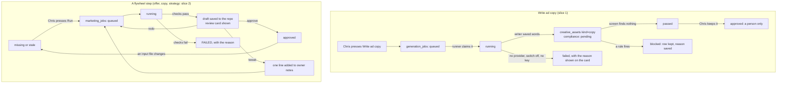

# Marketing dashboard — what it is, what exists, and the build plan

Written 2026-10-05 by workflow M5 of `ops/workflows/perfect-machine-2026-10-05.md`.
Read-only on the product. This file is the only thing M5 wrote to the repo.

Chris's words: "I want ALL of this done, including MY MARKETING DASHBOARD, THAT WAS IN THE
REPO FOR BUILD" and "COPY GEN ETC ETC ETC OFFER GEN ETC ETC".

## Words used here

- **Dashboard** — one page in the Fundhub CRM where Chris sees marketing and presses the buttons.
- **Endpoint** — a web address the page calls to get or save data, like `/api/creative/generate`.
- **Migration** — a file that changes the shape of the database. Each one has a number.
- **Generator** — code that asks an AI model to write something: copy, a script or an offer.
- **Flywheel** — the five marketing steps in `marketing/flywheel/README.md`: avatar, ad research, offer, copy, ad strategy. A sixth step, spend, checks the results.
- **Chat-only** — it runs only when someone types a command to Claude Code. No button on a web page can start it today.
- **House partner** — the database row that owns Fundhub's own marketing (slug `fundhub-house`).
- **Slice** — one small piece of the build that works on its own.

---

## 1. FOUND

**The dashboard is the "Marketing Command Center."** It is in a spec Chris pasted into
Claude Code on 2026-10-05, titled "Fundhub Marketing Machine: build spec, Version 3".
The one line that names the page:

> "This is a new page in the Fundhub CRM (`public/app/marketing-command-center.html`)."

**Where that spec lives: only in an archived Claude Code chat.**

- Chat title: "Fundhub Marketing Machine build spec".
- Chat id: `local_e16ec449-9c5c-48a9-ae8b-49b6dcee3d9d`. Last active 2026-10-05 14:14 UTC.
- In that chat Chris approved the spec and its §17 defaults, and said to start the lanes.
- The chat then stopped and waited for "go". It never wrote anything to the repo.
- The two files it planned do not exist on any branch:
  - `docs/specs/marketing-machine-2026-10-04.md`
  - `docs/journeys/marketing-machine-intended.md`
- A full working copy of the spec text (1,799 lines) was saved outside the repo for the main
  session: `/private/tmp/claude-501/-Users-chrisstanbridge-Developer-fundhub-platform/cd6ee7f9-dae0-46b9-8912-77858f60a416/scratchpad/m5-marketing-machine-spec-v3-from-archived-chat.md`.
  It can also be read again from the chat with the session tools.

**What the spec puts on the dashboard** (its §8.3). It has these tabs:

| Tab | What it shows |
|---|---|
| Today | What waits on Chris. The next script drop with **Write now**. The shoot progress board. Each machine step with Retry. A health card. Spend, leads, booked calls, sales, cash and return on ad spend for today, 7 days and 30 days. |
| Scripts, Videos | Script inbox (approve, edit, fix, reject) and video approval |
| Launch | Load approved ads into Meta, paused |
| Ads, Angles, Funnels | Numbers per ad, per angle, per funnel, with the watch curve |
| Map | The brain map |
| Settings | Schedule, counts, quiet hours, cost caps, funnels, captions |

"Copy gen" in that spec is the **script machine** (its M1): it writes ad scripts on a
schedule and when Chris taps **Write now**.

**What that spec does not have:** an offer generator, and a tab for the flywheel steps
(avatar, ad research, offer, copy, ad strategy). Those come from Chris's words today. This
plan adds them.

**The older ask that WAS in the repo, and is gone from main now.**

- `docs/specs/marketing-e2e-spec.md` plus 12 files in `docs/specs/marketing-e2e/`, written 2026-09-08.
- It asked for two halves: **make** (scripts, ads, VSLs, page copy on demand) and **measure** (everything).
- Its locked decision 8: the goal is "data and dashboards, plus an AI that reads them."
- Commit `b5076e58e` (2026-10-02, "repo reorganization") deleted these files. They were not moved.
- Their text is on no branch tip today.
- Read them back with `git show b5076e58e^:docs/specs/marketing-e2e-spec.md`.

**Not the same thing:**

- `public/app/command-center.html` was a company numbers screen. Chris had it deleted on 2026-08-17 (commit `e6e06dcb0`). Do not bring it back.
- On Drive, `fundhub-galaxy-command-center.md` (2026-07-26) is about the Galaxy screen.
- The Drive GoHighLevel dashboard docs from January 2026 are CRM dashboards, not marketing.

**Places searched:**

- The repo on main: `src/`, `api/`, `scripts/`, `db/`, `public/app/`, `docs/`, `ops/` and `ops/workflows/`, `marketing/`, `TODO.md`, `.claude/`, `.cursor/`.
- Every worktree under `.claude/worktrees/`.
- All 81 local and remote branches.
- Git history, searched for "marketing dashboard", "marketing-dashboard", "copy gen", "offer gen", "Marketing Machine", "marketing-command-center" and "command center".
- Google Drive: "marketing dashboard", "marketing machine", "copy gen/generator", "offer gen/generator", "command center", "Shoot Day", "script machine".
- Every Claude Code chat for this repo, archived ones included.
- `~/.claude/plans`, Downloads, Desktop and Documents.

**The words "marketing dashboard" appear in no file, branch, commit or Drive doc.**

---

## 2. WHAT EXISTS today

Live checks were read-only. All of them ran 2026-10-06 00:55 UTC with a cache-bust query.

### The pieces

| Part | Where | Works live? | Reads / writes |
|---|---|---|---|
| **The dashboard page** | `/app/marketing-command-center.html` | **No. 404.** `/api/marketing/today` also 404. | — |
| **Copy gen 1: Creative Factory copy jobs** | Page `public/app/creative-factory.html` (Generate card). `POST creative/generate` (`netlify/functions/api.mjs:872`) saves a job. `POST creative/run` (`:878`) or a cron every 2 minutes runs it. Writer: `src/creative/providers/copy.mjs`. | Page 200. Endpoints 401 (they exist, login needed). Database: **1 job ever, and it failed** (2026-09-17). 2 copy pieces saved (2026-09-17). Why the job failed was not read: a production row read was blocked by the session's permission check. | Writes `generation_jobs` and `creative_assets` (`kind='copy'`, words in `copy_text`). Needs 3 things: the house partner's marketing switch on (`partner_module_settings.marketing_suite_enabled`, default off, `db/migrations/172_wl_marketing.sql`), a `creative_providers` row for copy (none in any migration or seed, `db/migrations/048_campaign_config.sql:35-38`), and `ANTHROPIC_API_KEY` (`copy.mjs:26`). |
| **Copy gen 2: Social Studio posts** | "Write 3 posts for me" on `public/app/social-studio.html:435`. `POST social/generate` (`api.mjs:715`). | Page 200. Has a backup to Anthropic when OpenAI is out of credit (commit `61ae13e67`). | Writes `marketing_content_queue`. Social captions, not ad scripts. |
| **Copy gen 3: Brand Studio page copy** | "Write page copy" on `public/app/brand-studio.html:465`. `POST partner-marketing/generate-copy` (`api.mjs:735`). Module `src/brand/copy-generate.mjs`. | Page 200. Database: 5 rewrites, the last on 2026-08-17. | It rewrites a partner's web page sections in place (`partner_pages`, `partner_page_section_versions`). It does not write ads. No Anthropic backup. |
| **Offer gen** | Only `.claude/workflows/offer.js`, flywheel stage 3. | **Chat-only.** No server code generates offers. `npm run flywheel:status`: stage 3 **FAILED** ("did not report guarantees"). `marketing/flywheel/partner/03-offer.md` is a draft. | Writes the repo file, from chat. |
| **Avatar** | `.claude/workflows/avatar-builder.js` → `marketing/flywheel/partner/01-avatar.md` | Chat-only. Approved, 133 quotes. | Repo files |
| **Ad research** | `.claude/workflows/ad-research.js` → `02-ad-research.md`. Also a competitor board, `GET adintel/board` (`api.mjs:884`). | Chat-only. Approved. The board endpoint is live (401). | Repo files; the board reads the database |
| **Flywheel copy** | `.claude/workflows/copy.js` → `04-copy.md` | Chat-only. **FAILED** ("did not report distinctReasons"). 31 hooks written. | Repo files |
| **Ad strategy** | `.claude/workflows/ad-strategy.js` → `05-ad-strategy.md` | Chat-only. **BLOCKED**, waiting on stages 3 and 4. | Repo files |
| **Spend (stage 6)** | none | **Missing**: "has not been run yet". | — |
| **Flywheel status** | `scripts/flywheel/status.mjs` (`npm run flywheel:status`). `evaluate(dir)` is exported, so an endpoint can reuse it. | Works on the laptop. Reads files only. | Reads `marketing/flywheel/<campaign>/` |
| **Ad scripts** | Words: `marketing/ads/scripts/ALL-ADS-since-2026-09-03.md` (32 full ads, 7 shorts, 6 videos). Table `ad_scripts` (migrations 377, 393). Save: `POST scripts/write` (`api.mjs:626`, staff only, no model). List: `GET scripts/list` (`:630`; staff must pass `?partner_id=`). Checker: `scripts/ads/check-script.mjs` (command line only). | Database: 8 live script rows, the last saved 2026-09-24. **No server code writes a script with a model.** Script writing happens in chat (skill `.cursor/skills/fundhub-ad-writer/`). | `ad_scripts`, `ad_labels` |
| **Ad videos** | `GET ad-videos` (`api.mjs:867`), `src/ad-videos/*` | Endpoint live (401). 24 takes tracked, none approved (`marketing/MACHINE-GAPS.md:76-79`). | `ad_videos` |
| **Ad reports and numbers** | `public/app/campaign-manager.html` reads `read/ad-spine`, `read/ad-books`, `read/funnel-pages`, `campaigns/spend`, `campaigns/list`, `campaigns/fatigue`, `campaigns/detail`, `campaigns/connections`, `campaigns/action-log`, `ops/meta-marketing`, `analytics/clickfunnels-sync`. Also: `src/dashboard/kpis.mjs`, `src/ops/meta-marketing.mjs`, `src/ops/weekly-brief.mjs`, `src/ops/watch-curve.mjs`, `scripts/marketing-data-health.mjs`. | Database: 46 ad-days through 2026-10-04, 7 ads, 2 campaigns. Not saved yet: Meta purchases, cost per purchase, link clicks, landing page views. 0 of 18 tagged visitors have an ad number. M1 is fixing both. | `ad_metrics_daily`, `ads`, `campaigns`, `client_ad_attribution`, `events` |
| **Campaign screen** | `public/app/campaign-manager.html`. Sections: Needs attention; Ad performance (which ad booked a call); Which angle and hook are working; Funnel pages; Today's spend vs ceilings; Campaigns; Creative fatigue by ad; Link this ad; Platform connections; Meta agency access; Connect ClickFunnels; Action log; Campaign detail. | Live 200. Same byte size as main (172,797). Owner and admin only. **M4 owns this file today.** | Reads the endpoints in the row above |

### The menu today

- The Marketing group in `public/app/shell.js` is visible on main. Its rows: Campaigns, Social Studio, Creative Factory, Content. All are owner/admin only (`OWNER_ADMIN_ONLY`, `shell.js:146-175`).
- Brand Studio sits under Admin and is hidden from staff.

### The model trap

- `src/agents/model.mjs` tries OpenAI first.
- The production OpenAI account had no credit when measured 2026-09-18 (`api/social/generate.mjs:88-97`).
- Only Social Studio falls back to Anthropic.
- So the Creative Factory copy writer will most likely fail until it gets the same fallback.

---

## 3. GAPS to the dashboard Chris described

1. **No dashboard page and no `api/marketing/*` endpoints.** Both 404 live.
2. **The spec is not in the repo,** and neither is its intended journey file. Spec 0.1 says the chat that wrote them must commit them, because a hook stops agents from writing `*-intended.md`.
3. **No offer generator on the server.** Offer, avatar, ad research, copy and ad strategy all run only in chat. Stages 3 and 4 failed their checks. Stage 5 is blocked. Stage 6 has no code. The only flywheel is for the partner offer; there is none for the $147 roadmap (`marketing/MACHINE-GAPS.md:32`).
4. **No server script writer.** The spec's script machine (M1: Write now, inbox, approve, numbers from 91) is not built.
5. **The one server copy writer for ads is blocked by setup.** Creative Factory needs the house partner's switch on, a copy provider row, and the Anthropic fallback. Its only job failed.
6. **Report holes** (M1, M2 and M3 own these on the board): no ad number on any visitor, no purchases, no link clicks, no dying-ad buzz, no ClickFunnels night job, no watch-curve view.
7. **No marketing role set.** `src/http/read-api.mjs:154` has FINANCE, STAFF, OPS and others, but no MARKETING. The spec asks for `ROLE_SETS.MARKETING` = owner, admin.
8. **The spec has three lines that later owner law overrides.** Fix them when it is committed:
   - Its migration ranges 406–429 collide. Main ends at `405_roadmap_preview_views.sql`, and M1 adds the next one. Always take the next free number.
   - It names the repo `ZootimusMaximusSupreme/Fundhub_ai`. The canonical repo is `ZootimusMaximusSupreme/fundhub-platform` (owner-set 2026-10-05). That same rule also removes the archived chat's worry that "GitHub is banned".
   - It says to set secrets with `--secret`. Owner law from 2026-10-04 bans `--secret` for any key the laptop or Claude cloud must read.

---

## 4. Build plan — back end first (CLAUDE.md §3a)

### Owner decisions this plan relies on (already made, do not ask again)

- Chris approved spec Version 3, its split, and "§17: all defaults" (archived chat, 2026-10-05).
- On 2026-10-05 he named the dashboard as the front for copy gen, offer gen, the flywheel, ad scripts and ad reports.
- Ads are identified by number, and naming is never a blocker (CLAUDE.md §3c, migration 286).
- Image and video generation stays off (commit `bf9ba1e51`, 2026-09-07).
- Only Chris turns ads on, pauses them or changes budgets (spec §2 item 6).

### Defaults picked here (no question to Chris)

1. **Page name and place.** Use the spec's name: `public/app/marketing-command-center.html` + `.js`, the first row of the sidebar's Marketing group, owner and admin only. The menu label is "Marketing".
2. **The generators go on the Today tab** in one "Make" card: Copy, Offer, Avatar, Ad research, Ad strategy, Spend. Reason: Chris asked for buttons, and Today is the page he opens first.
3. **One primary button: "Write ad copy".** Every other button is an outline. (UI-STANDARDS §1 allows only one primary button.)
4. **Avatar and ad research stay in chat.** They need live web research, which only Claude Code has. The dashboard shows their status and a "Copy the chat command" button.
5. **Offer, flywheel copy and ad strategy move to the server** in slice 2. They read only repo files and the prices in `src/config/offers.mjs`.
6. **Do not build a fake offer writer on Creative Factory's copy path.** A one-shot prompt would make up prices and proof. The offer stage forbids both: every price must trace to `src/config/offers.mjs`, and every claim needs proof on file.
7. **The flywheel campaign is "partner"** until a second campaign folder exists. The page lists every folder under `marketing/flywheel/`, so adding `roadmap/` later needs no code.

### Step A — the record states, then the schema

**Slice 1 needs no migration.** It uses tables that already exist: `creative_assets`, `generation_jobs`, `ad_metrics_daily`, `ad_scripts`, `partner_module_settings`.

Later slices add one migration each. Take the next free number after M1's merges. The tables, all from the spec:

| Slice | Migration contents | Spec section |
|---|---|---|
| 2 | `marketing_settings`, `marketing_funnels` (seed `book_call` and `roadmap_147`), `marketing_jobs`, `marketing_requests`, `marketing_buzzes`, `marketing_model_usage`, `repo_outbox` | §6 steps 2–3 |
| 3 | `marketing_batches`, `ad_ideas`, `voice_pairs`, the new `ad_scripts` columns (`status`, `script_format`, `parts`, `root_script_id` and the rest), `next_ad_number(org)` | §7.4 |
| 4 | `ad_metrics_daily.link_clicks` (if M1 has not added it), and the metric views behind spec §11.1 | §6 step 5, §11 |
| 5+ | `ad_videos` states, `ad_video_edits`, `marketing_shoots`, `page_suggestions`, `page_change_requests` | §9, §8.2, §14 |

**Flywheel runs need no new table.** A run is a `marketing_jobs` row with `kind = 'flywheel_stage'` and `payload = {campaign, stage}`. The result is saved to `marketing/flywheel/<campaign>/0N-*.md` through `repo_outbox`. Add `marketing/flywheel/` to the outbox allow-list in spec §6 step 2.

Rules for every migration (spec §4 trap 4):

- `org_id` points to `orgs`.
- Row-level security is on and forced, with an `*_app_all` policy.
- The `fundhub_app` grant sits inside the `pg_roles` check.
- Never edit an applied migration.
- Run `npm run migrations:manifest` after.

### Step B — read endpoints, and the tests that prove them

Rules for every new endpoint:

- It goes under `api/marketing/` and is added to `ROUTES` in `netlify/functions/api.mjs`.
- Gate it with `requireAuth`, then `requireRole(res, staff, ROLE_SETS.MARKETING)`.
- Run its queries inside `asStaff()`.
- Its test is `src/http/marketing-<name>.pg.test.mjs`. It runs against a scratch Postgres, never the live database.

| Endpoint | Slice | Returns | Proof |
|---|---|---|---|
| `GET marketing/today` | 1 | `flywheel`: each stage's status, from `evaluate()` in `scripts/flywheel/status.mjs`. `copy`: the last 10 copy pieces and the last 5 copy jobs, with status and error. `copyReady`: switch on? provider row? Anthropic key set? (names only, never values). `numbers`: spend for 7 and 30 days, and the 7 days before, from `ad_metrics_daily`. `asOf`: the last sync time. | `src/http/marketing-today.pg.test.mjs`: fixture rows give exact numbers; a fixture with no provider row returns `copyReady.provider=false`; a closer gets 403. `src/marketing/flywheel-status.test.mjs`: a fixture folder gives FAILED, BLOCKED and STALE exactly as `npm run flywheel:status` prints them. |
| `GET marketing/health` | 2 | Clock, worker, outbox, last sync, model spend vs cap | pg test with fixture rows |
| `GET marketing/flywheel?campaign=` | 2 | Each stage's status, its review card text, and the last run job | pg test |
| `GET marketing/scripts`, `GET marketing/script?id=` | 3 | Spec §7.8 | pg tests per spec §7.8 |
| `GET marketing/ads`, `GET marketing/ad?n=`, `GET marketing/angles`, `GET marketing/funnels/stats` | 4 | Spec §11.2, using the counting rules in §11.1 | Spec §11 "done means" 1: three ads match a hand check |

**Write endpoints come after their read endpoints are green:**

- Slice 2: `POST marketing/flywheel/run` (it queues the job), `POST marketing/flywheel/approve`, `POST marketing/flywheel/tweak` (it appends one line to `00-OWNER-NOTES.md` through the outbox).
- Slice 3: spec §7.8.

**Netlify needs the files.** Add `marketing/flywheel/**` to `included_files` in `netlify.toml`. Without it, the endpoint cannot read the stage files.

### Step C — the state diagram

Save it to `docs/journeys/marketing-dashboard-flow.md` in the same commit as the first endpoint. Append one line to `docs/journeys/CHANGELOG.md`.

Avatar and ad research keep the same stage states. Only their Run step happens in chat.

### Step D — the front end, last

- **Files:** `public/app/marketing-command-center.html` + `public/app/marketing-command-center.js`.
- **Menu:**
  - Add the page to `var ALL` and `OWNER_ADMIN_ONLY` in `public/app/shell.js`.
  - Add the sidebar row to `public/app/sidebar.fragment.html`, then run `scripts/sync-sidebar.mjs`.
  - Add the page and the endpoints to `PULSE_REGISTRY` in `src/pulse/registry.mjs`.
- **UI-STANDARDS.md rules that bite here:**
  - One primary button.
  - The owner's first question goes top-left: "Is the machine healthy?" Spend for 7 days, with the 7 days before it beside it.
  - Every control works; no "coming soon".
  - Four states: loading, empty, error, full.
  - Text 11px or larger.
  - One column at 390px wide.
- **Proof:** a Playwright check, then a live click on https://fundhub.ai/app/marketing-command-center.html as the owner.

### Who owns which files (so this never collides with M1–M4)

| Workflow | Owns | What the dashboard does |
|---|---|---|
| M1 | `api/campaigns/sync.mjs`, `src/ads/**`, every new migration on this board | Imports from `src/ads/**`, never edits it. Its migrations wait until M1 has merged, then take the next free number. |
| M2 | `src/ops/watch-curve.mjs`, `src/ad-videos/notify-fanout.mjs`, the ClickFunnels night job | Only reads `ad_watch_curve_alerts` and `ad_watch_curve_diagnoses` |
| M3 | `src/pulse/**`, the daily pulse, gate-relay | The `PULSE_REGISTRY` lines land after M3 merges, in their own commit |
| M4 | `public/app/campaign-manager.html` and the report generators | Never edits that page. Links to it ("Open Campaigns") and calls its endpoints read-only. |

**New files only the dashboard touches:**

- `public/app/marketing-command-center.*`
- `api/marketing/*`
- `src/marketing/**`
- `docs/journeys/marketing-dashboard-flow.md`
- `docs/specs/marketing-machine-api.md` (spec §7.8)

**Shared files touched once, after M1–M4 merge:**

- `netlify/functions/api.mjs` (routes)
- `src/http/read-api.mjs` (MARKETING role set)
- `public/app/shell.js` and the sidebar fragment
- `netlify.toml` (`included_files`)
- `src/creative/providers/copy.mjs` (the Anthropic fallback; nobody on this board owns it)

### Slices after the first

- **Slice 2: Offer, flywheel copy and ad strategy run on the server.**
  - Build the spec's M0 steps 2–4 first: the repo outbox, the jobs tables, the clock and worker, and the `provider: 'anthropic'` option for `callModel`.
  - Port the doctrine in `.claude/workflows/offer.js`, `copy.js` and `ad-strategy.js` into `src/marketing/flywheel/*.mjs`, as pure functions with tests.
  - Reuse the stage checks in `STAGES` from `scripts/flywheel/status.mjs`.
  - It runs in `netlify/functions/marketing-worker-background.mjs`, which has a 15-minute limit.
  - The Offer button changes from "Copy the chat command" to "Run offer".
  - This slice depends on the spec's M0 step 1, which replaces CLAUDE.md §3c. Chris approved that in the archived chat. The main session lands it when it commits the spec.
- **Slice 3: the script machine** (spec M1). Write now, the Scripts tab, ad numbers from 91.
- **Slice 4: the numbers** (spec M5). Ads, Angles and Funnels tabs, the watch curve drawer. Starts after M1 of this board ships ad numbers and link clicks.
- **Slice 5+:** Videos, Shoot Day, Launch, Map and page suggestions (spec M2–M4, M7, M8).

---

## 5. The SMALLEST first slice

**Goal:** Chris opens one page, sees how marketing is doing, presses **Write ad copy** and
gets ad copy back, and sees where his offer stands. No migration. No new table.

### Back end

1. **`src/marketing/flywheel-status.mjs`.** A thin wrapper around `evaluate()` from `scripts/flywheel/status.mjs`. Test: `src/marketing/flywheel-status.test.mjs`.
2. **`api/marketing/today.mjs`.** The `GET marketing/today` row in Step B, gated MARKETING. Test: `src/http/marketing-today.pg.test.mjs`. Route it in `netlify/functions/api.mjs`.
3. **Add `ROLE_SETS.MARKETING`** = owner, admin in `src/http/read-api.mjs`.
4. **Add `marketing/flywheel/**`** to `included_files` in `netlify.toml`.
5. **Make the existing copy writer able to run:**
   - Give `src/creative/providers/copy.mjs` the same Anthropic fallback Social Studio uses (`readWithBackupReader`, `src/handlers/doc-check.mjs:136`). Production's Anthropic key already works for Social Studio (`api/social/generate.mjs:88-97`). Leave the key check at `copy.mjs:26` as it is.
   - Add one seed file under `db/seed/` (next free number; the last one today is `295_sms_copy_2026_09.sql`). It inserts the copy provider row (`asset_kind='copy'`, `provider_key='copy'`) with `ON CONFLICT DO NOTHING`. A seed file needs no migration number, so it cannot collide with M1.
   - Turn on the marketing switch for the **house partner only**, through the existing `POST partner-marketing/enable` as the owner. It is a setting change, not a data delete.
6. **Journey files:** `docs/journeys/marketing-dashboard-flow.md` (the diagram above) and one line in `docs/journeys/CHANGELOG.md`.

### Front end: `public/app/marketing-command-center.html` + `.js` (Today only)

- **Top-left:** spend for the last 7 days, with the 7 days before it beside it, and "as of" the last Meta sync.
- **Make card:**
  - **Write ad copy** (the one primary button):
    - A text box for the angle, and a choice of Funding, Credit cards or Credit repair (default Funding).
    - It calls the existing `POST /api/creative/generate` with `{partner_id: <house>, asset_kind: 'copy', offer_type, prompt, idempotency_key}`, then the existing `POST /api/creative/run`.
    - The new copy shows in the card as soon as it saves, with its screen result (passed or blocked, and the reason).
    - If a setup piece is missing, the card names it in plain words before the button is pressed (from `copyReady`).
  - **Offer:**
    - Shows stage 3's status (today: "Failed — did not report guarantees") and its review card.
    - Its button is **Copy the offer command**. It copies `/flywheel stage 3 partner` for Claude chat, because chat is the only place an offer generator exists today.
    - Slice 2 turns this into **Run offer**.
  - **Avatar, Ad research, Copy (flywheel), Ad strategy, Spend:** one row each, with its status and a **Copy the command** button.
- **Links out:** Open Campaigns (`campaign-manager.html`) and Open Creative Factory.

### Done means (slice 1)

1. `npm run lint` passes. `npx tsc --noEmit` passes. No new test failures against the 27 that already fail on main.
2. Both new tests run and pass on a scratch database.
3. After `npm run ship`, https://fundhub.ai/app/marketing-command-center.html loads for the owner.
4. Pressing **Write ad copy** on the live page saves one copy piece with words in it.
5. The flywheel rows match `npm run flywheel:status` word for word.
6. Playwright passes at 390px and at desktop width.

### Size

- About 6 new files.
- 4 small edits to shared files.
- 1 seed file.
- No migration.
