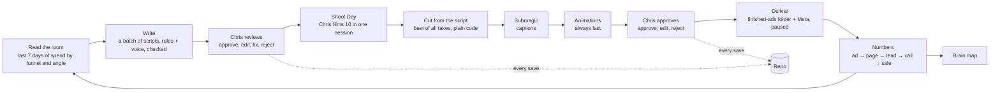

# Fundhub Marketing Machine: build spec

> **Recovered 2026-10-05** from the archived Claude Code chat "Fundhub Marketing Machine build spec" (version 3, approved by Chris with all defaults on 2026-10-05; the chat waited for "go" and never saved this file). Text is as approved except two lines changed to match newer owner law: the `GITHUB_REPO` value (now `ZootimusMaximusSupreme/fundhub-platform`) and the secrets rule (no `--secret` for keys the laptop or cloud must read; see `.claude/rules/secrets-env-law.md`). Reserved migration numbers in this spec may be taken: always use the next free number. Build plan for the Command Center: `docs/specs/marketing-dashboard-plan-2026-10-05.md`.

**Version 3 · 2026-10-05 · Owner: Chris · For: Claude Code**

This replaces `spec-0-marketing-machine.md`, `spec-1-script-machine.md`, and versions 1–2 of this file. Sixteen review agents checked it in three rounds:
- every name against GitHub `main` at `f1b1933`
- every outside-service claim against the vendor's docs
- how Claude Code runs subagents, against Claude Code's docs
- a dry run, played as the agents who will build it

Two files make up the spec:
- `docs/specs/marketing-machine-2026-10-04.md` (this file)
- `docs/journeys/marketing-machine-intended.md` (the intended journey)

## The goal

**Put Chris in the driver's seat and keep him organized.**

- **Today:** a 10-video shoot takes a whole week.
- **Target:** Chris films 10 ads in one session. By that evening, all 10 are cut, captioned, animated and waiting for his approval, and the approved ones load into Meta with one tap.
- **Chris's whole job:** film, and do a bit of editing when it's needed. The machine does the rest, and every decision stays his.

**Top rule.** Chris's word beats any written rule. Rules guide the machine, and nobody reads them so literally that they block what Chris asked for. When Chris says something different, his words win and the rule gets updated in all three homes in the same change: the CLAUDE.md line, `.claude/rules/<name>.md`, and `.cursor/rules/<name>.mdc` (law: `.claude/rules/rules-for-claude-and-cursor.md`).

## Contents

0. How to run this build in Claude Code
1. What we're building
2. Owner decisions (law for this build)
3. What already exists (reuse it)
4. Traps in this repo (read before coding)
5. Milestones
6. M0 Groundwork
7. M1 Script machine
8. M2 Teleprompter app, Shoot Day and Command Center
9. M3 Video pipeline
10. M4 Load ads into Meta
11. M5 Numbers
12. M6 Website: videos off Netlify, bot block
13. M7 Brain map
14. M8 Page suggestions
15. The whole thing is done when…
16. Only Chris
17. Decisions (defaults)

Appendices: A Copy rules · B Recipes · C Bot policy · D New env vars · E Monthly costs · F Sources

---

## 0. How to run this build in Claude Code

### 0.1 Before kickoff
1. **Commit these files to `main` before any session starts:**
   - this spec
   - the intended journey (Chris's approval of it is in his message)
   - the four subagent files in 0.4
   - a `.worktreeinclude` file containing `.env`

   The chat that wrote them commits them, with Chris's OK. It has to be that chat for two reasons: a hook stops agents from writing `*-intended.md`, and Claude Code only loads a new `.claude/agents/` folder when a session starts.
2. **Run kickoff on the Mac.** Only the Mac can set Netlify env vars and ship.

### 0.2 Gates
- **Approving this spec and its split covers these CLAUDE.md gates:**
  - §0 (the split)
  - §1 (the model check; each lane still prints its `Model:` line)
  - §2 (nothing unrequested; this spec is the request)
  - §3 steps 3–4 (plan, then wait; this spec is the plan)
  - §3a step 1 (questions; §17 holds the answers)
- **From kickoff,** §2 items 1 and 16 of this spec replace CLAUDE.md §3c and "Overshooting is fine" for every agent, even before M0 step 1 lands them in CLAUDE.md.
- **Don't load the `fundhub-orchestrator` or `fundhub-builder` skills** for this build. They add their own plan gates, and this spec is the plan.
- **Lanes stop for only three things:**
  - an item in §16 or §17
  - a STOP AND ASK from the intended journey (CLAUDE.md §4)
  - a hard-rule conflict

### 0.3 The board

The board is `ops/workflows/marketing-machine-2026-10.md`, and it follows the CLAUDE.md §5 protocol.

- **Only the orchestrator writes the board.** Subagents run in worktrees and can't write to the main checkout, so each one reports its claim, its change manifest and any blocker in its final message.
- **Seed it at kickoff.** Add every numbered step in M0–M8 as a task, each with its owner lane, set to status pending.

### 0.4 Agents and model levels (the right level for each task)

| File | `model` | `isolation` | Tools | Use it for |
|---|---|---|---|---|
| `mm-architect.md` | opus | worktree | all | Work where a mistake is costly. See the list below. |
| `mm-builder.md` | sonnet | worktree | all | Normal build work: endpoints and tests, the repo outbox, the clock and worker, the video worker service, every screen, the iPhone/iPad app, the 7.1 contradiction sweep, M6, M7 and M8 |
| `mm-chore.md` | haiku | worktree | Read, Edit, Write, Bash, Grep, Glob | Fully specified edits. See the list below. |
| `mm-reviewer.md` | sonnet | worktree | Read, Grep, Glob, Bash | An independent review of every builder and chore PR, checked against its spec step, §4 and CLAUDE.md §6 |

**mm-architect handles:**
- M0 steps 1 and 5
- migrations that change existing tables: ad_scripts versions, ad_videos states, the ads number index
- the planner (7.5), and the writer prompt and check loop (7.6)
- the aligner and cut checks (9.2–9.3), and the state machine (9.1)
- the Meta loader (M4) and the metric SQL (11.1)
- the CI root cause (M0 step 6)

**mm-chore handles:**
- Appendix A into RULES.md, and RECIPES.md from Appendix B
- the Appendix C lists
- stale path fixes and the sidebar sync
- `.env.example` names. It edits that file through Bash, because a hook blocks Edit and Write on `*.env.*`.
- journey-doc updates

**mm-reviewer** reads with `gh pr diff` and posts with `gh pr review`. It never runs `gh pr checkout` in the main checkout. The orchestrator (Opus) reviews architect PRs itself.

Example front matter:
```markdown
---
name: mm-builder
description: Builds one step of the marketing machine spec in its own worktree, with tests.
model: sonnet
isolation: worktree
---
Read docs/specs/marketing-machine-2026-10-04.md sections 0, 2, 3 and 4, then your step.
Your worktree starts from main. Run npm ci, then build. Run npm run lint and the tests
in this worktree (the repo's Stop hook only checks the main checkout). Never run tests
against the DATABASE_URL in .env. Update the flow docs. Open one PR. End with your claim,
change manifest and any blocker for the orchestrator to put on the board.
```

Never run a step below the level in this table (CLAUDE.md §1). "The right level" means the lowest level that fits.

### 0.5 Lanes

A lane is a queue of steps on the board, not an agent. A subagent can't be counted on to start other subagents, so the orchestrator (the main session) dispatches every step itself:
1. It picks the next ready step in a lane.
2. It starts the agent the 0.4 table names for that step, with the step prompt from 0.9.
3. When the step's PR opens, it starts mm-reviewer on it, or reviews an architect PR itself.

Each lane runs one step at a time, so its steps land in order. At most 5 agents run at once (CLAUDE.md §5), counting W2, W7, every builder and every reviewer. Subagents never run git in the main checkout.

| Lane | Builds | Migration numbers | Starts |
|---|---|---|---|
| **A** | M0, then the M1 back end, then the M2 back end (the 8.2 routes, `today`, `health` and the 8.4 hook), plus the API contract for every `marketing/*` route (`docs/specs/marketing-machine-api.md`) | 406–415 | after lane C's CI fix merges |
| **B** | the M3 and M4 back ends | 416–423 | with lane A |
| **C** | the CI fix (M0 step 6), then M6a, then M6b | none | now |
| **D** | the M5, M7 and M8 back ends | 424–429 | when W2 or W7 finishes |
| **E** | **every screen**: the teleprompter (with mirror mode and Shoot Day) and all Command Center tabs. It builds against the API contract with mocks first. | none | when W2 or W7 finishes |

### 0.6 Order and merges
1. **The CI fix merges first.** Nothing else merges until CI is green and blocking.
2. **M0 step 1 merges right after.** If W2 is still running, M0 step 1 merges first and W2 rebases on it.
3. **Back ends merge as soon as their dependencies are in.** Screens merge after the M2 shell.
4. **A step starts only after the steps it depends on have merged.** Worktrees start from `origin/HEAD`, so earlier work has to be on main.
5. **A PR merges when CI is green and its reviewer has nothing blocking,** with at most two review rounds.

### 0.7 Tests and the database
- **Never run tests against the `DATABASE_URL` in `.env`.** It's the live database, and the pg tests change shared tables.
- **Run pg tests in CI's own database.** On a Mac that has Postgres, a local scratch database works too:
  1. `createdb fh_<step>`
  2. `DATABASE_URL=<scratch> node db/migrate.mjs`
  3. `DATABASE_URL=<scratch> npm test`
- **Chris pre-approves this scratch use with this spec.** It isn't the CLAUDE.md "repoint DATABASE_URL" case.

### 0.8 Worktrees, migrations, ship, journeys
- **Worktrees:** `.worktreeinclude` brings `.env` into each worktree. Run `npm ci` first.
- **Migrations:** use your lane's number range, and rebuild the manifest (`npm run migrations:manifest`) after every rebase.
- **Ship:** only the Mac ships. Set the whole batch of env vars first, then run `npm run ship` once, at most twice a day. M0 step 8 makes ship pull before it deploys and push after it logs.
- **Journeys:**
  - The intended journey is `docs/journeys/marketing-machine-intended.md`.
  - Every code commit updates whichever of these it touches: `docs/journeys/marketing-machine-flow.md` (new), `ad-script-flow.md`, `ad-video-flow.md` and `CHANGELOG.md`.
  - A step the intended journey doesn't cover means STOP AND ASK.
- **Screens:** screen and page work is Claude-only (law: `grok-no-displays.md`).

### 0.9 Step prompts (CLAUDE.md §0)

Every step prompt opens with:

> You are building step <step> of the marketing machine, in lane X. Spec: docs/specs/marketing-machine-2026-10-04.md. Board: ops/workflows/marketing-machine-2026-10.md (the orchestrator writes it; end with your claim, change manifest and any blocker). Read the spec's sections 0, 2, 3 and 4, then your step.

Then the orchestrator adds the step's section, plus the lane's migration numbers when the step has a migration.

**Which agent gets which step:**
- **Lane A:**
  - M0 steps 1–5, 7 and 8, then the M1 back end, then the M2 back end. The first M1 PR writes `docs/specs/marketing-machine-api.md`.
  - mm-architect: M0 steps 1 and 5, the 7.4 migrations, 7.5 and 7.6. mm-chore: the text edits in 7.1. mm-builder: everything else.
  - Migration numbers 406–415.
- **Lane B:**
  - The M3 and M4 back ends.
  - mm-architect: 9.1's state machine, 9.2, 9.3 and M4. mm-builder: the video worker, approval routes and delivery.
  - Migration numbers 416–423.
- **Lane C:** mm-architect: the CI fix (M0 step 6). mm-builder: M6a and M6b. mm-chore: the Appendix C lists.
- **Lane D:**
  - mm-architect: 11.1. mm-builder: the rest of the M5 back end, then the M7 and M8 back ends.
  - Migration numbers 424–429.
- **Lane E:** mm-builder: every screen in M2, 9.6, 10.5, 11.3, 13 and 14. Start from mocks of `docs/specs/marketing-machine-api.md`, and switch to the real endpoints as they merge.

Every step prompt closes with:

> Open one PR for this step. Stop only for a §16 or §17 item, a STOP AND ASK, or a hard-rule conflict.

### 0.10 Kickoff (Chris pastes this into the main session on the Mac, running Opus)

> Read docs/specs/marketing-machine-2026-10-04.md and run section 0. I approve the spec, its split and the intended journey. §17: all defaults. Start the lanes.

---

## 1. What we're building

Chris runs marketing from two screens: the **Teleprompter app** and the **Command Center**. Together they replace Claude Code and chat for marketing.

- **Teleprompter app.** It runs on his iPhone and iPad, including an iPad in a mirror rig. In it he can:
  - review scripts
  - plan a shoot and roll scripts while he films (Shoot Day)
  - drop ideas
  - approve videos and make light edits
  - edit copy rules
- **Command Center.** This is a new page in the Fundhub CRM (`public/app/marketing-command-center.html`). It's always live, so it's where Chris looks whenever he wants to know how marketing is doing.



**What Chris does:**
- drops ideas (optional)
- reviews scripts
- films on Shoot Day
- approves videos, with a bit of editing when needed
- turns ads on

**The copy recursion.** Before writing the next batch, the machine reads last week's numbers and every edit Chris made. His edits also teach the voice file. So the machine gets closer to his voice and his winners every week.

**One number per ad.** Each ad has one number, and every part of the ad uses it:
- the script
- the takes
- the finished video
- the Meta ad name
- `utm_content`
- the repo file
- the brain note

(`utm_content` = the ad number is already law: CLAUDE.md §3c and migration 286.)

---

## 2. Owner decisions (set by Chris on 2026-10-04 and 10-05; treat as law)

1. **Scripts come on a schedule and on command.**
   - They come every 7 days, on the day and time Chris sets (default Monday 7:00 am Arizona), plus whenever he taps **Write now**.
   - Every script in a batch shows up at the same moment.
   - This replaces CLAUDE.md §3c (M0 step 1).
2. **3 scripts a day,** and a batch covers 7 days. §17 decision 6 sets whether that's 3 a day in total or 3 a day for each running funnel.
3. **Each funnel's share of the batch follows its Meta spend over the last 7 days** (7.5).
4. **Chris gets a buzz only when he has something to do:** scripts are ready, videos are ready, or something is stuck that only he can fix. Every other update lives in the Command Center.
5. **The winner rule is a blank setting Chris fills in later.** Until then, the machine writes more new versions of the angles he spends the most on.
6. **Only Chris turns ads on, pauses them or changes budgets.** The machine loads every new ad paused. (Chris: "We don't kill ads.")
7. **The teleprompter shows the script for Chris to read while he films.**
   - It works on an iPhone, an iPad, and an iPad in a mirror (beam-splitter) rig, so it has a mirror mode and takes a Bluetooth remote.
   - Only Chris uses it for now. Build roles so others can be added later.
8. **Chris approves, edits or rejects scripts and videos from the phone.** Every save goes to the database and the repo.
9. **Captions and animations.**
   - Captions use the Submagic template "Hormozi 2". Chris will double-check; "Hormozi 1" is the backup.
   - Submagic AI B-roll stays off.
   - Every ad gets animations: diagrams and overlays for the financial and technical points. They're our B-roll.
   - **Animation overlays always go on last** (Chris, 2026-10-04). The order is the cut, then Submagic's captions, then the animations.
   - This replaces step 2 of the plan Chris saved on 10/2 (`ops/workflows/broll-v2-2026-10-02.md`), which put them before Submagic. That plan's step 1, see-through renders, stays.
10. **The cut is made from the script, before Submagic** (law: `.claude/rules/ad-video-best-of-clips.md`). Because Chris wants tokens spent only where they're efficient, the cut runs on plain code.
11. **Delivery:** the approved video goes to the finished-ads folder and loads into Meta as a paused ad. Meta API access is approved.
12. **Videos move to Cloudflare R2.** Netlify paused the site over video bandwidth, and the `fundhub.ai` zone is already on Chris's Cloudflare account.
13. **Bots are blocked, with exceptions for:**
    - Meta's link previews and ad review
    - Google's ad checks
    - the Twilio/TCR review of `/privacy/` and `/terms/`
    - our own scanner

    The details are in M6 and Appendix C.
14. **The brain map stays free, because we own the map inside the CRM.** Obsidian has been free for work since Feb 20, 2025, so it can open the same notes. If Obsidian ever charges, the notes open in Logseq, which is open source.
15. **Standard ads use bullets** (Chris's 10/4 plan):
    - the hook and line 2, word for word
    - one short cue per point
    - the reveal and the CTA, word for word

    Long ads and sorting-hat shorts stay in full words. Each format's style is a setting.
16. **Agents use the right model level for each task** (§0.4). This replaces "Overshooting is fine" in CLAUDE.md §1 (M0 step 1).
17. **This spec replaces older lines that said otherwise.** Update these in M0 step 1:
    - **"No R2":** `docs/specs/video-pipeline-unknowns-settled-2026-09-22.md` (L22-23, L339), and the board row `ops/workflows/business-todos-2026-10-04.md:16` ("R2 was dropped on purpose").
    - **"We never touch Meta":** `marketing/ads/video-pipeline-plan.md:8`.
    - **Step 2 of the 10/2 saved plan:** overlays now go after Submagic.
    - **"Rules set aside":** `ops/workflows/broll-v2-2026-10-02.md:65`. M1 rebuilds the rules.
    - **The best-of-clips line saying Submagic adds our B-roll:** Submagic now adds captions to the merged master, and our animation overlays go on last.
    - **"Filmed files land with NAMING.md names":** `.claude/rules/slo-one-filmed-folder.md`, `.claude/rules/ad-naming.md`, their `.cursor/rules` mirrors, and `marketing/ads/NAMING.md`. Add one line to each: the format is for files named by hand. Phone uploads keep the camera's name, and the Command Center shows which take belongs to which ad.

These answers belong to the page-draft work (W6), not this build:
- The dispute pack has **6 rounds** of letters (more than 6 letters in all).
- **Gene used the roadmap,** so that claim stays.

The Capital Blueprint monthly fee is still open and isn't in this spec.

---

## 3. What already exists (reuse it)

| Piece and where | Watch out |
|---|---|
| **Script table:** `ad_scripts` (migration 377; `ad_id` text added in 393) | `ad_id` is unique per org among non-archived rows. There's no `status` column yet; M1 adds it. Migration 377 keeps the name "format" free on purpose (L246-247), so name the new column `script_format`. |
| **Save and list scripts:** `api/scripts/write.mjs`, `api/scripts/list.mjs` | list returns 400 for staff without `?partner_id=<uuid>`, so look up the `fundhub-house` partner's id first. Only write falls back to that slug, and write never sets `ad_id`. |
| **Copy files** in `marketing/ads/`: RULES.md (Parts 1–4 at L29, 235, 342, 591), VOICE.md, WRITE-ADS-FROM-HERE.md, ANGLE-GENERATOR.md (a formula, not a list), SECOND-LINE.md, CONCEPTS.md, ASSET-BANK.md (angle lists in §2 L69, §3 L127 and §4 L155), CONTROLS.md (5 locked ads) | On 10/2, Chris set aside RULES.md, VOICE.md, `rules-data.mjs` and `npm run ads:check` (`ops/workflows/broll-v2-2026-10-02.md:65`). M1 rebuilds them. `docs/ads/` still appears on 28 lines across 4 files. |
| **Checker:** `scripts/ads/check-script.mjs` (`checkOneScript` L406, `loadRules` L492) and `marketing/ads/rules-data.mjs` | No server code imports it. `check-script.test.mjs` pins the list counts (L146-155), asserts that "optimize" fails (L77-86), and requires CONTROLS.md to pass clean (L50-65). `norm()` (L155) lowercases text and turns hyphens into spaces. `.claude/workflows/copy.js` can't import the checker (L13), so it keeps inline copies, with a drift test. |
| **Model calls:** `src/agents/model.mjs` `callModel({system, user, env, model, maxTokens, media})` | It uses OpenAI whenever an unmasked OpenAI key is in `env`, and swaps non-`gpt-` model names for `gpt-4o-mini`. Default `maxTokens` is 600, there's no timeout, and the system prompt is coerced to a string. `src/ad-videos/match.mjs:148-154` forces Claude by passing an `env` that holds only `ANTHROPIC_API_KEY`. |
| **Ad numbers:** `marketing/ads/registry.json` (ids 16, 26–31, 42–46, 72–83; `rules[lane]` gives gate, entry and offers). The locked SLO ads are 84–90 (`scripts/ad-scripts-load-locked.mjs`, `FIRST_AD_ID = 84`). | No code hands out numbers. The next free one is **91**. `ads.fundhub_ad_number` and `ad_scripts.ad_id` are text, so cast them before taking `max()`. `normaliseAd` (`src/ads/registry.mjs:68`) throws on any word outside its vocabulary. |
| **Naming law:** `marketing/ads/NAMING.md`, `.claude/rules/ad-naming.md` | It names takes only. The best-of-clips law says never move or rename the raw library. `naming.mjs`/`matchAndRename` rename raw files, which breaks both laws. |
| **Video pipeline:** `src/ad-videos/*`, `ad_videos` (migrations 389–392), and `netlify/functions/ad-video-sweeper.mjs` (every 5 min) → `ad-video-worker-background.mjs` (header `x-fundhub-worker: AD_VIDEO_WORKER_SECRET`) | See the bullets right after this table. |
| **Submagic:** `src/messaging/providers/submagic.mjs` (multipart `/v1/projects/upload`, GET project, user media, PUT items, export). The webhook is in `src/http/router.mjs:360`: a webhooks/ prefix branch, outside `ROUTES`. | `SUBMAGIC_API_KEY` is on Netlify but has never been used (`ops/workflows/ad-video-pipeline-ready-2026-09-23.md:55-57`). The code always sends `autoRender: false`. `createProject` has no `magicZooms` or `captionPositionY` parameter. |
| **Transcription:** `src/company-brain/transcribe.mjs` (`whisperBytes`, `whisper-1`, `WHISPER_MAX_BYTES` 24 MB, `response_format=text`) | `meet-transcript.mjs:204` relies on the text output. Add a new function and leave this one alone. |
| **Drive:** `src/messaging/providers/google-drive-write.mjs` (`driveAccessToken()` L117). **SLO Ads** (`13ZOjA56MNuM-PHSRK5fQK0bovRwR8raZ`) = `DRIVE_RAW_FOLDER_ID`, the one folder for filmed files. The finished-ads folder is **paul-submagic** (`1E7IwPDoVZHSoj4F4_71SZRRdNoQKG0t7`), which Drive shows inside SLO Ads. No folder is named "Facebook". | Both folders are in Chris's own Drive, so writes need his OAuth token. A service account can't write there. Never move or rename raw files. |
| **Animation kit:** `marketing/broll` (Remotion 4.0.532). Templates are in `marketing/broll/src/templates/registry.tsx`, the length rule is in `marketing/broll/src/brand/format.ts` (60–90 frames), and the shot-list format is in `shot-lists/2026-10-02.md`. | It renders only on a laptop, and every frame is opaque today. Lengths: 2–3 s for the 16 registry templates, up to 4 s for ProofWall, up to 6 s for ProofFlood. |
| **Meta:** `src/adplatforms/meta.mjs` (`createAd(connection, {name, external_ad_set_id, external_creative_id}, ctx)`, with PAUSED hardcoded at L100); `guardedWrite` in `src/adplatforms/index.mjs:46`; the sync in `api/campaigns/sync.mjs` (an Inngest cron at 07:00 UTC daily, inside the 26 s `/api/inngest`) | v21.0 appears in five places (M0 step 5). There's no video upload and no creative creation. `api/campaigns/write.mjs` resumes whole campaigns only. `ads_fundhub_number_uq` allows one Meta ad per number. The sync doesn't map ad numbers. |
| **Daily ad numbers:** `ad_metrics_daily` (migration 046, plus video counts from 378 and the play curve from 394) | `clicks` counts every click. There's no 3-second field, on purpose. `ad_metrics_daily.ad_id` is `ads.id` (a uuid). |
| **Attribution:** `client_ad_attribution` (migration 286). First touch wins, `ad_id` comes from `utm_content`, and `lane` comes from `utm_campaign` via `fundhub_ad_lane()`. | `utm_campaign` must be a lane (funding600, premium, sorting, uwiq or wl), or the lead's lane becomes "unknown". |
| **Calls and money:** `bookings` (225; `client_id` can be empty), `call_outcomes` (147), `sales` (011; status includes 'refunded'), `transactions`, `payment_links` | Nothing writes `bookings.status='completed'`. My Numbers cash is `SUM(call_outcomes.cash_collected_cents)`, which is what closers type in (`src/sales/metrics.mjs:53-69`). Roadmap sales follow `readSloPaid` (`api/read/portal-summary.mjs:409-428`). |
| **Funnel events:** `src/funnel/track.mjs:281-283` writes `events` rows named `funnel.page`, `funnel.click` and `funnel.<event>`. | There are no separate funnel tables. |
| **Clarity:** `src/workflows/clarity-insights-sweeper.mjs` → `clarity_insights_snapshots` (398) | It isn't registered, so it never runs. The switch point is `src/analytics/clarity-org-sync.mjs:5,49`. The rate-capped adapter (`src/adapters/clarity-export.mjs`) keeps its counter in `credentials/`, which Netlify can't write. |
| **Watch-curve alert:** `src/ops/watch-curve.mjs` | `DYING_ADS_SQL` (L67-74) doesn't select `m.clicks`. |
| **Company brain:** `src/company-brain/*`, `ingest-generated.mjs` | There's no map yet. |
| **Teleprompter v1:** `tools/teleprompter/` | It's a private artifact, and edits go to localStorage. It has a mirror toggle (`scaleX(-1)`). Keys (index.html:366-369): Space and PageDown play/pause, the arrows change speed, PageUp restarts. Some text is 10 px (L55). |
| **Staff app:** `public/app/shell.js` (`var ALL` L28, `OWNER_ADMIN_ONLY` L146), `sidebar.fragment.html` + `scripts/sync-sidebar.mjs`, `public/login.html` (sets `fh_token`, honors `?next=`) | shell.js mounts widgets on every page and calls relative `/api` paths. The pattern for a page without shell.js is `present.html` + `present.js`: it loads `data.js` (which reads `fh_token`) and, when unauthorized, shows a wall linking to `/login.html?next=…`. A page without the inline sidebar must be added to `NO_SIDEBAR` in `src/http/app-nav-matches-shell.test.mjs:39-46`. CORS exists only per handler (`src/slo/cors.mjs`). |
| **Funnel pages:** `scripts/cf-push-custom-html.mjs` + `marketing/landing-pages/tracking-manifest.mjs` | /watch, /funding-book-call, /thank-you and /order are builder pages: their bodies can't be replaced, and head code goes in as `code_block_upsert` rows. /apply is `apply-survey.html`. The /roadmap pages take `headBlocks`. /schedule/phonecall can't carry tags. |
| **VSL and videos:** `marketing/landing-pages/01-vsl.html:135`. Two trackers: `public/funnel/vsl-watch-beacon.js` (reads every `<video>`; its `video_key` is the src path without the host) and `fh-events.js` (ids `#fh-vsl`, `#fh-vsl2`, `#fh-unmute`, `#fh-unmute2`). | Nine mp4s (324 MB) are served from `public/` (listed in 12.1). `slo-02-booking.html:210` points to `slo-vsl3-repair.mp4`, which doesn't exist and returns a 404 today. |
| **Bots:** `public/robots.txt` allows everything. The only `X-Robots-Tag` is set per response, in `api/public/ad-video-approve.mjs:101`. | `src/http/twilio-site-crawl.test.mjs` fails on any `Disallow:`, and it pins `/privacy/` and `/terms/` as crawlable (for the Twilio/TCR review). |
| **Cloudflare:** the `fundhub.ai` zone (`ops/apply-fundhub-netlify.md:9`). `CLOUDFLARE_API_TOKEN` already exists (`scripts/apply-fundhub-cloudflare-dns.mjs:11`). | Never overwrite that key. |
| **Render:** `render-service/` (a Python PDF service on Render.com) | It has no ffmpeg and no Node. It's the pattern for the new worker; don't put video work in it. |

**More on the video pipeline:**
- **The state machine is `src/ad-videos/states.mjs`:** `STATES` L36, `STATE_MEANING` L57, `WORKING_STATES` L75, `TERMINAL_STATES` L81, `HUMAN_ONLY` L88, `TRANSITIONS` L94. `store.mjs` enforces it through `transition()`, and a move that has no `TRANSITIONS` entry throws.
- **State names also live in** `pipeline.mjs:78,90`, `api/ad-videos.mjs:42` and `src/workflows/ad-video-sweeper.mjs:136` (where approval links are minted).
- **Known problems today:**
  - Retry always returns to staged.
  - The take number defaults to 1, which collides on `ad_videos_take_uq`.
  - The brief reads `headline` and `primary_text` columns that don't exist.
  - A rejection needs a reason (389:259-260).
- **`transcript_words`** (jsonb, migration 390) already exists.

---

## 4. Traps in this repo (read before coding)

1. **Routes.**
   - Every handler goes in `ROUTES` (`netlify/functions/api.mjs` L299), or `src/http/routes.test.mjs` fails.
   - Webhooks are prefix branches in `src/http/router.mjs`. A `webhooks/` key in ROUTES fails the test.
   - Endpoint tests go in `src/http/<name>.pg.test.mjs`.
2. **Roles.** `requireAuth` ignores roles, so always add `requireRole(res, staff, ROLE_SETS.X)` (`src/http/read-api.mjs`). Add `ROLE_SETS.MARKETING` = owner, admin.
3. **Row-level security.**
   - `ad_scripts`, `ad_labels`, `ads`, `campaigns` and `ad_metrics_daily` force partner row-level security. A bare query writes nothing and still reports success.
   - Run every marketing query on these tables inside `asStaff()` (`src/partners/rls.mjs:127`), including from the clock and the worker.
   - A migration that writes `ad_scripts` sets the actor first, as Part 0 of migration 377 does.
   - Never hold a transaction open across a model, GitHub or Meta call.
4. **Migrations.**
   - Use your lane's number range, and the 402/403 pattern: org_id → orgs, RLS enabled and forced, an `*_app_all` policy, and the `fundhub_app` grant inside the `pg_roles` check.
   - To change a constraint, use `DROP CONSTRAINT IF EXISTS` then `ADD`. To change an index, run `DROP INDEX IF EXISTS` first.
   - No `CREATE INDEX CONCURRENTLY`, and never edit an applied migration.
   - Run `npm run migrations:manifest` afterward.
5. **Function time limits.** Normal functions get 26 s, and that includes `/api/inngest`. Scheduled functions get 30 s. Background functions get 15 min. So the clock only flags work and wakes the worker, and all real work runs in a background function.
6. **Schedules.**
   - Put `schedule = "…"` directly under `[functions."<name>"]` in netlify.toml.
   - Export a matching `SWEEP_CRON` (netlify.toml L129).
   - Add the name to the list in `src/http/scheduled-functions-return.test.mjs:44-55`.
   - Return a 200 `Response` from the default export.
   - Schedules are in UTC. Arizona is UTC−7 all year.
7. **Outbound calls only from `src/messaging/providers/*`** (CLAUDE.md L555).
   - Calls go through `transmit(url, init, { fence: ADAPTERS, what })` (`src/lib/outbound-fetch.mjs:228`; `ADAPTERS` at :34). Without `fence`, the call is blocked.
   - The module exports `TRANSMITS = true` and imports `lib/outbound-fetch.mjs`. A standalone client follows `meta-capi.mjs`.
   - Any other `fetch` fails `src/lib/no-unfenced-transmit.test.mjs`, unless it's on `ALLOWED_RAW_FETCH` with a reason.
8. **Wrong model.** See the Model calls row in §3. Force Claude with `provider: 'anthropic'` (M0 step 4), an explicit `model`, `maxTokens`, and a timeout.
9. **Script versions.** In one transaction, archive the old version and insert the new one with the same number. Both share a `root_script_id`.
10. **Two kinds of `ad_id`.** `ad_metrics_daily.ad_id` is `ads.id`. `client_ad_attribution.ad_id` is the ad number, as text.
11. **Meta.**
    - Use v26.0 everywhere, and use `instagram_user_id`.
    - Opt out of creative enhancements feature by feature.
    - Every write goes through `guardedWrite`.
    - Turn on works per ad.
12. **Drive.** Never move or rename raw files. Writes use Chris's OAuth token.
13. **Pipeline states live in the database and in code.** Change all of these together (9.1):
    - **Database:** `ad_videos_status_ck` (389:218), `ad_videos_4k_ck` (389:225), `ad_videos_approved_state_ck` (389:268), `ad_videos_identified_ck` (390:93), and the index `ad_videos_one_finished_uq` (389:289).
    - **Code:** `states.mjs` (including `TRANSITIONS`), `pipeline.mjs`, `store.mjs`, `api/ad-videos.mjs` and `ad-video-sweeper.mjs`.
    - **Tests:** `states.test.mjs`, `transitions-match-the-pipeline.test.mjs` (STEP_WRITES), `seam.test.mjs:37,60`, and `src/http/ad-videos.pg.test.mjs:42,126`.
14. **New screens.**
    - Add the page to `var ALL` and `OWNER_ADMIN_ONLY` in shell.js. `ROLE_TABS` maps roles to keywords, so the page doesn't go there.
    - Add the sidebar row and sync it. A page without the sidebar goes in `NO_SIDEBAR` (`src/http/app-nav-matches-shell.test.mjs:39-46`).
    - Follow `docs/rules/UI-STANDARDS.md`: one primary button, and text 11 px or larger.
    - Every new `api/marketing/*` file and app page goes in `PULSE_REGISTRY` (`src/pulse/registry.mjs`), or in `ALLOWED_UNMONITORED` with a reason.
15. **No new dependencies without asking** (CLAUDE.md:397). Approving this spec pre-approves only these:
    - `@capacitor/core`, `@capacitor/cli`, `@capacitor/ios`, `@capacitor/preferences`, `@capacitor-community/keep-awake` (pin 8.x)
    - `@remotion/renderer` and `@remotion/bundler` (4.0.532), only in `video-worker/package.json`
    - `@aws-sdk/client-s3` and `@aws-sdk/s3-request-presigner`
    - fastlane, on the Mac

    Charts and the brain map are drawn by hand.
16. **Events.** A new event name goes in `CANONICAL_EVENTS` (`src/events/canonical.mjs`).
17. **Approve and reject are set only by a person.** Store Chris's staff id. A rejection with no dictated reason gets the reason "rejected from the app, no reason given".
18. **Rules go in all three homes** in the same commit.
19. **Secrets.**
    - Set them with `netlify env:set …` WITHOUT `--secret` for any key the laptop or cloud must read (owner law 2026-10-04); full values go in `.env` and `credentials/env.full.snapshot` first.
    - Keep full copies in the gitignored `.env` and `credentials/`, and put the names in `.env.example`. Edit `.env.example` through Bash, because a hook blocks Edit and Write on `*.env.*`.
    - Never print, remove or overwrite a key.
    - Set the whole batch, then ship once.
20. **Don't raise the repo's visibility** (`.claude/rules/github-push.md`).
21. **Ads are identified by number.** Never make naming a blocker.
22. **Tests run only under `src/**` and `scripts/**`** (CLAUDE.md L541). So pure logic lives in `src/` with its tests: the aligner, the ffmpeg argument builders, the bot policy and the catalog builder. `video-worker/` is a thin shell.
23. **Anything that deletes data needs Chris's OK first** (CLAUDE.md L524). §17 decision 7 covers the temporary video files.
24. **Never test against the live database** (§0.7).
25. **Other agents are mid-flight.**
    - W2 is editing CLAUDE.md and the rule folders.
    - W7 is building ShowedCall. Switch M5's "showed" to it when it lands.

---

## 5. Milestones

| # | Milestone | What it saves Chris | Lane |
|---|---|---|---|
| M6a | Videos off Netlify | keeps the site up when spend goes up | C |
| M0 | Groundwork | | A (step 6 in C) |
| M1 | Script machine | hours a day writing scripts in chat | A |
| M2 | Teleprompter app, Shoot Day, Command Center | the week a 10-video shoot takes today | A (back end), E (screens) |
| M3 | Video pipeline | about 100 edits a month | B (screens in E) |
| M4 | Load into Meta | loading ads by hand | B (screens in E) |
| M5 | Numbers | asking anyone for an update | D (screens in E) |
| M6b | Bot block | | C |
| M7 | Brain map | | D (screens in E) |
| M8 | Page suggestions | | D (screens in E) |

---

## 6. M0 Groundwork

### Step 1. Rule changes (mm-architect)

**a. Replace §3c.** In CLAUDE.md, replace the §3c heading and the paragraphs above "Ads are identified by id" (L256-264) with the text below. Keep the number 3c, and keep the "Ads are identified by id" paragraph. Put the same words in `.claude/rules/marketing-machine.md` and `.cursor/rules/marketing-machine.mdc` (`alwaysApply: true`).

> **3c. The marketing machine runs on a schedule and on command (owner rule, 2026-10-04; replaces the 2026-09-06 chat-only rule).** Chris runs marketing from the Marketing Command Center and the Teleprompter app. The machine writes ad scripts every 7 days at the day and time Chris sets, and whenever he taps Write now. It runs in Netlify scheduled and background functions and reads the rules from the repo at run time. Every machine draft passes `scripts/ads/check-script.mjs` before Chris sees it; drafts that still fail ship flagged. Every script, edit and rule change is saved back to the repo through a fine-grained GitHub token for this repository, used only by code that refuses any path outside the marketing folders. Chris's word beats any written rule. Spec: `docs/specs/marketing-machine-2026-10-04.md`.

**b. Add the top rule as its own law:** `.claude/rules/chris-word-wins.md`, `.cursor/rules/chris-word-wins.mdc`, and one line under "Owner decisions are final" in CLAUDE.md.

**c. Add the animation order as a law:** `.claude/rules/animations-last.md`, `.cursor/rules/animations-last.mdc`, and this CLAUDE.md line:

> Animation overlays always go on last: after the cut and after captions (owner rule, 2026-10-04).

**d. Change CLAUDE.md §1.** Replace "Overshooting is fine. If in doubt, ask for the higher tier." with the line below. Keep the hard rule above it, and make the same change in the rule files that mirror §1.

> Use the lowest tier that fits the work (owner rule, 2026-10-04): Haiku for mechanical work, Sonnet for normal build work, Opus where being wrong is expensive.

**e. Update the superseded lines** in §2 item 17, plus the stale comment in `api/ops/weekly-brief.mjs:5-18`.

**f. Add §3b folder-table rows** for `video-worker/`, `tools/teleprompter-ios/` and `marketing/brain/`.

### Step 2. Repo saves through an outbox (mm-builder; the orchestrator reviews)

**The client.** The GitHub client lives in `src/messaging/providers/github-repo.mjs` (trap 7). `src/repo/github.mjs` re-exports its helpers.

**The `repo_outbox` table**
- **Columns:** `id`, `org_id`, `op_id`, `path`, `mode` ('replace' | 'edit'), `content`, `edit` (jsonb), `created_at`, `claimed_at`, `claim_id`, `attempts`, `committed_sha`, `committed_at`, `error`.
- **Writing a row.** Every save writes its outbox row in the same transaction as the database change, then wakes the worker.
- **The two modes.**
  - `replace` is for files the machine owns.
  - `edit` is for shared files: RULES.md, VOICE.md, registry.json, banned-live.json and angles.json. The row stores the edit itself, with an op id, so a retry applies it again to the newest copy of the file.

**Draining the outbox.** At most once a minute, the worker takes `pg_try_advisory_lock` (so only one drain runs at a time), claims the waiting rows, and makes one commit:
1. GET the ref.
2. POST a tree with `base_tree` and the file contents inline.
3. POST the commit, with the trailer `Outbox: <ids>`.
4. `PATCH /git/refs/heads/main` with `force: false`.

**When something goes wrong:**
- **422 "not a fast forward" or 409:** re-read the ref, re-apply the edits, and retry up to 3 times.
- **Any other 422** (for example, branch protection): stop and show it on the health card.
- **A crash after the push:** before committing, check the last 20 main commits. Any id already in an `Outbox:` trailer counts as done, so a crash can't add a rule twice.

**The allow-list.** Normalize every path, then refuse anything outside these:
- `marketing/ads/scripts/machine/`
- `marketing/ads/ideas/`
- `marketing/ads/videos/`
- `marketing/ads/RULES.md`
- `marketing/ads/VOICE.md`
- `marketing/ads/banned-live.json`
- `marketing/ads/registry.json`
- `marketing/ads/angles.json`
- `marketing/brain/`
- `ops/page-requests/`

**Commit format.**
- The author is "Fundhub app".
- The message starts with `app:` and ends with `[skip ci]`. Without `[skip ci]`, tests.yml would cancel main's running tests on every push.
- Before committing, check that the JSON parses and that `parseRegistry` (`src/ads/registry.mjs:108`) passes on registry.json.

**Reads.**
- Read through the Contents API with an ETag. Each batch pins the rules at one commit SHA.
- If GitHub can't be reached, fall back to the copy bundled with the function: add those paths to the global `included_files` array (netlify.toml:99-118).

**Env vars:**
- `GITHUB_REPO_TOKEN` (fine-grained, this repository only, Contents read and write)
- `GITHUB_REPO=ZootimusMaximusSupreme/fundhub-platform`
- `GITHUB_BRANCH=main`

**Tests:**
- path refusal
- re-applying an edit after the head moved
- the trailer dedupe
- the advisory lock
- the ETag path

### Step 3. Settings, funnels, jobs (migration)

**`marketing_settings`.** One row per org, created on first read with these defaults:

| Column | Default |
|---|---|
| `org_id` | PK |
| `enabled` | false (turned on at M1 Done) |
| `batch_weekday` | 1 (0 = Sunday) |
| `batch_time` | '07:00' |
| `timezone` | 'America/Phoenix' |
| `scripts_per_day` | 3 |
| `days_per_batch` | 7 |
| `size_rule` | 'total' or 'per_funnel' (§17 decision 6) |
| `format_style` | `{"standard":"bullets","sorting":"words","long":"words","notes":"bullets","greenscreen":"bullets","vsl":"bullets"}` |
| `draft_expiry_days` | 14 |
| `winner_rule` | jsonb; null means not set |
| `ad_number_floor` | 91 |
| `next_overrides` | jsonb |
| `max_batch_cost_usd` | 40 |
| `max_month_cost_usd` | 300 |
| `submagic_template` | 'Hormozi 2' |
| `caption_position_y` | null; set from a test export |
| `magic_zooms` | false |
| `clean_audio` | true |
| `caption_dictionary` | text[] |
| `animation_mode` | 'fullframe', then 'overlay' once see-through renders ship |
| `flip_horizontal` | false (for a camera that records mirrored) |
| `settle_minutes` | 10 |
| `quiet_start`, `quiet_end` | '21:00', '07:00' |
| `updated_at`, `updated_by` | |

**`marketing_funnels`.**
- **Columns:** `id`, `org_id`, `key`, `name`, `landing_url`, `offer_key`, `lane`, `book_call`, `format_mix` (ratios), `cta_type` (default 'LEARN_MORE'), `meta_campaign_ids` (text[]), `default_ad_set_external_id`, `weight` (default 1), `active`, timestamps.
- Unique on (org_id, key).
- **Seed two rows:**

  | key | Landing page | Lane | Other |
  |---|---|---|---|
  | `book_call` | `https://apply.fundhub.ai/watch` | `sorting` | book_call true; mix `{"standard":2,"sorting":1}` |
  | `roadmap_147` | `https://apply.fundhub.ai/roadmap` | `uwiq` | mix `{"standard":1}` |

**Supporting tables:**
- **`marketing_jobs`:** `id`, `org_id`, `kind`, `payload`, `status` (queued | running | done | failed), `attempts`, `run_after`, `claimed_at`, `finished_at`, `error`, `result`.
- **`marketing_requests`:** `request_id` PK, `org_id`, `route`, `response`, `created_at`. A repeated `request_id` returns the saved response.
- **`marketing_buzzes`:** `id`, `org_id`, `kind`, `body`, `group_key`, `send_after`, `sent_at`. Buzzes wait here through quiet hours.
- **`marketing_model_usage`:** `id`, `org_id`, `batch_id`, `job_id`, `model`, input, output and cache tokens, `cost_usd`, `created_at`. Don't use `recordUsage` for this: it charges a partner token cap that Social Studio shares, and its purpose CHECK refuses new values.
- **`marketing_shoots`:** `id`, `org_id`, `shoot_date`, `root_script_ids` (uuid[], in film order; each is read as its live version, so an edit never breaks the list), `marks` (jsonb: `{<root_script_id>: {takes, got_it}}`), `status` (planned | filming | uploaded | done), `started_at`, `finished_at`. A shoot is `done` when every script marked Got it has a matched take, or when Chris closes it. Shoot Day (8.2) uses it.

**Endpoints:** `GET/POST marketing/settings` and `GET/POST marketing/funnels`.

### Step 4. Clock, worker, buzz, model client

**The clock: `netlify/functions/marketing-clock.mjs`**, scheduled `*/15 * * * *`.
- It only reads the database, queues jobs and wakes the worker.
- Its self-wake `fetch` goes on `ALLOWED_RAW_FETCH`, with a reason.
- It does nothing while `enabled` is false.

**The worker: `netlify/functions/marketing-worker-background.mjs`**, called with the header `x-fundhub-worker: MARKETING_WORKER_SECRET`.
- It claims jobs in short transactions using `FOR UPDATE SKIP LOCKED`, and runs up to 3 writer jobs at once.
- It stops taking new work at minute 9 and wakes itself again if work is left.
- It takes back claims older than 16 minutes. After 3 attempts, a job fails with its reason.

**Buzzes.** `src/marketing/notify.mjs` writes rows to `marketing_buzzes`. The worker sends them through `notify-fanout send()` once quiet hours end, at most one of each kind every 10 minutes.

**The model client.** Extend `callModel` with:
- `provider: 'anthropic'`: no OpenAI fallback, and an error if the key is missing or masked
- `timeoutMs`
- `cache`: sends the system block as `[{type:"text", text, cache_control:{type:"ephemeral"}}]`
- `tools` and `toolChoice`

Test: with both keys set, only api.anthropic.com is called.

### Step 5. Meta version and sync (mm-architect)

**Set `META_API_VERSION=v26.0`.** It's the newest version on 2026-10-04, and v24.0 ends on 2026-10-06. Change every place the version appears:
- `src/adplatforms/meta.mjs:28`
- `api/campaigns/sync.mjs:111`
- `src/social/adapters.mjs:10`
- `src/messaging/providers/meta-capi.mjs:37`, plus the doc comment at :47. Its regex at :51 already accepts v26.0.
- `src/social/oauth.mjs:7,53` (make it read the env)
- `.env.example:80` (edit it through Bash)
- the tests that pin the version: `meta-capi.test.mjs:82,95` and `src/funnel/track-meta.test.mjs:221`

**Sync.**
- Run hourly for the last 3 days, plus a nightly 28-day pass.
- Ask Meta for `inline_link_clicks` and store it in a new `ad_metrics_daily.link_clicks` column.

**After shipping,** confirm one live server event appears in Events Manager.

### Step 6. CI that actually checks work (lane C, mm-architect)

The TODO blames a missing `fundhub_app` password, but tests.yml already sets it at L287-290. So the real cause is somewhere else.

1. Read the failed run with `gh run view --log-failed` and fix the real cause.
2. Fix the 35 failing no-database tests.
3. Remove `continue-on-error: true` from the postgres job (L204).

### Step 7. Journey docs

Confirm `docs/journeys/marketing-machine-intended.md` exists. If it doesn't, STOP AND ASK. Then create `marketing-machine-flow.md`.

### Step 8. Ship stays in step with GitHub

Change `scripts/ship.mjs` in three ways:
- It runs `git pull --ff-only` before it deploys.
- It runs `git push` after it logs.
- It treats commits that touch only these folders as no change: `marketing/ads/scripts/machine/`, `marketing/ads/ideas/`, `marketing/ads/videos/`, `marketing/brain/`, `ops/page-requests/`.

Rule, voice and registry changes still ship.

**Done means (M0):**
1. The step 1 rule changes are merged.
2. An outbox commit lands on main once, even after a forced crash.
3. Settings save.
4. The clock logs "disabled".
5. Sync runs hourly on v26.0.
6. CI is green and blocking.
7. Ship pulls before it deploys and pushes after it logs.

---

## 7. M1 Script machine

### 7.1 Rules, rebuilt

mm-chore does the text, and mm-builder does the contradiction sweep and the code.

**RULES.md**
- Add **"Part 0: Chris's rules"**, which is Appendix A word for word. Part 0 wins over Parts 1–4.
- Remove anything that contradicts it, including:
  - the proof Chris dropped ($25M, Koi Poke) at `RULES.md:58, 460-464, 496, 518, 567` and `ASSET-BANK.md:236-245`
  - any hook stem at `RULES.md:409-410` that breaks Part 0

**Checker: strict mode**
- Keep `rules-data.mjs` and add a `PART0_PATTERNS` export. It's used only in strict mode: `checkScriptText(text, {format, style, strict: true})`. `checkOneScript` keeps the old lists, so the CONTROLS.md ads still pass.
- **Strict patterns:**
  - "credit repair"
  - "your number" / "the number"
  - "shelf company" / "sitting on a shelf"
  - EIN, DUNS
  - "net 30" (on normalized text)
  - gas card
  - "no guarantees"
  - "dude" / "bro"
  - "most business owners"
  - "could" / "could be worth"
  - dollar amounts written as words
  - "FundHub" / "FUNDHUB" / "Fund Hub" (on raw text)
  - "Frodo" / "skip the journey"
  - "Koi Poke", "$25M"
  - em dashes (already caught)
- **Judge rules instead of patterns,** because they depend on context: "round two" (allowed inside a sequence), "carry" / "carries", and "man".

**Checker: other changes**
- **"optimize" is now allowed.**
  - Remove it from `copy.js:37`, `rules-data.mjs:34` and `RULES.md:83`.
  - Flip `check-script.test.mjs:77-86` and update the pinned counts.
  - Keep copy.js's inline lists and its drift test.
- **Word floors by format:**

  | Format and style | Floor |
  |---|---|
  | Standard, words | 135 words or more |
  | Standard, bullets | none; the hook, line 2, reveal and CTA word for word, plus 3–8 cues of 12 words or fewer |
  | Sorting | 104–137 words |
  | Long, notes, greenscreen, vsl | none |

  The close-promise check runs for standard and sorting only.
- **Phrases Chris bans from the app** go in `marketing/ads/banned-live.json` as plain text, never as patterns. Strict mode merges them in.
- **Tests:**
  - one failing strict case per new pattern
  - "optimize your credit" passes
  - CONTROLS.md still passes outside strict mode

**Stale paths** (28 lines in 4 files)
1. Change `docs/ads/fundhub-297/` and `docs/ads/SLO-CHAT-PROMPT.md` to their `marketing/ads/slo/…` paths.
2. Then change the rest of `docs/ads/` to `marketing/ads/`.

### 7.2 Voice
- **The starting pairs.** VOICE.md needs at least 30 real pairs, each an AI line Chris rejected next to what he actually said. Claude in Chris's main chat pulls these from his chat history.
- **Learning from edits.** Every edit Chris makes to a machine line saves a `voice_pairs` row: `script_id`, `before`, `after`, `kind`, `created_at`, `exported_at`. A weekly worker job adds the new pairs to VOICE.md through an outbox edit.

### 7.3 Recipes, angles, animation catalog
- **`marketing/ads/RECIPES.md`** comes from Appendix B.
- **`marketing/ads/angles.json`** is built from the ASSET-BANK.md lists, with a key, name and notes for each angle. When none fits, the writer may propose a new angle, which is added through the outbox.
- **`marketing/broll/catalog.json`** is generated by `marketing/broll/scripts/catalog.mjs`, which transpiles registry.tsx with TypeScript. The builder logic and its tests live under `src/`.
  - **Each entry has:** id, size, fps, min/max frames (60–90; longer for ProofWall and ProofFlood), props from `defaultProps`, and one line on what it's for.
  - **Skip** ContactSheet and DepthKitDemo.
- **Data-tied templates take no data props from the writer.** QualifyToday, LettersWritten, ProofWall, the ApprovalCarousel family and the ProofFlood family read only their sample or approval files (laws: sample-clients-consistent, proof-cards-from-source). The validator rejects any data props the writer sends for them.

### 7.4 Data (mm-architect)

**`marketing_batches`**
- **Columns:** `id`, `org_id`, `kind` (weekly | on_command), `week_key`, `status` (planned | writing | ready | released | failed), `plan`, `rules_sha`, `release_at`, `released_at`, counts (total, ready, flagged, failed), `error`, timestamps.
- `week_key` is the ISO week of `release_at`, in the settings time zone.
- Unique on (org_id, week_key) where kind = 'weekly'.

**`ad_ideas`**
- **Columns:** `id`, `org_id`, `partner_id`, `batch_id`, `source` (chris | machine | suggestion), `kind` (script | opening), `raw_points`, `topic`, `script_format`, `funnel_key`, `angle_key`, `offer_key`, `lane`, `target_script_id` (for openings), `options` (jsonb; for openings, the 3 new first lines), `status` (new | writing | written | failed | dropped), `attempts`, `failure_reason`, `script_id`, `created_by`, timestamps.

**New columns on `ad_scripts`**
- `status` (draft | locked | rejected | filmed | superseded | expired)
- `script_format`, `style`, `funnel_key`
- `batch_id`, `idea_id`, `root_script_id`
- **`parts`** (jsonb): `[{kind: hook | line2 | body | cue | reveal | cta, text}]`. It marks every part of `body` for the prompter, the aligner and the anchors.
- `check_results`, `fix_note`, `animation_plan`, `meta_copy`
- `source` (machine | chris | agent | import)
- `film_order`, `needs_retake`
- `locked_at`, `locked_by`, `rejected_at`, `rejected_by`, `rejected_reason`, `filmed_at`
- `repo_path`, `repo_commit`

**Constraints**
- Unique on (root_script_id, version).
- One live version per root (where `archived_at` IS NULL).
- CHECK: `status IN ('locked','filmed')` implies `ad_id IS NOT NULL`.

**How status moves**
- A draft becomes locked, rejected or expired.
- A locked script becomes filmed when M3 matches a take.
- A filmed script goes back to locked, with `needs_retake`, when its video is rejected.
- Editing a locked script keeps its number.

**Backfill, in this order**
1. Archived rows become superseded.
2. Rows with an `ad_id` become locked.
3. All other rows become drafts.

Backfilled rows get source `import`. Imported rows stay out of the Inbox, expiry and the nightly check.

**`next_ad_number(org)`**
- It runs as `SECURITY DEFINER` with a fixed `search_path`, under an advisory transaction lock.
- It returns 1 plus the highest integer among `ads.fundhub_ad_number`, every `ad_scripts.ad_id`, `ad_videos.ad_id`, and `ad_number_floor − 1`.
- Numbers are never reused. The function and the `ad_id` UPDATE run in one transaction.

**`voice_pairs`** is as described in 7.2.

### 7.5 Planner: "reads the room" (mm-architect)

The planner lives in `src/marketing/planner.mjs`. It's a pure function, tested with fixtures, plus a wrapper that runs it inside `asStaff()`.

1. **Total.** With `size_rule='total'`, the total is `scripts_per_day × days_per_batch` (21). With `per_funnel`, multiply that by the number of funnels in play.
2. **Funnels in play.** These are the active funnels with spend in the last 7 days. If nothing spent, use every active funnel.
3. **Spend → funnel.** First match through the ad number (`ads.fundhub_ad_number` → `ad_scripts.funnel_key`), then through `marketing_funnels.meta_campaign_ids`. Anything left over shows as "Unmapped".
4. **Split.** Divide the total by spend share × weight. Each funnel gets at least one day's worth, as long as that fits within the total.
5. **Fill each funnel's slots, in this order:**
   1. Chris's ideas.
   2. "Follow the money": new versions of the angles with the most spend, or the winners once the winner rule exists.
      - Find each ad's angle through `ads.fundhub_ad_number` = `ad_scripts.ad_id`, then `v_ad_label_spine`.
      - These take at most 40% of the slots.
      - Each version gets a new hook and a new body, never a hook swap (rule 34).
   3. Fresh angles from `angles.json` that haven't run in 30 days, or a new angle the writer proposes.
   4. New entrants from the competitor board (`api/adintel/board.mjs`), when it has data.
6. **Formats** come from each funnel's `format_mix`. Long ads come only from Chris's ideas that have points. VSLs come only on command.
7. **Save the plan.** Give every slot a reason, and add **3 angle suggestions with numbers**. Accepting a suggestion turns it into an idea.

The Command Center shows the next plan live. Chris's changes go into `next_overrides`.

**One exception to rule 34:** when the watch curve flags an ad as dying, that ad may get a new first line on the same body (law: `ad-watch-curve.md:15`; see 11.3).

### 7.6 Writer (mm-architect)

The writer lives in `src/marketing/writer.mjs` and runs as worker jobs.

**The call.** It uses `callModel` with:
- `provider: 'anthropic'`
- `model: MARKETING_WRITER_MODEL` (default `claude-opus-5-5`)
- `maxTokens: 8000`
- `timeoutMs: 180000`
- `cache: true`
- a forced `save_script` tool whose schema is the output below

**The prompt**
- **System** (cached, read at the batch's `rules_sha`):
  - Part 0 and Parts 1–4 of RULES.md
  - VOICE.md
  - the format's recipe
  - the catalog
  - the angle list
- **User:**
  - the slot: the funnel, what its landing page does, the offer facts, and whether it's book-a-call
  - the angle
  - Chris's points, word for word
  - the last 30 hooks, to avoid
  - the 3 closest approved scripts with the same format and funnel

**The output**
- `title` (the angle name), `angle_key`, `hook_key`, `offer_key`, `lane`, `script_format`, `style`
- `body` (teleprompter text with CAPS, blank lines and ↑) and `parts`
- `meta_copy`: `{primary_text, headline, description, cta_type}`
- `animation_plan[]`: `{anchor, template, props, seconds}`
  - The anchor is an exact phrase in words style, or a cue index plus a keyword in bullets style.
  - Every ad gets at least one animation, plus one for each number, step or comparison.
  - Templates come from the catalog only, and data-tied templates take no data props.

**The check loop**
1. Run `checkScriptText(..., {strict: true})`. Failures go back to Claude, for up to 2 rounds.
2. A judge pass with `MARKETING_CHECK_MODEL` (default `claude-sonnet-5-5`) checks the rules a pattern can't catch: Appendix A rules 13–34, plus "round two", "carry" and "man". Violations go back once.
3. The compliance screen (`src/compliance/screen.mjs`) runs on `body` and `meta_copy`, so nothing gets blocked later at Meta load.
4. **Sameness:**
   - Compare the hook to the last 30 hooks, and the body to the last 30 bodies, by word-trigram overlap. Above 0.5, rewrite once.
   - Every hook and every CTA in the batch must be different.
   - The long intro may appear on at most 1 in 5 ads, and the short intro on at most 2 in 5.

A draft that still fails after the loop is saved flagged and ships marked "needs a look".

**Cost.** Log every call in `marketing_model_usage`. If spending reaches `max_batch_cost_usd` or `max_month_cost_usd`, stop writing, release what's done, and buzz once.

**Saving.** Write the `ad_scripts` row and the `ad_labels` upserts inside `asStaff()`, the same way `api/scripts/write.mjs:279` does.

### 7.7 Release
- **Planning** runs 3 hours before `release_at`. A failed plan is retried on every tick until 24 hours after the release time.
- **Drafts become visible** when `release_at <= now()` and the batch is released.
- **The release step** commits all the draft files and buzzes. It does this only when its `UPDATE … WHERE status='ready' RETURNING` changes a row.
- **The buzz gives the real count,** for example "18 of 21 ready, 3 failed". Drafts that finish late appear without a second buzz.
- **Write now** releases as soon as it's done. It buzzes only if Chris isn't on the page.
- **Expiry** runs in the worker. It counts from `released_at` and applies only to machine drafts.

### 7.8 Script actions

All of these routes start with `marketing/`, use `ROLE_SETS.MARKETING`, and run inside `asStaff()`.
- Every write sends the `version` it edited and a `request_id`.
- A stale version gets a 409 with `{error:'stale', current:{version, body, parts}}`.
- Lane A's first M1 PR writes `docs/specs/marketing-machine-api.md`: the request and response shape of every `marketing/*` route in this spec (M1–M8), so lane E can mock all of them. Any PR that changes a route's shape updates that file in the same PR.

| Route | What it does |
|---|---|
| `GET marketing/scripts?status=&batch=` | Lists scripts. |
| `GET marketing/script?id=` | One script, with every version and its check results. |
| `POST marketing/scripts/approve` | Locks the script, gives it its number (once), adds its registry entry, and commits. The entry's gate, entry and offers come from `registry.json` `rules[lane]`, with `variants: []`, and `parseRegistry` checks it. It goes live at the next ship. |
| `POST marketing/scripts/edit` | Saves a new version and keeps the old one. Checker warnings never block Chris. Saves voice pairs and commits. |
| `POST marketing/scripts/fix` | Returns 202. The writer rewrites from Chris's note. "Make this a rule" adds the note to Part 0. |
| `POST marketing/scripts/reject` | Rejects the script and commits. |
| `POST marketing/scripts/order` | Sets the film order. |
| `POST marketing/ideas`, `GET marketing/ideas` | The ideas inbox. Each idea gets one file in `marketing/ads/ideas/`. |
| `POST marketing/batches/write-now` | Returns 202. |
| `GET marketing/batches`, `GET/POST marketing/batches/next` | Batch history, the next plan, and one-time changes to it. |
| `GET marketing/rules`, `POST marketing/rules` | Part 0. Add or edit a rule, or ban a phrase. |

### 7.9 Repo files
- **One file per script:** `marketing/ads/scripts/machine/<batch>/<nn>-<slug>.md`.
- **Front matter holds flat values only:** ad, version, status, offer, funnel, format, style, angle, batch, updated_by, updated_at. The repo has no YAML library, so `parts`, the animation plan and the meta copy go in a fenced JSON block after the body.
- **The body matches the database byte for byte,** and the file never moves.
- **The nightly check** reads the folder's file list once and compares body hashes. The database wins, and any fixes show on the health card.

**Done means (M1):**
1. Write now with 3 makes 3 drafts in under 10 minutes. Each passes strict mode, has its own angle, hook and CTA, has `parts`, and has a valid animation plan.
2. At the set time the whole batch appears at once, with nothing appearing early. There's one batch per week and one buzz, even if the clock fires twice.
3. The plan's split follows last week's spend, and every slot says why.
4. Approve gives a number of 91 or higher, exactly once. Edit keeps the old version, and reject works. Each one reaches the repo within a few minutes.
5. Only api.anthropic.com is called in the writer path.
6. `enabled` is turned on.

---

## 8. M2 Teleprompter app, Shoot Day and Command Center (lane E, mm-builder)

### 8.1 The teleprompter: `public/app/teleprompter.html` + `teleprompter.js`

**Sign-in and setup**
- **No shell.js.** Use the `present.html` + `present.js` pattern, and load `data.js`, which reads `fh_token`.
- **On the web,** there is no sign-in wall and no redirect to login. The Shoot tab's Open the teleprompter link is `/app/teleprompter.html?k=<film key>`. That key reads the shoot, marks takes, and saves a script edit for that shoot only.
- **In the app,** the page shows its own sign-in form, which calls `/api/auth/login`.
- **The app needs one hook in `data.js`.** It fetches relative paths (L101, L418, L495) and reads the token only from localStorage `fh_token` (L54), so under `capacitor://localhost` its calls would never reach the server.
  - Add `window.FH_API_BASE` in front of the path at those three `fetch` calls. It's blank on the web and the CRM's own origin in the app.
  - In the app, the page copies the token from Preferences into `fh_token` before its first call.
- It links to the Command Center.
- Add the page to `NO_SIDEBAR` (trap 14). The left-rail rule is waived for it.

**Port v1 exactly, plus a one-tap restart**
- 80–260 wpm (default 150), holding +35% longer at sentence ends and +15% at commas
- a blank line pauses (default 0.8 s)
- CAPS words go bold, with the same acronym exceptions; ↑ shows in amber
- a 3-2-1 countdown, and adjustable text size
- tap a word to start there, drag, tap to pause
- **v1's keys stay as they are** (`tools/teleprompter/index.html` L366-369): Space, Enter and PageDown play/pause, the arrows change speed, PageUp restarts

**Mirror mode, for an iPad in a beam-splitter rig**
- **Flip.** Horizontal flip, plus an optional vertical flip for rigs that need it. Each device remembers its setting. The text, countdown, progress bar and reading-line marker all flip together.
- **While rolling,** the controls hide.
- **Layout.** It works in landscape and portrait, with text sizes big enough to read from the camera distance.
- **Remote.** The iPad sits under the glass, so a Bluetooth teleprompter remote or foot pedal runs everything, using v1's keys.
  - **Settings › Learn remote** maps any remote's buttons, per device.
  - In bullets mode, while a cue holds, play advances to the next cue.
  - **At the end of a script,** Space, Enter or PageDown mean **Got it**, and PageUp means **Another take**. Learn remote has a slot for each, so Chris never has to touch the glass.
- **Mirrored footage.** If the camera records mirrored, the pipeline's `flip_horizontal` setting flips the footage back.

**Bullets mode.** The word-for-word parts roll at the set speed. Each cue holds until Chris taps the screen or presses the remote.

**Screen rules.** Text is at least 11 px. Approve is the one primary button. Reject sits apart and asks to confirm.

**Tabs:**
1. **Inbox:** Approve · Edit · Fix · Reject, plus Write now.
2. **Shoot Day** (8.2).
3. **Videos:** the M3 approval screen (9.6).
4. **Ideas:** a big text box (the keyboard mic does the dictation), an optional format and funnel, then Save or Write now.
5. **Rules:** add or edit a rule, ban a phrase, see recent changes.

**Offline**
- **On the web,** a service worker scoped to `/app/teleprompter` caches the page.
- **In the app,** WKWebView runs no service worker under `capacitor://`. So the page caches the shoot list and scripts in IndexedDB on every poll, and renders from there when offline.
- **Saves** queue with a `request_id` and a version. A 409 shows both texts. A 401 keeps the queue.
- **Polling** runs every 5 s, only while the page is visible.

### 8.2 Shoot Day: plan the shoot, film in one session, watch it move

This screen is how a 10-video shoot fits in one session.

**Plan**
- Pick the scripts. By default it lists every approved (locked) script with no **Got it** mark on an open shoot, in film order, and Chris can drag to reorder. Retakes (`needs_retake`) and new openings sit at the top with a label, and a new opening says "first line only".
- The screen shows:
  - the estimated time: each script's read time at the set speed, plus 2 minutes per ad for takes and resets
  - a checklist: rig set, mirror on, remote paired, phone charged with storage free
- Saving the plan saves a `marketing_shoots` row.

**Film**
1. Roll script 1.
2. Tap **Got it** (or the remote) to mark it, and the next script loads.
3. **Another take** rolls the same script again.

Got it marks the shoot only. The script's status becomes `filmed` when M3 matches its take (7.4).

**Upload.** Select all the clips in Photos and share them to SLO Ads in Drive in one step. The match step works out which clip is which ad.

**Progress board.** Each ad gets a row that moves on its own through these steps:

| Step | Pipeline status |
|---|---|
| filmed | Got it tapped on Shoot Day |
| uploaded + matched | `matched` (both light together, because a clip has no ad until it's matched) |
| cutting | `cut`, `staged` |
| captions | `editing`, `rendered` |
| animations | `animated` |
| ready to approve | `awaiting_approval` |
| approved | `approved`, `delivered` |
| loaded | `loaded` |

- Until clips are matched, one line above the rows says "N clips landed, matching".
- A `merged` take shows under its ad's master. A `failed` row shows the step it failed at, with Retry. A `rejected` video puts its script back on the list as a retake.
- Anything that needs Chris, like a missing hook or an unmatched clip, shows at the top of the board.

**Endpoints:** `GET marketing/shoot`, `POST marketing/shoot` (create or reorder), `POST marketing/shoot/mark` (got it / another take).

### 8.3 The Command Center: `public/app/marketing-command-center.html` + `.js`

Add it to `ALL` and `OWNER_ADMIN_ONLY` as the first row of the sidebar's Marketing group. Then sync the sidebar and add it to the pulse registry (trap 14).

**Tabs (lane E builds all of them)**
- **Today:**
  - what's waiting on Chris
  - the next drop: time, count, split, and Write now
  - the current shoot's progress board
  - each machine stage, with Retry
  - the health card
  - from M5: spend, leads, booked calls, sales, cash and ROAS for today, 7 days and 30 days, with sparklines, plus spend by funnel, the ad → page → lead → call → sale flow, and an "as of" time
- **Scripts** and **Videos**
- **Launch** (10.5)
- **Ads**, **Angles** and **Funnels** (11.3)
- **Map** (13)
- **Settings:**
  - the schedule, counts and size rule
  - quiet hours and cost caps
  - funnels, with each synced Meta campaign's 7-day spend shown for mapping, and the default ad sets
  - the Submagic template (picked from Submagic's list), caption position, animation mode and flip
  - the winner rule (blank)

**M2 endpoints (lane A builds them):** `GET marketing/today`, `GET marketing/health`, and the Shoot Day routes in 8.2. They read the tables M0, M1 and M3 create; a part whose table hasn't merged yet returns empty, and `today` says which part is waiting.

### 8.4 Cross-origin access for the app

Lane A adds a hook in `netlify/functions/api.mjs`. It applies only to `auth/login`, `auth/session`, `auth/logout` and `marketing/*`, and only for the origin `capacitor://localhost`:
- OPTIONS requests get 200 with `{ok:true}`, as `src/slo/cors.mjs` does. The function adapter always builds a body, and a 204 with a body throws.
- Responses carry `Access-Control-Allow-Origin`, `Allow-Headers: authorization, content-type`, and `Vary: Origin`.
- Credentials are never allowed. Copy the `src/slo/cors.mjs` approach.

### 8.5 The iPhone and iPad app (`tools/teleprompter-ios/`), as soon as the Apple account exists
- **The app.**
  - Capacitor 8.x, for both iPhone and iPad.
  - The page files are bundled inside, so it opens with no signal on location.
  - The token lives in Preferences.
  - The screen stays awake while rolling.
  - The web view calls `becomeFirstResponder()` when it appears and in `didBecomeActive`, so Bluetooth remote keys reach the page.
- **TestFlight.** Ship through internal testing: up to 100 testers, with no Beta App Review.
  - Builds expire after 90 days, so upload a fresh build at least every 60 days.
  - Use fastlane with an App Store Connect API key in `credentials/`.
  - Bundle id: `ai.fundhub.prompter`.
- **Until then,** Chris uses the page in Safari (Add to Home Screen).

**Done means (M2):**
1. Chris clears a batch from his phone with his normal login. Each action shows in the Command Center within 5 seconds.
2. Rolling matches v1 side by side. v1's keys work, and bullets mode holds each cue.
3. Through an iPad mirror rig, the text reads correctly. A Bluetooth remote runs play/pause, speed, restart, next cue, Got it and Another take without anyone touching the screen.
4. Shoot Day plans 10 scripts, marks each one Got it, and shows all 10 moving on the progress board.
5. In an airplane-mode test, the app rolls from its cache, and queued saves sync later.
6. In the app, the screen stays on while rolling.
7. An idea Chris dictates shows up in the next plan.
8. Playwright tests for both pages use `page.clock`, `setOffline` and a 390 px screen.

---

## 9. M3 Video pipeline (lane B; screens in lane E)

This pipeline builds ads only (`video_kind = 'ad'`). Non-ad videos keep 4K end to end (law: `video-4k-unless-ad.md`) and are out of scope.

**The order never changes:** cut → Submagic captions → animation overlays → finalize.

### 9.1 The flow

1. **Chris drops takes into SLO Ads.** Any names work. The pipeline never moves or renames raw files. Turning off iPhone "HDR Video" saves a step, but HDR is handled either way.
2. **`raw_landed`.** The sweeper sees the file (this exists today).
3. **`prepared`.**
   - The worker downloads the take with a one-hour Drive token that Netlify sends from `driveAccessToken()`. The worker holds no Google credential.
   - It probes duration, rotation (from `side_data_list`), color transfer, fps and `creation_time`. `creation_time` is saved as `recorded_at`.
   - It extracts the audio as mono 16 kHz Opus 32 kbps `.ogg` into R2 (`audio_storage_key`).
   - It runs `silencedetect=noise=-35dB:d=0.12` and saves the result to `silences`.
   - It never uploads a raw take anywhere, because Render bills outbound bandwidth.
4. **`transcribed`.** Netlify calls a new `whisperWords()` and stores the result in the existing `transcript_words`. `whisperBytes` stays as it is.
   - Settings: `language=en`, `temperature=0`, `verbose_json`, word and segment timestamps, a 300 s timeout.
   - Prompt: "Umm, let me think like, hmm... Okay, here's what I'm, like, thinking. Fundhub, UnderwriteIQ." This keeps the fillers in the transcript. Never use the script as the prompt.
   - Drop segments with `no_speech_prob > 0.6` and `avg_logprob < −1`.
   - Confirm the code sees an unmasked OpenAI key.
5. **`matched`.**
   - **Candidates** are locked and filmed scripts. Scripts whose video is already approved, delivered or loaded stay in, ranked last, and a match to one parks with `late = true` (step 6). Scripts with an open "opening" idea are candidates too, and coverage counts only their new lines.
   - **Matching.** A free word-overlap check runs first. Claude (`match.mjs`) runs only when that's unclear, on the top 3 candidates.
   - **Take number.** It comes from "Take N" in the file name. Otherwise, it's the next free number for that ad.
   - **No Drive rename.** `matchAndRename` renames the raw file today (`src/ad-videos/pipeline.mjs:425-436`, the `drive.renameFile` call), in the `084_t01_raw_…` format that NAMING.md marks wrong. Remove that call.
     - Keep the function name, so `NEXT_STEP` and `seam.test.mjs` stay stable.
     - The skip at L384 becomes "already matched" when `script_id` and `take_no` are set.
     - Update `pipeline.test.mjs:255-275`, which expects a rename. `renamed_at` stays in the table, unused.
   - The script moves to filmed.
   - **Unmatched takes** show on the Command Center with **Assign** and **Retry**.
6. **Master and settle.**
   - The ad's first matched take is its master, until a recut after approval makes a new one. Later takes move to `merged` and are listed in `source_take_ids`. After a reject, the next matched take of that ad starts a new master.
   - Settle ends for an ad when its matched takes reach the number Chris tapped for it on Shoot Day (Got it plus Another take), or when no take of that ad has landed for `settle_minutes`. An unmatched clip never holds another ad.
   - A late take before approval moves the master back to `cut` and makes a new `cut_version`.
   - A late take after approval parks with `late=true` as "Recut with new take?". A recut makes a new master. Approving it moves the old master to `superseded` in the same transaction.
7. **`cut`.**
   - The aligner (9.2) makes the cut plan.
   - The take parks at `cut`, with a `hold_reason` and before any Submagic spend, if the hook, line 2 or the CTA is missing, or coverage is under 70%. Chris picks **Use this cut** or **Re-film**. Re-film rejects the take, and the script goes back to Shoot Day with `needs_retake`.
   - Under 50% coverage, the take goes back to `transcribed` with `script_id` and `ad_id` cleared, and the match runs again without that script. If it still finds nothing, the take waits for Chris with **Assign**.
   - Otherwise, the worker builds the master (9.3) with **no animations** and saves it to R2.
8. **`staged` → `editing`.** Create the Submagic project from the master's link with `POST /v1/projects` (JSON):
   - `title` (1–100 characters) and `language: "en"`, both required
   - `videoUrl`
   - `templateName`, checked first against `GET /v1/templates` (case-sensitive)
   - `magicBrolls: false`, `removeBadTakes: false`, and no `removeSilencePace`, so Submagic leaves the timing alone
   - `magicZooms` and `cleanAudio` from settings
   - `captionPositionY` (0–80)
   - `dictionary` (up to 100 entries of 50 characters)
   - **`autoRender: false`** (as the code does today)
   - `webhookUrl`

   No items are sent. Add `magicZooms` and `captionPositionY` to `createProject`.
9. **Captions.**
   - On Submagic's "transcribed" webhook, the handler only queues a job. A webhook for a project the row no longer points at (after an edit or a late take) is ignored.
   - The job re-applies any saved caption fixes for this ad, matched by script position, with `PUT` (words).
   - Then it calls `POST /v1/projects/{id}/export`.
   - Poll each project at most every 10 minutes. GETs are capped at 100 an hour, and creates at 30 an hour.
10. **`rendered`.**
    - The export webhook queues a job, and the video worker copies the export to R2 (`submagic_storage_key`).
    - Diff Submagic's words against the script, and flag mismatches on the approval screen.
11. **`animated` (always last).**
    1. The worker renders the animation clips. They're cached in R2 by a hash of template + props, so a clip that hasn't changed never re-renders.
    2. It lays them over the Submagic export (9.4).
    3. Then it finalizes:
       - checks for 1080x1920 and a duration within 0.3 s of the master
       - fixes loudness if it's more than 1 LU off (`cleanAudio` changes it)
       - remuxes with `+faststart`
       - saves to `partners/<house partner id>/ad-video/final/<ad>-r<round>.mp4` and sets `storage_final_key` (the column exists)
12. **`awaiting_approval`.**
    - **The link.** The approval link is minted on the move from `animated`. Three gates check `'rendered'` today, and all three change to `'animated'`:
      - `src/workflows/ad-video-sweeper.mjs:136`
      - `armForApproval`'s default (`src/ad-videos/store.mjs:475`)
      - the re-arm query (`store.mjs:899`)
    - **Chris approves the finished file.** `finished_url` holds Submagic's captions-only export, and three readers use it today: the approve page (`api/public/ad-video-approve.mjs:205, 247`), the buzz link (`src/ad-videos/pipeline.mjs:760`) and `deliverToPaul` (`pipeline.mjs:878`). Switch all three to a signed link made from `storage_final_key` when they read it (valid 24 hours). `finished_url` stays as the record of Submagic's export.
    - **One buzz per shoot.** `saveFinishedAndNotify` writes one `marketing_buzzes` row with `group_key` = the shoot id, in place of a text per take. It's sent when every ad on that shoot is waiting for approval or needs Chris, or 30 minutes after the last video finished, whichever comes first. An edit round buzzes on its own when it's ready.
    - Each round gets a fresh token, and starting an edit voids the old one.
13. **`approved` → `delivered` (9.7) → `loaded` (M4), or `rejected`.**

**The state machine** (mm-architect: one migration plus code)
- **Statuses** (`ad_videos_status_ck`):
  - Existing ones stay: scripted, filming, raw_landed, staged, editing, transcribed, matched, rendered, awaiting_approval, approved, rejected, delivered, failed.
  - New ones: prepared, cut, animated, merged, loaded, superseded.
- **Forward order:** raw_landed → prepared → transcribed → matched → cut → staged → editing → rendered → animated → awaiting_approval → approved → delivered → loaded.
- **`TRANSITIONS` also allows these moves:**
  - matched → merged
  - any working state → failed, and failed → `last_good_status` (Retry)
  - a late take before approval: staged, editing, rendered, animated or awaiting_approval → cut
  - under 50% coverage: cut → transcribed (the match runs again)
  - Re-film: cut → rejected
  - a recut approval: approved, delivered or loaded → superseded, in the same transaction that approves the new master
  - edits, on the same row with `edit_round + 1`:

    | Edit | Move |
    |---|---|
    | strike or restore a line | awaiting_approval → cut |
    | caption word | awaiting_approval → editing |
    | animation | awaiting_approval → rendered |

  - rejected, merged and superseded are terminal. loaded moves only to superseded, inside a recut approval.
- **Constraints and indexes:**
  - `ad_videos_identified_ck` exempts scripted, filming, raw_landed, prepared, transcribed and failed.
  - `ad_videos_4k_ck` and `ad_videos_approved_state_ck` cover approved, delivered, loaded and superseded.
  - `ad_videos_one_finished_uq` covers approved, delivered and loaded. Drop it first, then re-create it.
  - New `ad_videos_one_master_uq (org_id, ad_id)` covers cut, staged, editing, rendered, animated and awaiting_approval.
- **Code and tests:**
  - Update `states.mjs` (STATES, STATE_MEANING, WORKING_STATES, TERMINAL_STATES, TRANSITIONS).
  - Update `pipeline.mjs` (NEXT_STEP).
  - Update `store.mjs`:
    - PATCHABLE
    - JSON_COLUMNS, adding `animation_items` and `silences`
    - RETRY_CLEARS, per step
    - WORKER_MARKS
    - the state literals
  - Update `api/ad-videos.mjs`, `ad-video-sweeper.mjs`, and every test listed in trap 13.

**Pace.** The sweeper's `walk` moves a row one step per 5-minute pass (`src/workflows/ad-video-sweeper.mjs:189`), and nine steps lead to `awaiting_approval`, so waiting alone could cost 45 minutes.
- When a step finishes (a worker callback, a Submagic webhook, or a Netlify step), it queues that row's next step at once. The 5-minute sweep only catches stalls.
- Raise `DEFAULT_BATCH` (`ad-video-sweeper.mjs:57`) and `TAKES_PER_PASS` (`netlify/functions/ad-video-worker-background.mjs:39`) from 10 to 40, so a big shoot's newest takes don't wait behind the oldest. A pass stops starting new rows at 12 minutes, inside the 15-minute background limit.

**Rows already in flight.** A one-off script moves them, after a dry run:
- In the old pipeline, `editing` and `transcribed` mean Submagic ran before the match. Those rows, plus `staged`/`matched` rows without `exported_at`, go to `raw_landed`. The old project id is kept in `last_step_note`.
- `matched` rows with `exported_at` go to `editing`.

**New columns on `ad_videos`:**
- `recorded_at`, `audio_storage_key`, `silences`
- `source_take_ids`, `late`, `hold_reason`
- `cut_plan`, `cut_version`, `cut_storage_key`, `cut_at`, `master_duration_seconds`
- `submagic_storage_key`, `animation_items`, `animated_at`, `caption_fixes`
- `edit_round`, `last_good_status`
- `worker_job_id`, `worker_job_type`, `worker_claimed_at`
- `meta_video_id`, `meta_creative_id`, `meta_ad_external_id`, `ad_row_id`, `loaded_at`, `load_error`

**New table `ad_video_edits`:** `id`, `org_id`, `ad_video_id`, `kind`, `payload`, `created_by`, `created_at`, `applied_at`, `result_version`.

**Video routes** (lane B builds them; they're described in the API contract):

| Route | What it does |
|---|---|
| `GET marketing/videos` | the list |
| `GET marketing/video?id=` | one video, with a signed link that plays for 24 hours |
| `POST marketing/videos/approve` | approve |
| `POST marketing/videos/reject` | reject |
| `POST marketing/videos/edit` | the 9.6 edits |
| `POST marketing/videos/hold-choice` | Use this cut or Re-film |
| `POST marketing/videos/recut` | recut with a late take |
| `POST marketing/videos/retry` | retry a failed step |
| `POST marketing/videos/assign` | give an unmatched take its script |

### 9.2 The aligner: `src/ad-videos/align.mjs` (pure code, unit-tested, no AI)

**Normalize both sides to spoken words**
- "$300,000", "300K" and "300 grand" all become "three hundred thousand dollars".
- "a" counts as "one" before hundred, thousand or million, and "dollars" is optional.
- "%" becomes "percent".
- Contractions are expanded.
- ↑ marks and CAPS are dropped.
- Words of 5 or more letters match at an edit similarity of 0.8.

**Words style**
1. **Lines.** Split the script into lines using `parts`. Remember which lines are followed by a blank line; those are planned pauses.
2. **Attempts.** Find every attempt at every line in every take. Order the takes by `recorded_at`.
3. **Stitch restarts.** Attempt A covers words 1..k. A later attempt B starts at word j, where j ≤ k+1 and B starts within 8 s. Join them at word j.
4. **Pick one attempt per line.**
   - Keep the latest attempt that has 90% or more coverage and no stall over 1.0 s.
   - If no attempt qualifies, keep the one with the highest coverage, and on a tie, the latest.
   - Choose across lines with a dynamic program, where cost = (1 − coverage) + 0.15 for each switch between takes.
5. **Edges and gaps.**
   - Each piece runs from 40 ms before the speech starts to 80 ms after it ends, snapped to the nearest silence within 250 ms.
   - Gaps use the source's own pause: extend the earlier tail by up to 250 ms, or up to 450 ms at a planned pause.
   - Never insert silence or freeze frames.
6. **Fillers.**
   - Cut "um" and "uh" only when there's 150 ms of silence on both sides.
   - Cut "like" and "you know" only with 250 ms on both sides.
7. **Lines said differently.** For a line under 85%, keep the speech between its kept neighbors (same take) if it runs under twice the line's expected length. Mark it "said differently".

**Bullets style**
- The word-for-word parts (hook, line 2, reveal, CTA) are handled as above.
- In the freestyle middle, a restart is a run of 4 or more words that repeats: its first copy ends in 400 ms of silence, and it comes back within 6 s. Keep the last copy.
- Anchors use a cue index plus a keyword, and fall back to the cue's start.

**Output:** the pieces (take, start, end, line), the missing lines, the lines said differently, and the coverage.

### 9.3 Encodes (ffmpeg 6.1+ with libzimg)

**The master, one piece at a time**
- Input: `-ss S -t D -i take`, with S and D snapped to 1/30 s.
- Filters, in order: tonemap if needed, `scale=1080:1920:flags=lanczos`, `fps=30`, then `hflip` if `flip_horizontal` is on.
- `-frames:v N`, where N = round(30·D).
- Intermediates: x264 `-crf 12 -preset veryfast`.
- Pad or trim the audio to exactly N×1600 samples at 48 kHz, with 15 ms fades.
- Never split and trim one decoded input.

**Join, then encode once**
- Concat the pieces.
- Run a two-pass loudnorm: `I=-14:TP=-1.5:LRA=11`, then pass 2 with `linear=true` and `aresample=48000`.
- Final encode:

  | Setting | Value |
  |---|---|
  | Video | H.264 High, `-crf 18 -maxrate 12M -bufsize 24M` |
  | Pixels | yuv420p, tagged bt709 |
  | Frame rate | constant 30 |
  | Audio | AAC 192k, 48 kHz, stereo |
  | Flags | `+faststart` |

  That comes to about 60 MB per minute.

**The overlay step (9.4)** re-encodes the video once with the same settings, and copies the audio as is.

**iPhone footage**
- Read rotation from `side_data_list`. At ±90°, swap width and height.
- For iPhone HDR (arib-std-b67 or smpte2084), prepend `zscale=t=linear:npl=100,format=gbrpf32le,zscale=p=bt709,tonemap=hable:desat=0,zscale=t=bt709:m=bt709:r=tv,format=yuv420p`.

**Cut checks** (best-of-clips law). Any failure blocks the master:
- loudness is matched across pieces before joining, with peaks at −1 dBTP or lower
- `blackdetect` finds nothing
- no piece is shorter than 8 frames
- breaths at the joins are trimmed by the silence snap

The argument builders live in `src/ad-videos/ffmpeg-plan.mjs`, with their tests.

### 9.4 Animations, always last

**The order** (Chris, 2026-10-04): cut → Submagic captions → animation overlays → finalize. The master Submagic sees never has animations in it.

**See-through renders.** Step 1 of the 10/2 saved plan stays: every template gets a `transparent` switch (no background, no grid) and renders with alpha, as ProRes 4444 `.mov` or VP9 `.webm`. Follow its text-safe zones (`ops/workflows/broll-v2-2026-10-02.md`, line 36).

**Timing.** Anchor times come from the cut plan, and Submagic leaves the timing alone. If the export's length differs from the master by more than 0.1 s, re-map the anchors using Submagic's words.

**The overlay.** ffmpeg lays each clip over the Submagic export at its anchor time, copies the audio, and re-encodes the video once.

**Captions.**
- Set `caption_position_y` so captions sit in a zone the overlays never draw in.
- In `fullframe` mode, an animation covers the frame, captions included, for its 2–3 s.

**Full-frame mode.** Until see-through renders ship, `animation_mode='fullframe'`, with these limits:
- no clips in the first 3 s or during the CTA line
- at least 4 s of Chris's face between clips
- at most 3 s per clip (ProofWall 4 s, ProofFlood 6 s)
- at most 35% of the runtime

**A cut anchor.** If an anchor's line was cut, skip that animation and flag it.

**Chris's own B-roll clips** from `DRIVE_BROLL_FOLDER_ID` are an option, and it's off by default.

### 9.5 The video worker (`video-worker/`)

**The image**
- Docker image: Node 22, ffmpeg 6.1+ with libzimg, and the Chrome pieces Remotion needs.
- At build time, run `remotion browser ensure` and bundle `marketing/broll`.
- Set `gl: 'swangle'` (there's no GPU) and a concurrency of 1.

**Hosting**

| Plan | Hardware | Price | 10 ads take about |
|---|---|---|---|
| Render Standard (§17 decision 5) | 1 CPU, 2 GB | about $25 a month | 3 hours |
| Render Pro | 2 CPU, 4 GB | about $85 a month | 1.5 hours |

**Endpoints.** Every call needs the header `X-Fundhub-Video-Key`.
- `GET /health`
- `POST /jobs` with `{type: prepare | build_cut | copy_export | render_and_overlay, ad_video_id, payload}`, which returns 202
- `GET /jobs/:id`

**Claims**
- Claim a row with `UPDATE ad_videos SET worker_job_id=$1, worker_claimed_at=now() WHERE id=$2 AND (worker_job_id IS NULL OR worker_claimed_at < now() - interval '20 minutes') RETURNING id`.
- Job ids look like `<id>:<type>:<cut_version>`.
- If `GET /jobs/:id` returns 404, reclaim the row and resend the job.

**The callback**
- It goes to a new `provider === 'video-worker'` branch in `src/http/router.mjs`, not to ROUTES.
- It's HMAC-signed over the timestamp plus the body, with a 5-minute window.
- The handler re-reads the row's state before it acts.

**Links**
- Videos live in the private R2 bucket `fundhub-ad-video`. Submagic and Meta get signed GET links that last 24 hours.
- A signed GET link answers 403 to a HEAD request, so prove on the first run that both Submagic and Meta can fetch it.
- If either one fails, serve the file from the public media bucket under a key nobody can guess, set to expire in 7 days.

### 9.6 Approval and light editing

Lane E builds the screen, and lane B builds the routes.

**The screen shows:**
- the video
- each script line, marked kept, missing or said differently
- caption mismatches
- the animations

**Approve** moves the video to `approved` and records Chris's staff id.

**Reject** takes an optional reason. The script goes back to Shoot Day as `needs_retake` and keeps its number.

**Edit** comes in four kinds:

| Edit | What happens |
|---|---|
| Strike or restore a line | A new cut, a new master, and a new Submagic project with the saved caption fixes re-applied. Then the overlays and finalize run again. |
| Change, remove or add an animation | Only the changed clips render (cached clips are reused), and they go over the saved Submagic export. Submagic doesn't run again. |
| Fix a caption word | PUT the corrected words to the same project (same times), then export, overlay and finalize. The word is also added to `caption_dictionary`. |
| A free note | One small Claude call turns it into one of the edits above when it can. Otherwise, it's flagged for an agent. |

**What gets saved.** Each round makes one commit to `marketing/ads/videos/<ad>.json`. The commit holds the takes, each line's source, struck lines, animations, caption fixes, and every decision with its staff id.

### 9.7 Delivery
- **Folder.** `DRIVE_PAUL_FOLDER_ID` = paul-submagic. Upload with Chris's OAuth token.
- **File name.** `{Offer} Ad {number} — {angle}.mp4`. §17 decision 2 adds this finished-file name to NAMING.md and all three rule homes. Add ` v2` only when an earlier version was already delivered.
- **Paul's brief.** A `.txt` with the primary text, the headline, the CTA, and `landing_url` plus the M4 `url_tags`, all from `ad_scripts.meta_copy`. Once `loaded_at` is set, it says "Already in Meta".

**Done means (M3):**
1. Within 30 minutes after settle, a real take becomes a captioned, animated video waiting for approval, with nobody touching it.
2. The cut follows the script, with no defect from the best-of-clips list. A clean take shows zero missing lines.
3. Two takes of one ad make one video from the best lines of both.
4. Every ad has animations, laid on after the captions, each within 0.3 s of its anchor.
5. Approve, all four edits and reject work from the phone. An edit round comes back within 25 minutes, and an animation-only edit comes back faster.
6. The approved file lands in paul-submagic with the right name and a real brief.
7. Cutting uses no model tokens.
8. The first 5 ads run end to end with Chris checking each one, and Submagic's billed minutes are logged for each.
9. A 10-ad shoot is waiting for approval the same day: about 3 hours on Standard, about 1.5 on Pro.

---

## 10. M4 Load ads into Meta (lane B back end, mm-architect; Launch screen in lane E)

### 10.1 Access and ids
- Confirm the connection token has `ads_management`.
- Copy the Page and Instagram ids from a recent ad's `creative{object_story_spec}`. If that fails, use `promote_pages`, then `{page}?fields=instagram_business_account`.

### 10.2 New functions in `src/adplatforms/meta.mjs`

All of them run through `guardedWrite`, with the copy as `screenSubject`. If the screen blocks an ad or marks it `needs_approval`, the ad isn't loaded, and the reasons show in Launch.

- **`uploadVideo`:** `POST /act_{id}/advideos` with `file_url`.
- **`waitForVideo`:** checks `status.video_status` once (ready | processing | error | expired), then re-queues itself every 10 s, for up to 20 minutes. On error or expired, it records `load_error`.
- **Thumbnail:** the preferred uri from `/{video_id}/thumbnails`, used as `image_url`. `uploadImage` handles a custom thumbnail.
- **`createCreative`:**
  - `object_story_spec`: `{page_id, instagram_user_id, video_data}`, where `video_data` holds `video_id`, `image_url` or `image_hash`, `message`, `title`, `link_description` and `call_to_action: {type, value: {link}}`
  - `url_tags`
  - `degrees_of_freedom_spec.creative_features_spec`, set to `{enroll_status: "OPT_OUT"}` for every key in `src/adplatforms/meta-creative-features.mjs` (Meta's list, rechecked monthly), plus `contextual_multi_ads`

  Then read the creative back, and stop on any OPT_IN.
- **Then the existing `createAd`,** which already sets PAUSED.

**Retries**
- Save each Meta id as soon as Meta returns it, and claim the row before `createAd`, so a retry picks up where it stopped.
- Back off when `x-business-use-case-usage` passes 75%, and on codes 4, 17, 32, 613 and 80004.

### 10.3 UTMs (the owner-set format, migration 286)

`utm_source=fb&utm_medium=paid&utm_campaign=<lane>&utm_content=<ad number>`

Add `&utm_term=<variant>` only when the ad has a variant. The UTMs go in `url_tags`, never in the link itself.

### 10.4 Our database
- **`creative_assets`:** `org_id`, `partner_id` (house), kind 'video', format '9x16', `ai_generated` false, `duration_sec`, `script_id`, and `storage_key` = the R2 final key (it must start with `partners/<partner_id>/`).
- **`ads`:**
  - `org_id`, `partner_id`, `connection_id`
  - `campaign_id` and `ad_set_id`, resolved from the synced rows by external id (sync first if they're missing)
  - `name`, `external_id`, `asset_id`, `fundhub_ad_number`, status PAUSED
  - Write it with `ON CONFLICT (connection_id, external_id) WHERE external_id IS NOT NULL DO UPDATE`.
- **New migration:**
  - Replace `ads_fundhub_number_uq` with a plain index, so one number can run in several ad sets and a v2 doesn't fail.
  - Add `fundhub_ad_number_source` (manual | loader | utm | name).

### 10.5 Guards and launch
- **Refuse an ad set** that's archived, uses dynamic creative, already has 50 ads, or sits in a campaign without the special ad category.
- **Launch tab** (lane E):
  - **Load to Meta** loads one ad. **Load all approved** loads every approved ad into its funnel's default ad set, as worker jobs.
  - The tab shows when an ad set or campaign is paused.
- **Turn on.** A new `resume_ad` action in `api/campaigns/write.mjs` (target `ad`, through `guardedWrite`). It never resumes a whole campaign or ad set.
- **Sync mapping.**
  - The ads fetch also asks for `creative{url_tags}`.
  - Take the leading digits of `utm_content`. If there are none, take the number from the ad name (`Ad (\d{1,9})`).
  - Never overwrite a `manual` number, and never throw while mapping.
- **Endpoints:** `POST marketing/meta/load` and `GET marketing/meta/load-status`.

**Done means (M4):**
1. Load all approved creates paused ads with the right name, copy, CTA, link and `url_tags`.
2. Turn on starts only that ad.
3. After the next sync, each loaded ad shows its angle and funnel.
4. Every enhancement reads back OPT_OUT.
5. A test click makes a lead whose `client_ad_attribution.ad_id` is the ad's number, with the matching lane.

---

## 11. M5 Numbers (lane D back end; screens in lane E)

### 11.1 Definitions (mm-architect)

Put these in `docs/marketing/metrics.md`, and test each one with fixture data.

| Number | How it's counted |
|---|---|
| Spend, impressions | `ad_metrics_daily`, by spend date |
| CTR | `link_clicks ÷ impressions` |
| Hook rate | `video_continuous_2s_watched ÷ impressions` |
| 25% hold | `video_p25_watched ÷ video_plays` |
| Thruplay rate | `video_thruplay_watched ÷ video_plays` |
| Leads | `client_ad_attribution` rows for the number |
| Booked calls | those leads with a `bookings` row (booked, rescheduled, noshow, completed), matched by `client_id`, or else by attendee email to the client's email |
| Showed | a `call_outcomes` row whose outcome isn't `no_show`. Switch to W7's ShowedCall when it lands. |
| Sales, close rate | `sales.status = 'active'`; sales ÷ showed |
| $147 roadmaps | `readSloPaid`'s rule, leaving out demo rows |
| Cash | `transactions` with status 'succeeded' for those clients, leaving out demo rows. Closers' typed cash (`call_outcomes.cash_collected_cents`, which is what My Numbers shows) goes in a separate "reported cash" column. |
| Cost per lead, cost per booked call, ROAS | spend ÷ leads, spend ÷ booked calls, cash ÷ spend |
| Page views, click → page, page → lead | `events` rows named `funnel.page`, `funnel.click` and `funnel.<event>`, where `payload->>'actor'='person'` |

- **Counting window.** Count by lead date. Each lead's results count for 14 days, and leads newer than that are marked "still maturing".
- **First touch wins.**
- **Unmapped spend** shows with a Link button.

### 11.2 Endpoints
- `GET marketing/ads?from&to&funnel&format&angle`
- `GET marketing/ad?n=`
- `GET marketing/angles`
- `GET marketing/funnels/stats`

`marketing/today` uses these too. Every response says "as of <last sync time>".

### 11.3 Screens (lane E)
- **Ads.** Sortable and filterable. Each ad opens a detail drawer with its watch curve.
- **Angles.** "Make more of this" adds an idea.
- **Funnels.**
- **Dying ads.** An ad the watch curve flags gets a **New opening** button. It makes an idea of kind `opening` for that script.
  1. The writer saves 3 new first lines for the same body in the idea's `options`.
  2. The Inbox shows them as one card with 3 choices. Picking one saves it as a new version of that script, with the same body and the same ad number, and sets `needs_retake`.
  3. It joins Shoot Day at the top, marked "first line only".
  4. Chris films only the opening, and the late-take recut joins it onto the old master.

### 11.4 Fixes
- **Clarity.**
  - Switch `src/analytics/clarity-org-sync.mjs` to the rate-capped adapter, and keep the counter in the database.
  - Make at most 2 calls a day, with `retries: 0`. On failure, log it and stop.
  - Register the sweeper, and add it to `EXPECTED_WORKFLOW_IDS` (`src/workflows/index.test.mjs:55`).
- **Watch curve.** Add `m.clicks` to `DYING_ADS_SQL`.

**Done means (M5):**
1. For 3 ads, the numbers match a hand check: spend against Ads Manager, and leads, calls and money against the CRM.
2. The page loads in under 2 seconds with 30 days of data.
3. Nothing gets texted. The page is the update.
4. Clarity data arrives daily.

---

## 12. M6 Website (lane C, mm-builder)

### 12.1 Videos off Netlify (M6a)
1. **The bucket.** The `fundhub.ai` zone is on Cloudflare, so use the R2 bucket `fundhub-media` on `media.fundhub.ai`. If the zone and the bucket aren't in the same Cloudflare account, stop and ask.
2. **Upload each served mp4 as it is, at its current path,** for example `https://media.fundhub.ai/funnel/vsl.mp4`. Keeping the path keeps the beacon's `video_key` the same.
   - Don't re-encode; the 4K law keeps the source resolution.
   - Remux with `+faststart` only if a file is missing it.

   These are the files:

   | File | Size | Used on |
   |---|---|---|
   | `public/funnel/vsl.mp4` | 22.2 MB | /watch |
   | `public/funnel/slo-vsl.mp4` | 57.4 MB | /roadmap |
   | `public/funnel/slo-vsl2-funding.mp4` | 34.6 MB | /roadmap-book |
   | `public/funnel/slo-testimonial-colin2.mp4` | 40.5 MB | /roadmap |
   | `public/funnel/slo-testimonial-gene.mp4` | 24.1 MB | /roadmap |
   | `public/funnel/slo-testimonial-sarah.mp4` | 11.0 MB | /roadmap |
   | `public/funnel/slo-testimonial-colin.mp4` | 34.7 MB | no current page |
   | `public/assets/video/portal-welcome.mp4` | 82.4 MB | `content_videos` |
   | `public/aniso-face/logo-6k/fundhub-ascii-6k.mp4` | 17.3 MB | |

3. **Redirect the old paths.** Add one `[[redirects]]` block per file in netlify.toml, with `status = 301` and `force = true`. This moves /watch (a builder page) and every other page without editing any page, so no marked draft is needed.
4. **Clean up.** Remove the video rules at `public/_headers:62-71`. After 7 clean days, take the mp4s out of `public/`; git keeps them.
5. **Test on phones:** iOS Safari, the Instagram in-app browser, and Android Chrome. Check:
   - muted autoplay
   - tap to unmute (the `#fh-unmute` ids)
   - both trackers record under the same `video_key`
6. **The missing video.** `slo-02-booking.html:210` points to `slo-vsl3-repair.mp4`, which doesn't exist (§16).

### 12.2 Bot block (M6b)

**One policy file.** `src/config/bot-policy.mjs` holds the Appendix C lists. The robots.txt generator, the edge function and the funnel tags all read it.

**fundhub.ai (Netlify)**
- **robots.txt:**
  - a `Disallow: /` group for each blocked bot
  - a search-engine group with `Allow: /$`, `Allow: /privacy/`, `Allow: /terms/` and `Disallow: /` (§17 decision 3)
  - the final `User-agent: *` / `Allow: /` group, kept for the Twilio/TCR review

  In the same commit, change `src/http/twilio-site-crawl.test.mjs` so it checks only that final group plus `/privacy/` and `/terms/`.
- **Edge function:** `netlify/edge-functions/bot-gate.ts`.
  - It runs on page paths only, and skips `/api/*`, `/.netlify/*`, `/app/*` and asset files.
  - The allow list is checked first. Blocked bots get a 403.
  - `x-fundhub-scan: FUNDHUB_SCAN_KEY` always passes, and so do `/privacy/` and `/terms/`.
- **Header:** `X-Robots-Tag: noindex, noai, noimageai` in `public/_headers`, on every page except `/`, `/privacy/` and `/terms/`.

**apply.fundhub.ai (ClickFunnels)**
- **The tag:** `<meta name="robots" content="noindex, nofollow, noarchive, noimageindex, noai, noimageai">`. Each page gets it a different way:

  | Pages | How the tag goes in |
  |---|---|
  | Builder pages: /watch, /funding-book-call, /thank-you, /order | `code_block_upsert` rows (`codeSlot: "head_code"`, marker `fh-robots`, fragment between `<!-- fh-robots:start -->` and `<!-- fh-robots:end -->`) |
  | /apply | the head of `apply-survey.html` |
  | /roadmap pages | a `headBlocks` entry |
  | /schedule/phonecall | can't carry a tag; note that |

- **No marked draft needed.** These are invisible head tags, and the words on the page don't change. Do a dry run first.
- **robots.txt:** if ClickFunnels' API can set it, use the policy. If it can't, note that.
- **A hard block on the funnels** means putting Cloudflare's proxy in front of `apply.fundhub.ai`.
  - First, test on a throwaway subdomain that ClickFunnels keeps a proxied domain connected. Never try it on the live funnel first.
  - Until then, the health card says "funnels: tags only".

**Our own checks.** `scripts/site/scan.mjs` sends the user agent `FundhubScanner/1.0` and the scan header. Agent rule: read live pages with the scanner, not WebFetch.

**Refreshing the list.** Pull from ai.robots.txt every month, then remove any name that's in an allow group. A test fails if any of these ends up blocked:
- `facebookexternalhit`
- `Facebot`
- `meta-externalads`
- either AdsBot
- Applebot (on the home page)

**The honest limit.** Robots files and tags stop bots that follow the rules. The edge function stops bots that say who they are. A bot that pretends to be a normal phone browser gets through anywhere.

**Done means (M6):**
1. /watch plays from R2, and a test view records under the same `video_key`.
2. Netlify serves no video.
3. On fundhub.ai:
   - `curl -A "GPTBot" https://fundhub.ai/` returns 403.
   - facebookexternalhit, the scanner and a phone all get 200.
   - `/privacy/` and `/terms/` are open, and the Twilio test passes.
   - A Submagic or ClickFunnels webhook still lands.
4. On the funnels:
   - Every manifest page except /schedule/phonecall shows the tag.
   - `curl -A GPTBot https://apply.fundhub.ai/watch` returns 403, or the health card says "funnels: tags only".
5. Meta's Sharing Debugger can read /roadmap and /watch.

---

## 13. M7 Brain map (lane D back end; Map tab in lane E)
- **The data.** `GET marketing/map` returns nodes and edges.
  - **Nodes:** offer, funnel, angle, ad, script, video, page and batch. Drive docs from `brain_files` are optional.
  - **Edges:** offer → funnel, funnel → page, ad → angle, ad → funnel, ad → page, ad → script, video → ad, script → idea, script → batch.
  - Node size = spend, and color = type.
- **Map tab.**
  - It's drawn on canvas, like `galaxy.html`, with no library. Ask Chris before adding one.
  - It has zoom, pan, search and filters.
  - Clicking a node opens a side panel with links to Drive, Meta and the repo file.
- **Library view.** Offer → Funnel → Angle → Ad → versions, takes, final video, Meta ad and numbers.
- **Notes.**
  - Notes live in `marketing/brain/`, in the folders `offers/`, `funnels/`, `angles/`, `ads/<number>/`, `batches/<year-week>/`, `rules/` and `decisions/`.
  - They link with `[[links]]`.
  - They're committed through the outbox at most once an hour.
- **Company brain.** The same notes go in through `ingest-generated.mjs`, so "Ask the brain" can answer marketing questions.

**Done means (M7):** clicking a funnel shows its angles, ads and numbers in under 2 seconds, and the notes open in Obsidian and Logseq with working links.

## 14. M8 Page suggestions (lane D back end; Funnels tab in lane E)
1. **Suggest.** With each batch, look at every live funnel page: step rates, Clarity numbers and the VSL curve. Claude writes up to 3 suggestions, each with the page, the problem (with numbers) and the exact new words.
2. **Choose.** Each suggestion gets **Make marked draft** or **Skip**.
3. **Draft and publish.** **Make marked draft** writes `ops/page-requests/<date>-<page>.md` and a `page_change_requests` row. Then:
   1. The orchestrator session, or a daily scheduled Claude Code task, builds the draft by the law (`.claude/rules/page-edits-marked-draft.md`): red boxes, with each fix under its box.
   2. Chris taps **Fix it** to see the green version at the same link.
   3. Chris taps **Push live**. The agent pushes with the CF push script and proves the page is live.
4. **Split testing** comes later, once there's enough traffic.
5. **Tables and routes** (lane D, inside its migration numbers). Neither table exists today.
   - `page_suggestions`: `id`, `org_id`, `batch_id`, `page`, `problem`, `numbers` (jsonb), `new_words`, `status` (new | drafted | skipped | fixed | live), timestamps.
   - `page_change_requests`: `id`, `org_id`, `suggestion_id`, `request_path`, `draft_url`, `status` (requested | drafted | fixing | fixed | pushing | live | failed), `error`, timestamps.
   - Routes: `GET marketing/pages/suggestions`, `POST marketing/pages/choose` (draft or skip), `POST marketing/pages/fix-it` and `POST marketing/pages/push-live`. The last two only set the status. The agent session does the work and moves the row on.

**Done means (M8):** a suggestion goes live after Chris taps Fix it and Push live, without him opening ClickFunnels.

---

## 15. The whole thing is done when…

1. At 7:00 am Monday, the batch shows up. Chris approves 15 scripts on his phone in 20 minutes.
2. He opens Shoot Day, picks 10, and films them in one session on the iPad mirror rig, running it with the remote.
3. He shares all 10 clips to SLO Ads in one step.
4. That same day, all 10 are waiting for approval with captions and animations on. The progress board showed each one moving.
5. He approves 9. He strikes one line on the tenth and approves it 25 minutes later.
6. He taps Load all approved, and 10 paused ads sit in Meta with their numbers. He turns them on.
7. The next morning, the Command Center shows each ad's spend, hook rate, leads and booked calls.

Chris did all of this from the Teleprompter app and the Command Center. His only Drive step was dropping files in SLO Ads.

---

## 16. Only Chris

1. Buy the Apple developer account ($99 a year).
2. Name the Bluetooth teleprompter remote you'll use, and test the rig once with the app.
3. Submagic: agents test the stored key first. If it fails, get the plan with API access. Confirm "Hormozi 2".
4. Approve the access an agent sets up in your browser:
   - a Cloudflare R2 token, named `CLOUDFLARE_R2_API_TOKEN` so the existing token stays untouched
   - a GitHub fine-grained token for the app
   - the Render service
5. Buy the Remotion company license. Fundhub has more than 3 people, so automated renders need one.
6. Send the missing roadmap-book video (`slo-vsl3-repair.mp4`), or say to remove it.
7. Say "commit it" so this chat puts the spec, the intended journey and the agent files on main.
8. Answer §17.

## 17. Decisions (defaults; reply "all defaults" or change a number)

1. **Script drop:** Monday at 7:00 am Arizona time.
2. **One ad number everywhere,** counting up from 91. Finished files are named `{Offer} Ad {number} — {angle}.mp4`, which adds a finished-file rule to NAMING.md. Raw takes keep the camera's name, and the Command Center shows which take is which.
3. **Search engines:** Google, Bing, DuckDuckGo and Apple may read only fundhub.ai's home page, /privacy and /terms. Every other page and every funnel is blocked.
4. **The "Facebook folder":** it's the finished-ads folder, named paul-submagic today. Rename it "Facebook". The id stays the same, so nothing breaks.
5. **Video worker on Render Standard,** about $25 a month: a 10-ad shoot is ready in about 3 hours. Pro is about $85 a month: about 1.5 hours.
6. **Batch size:** 3 scripts a day in total, split across funnels (21 a week). The other choice is 3 a day for each running funnel.
7. **Temporary video files** in R2 (audio, cuts, Submagic exports) are deleted automatically after 30 days. Finished videos are kept forever.

---

## Appendix A: Chris's copy rules (goes into RULES.md as Part 0, word for word)

0. Chris's word beats every rule below. These rules guide the writer, and they are never read so literally that they block what Chris asked for.

**Words**
1. Never write "credit repair." Say "credit optimization" or "optimize your credit."
2. Never say "your number" or "the number." Spell it out, for example: "how much we think you'll qualify for based on where you're at right now."
3. Never write "carry" or "carries" for what a file is worth. Say how much funding it can get them.
4. Never write "shelf company" or "sitting on a shelf." Say "an LLC or a company you forgot about."
5. Never mention EIN, DUNS, net-30 vendors or gas cards.
6. Never write "no guarantees." Say what's most likely based on the data.
7. "Maximum amount of funding" stays exactly as written.
8. Say "review your file the way a lender does."
9. A "funding sequence" holds several rounds. Never call the next sequence "round two."
10. Write Fundhub with a lowercase h. No em dashes.
11. Dollar amounts are always numerals, like $300,000.
12. No "dude," "bro" or "man" filler, and no hype. Write it conversational, at a 5th grade level.

**Sentences**

13. Never write "it's not X, it's Y." No slogans and no made-up nouns like "the belt" or "the rung."
14. No cute figures of speech. State the fact plainly.
15. Don't describe something by what it isn't. Say what it is.
16. No two-sentence pairs where the second sentence lands the point. Say it in one sentence.
17. No chopped fragments for effect. Use full, plain sentences.
18. Cause before effect: "The condition of your credit determines where you are in the funding process."
19. Speak with certainty. Never "could" or "could be worth."

**Talking to the viewer**

20. Second person, straight at the viewer: "you," never "most business owners."
21. Never make the viewer feel stupid. Open on what their file is worth.
22. Never tell viewers what they are or what they do.
23. Never say they aren't being judged. Say something that builds Chris up instead, like "back before I spent thousands of hours mastering the funding game."
24. Never put a slow timeline on a fix. Call it a simple tweak.
25. The audience already knows stacking and funding. Never explain it like they're new. Talk like the authority.

**Structure**

26. The hook tells them something they don't already know. An obvious fact gets swiped past.
27. Line 2 is a bridge, and an open loop is best: name something they don't know yet and hold it.
28. Pay the loop off right before the call to action. Never announce it ("I'll show you before this video ends").
29. Every ad gets its own call to action. Book-a-call ads never mention a price.
30. Never sell credit optimization in an ad. It's the lowest offer.
31. Don't open every ad with "My name is Chris." Use the full intro only where Chris is the proof, a short "I'm Chris, I run Fundhub" on some, and none on others.
32. Industry-slam ads never name competitors or mock how anyone looks.
33. Don't use the "Frodo / skip the journey" framing.
34. Every ad in a batch is a whole different ad. No hook swaps on the same body.

**Proof Chris allows**

35. A decade in the industry, hundreds of files, thousands of data points. Don't use Koi Poke or $25M.
36. He funded a little over $1,000,000 for himself and invested it in cash-flowing companies for 10 years, with real losses along the way.
37. He learned stacking 10 years ago from the one person teaching it, and some of his clients were funded 8 years ago.
38. He pulled $100K lines on four companies off one personal file, on stated income with no income docs. It's four companies, not five.

**Format**

39. Teleprompter scripts are full, flowing sentences in paragraphs. No line-broken fragments.
40. Delivery marks: CAPS = punch the word, a blank line = pause, ↑ = pitch goes up.
41. Hand scripts over as plain text with blank lines between paragraphs, but not after every sentence.
42. Standard ads run about a minute (about 150 words). Sorting-hat shorts run 115–125 words.
43. Green screen and Notes ads are bullet cues. No internal labels like "Payoffs."
44. Long ads keep every point Chris gave. Never cut them down.

*Note for the writer: rules 39 and 42 describe the words style. Since Chris's 10/4 plan, standard ads default to the bullets style in Appendix B.*

---

## Appendix B: Recipes (goes into `marketing/ads/RECIPES.md`)

**Every format**
- **Marks:** CAPS = punch, a blank line = pause, ↑ = pitch up (as its own word).
- **Layout:** plain text, with blank lines between paragraphs but not after every sentence.
- **Style:** dollar amounts as numerals, Fundhub with a lowercase h, no em dashes.
- **Meta copy:** the first line of the primary text works before "See more", the headline is 40 characters or fewer, and the same rules apply.

**Standard ad (bullets by default)**
- **Length:** about 1 minute spoken.
- **Hook:** an insight they don't know, word for word.
- **Line 2:** an open loop, word for word.
- **Middle:** 3–8 short cues of 12 words or fewer.
- **Reveal:** pays off the loop, never announced, word for word.
- **CTA:** its own for each ad, word for word. Book-a-call ads never say a price.
- **Intro:** follows rule 31.
- **Animations:** at least 2.

**Words-style standard ad:** the same parts, written as full sentences, about 150 words.

**Sorting-hat short (words)**
- 115–125 words, no intro.
- Hook → which path fits them → CTA.
- At least 1 animation.

**Long ad (words)**
- Every point Chris gave, in his order and in his words. Never trimmed.
- Model it on `marketing/ads/reference/ad-scale-without-your-own-cash-2026-10-04.md` and its "how it was built" steps.
- Animations for each number, step and comparison. That ad needs 3 new templates (check RatesRising first):
  - spend → data → better ads
  - $10K, $20K and $50K a month, climbing to $100K
  - rates going up while banks lend less

**Notes and green screen (bullets)**
- Cues he freestyles from, with no internal labels.
- Examples: `marketing/ads/notes-green-screen.md`, and sections 7–8 of `marketing/ads/scripts/book-a-call-final-2026-10-03.md`.

**VSL (bullets):** the bullet version of Jeremy Haynes' "Mastering VSLs" outline, written on command only.

---

## Appendix C: Bot policy (`src/config/bot-policy.mjs`)

| Group | User agents | fundhub.ai | Funnels |
|---|---|---|---|
| AI crawlers and fetchers | GPTBot, OAI-SearchBot, ChatGPT-User, ClaudeBot, Claude-User, Claude-SearchBot, anthropic-ai, Claude-Web, CCBot, PerplexityBot, Perplexity-User, GoogleOther, Bytespider, Amazonbot, meta-externalagent, meta-externalfetcher, meta-webindexer, FacebookBot, cohere-ai, cohere-training-data-crawler, Diffbot, DuckAssistBot, MistralAI-User, YouBot, AI2Bot, Ai2Bot-Dolma, Timpibot, ImagesiftBot, Omgilibot, omgili, PetalBot, img2dataset, Webzio-Extended, ICC-Crawler, plus the monthly refresh | block | block |
| AI training opt-out tokens (robots.txt only) | Google-Extended, Applebot-Extended | disallow | disallow |
| Scrapers and SEO tools | AhrefsBot, SemrushBot, MJ12bot, DotBot, DataForSeoBot, BLEXBot, Barkrowler, SeekportBot, serpstatbot, ia_archiver, archive.org_bot, Scrapy | block | block |
| Link previews and ad review | facebookexternalhit (link previews), Facebot, meta-externalads, AdsBot-Google, AdsBot-Google-Mobile, Twitterbot, LinkedInBot, Slackbot-LinkExpanding, TelegramBot, WhatsApp, Discordbot | allow | allow |
| Search engines | Googlebot, Bingbot, DuckDuckBot, Applebot | `/`, `/privacy/` and `/terms/` only (§17 decision 3) | block |
| Twilio/TCR review | the final `User-agent: *` group; `/privacy/` and `/terms/` stay open | allow | n/a |
| Our scanner | header `x-fundhub-scan` | allow | allow |

`facebookexternalhit` must stay allowed, or Meta can reject ads for a broken landing page.

---

## Appendix D: New env vars

Set each one with `netlify env:set …` without `--secret` (owner law 2026-10-04: laptop and cloud must be able to read it back). Keep full copies in `.env` and `credentials/`, and the name in `.env.example` (edit that file through Bash). Never print a value, and never overwrite an existing key.

| Name | Where | What it's for |
|---|---|---|
| `GITHUB_REPO_TOKEN`, `GITHUB_REPO`, `GITHUB_BRANCH` | Netlify | repo saves |
| `MARKETING_WORKER_SECRET` | Netlify | wakes the marketing worker |
| `MARKETING_WRITER_MODEL`, `MARKETING_CHECK_MODEL` | Netlify | which models to use (the defaults are in code) |
| `VIDEO_WORKER_URL`, `VIDEO_WORKER_KEY`, `VIDEO_WORKER_CALLBACK_SECRET` | Netlify + worker | the video worker |
| `CLOUDFLARE_ACCOUNT_ID`, `CLOUDFLARE_R2_API_TOKEN`, `R2_ACCESS_KEY_ID`, `R2_SECRET_ACCESS_KEY`, `R2_BUCKET_AD_VIDEO`, `R2_BUCKET_MEDIA` | Netlify + worker + Mac | R2. `CLOUDFLARE_API_TOKEN` already exists for DNS; leave it alone. |
| `FUNDHUB_SCAN_KEY` | Netlify + Mac | lets our scanner past the bot gate |
| `META_API_VERSION` (exists) | Netlify | set it to v26.0 |
| `META_PAGE_ID`, `META_INSTAGRAM_USER_ID` | Netlify | only needed if they can't be read from a recent ad |
| `SUBMAGIC_API_KEY` (already on Netlify) | Netlify | test it once, and never overwrite it |
| App Store Connect API key | Mac, `credentials/` | TestFlight uploads |

The worker holds no Google credential. Netlify sends a one-hour Drive token with each job.

---

## Appendix E: New monthly costs (approximate)

| Item | Cost |
|---|---|
| Video worker on Render | about $25 a month (Standard) or $85 (Pro) |
| Remotion company license (Automators) | $0.01 per render, with a $100 monthly minimum |
| Transcription (whisper-1) | $0.006 a minute, about $0.01–0.03 per ad |
| Cloudflare R2 | $0.015 per GB a month, no bandwidth fees; about $0.01 per ad |
| Submagic | about 1.2 API minutes per project. The $69 plan includes 100 a month, then each one costs about $0.10–0.15. Animation-only edits skip Submagic. It's unknown whether a caption re-export bills again, so log the first five. |
| Claude (writer + checks) | shown per batch; capped by default at $40 a batch and $300 a month |
| Apple developer account | $99 a year |

---

## Appendix F: Sources
- Obsidian, free for work since Feb 20, 2025: https://obsidian.md/blog/free-for-work/
- Meta Marketing API v26.0 changelog: https://developers.facebook.com/documentation/ads-commerce/marketing-api/marketing-api-changelog/version26.0
- Meta v22.0 changelog (`instagram_user_id`; `STANDARD_ENHANCEMENTS` removed): https://developers.facebook.com/docs/marketing-api/marketing-api-changelog/version22.0
- Meta crawlers: https://developers.facebook.com/docs/sharing/webmasters/web-crawlers/
- Submagic API (create project, templates, export) and rate limits: https://docs.submagic.co/api-reference/create-project, https://docs.submagic.co/rate-limits
- Cloudflare R2 public buckets and presigned URLs: https://developers.cloudflare.com/r2/buckets/public-buckets/, https://developers.cloudflare.com/r2/api/s3/presigned-urls/
- Netlify scheduled functions: https://docs.netlify.com/build/functions/scheduled-functions/
- GitHub refs API and skipping workflow runs: https://docs.github.com/en/rest/git/refs, https://docs.github.com/en/actions/managing-workflow-runs-and-deployments/managing-workflow-runs/skipping-workflow-runs
- TestFlight internal testers: https://developer.apple.com/help/app-store-connect/test-a-beta-version/add-internal-testers/
- Remotion license FAQ: https://www.remotion.dev/docs/license/faq
- Claude Code subagents: https://code.claude.com/docs/en/sub-agents.md
- AI crawler list: https://github.com/ai-robots-txt/ai.robots.txt
