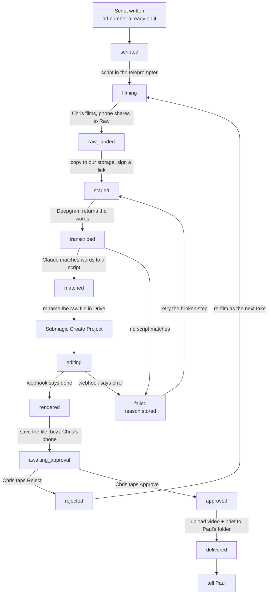

# The Fundhub video pipeline — the plan

Written 2026-09-22. The facts here come from `docs/specs/video-pipeline-api-verification-2026-09-22.md`
(the owner's API research). The 4K rule comes from `.claude/rules/video-4k-unless-ad.md`. The ad
number rules come from `db/migrations/286_client_ad_attribution.sql` and `docs/ads/registry.json`.

Settled: one ad number = one finished video. The pipeline ends when the finished video lands in
Paul's shared Drive — Paul pushes to Meta, we never touch Meta. Paul gets the approved video, never
raw takes. About 100 ads a month. Chris films and approves. Nothing else.

> Superseded by docs/specs/marketing-machine-2026-10-04.md (owner-approved 2026-10-05): the approved video still lands in the finished-ads folder (paul-submagic), and spec v3 also loads it into Meta as a paused ad (§2 item 11, M4); only Chris turns ads on, pauses them or changes budgets (§2 item 6).

---

## 1. The picture, start to finish

| # | Step | Who does it |
|---|---|---|
| 1 | Write the script. It already carries its ad number. | Agent |
| 2 | Put the script in the teleprompter app | Agent, or a paste (see §6) |
| 3 | **Film it** | **Chris** |
| 4 | Share the take into the Raw Drive folder | Phone, one tap |
| 5 | Spot the new file | Worker, checks Drive every 2–5 minutes |
| 6 | Copy the file into our own storage and make a short-lived link | Worker |
| 7 | Turn the talking into words | Deepgram |
| 8 | Match those words to a script. Now we know the ad number and the take number. | Claude |
| 9 | Rename the raw file so it says what it is | Worker |
| 10 | Send it to Submagic for captions and B-roll | Worker |
| 11 | Submagic finishes and pings us back | Submagic webhook |
| 12 | Save the finished video. Buzz Chris's phone. | Worker |
| 13 | **Approve or reject** | **Chris** |
| 14 | Put the video and its one-page brief in Paul's folder | Worker |
| 15 | Tell Paul it is there | Worker |

Chris touches step 3 and step 13. That is the whole job.

---

## 2. Build order — back end first (CLAUDE.md §3a)

### (1) The ad record

Nothing that exists fits. `ads` (`046_ad_platforms.sql:282`) mirrors what is live on Meta, and we do
not publish to Meta. `ad_scripts` (`377_marketing_label_spine.sql:160`) holds the words. So the new
table holds the **film** and points at the script.

New migration: `db/migrations/389_ad_videos.sql`. One row is **one take**, never overwritten — the
same shape `ad_scripts` uses for rewrites.

Locks that live in the database, not in a screen:

- `UNIQUE (org_id, ad_id, take_no)` — a take number is used once.
- `UNIQUE (org_id, ad_id) WHERE status IN ('approved','delivered')` — **one ad number, one finished
  video.** The database refuses a second one.
- `CHECK (ad_id ~ '^(0|[1-9][0-9]{0,8})$')` — no leading zeros. See the warning in §4.
- `CHECK (video_kind <> 'not_ad' OR height IS NULL OR height >= 2160)` — the 4K law, enforced. A
  1080p file that is not an ad cannot be saved as finished.

### The states, and what fires each change

| State | Plain meaning | What fires the move in |
|---|---|---|
| `scripted` | words exist, ad number assigned | the script row gets an ad number |
| `filming` | script is in the teleprompter | pushed or pasted |
| `raw_landed` | a video showed up in Raw | Drive poll sees a new video file, size above zero |
| `staged` | copied to our storage, link ready | the copy finishes |
| `transcribed` | we have the words | Deepgram answers |
| `matched` | we know which ad and which take | Claude matches above the confidence line |
| `editing` | Submagic has it | Create Project returns a project id |
| `rendered` | the finished file exists | the Submagic webhook says done |
| `awaiting_approval` | waiting on Chris | we saved the finished file |
| `approved` | Chris said yes | **Chris. Only a person may do this.** |
| `delivered` | video and brief are in Paul's folder | both uploads finish |
| `rejected` | Chris said no — re-film as the next take | Chris |
| `failed` | a step broke, reason stored | any worker error |

### (2) Read endpoint, then the test that proves it

`GET /api/ad-videos?status=awaiting_approval`. Three traps from CLAUDE.md §12 apply:

- A handler file is not a route. Add it to the `ROUTES` map in `netlify/functions/api.mjs`.
- Tests only run under `src/**` and `scripts/**`. Test goes at `src/http/ad-videos.pg.test.mjs`.
- Gate with `requireAuth`, then `requireRole`. `requireAuth` ignores a `roles` key.

### (3) The state diagram

§5 below. `docs/journeys/ad-video-flow.md` gets the same picture when the code lands.

### (4) The worker steps

One Inngest workflow per step, each moving the row one state forward, each safe to run twice:

Drive watch → copy to our storage and sign a link → Deepgram → Claude match → rename in Drive →
Submagic create → webhook lands → save the finished file → buzz Chris → (Chris approves) → upload
to Paul's folder + write the brief → tell Paul.

Poll Drive every 2–5 minutes. Push channels expire in 7 days and do not renew themselves, so polling
is the simple, reliable trigger.

### (5) The front end, last and throwaway

One screen: the finished videos waiting, each with a play button, **Approve** and **Reject**. That is
all. **It is throwaway on purpose.** If the table above is right it rebuilds in an hour, and a phone
notification with two links would do the same job.

---

## 3. The ad record, written out

| Field | What it holds | Example |
|---|---|---|
| `id` | this row's own key | `9f3c…` |
| `org_id` | the Fundhub org | `…` |
| `partner_id` | whose video. Chris's own = the house partner from 377 | `fundhub-house` |
| `ad_id` | the ad number that goes in `utm_content`. Text. Never padded. | `43` |
| `take_no` | which filming attempt, counting from 1 | `2` |
| `script_id` | the `ad_scripts` row it was filmed from | `…` |
| `video_kind` | `ad` or `not_ad`. Decides 1080p vs 4K. | `ad` |
| `status` | where it is in the list above | `awaiting_approval` |
| `drive_raw_file_id` | the raw take's file id in Drive | `1AbC…` |
| `storage_raw_key` | our own copy of the raw file | `raw/2026/09/043_t02.mp4` |
| `raw_signed_url` | the short-life link handed to Submagic and Deepgram | `https://…?X-Amz…` |
| `transcript` | the words Deepgram heard | `"Most people apply in the wrong order…"` |
| `match_confidence` | how sure we are it is that script, 0–100 | `96` |
| `submagic_project_id` | Submagic's id for the edit | `proj_8sk2…` |
| `submagic_download_url` | the finished .mp4 link from the webhook | `https://…/out.mp4` |
| `storage_final_key` | our own copy of the finished file | `final/043_t02_v1.mp4` |
| `finished_version` | which cut of this take. Starts at 1. | `1` |
| `drive_final_folder_id` | Paul's folder for this ad number | `1Pqr…` |
| `drive_final_file_id` | the finished file inside it | `1XyZ…` |
| `duration_seconds` | how long it runs — this is the Submagic minute bill | `102` |
| `width` / `height` | the finished picture size | `1920` / `1080` |
| `approved_at` / `approved_by` | when Chris said yes, and who | `2026-09-23 10:04` / `chris` |
| `rejected_reason` | why a take was binned | `stumbled at 0:12` |
| `failure_reason` | what broke, when `status = failed` | `Submagic 422: videoUrl not downloadable` |
| `created_at` / `updated_at` | bookkeeping | |

---

## 4. Paul's folder, and the naming

Paul's shared Drive:

```
Fundhub Ads /
  043 /
    043_t02_final_v1.mp4
    043_brief.pdf
```

Our Raw folder, which Paul never sees:

```
Fundhub Raw /
  043_t01_raw_2026-09-23.mp4
  043_t02_raw_2026-09-23.mp4
```

The rules:

- `043` — the ad number, padded to three digits **so the folders sort in order**.
- `t02` — take two. Every attempt gets a number, counting up, never reused.
- `final_v1` — the first finished cut of that take. Re-edit the same take → `v2`. Re-film → a new
  take number, back at `v1`.
- **Only one finished file ever sits in `043/`.** A new cut replaces it; old cuts stay in our
  storage. That is how "one ad number, one video" stays true on Paul's screen.
- `043_brief.pdf` holds the ad number, hook, headline, primary text, and the landing link with
  `utm_content` set to the ad number.

**⚠️ Never pad the number inside the link.** `fundhub_ad_id()` returns **text**, not a number
(`286_client_ad_attribution.sql:81-84`), so `utm_content=043` and `utm_content=43` become two
different ads and one ad's results split in half. The brief's link reads the number from the
database, never from the folder name.

---

## 5. The state diagram



---

## 6. The first five, done by hand

Nothing is automated until a person has walked five ads through by hand and written down what
happened. Pick five ad numbers that already have locked scripts. For each one:

1. Put the script in the teleprompter. Note how long the paste took.
2. Chris films it. Note the take number of the one he keeps.
3. Share it to the Raw folder. Note the file name the phone gave it.
4. **Check the picture size.** Write down the real width and height. This settles the 4K question.
5. Copy it to our storage by hand. Make a signed link. Open that link in a browser — if it does not
   play, Submagic will not take it either.
6. Send it to Submagic with `autoRender` on, silence-cutting **off**, bad-take removal **off**, and
   no AI B-roll. Note the minutes it billed.
7. Time how long the render took.
8. Chris watches it and says yes or no. Note how many were yes first time.
9. Make the folder `0NN/`, put the video and a brief in it, using the names in §4.
10. Message Paul.

Write all of it into `docs/workflows/video-pipeline-manual-5.md`.

**It is a pass when all five are true:**

- All 5 finished videos are in Paul's folder with the right names and a brief.
- Paul confirms he can open, download and use every one of them.
- Captions needed 2 or fewer fixes on each video.
- The real billed minutes are written down, so the monthly bill can be worked out.
- The real picture size is written down for every take.

If any one fails, fix it by hand and run five more. Never automate a step that has not worked once.

---

## 7. What gets automated, in order

**First — the boring middle.** Spot the new file, copy it, sign the link, transcribe, match, rename,
send to Submagic, catch the webhook, save the finished file, buzz Chris.
*Trigger: the manual five passed.*

**Second — delivery.** After Chris approves: make Paul's folder, write the brief, upload both, tell
Paul.
*Trigger: 20 videos through step one with no hand-holding.*

**Third — the approvals screen.** Only if a phone notification with two links is not enough.
*Trigger: Chris says approving on his phone is annoying.*

---

## 8. What is wrong or missing in the picture

**A Drive link cannot be given to Submagic.** Drive puts a virus-scan page in front of files over
25 MB, and Submagic rejects share links outright. Every take is copied to our own storage (Cloudflare
R2 or S3) and handed over as a signed link. That same link feeds the transcriber.

**Composer 2.5 cannot be in this.** It is Cursor's coding model — text only, inside Cursor, no API.
Claude matches the words to a script and writes the Submagic settings.

**The B-roll timing risk, and our pick.** Submagic never says whether B-roll times are measured on
the original video or on the shortened one after auto-cutting. So we take the option where the
question cannot come up: **leave silence-cutting and bad-take removal off.** The timeline never
changes, so times cannot drift. It is also one API call instead of four, and exports are capped at
50 an hour. Our ads are 1–2 minute scripted takes and do not need auto-cutting.

**BigVU caps at 1080p and the 4K law says otherwise.** 1080p is fine for paid ads. It is **not** fine
for a VSL, portal video, testimonial or walkthrough — those must be 4K. BigVU's own staff say Full HD
is the maximum, and adding subtitles downscales. So BigVU cannot be the only camera, and the size
check happens on the real phone before filming, not after.

**BigVU or Teleprompter.com.** BigVU has no API, no webhook, no Zapier — the script goes in by hand,
100 pastes a month, which breaks "Chris only films and approves." Teleprompter.com has a connector on
Chris's account, so the push could be automatic. Nobody has proven that connector can push a script,
or what size it exports. Test both during the manual five.

**AI B-roll does not work at this volume.** 3 credits per clip, 15 credits a month = **five clips a
month**, for 100 ads. So AI B-roll is off. We use our own clips (`user-media`), which cost no
credits, and that means building a house B-roll library. Reviewers also say the automatic B-roll
picks footage unrelated to the words, so this is the better choice anyway.

**100 API minutes a month versus 100 ads.** The locked Haynes ads run 1:37 and 1:46 — call it 1.7
minutes each. 100 ads is about **170 minutes**, 70 over the included 100, metered at $0.10 to $0.15.

**One ad number = one whole video is a build rule now.** The risk is already recorded: "the five
straight offer ads share nearly the same middle section. Different hooks on one body reads as a
single creative" (`docs/ads/fundhub-297/FundHub-LOCKED-ADS.md`, Open Items), and "15–20+ diverse
creatives a week minimum — diverse in *message*, not fifteen edits of one video"
(`docs/ads/ascension-ads.md:175`). So the writer produces 100 whole scripts, each around one reason
to buy. The database enforces the filming half: one finished video per ad number.

**The ad number must exist before filming.** Matching a take to a script is what gives the file its
number. No number on the script means no number anywhere downstream.

**Our Drive code cannot write.** `src/company-brain/drive-client.mjs` is read-only by design —
"this module never writes, deletes, or moves." Writing into Paul's folder is new code.

**Grab the finished file the second the webhook lands.** Submagic does not say how long its link
lives.

**We already have phone notifications.** `src/push/send.mjs` exists — use it before adding ntfy or
Pushover. Not text messages: US carrier registration takes 2 to 6 weeks.

### The monthly cost at 100 ads

| Thing | What the research says | At 100 ads a month |
|---|---|---|
| Submagic Business + API | $69/month, or $41/month paid yearly | $69 or $41 |
| Extra Submagic minutes | 100 included, then $0.10–$0.15 each | about 70 over = **$7 to $11** |
| AI B-roll | 3 credits each, 15 credits a month | we do not use it: **$0** |
| Recorder app | not priced in the research | **unknown — check before signing** |
| Deepgram, Claude, storage | not priced in the research | small, but **not measured. No number quoted.** |

**What we can stand behind: about $76 to $80 a month billed monthly, or about $48 to $52 a month
paid yearly, plus the recorder.** The rest is unmeasured, and stays that way until it is measured.

---

## 9. Open questions for Chris

1. Which recorder — BigVU, where you paste the script 100 times a month, or Teleprompter.com, where
   it might push by itself but nothing is proven yet?
2. What films the 4K videos, since BigVU tops out at 1080p and only paid ads may be 1080p?
3. Submagic — $69 a month, or $41 a month if we pay for the year up front?
4. Who builds our own B-roll clip library, and do the first five ads run with no B-roll at all?
5. Do you approve on a screen in the app, or by tapping a link in a phone notification?
