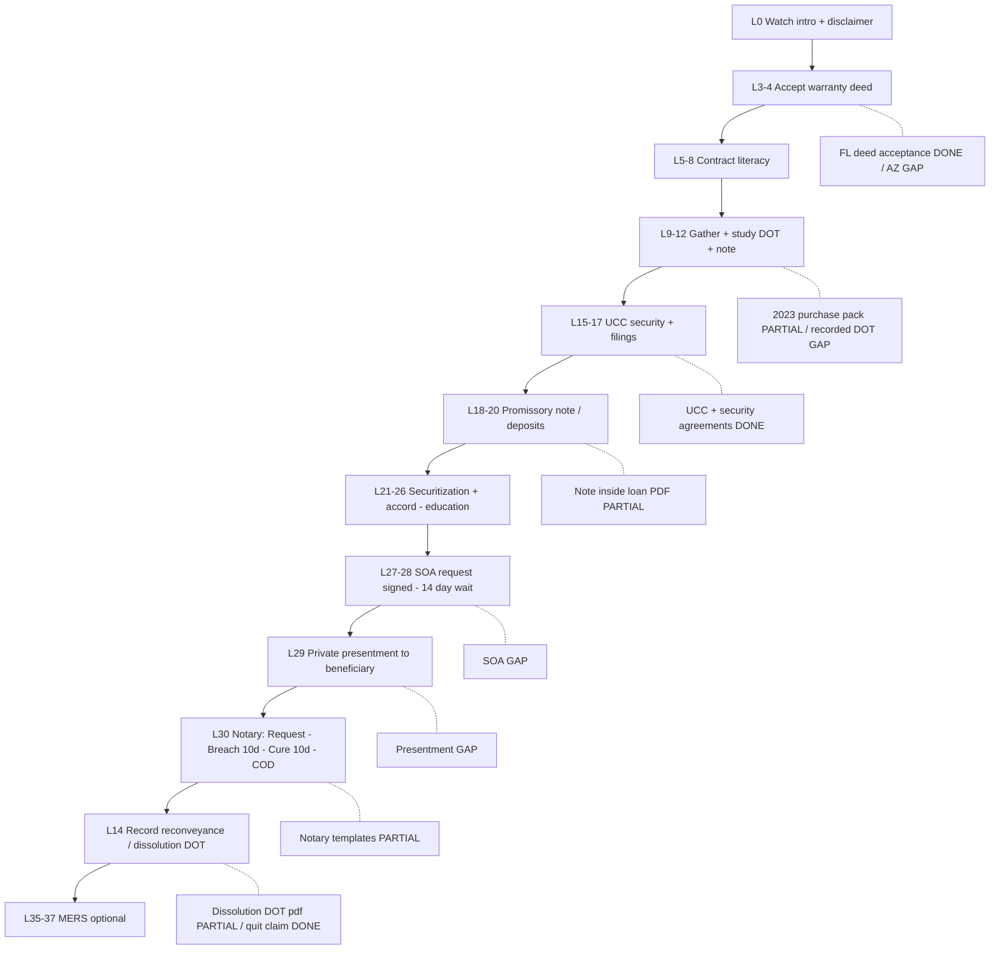

# Mortgage Re{CON}veyance — course ↔ documents (merged A1–A10)

**Property (doc index):** 7137 E Rancho Vista Dr Unit 4011, Scottsdale AZ  
**Course:** `Bryan-Stay-Strong-Thinkific-Course-Export.zip` → `course-material/` (37-lesson main track)  
**Drive:** [Reconveyance](https://drive.google.com/drive/folders/1coNo39Vbm7830hyOct-Gcn23UWHqYElF) · [Mortgage Information](https://drive.google.com/drive/folders/1_6EHl85i3j74AM4GgnmHNhHKh0gSlizw)

**Status:** DONE = doc in Drive matches step · PARTIAL = related doc, step incomplete · GAP = course step, no doc · COURSE = lesson only

---

## End-to-end step-by-step (course order)

| Step | Course (lesson / MOD) | What the course says to do | Your documents (if any) | Status |
|------|------------------------|----------------------------|-------------------------|--------|
| 0 | L1–2 Intro, Disclaimer | Watch; not legal advice | — | COURSE |
| 1 | L3–4 MOD1 Deed acceptance | Know 3 core docs: **warranty deed**, **deed of trust**, **promissory note**. Focus deed: **sign → seal → attest → deliver → grantee accepts** | **FL:** DEED ACCEPTANCE folder, Acknowledgment & Acceptance, warranty deed 11/27/2024 (Cooper City). **AZ #4011:** no acceptance packet in index | PARTIAL (FL only) |
| 2 | L5–8 MOD2 Contracts | Contract elements, offer/acceptance, holder in due course, meeting of the minds | No standalone contract packet in Drive | GAP |
| 3 | L9–12 MOD3 DOT | Learn deed of trust / mortgage; walk a **DOT example** | **4 Purchase 2023** — Change Lending loan **#6000041372**, title commitment, purchase contract, digisign 04-11-2023 | PARTIAL |
| 4 | L13–14 MOD3 Daly | Case study (education) | — | COURSE |
| 5 | L15–16 MOD4 Security / UCC-1 | Security interest; prepare **UCC financing statement** | **2 UCC** — Security Agreement (Trust Google Doc + Trust No. 2 PDF, 07/15–07/16/2025) | DONE |
| 6 | L17 MOD4 UCC filing | File / search (course shows UCC-1 + **UCC-11** info request) | **2 UCC** — MD UCC-1 **250711-1908000** (07/11/2025); UCC-3 **250717-0039001** (07/17/2025); AZ UCC-1 p1 | DONE |
| 7 | L18–20 MOD5 Promissory note | Note example, recorded example, **deposits** | Inside **Change Lending** loan PDFs (not split out in Drive) | PARTIAL |
| 8 | L21–23 MOD6 Securitization | Collateral + securitization (education) | — | COURSE |
| 9 | L24–26 MOD7 Accord & satisfaction | Conditional acceptance / accord (education + case law) | No accord/SAT mail in Drive | GAP |
| 10 | L27–28 MOD8 Statement of account | **Signed** SOA request (UCC 9-210); creditor **14 days** to respond; if no reply → default notice (SOA2) | No SOA request / default letter / certified receipts in Drive | GAP |
| 11 | L29 MOD9 Presentment (private) | **First action is always presentment** — put beneficiary on notice; ask them to prove relationship / perform | No private presentment + mail proof in Drive | GAP |
| 12 | L30 MOD9 Notary track | After ignored presentment: **Request for Notarial Presentment** → notary mails **Notice of Breach** (10 days) → **Opportunity to Cure** (10 days) → **Certificate of Dishonor** (keep certified mail receipts) | Templates: **Notary Presentment Bryan** + **6 Notary Presentment - *** (Google Docs). Not filled for #4011 lender in folder | PARTIAL (templates only) |
| 13 | L31–34 MOD10 Process | Big picture + webinar + “mortgage process explained” | **Untitled document** (reconveyance outline); **033/034** transcripts in ZIP | PARTIAL (notes + course) |
| 14 | L33–34 + L30 aftermath | **Reconveyance / release DOT** — trustee path after dishonor + payment proof | **DISSOULUTION OF DEED OF TRUST 2.pdf** (Recon + Mortgage **3 Deed folder**). Recording receipt not in folder | PARTIAL |
| 15 | L35–37 MOD11 MERS | MERS / assignment / memorandum (optional depth) | — | COURSE |
| — | Index §1 Recorded | Public record chain for #4011 | Quit claim **20240645099** (12/04/2024 CJS → Trust); HOA judgment **20250175833** | DONE |
| — | Index STILL MISSING | Pull from Maricopa Recorder | Recorded **DOT**; **warranty deed into CJS**; **trustee’s deed to Second Chance** | GAP |
| — | Index §5 Related | Parallel disputes | HOA stmt **08/01/2025** $44,487.61; Second Chance motion **CC2025058680** | DONE |
| — | Recon extras | Admin / collateral (course ties loosely to MOD5–6) | **BILL OF SALE KW 2.pdf**; **REVOCATION OF POWER OF ATTORNEY.pdf** | PARTIAL (no step label in index) |

---

## Flowchart (course order + your status)

---

## Where you are on the path (plain)

You are **past MOD4 (UCC filed)** and **MOD3 partial (2023 purchase file)** for Scottsdale. You have **not** shown Drive proof for **SOA (MOD8)**, **private presentment (L29)**, or **executed notary mail chain (L30)**. **Reconveyance instrument** exists as PDF; **recording** not shown. **Deed acceptance** docs match **Florida**, not the #4011 index line. **Three recorder pulls** still missing per your own index.

---

## Agent manifests

All ten lanes merged into this file (2026-10-05). No further parallel agents required unless Drive gets new uploads.
