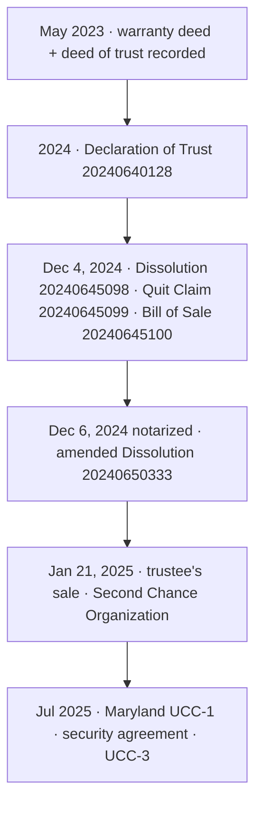

# Mortgage Re{CON}veyance — course ↔ documents, example property #4011

**Example property #4011 only.** This board illustrates Part B of the SOP. The process itself (any property, any state) is Part A of `docs/sops/mortgage-reconveyance-playbook-2026-10-05.md`. Step numbers here match the SOP.

**Example property:** 7137 E Rancho Vista Dr Unit 4011, Scottsdale AZ 85251 — see `credentials/drive-course-docs-temp/INDEX.txt`
**Course:** `Bryan-Stay-Strong-Thinkific-Course-Export.zip` → `course-material/` (37-lesson main track + 4 extra tracks)
**Drive:** [Reconveyance](https://drive.google.com/drive/folders/1coNo39Vbm7830hyOct-Gcn23UWHqYElF) · [Mortgage Information](https://drive.google.com/drive/folders/1_6EHl85i3j74AM4GgnmHNhHKh0gSlizw)

**Status:** DONE = paper on file for the step · PARTIAL = related paper, step not finished · GAP = no paper · COURSE = nothing to file · OUR = our own paper, not taught by the course

**Order source:** Bryan's doing order comes from the lesson 33 webinar (his whole Henderson County file, closing to recorded reconveyance, plus its Q&A), not from lesson order. 26 steps + optional MERS check.

---

## Status by step (synced with SOP Part B3)

| Step | Course lessons | What the step needs | #4011 files | Status |
|---|---|---|---|---|
| 1 | 1, 2, 14 | Watch intro and disclaimer | — | COURSE |
| 2 | 12, 33 | Full county record list, with numbers and dates | INDEX §1 + 7 recorded copies in `maricopa/` + the quit claim PDF; 20240459062 and 20250044789 not on the list; no date for 20240640128 or 20250175833 | PARTIAL |
| 3 | 3, 21 | Read the warranty deed | 20230247849 | DONE |
| 4 | 5–12, 33 | Deed of trust notes sheet | 20230247850 on disk; no notes sheet | PARTIAL |
| 5 | 18, 21, 33 | Note copy + closing-papers request | 2023 purchase file (loan #6000041372); no note for loan 68846; no request on file | PARTIAL |
| 6 | 3, 4, 8, 33 | Recorded deed acceptance | INDEX §3 Deed folder files, not yet reviewed; acceptance text on disk is a different Florida property; no recording for #4011 | GAP |
| 7 | (33) | OUR: trust papers recorded | Declaration of Trust 20240640128 · Quit Claim 20240645099 · Bill of Sale 20240645100 (only 099 in INDEX; Bill of Sale p1 spells "STANBRIDGELIVING") | PARTIAL (OUR) |
| 8 | 16, 17, 33 | Certified UCC-11 search | none | GAP |
| 9 | 15, 16, 33 | UCC-1 package recorded at county, then filed | MD UCC-1 250711-1908000 · UCC-3 250717-0039001 · AZ UCC-1 p1 · security agreements; no county-recorded package | PARTIAL |
| 10–13 | 24–26, 33 | Dispute letter, conditional acceptance, money orders ×3, 90-day wait | none | GAP |
| 14–17 | 27, 28, 33 | Statement of account, 14-day wait, default notice, notice of dishonor | none | GAP |
| 18–21 | 29, 30, 33 | Notary request, Notice of Breach, Opportunity to Cure, Certificate of Dishonor | Texas 2022 sample templates only | GAP |
| 22–23 | 19, 33 | Recorded notice, note, fee schedule, certificate; 2-week wait | none | GAP |
| 24 | 11, 33 | Recorded substitution of trustee for reconveyance | none; no REL D/T found | GAP |
| 25 | (33) | OUR: end papers | Dissolution 20240645098 (12/04/2024) + amended re-recording 20240650333 (notarized 12/06/2024); Deed of Reconveyance in INDEX only as still missing; Revocation of POA not on this Mac | PARTIAL (OUR) |
| 26 | 33 | File kept; later letters answered | Related: trustee's deed 20250110468 (auction 1/21/2025), HOA judgment 20250175833, HOA stmt 08/01/2025 $44,487.61, case CC2025058680 | PARTIAL |
| M | 35–37 | MERS check | DOT page 1 names Center Street Lending VIII SPE as beneficiary; MERS not named on page 1 | PARTIAL |

---

## Keep separate

| Item | What it is | Status |
|---|---|---|
| County-recorded REL D/T or deed of reconveyance for #4011 | Not found (INDEX "Still missing"; no release on disk) | GAP |
| Deed of Dissolution of Deed of Trust 20240645098 and amended 20240650333 | Recorded, but not a REL D/T; neither cites DOT 20230247850 | OUR, recorded |
| "Dissolution of Deed of Trust 2" | Draft listed in INDEX §3; not on this Mac; not a recording | draft |
| Florida (Broward County) acceptance + warranty deed to trust, 11/27/2024 | A different property and owner | not #4011 |

---

## What was filed, in date order (#4011)

Compared with Bryan's order: the end papers (step 25, the dissolutions) were recorded 12/04/2024, the same minute as the step 7 quit claim; in Bryan's order they come last. Steps 10–23 have no papers. The UCC filings (step 9) came after the trustee's sale.

---

## INDEX vs recorded copies

- Fixed (typo, proven by the recorded deed of trust): lender name is **Center Street Lending VIII SPE, LLC** (INDEX had "SPE VIII" on two lines).
- Not changed (content, reported only): INDEX ties DOT 20230247850 to "Change Lending purchase loan #6000041372." The recorded DOT shows Loan Number 68846 and never names Change Lending.
- INDEX "recorded 02/28/2025" for trustee's deed 20250110468: 2/28/2025 is the signing date on the copy; the stamp is covered.
- Recordings on disk not listed in INDEX §1: 20240640128, 20240645098, 20240645100, 20240650333.

---

## Agent manifests

- **2026-10-05 (Claude Code, Opus) — SOP rewrite.** 11 reader agents extracted all 37 main lessons + 4 extra tracks + templates + recorded PDFs; 11 checker agents re-verified every step and quote against the transcripts; 3 more checkers then tested the written SOP (27 fixes applied, incl. moving the 2-week wait to after the recordings). Files: `docs/sops/mortgage-reconveyance-playbook-2026-10-05.md` (Part A process, Part A2 lesson guide, Part B example), this board, `scripts/mortgage-recon-playbook-export-drive.mjs` (generic PDF title, diagrams drawn in the PDF), `credentials/drive-course-docs-temp/INDEX.txt` (two typo fixes, gitignored). Journeys impacted: none.
- Earlier: the ten A1–A10 lanes merged into this file (2026-10-05).
