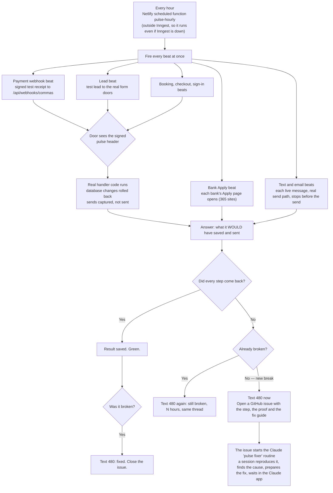

# The pulse — the company tests itself every hour (2026-10-09)

Chris's words: the heartbeat sends a pulse through the whole system and checks it comes back. Tripwires tell you after something breaks. Pulses find the break before a customer touches it.

Owner answers (2026-10-09, in chat):

| Question | Answer |
|---|---|
| How often | Every hour |
| What it runs | The real live code, not fake customers |
| How far it goes | **A** — all the way through the real door (a test signal arrives like a real one; the door has a "pulse, do not save" switch) |
| Speed | About half a second as the goal. Honest number: 1 to 3 seconds for the whole pulse, because each database or vendor read takes about a tenth of a second |
| When it breaks | Text 480 right away, then every hour until fixed, then once when fixed |
| What the text carries | The fix, not just the problem |
| Where the work happens | **B** — a Claude session starts on its own and waits in the Claude app with the problem and fix ready |
| Who fixes | Claude (sometimes Cursor). Not Grok, not Composer |
| Standard | Every new build ships with its pulse, its tripwire, its tests and its wiring, or the build fails |

## How one pulse works

## What gets built

| Piece | File(s) | What it does |
|---|---|---|
| Beat contract | `src/pulse/beats/*.mjs`, literal list `src/pulse/beats/index.mjs` | Each beat: `id`, the surfaces it covers, `run(ctx)` → `{ ok, step, detail }`, and a written `fixGuide` (likely causes + steps). A beat with no fix guide fails its test. |
| Pulse switch on the doors | `src/http/pulse-switch.mjs`, wired in `netlify/functions/api.mjs` | A request with a valid signed `x-fundhub-pulse` header (HMAC of `PULSE_SECRET`, under 5 minutes old) runs the real handler with a database whose changes are rolled back and senders that record instead of send. A wrong or old signature is a normal request. |
| Hourly runner | `netlify/functions/pulse-hourly.mjs` | Runs every beat at once, saves results, opens and closes incidents, texts. |
| Records | migration: `pulse_beats` (each result), `pulse_incidents` (one open row per broken beat) | Proposed below. |
| Alerts | `src/pulse/beats/alerts.mjs`, `src/messaging/providers/github-issues.mjs` | Text 480 on new break, every hour while broken, once when fixed. One GitHub issue per break, label `pulse`, closed when green. |
| Fixer routine | Claude routine "Pulse fixer", fired by a GitHub `issues.opened` event with label `pulse` | Starts a Claude session on the repo: reproduce with the beat, find the root cause, prepare the fix on a branch, comment the cause and the fix on the issue, wait for Chris. |
| Standard | `.claude/rules/heartbeat-on-every-build.md` + `.cursor/rules/…` | Every money or customer surface in `TRIPWIRES` must also name a beat. `src/pulse/tripwires.test.mjs` fails the build without it. |

First beats (Chris's three examples first, then the launch path): payment webhook (Commas), bank Apply pages, text send path, email send path, lead capture (survey-submit, slo-interest, ClickFunnels hook), roadmap checkout mint, booking hook and confirm, portal sign-in link.

## Proposed records (schema)

`pulse_beats` — one row per beat per hour.
- `id` uuid, `org_id` uuid, `run_id` uuid (one hourly run), `beat_id` text, `ran_at` timestamptz, `ok` boolean, `step` text (where it stopped), `detail` text, `duration_ms` integer.
- Kept 30 days (owner can change), then deleted by the runner.

`pulse_incidents` — one open row per broken beat.
- `id` uuid, `org_id` uuid, `beat_id` text, `opened_at`, `last_alert_at`, `alerts_sent` integer, `closed_at` (null while open), `first_detail` text, `github_issue_number` integer, `github_issue_url` text, `claude_session_url` text.
- At most one open incident per beat (unique index where `closed_at` is null).

Both: row security on, staff only, same as `job_heartbeats`.

## Split

| # | Workflow | Owns | Waits on |
|---|---|---|---|
| 0 | Contract (Claude, Opus) | Beat contract, pulse switch, the migration | nothing |
| 1 | Runner and alerts (Sonnet) | `pulse-hourly`, records, incidents, texts, GitHub issue provider, tests | 0 |
| 2 | Beats (Sonnet, one agent per beat, each with a checker) | The beats and their doors' pulse wiring, fix guides, PASS and FAIL tests | 0 |
| 3 | Routine, rule, proof (Claude, Opus) | Pulse fixer routine and its GitHub trigger, the standard, the picture, end-to-end proof from a built bundle, ship, one test text | 1, 2 |

1 and 2 run at the same time. 3 waits for both.

Model: Sonnet for 1 and 2 (back end), Opus for 0 and 3 (contract, routine, rule). Current: Opus. Match.

## Status

| # | Status |
|---|---|
| 0 | claimed 2026-10-09 ~03:00 — Chris said go. Grounding (6 readers) → contract spec (Opus) → critic (Opus). Output: ops/workflows/pulse-layer-2026-10-09-brief/*.md and pulse-layer-2026-10-09-contract.md. Learning loop added: every closed incident records cause_category, cause_note, fix_summary, guard_added; the fixer appends docs/lessons/pulse-lessons.md in its PR. |
| 1 | pending — waits on 0 |
| 2 | pending — waits on 0 |
| 3 | pending — waits on 1 and 2 |

## Leftovers

- `scripts/github-push-whole-repo.mjs` pushes `main` with `--force-with-lease`. After a fetch the lease passes, so it can overwrite commits another session pushed. It did at about 02:00 on 2026-10-09 (two TODO commits, restored by merge in 1d37d819). Not changed here.
